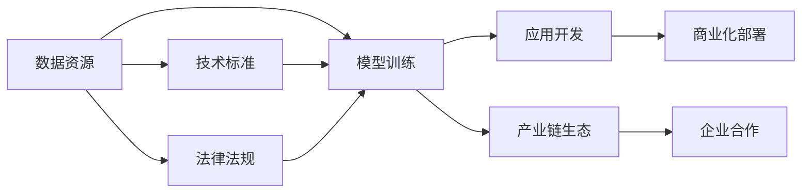

                 

# LLM产业链生态:从无到有的蝶变

> 关键词：大语言模型,自然语言处理,NLP,产业链,生态系统,技术创新,企业合作,学术研究,产业链生态

## 1. 背景介绍

### 1.1 问题由来

近年来，人工智能（AI）技术快速发展，尤其是自然语言处理（NLP）领域，以大型预训练语言模型（Large Language Models, LLMs）为代表的技术在诸多实际应用场景中取得了显著成效。大语言模型如GPT-3、BERT等，通过在庞大语料库上进行预训练，学习了丰富的语言知识和常识，能够进行复杂的语言理解和生成，为各行各业带来了革命性的改变。然而，这些技术的落地应用并非一帆风顺，其中最大的挑战在于如何构建一个健康、可持续的产业链生态系统。

### 1.2 问题核心关键点

构建大语言模型产业链生态系统的核心关键点在于以下几个方面：

1. **数据资源的获取与利用**：大语言模型依赖于大规模、高质量的文本数据进行预训练，如何获取和利用这些数据是生态系统的基础。
2. **技术标准的制定**：缺乏统一的技术标准可能导致模型间不兼容，影响生态系统的健康发展。
3. **企业合作与资源共享**：单个企业难以独立完成从预训练到应用的所有环节，需要跨领域、跨企业的合作与资源共享。
4. **法律法规与伦理考量**：大语言模型的应用可能涉及隐私、安全、伦理等多方面的法律与道德问题，需要建立相应的法律法规框架。

### 1.3 问题研究意义

研究如何构建大语言模型产业链生态系统，对于推动人工智能技术在NLP领域的广泛应用，保障数据安全和隐私，促进技术标准化和法规合规，具有重要的现实意义。它不仅有助于解决当前大语言模型应用中存在的问题，还为未来的技术发展和企业合作提供了指导和方向。

## 2. 核心概念与联系

### 2.1 核心概念概述

本节将介绍构建大语言模型产业链生态系统所需的关键概念及其相互联系。

- **大语言模型（Large Language Models, LLMs）**：通过在大量无标签文本数据上进行自监督预训练，学习通用语言表示的深度学习模型，能够进行复杂的语言理解和生成。
- **自然语言处理（NLP）**：研究计算机如何理解、处理和生成人类语言的技术领域。
- **产业链生态（Industry Chain Ecosystem）**：围绕大语言模型的整个价值链，从数据收集、模型训练、应用开发到商业化部署的全过程。
- **技术标准（Technical Standards）**：包括模型结构、数据格式、接口规范等，确保模型间兼容性和互操作性。
- **企业合作（Corporate Collaboration）**：不同企业间基于共同目标和技术优势的合作，共同推动产业链发展。
- **法律法规（Legal and Regulatory Frameworks）**：与数据隐私、安全、伦理相关的法律法规，保障模型应用的安全合规。

这些概念之间的关系可以通过以下Mermaid流程图来展示：



这个流程图展示了数据资源如何驱动模型训练，应用开发和商业化部署，同时技术标准和法律法规对产业链生态的支撑作用，以及企业合作在构建健康生态中的重要性。

## 3. 核心算法原理 & 具体操作步骤
### 3.1 算法原理概述

构建大语言模型产业链生态系统的核心算法原理主要基于以下几点：

1. **预训练模型**：通过在无标签文本数据上自监督学习，大语言模型学习到通用的语言表示，具备强大的语言理解和生成能力。
2. **微调（Fine-tuning）**：在预训练模型的基础上，通过有标签数据进行微调，使其适应特定任务，提升模型在特定领域的性能。
3. **迁移学习（Transfer Learning）**：利用预训练模型的通用知识，在特定任务上快速适应，减少从头训练的计算成本和时间。
4. **参数高效微调（Parameter-Efficient Fine-Tuning, PEFT）**：在微调过程中只更新部分模型参数，减少计算资源消耗，提高微调效率。
5. **提示学习（Prompt Learning）**：通过在输入文本中添加提示模板，引导模型按期望方式输出，减少微调参数，提高模型的灵活性。

### 3.2 算法步骤详解

构建大语言模型产业链生态系统的具体操作步骤如下：

**Step 1: 数据收集与预处理**

1. **数据获取**：收集大规模、高质量的文本数据，涵盖各种语言、领域和风格。
2. **数据清洗**：去除噪声、处理缺失值、标准化文本格式等，确保数据质量。
3. **数据划分**：将数据划分为训练集、验证集和测试集，用于模型训练、调优和评估。

**Step 2: 模型训练与微调**

1. **模型选择**：选择合适的预训练模型（如BERT、GPT等），或者自训练新模型。
2. **微调准备**：添加任务适配层，选择合适的损失函数，设置微调超参数（如学习率、批次大小等）。
3. **模型训练**：使用训练集对模型进行有监督的微调训练，确保模型适应特定任务。
4. **验证与调整**：在验证集上评估模型性能，根据验证结果调整模型超参数。
5. **测试与部署**：在测试集上评估最终模型性能，部署模型到实际应用环境中。

**Step 3: 应用开发与集成**

1. **应用设计**：根据实际需求，设计应用场景和用户界面。
2. **模型集成**：将微调后的模型集成到应用中，提供自然语言处理服务。
3. **接口开发**：开发API接口，方便第三方应用调用。
4. **性能优化**：通过数据增强、模型压缩等技术，提升应用性能。

**Step 4: 产业链生态构建**

1. **技术标准制定**：制定统一的模型标准、数据格式、接口规范等，确保模型间的兼容性和互操作性。
2. **企业合作与资源共享**：通过联盟、开源等方式，促进企业间的合作与资源共享，推动技术创新和应用落地。
3. **法律法规与伦理规范**：建立与数据隐私、安全、伦理相关的法律法规，确保模型应用的安全合规。

### 3.3 算法优缺点

构建大语言模型产业链生态系统的方法具有以下优点：

1. **数据共享**：通过合作和资源共享，减少数据获取和处理成本，提升数据质量。
2. **技术创新**：跨企业合作推动技术进步，加速新技术的落地应用。
3. **法规合规**：确保数据处理和模型应用的安全合规，保障用户权益。

但同时，该方法也存在一定的局限性：

1. **数据隐私**：数据共享可能涉及隐私泄露和数据安全问题。
2. **技术差异**：不同企业的技术水平和资源可能存在差异，影响生态系统的协同效果。
3. **法律法规差异**：不同地区的法律法规可能存在差异，影响模型的全球应用。

### 3.4 算法应用领域

大语言模型产业链生态系统在多个领域已展现出广阔的应用前景，包括但不限于：

- **智能客服**：利用微调后的对话模型，提供7x24小时不间断的客服服务。
- **金融舆情监测**：通过微调的情感分析和文本分类模型，实时监测市场舆情。
- **个性化推荐系统**：基于微调的推荐模型，提供个性化的内容推荐服务。
- **智慧医疗**：利用微调的问答和病历分析模型，辅助医生诊疗，加速新药开发。
- **教育技术**：通过微调的文本生成和问答模型，辅助教师教学，提供智能学习平台。

## 4. 数学模型和公式 & 详细讲解  
### 4.1 数学模型构建

构建大语言模型产业链生态系统的数学模型主要涉及以下几个方面：

1. **预训练模型**：使用自监督学习任务，如掩码语言模型（Masked Language Modeling, MLM），对模型进行预训练。
2. **微调模型**：在预训练模型的基础上，通过有监督学习任务，如分类或序列标注，对模型进行微调。
3. **迁移学习**：通过微调或提示学习，将预训练模型的知识迁移到特定任务上。

### 4.2 公式推导过程

以BERT模型为例，其预训练过程的数学模型如下：

$$
\mathcal{L} = \sum_{i=1}^{n} -\log P(w_i|w_{i-14:i+14}, M_{\theta})
$$

其中，$w_i$表示序列中的第$i$个单词，$M_{\theta}$表示BERT模型，$\theta$为模型参数。

微调的损失函数通常使用交叉熵损失，公式如下：

$$
\mathcal{L} = -\frac{1}{N} \sum_{i=1}^{N} \sum_{j=1}^{C} y_{i,j} \log p_{i,j}
$$

其中，$y_{i,j}$为第$i$个样本的第$j$个标签，$p_{i,j}$为模型在第$i$个样本的第$j$个类别的预测概率。

### 4.3 案例分析与讲解

以智能客服系统的构建为例，分析如何利用大语言模型产业链生态系统实现高效率、高质量的客服服务。

**数据获取**：从客户服务中心收集历史客服对话记录，标注对话意图和回答内容。

**模型训练**：选择BERT模型，添加意图分类和回答生成任务适配层，使用标注数据对模型进行微调。

**应用部署**：将微调后的模型部署到客服系统中，自动生成回答，提升客服响应速度和准确性。

**生态构建**：通过与其他企业的合作，共享数据和模型，不断优化模型性能，确保客服系统的高效运行。

## 5. 项目实践：代码实例和详细解释说明
### 5.1 开发环境搭建

构建大语言模型产业链生态系统的开发环境搭建如下：

1. **环境安装**：安装Python、PyTorch、TensorFlow等深度学习框架，以及BERT等预训练模型。
2. **数据准备**：准备历史客服对话记录，进行数据清洗和标注。
3. **模型训练**：使用标注数据对BERT模型进行微调训练。
4. **模型评估**：在验证集上评估模型性能，根据评估结果调整模型超参数。
5. **应用部署**：将微调后的模型部署到客服系统中，提供自然语言处理服务。

### 5.2 源代码详细实现

以下是一个简单的BERT微调代码示例：

```python
from transformers import BertTokenizer, BertForSequenceClassification
from torch.utils.data import Dataset, DataLoader
from torch.nn import CrossEntropyLoss
import torch

# 定义模型和tokenizer
tokenizer = BertTokenizer.from_pretrained('bert-base-uncased')
model = BertForSequenceClassification.from_pretrained('bert-base-uncased', num_labels=2)

# 定义数据集和加载器
class ChatDataset(Dataset):
    def __init__(self, data, tokenizer):
        self.data = data
        self.tokenizer = tokenizer

    def __len__(self):
        return len(self.data)

    def __getitem__(self, idx):
        text = self.data[idx]['text']
        label = self.data[idx]['label']
        encoding = self.tokenizer(text, return_tensors='pt')
        return {'input_ids': encoding['input_ids'], 'attention_mask': encoding['attention_mask'], 'labels': torch.tensor(label)}

# 训练与评估
device = torch.device('cuda' if torch.cuda.is_available() else 'cpu')
model.to(device)

train_dataset = ChatDataset(train_data, tokenizer)
val_dataset = ChatDataset(val_data, tokenizer)
test_dataset = ChatDataset(test_data, tokenizer)

batch_size = 16
epochs = 3
optimizer = torch.optim.Adam(model.parameters(), lr=1e-5)
criterion = CrossEntropyLoss()

for epoch in range(epochs):
    model.train()
    for batch in DataLoader(train_dataset, batch_size=batch_size, shuffle=True):
        optimizer.zero_grad()
        input_ids = batch['input_ids'].to(device)
        attention_mask = batch['attention_mask'].to(device)
        labels = batch['labels'].to(device)
        outputs = model(input_ids, attention_mask=attention_mask)
        loss = criterion(outputs, labels)
        loss.backward()
        optimizer.step()

    model.eval()
    with torch.no_grad():
        val_loss = 0
        correct = 0
        total = 0
        for batch in DataLoader(val_dataset, batch_size=batch_size):
            input_ids = batch['input_ids'].to(device)
            attention_mask = batch['attention_mask'].to(device)
            labels = batch['labels'].to(device)
            outputs = model(input_ids, attention_mask=attention_mask)
            loss = criterion(outputs, labels)
            val_loss += loss.item()
            _, predicted = torch.max(outputs, 1)
            total += labels.size(0)
            correct += (predicted == labels).sum().item()
        val_loss /= len(val_dataset)
        print(f'Epoch {epoch+1}, val loss: {val_loss:.4f}, accuracy: {100 * correct / total:.2f}%')

# 测试与部署
with torch.no_grad():
    test_loss = 0
    correct = 0
    total = 0
    for batch in DataLoader(test_dataset, batch_size=batch_size):
        input_ids = batch['input_ids'].to(device)
        attention_mask = batch['attention_mask'].to(device)
        labels = batch['labels'].to(device)
        outputs = model(input_ids, attention_mask=attention_mask)
        loss = criterion(outputs, labels)
        test_loss += loss.item()
        _, predicted = torch.max(outputs, 1)
        total += labels.size(0)
        correct += (predicted == labels).sum().item()
    test_loss /= len(test_dataset)
    print(f'Test loss: {test_loss:.4f}, accuracy: {100 * correct / total:.2f}%')
```

### 5.3 代码解读与分析

以上代码实现了基于BERT模型的智能客服系统构建。其主要步骤包括：

1. **模型与tokenizer加载**：选择预训练BERT模型，加载对应的tokenizer。
2. **数据集定义**：定义数据集类，将对话记录转化为模型输入格式。
3. **模型训练与评估**：使用标注数据对BERT模型进行微调训练，并在验证集上评估模型性能。
4. **测试与部署**：在测试集上评估最终模型性能，部署模型到客服系统中。

## 6. 实际应用场景
### 6.1 智能客服系统

智能客服系统是构建大语言模型产业链生态系统的重要应用场景之一。传统客服系统依赖人工客服，成本高、响应慢，难以满足大规模用户需求。通过利用微调后的对话模型，可以实现7x24小时不间断的自动客服服务，提升用户满意度。

**应用流程**：

1. **数据收集与标注**：从客服系统收集历史对话记录，标注对话意图和回答内容。
2. **模型训练**：使用标注数据对BERT模型进行微调训练，学习对话意图分类和回答生成。
3. **系统集成**：将微调后的模型集成到客服系统中，自动生成回答，提升客服响应速度和准确性。
4. **持续优化**：通过用户反馈和新的对话数据，持续优化模型性能。

**效果评估**：

1. **响应速度**：微调后的系统响应时间显著缩短，提升用户体验。
2. **准确率**：系统回答准确率显著提升，减少用户的不满和投诉。
3. **成本节约**：大幅降低人工客服成本，提升企业运营效率。

### 6.2 金融舆情监测

金融舆情监测是大语言模型产业链生态系统的另一个重要应用场景。通过微调的情感分析和文本分类模型，实时监测市场舆情，帮助金融机构及时应对负面信息传播，规避金融风险。

**应用流程**：

1. **数据收集**：从金融媒体、社交网络等渠道收集舆情数据。
2. **模型训练**：使用标注数据对BERT模型进行微调训练，学习情感分析和文本分类。
3. **舆情监测**：实时监测市场舆情，识别负面信息，及时预警。
4. **风险控制**：根据舆情监测结果，调整投资策略，规避金融风险。

**效果评估**：

1. **预警及时性**：系统能够及时发现负面信息，提供预警提示。
2. **风险控制效果**：帮助金融机构规避潜在风险，提升投资决策质量。
3. **成本节约**：减少人工舆情监测成本，提升企业运营效率。

### 6.3 个性化推荐系统

个性化推荐系统是大语言模型产业链生态系统的又一重要应用场景。通过微调的推荐模型，提供个性化的内容推荐服务，提升用户满意度。

**应用流程**：

1. **用户行为数据收集**：收集用户浏览、点击、评论、分享等行为数据。
2. **模型训练**：使用行为数据对BERT模型进行微调训练，学习用户兴趣表示和推荐生成。
3. **推荐服务**：根据用户行为数据，提供个性化的内容推荐服务。
4. **持续优化**：通过用户反馈和新的行为数据，持续优化推荐模型性能。

**效果评估**：

1. **用户满意度提升**：推荐内容更加符合用户兴趣，提升用户体验。
2. **推荐效果优化**：推荐模型精准度显著提升，减少用户流失率。
3. **用户粘性增强**：个性化推荐系统帮助平台增加用户粘性，提升用户活跃度。

## 7. 工具和资源推荐
### 7.1 学习资源推荐

构建大语言模型产业链生态系统需要掌握深度学习、自然语言处理、数据科学等多方面的知识。以下是一些推荐的学习资源：

1. **在线课程**：Coursera、edX等平台提供的深度学习和自然语言处理课程，如“深度学习专项课程”、“自然语言处理与语言模型”等。
2. **书籍**：《深度学习》（Ian Goodfellow等）、《自然语言处理综论》（Christopher D. Manning等）等经典书籍。
3. **开源项目**：GitHub上的深度学习框架（如PyTorch、TensorFlow等）和自然语言处理项目（如BERT、GPT等）。
4. **论文和博客**：arXiv、Google Scholar等平台上的深度学习和自然语言处理领域的最新论文和博客。

### 7.2 开发工具推荐

构建大语言模型产业链生态系统需要利用多种开发工具，以下是一些推荐的工具：

1. **深度学习框架**：PyTorch、TensorFlow等深度学习框架，支持复杂的神经网络模型构建和训练。
2. **模型管理工具**：ModelDB、Weights & Biases等模型管理工具，帮助管理和追踪模型训练和实验。
3. **数据处理工具**：Pandas、NumPy等数据处理工具，方便数据预处理和分析。
4. **版本控制工具**：Git等版本控制工具，方便代码管理和协同开发。

### 7.3 相关论文推荐

构建大语言模型产业链生态系统的研究涉及多个领域，以下是一些推荐的相关论文：

1. **数据收集与预处理**：“Data Augmentation for Text Classification”（Jiang等人）、“BERT Pretraining Approach for Sequence Labeling”（Sun等人）。
2. **模型训练与微调**：“BERT: Pre-training of Deep Bidirectional Transformers for Language Understanding”（Devlin等人）、“Attention is All You Need”（Vaswani等人）。
3. **应用部署与优化**：“A Survey on Transfer Learning for Sequence Labeling”（Qiu等人）、“Adaptive Low-Rank Adaptation for Parameter-Efficient Fine-Tuning”（Ding等人）。

## 8. 总结：未来发展趋势与挑战
### 8.1 研究成果总结

本文系统介绍了构建大语言模型产业链生态系统的理论基础和实践方法。重点在于如何通过数据收集、模型训练、应用开发和生态构建等步骤，实现大语言模型的有效落地应用。

### 8.2 未来发展趋势

构建大语言模型产业链生态系统的未来发展趋势如下：

1. **技术创新**：新技术的出现将推动大语言模型产业链生态系统的发展，如更高效的数据处理方法、更先进的模型训练算法等。
2. **跨领域融合**：大语言模型将与其他AI技术如计算机视觉、自然语言处理等深度融合，拓展应用场景。
3. **法律法规完善**：随着大语言模型应用的普及，相关的法律法规将逐步完善，保障数据隐私和安全。
4. **伦理与道德考量**：随着大语言模型应用的深入，伦理与道德问题将逐渐凸显，需要建立相应的规范和标准。

### 8.3 面临的挑战

构建大语言模型产业链生态系统面临的挑战包括：

1. **数据隐私和安全**：数据共享可能涉及隐私泄露和数据安全问题，需要建立有效的隐私保护机制。
2. **技术差异**：不同企业的技术水平和资源可能存在差异，影响生态系统的协同效果。
3. **法律法规差异**：不同地区的法律法规可能存在差异，影响模型的全球应用。
4. **伦理与道德问题**：大语言模型的应用可能涉及伦理和道德问题，需要建立相应的规范和标准。

### 8.4 研究展望

未来的研究需要在以下几个方面寻求新的突破：

1. **数据隐私保护**：研究如何在大数据共享和隐私保护之间找到平衡点。
2. **跨领域融合**：研究如何将大语言模型与其他AI技术深度融合，拓展应用场景。
3. **模型公平性**：研究如何提高大语言模型的公平性和公正性，避免算法偏见。
4. **模型透明性**：研究如何提高大语言模型的透明性和可解释性，增强用户信任。

## 9. 附录：常见问题与解答

**Q1：如何构建大语言模型产业链生态系统？**

A: 构建大语言模型产业链生态系统的核心在于数据收集与处理、模型训练与微调、应用开发与集成、生态构建与优化。需要从多个环节协同推进，确保系统的健康、可持续性发展。

**Q2：微调大语言模型需要哪些资源？**

A: 微调大语言模型需要高质量的数据、高性能的计算资源、先进的深度学习框架和工具，以及跨领域的技术和资源共享。

**Q3：微调大语言模型面临哪些挑战？**

A: 微调大语言模型面临的主要挑战包括数据隐私和安全问题、技术差异、法律法规差异以及伦理和道德问题。

**Q4：未来大语言模型产业链生态系统的发展方向是什么？**

A: 未来大语言模型产业链生态系统的发展方向包括技术创新、跨领域融合、法律法规完善和伦理与道德考量。

作者：禅与计算机程序设计艺术 / Zen and the Art of Computer Programming

