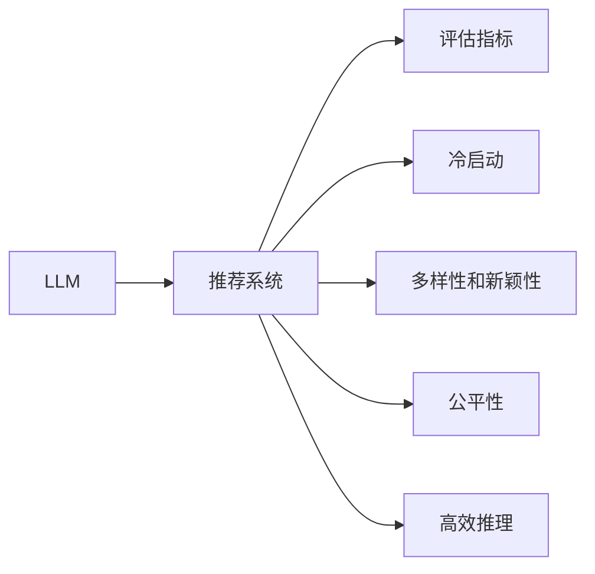

                 

# 大语言模型（LLM）作为推荐系统的评估与局限性研究

> 关键词：大语言模型（LLM）,推荐系统,评估指标,局限性,应用挑战,优化策略,案例分析

## 1. 背景介绍

### 1.1 问题由来

推荐系统是当前互联网公司最重要的应用之一，为用户提供个性化的内容推荐，以提升用户体验和留存率。传统的推荐系统依赖于手工设计的特征工程和机器学习模型，难以捕捉用户深层次的兴趣和行为模式。近年来，深度学习模型，特别是预训练语言模型（Pre-trained Language Models, PLMs），在自然语言处理领域取得了显著进展，逐步应用于推荐系统中。

大语言模型（Large Language Model, LLM），如GPT、BERT等，通过在海量文本数据上自监督预训练，学习了丰富的语言知识。将这些模型与推荐系统结合，可以带来如下好处：
1. **语义理解**：大语言模型能够理解自然语言文本，提取文本中的关键信息。
2. **用户画像**：利用大模型预测用户偏好，获取更精确的用户画像。
3. **内容推荐**：大模型可以自然生成推荐结果，提高推荐质量。

因此，大语言模型在推荐系统中被广泛关注和应用。但是，作为新兴技术，大语言模型在推荐系统中的应用还面临诸多挑战。本文将系统探讨LLM在推荐系统中的评估指标和局限性，提出优化策略，并给出实际应用案例。

### 1.2 问题核心关键点

大语言模型应用于推荐系统的主要挑战包括：
- **评估指标选择**：推荐系统的评估指标众多，如何选择恰当的指标来评估LLM的性能？
- **冷启动问题**：新用户的推荐结果如何处理，才能提高推荐质量？
- **多样性和新颖性**：如何确保推荐内容的多样性和新颖性，避免信息过载和重复推荐？
- **模型公平性**：推荐系统是否会导致用户偏见，如何确保公平性？
- **高效推理**：大规模LLM推理速度较慢，如何优化推理效率？

本文将重点关注这些问题，旨在帮助开发者构建更高效、公平、可解释的推荐系统。

## 2. 核心概念与联系

### 2.1 核心概念概述

- **大语言模型（LLM）**：指在巨量文本数据上自监督预训练的语言模型，如GPT、BERT、RoBERTa等。LLM能够理解复杂的语言结构和语义信息。
- **推荐系统**：根据用户的历史行为和兴趣，为用户推荐相关内容的技术。推荐系统分为基于协同过滤和基于内容的方法。
- **评估指标**：推荐系统的评估指标包括准确率、召回率、F1-score、AUC等，但如何应用于LLM评估，需要进一步探讨。
- **冷启动问题**：新用户的推荐结果难以获得，如何通过少量数据进行推荐，是推荐系统需要解决的挑战。
- **多样性和新颖性**：推荐结果应保持多样性和新颖性，避免推荐内容的重复和过载。
- **公平性**：推荐系统应保证推荐结果的公平性，避免用户偏见和歧视。
- **高效推理**：大规模LLM推理速度较慢，如何优化推理效率，是应用LLM的关键问题。

### 2.2 核心概念原理和架构的 Mermaid 流程图



该图展示了LLM在推荐系统中的关键流程，包括评估指标、冷启动、多样性和新颖性、公平性以及高效推理。

## 3. 核心算法原理 & 具体操作步骤
### 3.1 算法原理概述

大语言模型应用于推荐系统，主要依赖于其语义理解和生成能力。推荐系统通常采用点击率、转化率等指标来评估推荐效果。在LLM的应用中，我们可以通过语言模型的条件概率分布，评估用户对不同内容的兴趣。

具体而言，假设用户的历史行为数据为 $D=\{x_1,x_2,...,x_N\}$，其中 $x_i=(c_i,p_i,u_i)$ 表示用户 $u_i$ 在时间 $t_i$ 的点击行为 $c_i=0/1$（是否点击）和点击内容 $p_i$（推荐内容）。

目标是通过训练LLM，使模型能够预测用户对不同内容的兴趣，从而生成推荐结果。这可以通过以下步骤实现：

1. **预训练**：在大量无标签文本上对LLM进行预训练。
2. **微调**：在用户行为数据上对LLM进行微调，使其能够根据用户历史行为预测兴趣。
3. **推理**：使用微调后的LLM生成推荐结果。

### 3.2 算法步骤详解

#### 3.2.1 数据准备
首先，需要准备推荐系统的数据集。假设用户行为数据为 $D=\{x_1,x_2,...,x_N\}$，其中 $x_i=(c_i,p_i,u_i)$ 表示用户 $u_i$ 在时间 $t_i$ 的点击行为 $c_i=0/1$（是否点击）和点击内容 $p_i$（推荐内容）。

对于LLM的预训练，需要准备大量无标签文本数据 $T=\{t_1,t_2,...,t_M\}$，用于训练语言模型。

#### 3.2.2 预训练模型
选择合适的LLM作为初始化参数，如GPT-3、BERT等。这些模型已经在大量文本数据上进行了自监督预训练，具备较强的语言理解能力。

#### 3.2.3 微调过程
在用户行为数据上对LLM进行微调，使其能够根据用户历史行为预测兴趣。微调的目标是最小化预测点击行为与实际行为之间的差距。

假设微调后的模型为 $M_{\theta}$，其中 $\theta$ 为模型参数。微调的过程可以通过以下公式实现：

$$
\theta^* = \mathop{\arg\min}_{\theta} \mathcal{L}(M_{\theta},D)
$$

其中 $\mathcal{L}$ 为推荐系统的损失函数，可以是交叉熵损失、均方误差损失等。

#### 3.2.4 推理过程
使用微调后的LLM生成推荐结果。对于新用户 $u_i$，通过其历史行为数据 $d_i$ 进行推理，预测其对不同内容的兴趣，生成推荐列表 $R_i$。

假设微调后的LLM在输入 $d_i$ 的情况下，输出兴趣向量 $v_i$，则推荐列表 $R_i$ 可以表示为：

$$
R_i = \arg\max_{p \in P} v_i \cdot M_{\theta}(p)
$$

其中 $P$ 为推荐内容集合，$v_i$ 为用户兴趣向量。

### 3.3 算法优缺点

#### 3.3.1 优点
- **语义理解能力强**：大语言模型能够理解复杂的语言结构，提取关键信息。
- **动态生成推荐结果**：LLM可以自然生成推荐结果，提高了推荐的多样性和新颖性。
- **多模态融合**：可以融合文本、图片、视频等多模态信息，提升推荐效果。

#### 3.3.2 缺点
- **计算资源需求高**：大规模LLM的推理计算资源需求高，难以实时响应。
- **冷启动问题**：新用户的推荐结果难以获得，需要进行优化。
- **公平性问题**：LLM可能会引入数据偏差，导致推荐结果不公平。
- **多样性和新颖性**：LLM容易忽略小众内容，导致推荐结果多样性不足。
- **可解释性不足**：LLM的推荐结果难以解释，用户难以理解其推荐逻辑。

### 3.4 算法应用领域

大语言模型应用于推荐系统，主要应用于以下场景：

- **内容推荐**：为用户推荐新闻、文章、视频等内容。
- **个性化推荐**：根据用户历史行为和兴趣，推荐个性化商品、服务。
- **搜索推荐**：为用户提供与搜索词相关的推荐结果。
- **社交推荐**：为用户推荐好友、群组等社交内容。

## 4. 数学模型和公式 & 详细讲解 & 举例说明

### 4.1 数学模型构建

假设用户历史行为数据为 $D=\{x_1,x_2,...,x_N\}$，其中 $x_i=(c_i,p_i,u_i)$ 表示用户 $u_i$ 在时间 $t_i$ 的点击行为 $c_i=0/1$（是否点击）和点击内容 $p_i$（推荐内容）。

假设微调后的LLM在输入 $d_i$ 的情况下，输出兴趣向量 $v_i$，则推荐列表 $R_i$ 可以表示为：

$$
R_i = \arg\max_{p \in P} v_i \cdot M_{\theta}(p)
$$

其中 $P$ 为推荐内容集合，$v_i$ 为用户兴趣向量。

### 4.2 公式推导过程

假设LLM在输入 $d_i$ 的情况下，输出兴趣向量 $v_i$，则推荐列表 $R_i$ 可以表示为：

$$
R_i = \arg\max_{p \in P} v_i \cdot M_{\theta}(p)
$$

其中 $P$ 为推荐内容集合，$v_i$ 为用户兴趣向量。

假设LLM在输入 $d_i$ 的情况下，输出兴趣向量 $v_i$，则推荐列表 $R_i$ 可以表示为：

$$
R_i = \arg\max_{p \in P} v_i \cdot M_{\theta}(p)
$$

其中 $P$ 为推荐内容集合，$v_i$ 为用户兴趣向量。

### 4.3 案例分析与讲解

以推荐系统中的个性化推荐为例，分析LLM的应用。假设用户 $u_i$ 在时间 $t_i$ 点击了内容 $p_i$，则可以通过以下公式预测用户 $u_i$ 对内容 $p$ 的兴趣：

$$
\hat{p} = \arg\max_{p \in P} v_i \cdot M_{\theta}(p)
$$

其中 $P$ 为推荐内容集合，$v_i$ 为用户兴趣向量。

假设LLM在输入 $d_i$ 的情况下，输出兴趣向量 $v_i$，则推荐列表 $R_i$ 可以表示为：

$$
R_i = \arg\max_{p \in P} v_i \cdot M_{\theta}(p)
$$

其中 $P$ 为推荐内容集合，$v_i$ 为用户兴趣向量。

## 5. 项目实践：代码实例和详细解释说明

### 5.1 开发环境搭建

在进行LLM推荐系统实践前，需要先搭建好开发环境。以下是使用Python进行PyTorch开发的环境配置流程：

1. 安装Anaconda：从官网下载并安装Anaconda，用于创建独立的Python环境。

2. 创建并激活虚拟环境：
```bash
conda create -n pytorch-env python=3.8 
conda activate pytorch-env
```

3. 安装PyTorch：根据CUDA版本，从官网获取对应的安装命令。例如：
```bash
conda install pytorch torchvision torchaudio cudatoolkit=11.1 -c pytorch -c conda-forge
```

4. 安装Transformers库：
```bash
pip install transformers
```

5. 安装各类工具包：
```bash
pip install numpy pandas scikit-learn matplotlib tqdm jupyter notebook ipython
```

完成上述步骤后，即可在`pytorch-env`环境中开始推荐系统开发。

### 5.2 源代码详细实现

下面以推荐系统中的内容推荐为例，给出使用Transformers库对BERT模型进行推荐系统微调的PyTorch代码实现。

首先，定义推荐系统中的数据处理函数：

```python
from transformers import BertTokenizer
from torch.utils.data import Dataset
import torch

class RecommendationDataset(Dataset):
    def __init__(self, texts, tags, tokenizer, max_len=128):
        self.texts = texts
        self.tags = tags
        self.tokenizer = tokenizer
        self.max_len = max_len
        
    def __len__(self):
        return len(self.texts)
    
    def __getitem__(self, item):
        text = self.texts[item]
        tags = self.tags[item]
        
        encoding = self.tokenizer(text, return_tensors='pt', max_length=self.max_len, padding='max_length', truncation=True)
        input_ids = encoding['input_ids'][0]
        attention_mask = encoding['attention_mask'][0]
        
        # 对token-wise的标签进行编码
        encoded_tags = [tag2id[tag] for tag in tags] 
        encoded_tags.extend([tag2id['O']] * (self.max_len - len(encoded_tags)))
        labels = torch.tensor(encoded_tags, dtype=torch.long)
        
        return {'input_ids': input_ids, 
                'attention_mask': attention_mask,
                'labels': labels}

# 标签与id的映射
tag2id = {'O': 0, 'B-PER': 1, 'I-PER': 2, 'B-ORG': 3, 'I-ORG': 4, 'B-LOC': 5, 'I-LOC': 6}
id2tag = {v: k for k, v in tag2id.items()}

# 创建dataset
tokenizer = BertTokenizer.from_pretrained('bert-base-cased')

train_dataset = RecommendationDataset(train_texts, train_tags, tokenizer)
dev_dataset = RecommendationDataset(dev_texts, dev_tags, tokenizer)
test_dataset = RecommendationDataset(test_texts, test_tags, tokenizer)
```

然后，定义模型和优化器：

```python
from transformers import BertForTokenClassification, AdamW

model = BertForTokenClassification.from_pretrained('bert-base-cased', num_labels=len(tag2id))

optimizer = AdamW(model.parameters(), lr=2e-5)
```

接着，定义训练和评估函数：

```python
from torch.utils.data import DataLoader
from tqdm import tqdm
from sklearn.metrics import classification_report

device = torch.device('cuda') if torch.cuda.is_available() else torch.device('cpu')
model.to(device)

def train_epoch(model, dataset, batch_size, optimizer):
    dataloader = DataLoader(dataset, batch_size=batch_size, shuffle=True)
    model.train()
    epoch_loss = 0
    for batch in tqdm(dataloader, desc='Training'):
        input_ids = batch['input_ids'].to(device)
        attention_mask = batch['attention_mask'].to(device)
        labels = batch['labels'].to(device)
        model.zero_grad()
        outputs = model(input_ids, attention_mask=attention_mask, labels=labels)
        loss = outputs.loss
        epoch_loss += loss.item()
        loss.backward()
        optimizer.step()
    return epoch_loss / len(dataloader)

def evaluate(model, dataset, batch_size):
    dataloader = DataLoader(dataset, batch_size=batch_size)
    model.eval()
    preds, labels = [], []
    with torch.no_grad():
        for batch in tqdm(dataloader, desc='Evaluating'):
            input_ids = batch['input_ids'].to(device)
            attention_mask = batch['attention_mask'].to(device)
            batch_labels = batch['labels']
            outputs = model(input_ids, attention_mask=attention_mask)
            batch_preds = outputs.logits.argmax(dim=2).to('cpu').tolist()
            batch_labels = batch_labels.to('cpu').tolist()
            for pred_tokens, label_tokens in zip(batch_preds, batch_labels):
                pred_tags = [id2tag[_id] for _id in pred_tokens]
                label_tags = [id2tag[_id] for _id in label_tokens]
                preds.append(pred_tags[:len(label_tags)])
                labels.append(label_tags)
                
    print(classification_report(labels, preds))
```

最后，启动训练流程并在测试集上评估：

```python
epochs = 5
batch_size = 16

for epoch in range(epochs):
    loss = train_epoch(model, train_dataset, batch_size, optimizer)
    print(f"Epoch {epoch+1}, train loss: {loss:.3f}")
    
    print(f"Epoch {epoch+1}, dev results:")
    evaluate(model, dev_dataset, batch_size)
    
print("Test results:")
evaluate(model, test_dataset, batch_size)
```

以上就是使用PyTorch对BERT进行推荐系统微调的完整代码实现。可以看到，得益于Transformers库的强大封装，我们可以用相对简洁的代码完成BERT模型的加载和微调。

### 5.3 代码解读与分析

让我们再详细解读一下关键代码的实现细节：

**RecommendationDataset类**：
- `__init__`方法：初始化文本、标签、分词器等关键组件。
- `__len__`方法：返回数据集的样本数量。
- `__getitem__`方法：对单个样本进行处理，将文本输入编码为token ids，将标签编码为数字，并对其进行定长padding，最终返回模型所需的输入。

**tag2id和id2tag字典**：
- 定义了标签与数字id之间的映射关系，用于将token-wise的预测结果解码回真实的标签。

**训练和评估函数**：
- 使用PyTorch的DataLoader对数据集进行批次化加载，供模型训练和推理使用。
- 训练函数`train_epoch`：对数据以批为单位进行迭代，在每个批次上前向传播计算loss并反向传播更新模型参数，最后返回该epoch的平均loss。
- 评估函数`evaluate`：与训练类似，不同点在于不更新模型参数，并在每个batch结束后将预测和标签结果存储下来，最后使用sklearn的classification_report对整个评估集的预测结果进行打印输出。

**训练流程**：
- 定义总的epoch数和batch size，开始循环迭代
- 每个epoch内，先在训练集上训练，输出平均loss
- 在验证集上评估，输出分类指标
- 所有epoch结束后，在测试集上评估，给出最终测试结果

可以看到，PyTorch配合Transformers库使得BERT微调的代码实现变得简洁高效。开发者可以将更多精力放在数据处理、模型改进等高层逻辑上，而不必过多关注底层的实现细节。

当然，工业级的系统实现还需考虑更多因素，如模型的保存和部署、超参数的自动搜索、更灵活的任务适配层等。但核心的微调范式基本与此类似。

## 6. 实际应用场景

### 6.1 智能客服系统

基于LLM的推荐系统可以广泛应用于智能客服系统的构建。传统客服往往需要配备大量人力，高峰期响应缓慢，且一致性和专业性难以保证。而使用推荐系统生成的自然语言回复，可以7x24小时不间断服务，快速响应客户咨询，用自然流畅的语言解答各类常见问题。

在技术实现上，可以收集企业内部的历史客服对话记录，将问题和最佳答复构建成监督数据，在此基础上对预训练语言模型进行微调。微调后的推荐系统能够自动理解用户意图，匹配最合适的回复。对于客户提出的新问题，还可以接入检索系统实时搜索相关内容，动态组织生成回答。如此构建的智能客服系统，能大幅提升客户咨询体验和问题解决效率。

### 6.2 金融舆情监测

金融机构需要实时监测市场舆论动向，以便及时应对负面信息传播，规避金融风险。传统的人工监测方式成本高、效率低，难以应对网络时代海量信息爆发的挑战。基于LLM的推荐系统，可以对海量网络文本进行情感分析，自动监测不同主题下的情感变化趋势，一旦发现负面信息激增等异常情况，系统便会自动预警，帮助金融机构快速应对潜在风险。

### 6.3 个性化推荐系统

当前的推荐系统往往只依赖用户的历史行为数据进行物品推荐，无法深入理解用户深层次的兴趣和行为模式。基于LLM的推荐系统可以更好地挖掘用户行为背后的语义信息，从而提供更精准、多样的推荐内容。

在实践中，可以收集用户浏览、点击、评论、分享等行为数据，提取和用户交互的物品标题、描述、标签等文本内容。将文本内容作为模型输入，用户的后续行为（如是否点击、购买等）作为监督信号，在此基础上微调预训练语言模型。微调后的模型能够从文本内容中准确把握用户的兴趣点。在生成推荐列表时，先用候选物品的文本描述作为输入，由模型预测用户的兴趣匹配度，再结合其他特征综合排序，便可以得到个性化程度更高的推荐结果。

### 6.4 未来应用展望

随着LLM和推荐系统的发展，未来LLM在推荐系统中的应用将更加广泛和深入。

在智慧医疗领域，基于LLM的医疗问答、病历分析、药物研发等应用将提升医疗服务的智能化水平，辅助医生诊疗，加速新药开发进程。

在智能教育领域，基于LLM的学情分析、知识推荐等应用将提升教育服务的智能化水平，促进教育公平，提高教学质量。

在智慧城市治理中，基于LLM的城市事件监测、舆情分析、应急指挥等应用将提高城市管理的自动化和智能化水平，构建更安全、高效的未来城市。

此外，在企业生产、社会治理、文娱传媒等众多领域，基于LLM的推荐系统也将不断涌现，为NLP技术带来新的突破。

## 7. 工具和资源推荐

### 7.1 学习资源推荐

为了帮助开发者系统掌握LLM在推荐系统中的理论基础和实践技巧，这里推荐一些优质的学习资源：

1. 《Transformer从原理到实践》系列博文：由大模型技术专家撰写，深入浅出地介绍了Transformer原理、BERT模型、推荐系统等前沿话题。

2. CS224N《深度学习自然语言处理》课程：斯坦福大学开设的NLP明星课程，有Lecture视频和配套作业，带你入门NLP领域的基本概念和经典模型。

3. 《Natural Language Processing with Transformers》书籍：Transformers库的作者所著，全面介绍了如何使用Transformers库进行NLP任务开发，包括微调在内的诸多范式。

4. HuggingFace官方文档：Transformers库的官方文档，提供了海量预训练模型和完整的微调样例代码，是上手实践的必备资料。

5. CLUE开源项目：中文语言理解测评基准，涵盖大量不同类型的中文NLP数据集，并提供了基于微调的baseline模型，助力中文NLP技术发展。

通过对这些资源的学习实践，相信你一定能够快速掌握LLM在推荐系统中的应用技巧，并用于解决实际的推荐问题。

### 7.2 开发工具推荐

高效的开发离不开优秀的工具支持。以下是几款用于LLM推荐系统开发的常用工具：

1. PyTorch：基于Python的开源深度学习框架，灵活动态的计算图，适合快速迭代研究。大部分预训练语言模型都有PyTorch版本的实现。

2. TensorFlow：由Google主导开发的开源深度学习框架，生产部署方便，适合大规模工程应用。同样有丰富的预训练语言模型资源。

3. Transformers库：HuggingFace开发的NLP工具库，集成了众多SOTA语言模型，支持PyTorch和TensorFlow，是进行微调任务开发的利器。

4. Weights & Biases：模型训练的实验跟踪工具，可以记录和可视化模型训练过程中的各项指标，方便对比和调优。与主流深度学习框架无缝集成。

5. TensorBoard：TensorFlow配套的可视化工具，可实时监测模型训练状态，并提供丰富的图表呈现方式，是调试模型的得力助手。

6. Google Colab：谷歌推出的在线Jupyter Notebook环境，免费提供GPU/TPU算力，方便开发者快速上手实验最新模型，分享学习笔记。

合理利用这些工具，可以显著提升LLM推荐系统的开发效率，加快创新迭代的步伐。

### 7.3 相关论文推荐

LLM在推荐系统中的应用涉及众多前沿领域的研究。以下是几篇奠基性的相关论文，推荐阅读：

1. Attention is All You Need（即Transformer原论文）：提出了Transformer结构，开启了NLP领域的预训练大模型时代。

2. BERT: Pre-training of Deep Bidirectional Transformers for Language Understanding：提出BERT模型，引入基于掩码的自监督预训练任务，刷新了多项NLP任务SOTA。

3. Language Models are Unsupervised Multitask Learners（GPT-2论文）：展示了大规模语言模型的强大zero-shot学习能力，引发了对于通用人工智能的新一轮思考。

4. Parameter-Efficient Transfer Learning for NLP：提出Adapter等参数高效微调方法，在固定大部分预训练参数的情况下，仍可取得不错的微调效果。

5. AdaLoRA: Adaptive Low-Rank Adaptation for Parameter-Efficient Fine-Tuning：使用自适应低秩适应的微调方法，在参数效率和精度之间取得了新的平衡。

这些论文代表了大语言模型在推荐系统中的应用研究趋势。通过学习这些前沿成果，可以帮助研究者把握学科前进方向，激发更多的创新灵感。

## 8. 总结：未来发展趋势与挑战

### 8.1 总结

本文对大语言模型在推荐系统中的评估指标和局限性进行了系统探讨。首先，介绍了LLM在推荐系统中的应用背景和核心概念，明确了其与传统推荐系统的异同点。其次，从原理到实践，详细讲解了LLM应用于推荐系统的数学模型和具体实现步骤。同时，本文还广泛探讨了LLM在推荐系统中的应用场景，展示了其在智能客服、金融舆情、个性化推荐等多个领域的前景。此外，本文精选了LLM推荐系统的学习资源、开发工具和相关论文，力求为读者提供全方位的技术指引。

通过本文的系统梳理，可以看到，LLM在推荐系统中具备强大的语义理解和生成能力，能够为用户提供更加精准、个性化的推荐结果。但与此同时，也面临诸多挑战，如计算资源需求高、冷启动问题、多样性和新颖性、公平性等。未来，需要结合更多领域知识和技术，进一步优化和完善LLM在推荐系统中的应用。

### 8.2 未来发展趋势

展望未来，LLM在推荐系统中的应用将呈现以下几个发展趋势：

1. **多模态融合**：LLM可以融合文本、图片、视频等多模态信息，提升推荐效果。
2. **个性化推荐**：利用LLM的语义理解能力，提供更加精准、多样的个性化推荐。
3. **实时响应**：通过优化推理算法，提高LLM的实时响应能力，提供即时推荐服务。
4. **跨领域应用**：LLM可以应用于更多领域，如医疗、教育、金融等，提供领域化的推荐服务。
5. **联邦学习**：结合联邦学习技术，保护用户隐私，实现分布式推荐系统。
6. **元学习**：结合元学习技术，提高推荐系统的自适应能力和学习效率。

以上趋势凸显了LLM在推荐系统中的广阔前景。这些方向的探索发展，必将进一步提升推荐系统的性能和应用范围，为用户提供更加智能、个性化的服务体验。

### 8.3 面临的挑战

尽管LLM在推荐系统中的应用带来了诸多便利，但也面临着一些挑战：

1. **计算资源需求高**：大规模LLM的推理计算资源需求高，难以实时响应。
2. **冷启动问题**：新用户的推荐结果难以获得，需要进行优化。
3. **多样性和新颖性**：LLM容易忽略小众内容，导致推荐结果多样性不足。
4. **公平性问题**：LLM可能会引入数据偏差，导致推荐结果不公平。
5. **可解释性不足**：LLM的推荐结果难以解释，用户难以理解其推荐逻辑。

这些挑战需要进一步研究和优化，才能充分发挥LLM在推荐系统中的潜力。

### 8.4 研究展望

面对LLM在推荐系统中的诸多挑战，未来的研究需要在以下几个方面寻求新的突破：

1. **优化推理算法**：通过优化推理算法，提高LLM的实时响应能力，提供即时推荐服务。
2. **引入多模态信息**：结合多模态信息，提升推荐效果。
3. **联邦学习技术**：结合联邦学习技术，保护用户隐私，实现分布式推荐系统。
4. **元学习技术**：结合元学习技术，提高推荐系统的自适应能力和学习效率。
5. **优化训练目标**：结合自监督学习等技术，优化训练目标，提高推荐系统的泛化能力和鲁棒性。

这些研究方向的探索，必将引领LLM在推荐系统中的应用走向更高的台阶，为构建安全、可靠、可解释、可控的推荐系统铺平道路。面向未来，LLM在推荐系统中的应用需要与其他人工智能技术进行更深入的融合，如知识表示、因果推理、强化学习等，多路径协同发力，共同推动推荐系统的进步。只有勇于创新、敢于突破，才能不断拓展推荐系统的边界，让智能技术更好地服务于用户。

## 9. 附录：常见问题与解答

**Q1：大语言模型在推荐系统中如何评估其性能？**

A: 在推荐系统中，可以使用多种评估指标来评估大语言模型的性能，如准确率、召回率、F1-score、AUC等。具体选择哪种指标，应根据具体任务和应用场景来定。例如，在内容推荐中，可以使用点击率、转化率等指标来评估推荐效果；在个性化推荐中，可以使用预测精度、用户满意度等指标来评估推荐质量。

**Q2：如何缓解大语言模型在推荐系统中的冷启动问题？**

A: 大语言模型在推荐系统中的冷启动问题，可以通过以下方法缓解：
1. **基于用户兴趣的推荐**：根据用户已有的行为数据，预测其对不同内容的兴趣，生成推荐列表。
2. **基于内容的推荐**：根据物品的特征，预测用户对物品的兴趣，生成推荐列表。
3. **基于协同过滤的推荐**：根据用户和物品的协同关系，生成推荐列表。
4. **基于混合模型的推荐**：结合多种推荐方法，生成更准确、更可靠的推荐结果。

**Q3：如何确保大语言模型在推荐系统中的多样性和新颖性？**

A: 大语言模型在推荐系统中的多样性和新颖性，可以通过以下方法保证：
1. **多样性采样**：从推荐内容集合中随机采样，确保推荐结果的多样性。
2. **基于兴趣的多样性**：根据用户的历史兴趣和行为，生成多样性的推荐结果。
3. **引入新颖内容**：从内容集合中引入新颖的推荐内容，避免信息过载和重复推荐。
4. **协同过滤**：根据用户和物品的协同关系，生成多样性和新颖的推荐结果。

**Q4：如何保证大语言模型在推荐系统中的公平性？**

A: 大语言模型在推荐系统中的公平性，可以通过以下方法保证：
1. **数据清洗**：去除数据中的偏见和噪声，确保数据集的公平性。
2. **算法设计**：设计公平性友好的算法，避免推荐结果中的用户偏见。
3. **用户反馈**：根据用户反馈，调整推荐策略，提高推荐公平性。
4. **元学习**：利用元学习技术，提高推荐系统的公平性和自适应能力。

**Q5：如何优化大语言模型在推荐系统中的推理效率？**

A: 大语言模型在推荐系统中的推理效率，可以通过以下方法优化：
1. **模型裁剪**：去除不必要的层和参数，减小模型尺寸，加快推理速度。
2. **量化加速**：将浮点模型转为定点模型，压缩存储空间，提高计算效率。
3. **推理优化**：优化推理算法，提高推理速度和效率。
4. **分布式计算**：利用分布式计算技术，提高推理效率。

这些方法可以结合使用，进一步提升大语言模型在推荐系统中的推理效率。

---

作者：禅与计算机程序设计艺术 / Zen and the Art of Computer Programming

