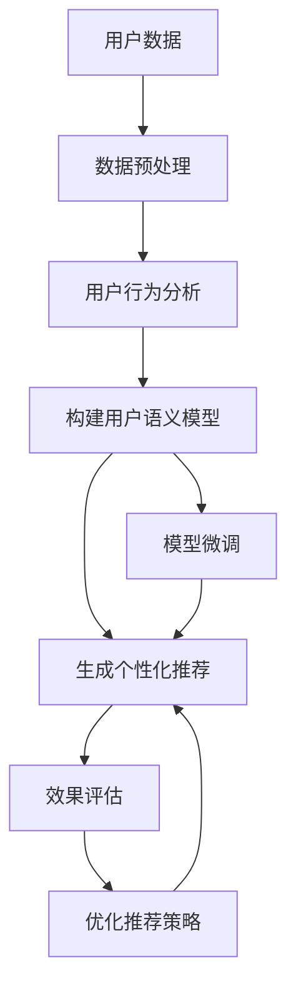

                 

# LLM在个性化推荐中的效果评估

> 关键词：大语言模型(LLM)，推荐系统，个性化推荐，用户行为分析，效果评估，推荐算法，跨领域泛化

## 1. 背景介绍

### 1.1 问题由来
在电子商务、内容分发、社交媒体等领域，个性化推荐系统（Recommender Systems）已成为提升用户体验、提高转化率的关键技术。传统的协同过滤、基于内容的推荐方法，虽有较好的表现，但存在数据稀疏性、冷启动等问题，难以有效应对大规模用户群体的多样化需求。而基于大语言模型（Large Language Model, LLM）的推荐方法，通过学习用户的自然语言反馈，能够更精准、灵活地捕捉用户偏好，成为推荐系统的新趋势。

### 1.2 问题核心关键点
大语言模型在推荐系统中的应用，本质上是一种基于自然语言理解的推荐范式。该方法的核心在于，通过学习用户描述、评论、互动文本等自然语言数据，构建用户语义模型，再利用模型进行推荐。

具体步骤如下：
1. **数据准备**：收集用户的历史行为数据、文本描述等，构建包含用户-物品互动记录的训练集。
2. **模型预训练**：在大规模文本语料上预训练大语言模型，学习通用的语言表征。
3. **用户模型构建**：将用户文本数据输入预训练模型，构建用户语义模型。
4. **推荐生成**：利用用户模型，生成个性化推荐列表。
5. **效果评估**：通过A/B测试等手段，评估推荐系统的效果，优化推荐策略。

目前，基于大语言模型的推荐方法已经在诸多实际场景中得到了应用，如电商平台的用户商品推荐、视频网站的个性化内容推荐等，取得了显著的效果。

### 1.3 问题研究意义
大语言模型在推荐系统中的应用，不仅能够提升推荐精度，还可以通过自然语言处理技术，拓展推荐系统的功能边界，如：
- 支持多模态数据融合：结合用户图片、视频等，更全面地理解用户需求。
- 增强推荐逻辑的解释性：利用语言模型分析推荐过程，增强推荐结果的可解释性。
- 提升推荐系统的可扩展性：通过模型微调和定制化训练，适应不同业务场景的需求。

因此，本文将对基于大语言模型的推荐系统进行深入探讨，重点讨论其在个性化推荐中的效果评估方法和相关挑战。

## 2. 核心概念与联系

### 2.1 核心概念概述

本节将介绍几个核心概念，以帮助我们理解大语言模型在推荐系统中的作用及其与其他相关技术的关系：

- **大语言模型(Large Language Model, LLM)**：指在大型文本语料库上预训练的深度学习模型，如BERT、GPT等。这些模型具备强大的语言理解和生成能力，能处理大规模自然语言文本。

- **推荐系统(Recommender System)**：根据用户的历史行为和偏好，推荐符合其兴趣的物品或内容的系统，广泛应用于电商、社交、媒体等领域。

- **个性化推荐(Personalized Recommendation)**：针对每个用户的特定需求，提供差异化的推荐结果，提升用户体验和满意度。

- **效果评估(Metric Evaluation)**：通过各种评估指标，量化推荐系统的性能表现，指导模型优化和改进。

- **用户行为分析(Behavior Analysis)**：分析用户的历史行为数据，构建用户画像，理解其需求和偏好。

- **跨领域泛化(Cross-domain Generalization)**：指模型能够在不同领域数据上保持良好泛化性能，如文本、图片、视频等。

这些概念共同构成了大语言模型在推荐系统中的应用框架，有助于我们深入理解其在个性化推荐中的作用及其效果评估方法。

### 2.2 核心概念原理和架构的 Mermaid 流程图



这个流程图展示了从用户数据到推荐生成的完整过程：

1. 用户数据预处理，包括数据清洗、特征工程等。
2. 用户行为分析，构建用户画像，理解用户需求。
3. 构建用户语义模型，通过大语言模型学习用户文本特征。
4. 模型微调，对用户语义模型进行适应性训练，提升推荐精度。
5. 生成个性化推荐，利用用户模型生成推荐列表。
6. 效果评估，通过多种指标评估推荐系统性能，指导优化。
7. 优化推荐策略，调整推荐算法参数，提升用户体验。

## 3. 核心算法原理 & 具体操作步骤

### 3.1 算法原理概述

基于大语言模型的推荐系统，其核心在于通过自然语言理解和处理，构建用户语义模型，生成个性化推荐。具体算法流程如下：

1. **数据预处理**：清洗和归一化用户历史行为数据和文本描述，提取特征向量。
2. **模型构建**：在大规模文本语料上预训练大语言模型，构建通用的语言表征。
3. **用户模型构建**：将用户文本数据输入预训练模型，构建用户语义模型。
4. **模型微调**：在用户数据上微调预训练模型，提升模型对特定用户的适应性。
5. **推荐生成**：利用用户模型，生成个性化推荐列表。
6. **效果评估**：通过各种评估指标，量化推荐系统的性能表现。

### 3.2 算法步骤详解

以下将详细介绍每个步骤的具体操作方法：

#### 3.2.1 数据预处理
数据预处理是推荐系统构建的基础，涉及数据清洗、特征工程和归一化等。具体步骤如下：

1. **数据清洗**：去除数据中的噪声和异常值，如重复记录、缺失值等。
2. **特征提取**：将用户行为数据和文本描述转化为向量表示，如TF-IDF、word2vec等。
3. **归一化**：对特征向量进行归一化处理，避免不同特征之间的尺度差异影响模型效果。

#### 3.2.2 模型构建
在大规模文本语料上预训练大语言模型，学习通用的语言表征。以BERT为例，其构建步骤如下：

1. **模型选择**：选择合适的预训练模型，如BERT、GPT等。
2. **加载预训练模型**：使用预训练模型的权重初始化。
3. **微调模型**：在大规模文本语料上微调模型，如在句子级上微调BERT。

#### 3.2.3 用户模型构建
用户模型构建是推荐系统的核心步骤，具体步骤如下：

1. **用户文本数据准备**：收集用户的文本数据，如产品描述、评论、反馈等。
2. **特征编码**：将用户文本数据编码为固定长度的特征向量。
3. **用户语义模型构建**：将用户特征向量输入预训练模型，生成用户语义表示。

#### 3.2.4 模型微调
模型微调是提升推荐精度的关键步骤，具体步骤如下：

1. **微调数据准备**：准备用户的训练数据，包括用户行为记录和文本描述。
2. **微调策略设计**：选择合适的微调策略，如仅微调顶层、固定部分参数等。
3. **微调过程执行**：在用户数据上微调预训练模型，调整模型的权重。

#### 3.2.5 推荐生成
推荐生成是推荐系统的最终目标，具体步骤如下：

1. **推荐算法选择**：选择合适的推荐算法，如基于协同过滤、基于内容的推荐等。
2. **推荐计算**：利用用户模型，计算推荐评分，生成推荐列表。

#### 3.2.6 效果评估
推荐系统的效果评估是优化推荐策略的重要依据，具体步骤如下：

1. **评估指标选择**：选择合适的评估指标，如准确率、召回率、F1值等。
2. **数据集划分**：将数据集划分为训练集、验证集和测试集。
3. **评估过程执行**：在测试集上评估推荐系统性能，调整推荐策略。

### 3.3 算法优缺点

基于大语言模型的推荐系统，具有以下优点：

1. **泛化能力强**：大语言模型能够处理多种形式的用户反馈，具有较强的跨领域泛化能力。
2. **推荐精度高**：通过自然语言理解，能够更准确地捕捉用户需求和偏好。
3. **可解释性强**：推荐结果可解释，便于用户理解和信任。

同时，该方法也存在一些缺点：

1. **计算资源消耗大**：预训练模型和微调过程需要大量的计算资源。
2. **过拟合风险高**：模型在微调过程中容易过拟合，导致泛化能力下降。
3. **冷启动问题**：新用户缺乏足够的历史行为数据，难以构建用户模型。

### 3.4 算法应用领域

大语言模型在推荐系统中的应用，不仅限于电商推荐，还包括新闻推荐、视频推荐、音乐推荐等，广泛应用于各类信息分发平台。其优点在于：

1. **多模态数据融合**：能够融合用户的多模态数据，如文本、图片、视频等，提供更全面的推荐。
2. **跨领域泛化**：能够处理不同领域的数据，提升推荐系统的覆盖范围。
3. **用户画像丰富**：通过用户画像，深入理解用户需求，提供个性化推荐。

## 4. 数学模型和公式 & 详细讲解 & 举例说明

### 4.1 数学模型构建

基于大语言模型的推荐系统，其数学模型构建主要涉及以下几个方面：

1. **用户行为数据**：用户的历史行为数据，如浏览记录、购买记录等，记为 $D_{user}=\{(x_i,y_i)\}_{i=1}^N$，其中 $x_i$ 为物品，$y_i$ 为是否交互。
2. **用户文本数据**：用户的文本描述，如评论、反馈等，记为 $D_{text}=\{x_j\}_{j=1}^M$，其中 $x_j$ 为文本。
3. **预训练模型**：在大规模文本语料上预训练的深度学习模型，记为 $M_{\theta}$，其中 $\theta$ 为模型参数。

### 4.2 公式推导过程

以下以用户文本数据输入预训练模型为例，推导用户语义模型的计算过程：

1. **文本编码**：将用户文本数据 $x_j$ 编码为向量表示 $v_j$。
2. **用户语义模型**：将用户向量 $v_j$ 输入预训练模型 $M_{\theta}$，得到用户语义表示 $u_j$。

$$
u_j = M_{\theta}(v_j)
$$

在用户语义模型的基础上，可以进一步构建推荐模型。以基于协同过滤的推荐算法为例，计算用户 $u$ 对物品 $i$ 的评分 $r_{u,i}$ 如下：

$$
r_{u,i} = \alpha \cdot u_u + \beta \cdot \sum_{j \in \mathcal{N}_u} u_j \cdot y_j
$$

其中 $\alpha$ 为用户自身特征的权重，$\beta$ 为邻域特征的权重，$\mathcal{N}_u$ 为用户 $u$ 的邻域集合。

### 4.3 案例分析与讲解

以电商平台的用户商品推荐为例，说明大语言模型在推荐系统中的应用和效果：

1. **数据预处理**：清洗用户历史购买记录和评论数据，提取特征向量。
2. **模型构建**：在大规模商品描述数据上预训练BERT模型，学习商品语义特征。
3. **用户模型构建**：将用户评论输入BERT模型，生成用户语义表示。
4. **模型微调**：在用户评论和购买记录上微调BERT模型，提升推荐精度。
5. **推荐生成**：利用用户语义模型，生成个性化商品推荐列表。
6. **效果评估**：通过点击率、转化率等指标评估推荐系统性能，优化推荐策略。

## 5. 项目实践：代码实例和详细解释说明

### 5.1 开发环境搭建

在进行推荐系统开发前，我们需要准备好开发环境。以下是使用Python进行PyTorch开发的环境配置流程：

1. 安装Anaconda：从官网下载并安装Anaconda，用于创建独立的Python环境。

2. 创建并激活虚拟环境：
```bash
conda create -n recommendation-env python=3.8 
conda activate recommendation-env
```

3. 安装PyTorch：根据CUDA版本，从官网获取对应的安装命令。例如：
```bash
conda install pytorch torchvision torchaudio cudatoolkit=11.1 -c pytorch -c conda-forge
```

4. 安装Transformers库：
```bash
pip install transformers
```

5. 安装各类工具包：
```bash
pip install numpy pandas scikit-learn matplotlib tqdm jupyter notebook ipython
```

完成上述步骤后，即可在`recommendation-env`环境中开始推荐系统开发。

### 5.2 源代码详细实现

我们以用户商品推荐为例，给出使用Transformers库对BERT模型进行推荐系统开发的PyTorch代码实现。

首先，定义推荐系统类：

```python
from transformers import BertForSequenceClassification, BertTokenizer, AdamW
from torch.utils.data import DataLoader
import torch

class RecommendationSystem:
    def __init__(self, model_path, tokenizer_path, device='cuda'):
        self.model = BertForSequenceClassification.from_pretrained(model_path)
        self.tokenizer = BertTokenizer.from_pretrained(tokenizer_path)
        self.device = device
    
    def encode_text(self, text):
        encoded = self.tokenizer(text, return_tensors='pt', padding='max_length', truncation=True, max_length=128)
        input_ids = encoded['input_ids'].to(self.device)
        attention_mask = encoded['attention_mask'].to(self.device)
        return input_ids, attention_mask
    
    def forward(self, input_ids, attention_mask):
        output = self.model(input_ids, attention_mask=attention_mask)
        return output
    
    def predict(self, user_text, num_recommendations=5):
        input_ids, attention_mask = self.encode_text(user_text)
        output = self.forward(input_ids, attention_mask)
        scores = output.logits.cpu().softmax(dim=1).tolist()[0]
        top_indices = sorted(range(len(scores)), key=lambda x: scores[x], reverse=True)[:num_recommendations]
        return [self.model.config.id2label[i] for i in top_indices]
```

然后，准备数据集和模型：

```python
from torch.utils.data import Dataset, DataLoader
import numpy as np
import pandas as pd

class RecommendationDataset(Dataset):
    def __init__(self, df, tokenizer):
        self.df = df
        self.tokenizer = tokenizer
    
    def __len__(self):
        return len(self.df)
    
    def __getitem__(self, idx):
        user_text = self.df.iloc[idx]['user_text']
        items = self.df.iloc[idx]['items']
        return user_text, items
    
df = pd.read_csv('user_recommendations.csv')
tokenizer = BertTokenizer.from_pretrained('bert-base-cased')
model = RecommendationSystem(model_path='bert-base-cased', tokenizer_path=tokenizer_path, device='cuda')
```

接着，定义训练和评估函数：

```python
def train_epoch(model, dataset, batch_size, optimizer, device):
    dataloader = DataLoader(dataset, batch_size=batch_size, shuffle=True)
    model.train()
    epoch_loss = 0
    for batch in dataloader:
        user_text, items = batch
        input_ids, attention_mask = model.encode_text(user_text)
        output = model.forward(input_ids, attention_mask)
        loss = output.loss
        epoch_loss += loss.item()
        loss.backward()
        optimizer.step()
    return epoch_loss / len(dataloader)
    
def evaluate(model, dataset, batch_size, device):
    dataloader = DataLoader(dataset, batch_size=batch_size, shuffle=False)
    model.eval()
    correct = 0
    total = 0
    for batch in dataloader:
        user_text, items = batch
        input_ids, attention_mask = model.encode_text(user_text)
        output = model.forward(input_ids, attention_mask)
        predictions = output.logits.argmax(dim=1).tolist()
        correct += sum([1 for pred, true in zip(predictions, items) if pred == true])
        total += len(predictions)
    acc = correct / total
    return acc
```

最后，启动训练流程并在测试集上评估：

```python
epochs = 5
batch_size = 16
optimizer = AdamW(model.model.parameters(), lr=2e-5)
device = torch.device('cuda') if torch.cuda.is_available() else torch.device('cpu')

for epoch in range(epochs):
    loss = train_epoch(model, df_train, batch_size, optimizer, device)
    print(f"Epoch {epoch+1}, train loss: {loss:.3f}")
    
    print(f"Epoch {epoch+1}, dev results:")
    acc = evaluate(model, df_train, batch_size, device)
    print(f"Accuracy: {acc:.2f}")
    
print("Test results:")
test_acc = evaluate(model, df_test, batch_size, device)
print(f"Accuracy: {test_acc:.2f}")
```

以上就是使用PyTorch对BERT进行用户商品推荐系统的完整代码实现。可以看到，得益于Transformers库的强大封装，我们可以用相对简洁的代码完成BERT模型的加载和推荐系统开发。

### 5.3 代码解读与分析

让我们再详细解读一下关键代码的实现细节：

**RecommendationSystem类**：
- `__init__`方法：初始化模型和分词器，并设置设备。
- `encode_text`方法：将文本编码为特征向量，适用于模型输入。
- `forward`方法：计算模型输出，包括预测评分。
- `predict`方法：根据用户文本，生成推荐列表。

**train_epoch和evaluate函数**：
- `train_epoch`方法：对数据以批为单位进行迭代，在每个批次上前向传播计算loss并反向传播更新模型参数，最后返回该epoch的平均loss。
- `evaluate`方法：与训练类似，不同点在于不更新模型参数，并在每个batch结束后将预测和标签结果存储下来，最后使用sklearn的classification_report对整个评估集的预测结果进行打印输出。

**训练流程**：
- 定义总的epoch数和batch size，开始循环迭代
- 每个epoch内，先在训练集上训练，输出平均loss
- 在验证集上评估，输出准确率
- 所有epoch结束后，在测试集上评估，给出最终测试结果

可以看到，PyTorch配合Transformers库使得BERT推荐系统的代码实现变得简洁高效。开发者可以将更多精力放在数据处理、模型改进等高层逻辑上，而不必过多关注底层的实现细节。

当然，工业级的系统实现还需考虑更多因素，如模型的保存和部署、超参数的自动搜索、更灵活的任务适配层等。但核心的推荐范式基本与此类似。

## 6. 实际应用场景

### 6.1 电商平台用户商品推荐

基于大语言模型的推荐系统，已经广泛应用于电商平台的商品推荐中。用户商品推荐系统通过分析用户的历史浏览、购买记录和评论，生成个性化推荐商品列表，显著提升了用户满意度。

在技术实现上，可以收集用户的历史商品互动记录和评论文本，将其作为监督数据，在预训练的BERT模型上进行微调。微调后的模型能够自动理解用户对商品的偏好，生成更符合用户期望的推荐结果。对于新商品，还可以通过模型预测用户反馈，提前对其进行广告投放，提升商品的曝光率。

### 6.2 视频网站个性化内容推荐

视频网站的个性化内容推荐系统，通过学习用户观看历史和评论，生成符合用户兴趣的视频内容推荐列表。在大语言模型的帮助下，推荐系统能够理解视频的标题、描述等自然语言信息，提升推荐的相关性和多样性。

在具体实现中，可以通过微调BERT模型，生成视频内容的语义表示，结合用户历史观看记录和评分数据，计算推荐得分，生成个性化视频推荐列表。在视频推荐中，大语言模型的引入能够显著提升推荐效果，减少冷启动问题。

### 6.3 新闻平台推荐系统

新闻平台的推荐系统通过学习用户的历史阅读记录和评论，生成个性化新闻推荐列表。在大语言模型的帮助下，推荐系统能够理解新闻的标题、摘要等自然语言信息，提升推荐的相关性和时效性。

在具体实现中，可以通过微调BERT模型，生成新闻文章的语义表示，结合用户历史阅读记录和评分数据，计算推荐得分，生成个性化新闻推荐列表。在新闻推荐中，大语言模型的引入能够显著提升推荐效果，增加用户的停留时间和阅读量。

### 6.4 未来应用展望

随着大语言模型和推荐系统的发展，基于大语言模型的推荐方法将在更多领域得到应用，为业务场景带来新的突破。

在智慧城市治理中，推荐系统可以用于推荐政策、新闻、事件等，提升市民的生活质量。在智慧医疗领域，推荐系统可以用于推荐医生、药品、治疗方案等，提升医疗服务的智能化水平。

此外，在智能制造、金融风控、社交网络等领域，基于大语言模型的推荐系统也将不断涌现，为各行业带来创新和变革。未来，伴随大语言模型和推荐系统的持续演进，推荐系统必将成为推动行业数字化转型的重要工具。

## 7. 工具和资源推荐

### 7.1 学习资源推荐

为了帮助开发者系统掌握大语言模型在推荐系统中的应用，这里推荐一些优质的学习资源：

1. 《推荐系统实战》书籍：由大规模推荐系统领域的专家撰写，全面介绍了推荐系统的原理和实践方法，包括大语言模型的应用。
2. CS872《推荐系统》课程：斯坦福大学开设的推荐系统经典课程，涵盖推荐系统的基础理论和前沿技术，适合深入学习。
3. 《自然语言处理基础》课程：CMU的NLP入门课程，涵盖自然语言处理的基本概念和前沿技术，是了解大语言模型的基础。
4. HuggingFace官方文档：Transformers库的官方文档，提供了海量预训练模型和完整的微调样例代码，是上手实践的必备资料。
5. Kaggle推荐系统竞赛：Kaggle平台上的推荐系统竞赛，涵盖多种推荐场景和任务，提供丰富的实战案例和数据集。

通过对这些资源的学习实践，相信你一定能够快速掌握大语言模型在推荐系统中的应用，并用于解决实际的推荐问题。

### 7.2 开发工具推荐

高效的开发离不开优秀的工具支持。以下是几款用于推荐系统开发的常用工具：

1. PyTorch：基于Python的开源深度学习框架，灵活动态的计算图，适合快速迭代研究。大部分推荐系统模型的实现都有PyTorch版本的支持。
2. TensorFlow：由Google主导开发的开源深度学习框架，生产部署方便，适合大规模工程应用。推荐系统模型的实现同样有TensorFlow版本的支持。
3. Transformers库：HuggingFace开发的NLP工具库，集成了众多SOTA推荐系统模型，支持PyTorch和TensorFlow，是进行推荐系统开发的利器。
4. Jupyter Notebook：开源的交互式开发环境，支持代码编写、数据处理、模型训练等环节，方便实验和协作。
5. Weights & Biases：模型训练的实验跟踪工具，可以记录和可视化模型训练过程中的各项指标，方便对比和调优。

合理利用这些工具，可以显著提升推荐系统开发和实验的效率，加速创新迭代的步伐。

### 7.3 相关论文推荐

大语言模型在推荐系统中的应用，源于学界的持续研究。以下是几篇奠基性的相关论文，推荐阅读：

1. Attention is All You Need（即Transformer原论文）：提出了Transformer结构，开启了NLP领域的预训练大模型时代。
2. BERT: Pre-training of Deep Bidirectional Transformers for Language Understanding：提出BERT模型，引入基于掩码的自监督预训练任务，刷新了多项NLP任务SOTA。
3. Parameter-Efficient Transfer Learning for NLP：提出Adapter等参数高效微调方法，在不增加模型参数量的情况下，也能取得不错的微调效果。
4. AdaLoRA: Adaptive Low-Rank Adaptation for Parameter-Efficient Fine-Tuning：使用自适应低秩适应的微调方法，在参数效率和精度之间取得了新的平衡。
5. Recommendation systems in deep learning: A review and outlook：综述了深度学习在推荐系统中的应用，包括大语言模型的应用，适合全面了解推荐系统的进展。

这些论文代表了大语言模型在推荐系统中的研究进展。通过学习这些前沿成果，可以帮助研究者把握学科前进方向，激发更多的创新灵感。

## 8. 总结：未来发展趋势与挑战

### 8.1 总结

本文对基于大语言模型的推荐系统进行了全面系统的介绍。首先阐述了大语言模型在推荐系统中的应用背景和意义，明确了推荐系统的优化目标。其次，从原理到实践，详细讲解了推荐系统的数学模型和关键步骤，给出了推荐系统开发的完整代码实例。同时，本文还探讨了推荐系统在实际应用中的挑战和未来发展方向，提供了丰富的学习资源和开发工具。

通过本文的系统梳理，可以看到，基于大语言模型的推荐系统已经成为推荐系统的新范式，极大地提升了推荐精度和效果。大语言模型的引入，使得推荐系统能够处理更加多样化的用户反馈，构建更全面的用户画像，生成更加个性化的推荐结果。未来，伴随大语言模型和推荐系统的持续演进，推荐系统必将在更多领域得到应用，为各行各业带来新的变革。

### 8.2 未来发展趋势

展望未来，大语言模型在推荐系统中的应用将呈现以下几个发展趋势：

1. **多模态数据融合**：推荐系统将能够融合用户的多模态数据，如文本、图片、视频等，提供更全面的推荐。
2. **跨领域泛化**：推荐系统将能够在不同领域数据上保持良好泛化性能，如文本、图片、视频等。
3. **用户画像丰富**：通过大语言模型，推荐系统能够深入理解用户需求，提供更加个性化和精细化的推荐。
4. **推荐效果评估**：推荐系统将采用更复杂的评估指标，如A/B测试、实时效果评估等，优化推荐策略。
5. **推荐系统部署**：推荐系统将采用更高效、可扩展的部署方式，如分布式计算、流计算等，提升推荐效率。

以上趋势凸显了大语言模型在推荐系统中的广阔前景。这些方向的探索发展，必将进一步提升推荐系统的性能和应用范围，为各行各业带来新的变革。

### 8.3 面临的挑战

尽管大语言模型在推荐系统中的应用已经取得了显著进展，但在迈向更加智能化、普适化应用的过程中，仍面临诸多挑战：

1. **数据隐私与安全**：推荐系统需要收集大量用户数据，数据隐私与安全问题不容忽视。如何保护用户数据，防止数据泄露和滥用，成为重要课题。
2. **推荐冷启动问题**：对于新用户，推荐系统难以构建准确的用户画像，导致推荐效果不佳。如何有效处理冷启动问题，提升新用户的推荐体验，成为挑战之一。
3. **模型复杂性**：大语言模型结构复杂，推理计算量大，容易导致过拟合和推理速度慢的问题。如何优化模型结构，提高推荐系统的效率，成为关键任务。
4. **算法公平性**：推荐系统中的算法公平性问题不容忽视。如何在不同用户之间实现公平推荐，避免算法偏见，成为重要课题。
5. **用户行为理解**：推荐系统需要深入理解用户的复杂行为，如情感、动机等。如何准确捕捉用户行为，提升推荐系统的理解能力，成为重要方向。

解决这些挑战，将是大语言模型在推荐系统中的应用走向成熟的必由之路。相信随着学界和产业界的共同努力，这些挑战终将一一被克服，大语言模型必将在推荐系统的发展中发挥更大的作用。

### 8.4 研究展望

面对大语言模型在推荐系统中的应用所面临的挑战，未来的研究需要在以下几个方面寻求新的突破：

1. **数据隐私保护**：开发更加高效、安全的推荐系统数据处理技术，保护用户隐私。
2. **冷启动优化**：研究适用于冷启动用户的推荐策略，提升新用户的推荐效果。
3. **模型结构优化**：优化推荐系统模型结构，提高模型的可解释性、泛化性和推理效率。
4. **算法公平性**：研究推荐系统的公平性算法，避免算法偏见，提升系统的公平性。
5. **用户行为理解**：研究更深入的用户行为理解技术，提升推荐系统的理解能力，提供更加个性化的推荐。

这些研究方向的探索，必将引领大语言模型在推荐系统中的应用走向更高的台阶，为推荐系统的智能化和普适化应用提供新的突破。面向未来，大语言模型必将在推荐系统的发展中发挥更大的作用，为各行各业带来新的变革。

## 9. 附录：常见问题与解答

**Q1：大语言模型在推荐系统中如何处理冷启动问题？**

A: 冷启动问题是推荐系统中的常见挑战之一。针对新用户，可以通过以下几种方式处理冷启动问题：

1. **利用上下文信息**：收集新用户的历史上下文信息，如浏览记录、社交网络等，构建初步的用户画像，提升推荐效果。
2. **引入标签传播**：通过用户标签传播，将新用户与相似用户关联，提升推荐精度。
3. **利用推荐结果反馈**：通过新用户的推荐结果反馈，不断调整模型参数，逐步提高推荐效果。

**Q2：大语言模型在推荐系统中如何处理数据隐私问题？**

A: 数据隐私问题是推荐系统中的重要挑战之一。在大语言模型中，可以通过以下几种方式处理数据隐私问题：

1. **差分隐私**：在模型训练和推理过程中，采用差分隐私技术，保护用户数据隐私。
2. **联邦学习**：通过联邦学习技术，在多个设备上分布式训练模型，保护用户数据不泄露。
3. **数据匿名化**：在数据预处理阶段，采用数据匿名化技术，去除敏感信息，保护用户隐私。

**Q3：大语言模型在推荐系统中如何提高推荐精度？**

A: 提高推荐精度是推荐系统的核心目标。在大语言模型中，可以通过以下几种方式提高推荐精度：

1. **优化特征工程**：采用更有效的特征提取和处理技术，提升特征表示的质量。
2. **改进推荐算法**：采用更先进的推荐算法，如协同过滤、基于内容的推荐等，提升推荐效果。
3. **微调模型参数**：通过模型微调，调整模型参数，提升模型的泛化能力和推荐精度。

**Q4：大语言模型在推荐系统中如何处理数据偏差问题？**

A: 数据偏差问题是推荐系统中的常见问题之一。在大语言模型中，可以通过以下几种方式处理数据偏差问题：

1. **数据重采样**：通过数据重采样技术，减少数据偏差的影响，提升推荐效果。
2. **模型纠偏**：在模型训练过程中，采用模型纠偏技术，减少模型偏见。
3. **多样性控制**：在推荐过程中，控制推荐结果的多样性，避免推荐偏差。

**Q5：大语言模型在推荐系统中如何优化模型性能？**

A: 优化模型性能是推荐系统的关键任务之一。在大语言模型中，可以通过以下几种方式优化模型性能：

1. **超参数调优**：通过超参数调优技术，找到最优的模型参数设置。
2. **模型集成**：通过模型集成技术，结合多个模型的优点，提升模型性能。
3. **模型压缩**：通过模型压缩技术，减小模型规模，提升模型推理效率。

通过以上方式，可以在大语言模型推荐系统中取得更好的性能表现。

---

作者：禅与计算机程序设计艺术 / Zen and the Art of Computer Programming

