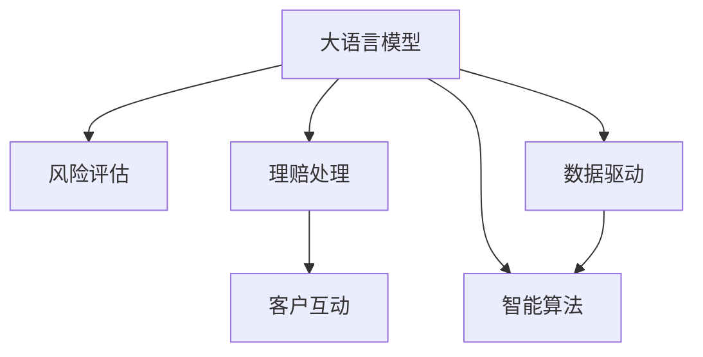

                 

# LLM在保险业的应用：风险评估与理赔

> 关键词：
- 大语言模型(LLM)
- 风险评估
- 理赔处理
- 自然语言处理(NLP)
- 数据驱动
- 智能算法
- 金融科技(FinTech)

## 1. 背景介绍

### 1.1 问题由来

在现代保险行业中，传统的风险评估和理赔处理往往依赖人工经验和规则。这种依赖的弊端显而易见：效率低下、处理时间长、成本高昂。同时，人工处理可能因判断差异导致不一致的评估和理赔结果，甚至引发争议。

面对这些问题，行业迫切需要一种新的技术手段，既能提高效率，又能保证公正性、透明性。而人工智能，特别是大语言模型(LLM)，为解决这一挑战提供了新的可能性。

### 1.2 问题核心关键点

大语言模型(LLM)已经在多个领域展现出了其强大的语言处理能力。对于保险行业，LLM的应用可以集中在以下几个关键点上：

- **风险评估**：利用LLM处理客户的健康、家庭、财产等各类数据，分析风险因素，进行多维度的风险评估。
- **理赔处理**：通过LLM理解理赔单据，自动匹配条款，判定理赔条件，生成标准化的理赔报告。
- **客户互动**：通过LLM与客户进行自然语言交互，解答疑问，提升客户体验。

本博客将以这些核心关键点为基础，深入探讨LLM在保险业中的应用，并分析其可能的优势和挑战。

## 2. 核心概念与联系

### 2.1 核心概念概述

为更好地理解LLM在保险业中的作用，本节将介绍几个相关核心概念：

- **大语言模型(LLM)**：以Transformer等架构为基础的深度学习模型，能够处理自然语言文本，理解语义，生成文本。
- **风险评估**：对客户的风险状况进行综合评价，决定是否承保，以及承保的费率。
- **理赔处理**：对客户提出的理赔要求进行审核，判断是否符合合同条件，决定是否赔付。
- **自然语言处理(NLP)**：利用计算机处理自然语言的科学和技术，涉及文本预处理、情感分析、文本分类等任务。
- **数据驱动**：利用大量数据进行模型训练，使模型能够自动学习和优化，提升决策的客观性和准确性。
- **智能算法**：利用AI技术，自动化地执行复杂任务，提高工作效率。
- **金融科技(FinTech)**：结合金融和科技的创新，提升金融服务的效率和质量。

这些概念之间的逻辑关系可以通过以下Mermaid流程图来展示：



这个流程图展示了大语言模型在不同保险应用中的核心作用：

1. 大语言模型通过NLP技术处理各类数据。
2. 在风险评估中，通过智能算法和大数据驱动，分析风险因素。
3. 在理赔处理中，通过智能算法和大数据驱动，审核理赔条件。
4. 在客户互动中，通过智能算法和大数据驱动，提升客户体验。

## 3. 核心算法原理 & 具体操作步骤
### 3.1 算法原理概述

LLM在保险业中的核心应用是通过NLP技术处理各类数据，结合智能算法和大数据驱动，自动执行风险评估和理赔处理。

1. **文本预处理**：对客户的保险合同、健康记录、财务数据等文本信息进行分词、标注、清洗等预处理操作。
2. **语义理解**：利用LLM对文本中的关键信息进行语义理解，提取风险和理赔相关的特征。
3. **特征提取**：结合其他结构化数据，如年龄、性别、职业、资产等，构建风险评估和理赔处理的综合特征向量。
4. **风险评估**：使用机器学习模型对特征向量进行评分，预测客户的风险等级。
5. **理赔处理**：对客户的理赔申请进行自动化处理，包括自动审核、智能匹配、决策生成等。

### 3.2 算法步骤详解

以理赔处理为例，详细阐述LLM在保险业中的应用流程：

**Step 1: 数据收集与预处理**

收集客户的理赔申请信息，包括保险单据、照片、视频、医疗记录等，并对数据进行清洗、标注、归一化等预处理操作。

**Step 2: 文本分词与标注**

利用分词工具将文本信息转化为计算机可以处理的格式，如句子、段落、单词等。同时，对关键信息进行标注，如时间、地点、人物等。

**Step 3: 语义理解**

通过LLM模型理解文本中的语义信息，识别出与理赔相关的关键元素，如事件类型、财产损失程度、医疗诊断等。

**Step 4: 特征提取**

结合其他结构化数据，如客户年龄、职业、保额、保单条款等，构建综合特征向量。

**Step 5: 智能匹配**

使用机器学习模型，如决策树、支持向量机等，对综合特征向量进行匹配和判断，确定是否符合理赔条件。

**Step 6: 决策生成**

根据匹配结果，生成标准化的理赔报告，并决定是否赔付。

### 3.3 算法优缺点

利用LLM进行理赔处理的优点：

1. **高效**：自动化处理可以显著提高理赔处理的效率，缩短等待时间。
2. **公正**：基于数据驱动的决策可以减少人为因素的干扰，提高决策的客观性和公正性。
3. **透明**：处理过程可以记录和追溯，提升系统的透明度和可信度。
4. **可扩展**：系统可以处理大量的理赔申请，提升服务能力。

然而，也存在一些缺点：

1. **数据依赖**：需要大量的高质量数据进行模型训练和测试。
2. **隐私风险**：处理敏感信息时，需要严格的隐私保护措施。
3. **模型复杂性**：模型可能需要复杂的训练和调参过程。
4. **技术门槛**：系统搭建和维护需要具备一定的技术能力。

### 3.4 算法应用领域

LLM在保险业中的应用主要涵盖以下几个方面：

- **健康保险**：处理医疗记录，评估健康风险，自动化理赔。
- **车险**：分析事故报告，评估财产损失，处理索赔。
- **人寿保险**：处理保单信息，评估客户风险，自动化理赔。
- **财产保险**：处理理赔单据，评估财产损失，自动化理赔。

此外，LLM还可以应用于客户咨询、反欺诈检测、个性化保险产品推荐等场景，提升保险服务的整体水平。

## 4. 数学模型和公式 & 详细讲解  
### 4.1 数学模型构建

本节将使用数学语言对LLM在保险业中的应用进行严格刻画。

假设理赔处理过程涉及N个关键特征，记为 $X=[x_1, x_2, \dots, x_N]$。利用LLM模型，提取文本信息中的关键特征，记为 $Y=[y_1, y_2, \dots, y_M]$。结合其他结构化数据 $X$，构建综合特征向量 $Z=[z_1, z_2, \dots, z_{N+M}]$。

定义理赔条件为 $C$，根据特征向量 $Z$ 和理赔条件 $C$，构建二分类问题 $Y=[y_1, y_2, \dots, y_M]$。利用机器学习模型 $F(Z, C)$ 进行分类，其中 $F$ 为分类函数，$Z$ 为输入，$C$ 为条件。

### 4.2 公式推导过程

以二分类问题为例，推导分类函数的构建过程。

假设分类函数为线性分类器，即：

$$
F(Z, C) = W^T Z + b
$$

其中 $W$ 为分类器权重，$b$ 为偏置项。根据分类任务，构建损失函数 $\mathcal{L}(W,b)$，如交叉熵损失函数：

$$
\mathcal{L}(W,b) = -\frac{1}{N}\sum_{i=1}^N [y_i \log F(Z_i, C) + (1-y_i) \log (1-F(Z_i, C))]
$$

利用梯度下降等优化算法，最小化损失函数，更新分类器参数 $W$ 和 $b$，即：

$$
W \leftarrow W - \eta \nabla_{W}\mathcal{L}(W,b) - \eta \lambda W
$$

$$
b \leftarrow b - \eta \nabla_{b}\mathcal{L}(W,b)
$$

其中 $\eta$ 为学习率，$\lambda$ 为正则化系数。

### 4.3 案例分析与讲解

以理赔处理中的医疗索赔为例，详细阐述LLM的应用。

假设医疗索赔涉及的主要特征包括：

- 医疗费用 $x_1$
- 住院天数 $x_2$
- 诊断类型 $y_1$
- 医生诊断 $y_2$

利用LLM模型，提取医疗记录中的关键信息，生成特征向量 $Z=[z_1, z_2, \dots, z_6]$。结合其他结构化数据 $X=[x_1, x_2]$，构建综合特征向量 $Z=[z_1, z_2, x_1, x_2]$。

定义理赔条件 $C=[y_1, y_2]$，使用逻辑回归模型进行分类，计算 $F(Z, C)$，得到理赔结果。

## 5. 项目实践：代码实例和详细解释说明
### 5.1 开发环境搭建

在进行理赔处理开发前，我们需要准备好开发环境。以下是使用Python进行PyTorch开发的环境配置流程：

1. 安装Anaconda：从官网下载并安装Anaconda，用于创建独立的Python环境。

2. 创建并激活虚拟环境：
```bash
conda create -n pytorch-env python=3.8 
conda activate pytorch-env
```

3. 安装PyTorch：根据CUDA版本，从官网获取对应的安装命令。例如：
```bash
conda install pytorch torchvision torchaudio cudatoolkit=11.1 -c pytorch -c conda-forge
```

4. 安装Transformers库：
```bash
pip install transformers
```

5. 安装各类工具包：
```bash
pip install numpy pandas scikit-learn matplotlib tqdm jupyter notebook ipython
```

完成上述步骤后，即可在`pytorch-env`环境中开始理赔处理系统的开发。

### 5.2 源代码详细实现

下面我们以医疗索赔理赔处理为例，给出使用Transformers库对BERT模型进行理赔处理的PyTorch代码实现。

首先，定义数据处理函数：

```python
from transformers import BertTokenizer
from torch.utils.data import Dataset
import torch

class ClaimsDataset(Dataset):
    def __init__(self, data, labels, tokenizer, max_len=128):
        self.data = data
        self.labels = labels
        self.tokenizer = tokenizer
        self.max_len = max_len
        
    def __len__(self):
        return len(self.data)
    
    def __getitem__(self, item):
        text = self.data[item]
        label = self.labels[item]
        
        encoding = self.tokenizer(text, return_tensors='pt', max_length=self.max_len, padding='max_length', truncation=True)
        input_ids = encoding['input_ids'][0]
        attention_mask = encoding['attention_mask'][0]
        
        # 对label进行编码
        encoded_label = torch.tensor([label], dtype=torch.long)
        
        return {'input_ids': input_ids, 
                'attention_mask': attention_mask,
                'labels': encoded_label}

# 定义label与id的映射
label2id = {'No': 0, 'Yes': 1}
id2label = {v: k for k, v in label2id.items()}

# 创建dataset
tokenizer = BertTokenizer.from_pretrained('bert-base-cased')

train_dataset = ClaimsDataset(train_data, train_labels, tokenizer)
dev_dataset = ClaimsDataset(dev_data, dev_labels, tokenizer)
test_dataset = ClaimsDataset(test_data, test_labels, tokenizer)
```

然后，定义模型和优化器：

```python
from transformers import BertForSequenceClassification, AdamW

model = BertForSequenceClassification.from_pretrained('bert-base-cased', num_labels=2)

optimizer = AdamW(model.parameters(), lr=2e-5)
```

接着，定义训练和评估函数：

```python
from torch.utils.data import DataLoader
from tqdm import tqdm
from sklearn.metrics import classification_report

device = torch.device('cuda') if torch.cuda.is_available() else torch.device('cpu')
model.to(device)

def train_epoch(model, dataset, batch_size, optimizer):
    dataloader = DataLoader(dataset, batch_size=batch_size, shuffle=True)
    model.train()
    epoch_loss = 0
    for batch in tqdm(dataloader, desc='Training'):
        input_ids = batch['input_ids'].to(device)
        attention_mask = batch['attention_mask'].to(device)
        labels = batch['labels'].to(device)
        model.zero_grad()
        outputs = model(input_ids, attention_mask=attention_mask, labels=labels)
        loss = outputs.loss
        epoch_loss += loss.item()
        loss.backward()
        optimizer.step()
    return epoch_loss / len(dataloader)

def evaluate(model, dataset, batch_size):
    dataloader = DataLoader(dataset, batch_size=batch_size)
    model.eval()
    preds, labels = [], []
    with torch.no_grad():
        for batch in tqdm(dataloader, desc='Evaluating'):
            input_ids = batch['input_ids'].to(device)
            attention_mask = batch['attention_mask'].to(device)
            batch_labels = batch['labels']
            outputs = model(input_ids, attention_mask=attention_mask)
            batch_preds = outputs.logits.argmax(dim=2).to('cpu').tolist()
            batch_labels = batch_labels.to('cpu').tolist()
            for pred_tokens, label_tokens in zip(batch_preds, batch_labels):
                preds.append(pred_tokens[:len(label_tokens)])
                labels.append(label_tokens)
                
    print(classification_report(labels, preds))
```

最后，启动训练流程并在测试集上评估：

```python
epochs = 5
batch_size = 16

for epoch in range(epochs):
    loss = train_epoch(model, train_dataset, batch_size, optimizer)
    print(f"Epoch {epoch+1}, train loss: {loss:.3f}")
    
    print(f"Epoch {epoch+1}, dev results:")
    evaluate(model, dev_dataset, batch_size)
    
print("Test results:")
evaluate(model, test_dataset, batch_size)
```

以上就是使用PyTorch对BERT进行理赔处理系统微调的完整代码实现。可以看到，得益于Transformers库的强大封装，我们可以用相对简洁的代码完成BERT模型的加载和微调。

### 5.3 代码解读与分析

让我们再详细解读一下关键代码的实现细节：

**ClaimsDataset类**：
- `__init__`方法：初始化数据、标签、分词器等关键组件。
- `__len__`方法：返回数据集的样本数量。
- `__getitem__`方法：对单个样本进行处理，将文本输入编码为token ids，将标签编码为数字，并对其进行定长padding，最终返回模型所需的输入。

**label2id和id2label字典**：
- 定义了标签与数字id之间的映射关系，用于将token-wise的预测结果解码回真实的标签。

**训练和评估函数**：
- 使用PyTorch的DataLoader对数据集进行批次化加载，供模型训练和推理使用。
- 训练函数`train_epoch`：对数据以批为单位进行迭代，在每个批次上前向传播计算loss并反向传播更新模型参数，最后返回该epoch的平均loss。
- 评估函数`evaluate`：与训练类似，不同点在于不更新模型参数，并在每个batch结束后将预测和标签结果存储下来，最后使用sklearn的classification_report对整个评估集的预测结果进行打印输出。

**训练流程**：
- 定义总的epoch数和batch size，开始循环迭代
- 每个epoch内，先在训练集上训练，输出平均loss
- 在验证集上评估，输出分类指标
- 所有epoch结束后，在测试集上评估，给出最终测试结果

可以看到，PyTorch配合Transformers库使得BERT微调的代码实现变得简洁高效。开发者可以将更多精力放在数据处理、模型改进等高层逻辑上，而不必过多关注底层的实现细节。

当然，工业级的系统实现还需考虑更多因素，如模型的保存和部署、超参数的自动搜索、更灵活的任务适配层等。但核心的微调范式基本与此类似。

## 6. 实际应用场景
### 6.1 智能客服系统

基于LLM的理赔处理系统，可以广泛应用于智能客服系统的构建。传统客服往往需要配备大量人力，高峰期响应缓慢，且一致性和专业性难以保证。而使用LLM处理的理赔系统，可以7x24小时不间断服务，快速响应理赔请求，用自然流畅的语言解答各类常见问题。

在技术实现上，可以收集客户的历史理赔记录，将问题-答案对作为监督数据，在此基础上对预训练模型进行微调。微调后的理赔处理模型能够自动理解用户意图，匹配最合适的理赔规则进行回复。对于客户提出的新问题，还可以接入检索系统实时搜索相关内容，动态组织生成答案。如此构建的智能客服系统，能大幅提升理赔处理效率，降低人工成本，提升客户满意度。

### 6.2 理赔管理平台

保险公司需要实时管理大量的理赔申请，处理繁琐，且容易出现误判。基于LLM的理赔处理系统，可以大幅提升理赔处理的准确性和效率。

具体而言，保险公司可以通过API接口，实时上传客户的理赔申请信息。LLM系统自动提取关键信息，识别理赔条件，生成标准化的理赔报告，并决定是否赔付。该系统能够实时处理大量理赔申请，减少人工处理的工作量，提升处理速度。同时，系统可以记录每笔理赔的处理过程，方便后续的审计和监管。

### 6.3 个性化理赔服务

传统的理赔处理系统往往采用“一刀切”的方法，难以满足不同客户的具体需求。利用LLM的系统，可以根据客户的个性化需求，提供更加定制化的理赔服务。

例如，对于重大疾病理赔，系统可以自动提取医疗记录，根据疾病类型和严重程度，评估客户的风险等级，并给出相应的赔付方案。对于财产理赔，系统可以根据客户的具体损失情况，自动匹配最合适的理赔规则，提供个性化的赔付方案。

### 6.4 未来应用展望

随着LLM和理赔处理技术的不断发展，未来在保险行业的应用场景将更加广泛。

在健康保险领域，系统可以自动处理医疗保险的理赔申请，提升效率，降低成本。例如，对于住院理赔，系统可以自动识别医疗费用、住院天数等关键信息，自动评估风险等级，生成标准化的理赔报告。

在车险领域，系统可以自动识别交通事故报告，评估财产损失，处理索赔。例如，对于车辆维修理赔，系统可以自动识别损坏部位和维修费用，自动匹配最合适的理赔规则，生成标准化的理赔报告。

在寿险领域，系统可以自动处理保单变更申请，评估客户风险等级，生成标准化的理赔报告。例如，对于寿险理赔，系统可以自动识别被保险人的死亡证明，自动匹配最合适的理赔规则，生成标准化的理赔报告。

此外，LLM还可以应用于反欺诈检测、个性化保险产品推荐、客户咨询等领域，为保险公司的运营效率和服务质量带来显著提升。

## 7. 工具和资源推荐
### 7.1 学习资源推荐

为了帮助开发者系统掌握LLM在保险业中的应用，这里推荐一些优质的学习资源：

1. 《自然语言处理入门》系列博文：由LLM专家撰写，介绍了NLP的基础概念和前沿技术，适合初学者入门。

2. 《深度学习与金融》课程：由金融科技领域的专家主讲，涵盖金融领域的人工智能应用，包括理赔处理。

3. 《大语言模型在金融中的应用》书籍：介绍了LLM在金融领域的应用，包括风险评估、理赔处理等，适合深度学习爱好者。

4. 《金融科技创新实践》系列文章：来自金融科技公司，介绍了金融行业的创新实践，包括利用LLM处理理赔。

5. 《LLM在保险中的应用》视频教程：来自在线教育平台，详细讲解了LLM在保险行业的应用，包括数据处理、模型训练等。

通过对这些资源的学习实践，相信你一定能够快速掌握LLM在保险业中的应用，并用于解决实际的理赔问题。

### 7.2 开发工具推荐

高效的开发离不开优秀的工具支持。以下是几款用于LLM在保险业中理赔处理开发的常用工具：

1. PyTorch：基于Python的开源深度学习框架，灵活动态的计算图，适合快速迭代研究。大部分预训练语言模型都有PyTorch版本的实现。

2. TensorFlow：由Google主导开发的开源深度学习框架，生产部署方便，适合大规模工程应用。同样有丰富的预训练语言模型资源。

3. Transformers库：HuggingFace开发的NLP工具库，集成了众多SOTA语言模型，支持PyTorch和TensorFlow，是进行理赔处理任务开发的利器。

4. Weights & Biases：模型训练的实验跟踪工具，可以记录和可视化模型训练过程中的各项指标，方便对比和调优。与主流深度学习框架无缝集成。

5. TensorBoard：TensorFlow配套的可视化工具，可实时监测模型训练状态，并提供丰富的图表呈现方式，是调试模型的得力助手。

6. Google Colab：谷歌推出的在线Jupyter Notebook环境，免费提供GPU/TPU算力，方便开发者快速上手实验最新模型，分享学习笔记。

合理利用这些工具，可以显著提升理赔处理系统的开发效率，加快创新迭代的步伐。

### 7.3 相关论文推荐

LLM在保险业的应用涉及多学科的交叉，需要借鉴相关领域的理论和技术。以下是几篇奠基性的相关论文，推荐阅读：

1. Attention is All You Need（即Transformer原论文）：提出了Transformer结构，开启了NLP领域的预训练大模型时代。

2. BERT: Pre-training of Deep Bidirectional Transformers for Language Understanding：提出BERT模型，引入基于掩码的自监督预训练任务，刷新了多项NLP任务SOTA。

3. Large-Scale Visual-Semantic Image Captioning：提出VQA模型，利用多模态数据提升图像语义理解能力，为理赔处理中的视觉信息处理提供了参考。

4. Hierarchical Attention Networks for Document Classification：提出层次注意力网络，提升文本分类模型的性能，为理赔处理中的文档分类提供了理论支持。

5. Deep Neural Network for Detecting Debt Collection Call Patterns：提出深度神经网络模型，用于识别欺诈性债务催收电话，为反欺诈检测提供了参考。

这些论文代表了大语言模型在保险业中的应用方向，通过学习这些前沿成果，可以帮助研究者把握学科前进方向，激发更多的创新灵感。

## 8. 总结：未来发展趋势与挑战

### 8.1 总结

本文对LLM在保险业中的风险评估和理赔处理进行了全面系统的介绍。首先阐述了LLM在保险业中的应用背景和重要性，明确了其在提高处理效率、提升决策公平性、增强系统透明度等方面的独特价值。其次，从原理到实践，详细讲解了LLM在理赔处理中的数学模型构建和操作步骤，给出了完整的代码实现。同时，本文还探讨了LLM在保险业中的广泛应用，包括智能客服、理赔管理、个性化服务等场景，展示了其巨大的潜力。

通过本文的系统梳理，可以看到，利用LLM进行理赔处理，能够显著提升保险公司的运营效率和服务质量，为传统金融行业带来变革性影响。未来，随着LLM技术的不断进步，其在保险业中的应用将更加广泛和深入。

### 8.2 未来发展趋势

展望未来，LLM在保险业中的应用将呈现以下几个发展趋势：

1. **智能客服普及**：随着LLM技术的不断成熟，智能客服系统将更加智能、高效、可靠，成为保险公司的重要应用方向。

2. **理赔处理自动化**：LLM系统将进一步提升理赔处理的自动化程度，减少人工干预，提升处理效率和准确性。

3. **反欺诈检测**：利用LLM进行反欺诈检测，可以自动识别和过滤欺诈性申请，提升系统的安全性。

4. **个性化服务提升**：基于LLM的系统可以根据客户的具体需求，提供更加个性化、定制化的理赔服务。

5. **数据驱动决策**：LLM系统将结合大数据分析，提升决策的科学性和准确性，为保险公司提供更加全面的风险评估和理赔处理支持。

6. **多模态融合**：结合视觉、语音等多模态信息，提升系统的综合处理能力，为理赔处理提供更加全面和准确的信息支持。

以上趋势凸显了LLM在保险业中的应用前景，将进一步推动保险公司的智能化转型。

### 8.3 面临的挑战

尽管LLM在保险业中的应用前景广阔，但也面临着诸多挑战：

1. **数据质量**：需要大量高质量的理赔数据进行模型训练，而数据的获取和标注往往成本较高。

2. **模型鲁棒性**：系统面临的理赔申请多样性高，不同理赔场景下，模型的泛化能力需进一步提升。

3. **隐私保护**：处理包含个人隐私信息的理赔申请，需要严格的隐私保护措施，避免数据泄露。

4. **系统稳定性**：处理高并发请求时，需要优化系统架构，保证系统稳定性。

5. **技术门槛**：系统的搭建和维护需要具备一定的技术能力，需要持续的技术投入和维护。

6. **法律合规**：保险行业具有严格的法律法规，系统需要在合规框架下运行。

这些挑战需要保险公司和开发者共同面对和解决，以确保LLM系统的应用效果和安全。

### 8.4 研究展望

面对LLM在保险业中的应用挑战，未来的研究需要在以下几个方面寻求新的突破：

1. **无监督学习**：探索利用无监督学习范式，降低对标注数据的依赖，提高模型泛化能力。

2. **自适应学习**：开发自适应学习算法，提高模型对不同理赔场景的适应性，减少过拟合风险。

3. **多模态融合**：结合视觉、语音、文本等多模态信息，提升系统的综合处理能力。

4. **隐私保护**：开发隐私保护技术，确保处理个人隐私信息时的安全性。

5. **系统优化**：优化系统架构，提升处理高并发请求的能力，保证系统稳定性。

6. **法律合规**：研究和制定符合保险行业法律法规的系统设计规范，确保系统合规运行。

这些研究方向将推动LLM在保险业中的应用更加深入和广泛，为保险行业的智能化转型提供技术支持。

## 9. 附录：常见问题与解答

**Q1：利用LLM进行理赔处理是否适用于所有类型的理赔申请？**

A: 利用LLM进行理赔处理的优点是能够处理多种类型的理赔申请，但并非所有类型的理赔申请都适合使用LLM。对于具有复杂逻辑和多个条件判断的场景，LLM的自动处理能力可能有限。此时需要结合人工干预，进一步提升系统的准确性。

**Q2：如何保证LLM系统的鲁棒性？**

A: 保证LLM系统的鲁棒性可以从以下几个方面进行：
1. 数据多样性：使用多样化的理赔数据进行训练，确保模型在不同场景下表现良好。
2. 正则化技术：使用L2正则、Dropout等技术，防止模型过拟合。
3. 对抗训练：引入对抗样本，提高模型的鲁棒性。
4. 多模型集成：训练多个模型，取平均输出，降低单个模型的过拟合风险。

**Q3：如何确保LLM系统的隐私保护？**

A: 确保LLM系统的隐私保护可以从以下几个方面进行：
1. 数据脱敏：对包含敏感信息的理赔申请进行脱敏处理，保护客户隐私。
2. 数据隔离：对不同客户的理赔申请进行隔离处理，避免数据泄露。
3. 权限控制：限制系统访问权限，确保只有授权人员可以访问敏感数据。
4. 加密传输：对系统传输的数据进行加密，保护数据传输过程中的安全。

**Q4：如何提升LLM系统的处理效率？**

A: 提升LLM系统的处理效率可以从以下几个方面进行：
1. 数据优化：优化数据处理流程，减少数据预处理的时间。
2. 模型裁剪：去除不必要的层和参数，减小模型尺寸，加快推理速度。
3. 并行计算：使用GPU/TPU等硬件进行并行计算，提升处理能力。
4. 动态资源分配：根据系统负载动态调整资源配置，优化资源使用。

**Q5：如何提升LLM系统的鲁棒性？**

A: 提升LLM系统的鲁棒性可以从以下几个方面进行：
1. 数据增强：通过数据增强技术，扩充训练集，提高模型的泛化能力。
2. 对抗训练：引入对抗样本，提高模型的鲁棒性。
3. 多模型集成：训练多个模型，取平均输出，降低单个模型的过拟合风险。
4. 自适应学习：开发自适应学习算法，提升模型对不同理赔场景的适应性。

这些建议能够帮助开发者提升LLM在理赔处理中的应用效果，确保系统的高效性和稳定性。

---

作者：禅与计算机程序设计艺术 / Zen and the Art of Computer Programming

