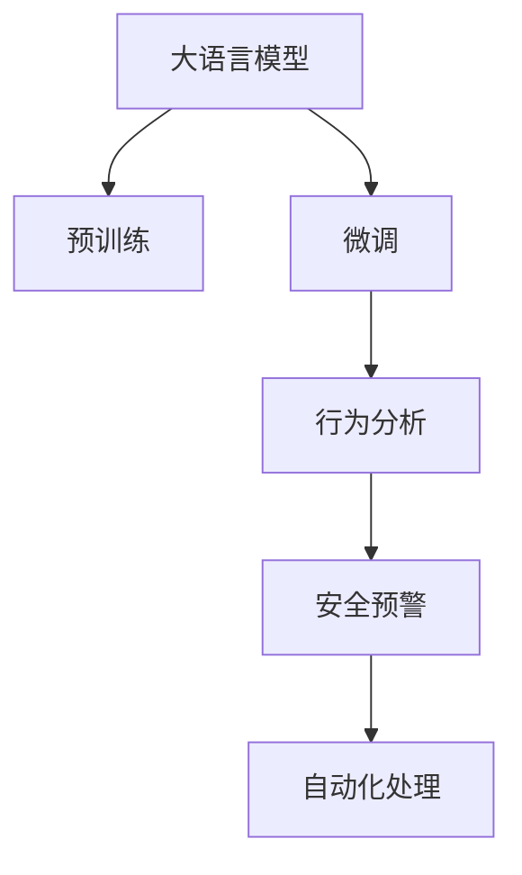

                 

# LLM在公共安全中的应用：智能监控系统

> 关键词：大语言模型(LLM), 智能监控, 图像识别, 视频分析, 行为分析, 安全预警, 公共安全, 自动化, 深度学习

## 1. 背景介绍

### 1.1 问题由来
公共安全领域需要实时监测和管理大量复杂场景，以预防和应对各类潜在威胁。传统的人工监控方式依赖大量人力，效率低下，成本高昂。近年来，随着深度学习和计算机视觉技术的快速发展，大语言模型在图像和视频分析等领域展现了巨大潜力，成为提升公共安全监控效率和准确性的重要手段。

### 1.2 问题核心关键点
当前，大语言模型在公共安全领域的应用主要集中在视频和图像的智能分析和理解。其核心在于：

- **图像识别和标注**：通过大量带有标签的图像和视频数据，对模型进行预训练，使其能够准确识别出各类目标和异常行为。
- **行为分析**：利用模型对个体行为进行分析，判断其是否存在异常行为或潜在威胁。
- **事件预警和响应**：基于识别和分析结果，及时发出预警信息，通知相关部门采取行动，以应对各类安全威胁。
- **自动化和智能推理**：大语言模型能够自动处理和分析大量数据，减少人工干预，提高监控系统的智能化水平。

### 1.3 问题研究意义
大语言模型在公共安全中的应用，可以有效提升监控系统的实时性和准确性，降低人工成本，同时减少因人为疏忽而导致的潜在风险。这对于构建更加智能、高效、安全的公共安全体系，具有重要意义：

1. **效率提升**：大语言模型可以同时处理多个监控摄像头传回的实时数据，大大提升监控系统的响应速度和覆盖面。
2. **准确性提高**：模型通过大规模数据训练，能够识别出更多细微的异常行为和潜在威胁，减少误报和漏报。
3. **成本节约**：减少了对大量人工监控人员的依赖，节约了人力成本。
4. **实时预警**：通过智能分析，实现实时预警和自动响应，提高安全响应速度。
5. **智能化管理**：利用大语言模型对大量监控数据进行智能分析和推理，提供更加精细化的安全管理方案。

## 2. 核心概念与联系

### 2.1 核心概念概述

为更好地理解大语言模型在公共安全监控中的应用，本节将介绍几个密切相关的核心概念：

- **大语言模型(Large Language Model, LLM)**：以自回归(如GPT)或自编码(如BERT)模型为代表的大规模预训练语言模型。通过在大规模无标签文本语料上进行预训练，学习通用的语言表示，具备强大的语言理解和生成能力。

- **预训练(Pre-training)**：指在大规模无标签文本语料上，通过自监督学习任务训练通用语言模型的过程。常见的预训练任务包括言语建模、遮挡语言模型等。预训练使得模型学习到语言的通用表示。

- **微调(Fine-tuning)**：指在预训练模型的基础上，使用下游任务的少量标注数据，通过有监督地训练来优化模型在该任务上的性能。通常只需要调整顶层分类器或解码器，并以较小的学习率更新全部或部分的模型参数。

- **迁移学习(Transfer Learning)**：指将一个领域学习到的知识，迁移应用到另一个不同但相关的领域的学习范式。大模型的预训练-微调过程即是一种典型的迁移学习方式。

- **行为分析(Behavior Analysis)**：通过分析个体的行为模式，识别出可能存在的威胁和异常行为。大语言模型可以基于对行为的理解，进行分类、排序和预测等分析。

- **安全预警(Security Alert)**：基于分析结果，对可能的安全威胁发出预警信息，以便及时采取措施应对。

- **自动化处理(Automatic Processing)**：利用大语言模型自动处理和分析视频和图像数据，减少人工干预，提高监控系统的智能化水平。

这些核心概念之间的逻辑关系可以通过以下Mermaid流程图来展示：



这个流程图展示了大语言模型在公共安全监控中的应用逻辑：

1. 大语言模型通过预训练获得基础能力。
2. 微调是对预训练模型进行任务特定的优化，具体应用于行为分析。
3. 行为分析利用模型对个体行为进行模式识别和威胁判断。
4. 安全预警根据分析结果发出预警信息，供相关部门采取行动。
5. 自动化处理使得监控系统可以无间断运行，提升效率和响应速度。

## 3. 核心算法原理 & 具体操作步骤
### 3.1 算法原理概述

大语言模型在公共安全中的应用，主要基于图像和视频数据的智能分析和行为识别。其核心思想是：将大语言模型视作一个强大的"特征提取器"，通过在特定行为数据上进行有监督地训练，使其能够识别出异常行为或潜在威胁，并通过预警系统通知相关部门。

形式化地，假设模型为 $M_{\theta}$，其中 $\theta$ 为模型参数。给定行为数据集 $D=\{(x_i,y_i)\}_{i=1}^N$，每个样本 $x_i$ 为视频或图像，$y_i$ 为标签，表示行为是否异常。微调的目标是找到新的模型参数 $\hat{\theta}$，使得模型在数据集 $D$ 上的分类损失最小化，即：

$$
\hat{\theta}=\mathop{\arg\min}_{\theta} \mathcal{L}(M_{\theta},D)
$$

其中 $\mathcal{L}$ 为分类交叉熵损失函数，用于衡量模型预测输出与真实标签之间的差异。

### 3.2 算法步骤详解

基于监督学习的大语言模型在公共安全监控中的应用一般包括以下几个关键步骤：

**Step 1: 准备预训练模型和数据集**
- 选择合适的预训练模型 $M_{\theta}$ 作为初始化参数，如 ResNet、Inception 等。
- 准备行为数据集 $D$，包括各类异常行为和非异常行为的标注视频或图像，划分为训练集、验证集和测试集。

**Step 2: 添加行为分析层**
- 根据行为识别任务，在预训练模型顶层设计合适的输出层和损失函数。
- 对于分类任务，通常在顶层添加线性分类器和交叉熵损失函数。
- 对于回归任务，可以采用均方误差损失函数。

**Step 3: 设置微调超参数**
- 选择合适的优化算法及其参数，如 AdamW、SGD 等，设置学习率、批大小、迭代轮数等。
- 设置正则化技术及强度，包括权重衰减、Dropout、Early Stopping 等。
- 确定冻结预训练参数的策略，如仅微调顶层，或全部参数都参与微调。

**Step 4: 执行梯度训练**
- 将训练集数据分批次输入模型，前向传播计算损失函数。
- 反向传播计算参数梯度，根据设定的优化算法和学习率更新模型参数。
- 周期性在验证集上评估模型性能，根据性能指标决定是否触发 Early Stopping。
- 重复上述步骤直到满足预设的迭代轮数或 Early Stopping 条件。

**Step 5: 测试和部署**
- 在测试集上评估微调后模型 $M_{\hat{\theta}}$ 的性能，对比微调前后的精度提升。
- 使用微调后的模型对新视频或图像进行推理预测，集成到公共安全监控系统中。
- 持续收集新的数据，定期重新微调模型，以适应数据分布的变化。

以上是基于监督学习微调大语言模型的一般流程。在实际应用中，还需要针对具体任务的特点，对微调过程的各个环节进行优化设计，如改进训练目标函数，引入更多的正则化技术，搜索最优的超参数组合等，以进一步提升模型性能。

### 3.3 算法优缺点

基于监督学习的大语言模型在公共安全中的应用具有以下优点：

- **效率高**：通过微调，模型能够快速适应特定任务，实现实时预警和自动响应。
- **准确性好**：利用大规模数据训练，模型能够识别更多细微的异常行为，减少误报和漏报。
- **自动化程度高**：模型能够自动处理和分析大量数据，减少人工干预，提高监控系统的智能化水平。
- **适应性强**：模型可以根据新的数据进行持续学习，适应数据分布的变化，保持高性能。

同时，该方法也存在一定的局限性：

- **依赖标注数据**：微调的效果很大程度上取决于标注数据的质量和数量，获取高质量标注数据的成本较高。
- **泛化能力有限**：当目标任务与预训练数据的分布差异较大时，微调的性能提升有限。
- **可解释性不足**：微调模型的决策过程通常缺乏可解释性，难以对其推理逻辑进行分析和调试。

尽管存在这些局限性，但就目前而言，基于监督学习的微调方法仍是大语言模型应用的最主流范式。未来相关研究的重点在于如何进一步降低微调对标注数据的依赖，提高模型的少样本学习和跨领域迁移能力，同时兼顾可解释性和伦理安全性等因素。

### 3.4 算法应用领域

基于大语言模型微调的监督学习方法，在公共安全监控领域已经得到了广泛的应用，覆盖了多种场景，例如：

- **监控视频行为分析**：对公共场所的视频进行实时监控，识别出可疑行为或异常事件，如违规进入、斗殴等。
- **交通流量监测**：利用摄像头实时捕捉交通流数据，识别出违规驾驶、交通事故等行为。
- **边界入侵检测**：通过监控摄像头捕捉边界入侵数据，自动识别违规越界行为。
- **异常事件预警**：对各类异常事件进行实时监测和预警，如火灾、爆炸、犯罪等。
- **公共场所安全管理**：在博物馆、机场、学校等场所，通过行为分析对人群行为进行实时监控和管理。
- **视频内容审核**：对各类视频内容进行自动审核，识别并屏蔽有害信息。

除了上述这些经典任务外，大语言模型微调也被创新性地应用到更多场景中，如行为识别、人群密度分析、可疑物品检测等，为公共安全监控带来了新的突破。随着预训练模型和微调方法的不断进步，相信公共安全监控技术将在更广阔的应用领域大放异彩。

## 4. 数学模型和公式 & 详细讲解  
### 4.1 数学模型构建

本节将使用数学语言对基于监督学习的大语言模型在公共安全监控中的应用进行更加严格的刻画。

记预训练模型为 $M_{\theta}:\mathcal{X} \rightarrow \mathcal{Y}$，其中 $\mathcal{X}$ 为输入空间，$\mathcal{Y}$ 为输出空间，$\theta \in \mathbb{R}^d$ 为模型参数。假设行为数据集为 $D=\{(x_i,y_i)\}_{i=1}^N, x_i \in \mathcal{X}, y_i \in \{0,1\}$，其中 $0$ 表示非异常行为，$1$ 表示异常行为。

定义模型 $M_{\theta}$ 在数据样本 $(x,y)$ 上的损失函数为 $\ell(M_{\theta}(x),y)$，则在数据集 $D$ 上的经验风险为：

$$
\mathcal{L}(\theta) = \frac{1}{N} \sum_{i=1}^N \ell(M_{\theta}(x_i),y_i)
$$

其中 $\ell$ 为分类交叉熵损失函数，用于衡量模型预测输出与真实标签之间的差异。

在实践中，我们通常使用基于梯度的优化算法（如SGD、Adam等）来近似求解上述最优化问题。设 $\eta$ 为学习率，$\lambda$ 为正则化系数，则参数的更新公式为：

$$
\theta \leftarrow \theta - \eta \nabla_{\theta}\mathcal{L}(\theta) - \eta\lambda\theta
$$

其中 $\nabla_{\theta}\mathcal{L}(\theta)$ 为损失函数对参数 $\theta$ 的梯度，可通过反向传播算法高效计算。

### 4.2 公式推导过程

以下我们以二分类任务为例，推导分类交叉熵损失函数及其梯度的计算公式。

假设模型 $M_{\theta}$ 在输入 $x$ 上的输出为 $\hat{y}=M_{\theta}(x) \in [0,1]$，表示样本属于正类的概率。真实标签 $y \in \{0,1\}$。则二分类交叉熵损失函数定义为：

$$
\ell(M_{\theta}(x),y) = -[y\log \hat{y} + (1-y)\log (1-\hat{y})]
$$

将其代入经验风险公式，得：

$$
\mathcal{L}(\theta) = -\frac{1}{N}\sum_{i=1}^N [y_i\log M_{\theta}(x_i)+(1-y_i)\log(1-M_{\theta}(x_i))]
$$

根据链式法则，损失函数对参数 $\theta_k$ 的梯度为：

$$
\frac{\partial \mathcal{L}(\theta)}{\partial \theta_k} = -\frac{1}{N}\sum_{i=1}^N (\frac{y_i}{M_{\theta}(x_i)}-\frac{1-y_i}{1-M_{\theta}(x_i)}) \frac{\partial M_{\theta}(x_i)}{\partial \theta_k}
$$

其中 $\frac{\partial M_{\theta}(x_i)}{\partial \theta_k}$ 可进一步递归展开，利用自动微分技术完成计算。

在得到损失函数的梯度后，即可带入参数更新公式，完成模型的迭代优化。重复上述过程直至收敛，最终得到适应下游任务的最优模型参数 $\theta^*$。

## 5. 项目实践：代码实例和详细解释说明
### 5.1 开发环境搭建

在进行微调实践前，我们需要准备好开发环境。以下是使用Python进行PyTorch开发的环境配置流程：

1. 安装Anaconda：从官网下载并安装Anaconda，用于创建独立的Python环境。

2. 创建并激活虚拟环境：
```bash
conda create -n pytorch-env python=3.8 
conda activate pytorch-env
```

3. 安装PyTorch：根据CUDA版本，从官网获取对应的安装命令。例如：
```bash
conda install pytorch torchvision torchaudio cudatoolkit=11.1 -c pytorch -c conda-forge
```

4. 安装TensorFlow：
```bash
conda install tensorflow==2.8 -c conda-forge
```

5. 安装各类工具包：
```bash
pip install numpy pandas scikit-learn matplotlib tqdm jupyter notebook ipython
```

完成上述步骤后，即可在`pytorch-env`环境中开始微调实践。

### 5.2 源代码详细实现

下面我以行为识别任务为例，给出使用PyTorch对ResNet模型进行微调的代码实现。

首先，定义行为识别任务的数据处理函数：

```python
from torch.utils.data import Dataset
import torch

class BehaviorDataset(Dataset):
    def __init__(self, data, labels, transform=None):
        self.data = data
        self.labels = labels
        self.transform = transform
        
    def __len__(self):
        return len(self.data)
    
    def __getitem__(self, idx):
        img = self.data[idx]
        label = self.labels[idx]
        
        if self.transform:
            img = self.transform(img)
        
        return {'image': img, 'label': label}
```

然后，定义模型和优化器：

```python
from transformers import ResNet
from transformers import AdamW

model = ResNet(resnet18=True)
optimizer = AdamW(model.parameters(), lr=1e-4)
```

接着，定义训练和评估函数：

```python
from torch.utils.data import DataLoader
from tqdm import tqdm

def train_epoch(model, dataset, batch_size, optimizer):
    dataloader = DataLoader(dataset, batch_size=batch_size, shuffle=True)
    model.train()
    epoch_loss = 0
    for batch in tqdm(dataloader, desc='Training'):
        inputs = batch['image']
        labels = batch['label']
        model.zero_grad()
        outputs = model(inputs)
        loss = outputs.loss
        epoch_loss += loss.item()
        loss.backward()
        optimizer.step()
    return epoch_loss / len(dataloader)

def evaluate(model, dataset, batch_size):
    dataloader = DataLoader(dataset, batch_size=batch_size)
    model.eval()
    preds, labels = [], []
    with torch.no_grad():
        for batch in tqdm(dataloader, desc='Evaluating'):
            inputs = batch['image']
            labels = batch['label']
            outputs = model(inputs)
            preds.append(outputs.argmax(dim=1).cpu().numpy())
            labels.append(labels.cpu().numpy())
        
    return np.mean(np.array(preds) == np.array(labels))
```

最后，启动训练流程并在测试集上评估：

```python
epochs = 5
batch_size = 16

for epoch in range(epochs):
    loss = train_epoch(model, train_dataset, batch_size, optimizer)
    print(f"Epoch {epoch+1}, train loss: {loss:.3f}")
    
    print(f"Epoch {epoch+1}, dev accuracy: {evaluate(model, dev_dataset, batch_size)}
    
print("Test accuracy:")
print(evaluate(model, test_dataset, batch_size))
```

以上就是使用PyTorch对ResNet进行行为识别任务微调的完整代码实现。可以看到，得益于Transformer库的强大封装，我们可以用相对简洁的代码完成ResNet模型的加载和微调。

### 5.3 代码解读与分析

让我们再详细解读一下关键代码的实现细节：

**BehaviorDataset类**：
- `__init__`方法：初始化数据、标签和可选的转换函数。
- `__len__`方法：返回数据集的样本数量。
- `__getitem__`方法：对单个样本进行处理，获取图片和标签，并可选择应用转换函数。

**训练和评估函数**：
- 使用PyTorch的DataLoader对数据集进行批次化加载，供模型训练和推理使用。
- 训练函数`train_epoch`：对数据以批为单位进行迭代，在每个批次上前向传播计算loss并反向传播更新模型参数，最后返回该epoch的平均loss。
- 评估函数`evaluate`：与训练类似，不同点在于不更新模型参数，并在每个batch结束后将预测和标签结果存储下来，最后使用准确率评估整个评估集的性能。

**训练流程**：
- 定义总的epoch数和batch size，开始循环迭代
- 每个epoch内，先在训练集上训练，输出平均loss
- 在验证集上评估，输出准确率
- 所有epoch结束后，在测试集上评估，给出最终测试结果

可以看到，PyTorch配合Transformer库使得ResNet微调的代码实现变得简洁高效。开发者可以将更多精力放在数据处理、模型改进等高层逻辑上，而不必过多关注底层的实现细节。

当然，工业级的系统实现还需考虑更多因素，如模型的保存和部署、超参数的自动搜索、更灵活的任务适配层等。但核心的微调范式基本与此类似。

## 6. 实际应用场景
### 6.1 监控视频行为分析

基于大语言模型微调的监控视频行为分析，可以广泛应用于各类公共场所的视频监控。传统的人工监控依赖大量人力，容易产生误报和漏报，而使用微调后的模型，可以7x24小时不间断服务，快速响应各类异常行为，提高监控效率和安全性。

在技术实现上，可以收集公共场所的历史监控视频，将其中捕捉到的异常行为（如违规进入、斗殴等）标注成监督数据，在此基础上对预训练模型进行微调。微调后的模型能够自动理解视频内容，识别出各类异常行为，并及时发出预警信息，通知相关部门进行处置。

### 6.2 交通流量监测

利用摄像头实时捕捉交通流数据，对违规驾驶、交通事故等行为进行实时监测和预警。通过微调模型，可以快速识别出异常交通行为，提高交通管理的智能化水平，降低交通事故发生率，提升交通效率。

在实践中，可以将各类交通违规行为的标注视频作为监督数据，对预训练模型进行微调。微调后的模型能够自动分析交通流量，识别出异常驾驶行为，并及时发出预警信息，提醒相关部门进行干预。

### 6.3 边界入侵检测

在重要设施的边界周围，通过监控摄像头捕捉入侵数据，自动识别违规越界行为。通过微调模型，可以快速识别出非法进入、攀爬等行为，提高边界安全的智能化水平，减少人工巡检的频次和成本。

在实践中，可以将各类边界入侵行为的标注视频作为监督数据，对预训练模型进行微调。微调后的模型能够自动分析边界监控视频，识别出违规行为，并及时发出预警信息，确保设施安全。

### 6.4 未来应用展望

随着大语言模型微调技术的发展，其在公共安全领域的应用前景将更加广阔：

1. **自动化程度更高**：未来的大语言模型将更加智能化，能够自动识别更多细微的异常行为，减少人工干预，提高监控系统的自动化水平。
2. **实时响应更快**：得益于模型性能的提升和硬件设备的优化，监控系统的实时响应速度将显著提高，能够更快地捕捉和处理各类安全事件。
3. **跨领域迁移能力更强**：未来的大语言模型将具备更强的跨领域迁移能力，能够在不同的监控场景中高效适应，提升系统的通用性。
4. **可解释性更强**：未来的模型将赋予更强的可解释性，通过自然语言描述其决策过程，便于对模型的理解和调试。
5. **人机协同更深入**：基于大语言模型的监控系统将与智能机器人、无人机等设备协同工作，形成更加全面、智能化的安全防护体系。

总之，大语言模型在公共安全领域的应用前景广阔，其高效、智能、实时、自动化的特点，将为各类公共场所提供更加安全、便捷、高效的安全防护方案。相信随着技术的进步，大语言模型将成为公共安全领域不可或缺的重要技术手段。

## 7. 工具和资源推荐
### 7.1 学习资源推荐

为了帮助开发者系统掌握大语言模型在公共安全中的应用，这里推荐一些优质的学习资源：

1. **深度学习与计算机视觉：理论与实践**：由深度学习领域的知名专家撰写，全面介绍了深度学习在计算机视觉领域的应用，包括行为分析、目标检测等任务。

2. **自然语言处理与深度学习**：介绍了自然语言处理技术的基本概念和应用，包括行为分析和情感分析等任务。

3. **Python深度学习教程**：通过具体实例，详细讲解了使用PyTorch进行深度学习模型开发的过程，包括行为分析和异常检测等任务。

4. **Transformer模型库**：HuggingFace提供的Transformer模型库，包含各类预训练模型和微调样例，是进行行为分析和监控系统开发的利器。

5. **Kaggle行为分析竞赛**：通过参与Kaggle行为分析竞赛，可以了解业界最前沿的模型和算法，借鉴优秀实践经验。

通过对这些资源的学习实践，相信你一定能够快速掌握大语言模型在公共安全监控中的应用，并用于解决实际的安全问题。
### 7.2 开发工具推荐

高效的开发离不开优秀的工具支持。以下是几款用于大语言模型微调开发的常用工具：

1. **PyTorch**：基于Python的开源深度学习框架，灵活动态的计算图，适合快速迭代研究。大部分预训练语言模型都有PyTorch版本的实现。

2. **TensorFlow**：由Google主导开发的开源深度学习框架，生产部署方便，适合大规模工程应用。同样有丰富的预训练语言模型资源。

3. **Transformers库**：HuggingFace开发的NLP工具库，集成了各类SOTA语言模型，支持PyTorch和TensorFlow，是进行行为分析和监控系统开发的利器。

4. **Weights & Biases**：模型训练的实验跟踪工具，可以记录和可视化模型训练过程中的各项指标，方便对比和调优。与主流深度学习框架无缝集成。

5. **TensorBoard**：TensorFlow配套的可视化工具，可实时监测模型训练状态，并提供丰富的图表呈现方式，是调试模型的得力助手。

6. **Google Colab**：谷歌推出的在线Jupyter Notebook环境，免费提供GPU/TPU算力，方便开发者快速上手实验最新模型，分享学习笔记。

合理利用这些工具，可以显著提升大语言模型微调任务的开发效率，加快创新迭代的步伐。

### 7.3 相关论文推荐

大语言模型和微调技术的发展源于学界的持续研究。以下是几篇奠基性的相关论文，推荐阅读：

1. **Rethinking the Inception Architecture for Computer Vision**：提出了ResNet等残差网络结构，为行为分析提供了强大的视觉特征提取能力。

2. **Deep Residual Learning for Image Recognition**：进一步完善了ResNet结构，提升了视觉特征提取和分类性能。

3. **A New Basis for Understanding Neural Network Behavior**：介绍了激活函数在深度学习中的作用，对于理解行为分析的内部机制具有重要参考价值。

4. **The ImageNet Large Scale Visual Recognition Challenge**：介绍了ImageNet数据集，为行为分析提供了大规模标注数据和挑战任务。

5. **Network in Network**：提出了卷积神经网络中的网络层结构，为行为分析提供了新的深度学习框架。

这些论文代表了大语言模型微调技术的发展脉络。通过学习这些前沿成果，可以帮助研究者把握学科前进方向，激发更多的创新灵感。

## 8. 总结：未来发展趋势与挑战

### 8.1 总结

本文对基于监督学习的大语言模型在公共安全中的应用进行了全面系统的介绍。首先阐述了公共安全领域对大语言模型的需求和应用前景，明确了大语言模型在行为分析、视频监控、边界检测等场景中的优势。其次，从原理到实践，详细讲解了大语言模型在公共安全监控中的应用过程，包括数据准备、模型微调、行为分析、预警响应等关键步骤。同时，本文还广泛探讨了公共安全领域的大语言模型应用前景，展示了其在监控视频行为分析、交通流量监测、边界入侵检测等多个场景中的潜力。

通过本文的系统梳理，可以看到，大语言模型在公共安全领域的应用前景广阔，其高效、智能、实时、自动化的特点，将为各类公共场所提供更加安全、便捷、高效的安全防护方案。未来，随着技术的进步，大语言模型将成为公共安全领域不可或缺的重要技术手段。

### 8.2 未来发展趋势

展望未来，大语言模型在公共安全中的应用将呈现以下几个发展趋势：

1. **模型规模持续增大**：随着算力成本的下降和数据规模的扩张，预训练语言模型的参数量还将持续增长。超大规模语言模型蕴含的丰富语言知识，将为公共安全监控提供更加强大的视觉和语言分析能力。

2. **微调方法日趋多样**：除了传统的全参数微调外，未来会涌现更多参数高效的微调方法，如ResNet中的行为分析等，在固定大部分预训练参数的同时，只更新极少量的任务相关参数。

3. **持续学习成为常态**：随着数据分布的不断变化，微调模型也需要持续学习新知识以保持性能。如何在不遗忘原有知识的同时，高效吸收新样本信息，将成为重要的研究课题。

4. **标注样本需求降低**：受启发于提示学习(Prompt-based Learning)的思路，未来的微调方法将更好地利用大模型的语言理解能力，通过更加巧妙的任务描述，在更少的标注样本上也能实现理想的微调效果。

5. **鲁棒性增强**：面对复杂多变的公共安全场景，未来的大语言模型将更加鲁棒，能够适应更多异常行为和多样化的监控数据。

6. **自动化程度更高**：未来的大语言模型将实现更高的自动化，能够自动识别更多细微的异常行为，减少人工干预，提高监控系统的智能化水平。

以上趋势凸显了大语言模型在公共安全领域的广阔前景。这些方向的探索发展，必将进一步提升公共安全监控的智能化水平，为构建更加智能、高效、安全的公共安全体系提供新的技术路径。

### 8.3 面临的挑战

尽管大语言模型在公共安全中的应用已经取得了显著成果，但在迈向更加智能化、普适化应用的过程中，仍面临诸多挑战：

1. **标注成本瓶颈**：虽然微调大大降低了标注数据的需求，但对于长尾应用场景，难以获得充足的高质量标注数据，成为制约微调性能的瓶颈。如何进一步降低微调对标注样本的依赖，将是一大难题。

2. **模型鲁棒性不足**：当前微调模型面对域外数据时，泛化性能往往大打折扣。对于测试样本的微小扰动，微调模型的预测也容易发生波动。如何提高微调模型的鲁棒性，避免灾难性遗忘，还需要更多理论和实践的积累。

3. **推理效率有待提高**：大规模语言模型虽然精度高，但在实际部署时往往面临推理速度慢、内存占用大等效率问题。如何在保证性能的同时，简化模型结构，提升推理速度，优化资源占用，将是重要的优化方向。

4. **可解释性亟需加强**：当前微调模型通常缺乏可解释性，难以解释其内部工作机制和决策逻辑。对于医疗、金融等高风险应用，算法的可解释性和可审计性尤为重要。如何赋予微调模型更强的可解释性，将是亟待攻克的难题。

5. **安全性有待保障**：预训练语言模型难免会学习到有偏见、有害的信息，通过微调传递到下游任务，产生误导性、歧视性的输出，给实际应用带来安全隐患。如何从数据和算法层面消除模型偏见，避免恶意用途，确保输出的安全性，也将是重要的研究课题。

6. **知识整合能力不足**：现有的微调模型往往局限于任务内数据，难以灵活吸收和运用更广泛的先验知识。如何让微调过程更好地与外部知识库、规则库等专家知识结合，形成更加全面、准确的信息整合能力，还有很大的想象空间。

正视微调面临的这些挑战，积极应对并寻求突破，将是大语言模型微调走向成熟的必由之路。相信随着学界和产业界的共同努力，这些挑战终将一一被克服，大语言模型微调必将在构建安全、可靠、可解释、可控的智能系统铺平道路。

### 8.4 研究展望

面向未来，大语言模型在公共安全领域的研究方向将更加多样化和前沿化：

1. **跨模态融合**：将视觉、语音、文本等多种模态数据进行融合，提升大语言模型在公共安全领域的多模态理解能力。

2. **多任务学习**：将多个公共安全任务进行联合训练，提升模型在多个任务上的性能和泛化能力。

3. **元学习**：利用元学习技术，使大语言模型能够快速适应新的安全场景，提高迁移学习效率。

4. **自监督学习**：引入自监督学习任务，提高模型对异常行为和异常数据的理解能力。

5. **异常检测**：结合统计分析和深度学习，提升模型对异常行为的检测能力，降低误报和漏报。

6. **生成对抗网络**：利用生成对抗网络技术，生成异常行为数据，扩充数据集，提高模型的泛化能力。

这些研究方向的探索，必将引领大语言模型在公共安全领域的应用走向深入，为构建更加智能、高效、安全的公共安全体系提供新的技术支撑。

## 9. 附录：常见问题与解答

**Q1：大语言模型微调是否适用于所有公共安全任务？**

A: 大语言模型微调在大多数公共安全任务上都能取得不错的效果，特别是对于数据量较小的任务。但对于一些特定领域的任务，如医疗、法律等，仅仅依靠通用语料预训练的模型可能难以很好地适应。此时需要在特定领域语料上进一步预训练，再进行微调，才能获得理想效果。

**Q2：微调过程中如何选择合适的学习率？**

A: 微调的学习率一般要比预训练时小1-2个数量级，如果使用过大的学习率，容易破坏预训练权重，导致过拟合。一般建议从1e-5开始调参，逐步减小学习率，直至收敛。也可以使用warmup策略，在开始阶段使用较小的学习率，再逐渐过渡到预设值。需要注意的是，不同的优化器(如AdamW、Adafactor等)以及不同的学习率调度策略，可能需要设置不同的学习率阈值。

**Q3：采用大语言模型微调时会面临哪些资源瓶颈？**

A: 目前主流的预训练大模型动辄以亿计的参数规模，对算力、内存、存储都提出了很高的要求。GPU/TPU等高性能设备是必不可少的，但即便如此，超大批次的训练和推理也可能遇到显存不足的问题。因此需要采用一些资源优化技术，如梯度积累、混合精度训练、模型并行等，来突破硬件瓶颈。同时，模型的存储和读取也可能占用大量时间和空间，需要采用模型压缩、稀疏化存储等方法进行优化。

**Q4：如何缓解微调过程中的过拟合问题？**

A: 过拟合是微调面临的主要挑战，尤其是在标注数据不足的情况下。常见的缓解策略包括：

1. 数据增强：通过回译、近义替换等方式扩充训练集
2. 正则化：使用L2正则、Dropout、Early Stopping等避免过拟合
3. 对抗训练：引入对抗样本，提高模型鲁棒性
4. 参数高效微调：只调整少量参数(如Adapter、Prefix等)，减小过拟合风险
5. 多模型集成：训练多个微调模型，取平均输出，抑制过拟合

这些策略往往需要根据具体任务和数据特点进行灵活组合。只有在数据、模型、训练、推理等各环节进行全面优化，才能最大限度地发挥大语言模型微调的威力。

**Q5：微调模型在落地部署时需要注意哪些问题？**

A: 将微调模型转化为实际应用，还需要考虑以下因素：

1. 模型裁剪：去除不必要的层和参数，减小模型尺寸，加快推理速度
2. 量化加速：将浮点模型转为定点模型，压缩存储空间，提高计算效率
3. 服务化封装：将模型封装为标准化服务接口，便于集成调用
4. 弹性伸缩：根据请求流量动态调整资源配置，平衡服务质量和成本
5. 监控告警：实时采集系统指标，设置异常告警阈值，确保服务稳定性
6. 安全防护：采用访问鉴权、数据脱敏等措施，保障数据和模型安全

大语言模型微调为公共安全监控提供了高效、智能的解决方案，但如何将强大的性能转化为稳定、高效、安全的业务价值，还需要工程实践的不断打磨。只有从数据、算法、工程、业务等多个维度协同发力，才能真正实现人工智能技术在公共安全领域的应用价值。

---

作者：禅与计算机程序设计艺术 / Zen and the Art of Computer Programming

