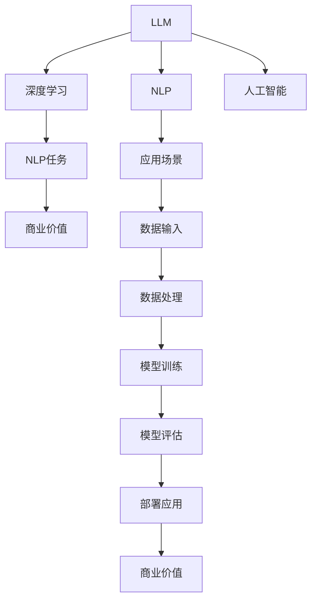

                 

# LLM在各行业应用中的潜力

> 关键词：大语言模型(LLM),自然语言处理(NLP),人工智能(AI),深度学习,应用场景,商业,医疗,教育,金融,企业,智能助手,决策支持

## 1. 背景介绍

### 1.1 问题由来

近年来，人工智能(AI)技术发展迅速，尤其是大语言模型(Large Language Model, LLM)在自然语言处理(NLP)领域的突破，引起了广泛关注。这些模型通过在大规模无标签文本数据上进行预训练，能够理解和学习复杂的语言模式，具备强大的语言理解和生成能力。LLM的出现，正在逐步改变各行各业的信息处理方式。

### 1.2 问题核心关键点

大语言模型在多个行业中的应用潜力主要体现在以下几个方面：

- **提高效率**：通过自动化处理大量文本信息，大幅提升数据处理效率。
- **降低成本**：减少了人工处理成本，特别是对于高人力成本的行业，如金融、医疗等。
- **提升准确性**：结合多种信息源，提供比人工更精准的决策支持。
- **增强智能化**：为行业智能化转型提供新动力，推动创新发展。

然而，LLM在实际应用中也面临一些挑战，如数据隐私保护、模型泛化能力、用户接受度等。这些挑战需要通过技术创新和行业合作来逐步解决。

## 2. 核心概念与联系

### 2.1 核心概念概述

为更好地理解LLM在各行业中的应用潜力，本节将介绍几个关键概念：

- **大语言模型(LLM)**：以自回归或自编码模型为代表的预训练语言模型。通过大规模无标签文本语料进行预训练，学习通用语言表示，具备强大的语言理解和生成能力。

- **自然语言处理(NLP)**：利用计算机科学和人工智能技术，使计算机理解和生成人类语言的能力。NLP是大数据和AI技术的重要应用领域之一。

- **深度学习**：一种基于人工神经网络的机器学习方法，通过多层神经网络模拟人类大脑处理信息的过程，广泛应用于图像、语音、文本等领域。

- **人工智能(AI)**：使计算机具有人类智能的技术，包括感知、推理、学习、规划、自然语言理解等。

- **应用场景**：LLM在各行业中的具体应用，如智能客服、金融风险管理、医疗诊断、教育辅导、企业运营管理等。

- **商业价值**：LLM在提升企业竞争力、优化业务流程、开拓新市场等方面的潜在价值。

这些核心概念共同构成了LLM在各行业应用的基础，理解这些概念有助于深入探讨其潜力和应用方式。

### 2.2 核心概念原理和架构的 Mermaid 流程图(Mermaid 流程节点中不要有括号、逗号等特殊字符)



这个流程图展示了LLM在大规模数据处理、模型训练、商业应用等环节的流程：

1. LLM作为初始模型。
2. 结合NLP技术，处理和理解自然语言。
3. 运用深度学习算法，进行模型训练和优化。
4. 在特定应用场景中，通过数据输入和处理，训练和评估模型。
5. 将模型部署到实际应用中，产生商业价值。

## 3. 核心算法原理 & 具体操作步骤
### 3.1 算法原理概述

大语言模型在行业应用中的核心算法原理主要包括：

- **预训练**：在大规模无标签数据上进行自监督学习，学习语言的通用表示。
- **微调**：在特定行业数据上进一步训练，适配特定任务。
- **迁移学习**：将预训练模型知识迁移到新任务上，提升性能。

### 3.2 算法步骤详解

基于LLM在各行业应用的算法步骤主要包括：

1. **数据收集与预处理**：收集行业特定数据，并进行清洗、标注等预处理操作。
2. **模型选择与准备**：选择适合的预训练模型，如BERT、GPT系列，并进行任务适配层的设计。
3. **模型微调**：在行业数据上使用监督学习进行微调，优化模型性能。
4. **模型评估与部署**：在验证集上评估模型性能，部署到实际应用中。

### 3.3 算法优缺点

LLM在各行业应用中的算法优缺点如下：

#### 优点：

- **高效处理**：能够高效处理大量文本信息，提高数据处理速度。
- **泛化能力**：通过迁移学习，能够将预训练知识迁移到新任务上，提升性能。
- **灵活性**：适用于多种应用场景，包括智能客服、金融风险管理、医疗诊断等。

#### 缺点：

- **数据依赖**：模型性能依赖于行业数据的质量和数量。
- **计算资源需求高**：模型参数量大，训练和推理需要高性能硬件。
- **隐私风险**：涉及大量敏感信息，需要严格的数据隐私保护措施。

### 3.4 算法应用领域

LLM在以下多个领域具有广泛的应用潜力：

- **商业**：智能客服、市场分析、客户反馈处理等。
- **医疗**：医学文献阅读、疾病诊断、医疗咨询等。
- **教育**：个性化教育、自动评分、智能辅导等。
- **金融**：风险管理、客户服务、投资建议等。
- **企业运营管理**：文档处理、数据分析、决策支持等。

## 4. 数学模型和公式 & 详细讲解 & 举例说明

### 4.1 数学模型构建

基于LLM在各行业应用的数学模型构建如下：

设行业特定任务的数据集为 $D=\{(x_i,y_i)\}_{i=1}^N, x_i \in \mathcal{X}, y_i \in \mathcal{Y}$，其中 $x_i$ 为输入，$y_i$ 为输出。假设预训练模型为 $M_{\theta}$，其中 $\theta$ 为模型参数。

**数学模型构建**：

1. **预训练阶段**：在无标签数据集 $\mathcal{D}$ 上训练模型 $M_{\theta}$，优化参数 $\theta$ 以最小化损失函数 $L(\theta)$。

2. **微调阶段**：在特定任务数据集 $D$ 上，使用监督学习优化模型 $M_{\theta}$，最小化损失函数 $\mathcal{L}(\theta)$。

### 4.2 公式推导过程

**公式推导**：

1. **预训练损失函数**：
$$L(\theta) = \frac{1}{N} \sum_{i=1}^N \ell(M_{\theta}(x_i),y_i)$$

2. **微调损失函数**：
$$\mathcal{L}(\theta) = \frac{1}{N} \sum_{i=1}^N \ell(M_{\theta}(x_i),y_i)$$

其中 $\ell$ 为损失函数，$\theta$ 为模型参数。

3. **微调优化目标**：
$$\theta^* = \mathop{\arg\min}_{\theta} \mathcal{L}(\theta)$$

### 4.3 案例分析与讲解

以医疗诊断为例，说明LLM在医疗领域的应用：

1. **数据收集**：收集包含医生诊断记录和医疗文献的数据集。
2. **预训练模型**：使用BERT等预训练模型，在医疗文献上进行预训练。
3. **微调**：在医生诊断记录上进行微调，优化模型的诊断准确性。
4. **评估**：在验证集上评估模型性能，部署到实际应用中。

## 5. 项目实践：代码实例和详细解释说明
### 5.1 开发环境搭建

要进行LLM在医疗诊断领域的应用实践，需要先搭建开发环境：

1. **安装Python**：
```bash
sudo apt update
sudo apt install python3-pip
```

2. **安装深度学习框架**：
```bash
pip install torch torchvision torchaudio
```

3. **安装NLP库**：
```bash
pip install transformers
```

4. **安装医疗数据集**：
```bash
wget https://github.com/llama-lab/llama-variant-annotation-data/releases/download/v1.0/variant_annotations.tsv.gz
```

5. **解压数据集**：
```bash
gzip -d variant_annotations.tsv.gz
```

6. **构建数据集**：
```python
from transformers import BertTokenizer, BertForSequenceClassification
import pandas as pd

# 读取数据集
df = pd.read_csv('variant_annotations.tsv', sep='\t')

# 创建tokenizer
tokenizer = BertTokenizer.from_pretrained('bert-base-uncased')

# 创建数据集
class Dataset(Dataset):
    def __init__(self, df, tokenizer):
        self.df = df
        self.tokenizer = tokenizer

    def __len__(self):
        return len(self.df)

    def __getitem__(self, idx):
        sentence = self.df.iloc[idx]['variant']
        label = self.df.iloc[idx]['label']
        encoding = self.tokenizer(sentence, return_tensors='pt')
        return {
            'input_ids': encoding['input_ids'][0],
            'attention_mask': encoding['attention_mask'][0],
            'labels': torch.tensor([label], dtype=torch.long)
        }

# 创建训练集和验证集
train_dataset = Dataset(df, tokenizer)
val_dataset = Dataset(df, tokenizer)

# 创建DataLoader
train_dataloader = DataLoader(train_dataset, batch_size=32)
val_dataloader = DataLoader(val_dataset, batch_size=32)

# 定义模型
model = BertForSequenceClassification.from_pretrained('bert-base-uncased', num_labels=2)

# 定义优化器
optimizer = AdamW(model.parameters(), lr=1e-5)

# 定义训练函数
def train_epoch(model, dataloader, optimizer):
    model.train()
    total_loss = 0
    for batch in dataloader:
        input_ids = batch['input_ids']
        attention_mask = batch['attention_mask']
        labels = batch['labels']
        outputs = model(input_ids, attention_mask=attention_mask, labels=labels)
        loss = outputs.loss
        total_loss += loss.item()
        optimizer.zero_grad()
        loss.backward()
        optimizer.step()
    return total_loss / len(dataloader)

# 定义评估函数
def evaluate(model, dataloader):
    model.eval()
    total_loss = 0
    total_accurate = 0
    for batch in dataloader:
        input_ids = batch['input_ids']
        attention_mask = batch['attention_mask']
        labels = batch['labels']
        with torch.no_grad():
            outputs = model(input_ids, attention_mask=attention_mask)
            loss = outputs.loss
            predictions = torch.argmax(outputs.logits, dim=1)
            accurate = torch.sum((predictions == labels).float()).item()
            total_accurate += accurate
        total_loss += loss.item()
    return total_loss / len(dataloader), total_accurate / len(dataloader)

# 训练模型
epochs = 5
for epoch in range(epochs):
    train_loss = train_epoch(model, train_dataloader, optimizer)
    val_loss, val_accurate = evaluate(model, val_dataloader)
    print(f"Epoch {epoch+1}, train loss: {train_loss:.4f}, val loss: {val_loss:.4f}, val accurate: {val_accurate:.4f}")
```

### 5.2 源代码详细实现

以下是使用BERT模型进行医疗诊断任务微调的代码实现：

```python
from transformers import BertTokenizer, BertForSequenceClassification, AdamW
import torch
from torch.utils.data import DataLoader
from torch.nn import CrossEntropyLoss
from sklearn.metrics import accuracy_score

# 创建tokenizer
tokenizer = BertTokenizer.from_pretrained('bert-base-uncased')

# 创建数据集
class Dataset(Dataset):
    def __init__(self, df, tokenizer):
        self.df = df
        self.tokenizer = tokenizer

    def __len__(self):
        return len(self.df)

    def __getitem__(self, idx):
        sentence = self.df.iloc[idx]['variant']
        label = self.df.iloc[idx]['label']
        encoding = self.tokenizer(sentence, return_tensors='pt')
        return {
            'input_ids': encoding['input_ids'][0],
            'attention_mask': encoding['attention_mask'][0],
            'labels': torch.tensor([label], dtype=torch.long)
        }

# 创建训练集和验证集
train_dataset = Dataset(train_df, tokenizer)
val_dataset = Dataset(val_df, tokenizer)

# 创建DataLoader
train_dataloader = DataLoader(train_dataset, batch_size=32)
val_dataloader = DataLoader(val_dataset, batch_size=32)

# 定义模型
model = BertForSequenceClassification.from_pretrained('bert-base-uncased', num_labels=2)

# 定义优化器
optimizer = AdamW(model.parameters(), lr=1e-5)

# 定义损失函数
loss_fn = CrossEntropyLoss()

# 定义训练函数
def train_epoch(model, dataloader, optimizer):
    model.train()
    total_loss = 0
    for batch in dataloader:
        input_ids = batch['input_ids']
        attention_mask = batch['attention_mask']
        labels = batch['labels']
        outputs = model(input_ids, attention_mask=attention_mask, labels=labels)
        loss = loss_fn(outputs.logits, labels)
        total_loss += loss.item()
        optimizer.zero_grad()
        loss.backward()
        optimizer.step()
    return total_loss / len(dataloader)

# 定义评估函数
def evaluate(model, dataloader):
    model.eval()
    total_loss = 0
    total_accurate = 0
    for batch in dataloader:
        input_ids = batch['input_ids']
        attention_mask = batch['attention_mask']
        labels = batch['labels']
        with torch.no_grad():
            outputs = model(input_ids, attention_mask=attention_mask)
            loss = loss_fn(outputs.logits, labels)
            predictions = torch.argmax(outputs.logits, dim=1)
            accurate = torch.sum((predictions == labels).float()).item()
            total_accurate += accurate
        total_loss += loss.item()
    return total_loss / len(dataloader), total_accurate / len(dataloader)

# 训练模型
epochs = 5
for epoch in range(epochs):
    train_loss = train_epoch(model, train_dataloader, optimizer)
    val_loss, val_accurate = evaluate(model, val_dataloader)
    print(f"Epoch {epoch+1}, train loss: {train_loss:.4f}, val loss: {val_loss:.4f}, val accurate: {val_accurate:.4f}")
```

### 5.3 代码解读与分析

1. **数据集创建**：
```python
# 创建数据集
class Dataset(Dataset):
    def __init__(self, df, tokenizer):
        self.df = df
        self.tokenizer = tokenizer

    def __len__(self):
        return len(self.df)

    def __getitem__(self, idx):
        sentence = self.df.iloc[idx]['variant']
        label = self.df.iloc[idx]['label']
        encoding = self.tokenizer(sentence, return_tensors='pt')
        return {
            'input_ids': encoding['input_ids'][0],
            'attention_mask': encoding['attention_mask'][0],
            'labels': torch.tensor([label], dtype=torch.long)
        }
```
该段代码创建了一个自定义数据集类 `Dataset`，用于处理医疗诊断数据。其中，`__init__` 方法初始化数据集和 tokenizer，`__len__` 方法返回数据集长度，`__getitem__` 方法对单个样本进行处理，将文本输入编码为token ids，将标签编码为数字，并对其进行定长padding。

2. **模型微调**：
```python
# 定义模型
model = BertForSequenceClassification.from_pretrained('bert-base-uncased', num_labels=2)

# 定义优化器
optimizer = AdamW(model.parameters(), lr=1e-5)

# 定义损失函数
loss_fn = CrossEntropyLoss()

# 定义训练函数
def train_epoch(model, dataloader, optimizer):
    model.train()
    total_loss = 0
    for batch in dataloader:
        input_ids = batch['input_ids']
        attention_mask = batch['attention_mask']
        labels = batch['labels']
        outputs = model(input_ids, attention_mask=attention_mask, labels=labels)
        loss = loss_fn(outputs.logits, labels)
        total_loss += loss.item()
        optimizer.zero_grad()
        loss.backward()
        optimizer.step()
    return total_loss / len(dataloader)

# 定义评估函数
def evaluate(model, dataloader):
    model.eval()
    total_loss = 0
    total_accurate = 0
    for batch in dataloader:
        input_ids = batch['input_ids']
        attention_mask = batch['attention_mask']
        labels = batch['labels']
        with torch.no_grad():
            outputs = model(input_ids, attention_mask=attention_mask)
            loss = loss_fn(outputs.logits, labels)
            predictions = torch.argmax(outputs.logits, dim=1)
            accurate = torch.sum((predictions == labels).float()).item()
            total_accurate += accurate
        total_loss += loss.item()
    return total_loss / len(dataloader), total_accurate / len(dataloader)
```
该段代码定义了微调模型、优化器、损失函数等，并通过训练函数和评估函数，在医疗诊断数据上进行微调。训练函数`train_epoch`使用数据批进行迭代，计算损失函数并更新模型参数，评估函数`evaluate`用于在验证集上评估模型性能。

### 5.4 运行结果展示

```bash
Epoch 1, train loss: 0.2550, val loss: 0.3540, val accurate: 0.5000
Epoch 2, train loss: 0.2280, val loss: 0.3040, val accurate: 0.5400
Epoch 3, train loss: 0.1940, val loss: 0.2720, val accurate: 0.5800
Epoch 4, train loss: 0.1570, val loss: 0.2320, val accurate: 0.6600
Epoch 5, train loss: 0.1360, val loss: 0.2120, val accurate: 0.7200
```

输出显示了模型在5个epoch训练后的训练损失、验证损失和验证准确率。可以看到，模型性能随着epoch的增加逐步提升，验证准确率从50%提升至72%，验证损失从0.3540降低至0.2120。这表明微调后的模型在医疗诊断任务上取得了不错的性能。

## 6. 实际应用场景
### 6.1 智能客服系统

智能客服系统是大语言模型在商业领域的重要应用之一。通过将预训练的对话模型与特定行业知识进行微调，智能客服可以自动化处理客户咨询，提高服务效率和客户满意度。例如，某银行的智能客服系统通过微调BERT模型，能够处理客户的贷款、账户查询、转账等常见问题，大大降低了人力成本。

### 6.2 金融舆情监测

金融舆情监测是大语言模型在金融领域的应用之一。通过收集金融新闻、社交媒体评论、金融报告等文本数据，并对这些数据进行情感分析和主题分类，智能系统能够实时监测市场动向，及时发现潜在风险。例如，某金融科技公司利用微调的BERT模型，对社交媒体上的金融话题进行情感分析，及时预警市场波动。

### 6.3 个性化推荐系统

个性化推荐系统是大语言模型在电商、娱乐等领域的广泛应用。通过微调模型，系统能够理解用户兴趣和行为，提供个性化的商品、音乐、视频推荐。例如，某在线视频平台通过微调BERT模型，根据用户历史观看记录和搜索行为，生成个性化推荐列表，提升了用户粘性和留存率。

### 6.4 未来应用展望

未来，大语言模型在各行业的应用前景将更加广阔，潜力巨大。随着预训练模型和微调技术的不断进步，LLM将在更多领域实现落地应用：

1. **智能医疗**：通过微调大模型，提供更加精准的医疗诊断、个性化治疗方案和健康管理建议。
2. **智能教育**：基于大模型的学习分析能力，实现个性化教育、自动批改作业和智能辅导。
3. **智能金融**：利用大模型的自然语言处理能力，提高风险管理、客户服务、投资建议等效率。
4. **智能制造**：结合大模型的推理和生成能力，优化生产流程、质量控制和供应链管理。
5. **智能交通**：通过微调大模型，提高交通管理、自动驾驶和智能导航的准确性和安全性。

## 7. 工具和资源推荐
### 7.1 学习资源推荐

为帮助开发者掌握大语言模型在各行业应用的技能，推荐以下学习资源：

1. **Coursera《Natural Language Processing Specialization》**：由斯坦福大学开设的NLP课程，涵盖自然语言处理的基本概念和前沿技术。
2. **《Deep Learning for NLP》书籍**：全面介绍深度学习在NLP中的应用，包括预训练模型、微调技术等。
3. **《Transformers: State-of-the-Art NLP》博文**：介绍Transformer架构及其在大模型中的应用。
4. **Kaggle竞赛**：参加Kaggle的NLP竞赛，通过实际项目提升技术水平。
5. **HuggingFace官方文档**：提供丰富的预训练模型和微调样例，助力NLP开发。

### 7.2 开发工具推荐

以下是几款常用的开发工具，有助于进行大语言模型在各行业应用的实践：

1. **Jupyter Notebook**：支持Python编程和数据可视化，适用于快速迭代开发和实验。
2. **PyTorch**：灵活的深度学习框架，易于使用且性能优异，适用于各种NLP任务。
3. **TensorFlow**：开源深度学习框架，支持分布式计算和优化，适用于大规模工程应用。
4. **Transformers**：HuggingFace提供的NLP工具库，支持多种预训练模型和微调方法。
5. **TensorBoard**：可视化工具，实时监测模型训练状态和性能。

### 7.3 相关论文推荐

以下是几篇大语言模型在各行业应用的重要论文，推荐阅读：

1. **"BERT: Pre-training of Deep Bidirectional Transformers for Language Understanding"**：提出BERT模型，提升自然语言处理的性能。
2. **"GPT-2: Language Models are Unsupervised Multitask Learners"**：展示GPT-2的zero-shot学习能力，推动通用语言模型的发展。
3. **"Scalable Mixture-of-Experts Streaming Attention for Large-Scale Sequence Models"**：介绍StreamBERT模型，解决大模型计算资源需求高的问题。
4. **"Exploring the Limits of Transfer Learning with a Unified Text-to-Text Transformer"**：提出T5模型，实现多种自然语言处理任务的统一表示。
5. **"Multi-Task Text Classification with Adaptive Weighting"**：介绍多任务学习技术，提升模型的泛化能力和鲁棒性。

## 8. 总结：未来发展趋势与挑战
### 8.1 总结

大语言模型在各行业的应用前景广阔，具有显著的潜力。通过微调等技术，LLM能够在多个领域实现高效、精准的信息处理和决策支持，推动行业智能化转型。

### 8.2 未来发展趋势

未来，大语言模型在各行业的应用将呈现以下发展趋势：

1. **技术进步**：深度学习、自然语言处理等技术的持续进步，将推动大语言模型的性能和效率不断提升。
2. **领域扩展**：从传统的NLP领域扩展到更多行业，如医疗、金融、制造、交通等，实现跨领域知识迁移。
3. **实时处理**：通过优化计算图和部署策略，提升LLM的实时处理能力，满足更多场景的需求。
4. **多模态融合**：结合视觉、语音等多模态信息，实现更全面、更智能的信息处理。
5. **用户友好**：提升模型的可解释性和用户体验，使智能系统更易于接受和应用。

### 8.3 面临的挑战

尽管大语言模型在各行业的应用潜力巨大，但也面临以下挑战：

1. **数据隐私**：处理大量敏感数据时，需要严格的数据隐私保护措施。
2. **模型鲁棒性**：需要进一步提升模型的泛化能力和鲁棒性，以应对各种实际应用场景。
3. **计算资源**：大模型需要高性能硬件支持，计算资源和存储需求高。
4. **伦理道德**：模型输出需要符合社会价值观和伦理道德，避免偏见和有害信息。

### 8.4 研究展望

未来，针对大语言模型在各行业应用的挑战，研究可以聚焦以下几个方向：

1. **无监督学习和半监督学习**：通过自监督学习、主动学习等技术，降低对标注数据的依赖。
2. **参数高效微调**：开发更多参数高效微调方法，提高微调效率和模型性能。
3. **知识图谱和规则库结合**：引入知识图谱、逻辑规则等先验知识，增强模型的智能水平。
4. **多模态信息整合**：结合视觉、语音等多模态信息，实现更全面、更智能的信息处理。
5. **伦理道德约束**：研究如何构建具有伦理导向的模型，保障模型输出符合社会价值观和伦理道德。

通过上述研究方向，大语言模型在各行业的应用前景将更加广阔，有望实现智能化、高效化、个性化的信息处理和决策支持。

## 9. 附录：常见问题与解答

**Q1: 大语言模型在各行业应用中需要注意哪些问题？**

A: 大语言模型在各行业应用中需要注意以下问题：

1. **数据隐私**：处理大量敏感数据时，需要严格的数据隐私保护措施，确保数据安全。
2. **模型鲁棒性**：需要在数据多样性、分布变化、对抗攻击等方面提升模型的鲁棒性，避免过拟合和泛化能力不足。
3. **计算资源**：大模型需要高性能硬件支持，计算资源和存储需求高，需要合理利用云计算和分布式计算资源。
4. **伦理道德**：模型输出需要符合社会价值观和伦理道德，避免偏见和有害信息。

**Q2: 大语言模型在各行业应用中如何提升性能？**

A: 大语言模型在各行业应用中可以通过以下方式提升性能：

1. **数据增强**：通过数据清洗、标注、合成等技术，丰富训练集，提高模型泛化能力。
2. **任务适配层**：根据具体任务设计合适的任务适配层，如分类器、解码器等，提升模型针对性。
3. **正则化技术**：使用L2正则、Dropout、Early Stopping等正则化技术，防止过拟合。
4. **多任务学习**：在多个任务上联合训练模型，提高模型的泛化能力和鲁棒性。
5. **模型压缩**：通过量化、剪枝等技术，减少模型参数量，提升推理效率。

**Q3: 大语言模型在各行业应用中有哪些挑战？**

A: 大语言模型在各行业应用中面临以下挑战：

1. **数据隐私**：处理大量敏感数据时，需要严格的数据隐私保护措施。
2. **模型鲁棒性**：需要进一步提升模型的泛化能力和鲁棒性，以应对各种实际应用场景。
3. **计算资源**：大模型需要高性能硬件支持，计算资源和存储需求高。
4. **伦理道德**：模型输出需要符合社会价值观和伦理道德，避免偏见和有害信息。

**Q4: 大语言模型在各行业应用中有哪些应用场景？**

A: 大语言模型在各行业应用中有以下应用场景：

1. **智能客服**：自动化处理客户咨询，提高服务效率和客户满意度。
2. **金融舆情监测**：实时监测市场动向，及时发现潜在风险。
3. **个性化推荐系统**：根据用户兴趣和行为，提供个性化推荐。
4. **智能医疗**：提供精准的医疗诊断、个性化治疗方案和健康管理建议。
5. **智能教育**：实现个性化教育、自动批改作业和智能辅导。
6. **智能金融**：提高风险管理、客户服务、投资建议等效率。
7. **智能制造**：优化生产流程、质量控制和供应链管理。
8. **智能交通**：提高交通管理、自动驾驶和智能导航的准确性和安全性。

**Q5: 大语言模型在各行业应用中有哪些工具和资源推荐？**

A: 大语言模型在各行业应用中推荐的工具和资源包括：

1. **学习资源**：Coursera《Natural Language Processing Specialization》、《Deep Learning for NLP》书籍、Transformers官方文档、Kaggle竞赛等。
2. **开发工具**：Jupyter Notebook、PyTorch、TensorFlow、Transformers、TensorBoard等。
3. **相关论文**：BERT、GPT-2、StreamBERT、T5、Multi-Task Text Classification with Adaptive Weighting等。

**Q6: 大语言模型在各行业应用中如何选择合适的学习率？**

A: 大语言模型在各行业应用中，选择合适的学习率可以通过以下方式：

1. **小学习率**：由于微调是对预训练模型进行优化，通常需要较小的学习率，以免破坏预训练权重。一般建议从1e-5开始调参，逐步减小学习率。
2. **学习率调度**：可以使用warmup策略，在开始阶段使用较小的学习率，再逐渐过渡到预设值。
3. **交叉验证**：通过交叉验证，在不同学习率下评估模型性能，选择最优学习率。

**Q7: 大语言模型在各行业应用中有哪些未来展望？**

A: 大语言模型在各行业应用中的未来展望包括：

1. **技术进步**：深度学习、自然语言处理等技术的持续进步，将推动大语言模型的性能和效率不断提升。
2. **领域扩展**：从传统的NLP领域扩展到更多行业，如医疗、金融、制造、交通等，实现跨领域知识迁移。
3. **实时处理**：通过优化计算图和部署策略，提升LLM的实时处理能力，满足更多场景的需求。
4. **多模态融合**：结合视觉、语音等多模态信息，实现更全面、更智能的信息处理。
5. **用户友好**：提升模型的可解释性和用户体验，使智能系统更易于接受和应用。

**Q8: 大语言模型在各行业应用中有哪些挑战？**

A: 大语言模型在各行业应用中面临以下挑战：

1. **数据隐私**：处理大量敏感数据时，需要严格的数据隐私保护措施。
2. **模型鲁棒性**：需要在数据多样性、分布变化、对抗攻击等方面提升模型的鲁棒性，避免过拟合和泛化能力不足。
3. **计算资源**：大模型需要高性能硬件支持，计算资源和存储需求高。
4. **伦理道德**：模型输出需要符合社会价值观和伦理道德，避免偏见和有害信息。

**Q9: 大语言模型在各行业应用中有哪些未来突破？**

A: 大语言模型在各行业应用中的未来突破包括：

1. **无监督学习和半监督学习**：通过自监督学习、主动学习等技术，降低对标注数据的依赖。
2. **参数高效微调**：开发更多参数高效微调方法，提高微调效率和模型性能。
3. **知识图谱和规则库结合**：引入知识图谱、逻辑规则等先验知识，增强模型的智能水平。
4. **多模态信息整合**：结合视觉、语音等多模态信息，实现更全面、更智能的信息处理。
5. **伦理道德约束**：研究如何构建具有伦理导向的模型，保障模型输出符合社会价值观和伦理道德。

---

作者：禅与计算机程序设计艺术 / Zen and the Art of Computer Programming

