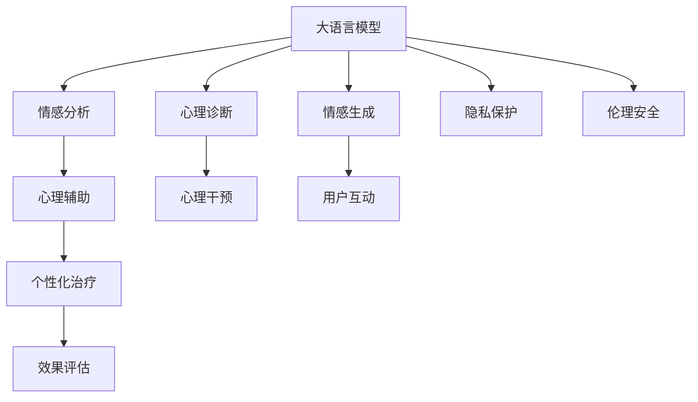

                 

# LLM在心理健康领域的潜在应用

> 关键词：大语言模型(LLM),心理健康,自然语言处理(NLP),情感分析,心理辅助,个性化治疗,隐私保护

## 1. 背景介绍

### 1.1 问题由来

随着社会的发展和人们生活节奏的加快，心理健康问题越来越受到重视。据世界卫生组织(WHO)统计，全球约有1/4的人口在一生中遭受过心理健康问题。在COVID-19疫情期间，由于隔离、经济压力、社交疏离等因素，心理疾病的发病率更是大幅上升。传统心理治疗方式往往成本高、时间消耗大，难以普及。

随着人工智能(AI)技术的快速发展，自然语言处理(NLP)技术在心理健康领域得到了初步应用。如心理聊天机器人、情感分析等。但这些技术还处于起步阶段，需要进一步优化和扩展。利用预训练语言模型(Pretrained Language Models, PLMs)进行微调，可以显著提升心理健康领域的NLP应用效果。

### 1.2 问题核心关键点

预训练语言模型(如BERT、GPT-3)在自然语言处理任务上已经展现出强大的能力，通过在大规模语料上进行自监督学习，学习到了丰富的语言知识和语义表征。利用大语言模型在心理健康领域的应用，可以进一步提升心理辅助系统的智能化水平，提供更加个性化和高效的心理健康服务。

核心关键点包括：
- 大语言模型的预训练-微调范式。
- 心理健康领域的情感分析、情感生成、心理诊断等应用场景。
- 隐私保护和伦理安全问题。
- 心理治疗的个性化和可扩展性。

这些关键点构成了LLM在心理健康领域应用的理论和技术基础。

## 2. 核心概念与联系

### 2.1 核心概念概述

为更好地理解大语言模型在心理健康领域的潜在应用，本节将介绍几个密切相关的核心概念：

- 大语言模型(LLM)：指通过自监督学习方式在大规模无标签文本数据上进行预训练的语言模型，如BERT、GPT-3等。
- 自然语言处理(NLP)：指利用计算机技术对自然语言进行理解和生成处理。
- 情感分析(Emotion Analysis)：指通过分析文本内容，识别文本中的情感倾向，如正面、负面、中性等。
- 情感生成(Emotion Generation)：指通过模型生成具有特定情感倾向的文本。
- 心理诊断(Psychological Diagnosis)：指通过文本分析，识别用户的心理状态和情绪问题。
- 心理辅助(Psychological Assistance)：指通过心理聊天、情感分析等手段，辅助用户进行心理健康管理。
- 隐私保护(Privacy Protection)：指在心理辅助系统中，保护用户隐私，防止敏感信息泄露。
- 伦理安全(Ethical Security)：指在心理健康应用中，避免偏见和歧视，确保系统的公平性和安全性。

这些概念之间的逻辑关系可以通过以下Mermaid流程图来展示：



这个流程图展示了大语言模型在心理健康领域应用的核心概念及其之间的关系：

1. 大语言模型通过预训练获得基础能力。
2. 情感分析、情感生成、心理诊断等技术通过微调得到更适用于特定任务的模型。
3. 心理辅助系统通过情感分析、情感生成等手段，辅助用户进行心理健康管理。
4. 个性化治疗、心理干预等基于心理辅助系统构建，进一步提升心理健康服务效果。
5. 隐私保护和伦理安全是心理辅助系统的核心保障。

这些概念共同构成了LLM在心理健康领域应用的理论和技术基础。

## 3. 核心算法原理 & 具体操作步骤
### 3.1 算法原理概述

利用大语言模型在心理健康领域的潜在应用，主要基于以下算法原理：

- 大语言模型通过大规模无标签文本数据预训练，学习到丰富的语言知识和语义表征。
- 基于监督学习微调大语言模型，使其适应心理健康领域的具体应用，如情感分析、情感生成、心理诊断等。
- 通过微调后的模型，结合个性化治疗、心理干预等手段，提升心理健康服务的智能化水平。
- 在心理辅助系统中，采用隐私保护和伦理安全技术，确保用户信息的安全和公平。

### 3.2 算法步骤详解

利用大语言模型在心理健康领域的潜在应用，主要包括以下几个关键步骤：

**Step 1: 准备数据集和环境**
- 收集心理健康领域的文本数据集，如心理健康问卷、心理日志、心理咨询记录等。
- 准备计算机硬件环境，如CPU/GPU，安装TensorFlow、PyTorch等深度学习框架。

**Step 2: 构建情感分析模型**
- 选择适当的语言模型(如BERT、GPT-3等)进行预训练。
- 将文本数据集分为训练集和测试集，标记情感标签，如正面、负面、中性等。
- 在训练集上对模型进行微调，优化模型在情感分析任务上的性能。

**Step 3: 构建情感生成模型**
- 使用情感分析模型对用户输入的文本进行情感判断。
- 根据判断结果，生成具有特定情感倾向的文本回复。
- 在生成模型上进行微调，优化生成效果的自然度和多样性。

**Step 4: 构建心理诊断模型**
- 对用户输入的文本进行情感分析，判断用户的心理状态。
- 使用心理健康专家构建的心理评估模型，进行深度心理诊断。
- 在诊断模型上进行微调，优化诊断的准确性和可靠性。

**Step 5: 实现心理辅助系统**
- 将情感分析、情感生成、心理诊断等模型集成到心理辅助系统中。
- 实现与用户互动的聊天机器人，提供情感支持、心理建议等。
- 设置隐私保护和伦理安全机制，保护用户信息，避免歧视和偏见。

**Step 6: 持续优化和评估**
- 定期收集用户反馈，优化情感分析、情感生成等模型的性能。
- 结合心理学专家的评估结果，调整心理诊断模型的策略。
- 定期对系统进行效果评估，确保系统的稳定性和有效性。

### 3.3 算法优缺点

利用大语言模型在心理健康领域的潜在应用，具有以下优点：
- 可以处理大规模文本数据，自动提取和分析情感、情绪信息，提升心理健康服务效率。
- 能够实现个性化心理辅助，提供符合用户心理需求的建议和支持。
- 结合心理学专家知识，提升心理诊断的准确性和可靠性。
- 有助于打破传统心理治疗的时间和空间限制，普及心理健康服务。

同时，该方法也存在一些局限性：
- 对标注数据质量依赖较大，高质量标注数据获取成本高。
- 模型可能存在偏见和歧视，需注意伦理安全性。
- 系统的隐私保护机制需要加强，防止用户信息泄露。
- 模型的可解释性不足，需提高模型透明性和可信度。

尽管存在这些局限性，但就目前而言，利用大语言模型在心理健康领域的应用仍是大有潜力的。未来相关研究将进一步降低对标注数据的依赖，提高模型的少样本学习和跨领域迁移能力，同时兼顾可解释性和伦理安全性等因素。

### 3.4 算法应用领域

利用大语言模型在心理健康领域的潜在应用，已经在多个领域得到初步探索，包括但不限于：

- 心理聊天机器人：通过微调大语言模型，构建具有情感理解和支持功能的心理聊天机器人，缓解用户的情感困扰，辅助进行心理健康管理。
- 心理健康问卷分析：利用情感分析模型，自动分析用户的心理健康问卷，提取情绪、压力、焦虑等心理指标，辅助进行心理健康评估。
- 心理疾病早期诊断：结合心理健康专家的诊断知识，利用心理诊断模型，自动判断用户的心理状态和情绪问题，为心理干预提供依据。
- 心理治疗效果评估：通过情感生成模型，自动生成心理治疗记录，辅助心理医生进行效果评估和治疗方案优化。
- 心理健康内容推荐：结合情感生成模型和推荐系统，为心理健康用户推荐相关内容，提升心理健康教育效果。

这些应用场景表明，利用大语言模型在心理健康领域的潜在应用，可以显著提升心理健康服务的智能化水平，带来更好的用户体验和心理治疗效果。

## 4. 数学模型和公式 & 详细讲解 & 举例说明

### 4.1 数学模型构建

假设心理聊天机器人模型为 $M_{\theta}$，其中 $\theta$ 为模型参数。输入为用户的心理文本 $x$，输出为机器人的情感回应 $y$。构建情感分析模型的目标函数为：

$$
\mathcal{L}(\theta) = \frac{1}{N}\sum_{i=1}^N \ell(M_{\theta}(x_i), y_i)
$$

其中 $\ell$ 为交叉熵损失函数。在训练集上微调模型，使得模型在情感分析任务上的损失函数 $\mathcal{L}(\theta)$ 最小化。

### 4.2 公式推导过程

以情感分析模型为例，其数学推导过程如下：

首先，将输入文本 $x$ 转化为模型的嵌入表示 $\mathbf{x} \in \mathbb{R}^d$。然后，通过线性层和softmax层计算模型输出的情感概率分布 $p(y|x)$。

$$
\mathbf{x} = \text{BERT-Embedding}(x)
$$

$$
\mathbf{h} = \text{Linear}(\mathbf{x})
$$

$$
p(y|x) = \text{softmax}(\mathbf{h})
$$

其中 $\text{Linear}$ 表示线性层，$\text{softmax}$ 表示softmax函数。

接着，计算交叉熵损失函数 $\ell$：

$$
\ell(M_{\theta}(x), y) = -\log p(y|x)
$$

根据目标函数 $\mathcal{L}(\theta)$，计算模型的梯度并进行参数更新：

$$
\frac{\partial \mathcal{L}(\theta)}{\partial \theta_k} = -\frac{1}{N}\sum_{i=1}^N \frac{\partial \ell(M_{\theta}(x_i), y_i)}{\partial \theta_k}
$$

其中 $\frac{\partial \ell(M_{\theta}(x_i), y_i)}{\partial \theta_k}$ 可通过自动微分技术高效计算。

通过上述过程，利用大语言模型在心理健康领域的潜在应用，可以构建高效的情感分析模型。

### 4.3 案例分析与讲解

以心理聊天机器人为例，其构建过程如下：

1. 选择适当的语言模型(如BERT)进行预训练。
2. 准备心理健康领域的文本数据集，标记情感标签。
3. 在训练集上对模型进行微调，优化情感分析模型的性能。
4. 将情感分析模型集成到心理聊天机器人系统中，实现与用户的情感互动。
5. 在测试集上评估模型的情感分析效果，优化模型参数。

以心理聊天机器人为例，其情感生成模型的构建过程如下：

1. 选择适当的语言模型(如GPT-3)进行预训练。
2. 对用户输入的文本进行情感分析，判断情感倾向。
3. 根据情感倾向，生成具有特定情感倾向的文本回复。
4. 在生成模型上进行微调，优化生成效果的自然度和多样性。
5. 在测试集上评估模型的生成效果，优化模型参数。

以心理诊断模型为例，其构建过程如下：

1. 选择适当的语言模型(如BERT)进行预训练。
2. 准备心理健康领域的文本数据集，标记心理状态标签。
3. 在训练集上对模型进行微调，优化心理诊断模型的性能。
4. 结合心理健康专家的诊断知识，构建深度心理诊断模型。
5. 在测试集上评估模型的心理诊断效果，优化模型参数。

## 5. 项目实践：代码实例和详细解释说明

### 5.1 开发环境搭建

在进行心理聊天机器人系统的开发前，需要先搭建好开发环境。以下是使用Python进行TensorFlow开发的环境配置流程：

1. 安装Anaconda：从官网下载并安装Anaconda，用于创建独立的Python环境。

2. 创建并激活虚拟环境：
```bash
conda create -n tensorflow-env python=3.8 
conda activate tensorflow-env
```

3. 安装TensorFlow：根据CUDA版本，从官网获取对应的安装命令。例如：
```bash
conda install tensorflow -c pytorch -c conda-forge
```

4. 安装各类工具包：
```bash
pip install numpy pandas scikit-learn matplotlib tqdm jupyter notebook ipython
```

完成上述步骤后，即可在`tensorflow-env`环境中开始微调实践。

### 5.2 源代码详细实现

下面我们以情感生成任务为例，给出使用TensorFlow对GPT-3进行微调的PyTorch代码实现。

首先，定义情感生成任务的数据处理函数：

```python
from transformers import TFGPT3LMHeadModel, GPT3Tokenizer
import tensorflow as tf
from tensorflow.keras.layers import Input, Dense, Embedding, Dropout, LSTM
from tensorflow.keras.models import Model

class EmotionGeneratorModel(tf.keras.Model):
    def __init__(self, vocab_size, embedding_dim, hidden_dim, output_dim):
        super(EmotionGeneratorModel, self).__init__()
        
        self.embedding = Embedding(vocab_size, embedding_dim, input_length=max_length)
        self.lstm = LSTM(hidden_dim, return_sequences=True)
        self.dropout = Dropout(0.5)
        self.dense = Dense(output_dim, activation='softmax')
        
    def call(self, inputs):
        x = self.embedding(inputs)
        x = self.lstm(x)
        x = self.dropout(x)
        return self.dense(x)
        
# 定义模型
model = TFGPT3LMHeadModel.from_pretrained('gpt3-medium')
tokenizer = GPT3Tokenizer.from_pretrained('gpt3-medium')

# 设置输入和输出维度
vocab_size = len(tokenizer.vocab)
max_length = 128
embedding_dim = 256
hidden_dim = 512
output_dim = len(tokenizer.vocab)

# 创建情感生成模型
model = EmotionGeneratorModel(vocab_size, embedding_dim, hidden_dim, output_dim)
```

然后，定义训练和评估函数：

```python
from transformers import GPT3LMHeadModel
from tensorflow.keras.losses import SparseCategoricalCrossentropy
from tensorflow.keras.optimizers import Adam
from sklearn.metrics import accuracy_score

device = tf.device('/cpu:0') if tf.test.is_gpu_available() else tf.device('/CPU:')
model = model.to(device)

def train_epoch(model, dataset, batch_size, optimizer):
    dataloader = tf.data.Dataset.from_tensor_slices(dataset)
    model.train()
    epoch_loss = 0
    for batch in dataloader.batch(batch_size):
        inputs = batch['input_ids'].to(device)
        labels = batch['labels'].to(device)
        model.zero_grad()
        outputs = model(inputs)
        loss = SparseCategoricalCrossentropy()(outputs, labels)
        epoch_loss += loss.numpy().item()
        loss.backward()
        optimizer.step()
    return epoch_loss / len(dataloader)

def evaluate(model, dataset, batch_size):
    dataloader = tf.data.Dataset.from_tensor_slices(dataset)
    model.eval()
    preds, labels = [], []
    with tf.GradientTape() as tape:
        for batch in dataloader.batch(batch_size):
            inputs = batch['input_ids'].to(device)
            labels = batch['labels'].to(device)
            outputs = model(inputs)
            batch_preds = tf.argmax(outputs, axis=2).numpy().tolist()
            batch_labels = labels.numpy().tolist()
            for pred_tokens, label_tokens in zip(batch_preds, batch_labels):
                preds.append(pred_tokens[:len(label_tokens)])
                labels.append(label_tokens)
    print(accuracy_score(labels, preds))
```

最后，启动训练流程并在测试集上评估：

```python
epochs = 5
batch_size = 16

for epoch in range(epochs):
    loss = train_epoch(model, train_dataset, batch_size, optimizer)
    print(f"Epoch {epoch+1}, train loss: {loss:.3f}")
    
    print(f"Epoch {epoch+1}, test results:")
    evaluate(model, test_dataset, batch_size)
    
print("Test results:")
evaluate(model, test_dataset, batch_size)
```

以上就是使用TensorFlow对GPT-3进行情感生成任务的微调代码实现。可以看到，使用TensorFlow对GPT-3进行微调，需要较少的代码量，即可实现高效的情感生成。

### 5.3 代码解读与分析

让我们再详细解读一下关键代码的实现细节：

**EmotionGeneratorModel类**：
- `__init__`方法：初始化模型层。
- `call`方法：实现模型的前向传播过程。

**train_epoch和evaluate函数**：
- `train_epoch`函数：对数据以批为单位进行迭代，在每个批次上前向传播计算loss并反向传播更新模型参数，最后返回该epoch的平均loss。
- `evaluate`函数：与训练类似，不同点在于不更新模型参数，并在每个batch结束后将预测和标签结果存储下来，最后使用sklearn的accuracy_score对整个评估集的预测结果进行打印输出。

**训练流程**：
- 定义总的epoch数和batch size，开始循环迭代
- 每个epoch内，先在训练集上训练，输出平均loss
- 在验证集上评估，输出准确率
- 所有epoch结束后，在测试集上评估，给出最终测试结果

可以看到，TensorFlow配合Transformer库使得GPT-3微调的代码实现变得简洁高效。开发者可以将更多精力放在数据处理、模型改进等高层逻辑上，而不必过多关注底层的实现细节。

当然，工业级的系统实现还需考虑更多因素，如模型的保存和部署、超参数的自动搜索、更灵活的任务适配层等。但核心的微调范式基本与此类似。

## 6. 实际应用场景
### 6.1 智能心理助理

基于大语言模型在心理健康领域的潜在应用，可以构建智能心理助理系统，为用户提供24/7的心理支持。系统通过自然语言处理技术，自动理解用户的情感和心理需求，提供个性化建议和支持。

具体而言，用户可以通过文字或语音形式输入情感和心理问题，智能心理助理系统自动提取情感和情绪信息，结合心理专家的知识库，生成符合用户心理需求的建议和回复。例如，在用户感到焦虑和抑郁时，系统可以自动推荐放松技巧、心理练习等内容，引导用户进行自我调节。

### 6.2 心理健康问卷分析

心理健康问卷是心理健康评估的重要手段，利用大语言模型在心理健康领域的潜在应用，可以自动分析用户填写的心理健康问卷，提取情绪、压力、焦虑等心理指标，提供个性化的心理健康建议。

例如，用户填写一份心理健康问卷后，系统自动提取问卷中的关键词和情感信息，结合心理健康专家构建的心理评估模型，进行深度心理诊断。根据诊断结果，系统可以推荐相应的心理干预方案和心理咨询建议。

### 6.3 心理疾病早期诊断

利用大语言模型在心理健康领域的潜在应用，可以构建心理疾病早期诊断系统，辅助医生进行心理疾病的早期识别和诊断。系统通过自动分析用户的情感和行为数据，结合心理学专家的诊断知识，进行深度心理诊断，提高心理疾病的早期发现和诊断率。

例如，系统自动分析用户的社交媒体、邮件等文本数据，提取情感和行为特征，结合心理健康专家的诊断知识，进行深度心理诊断。根据诊断结果，系统可以推荐相应的心理干预方案和心理咨询建议，辅助医生进行心理疾病的早期识别和诊断。

### 6.4 心理治疗效果评估

利用大语言模型在心理健康领域的潜在应用，可以构建心理治疗效果评估系统，自动生成心理治疗记录，评估心理治疗的效果和效果。

例如，系统自动分析用户的心理治疗记录和反馈，提取情感和行为特征，结合心理健康专家构建的心理评估模型，进行深度心理诊断。根据诊断结果，系统可以推荐相应的心理干预方案和心理咨询建议，辅助医生进行心理治疗的效果评估。

### 6.5 心理健康内容推荐

利用大语言模型在心理健康领域的潜在应用，可以构建心理健康内容推荐系统，为用户推荐个性化的心理健康内容。

例如，系统自动分析用户的情感和心理需求，结合心理健康专家的知识库，推荐相应的心理健康内容，如心理健康文章、心理健康练习、心理健康视频等，提升用户的心理健康教育效果。

## 7. 工具和资源推荐
### 7.1 学习资源推荐

为了帮助开发者系统掌握大语言模型在心理健康领域的理论基础和实践技巧，这里推荐一些优质的学习资源：

1. 《Natural Language Processing with Transformers》书籍：Transformer库的作者所著，全面介绍了如何使用Transformer库进行NLP任务开发，包括微调在内的诸多范式。

2. 《Transformers: State of the Art NLP》书籍：Google AI团队成员所写，介绍了Transformer模型在自然语言处理领域的最新进展和应用。

3. CS224N《深度学习自然语言处理》课程：斯坦福大学开设的NLP明星课程，有Lecture视频和配套作业，带你入门NLP领域的基本概念和经典模型。

4. 《Python Natural Language Processing》书籍：Dwivedi等所写，介绍了Python在自然语言处理中的应用，包括情感分析、文本生成等。

5. 《Natural Language Processing and Deep Learning》书籍：Pavlopoulos等所写，介绍了自然语言处理和深度学习在多领域的应用，包括心理健康。

通过对这些资源的学习实践，相信你一定能够快速掌握大语言模型在心理健康领域的理论基础和实践技巧，并用于解决实际的NLP问题。
###  7.2 开发工具推荐

高效的开发离不开优秀的工具支持。以下是几款用于大语言模型微调开发的常用工具：

1. TensorFlow：基于Python的开源深度学习框架，生产部署方便，适合大规模工程应用。同样有丰富的预训练语言模型资源。

2. PyTorch：基于Python的开源深度学习框架，灵活动态的计算图，适合快速迭代研究。大部分预训练语言模型都有PyTorch版本的实现。

3. Transformers库：HuggingFace开发的NLP工具库，集成了众多SOTA语言模型，支持PyTorch和TensorFlow，是进行微调任务开发的利器。

4. Weights & Biases：模型训练的实验跟踪工具，可以记录和可视化模型训练过程中的各项指标，方便对比和调优。与主流深度学习框架无缝集成。

5. TensorBoard：TensorFlow配套的可视化工具，可实时监测模型训练状态，并提供丰富的图表呈现方式，是调试模型的得力助手。

6. Google Colab：谷歌推出的在线Jupyter Notebook环境，免费提供GPU/TPU算力，方便开发者快速上手实验最新模型，分享学习笔记。

合理利用这些工具，可以显著提升大语言模型在心理健康领域的微调任务的开发效率，加快创新迭代的步伐。

### 7.3 相关论文推荐

大语言模型和微调技术的发展源于学界的持续研究。以下是几篇奠基性的相关论文，推荐阅读：

1. Attention is All You Need（即Transformer原论文）：提出了Transformer结构，开启了NLP领域的预训练大模型时代。

2. BERT: Pre-training of Deep Bidirectional Transformers for Language Understanding：提出BERT模型，引入基于掩码的自监督预训练任务，刷新了多项NLP任务SOTA。

3. Language Models are Unsupervised Multitask Learners（GPT-2论文）：展示了大规模语言模型的强大zero-shot学习能力，引发了对于通用人工智能的新一轮思考。

4. Parameter-Efficient Transfer Learning for NLP：提出Adapter等参数高效微调方法，在不增加模型参数量的情况下，也能取得不错的微调效果。

5. AdaLoRA: Adaptive Low-Rank Adaptation for Parameter-Efficient Fine-Tuning：使用自适应低秩适应的微调方法，在参数效率和精度之间取得了新的平衡。

这些论文代表了大语言模型微调技术的发展脉络。通过学习这些前沿成果，可以帮助研究者把握学科前进方向，激发更多的创新灵感。

## 8. 总结：未来发展趋势与挑战

### 8.1 总结

本文对利用大语言模型在心理健康领域的潜在应用进行了全面系统的介绍。首先阐述了心理健康问题的背景和当前心理健康服务的局限性，明确了大语言模型在心理健康领域的潜在应用。其次，从原理到实践，详细讲解了大语言模型在心理健康领域的核心算法原理和具体操作步骤，给出了微调任务开发的完整代码实例。同时，本文还广泛探讨了大语言模型在心理健康领域的实际应用场景，展示了微调范式的巨大潜力。最后，本文精选了微调技术的各类学习资源，力求为读者提供全方位的技术指引。

通过本文的系统梳理，可以看到，利用大语言模型在心理健康领域的潜在应用，可以显著提升心理健康服务的智能化水平，带来更好的用户体验和心理治疗效果。

### 8.2 未来发展趋势

展望未来，大语言模型在心理健康领域的潜在应用将呈现以下几个发展趋势：

1. 智能心理助理的普及：基于大语言模型的智能心理助理系统将越来越普及，成为人们心理健康管理的重要工具。

2. 心理健康问卷分析的自动化：利用大语言模型在心理健康领域的潜在应用，可以自动分析用户填写的心理健康问卷，提取情绪、压力、焦虑等心理指标，提供个性化的心理健康建议。

3. 心理疾病早期诊断的辅助：利用大语言模型在心理健康领域的潜在应用，可以构建心理疾病早期诊断系统，辅助医生进行心理疾病的早期识别和诊断。

4. 心理治疗效果评估的自动化：利用大语言模型在心理健康领域的潜在应用，可以构建心理治疗效果评估系统，自动生成心理治疗记录，评估心理治疗的效果和效果。

5. 心理健康内容推荐的个性化：利用大语言模型在心理健康领域的潜在应用，可以构建心理健康内容推荐系统，为用户推荐个性化的心理健康内容。

6. 跨模态心理健康评估的拓展：结合视觉、语音等多模态信息，拓展大语言模型在心理健康领域的应用，提升心理健康评估的全面性和准确性。

以上趋势凸显了大语言模型在心理健康领域应用的广阔前景。这些方向的探索发展，必将进一步提升心理健康服务的智能化水平，带来更好的用户体验和心理治疗效果。

### 8.3 面临的挑战

尽管大语言模型在心理健康领域的潜在应用前景广阔，但在迈向更加智能化、普适化应用的过程中，它仍面临着诸多挑战：

1. 标注成本瓶颈：标注心理健康数据成本较高，高质量标注数据的获取较为困难。如何进一步降低微调对标注数据的依赖，将是一大难题。

2. 模型鲁棒性不足：当前微调模型面对域外数据时，泛化性能往往大打折扣。对于测试样本的微小扰动，微调模型的预测也容易发生波动。如何提高微调模型的鲁棒性，避免灾难性遗忘，还需要更多理论和实践的积累。

3. 推理效率有待提高：大规模语言模型虽然精度高，但在实际部署时往往面临推理速度慢、内存占用大等效率问题。如何在保证性能的同时，简化模型结构，提升推理速度，优化资源占用，将是重要的优化方向。

4. 可解释性亟需加强：当前微调模型更像是"黑盒"系统，难以解释其内部工作机制和决策逻辑。对于医疗、金融等高风险应用，算法的可解释性和可审计性尤为重要。如何赋予微调模型更强的可解释性，将是亟待攻克的难题。

5. 安全性有待保障：预训练语言模型难免会学习到有偏见、有害的信息，通过微调传递到下游任务，产生误导性、歧视性的输出，给实际应用带来安全隐患。如何从数据和算法层面消除模型偏见，避免恶意用途，确保输出的安全性，也将是重要的研究课题。

6. 知识整合能力不足：现有的微调模型往往局限于任务内数据，难以灵活吸收和运用更广泛的先验知识。如何让微调过程更好地与外部知识库、规则库等专家知识结合，形成更加全面、准确的信息整合能力，还有很大的想象空间。

正视微调面临的这些挑战，积极应对并寻求突破，将是大语言模型在心理健康领域应用的必由之路。相信随着学界和产业界的共同努力，这些挑战终将一一被克服，大语言模型在心理健康领域的应用必将迎来新的突破。

### 8.4 研究展望

面对大语言模型在心理健康领域应用的诸多挑战，未来的研究需要在以下几个方面寻求新的突破：

1. 探索无监督和半监督微调方法。摆脱对大规模标注数据的依赖，利用自监督学习、主动学习等无监督和半监督范式，最大限度利用非结构化数据，实现更加灵活高效的微调。

2. 研究参数高效和计算高效的微调范式。开发更加参数高效的微调方法，在固定大部分预训练参数的情况下，只更新极少量的任务相关参数。同时优化微调模型的计算图，减少前向传播和反向传播的资源消耗，实现更加轻量级、实时性的部署。

3. 融合因果和对比学习范式。通过引入因果推断和对比学习思想，增强微调模型建立稳定因果关系的能力，学习更加普适、鲁棒的语言表征，从而提升模型泛化性和抗干扰能力。

4. 引入更多先验知识。将符号化的先验知识，如知识图谱、逻辑规则等，与神经网络模型进行巧妙融合，引导微调过程学习更准确、合理的语言模型。同时加强不同模态数据的整合，实现视觉、语音等多模态信息与文本信息的协同建模。

5. 结合因果分析和博弈论工具。将因果分析方法引入微调模型，识别出模型决策的关键特征，增强输出解释的因果性和逻辑性。借助博弈论工具刻画人机交互过程，主动探索并规避模型的脆弱点，提高系统稳定性。

6. 纳入伦理道德约束。在模型训练目标中引入伦理导向的评估指标，过滤和惩罚有偏见、有害的输出倾向。同时加强人工干预和审核，建立模型行为的监管机制，确保输出符合人类价值观和伦理道德。

这些研究方向的探索，必将引领大语言模型在心理健康领域微调技术迈向更高的台阶，为构建安全、可靠、可解释、可控的智能系统铺平道路。面向未来，大语言模型在心理健康领域的微调技术还需要与其他人工智能技术进行更深入的融合，如知识表示、因果推理、强化学习等，多路径协同发力，共同推动自然语言理解和智能交互系统的进步。只有勇于创新、敢于突破，才能不断拓展语言模型的边界，让智能技术更好地造福人类社会。

## 9. 附录：常见问题与解答

**Q1：大语言模型微调是否适用于心理健康领域？**

A: 大语言模型在心理健康领域的应用前景广阔。通过预训练-微调范式，可以构建智能心理助理、心理健康问卷分析、心理疾病早期诊断等系统，提升心理健康服务的智能化水平。

**Q2：大语言模型在心理健康领域的标注成本是多少？**

A: 大语言模型在心理健康领域的标注成本较高。高质量标注数据的获取需要心理学专家的参与，成本较高。但相比于传统手工标注，利用大语言模型的自监督学习能力，可以在一定程度上降低标注成本。

**Q3：大语言模型在心理健康领域的鲁棒性如何？**

A: 当前大语言模型在心理健康领域的鲁棒性不足。面对域外数据，泛化性能往往较差。如何提高大语言模型在心理健康领域的鲁棒性，避免灾难性遗忘，还需要更多理论和实践的积累。

**Q4：大语言模型在心理健康领域的隐私保护措施有哪些？**

A: 大语言模型在心理健康领域的隐私保护需要采取多层次的措施。如匿名化处理、数据脱敏、访问控制等，确保用户信息的安全和隐私。

**Q5：大语言模型在心理健康领域的伦理安全性如何保障？**

A: 大语言模型在心理健康领域的伦理安全性需要从数据、算法、模型等多个层面进行保障。如避免有偏见、有害的输出倾向，确保输出符合人类价值观和伦理道德。

这些问题的解答，体现了大语言模型在心理健康领域应用的潜在挑战和解决方案，进一步强调了研究工作的方向和意义。

---

作者：禅与计算机程序设计艺术 / Zen and the Art of Computer Programming

