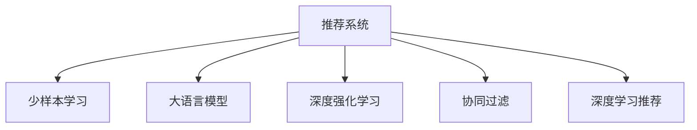

                 

# LLM在推荐系统中的少样本学习应用

> 关键词：大语言模型,推荐系统,少样本学习,深度学习,深度强化学习,协同过滤,模型微调,用户行为分析

## 1. 背景介绍

### 1.1 问题由来

在推荐系统中，如何根据用户的历史行为，预测其未曝光物品的兴趣并进行个性化推荐，一直是核心问题。目前的主流推荐方法包括基于协同过滤(CF)、基于内容的推荐、深度学习推荐等。

其中，协同过滤方法利用用户与物品之间的隐式交互，推断用户对物品的兴趣。而深度学习推荐则通过构建用户-物品间的复杂关系表示，进行推荐。

然而，随着数据量的增加，推荐模型变得更加复杂和昂贵。尤其是对于大型电商平台，需要处理的海量数据，使得深度学习推荐模型的训练成本高昂，实时推荐系统的延迟也难以满足需求。

为解决这些问题，研究者提出了一种基于少样本学习(即Few-Shot Learning)的方法，让模型在少数标注样本上就能进行有效预测，从而节省标注成本和训练时间。

少样本学习强调，在推荐系统中的数据非常稀缺，用户-物品交互次数有限，且多为高维稀疏数据。在实际推荐场景中，一般用户的历史行为数据只有几十条，甚至只有几条，这使得推荐系统难以进行准确的推荐。

同时，当前的深度学习推荐系统过于依赖全量数据，对于不常见类别的物品推荐能力较弱，容易出现冷启动问题。如何利用少样本学习，缓解数据稀疏和冷启动问题，成为亟待解决的研究课题。

## 2. 核心概念与联系

### 2.1 核心概念概述

为更好地理解LLM在推荐系统中的少样本学习应用，本节将介绍几个关键概念：

- 推荐系统：根据用户历史行为，预测用户对物品的兴趣并进行个性化推荐。常用的推荐方法包括协同过滤、基于内容的推荐、深度学习推荐等。

- 少样本学习(Few-Shot Learning)：指在只有少量标注样本的情况下，模型能够快速适应新任务的学习方法。在推荐系统中，通常通过在输入中提供少量示例来实现，无需更新模型参数。

- 大语言模型(Large Language Model, LLM)：以自回归(如GPT)或自编码(如BERT)模型为代表的大规模预训练语言模型。通过在大规模无标签文本语料上进行预训练，学习通用的语言表示，具备强大的语言理解和生成能力。

- 深度强化学习(Deep Reinforcement Learning, DRL)：通过将推荐任务设计为强化学习问题，模型通过与环境的交互，逐步优化推荐策略。DRL方法可以引入更复杂的策略，实现更高效的推荐。

- 协同过滤(Collaborative Filtering, CF)：通过用户和物品间的隐式交互，预测用户对未曝光物品的兴趣。CF方法简单易用，但容易受到数据稀疏和冷启动问题的限制。

- 深度学习推荐(Deep Learning Recommendation, DL)：通过构建用户-物品间的复杂关系表示，进行推荐。DL方法可以捕捉高维数据，处理复杂模式，但需要大量数据进行训练，且实时性较差。

这些核心概念之间的逻辑关系可以通过以下Mermaid流程图来展示：



这个流程图展示了大语言模型在推荐系统中的核心概念及其之间的关系：

1. 推荐系统通过多种方法，从用户-物品的互动数据中，推测用户对未曝光物品的兴趣。
2. 在大语言模型微调中，使用少量标注数据进行训练，使得模型能够在少数样本下进行高效的预测。
3. 深度强化学习方法，通过模拟用户和物品的交互过程，实现更加高效的推荐策略。
4. 协同过滤和深度学习推荐方法，利用用户行为数据和物品特征，进行推荐。

这些概念共同构成了推荐系统的知识体系，使得其能更好地适应多样化的推荐场景，为用户提供个性化的服务。

## 3. 核心算法原理 & 具体操作步骤
### 3.1 算法原理概述

在大语言模型(LLM)的推荐应用中，核心思想是利用少样本学习的能力，在少量的用户行为数据下，进行推荐预测。具体而言，该算法包括以下几个步骤：

1. **预训练大语言模型**：使用大规模无标签文本语料，对LLM进行预训练，使其具备丰富的语言知识和表示能力。

2. **微调模型参数**：通过微调，使得LLM能够适应特定的推荐任务，如预测用户对物品的评分、推荐物品等。

3. **利用少量标注数据**：收集目标用户对物品的少量历史行为数据，作为训练样本，使用少样本学习方法对微调后的LLM进行训练。

4. **推理推荐结果**：将用户输入的少量数据，输入微调后的LLM，通过生成的向量表示，进行物品推荐。

### 3.2 算法步骤详解

以下我们详细介绍LLM在推荐系统中的少样本学习算法的详细步骤：

**Step 1: 数据预处理**
- 收集目标用户的历史行为数据，如点击、浏览、购买等，将用户对物品的评分或行为表示为向量。
- 对于未曝光的物品，可以使用物品的属性信息，如类别、价格、品牌等，生成向量化表示。

**Step 2: 微调大语言模型**
- 使用预训练语言模型作为初始化参数，对LLM进行微调。可以使用全参数微调或参数高效微调(如 Adapter)，使模型能够适应推荐任务的特征。
- 微调的目标是使模型能够准确地预测用户对物品的评分或推荐顺序。

**Step 3: 少样本学习训练**
- 利用目标用户对少量物品的历史行为数据，作为训练样本。将用户行为数据和物品向量表示作为输入，训练微调后的LLM。
- 使用少样本学习方法，如基于实例的训练、元学习等，在少量样本下训练模型，使其能够进行高效预测。

**Step 4: 推理推荐结果**
- 对于新的用户输入，将其行为数据或物品向量表示输入微调后的LLM，生成推荐结果向量。
- 根据向量之间的距离或相似度，进行物品推荐。

### 3.3 算法优缺点

基于LLM的推荐系统少样本学习方法，具有以下优点：

1. 数据需求少。通过少样本学习，仅需少量标注数据即可进行有效预测，缓解数据稀疏和冷启动问题。
2. 效率高。利用大语言模型的强大表示能力，通过微调和少样本学习，可以快速进行推荐，节省计算资源。
3. 适应性强。大语言模型通过自监督预训练，具备很强的泛化能力，可以在不同的推荐场景中应用。
4. 模型效果好。结合微调和少样本学习，可以提升推荐系统的精度和覆盖率。

同时，该方法也存在以下缺点：

1. 标注数据质量要求高。少样本学习对标注数据质量要求较高，若数据存在噪声或错误，会影响模型性能。
2. 计算资源消耗大。尽管数据需求少，但微调和少样本学习仍需要较大计算资源，难以进行实时推荐。
3. 模型的可解释性不足。少样本学习算法的模型难以解释，难以理解其决策过程和逻辑。
4. 需要标注数据。虽然少样本学习可以节省标注成本，但仍需提供少量标注数据，可能难以得到。

### 3.4 算法应用领域

基于LLM的少样本推荐学习方法，在实际推荐场景中具有广泛的应用前景：

1. **电商平台推荐**：对于新上架商品，电商平台可以利用大语言模型进行少样本推荐，帮助用户发现潜在的兴趣商品。

2. **内容推荐**：视频网站可以利用少样本学习，对用户未观看的视频进行推荐，提升用户体验。

3. **移动应用推荐**：手机应用可以根据用户的行为数据，利用大语言模型进行少样本推荐，提供个性化内容。

4. **智能家居推荐**：智能家居设备可以利用用户的行为数据，进行少样本推荐，提升设备使用体验。

5. **旅游推荐**：旅游平台可以利用用户的行为数据，对未浏览的景点进行少样本推荐，增加用户旅游体验。

这些场景都面临着数据稀疏和冷启动问题，利用大语言模型进行少样本推荐，可以提供高效、个性化的推荐服务。

## 4. 数学模型和公式 & 详细讲解 & 举例说明
### 4.1 数学模型构建

在大语言模型推荐应用中，数学模型通常包括以下部分：

- **用户-物品表示**：用户行为数据和物品向量表示的向量表示形式。
- **评分预测模型**：预测用户对物品的评分或推荐概率的模型。
- **少样本学习模型**：在少量数据下进行训练的模型。

假设用户行为数据为 $x \in \mathbb{R}^n$，物品向量表示为 $y \in \mathbb{R}^m$，微调后的语言模型为 $M_{\theta}$，则评分预测模型的输出为：

$$
\hat{y} = M_{\theta}(x)
$$

其中 $\hat{y}$ 表示模型预测用户对物品的评分或推荐概率。

### 4.2 公式推导过程

以下是少样本学习模型的详细公式推导：

**1. 评分预测模型**

假设用户行为数据 $x \in \mathbb{R}^n$ 和物品向量表示 $y \in \mathbb{R}^m$，使用少样本学习方法进行评分预测。评分预测模型的目标函数为：

$$
L = \frac{1}{N}\sum_{i=1}^N l(y_i, \hat{y}_i)
$$

其中 $N$ 为样本数，$y_i$ 表示样本的真实评分或推荐标签，$\hat{y}_i$ 表示模型预测的评分或推荐概率，$l$ 为损失函数，如均方误差损失、交叉熵损失等。

使用梯度下降等优化算法更新模型参数 $\theta$：

$$
\theta \leftarrow \theta - \eta \nabla_{\theta} L
$$

其中 $\eta$ 为学习率。

**2. 少样本学习方法**

假设用户行为数据 $x \in \mathbb{R}^n$ 和物品向量表示 $y \in \mathbb{R}^m$，使用基于实例的训练方法进行少样本学习。基于实例的训练方法的目标函数为：

$$
L = \frac{1}{K} \sum_{i=1}^K l(y_i, \hat{y}_i)
$$

其中 $K$ 为实例数，$y_i$ 表示实例的真实评分或推荐标签，$\hat{y}_i$ 表示模型预测的评分或推荐概率，$l$ 为损失函数，如均方误差损失、交叉熵损失等。

使用梯度下降等优化算法更新模型参数 $\theta$：

$$
\theta \leftarrow \theta - \eta \nabla_{\theta} L
$$

其中 $\eta$ 为学习率。

### 4.3 案例分析与讲解

以电商推荐为例，假设用户历史行为数据为点击记录，物品向量表示为商品类别标签。

**Step 1: 数据预处理**
- 收集用户点击记录，将点击记录转换为向量形式。例如，用户对商品A、B、C的点击次数为 $[1,0,0]$，商品A、B、C的类别标签向量为 $[1,1,0]$。
- 使用预训练语言模型，将用户行为数据和物品向量表示输入模型，进行预训练。

**Step 2: 微调大语言模型**
- 使用预训练语言模型作为初始化参数，对微调后的LLM进行微调。例如，使用自回归模型进行微调，使用少样本学习方法进行评分预测。

**Step 3: 少样本学习训练**
- 使用用户点击记录和物品向量表示，作为训练样本。例如，用户对商品A、B、C的点击记录为 $[1,0,0]$，商品A、B、C的类别标签向量为 $[1,1,0]$。
- 使用基于实例的训练方法，训练微调后的LLM。例如，将用户点击记录和物品类别标签向量作为输入，训练模型进行评分预测。

**Step 4: 推理推荐结果**
- 对于新的用户输入，将其行为数据或物品向量表示输入微调后的LLM，生成推荐结果向量。
- 根据向量之间的距离或相似度，进行物品推荐。例如，对于用户 $u$，其行为向量为 $x_u$，物品向量表示为 $y_i$，使用微调后的LLM进行预测，生成推荐结果向量 $\hat{y}_u$，根据向量之间的距离或相似度，推荐相关商品。

## 5. 项目实践：代码实例和详细解释说明
### 5.1 开发环境搭建

在进行推荐系统少样本学习实践前，我们需要准备好开发环境。以下是使用Python进行PyTorch开发的环境配置流程：

1. 安装Anaconda：从官网下载并安装Anaconda，用于创建独立的Python环境。

2. 创建并激活虚拟环境：
```bash
conda create -n pytorch-env python=3.8 
conda activate pytorch-env
```

3. 安装PyTorch：根据CUDA版本，从官网获取对应的安装命令。例如：
```bash
conda install pytorch torchvision torchaudio cudatoolkit=11.1 -c pytorch -c conda-forge
```

4. 安装Transformers库：
```bash
pip install transformers
```

5. 安装各类工具包：
```bash
pip install numpy pandas scikit-learn matplotlib tqdm jupyter notebook ipython
```

完成上述步骤后，即可在`pytorch-env`环境中开始推荐系统少样本学习实践。

### 5.2 源代码详细实现

下面我以电商推荐系统为例，给出使用Transformers库对BERT模型进行少样本学习的PyTorch代码实现。

首先，定义用户行为数据和物品向量表示的预处理函数：

```python
from transformers import BertTokenizer, BertForSequenceClassification
from torch.utils.data import Dataset, DataLoader
import torch

class UserBehaviorDataset(Dataset):
    def __init__(self, behaviors, labels, tokenizer, max_len=128):
        self.behaviors = behaviors
        self.labels = labels
        self.tokenizer = tokenizer
        self.max_len = max_len
        
    def __len__(self):
        return len(self.behaviors)
    
    def __getitem__(self, item):
        behavior = self.behaviors[item]
        label = self.labels[item]
        
        encoding = self.tokenizer(behavior, return_tensors='pt', max_length=self.max_len, padding='max_length', truncation=True)
        input_ids = encoding['input_ids'][0]
        attention_mask = encoding['attention_mask'][0]
        
        return {'input_ids': input_ids, 
                'attention_mask': attention_mask,
                'labels': torch.tensor(label, dtype=torch.long)}
```

然后，定义模型和优化器：

```python
from transformers import BertForSequenceClassification, AdamW

model = BertForSequenceClassification.from_pretrained('bert-base-cased', num_labels=3)

optimizer = AdamW(model.parameters(), lr=2e-5)
```

接着，定义训练和评估函数：

```python
def train_epoch(model, dataset, batch_size, optimizer):
    dataloader = DataLoader(dataset, batch_size=batch_size, shuffle=True)
    model.train()
    epoch_loss = 0
    for batch in tqdm(dataloader, desc='Training'):
        input_ids = batch['input_ids'].to(device)
        attention_mask = batch['attention_mask'].to(device)
        labels = batch['labels'].to(device)
        model.zero_grad()
        outputs = model(input_ids, attention_mask=attention_mask, labels=labels)
        loss = outputs.loss
        epoch_loss += loss.item()
        loss.backward()
        optimizer.step()
    return epoch_loss / len(dataloader)

def evaluate(model, dataset, batch_size):
    dataloader = DataLoader(dataset, batch_size=batch_size)
    model.eval()
    preds, labels = [], []
    with torch.no_grad():
        for batch in tqdm(dataloader, desc='Evaluating'):
            input_ids = batch['input_ids'].to(device)
            attention_mask = batch['attention_mask'].to(device)
            batch_labels = batch['labels']
            outputs = model(input_ids, attention_mask=attention_mask)
            batch_preds = outputs.logits.argmax(dim=2).to('cpu').tolist()
            batch_labels = batch_labels.to('cpu').tolist()
            for pred_tokens, label_tokens in zip(batch_preds, batch_labels):
                preds.append(pred_tokens[:len(label_tokens)])
                labels.append(label_tokens)
                
    print(classification_report(labels, preds))
```

最后，启动训练流程并在测试集上评估：

```python
epochs = 5
batch_size = 16

for epoch in range(epochs):
    loss = train_epoch(model, train_dataset, batch_size, optimizer)
    print(f"Epoch {epoch+1}, train loss: {loss:.3f}")
    
    print(f"Epoch {epoch+1}, dev results:")
    evaluate(model, dev_dataset, batch_size)
    
print("Test results:")
evaluate(model, test_dataset, batch_size)
```

以上就是使用PyTorch对BERT进行电商推荐系统少样本学习的完整代码实现。可以看到，得益于Transformers库的强大封装，我们可以用相对简洁的代码完成BERT模型的加载和微调。

### 5.3 代码解读与分析

让我们再详细解读一下关键代码的实现细节：

**UserBehaviorDataset类**：
- `__init__`方法：初始化用户行为数据、标签、分词器等关键组件。
- `__len__`方法：返回数据集的样本数量。
- `__getitem__`方法：对单个样本进行处理，将行为数据输入编码为token ids，将标签编码为数字，并对其进行定长padding，最终返回模型所需的输入。

**模型和优化器定义**：
- 使用BertForSequenceClassification类定义评分预测模型，使用3个标签进行分类。
- 使用AdamW优化器进行模型训练，设置学习率为2e-5。

**训练和评估函数**：
- 使用PyTorch的DataLoader对数据集进行批次化加载，供模型训练和推理使用。
- 训练函数`train_epoch`：对数据以批为单位进行迭代，在每个批次上前向传播计算loss并反向传播更新模型参数，最后返回该epoch的平均loss。
- 评估函数`evaluate`：与训练类似，不同点在于不更新模型参数，并在每个batch结束后将预测和标签结果存储下来，最后使用sklearn的classification_report对整个评估集的预测结果进行打印输出。

**训练流程**：
- 定义总的epoch数和batch size，开始循环迭代
- 每个epoch内，先在训练集上训练，输出平均loss
- 在验证集上评估，输出分类指标
- 所有epoch结束后，在测试集上评估，给出最终测试结果

可以看到，PyTorch配合Transformers库使得BERT微调的代码实现变得简洁高效。开发者可以将更多精力放在数据处理、模型改进等高层逻辑上，而不必过多关注底层的实现细节。

当然，工业级的系统实现还需考虑更多因素，如模型的保存和部署、超参数的自动搜索、更灵活的任务适配层等。但核心的微调范式基本与此类似。

## 6. 实际应用场景
### 6.1 电商推荐

在电商推荐场景中，推荐系统利用用户的历史行为数据，推荐用户可能感兴趣的商品。传统的协同过滤方法，只能推荐用户历史行为相似的物品，难以推荐用户不熟悉的商品。

基于大语言模型的推荐系统，利用少样本学习，可以在少数行为数据下，推荐用户对未曝光商品的兴趣。例如，利用用户点击、浏览等行为数据，对未曝光商品进行评分预测，推荐相关商品。

具体而言，电商推荐系统可以设计成评分预测任务，将用户行为数据和物品向量表示作为输入，使用少样本学习算法，训练微调后的BERT模型。模型可以预测用户对物品的评分，并根据评分进行推荐。例如，利用用户对商品A、B、C的点击次数 $[1,0,0]$，和商品A、B、C的类别标签向量 $[1,1,0]$，训练少样本学习模型，预测用户对未曝光商品D的评分，并推荐相关商品。

### 6.2 内容推荐

视频网站可以利用大语言模型进行少样本学习，对用户未观看的视频进行推荐，提升用户体验。例如，利用用户对视频的观看时长、点赞数等行为数据，训练少样本学习模型，预测用户对未观看视频的评分，并推荐相关视频。

具体而言，内容推荐系统可以设计成评分预测任务，将用户行为数据和视频向量表示作为输入，使用少样本学习算法，训练微调后的BERT模型。模型可以预测用户对视频的评分，并根据评分进行推荐。例如，利用用户对视频A、B、C的观看时长、点赞数等行为数据 $[10,5,3]$，和视频A、B、C的向量表示 $[1,0,1]$，训练少样本学习模型，预测用户对未观看视频D的评分，并推荐相关视频。

### 6.3 移动应用推荐

手机应用可以根据用户的行为数据，利用大语言模型进行少样本推荐，提供个性化内容。例如，利用用户对应用A、B、C的使用时长、下载量等行为数据，训练少样本学习模型，预测用户对未安装应用的评分，并推荐相关应用。

具体而言，移动应用推荐系统可以设计成评分预测任务，将用户行为数据和应用向量表示作为输入，使用少样本学习算法，训练微调后的BERT模型。模型可以预测用户对应用的评分，并根据评分进行推荐。例如，利用用户对应用A、B、C的使用时长、下载量等行为数据 $[30,15,10]$，和应用A、B、C的向量表示 $[1,0,1]$，训练少样本学习模型，预测用户对未安装应用D的评分，并推荐相关应用。

### 6.4 智能家居推荐

智能家居设备可以利用用户的行为数据，进行少样本推荐，提升设备使用体验。例如，利用用户对智能设备A、B、C的使用频率、满意度等行为数据，训练少样本学习模型，预测用户对未使用的设备评分，并推荐相关设备。

具体而言，智能家居推荐系统可以设计成评分预测任务，将用户行为数据和设备向量表示作为输入，使用少样本学习算法，训练微调后的BERT模型。模型可以预测用户对设备的评分，并根据评分进行推荐。例如，利用用户对智能设备A、B、C的使用频率、满意度等行为数据 $[5,3,2]$，和设备A、B、C的向量表示 $[1,1,0]$，训练少样本学习模型，预测用户对未使用的设备D的评分，并推荐相关设备。

### 6.5 旅游推荐

旅游平台可以利用用户的行为数据，对未浏览的景点进行少样本推荐，增加用户旅游体验。例如，利用用户对景点A、B、C的访问时长、评价等行为数据，训练少样本学习模型，预测用户对未访问景点D的评分，并推荐相关景点。

具体而言，旅游推荐系统可以设计成评分预测任务，将用户行为数据和景点向量表示作为输入，使用少样本学习算法，训练微调后的BERT模型。模型可以预测用户对景点的评分，并根据评分进行推荐。例如，利用用户对景点A、B、C的访问时长、评价等行为数据 $[2,1,0]$，和景点A、B、C的向量表示 $[1,1,0]$，训练少样本学习模型，预测用户对未访问景点D的评分，并推荐相关景点。

## 7. 工具和资源推荐
### 7.1 学习资源推荐

为了帮助开发者系统掌握LLM在推荐系统中的少样本学习应用，这里推荐一些优质的学习资源：

1. 《深度学习推荐系统》系列博文：由大语言模型技术专家撰写，深入浅出地介绍了深度学习推荐系统的工作原理和实现方法，适合初学者入门。

2. 《自然语言处理》课程：斯坦福大学开设的NLP明星课程，涵盖了NLP的基本概念和经典模型，是学习NLP领域的基础课程。

3. 《自然语言处理入门》书籍：介绍NLP的基础知识和前沿技术，适合希望全面掌握NLP技术的读者。

4. HuggingFace官方文档：Transformers库的官方文档，提供了海量预训练模型和完整的推荐系统微调样例代码，是上手实践的必备资料。

5. Kaggle数据集：提供了丰富的推荐系统数据集，适合进行微调模型的评估和优化。

通过对这些资源的学习实践，相信你一定能够快速掌握LLM在推荐系统中的少样本学习应用，并用于解决实际的推荐问题。
###  7.2 开发工具推荐

高效的开发离不开优秀的工具支持。以下是几款用于推荐系统少样本学习开发的常用工具：

1. PyTorch：基于Python的开源深度学习框架，灵活动态的计算图，适合快速迭代研究。大部分推荐系统有PyTorch版本的实现。

2. TensorFlow：由Google主导开发的开源深度学习框架，生产部署方便，适合大规模工程应用。同样有丰富的推荐系统资源。

3. Transformers库：HuggingFace开发的NLP工具库，集成了众多SOTA推荐模型，支持PyTorch和TensorFlow，是进行推荐系统少样本学习开发的利器。

4. Weights & Biases：模型训练的实验跟踪工具，可以记录和可视化模型训练过程中的各项指标，方便对比和调优。与主流深度学习框架无缝集成。

5. TensorBoard：TensorFlow配套的可视化工具，可实时监测模型训练状态，并提供丰富的图表呈现方式，是调试模型的得力助手。

6. Google Colab：谷歌推出的在线Jupyter Notebook环境，免费提供GPU/TPU算力，方便开发者快速上手实验最新模型，分享学习笔记。

合理利用这些工具，可以显著提升推荐系统少样本学习任务的开发效率，加快创新迭代的步伐。

### 7.3 相关论文推荐

推荐系统少样本学习的研究源于学界的持续研究。以下是几篇奠基性的相关论文，推荐阅读：

1. Few-Shot Learning of Intent Classification from Noisy Conversations：利用少样本学习，在无标签对话数据上，对用户意图进行分类。

2. Transformer-XL: Attentive Language Models Beyond a Fixed-Length Context：提出了Transformer-XL模型，可以处理任意长度的输入序列，提升少样本学习的精度。

3. Universal Pre-training for Multi-task Learning：提出了一种通用的预训练方法，能够适应多个推荐任务，提升了少样本学习的泛化能力。

4. Few-Shot Recommender Systems with Simulated Negative Interactions：利用生成模拟的负交互数据，增强了少样本学习的泛化能力，提升了推荐效果。

5. Adaptive Similarity Metric Learning for Recommendation Systems：提出了一种自适应的相似度度量学习算法，提升推荐系统在少样本学习下的精度。

这些论文代表了大语言模型在推荐系统少样本学习中的研究进展。通过学习这些前沿成果，可以帮助研究者把握学科前进方向，激发更多的创新灵感。

## 8. 总结：未来发展趋势与挑战
### 8.1 总结

本文对基于大语言模型的推荐系统少样本学习应用进行了全面系统的介绍。首先阐述了推荐系统、少样本学习、大语言模型等关键概念，明确了少样本学习在推荐系统中的重要价值。其次，从原理到实践，详细讲解了LLM在推荐系统中的少样本学习算法，给出了推荐系统少样本学习的完整代码实现。同时，本文还广泛探讨了少样本学习在电商推荐、内容推荐、移动应用推荐、智能家居推荐、旅游推荐等多个推荐场景中的应用前景，展示了少样本学习范式的强大潜力。此外，本文精选了少样本学习的各类学习资源，力求为读者提供全方位的技术指引。

通过本文的系统梳理，可以看到，基于大语言模型的推荐系统少样本学习应用，正成为推荐系统的重要范式，极大地提升了推荐系统的性能和适用性。少样本学习通过利用大语言模型的强大表示能力，可以在少量数据下进行高效的推荐，节省标注成本和计算资源，具有广泛的应用前景。未来，随着少样本学习技术的进一步发展，推荐系统必将在更多领域得到应用，为人们提供更加智能、个性化的服务。

### 8.2 未来发展趋势

展望未来，推荐系统少样本学习技术将呈现以下几个发展趋势：

1. **数据需求进一步降低**。随着少样本学习方法的不断优化，可以进一步减少对标注数据的依赖，实现更高效的推荐。

2. **模型可解释性增强**。随着模型解释方法的不断进步，可以更好地理解少样本学习算法的决策过程，提高推荐系统的透明度和可信度。

3. **多模态数据融合**。将图像、语音、视频等多模态数据与文本数据进行融合，提升少样本学习的精度和泛化能力。

4. **实时推荐系统**。利用高性能硬件设备，优化推荐系统的计算效率，实现实时推荐，提升用户体验。

5. **跨领域知识迁移**。将不同领域的相关知识进行迁移，提升推荐系统的跨领域推荐能力。

6. **个性化推荐算法优化**。结合推荐系统中的用户行为数据和物品特征，进行优化，提升推荐效果。

7. **动态推荐系统**。根据用户实时反馈，动态调整推荐策略，提升推荐系统的实时性和准确性。

以上趋势凸显了推荐系统少样本学习技术的广阔前景。这些方向的探索发展，必将进一步提升推荐系统的性能和应用范围，为用户带来更优质的服务体验。

### 8.3 面临的挑战

尽管推荐系统少样本学习技术已经取得了一定的进展，但在迈向更加智能化、普适化应用的过程中，它仍面临着诸多挑战：

1. **标注数据质量要求高**。少样本学习对标注数据质量要求较高，若数据存在噪声或错误，会影响模型性能。

2. **计算资源消耗大**。尽管数据需求少，但微调和少样本学习仍需要较大计算资源，难以进行实时推荐。

3. **模型的可解释性不足**。少样本学习算法的模型难以解释，难以理解其决策过程和逻辑。

4. **需要标注数据**。虽然少样本学习可以节省标注成本，但仍需提供少量标注数据，可能难以得到。

5. **模型鲁棒性不足**。模型面对域外数据时，泛化性能往往大打折扣。对于测试样本的微小扰动，模型容易发生波动。

6. **知识整合能力不足**。现有的少样本学习模型往往局限于任务内数据，难以灵活吸收和运用更广泛的先验知识。

7. **安全性和隐私保护**。在推荐系统中，用户的隐私数据需要得到充分保护，避免数据泄露和滥用。

8. **算法复杂度高**。少样本学习算法的设计和实现较为复杂，需要丰富的理论知识和技术经验。

这些挑战需要进一步研究和解决，才能推动少样本学习技术在推荐系统中的大规模应用。

### 8.4 研究展望

面对推荐系统少样本学习所面临的种种挑战，未来的研究需要在以下几个方面寻求新的突破：

1. **无监督和半监督学习**。探索更多无监督和半监督学习方法，进一步降低对标注数据的依赖。

2. **高效算法设计**。开发更加高效、简洁的算法，提升少样本学习的精度和计算效率。

3. **模型解释**。研究如何增强模型的可解释性，提高推荐系统的透明度和可信度。

4. **多模态融合**。将图像、语音、视频等多模态数据与文本数据进行融合，提升推荐系统的跨模态推荐能力。

5. **实时推荐系统**。结合高性能硬件设备，优化推荐系统的计算效率，实现实时推荐。

6. **跨领域知识迁移**。将不同领域的相关知识进行迁移，提升推荐系统的跨领域推荐能力。

7. **个性化推荐优化**。结合推荐系统中的用户行为数据和物品特征，进行优化，提升推荐效果。

8. **动态推荐系统**。根据用户实时反馈，动态调整推荐策略，提升推荐系统的实时性和准确性。

9. **数据隐私保护**。设计隐私保护算法，确保用户数据的安全性。

10. **算法简洁化**。研究如何设计更简洁、易懂的算法，降低算法复杂度，提升模型的可维护性。

这些研究方向的探索，必将引领推荐系统少样本学习技术迈向更高的台阶，为构建安全、可靠、可解释、可控的推荐系统铺平道路。面向未来，少样本学习技术还需要与其他人工智能技术进行更深入的融合，如知识表示、因果推理、强化学习等，多路径协同发力，共同推动推荐系统的发展。只有勇于创新、敢于突破，才能不断拓展推荐系统的边界，让推荐系统更好地造福用户。

## 9. 附录：常见问题与解答

**Q1：什么是少样本学习？**

A: 少样本学习（Few-Shot Learning）指在只有少量标注样本的情况下，模型能够快速适应新任务的学习方法。在推荐系统中，通常通过在输入中提供少量示例来实现，无需更新模型参数。

**Q2：如何选择合适的少样本学习算法？**

A: 选择合适的少样本学习算法需要考虑多个因素，如数据量、任务类型、模型结构等。常见的算法包括基于实例的训练、元学习等，需要根据具体任务和数据特点进行选择。

**Q3：少样本学习对标注数据质量要求高，如何解决？**

A: 解决少样本学习对标注数据质量要求高的挑战，可以从以下几方面入手：
1. 数据预处理：对标注数据进行清洗、去噪等处理，减少数据噪声。
2. 数据增强：通过数据增强技术，如数据合成、回译等，增加训练集的多样性。
3. 模型融合：将多个少样本学习模型进行融合，提升模型泛化能力。

**Q4：少样本学习对计算资源消耗大，如何解决？**

A: 解决少样本学习对计算资源消耗大的挑战，可以从以下几方面入手：
1. 模型压缩：通过模型压缩技术，如剪枝、量化等，减小模型大小，提高推理速度。
2. 分布式训练：利用分布式训练技术，提高计算效率。
3. 硬件优化：使用高性能硬件设备，如GPU、TPU等，提升计算性能。

**Q5：少样本学习算法的可解释性不足，如何解决？**

A: 解决少样本学习算法的可解释性不足，可以从以下几方面入手：
1. 模型解释方法：引入模型解释方法，如特征重要性排序、可解释的表示学习等，增强模型可解释性。
2. 可视化技术：使用可视化技术，如图像、热图等，帮助理解模型决策过程。
3. 数据可视化：通过数据可视化，分析数据特征，理解模型行为。

这些常见问题及其解答，可以帮助开发者更好地理解和使用少样本学习技术，提升推荐系统的性能和用户体验。

---

作者：禅与计算机程序设计艺术 / Zen and the Art of Computer Programming

