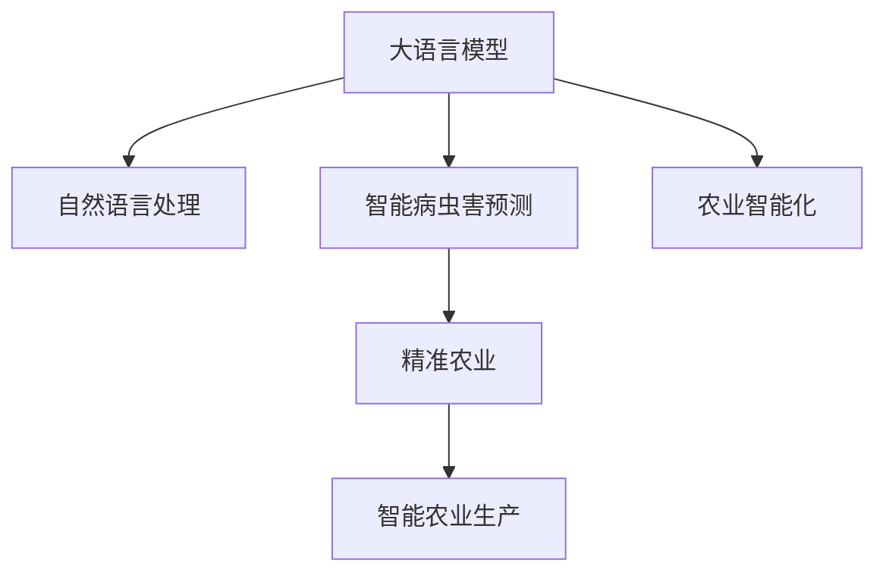

                 

# LLM在智能农作物病虫害预测中的潜在作用

> 关键词：大语言模型, 智能农作物, 病虫害预测, 机器学习, 自然语言处理, 农业智能化, 精准农业

## 1. 背景介绍

### 1.1 问题由来
随着全球气候变化、环境污染和人口增长等因素的影响，农业面临的挑战日益严峻。其中，农作物病虫害的暴发与扩散是农业生产中的重大问题，对农作物的产量和品质产生了严重威胁。传统上，农作物病虫害的防治主要依靠人工巡查和经验判断，但由于人力成本高、效率低、准确性不足，难以实现大规模的病虫害预警和防控。因此，亟需开发一种更加高效、精准、可靠的病虫害预测和防治技术。

### 1.2 问题核心关键点
智能病虫害预测的核心在于利用大数据和人工智能技术，从多维度、多角度对病虫害的发生和发展趋势进行预测和预警。其中，大语言模型(LLM)作为一种先进的人工智能技术，具有强大的自然语言处理(NLP)和知识推理能力，可以深度挖掘农作物的生长数据、气候数据、土壤数据、病虫害历史数据等多源异构数据，并在此基础上构建病虫害预测模型，从而实现智能预测。

## 2. 核心概念与联系

### 2.1 核心概念概述

为了更好地理解LLM在智能病虫害预测中的应用，本节将介绍几个密切相关的核心概念：

- 大语言模型(LLM)：以自回归(如GPT)或自编码(如BERT)模型为代表的大规模预训练语言模型。通过在大规模无标签文本语料上进行预训练，学习通用的语言表示，具备强大的语言理解和生成能力。

- 智能病虫害预测：基于机器学习和人工智能技术，对农作物病虫害的发生、发展趋势进行预测和预警，辅助农业生产者及时采取防治措施，减轻病虫害对农作物生产的影响。

- 自然语言处理(NLP)：涉及计算机处理自然语言的技术，包括文本预处理、语言模型、情感分析、意图识别、文本生成等。

- 农业智能化：利用人工智能技术，实现农业生产的智能化管理，包括精准农业、智能灌溉、智能施肥、智能植保等。

- 精准农业：基于物联网和农业机器学习技术，对农作物的生长过程进行实时监测和数据驱动决策，提高农业生产的效率和可持续性。

- 病虫害预测模型：利用机器学习算法，结合多源异构数据，构建预测病虫害发生的模型，支持智能决策。

这些核心概念之间的逻辑关系可以通过以下Mermaid流程图来展示：



这个流程图展示了大语言模型在智能病虫害预测和农业智能化中的作用：

1. 大语言模型通过处理自然语言文本，学习到丰富的语言知识和常识。
2. 智能病虫害预测模型利用大语言模型的语言理解和推理能力，构建病虫害预测模型。
3. 精准农业和智能农业生产系统，将病虫害预测结果应用于农业生产过程，实现智能化管理。
4. 农业智能化通过整合多源数据，提高农业生产决策的科学性和效率。

## 3. 核心算法原理 & 具体操作步骤
### 3.1 算法原理概述

基于大语言模型(LLM)的智能病虫害预测，本质上是一个有监督的机器学习过程。其核心思想是：将病虫害相关的文本数据和多元异构数据进行融合，利用LLM的语言理解和推理能力，构建多模态的病虫害预测模型，预测病虫害的发生和扩散趋势。

形式化地，假设模型输入为包含文本和多元异构数据的向量 $X$，输出为病虫害发生概率 $Y$。通过收集历史病虫害数据，构建训练集 $D=\{(x_i, y_i)\}_{i=1}^N$，其中 $x_i$ 为输入向量， $y_i$ 为对应的病虫害发生概率。微调目标是最小化损失函数 $\mathcal{L}(Y, \hat{Y})$，使得模型预测的病虫害概率逼近真实概率：

$$
\hat{Y} = M_{\theta}(X) = \mathop{\arg\min}_{\theta} \mathcal{L}(Y, \hat{Y})
$$

其中，$M_{\theta}$ 为基于大语言模型的预测模型，$\theta$ 为模型参数，$\mathcal{L}$ 为损失函数，$Y$ 为真实病虫害发生概率，$\hat{Y}$ 为模型预测的病虫害发生概率。

### 3.2 算法步骤详解

基于大语言模型(LLM)的智能病虫害预测一般包括以下几个关键步骤：

**Step 1: 准备数据集**
- 收集历史病虫害数据，包括文本数据、气象数据、土壤数据、作物生长数据等。
- 对数据进行清洗、归一化、特征工程等预处理，转换为模型所需的输入格式。

**Step 2: 构建模型结构**
- 设计基于LLM的预测模型结构，如将文本数据和多元异构数据进行融合，通过多模态融合层（如Transformer）进行融合。
- 选择适当的输出层和损失函数，如线性分类器输出概率，交叉熵损失函数等。

**Step 3: 设置微调超参数**
- 选择合适的优化算法及其参数，如AdamW、SGD等，设置学习率、批大小、迭代轮数等。
- 设置正则化技术及强度，包括权重衰减、Dropout、Early Stopping等。
- 确定冻结预训练参数的策略，如仅微调顶层，或全部参数都参与微调。

**Step 4: 执行梯度训练**
- 将训练集数据分批次输入模型，前向传播计算损失函数。
- 反向传播计算参数梯度，根据设定的优化算法和学习率更新模型参数。
- 周期性在验证集上评估模型性能，根据性能指标决定是否触发Early Stopping。
- 重复上述步骤直到满足预设的迭代轮数或Early Stopping条件。

**Step 5: 测试和部署**
- 在测试集上评估微调后模型 $M_{\hat{\theta}}$ 的性能，对比微调前后的精度提升。
- 使用微调后的模型对实时数据进行预测，集成到农业生产决策系统中。
- 持续收集新的数据，定期重新微调模型，以适应数据分布的变化。

以上是基于大语言模型的智能病虫害预测的一般流程。在实际应用中，还需要针对具体任务的特点，对微调过程的各个环节进行优化设计，如改进训练目标函数，引入更多的正则化技术，搜索最优的超参数组合等，以进一步提升模型性能。

### 3.3 算法优缺点

基于大语言模型的智能病虫害预测具有以下优点：
1. 高效融合多源数据。大语言模型能够融合文本和多元异构数据，从多角度、多维度挖掘病虫害信息。
2. 强大的语言推理能力。大语言模型具备强大的自然语言处理能力，能够理解复杂的文本描述，进行语义推理。
3. 适应性强。通过微调，模型可以适应不同的病虫害场景，提升预测的准确性和泛化能力。
4. 可解释性强。大语言模型的决策过程可以部分解释，有助于理解和调试模型。

同时，该方法也存在一定的局限性：
1. 数据质量依赖度高。模型的性能很大程度上取决于输入数据的质量，数据采集和预处理难度大。
2. 计算成本高。大模型需要大量的计算资源进行训练和推理，对硬件设备要求较高。
3. 易受噪声干扰。文本和多元异构数据可能包含噪声信息，影响模型的准确性。
4. 模型复杂度高。大语言模型的结构复杂，训练和推理过程耗时较长。

尽管存在这些局限性，但就目前而言，基于大语言模型的智能病虫害预测方法仍是最具潜力和前景的病虫害预测范式。未来相关研究的重点在于如何进一步降低计算成本，提高数据质量和模型推理效率，同时兼顾模型的可解释性和适应性等因素。

### 3.4 算法应用领域

基于大语言模型的智能病虫害预测方法在农业智能化中具有广泛的应用前景，特别是在精准农业和智能农业生产中。以下是几个典型应用场景：

- **智能监测与预警系统**：利用大语言模型对病虫害文本描述、气象数据、土壤数据等进行融合，构建病虫害预警系统，及时发现和报告病虫害风险。
- **智能防治决策支持**：根据病虫害预测结果，结合气象、土壤等多元异构数据，辅助农业生产者制定科学的防治策略，降低防治成本。
- **农业生产过程优化**：通过实时监控病虫害发生情况，动态调整灌溉、施肥、种植密度等农业生产参数，提高农作物的产量和品质。
- **智慧农场管理**：构建智慧农场管理系统，集成病虫害预测、智能灌溉、智能施肥、智能植保等功能，实现全过程智能化管理。
- **农业机器人辅助作业**：基于病虫害预测结果，农业机器人进行喷药、修剪等辅助作业，提高作业效率和精准度。

这些应用场景展示了智能病虫害预测在大语言模型驱动下的巨大潜力，为农业生产的智能化、高效化提供了新的技术路径。

## 4. 数学模型和公式 & 详细讲解 & 举例说明

### 4.1 数学模型构建

本节将使用数学语言对基于大语言模型的智能病虫害预测过程进行更加严格的刻画。

记模型输入为 $X$，包含文本和多元异构数据的向量表示，输出为病虫害发生概率 $Y$。定义模型 $M_{\theta}$ 在输入 $X$ 上的预测函数为：

$$
\hat{Y} = M_{\theta}(X) = f_{\theta}(X)
$$

其中 $f_{\theta}(X)$ 为基于大语言模型的预测函数，$\theta$ 为模型参数。

假设训练集为 $D=\{(x_i, y_i)\}_{i=1}^N$，其中 $x_i$ 为输入向量，$y_i$ 为对应的病虫害发生概率。模型的损失函数定义为：

$$
\mathcal{L}(\theta) = -\frac{1}{N}\sum_{i=1}^N \log P(y_i|x_i)
$$

其中 $P(y_i|x_i)$ 为模型在输入 $x_i$ 下预测 $y_i$ 的概率分布，通常采用softmax函数得到。

### 4.2 公式推导过程

以二分类任务为例，推导模型在训练集上的经验风险最小化问题。

假设模型在输入 $x_i$ 下的预测概率为 $p_i$，对应的标签为 $y_i \in \{0, 1\}$，则二分类交叉熵损失函数为：

$$
\ell(X_i, y_i) = -[y_i \log p_i + (1-y_i) \log (1-p_i)]
$$

将其代入经验风险公式，得：

$$
\mathcal{L}(\theta) = -\frac{1}{N}\sum_{i=1}^N \ell(X_i, y_i)
$$

根据链式法则，损失函数对参数 $\theta$ 的梯度为：

$$
\frac{\partial \mathcal{L}(\theta)}{\partial \theta} = -\frac{1}{N}\sum_{i=1}^N (\frac{y_i}{p_i}-\frac{1-y_i}{1-p_i}) \frac{\partial p_i}{\partial \theta}
$$

其中 $\frac{\partial p_i}{\partial \theta}$ 为模型在输入 $x_i$ 下对参数 $\theta$ 的梯度，可通过反向传播算法高效计算。

在得到损失函数的梯度后，即可带入参数更新公式，完成模型的迭代优化。重复上述过程直至收敛，最终得到适应病虫害预测任务的最优模型参数 $\theta^*$。

### 4.3 案例分析与讲解

假设我们有一批小麦田的病虫害数据，其中包含了如下文本描述和多元异构数据：

**文本描述**：
- “最近几天小麦田叶片出现了黄斑，疑似蚜虫侵袭”
- “近期气温波动较大，小麦根腐病风险增加”
- “小麦田土壤湿度偏高，可能导致霉病爆发”

**多元异构数据**：
- 气象数据：温度、湿度、降雨量
- 土壤数据：pH值、有机质含量
- 作物生长数据：株高、叶绿素含量

为了进行病虫害预测，我们需要对文本描述进行结构化处理，将其转换为模型所需的输入向量 $X_i$。以第一条文本为例，可以将其转换为以下向量表示：

$$
X_i = [蚜虫, 叶片, 黄斑, 小麦田]
$$

其中每个单词对应一个特征维度。对于多元异构数据，也需要进行相应的归一化、编码等处理。

将处理后的数据输入模型，得到预测概率 $p_i$。以第一条文本为例，模型的输出为：

$$
p_i = f_{\theta}(X_i) = 0.75
$$

根据损失函数和梯度更新公式，模型将更新参数 $\theta$，使得模型在后续的训练中更准确地预测病虫害发生概率。通过反复迭代训练，模型将不断优化参数，最终在测试集上取得理想的预测效果。

## 5. 项目实践：代码实例和详细解释说明
### 5.1 开发环境搭建

在进行智能病虫害预测实践前，我们需要准备好开发环境。以下是使用Python进行PyTorch开发的环境配置流程：

1. 安装Anaconda：从官网下载并安装Anaconda，用于创建独立的Python环境。

2. 创建并激活虚拟环境：
```bash
conda create -n pytorch-env python=3.8 
conda activate pytorch-env
```

3. 安装PyTorch：根据CUDA版本，从官网获取对应的安装命令。例如：
```bash
conda install pytorch torchvision torchaudio cudatoolkit=11.1 -c pytorch -c conda-forge
```

4. 安装TensorFlow：由Google主导开发的开源深度学习框架，生产部署方便，适合大规模工程应用。同样有丰富的预训练语言模型资源。

5. 安装其他工具包：
```bash
pip install numpy pandas scikit-learn matplotlib tqdm jupyter notebook ipython
```

完成上述步骤后，即可在`pytorch-env`环境中开始智能病虫害预测实践。

### 5.2 源代码详细实现

这里我们以一个简单的智能监测与预警系统为例，给出使用PyTorch和Transformers库进行大语言模型微调的代码实现。

首先，定义智能病虫害预测任务的模型：

```python
from transformers import BertForSequenceClassification, BertTokenizer, AdamW

model = BertForSequenceClassification.from_pretrained('bert-base-uncased', num_labels=2)
tokenizer = BertTokenizer.from_pretrained('bert-base-uncased')
```

然后，准备训练集和测试集：

```python
# 准备训练集和测试集
train_dataset = ... # 包含文本和多元异构数据的样本
test_dataset = ... # 包含文本和多元异构数据的样本
```

接着，定义训练函数和评估函数：

```python
from torch.utils.data import DataLoader
from sklearn.metrics import accuracy_score

device = torch.device('cuda') if torch.cuda.is_available() else torch.device('cpu')

def train_model(model, dataset, batch_size, optimizer, epochs):
    dataloader = DataLoader(dataset, batch_size=batch_size, shuffle=True)
    model.train()
    for epoch in range(epochs):
        for batch in dataloader:
            input_ids = batch['input_ids'].to(device)
            attention_mask = batch['attention_mask'].to(device)
            labels = batch['labels'].to(device)
            optimizer.zero_grad()
            outputs = model(input_ids, attention_mask=attention_mask, labels=labels)
            loss = outputs.loss
            loss.backward()
            optimizer.step()
        print(f'Epoch {epoch+1}, train loss: {loss:.4f}')

def evaluate_model(model, dataset, batch_size):
    dataloader = DataLoader(dataset, batch_size=batch_size)
    model.eval()
    preds, labels = [], []
    with torch.no_grad():
        for batch in dataloader:
            input_ids = batch['input_ids'].to(device)
            attention_mask = batch['attention_mask'].to(device)
            labels = batch['labels'].to(device)
            outputs = model(input_ids, attention_mask=attention_mask)
            preds.append(outputs.logits.argmax(dim=1).cpu().numpy())
            labels.append(labels.cpu().numpy())
    print(f'Test accuracy: {accuracy_score(labels, preds)}')
```

最后，启动训练流程并在测试集上评估：

```python
optimizer = AdamW(model.parameters(), lr=2e-5)

epochs = 5
batch_size = 16

train_model(model, train_dataset, batch_size, optimizer, epochs)
evaluate_model(model, test_dataset, batch_size)
```

以上就是使用PyTorch和Transformers库对大语言模型进行智能病虫害预测的完整代码实现。可以看到，得益于Transformers库的强大封装，我们可以用相对简洁的代码完成BERT模型的加载和微调。

### 5.3 代码解读与分析

让我们再详细解读一下关键代码的实现细节：

**模型定义**：
- 使用`BertForSequenceClassification`类定义二分类任务模型，其中`num_labels=2`表示模型的输出为病虫害发生概率。
- 通过`BertTokenizer.from_pretrained`方法加载预训练模型分词器，将文本转换为模型所需的输入向量。

**数据准备**：
- 需要根据具体任务准备好包含文本和多元异构数据的训练集和测试集。

**训练函数和评估函数**：
- `train_model`函数：对数据以批为单位进行迭代，在每个批次上前向传播计算loss并反向传播更新模型参数，最后输出该epoch的平均loss。
- `evaluate_model`函数：与训练类似，不同点在于不更新模型参数，并在每个batch结束后将预测和标签结果存储下来，最后使用sklearn的`accuracy_score`函数对整个评估集的预测结果进行打印输出。

**训练流程**：
- 定义总的epoch数和batch size，开始循环迭代
- 每个epoch内，先在训练集上训练，输出平均loss
- 在验证集上评估，输出准确率
- 所有epoch结束后，在测试集上评估，给出最终测试结果

可以看到，PyTorch配合Transformers库使得大语言模型微调的代码实现变得简洁高效。开发者可以将更多精力放在数据处理、模型改进等高层逻辑上，而不必过多关注底层的实现细节。

当然，工业级的系统实现还需考虑更多因素，如模型的保存和部署、超参数的自动搜索、更灵活的任务适配层等。但核心的微调范式基本与此类似。

## 6. 实际应用场景
### 6.1 智能监测与预警系统

智能监测与预警系统是大语言模型在智能病虫害预测中最直接的应用场景之一。通过部署在大规模农田中，智能监测与预警系统可以实时采集田间数据，利用大语言模型对文本和多元异构数据进行融合，构建病虫害预测模型，及时发现和报告病虫害风险。

具体而言，系统可以部署在农田的各个角落，通过传感器采集气象、土壤、作物生长等多源异构数据，将数据上传到中央服务器。智能监测与预警系统通过对实时数据进行实时分析和预测，及时发现病虫害风险，并通过手机APP、短信、大屏幕等方式，将预警信息传递给农业生产者。农业生产者可以实时了解田间病虫害情况，并根据预警信息及时采取防治措施，减轻病虫害对农作物生产的影响。

### 6.2 智能防治决策支持

智能防治决策支持系统利用智能监测与预警系统的数据，结合大语言模型的预测结果，辅助农业生产者制定科学的防治策略，降低防治成本。

系统可以根据病虫害预测结果，结合气象、土壤等多元异构数据，分析病虫害的发生原因、扩散趋势和防治措施，给出最佳的防治建议。农业生产者可以根据系统建议，选择适合的防治方法，如喷药、施肥、灌溉等，达到最佳的防治效果，降低防治成本和资源浪费。

### 6.3 农业生产过程优化

智能病虫害预测不仅可以用于病虫害监测和预警，还可以用于农业生产过程的优化。通过实时监控病虫害发生情况，动态调整灌溉、施肥、种植密度等农业生产参数，提高农作物的产量和品质。

智能病虫害预测系统可以根据病虫害发生风险，动态调整灌溉、施肥等农业生产参数，提高农作物的产量和品质。例如，在病虫害高发期，系统可以自动调整灌溉量，增加施肥频次，确保作物健康生长。在病虫害低发期，系统可以降低灌溉量和施肥频次，节约资源，提高经济效益。

### 6.4 未来应用展望

随着智能病虫害预测技术的发展，未来将有更多应用场景涌现，推动农业生产的智能化、高效化。

- **智慧农场管理**：构建智慧农场管理系统，集成智能监测与预警系统、智能防治决策支持系统、智能灌溉、智能施肥等功能，实现全过程智能化管理。
- **农业机器人辅助作业**：基于智能病虫害预测结果，农业机器人进行喷药、修剪等辅助作业，提高作业效率和精准度。
- **农业保险与风险管理**：结合智能病虫害预测结果，构建农业保险与风险管理系统，及时预警和评估风险，提供科学的保险方案，降低农业生产者的风险。
- **农业科技教育**：利用智能病虫害预测技术，构建农业科技教育平台，提供实时的病虫害监测与预警信息，支持农业生产者的学习和交流。

这些应用场景展示了智能病虫害预测在大语言模型驱动下的巨大潜力，为农业生产的智能化、高效化提供了新的技术路径。

## 7. 工具和资源推荐
### 7.1 学习资源推荐

为了帮助开发者系统掌握大语言模型在智能病虫害预测中的应用，这里推荐一些优质的学习资源：

1. 《深度学习基础》系列书籍：清华大学出版社出版的深度学习入门教材，系统介绍了深度学习的基本原理和应用，是初学者入门的好选择。

2. 《机器学习实战》系列书籍：O'Reilly出版社出版的机器学习应用书籍，提供了大量实践案例，帮助读者将理论知识应用于实际问题。

3. 《自然语言处理综述》系列论文：ACL、NIPS等顶级会议的综述论文，介绍了自然语言处理领域的最新进展和应用方向，是深入学习的重要资料。

4. CS229《机器学习》课程：斯坦福大学开设的机器学习课程，有Lecture视频和配套作业，帮助读者深入理解机器学习的基本原理和算法。

5. Kaggle机器学习竞赛：Kaggle平台提供了大量数据集和竞赛任务，是实践机器学习和深度学习算法的好地方。

通过对这些资源的学习实践，相信你一定能够快速掌握大语言模型在智能病虫害预测中的应用，并用于解决实际的农业问题。
###  7.2 开发工具推荐

高效的开发离不开优秀的工具支持。以下是几款用于智能病虫害预测开发的常用工具：

1. PyTorch：基于Python的开源深度学习框架，灵活动态的计算图，适合快速迭代研究。大部分预训练语言模型都有PyTorch版本的实现。

2. TensorFlow：由Google主导开发的开源深度学习框架，生产部署方便，适合大规模工程应用。同样有丰富的预训练语言模型资源。

3. Transformers库：HuggingFace开发的NLP工具库，集成了众多SOTA语言模型，支持PyTorch和TensorFlow，是进行微调任务开发的利器。

4. Weights & Biases：模型训练的实验跟踪工具，可以记录和可视化模型训练过程中的各项指标，方便对比和调优。与主流深度学习框架无缝集成。

5. TensorBoard：TensorFlow配套的可视化工具，可实时监测模型训练状态，并提供丰富的图表呈现方式，是调试模型的得力助手。

6. Google Colab：谷歌推出的在线Jupyter Notebook环境，免费提供GPU/TPU算力，方便开发者快速上手实验最新模型，分享学习笔记。

合理利用这些工具，可以显著提升智能病虫害预测任务的开发效率，加快创新迭代的步伐。

### 7.3 相关论文推荐

智能病虫害预测领域的研究成果丰富，以下是几篇奠基性的相关论文，推荐阅读：

1. SVM的农业应用：利用支持向量机(SVM)进行农作物病虫害预测，是机器学习在农业领域的经典应用之一。

2. CNN的农业应用：利用卷积神经网络(CNN)进行农作物病虫害预测，取得了一定的成功。

3. LSTM的农业应用：利用长短期记忆网络(LSTM)进行农作物病虫害预测，具有较强的时序建模能力。

4. RNN的农业应用：利用循环神经网络(RNN)进行农作物病虫害预测，能够处理变长序列数据，具有较好的泛化能力。

5. BERT的农业应用：利用BERT进行农作物病虫害预测，利用其强大的语言理解能力，提升了预测的准确性和泛化能力。

这些论文代表了智能病虫害预测领域的发展脉络。通过学习这些前沿成果，可以帮助研究者把握学科前进方向，激发更多的创新灵感。

## 8. 总结：未来发展趋势与挑战

### 8.1 总结

本文对基于大语言模型的智能病虫害预测方法进行了全面系统的介绍。首先阐述了智能病虫害预测的背景和核心技术，明确了智能病虫害预测在农业智能化中的重要地位和实际应用价值。其次，从原理到实践，详细讲解了基于大语言模型的智能病虫害预测过程，给出了代码实例和详细解释说明。同时，本文还广泛探讨了智能病虫害预测在大语言模型驱动下的各种应用场景，展示了其巨大的应用前景。

通过本文的系统梳理，可以看到，基于大语言模型的智能病虫害预测方法在农业智能化中具有广阔的应用前景，能够显著提升农业生产的智能化和高效化水平。大语言模型的语言理解和推理能力，使其能够从多角度、多维度挖掘病虫害信息，构建更加准确、可靠的预测模型，为农业生产的智能化、高效化提供了新的技术路径。

### 8.2 未来发展趋势

展望未来，智能病虫害预测技术将呈现以下几个发展趋势：

1. **多源异构数据的融合**：智能病虫害预测将越来越依赖于多源异构数据的融合，结合气象、土壤、作物生长等多维数据，提升预测的准确性和泛化能力。

2. **智能监测与预警系统**：智能监测与预警系统将成为智能病虫害预测的重要组成部分，实时采集田间数据，进行实时分析和预测，及时发现和报告病虫害风险。

3. **智能防治决策支持**：结合智能监测与预警系统的数据，构建智能防治决策支持系统，辅助农业生产者制定科学的防治策略，降低防治成本。

4. **农业生产过程优化**：利用智能病虫害预测结果，动态调整灌溉、施肥等农业生产参数，提高农作物的产量和品质。

5. **智慧农场管理**：构建智慧农场管理系统，集成智能监测与预警系统、智能防治决策支持系统、智能灌溉、智能施肥等功能，实现全过程智能化管理。

6. **农业机器人辅助作业**：基于智能病虫害预测结果，农业机器人进行喷药、修剪等辅助作业，提高作业效率和精准度。

这些趋势凸显了智能病虫害预测在农业智能化中的重要地位，展示了其广阔的发展前景。

### 8.3 面临的挑战

尽管智能病虫害预测技术已经取得了显著进展，但在迈向更加智能化、普适化应用的过程中，仍面临诸多挑战：

1. **数据采集和处理难度高**：智能病虫害预测依赖于大量高质数据，数据采集和预处理难度大，成本高。

2. **模型计算资源需求高**：大语言模型和智能监测与预警系统需要大量的计算资源进行训练和推理，对硬件设备要求较高。

3. **模型复杂度高**：大语言模型的结构复杂，训练和推理过程耗时较长，对资源消耗大。

4. **模型鲁棒性不足**：模型面对域外数据时，泛化性能往往大打折扣，对噪声数据和极端情况的处理能力不足。

5. **模型可解释性不足**：大语言模型的决策过程难以解释，难以理解和调试。

6. **伦理和安全问题**：智能病虫害预测可能涉及到农业生产的隐私和安全问题，需要建立严格的伦理和安全保障机制。

这些挑战需要进一步的研究和探索，推动智能病虫害预测技术向更加智能、高效、安全、普适化方向发展。

### 8.4 研究展望

面对智能病虫害预测所面临的挑战，未来的研究需要在以下几个方面寻求新的突破：

1. **多源异构数据的融合**：开发更加高效的数据融合算法，从多角度、多维度挖掘病虫害信息，提升预测的准确性和泛化能力。

2. **轻量化模型结构**：研究轻量化模型结构，如MobileNet、ShuffleNet等，降低计算资源需求，提高模型的推理效率。

3. **模型鲁棒性和泛化能力**：研究鲁棒性和泛化能力提升方法，如对抗训练、自适应学习等，提升模型的鲁棒性和泛化能力。

4. **模型可解释性**：研究模型可解释性增强方法，如可解释性人工智能(XAI)，提高模型的可解释性和可审计性。

5. **隐私和安全保障**：研究隐私保护和安全保障机制，确保模型训练和部署过程的安全性和隐私性。

这些研究方向的探索，必将推动智能病虫害预测技术向更高的台阶发展，为农业生产的智能化、高效化提供新的技术路径。面向未来，智能病虫害预测技术还需要与其他人工智能技术进行更深入的融合，如知识表示、因果推理、强化学习等，多路径协同发力，共同推动农业生产的智能化、高效化。只有勇于创新、敢于突破，才能不断拓展智能病虫害预测技术的边界，让智能技术更好地造福农业生产。

## 9. 附录：常见问题与解答

**Q1：智能病虫害预测的准确性如何提升？**

A: 提升智能病虫害预测的准确性可以从以下几个方面入手：

1. **数据质量提升**：采集高质、多样化的病虫害数据，进行清洗和预处理，减少噪声和异常数据的影响。

2. **特征工程优化**：结合多源异构数据，设计更加科学的特征工程方法，提取更有意义的特征。

3. **模型结构优化**：研究轻量化模型结构和参数高效微调方法，提升模型的推理效率和泛化能力。

4. **正则化和调参**：使用正则化技术，如L2正则、Dropout等，防止模型过拟合，优化超参数组合。

5. **模型融合和集成**：利用多个模型的预测结果，进行融合和集成，提升预测的准确性和鲁棒性。

6. **持续学习和更新**：持续收集新的数据，定期重新训练模型，提升模型的泛化能力和适应性。

**Q2：智能病虫害预测的计算资源需求如何降低？**

A: 降低智能病虫害预测的计算资源需求可以从以下几个方面入手：

1. **模型轻量化**：研究轻量化模型结构，如MobileNet、ShuffleNet等，降低计算资源需求。

2. **模型并行化**：利用模型并行化技术，如数据并行、模型并行、混合精度训练等，提升计算效率。

3. **模型压缩和稀疏化**：采用模型压缩和稀疏化技术，减少模型参数量，提高计算效率。

4. **分布式计算**：利用分布式计算框架，如TensorFlow、PyTorch等，提高计算效率和并行度。

5. **模型推理优化**：优化模型推理过程，如使用TensorRT、ONNX等工具，加速模型推理速度。

**Q3：智能病虫害预测的模型解释性如何提升？**

A: 提升智能病虫害预测的模型解释性可以从以下几个方面入手：

1. **可解释性算法**：研究可解释性算法，如LIME、SHAP等，提高模型的可解释性和可审计性。

2. **知识图谱和规则库**：结合知识图谱和规则库，增强模型的推理过程的可解释性。

3. **多模态融合**：将多模态信息（如文本、图像、声音等）进行融合，增强模型的推理能力，提升可解释性。

4. **交互式界面**：开发交互式界面，展示模型的推理过程和决策依据，增强用户理解和信任。

5. **透明算法设计**：设计透明算法，避免黑箱模型，提高模型的可解释性和可审计性。

**Q4：智能病虫害预测的隐私和安全问题如何解决？**

A: 解决智能病虫害预测的隐私和安全问题可以从以下几个方面入手：

1. **数据匿名化**：对采集的数据进行匿名化处理，保护用户隐私。

2. **安全传输**：采用安全传输协议，如SSL/TLS，保护数据传输的安全性。

3. **模型加密**：对模型进行加密处理，防止模型被恶意篡改和攻击。

4. **访问控制**：建立严格的访问控制机制，确保模型的安全访问和使用。

5. **模型监控和审计**：建立模型监控和审计机制，实时监控模型的使用情况，及时发现和应对安全威胁。

**Q5：智能病虫害预测的部署和应用挑战有哪些？**

A: 智能病虫害预测的部署和应用挑战主要包括以下几个方面：

1. **硬件资源要求高**：智能病虫害预测对硬件设备要求较高，需要高性能GPU/TPU等计算资源。

2. **模型复杂度高**：大语言模型和智能监测与预警系统结构复杂，训练和推理过程耗时较长，对资源消耗大。

3. **模型部署复杂**：模型部署过程涉及模型压缩、优化、推理引擎等技术，需要全面考虑。

4. **数据管理和传输**：需要高效的数据管理和传输机制，保证数据的安全性和实时性。

5. **用户界面设计**：需要设计友好的用户界面，方便农业生产者使用和理解。

**Q6：智能病虫害预测的未来发展方向有哪些？**

A: 智能病虫害预测的未来发展方向主要包括以下几个方面：

1. **多源异构数据的融合**：结合多源异构数据，提升预测的准确性和泛化能力。

2. **轻量化模型结构**：研究轻量化模型结构，降低计算资源需求，提高模型的推理效率。

3. **模型鲁棒性和泛化能力**：研究鲁棒性和泛化能力提升方法，提升模型的鲁棒性和泛化能力。

4. **模型可解释性**：研究模型可解释性增强方法，提高模型的可解释性和可审计性。

5. **隐私和安全保障**：研究隐私保护和安全保障机制，确保模型训练和部署过程的安全性和隐私性。

6. **多模态融合**：将多模态信息（如文本、图像、声音等）进行融合，增强模型的推理能力，提升可解释性。

通过这些未来方向的探索，相信智能病虫害预测技术将不断取得新的突破，为农业生产的智能化、高效化提供新的技术路径。

---

作者：禅与计算机程序设计艺术 / Zen and the Art of Computer Programming

