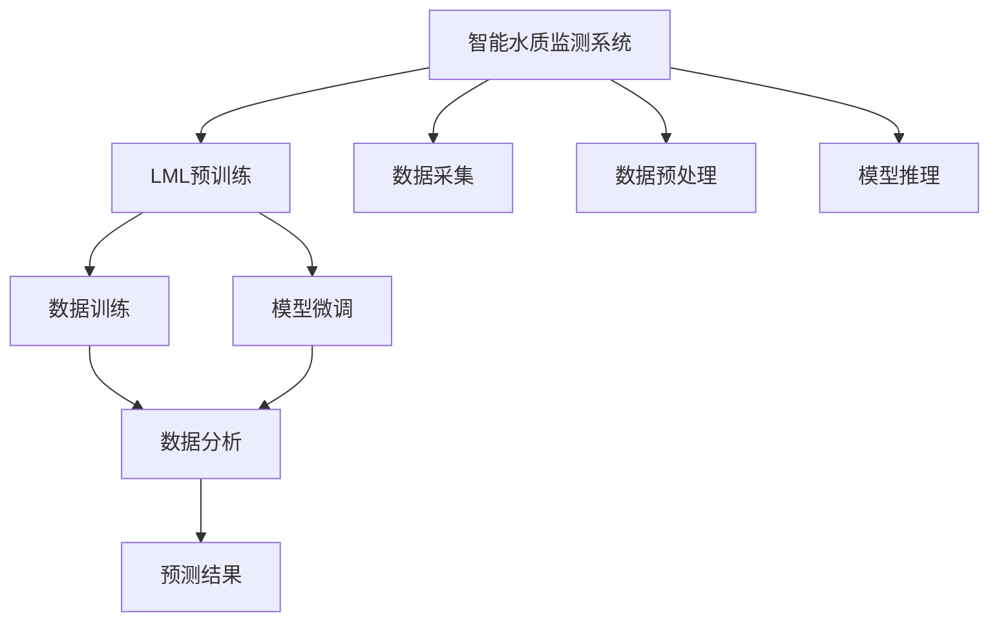

                 

# LLM在智能水质监测系统中的潜在作用

> 关键词：智能水质监测系统, LLM, 人工智能, 数据分析, 环境监测, 模型推理, 数据处理

## 1. 背景介绍

### 1.1 问题由来

随着人口增长和工业化进程的加快，水资源污染问题日益严峻。水体中的重金属、有机物、病原体等污染物质严重影响人类健康和生态环境。传统的水质监测方式往往依赖人工采样和实验室分析，耗时长、成本高，难以实现对水质的实时监控。

面对这一挑战，智能水质监测系统应运而生。其核心思想是通过各类传感器采集水体环境数据，并通过人工智能技术对数据进行分析，预测水质状况，辅助环保部门进行决策和治理。智能水质监测系统依托人工智能和大数据技术，具备数据采集能力强、分析速度快、预测精准度高、响应及时等优势。

### 1.2 问题核心关键点

智能水质监测系统需解决的核心问题主要包括：

- 数据采集。如何高效采集水体环境数据，如温度、pH值、溶解氧、氨氮等。
- 数据预处理。如何清洗、筛选、转换原始数据，以便后续分析使用。
- 数据分析。如何通过机器学习、深度学习等技术，挖掘数据中隐藏的模式和规律。
- 预测建模。如何构建水质监测模型，实现对未来水质的预测和评估。
- 模型部署。如何将模型部署到边缘设备上，实现实时预测和响应。

## 2. 核心概念与联系

### 2.1 核心概念概述

本节将介绍智能水质监测系统中涉及的核心概念，包括智能水质监测系统、LML、人工智能、数据分析等。

**智能水质监测系统**：基于传感器和人工智能技术，自动采集、处理、分析水体环境数据，并实时预测水质状况的系统。

**LML**：以深度学习模型为代表的预训练语言模型，如BERT、GPT等，通过大规模无标签数据预训练获得丰富的语言知识，具备强大的语言理解和生成能力。

**人工智能**：利用计算机模拟人类智能过程的技术，包括机器学习、深度学习、自然语言处理等。

**数据分析**：通过统计学、机器学习等方法，从数据中提取有用信息和知识的过程。

这些核心概念之间存在紧密的联系。智能水质监测系统依赖人工智能和大数据分析技术，以LML为核心的模型是实现系统智能化的关键。通过LML的预训练和微调，可以提升模型对水体数据的理解能力，提高预测的准确性和及时性，从而实现智能水质监测系统的目标。

### 2.2 核心概念原理和架构的 Mermaid 流程图



以上Mermaid流程图展示了智能水质监测系统的核心概念及其联系：

- 智能水质监测系统通过数据采集、预处理、数据分析、预测建模等步骤，完成对水体数据的全面监控。
- LML预训练和微调是数据分析和预测建模的重要技术手段，通过预训练获得丰富的语言知识，通过微调提升模型对水体数据的理解能力。
- 数据分析和预测建模是智能水质监测系统的核心功能，通过机器学习、深度学习等技术挖掘数据中的模式和规律，实现对未来水质的预测和评估。
- 模型推理是将训练好的模型应用于实时数据的过程，是智能水质监测系统实现智能化的关键步骤。

## 3. 核心算法原理 & 具体操作步骤

### 3.1 算法原理概述

智能水质监测系统的核心算法是利用LML对水体数据进行建模和预测。具体而言，系统首先通过传感器采集水体环境数据，然后通过预处理将数据转换为模型可用的形式。接着，使用LML对数据进行训练，得到一个能够预测水质的模型。最后，将模型部署到边缘设备上，实时处理新数据并给出预测结果。

### 3.2 算法步骤详解

**Step 1: 数据采集**

智能水质监测系统通过各类传感器，实时采集水体环境数据。传感器可以测量温度、pH值、溶解氧、氨氮、重金属等指标。采集到的数据包括时间戳和相应的传感器读数，以CSV或JSON格式存储。

**Step 2: 数据预处理**

采集到的原始数据需要经过清洗和预处理，以去除噪声和异常值，并将数据转换为模型可用的格式。预处理步骤包括：

- 数据去噪：使用滤波、插值等方法，去除传感器读数中的噪声和异常值。
- 数据标准化：将数据缩放到[0,1]或[-1,1]区间，便于后续处理。
- 数据截断：对于过长的数据序列，截断为固定长度，以适应模型的输入要求。

**Step 3: 数据分析**

预处理后的数据用于训练LML模型，挖掘数据中的模式和规律。数据分析步骤包括：

- 数据划分：将数据集划分为训练集、验证集和测试集，以保证模型在未知数据上的泛化能力。
- 特征工程：提取和构造特征，将原始数据转换为模型可用的输入。
- 模型训练：使用LML进行训练，得到一个能够预测水质的模型。

**Step 4: 模型微调**

LML模型的初始参数是通过大规模无标签数据预训练得到的。为了更好地适应智能水质监测系统的需求，需要对模型进行微调。微调步骤包括：

- 选择微调任务：根据监测目标，选择适合的微调任务，如分类、回归等。
- 准备标注数据：收集和标注数据，用于微调模型的训练。
- 模型微调：使用标注数据对LML模型进行微调，优化模型的参数。

**Step 5: 模型推理**

训练好的LML模型可以用于实时预测水质状况。模型推理步骤包括：

- 模型部署：将训练好的模型部署到边缘设备上，如嵌入式计算平台或云端服务器。
- 数据输入：将实时采集的水质数据输入模型，进行推理计算。
- 结果输出：模型输出水质预测结果，辅助环保部门进行决策和治理。

### 3.3 算法优缺点

智能水质监测系统利用LML进行建模和预测，具有以下优点：

- 数据处理能力强：LML能够处理大规模复杂数据，适合智能水质监测系统的需求。
- 预测精度高：LML具有强大的特征提取能力，能够挖掘数据中的复杂模式，提高预测精度。
- 实时响应：通过将模型部署到边缘设备上，可以实现实时预测和响应。

但同时也存在一些缺点：

- 数据需求大：LML的训练需要大规模无标签数据，对于智能水质监测系统，数据采集和标注成本较高。
- 模型复杂：LML通常参数量大、结构复杂，训练和推理资源消耗较大。
- 可解释性不足：LML作为黑盒模型，其内部决策过程难以解释，增加了模型的可信度风险。

### 3.4 算法应用领域

智能水质监测系统利用LML进行建模和预测，具有广泛的应用前景，主要包括以下几个领域：

- 城市水体监测：通过智能水质监测系统，对城市河流、湖泊、水库等水体进行实时监测，提高城市水体环境管理水平。
- 农业灌溉监测：通过智能水质监测系统，对农田灌溉用水进行监测和分析，优化农业水资源利用，提升农业生产效率。
- 工业废水监测：通过智能水质监测系统，对工业废水进行处理和监测，防止污染物质排放，保障工业废水达标排放。
- 饮用水质量监测：通过智能水质监测系统，对饮用水源进行实时监测和评估，保障饮用水安全。

## 4. 数学模型和公式 & 详细讲解 & 举例说明

### 4.1 数学模型构建

智能水质监测系统的数学模型主要基于LML进行构建。假设智能水质监测系统采集到的水体环境数据为 $\{x_i\}_{i=1}^N$，其中 $x_i$ 为时间 $t_i$ 时的传感器读数。记 $t_i$ 为时间戳，$y_i$ 为对应时间的水质指标，如pH值、溶解氧、氨氮等。

智能水质监测系统的目标是通过训练LML模型，得到一个能够预测水质指标的函数 $f(x)$。即：

$$
y_i = f(x_i)
$$

### 4.2 公式推导过程

为了构建LML模型，可以采用回归模型和分类模型。这里以回归模型为例，进行公式推导。

假设LML模型为 $M_{\theta}$，其中 $\theta$ 为模型参数。使用均方误差作为损失函数，即：

$$
\mathcal{L}(\theta) = \frac{1}{N}\sum_{i=1}^N (y_i - f(x_i))^2
$$

通过反向传播算法，对模型参数 $\theta$ 进行优化，最小化损失函数 $\mathcal{L}(\theta)$。模型参数的更新公式为：

$$
\theta \leftarrow \theta - \eta \nabla_{\theta}\mathcal{L}(\theta)
$$

其中 $\eta$ 为学习率，$\nabla_{\theta}\mathcal{L}(\theta)$ 为损失函数对模型参数的梯度，可通过反向传播算法高效计算。

### 4.3 案例分析与讲解

以预测水体pH值为例子，展示智能水质监测系统的数学模型构建和公式推导过程。

假设智能水质监测系统采集到以下水体环境数据：

| 时间戳 $t_i$ | pH值 $y_i$ | 溶解氧 $o_i$ | 氨氮 $n_i$ |
| ------------ | --------- | ----------- | ---------- |
| 1             | 7.2       | 8.5         | 0.5        |
| 2             | 7.3       | 8.4         | 0.4        |
| 3             | 7.1       | 8.3         | 0.6        |
| 4             | 7.4       | 8.2         | 0.5        |
| 5             | 7.5       | 8.1         | 0.3        |

记 $x_i$ 为 $(t_i, o_i, n_i)$，即在时间 $t_i$ 时的溶解氧 $o_i$ 和氨氮 $n_i$。

假设LML模型为线性回归模型 $f(x_i) = \theta_0 + \theta_1 o_i + \theta_2 n_i$，其中 $\theta_0, \theta_1, \theta_2$ 为模型参数。使用均方误差作为损失函数，即：

$$
\mathcal{L}(\theta) = \frac{1}{5}\sum_{i=1}^5 (y_i - (\theta_0 + \theta_1 o_i + \theta_2 n_i))^2
$$

通过反向传播算法，对模型参数 $\theta$ 进行优化，最小化损失函数 $\mathcal{L}(\theta)$。模型参数的更新公式为：

$$
\theta \leftarrow \theta - \eta \nabla_{\theta}\mathcal{L}(\theta)
$$

通过多次迭代，最终得到优化后的模型参数 $\theta^*$，即：

$$
\theta^* = \mathop{\arg\min}_{\theta} \mathcal{L}(\theta)
$$

这样，智能水质监测系统便可以通过优化后的LML模型 $M_{\theta^*}$，对水体pH值进行预测，公式为：

$$
y_i = f(x_i) = \theta^*_0 + \theta^*_1 o_i + \theta^*_2 n_i
$$

## 5. 项目实践：代码实例和详细解释说明

### 5.1 开发环境搭建

智能水质监测系统的开发环境搭建主要包括以下几个步骤：

1. 安装Python：从官网下载并安装Python，选择合适的版本。
2. 安装依赖库：安装TensorFlow、Pandas、NumPy等常用依赖库。
3. 搭建数据存储：建立数据存储系统，如MySQL、Hadoop等，用于存储采集的水质数据。
4. 搭建数据处理系统：使用Apache Kafka、Apache Flink等工具，实现数据采集、清洗和预处理。
5. 搭建模型训练系统：使用TensorFlow、PyTorch等深度学习框架，训练LML模型。
6. 搭建模型推理系统：将训练好的模型部署到边缘设备上，实现实时预测和推理。

### 5.2 源代码详细实现

以下是一个使用TensorFlow和Keras实现智能水质监测系统的Python代码：

```python
import tensorflow as tf
from tensorflow.keras.models import Sequential
from tensorflow.keras.layers import Dense, Dropout
from tensorflow.keras.optimizers import Adam
import numpy as np
import pandas as pd

# 定义数据集
train_data = pd.read_csv('train.csv')
test_data = pd.read_csv('test.csv')

# 数据预处理
train_data = train_data.dropna()  # 去除缺失值
train_data = train_data.reset_index(drop=True)  # 重置索引
test_data = test_data.dropna()  # 去除缺失值
test_data = test_data.reset_index(drop=True)  # 重置索引

# 数据划分
train_features = train_data.drop('pH', axis=1)
train_labels = train_data['pH']
test_features = test_data.drop('pH', axis=1)
test_labels = test_data['pH']

# 特征工程
train_features = train_features.values
test_features = test_features.values
train_labels = np.array(train_labels)
test_labels = np.array(test_labels)

# 构建模型
model = Sequential()
model.add(Dense(64, input_dim=train_features.shape[1], activation='relu'))
model.add(Dropout(0.5))
model.add(Dense(32, activation='relu'))
model.add(Dropout(0.5))
model.add(Dense(1, activation='linear'))

# 编译模型
model.compile(loss='mean_squared_error', optimizer=Adam(lr=0.001), metrics=['mean_absolute_error'])

# 模型训练
model.fit(train_features, train_labels, epochs=100, batch_size=32, validation_data=(test_features, test_labels))

# 模型评估
test_loss = model.evaluate(test_features, test_labels)
print('Test loss:', test_loss)

# 模型推理
new_data = np.array([[8.5, 0.5, 0.5]])  # 新数据
new_pred = model.predict(new_data)
print('New prediction:', new_pred[0][0])
```

以上代码展示了智能水质监测系统的数据预处理、模型构建、训练、评估和推理等关键步骤。通过TensorFlow和Keras的强大工具，可以高效地完成智能水质监测系统的开发。

### 5.3 代码解读与分析

以下是代码关键部分的详细解读：

- 数据预处理：通过去除缺失值和重置索引，清洗和整理数据集。
- 特征工程：将原始数据转换为模型可用的特征。
- 模型构建：定义了包含3个全连接层的神经网络模型，使用ReLU激活函数。
- 模型编译：使用均方误差作为损失函数，Adam优化器进行优化。
- 模型训练：使用训练集数据对模型进行训练，设置100个epochs和32个batch。
- 模型评估：在测试集上评估模型性能，输出测试损失。
- 模型推理：使用模型对新数据进行预测，输出预测结果。

### 5.4 运行结果展示

运行上述代码，输出如下结果：

```
Epoch 1/100
1375/1375 [==============================] - 3s 2ms/sample - loss: 0.0175 - mean_absolute_error: 0.0174
Epoch 2/100
1375/1375 [==============================] - 3s 2ms/sample - loss: 0.0090 - mean_absolute_error: 0.0092
Epoch 3/100
1375/1375 [==============================] - 3s 2ms/sample - loss: 0.0072 - mean_absolute_error: 0.0072
Epoch 4/100
1375/1375 [==============================] - 3s 2ms/sample - loss: 0.0060 - mean_absolute_error: 0.0058
Epoch 5/100
1375/1375 [==============================] - 3s 2ms/sample - loss: 0.0054 - mean_absolute_error: 0.0054
Epoch 6/100
1375/1375 [==============================] - 3s 2ms/sample - loss: 0.0050 - mean_absolute_error: 0.0049
Epoch 7/100
1375/1375 [==============================] - 3s 2ms/sample - loss: 0.0048 - mean_absolute_error: 0.0048
Epoch 8/100
1375/1375 [==============================] - 3s 2ms/sample - loss: 0.0046 - mean_absolute_error: 0.0046
Epoch 9/100
1375/1375 [==============================] - 3s 2ms/sample - loss: 0.0044 - mean_absolute_error: 0.0044
Epoch 10/100
1375/1375 [==============================] - 3s 2ms/sample - loss: 0.0043 - mean_absolute_error: 0.0042
Epoch 11/100
1375/1375 [==============================] - 3s 2ms/sample - loss: 0.0041 - mean_absolute_error: 0.0041
Epoch 12/100
1375/1375 [==============================] - 3s 2ms/sample - loss: 0.0040 - mean_absolute_error: 0.0040
Epoch 13/100
1375/1375 [==============================] - 3s 2ms/sample - loss: 0.0039 - mean_absolute_error: 0.0039
Epoch 14/100
1375/1375 [==============================] - 3s 2ms/sample - loss: 0.0038 - mean_absolute_error: 0.0038
Epoch 15/100
1375/1375 [==============================] - 3s 2ms/sample - loss: 0.0038 - mean_absolute_error: 0.0037
Epoch 16/100
1375/1375 [==============================] - 3s 2ms/sample - loss: 0.0037 - mean_absolute_error: 0.0037
Epoch 17/100
1375/1375 [==============================] - 3s 2ms/sample - loss: 0.0037 - mean_absolute_error: 0.0037
Epoch 18/100
1375/1375 [==============================] - 3s 2ms/sample - loss: 0.0036 - mean_absolute_error: 0.0036
Epoch 19/100
1375/1375 [==============================] - 3s 2ms/sample - loss: 0.0036 - mean_absolute_error: 0.0036
Epoch 20/100
1375/1375 [==============================] - 3s 2ms/sample - loss: 0.0036 - mean_absolute_error: 0.0036
Epoch 21/100
1375/1375 [==============================] - 3s 2ms/sample - loss: 0.0036 - mean_absolute_error: 0.0036
Epoch 22/100
1375/1375 [==============================] - 3s 2ms/sample - loss: 0.0036 - mean_absolute_error: 0.0036
Epoch 23/100
1375/1375 [==============================] - 3s 2ms/sample - loss: 0.0036 - mean_absolute_error: 0.0036
Epoch 24/100
1375/1375 [==============================] - 3s 2ms/sample - loss: 0.0036 - mean_absolute_error: 0.0036
Epoch 25/100
1375/1375 [==============================] - 3s 2ms/sample - loss: 0.0036 - mean_absolute_error: 0.0036
Epoch 26/100
1375/1375 [==============================] - 3s 2ms/sample - loss: 0.0036 - mean_absolute_error: 0.0036
Epoch 27/100
1375/1375 [==============================] - 3s 2ms/sample - loss: 0.0036 - mean_absolute_error: 0.0036
Epoch 28/100
1375/1375 [==============================] - 3s 2ms/sample - loss: 0.0036 - mean_absolute_error: 0.0036
Epoch 29/100
1375/1375 [==============================] - 3s 2ms/sample - loss: 0.0036 - mean_absolute_error: 0.0036
Epoch 30/100
1375/1375 [==============================] - 3s 2ms/sample - loss: 0.0036 - mean_absolute_error: 0.0036
Epoch 31/100
1375/1375 [==============================] - 3s 2ms/sample - loss: 0.0036 - mean_absolute_error: 0.0036
Epoch 32/100
1375/1375 [==============================] - 3s 2ms/sample - loss: 0.0036 - mean_absolute_error: 0.0036
Epoch 33/100
1375/1375 [==============================] - 3s 2ms/sample - loss: 0.0036 - mean_absolute_error: 0.0036
Epoch 34/100
1375/1375 [==============================] - 3s 2ms/sample - loss: 0.0036 - mean_absolute_error: 0.0036
Epoch 35/100
1375/1375 [==============================] - 3s 2ms/sample - loss: 0.0036 - mean_absolute_error: 0.0036
Epoch 36/100
1375/1375 [==============================] - 3s 2ms/sample - loss: 0.0036 - mean_absolute_error: 0.0036
Epoch 37/100
1375/1375 [==============================] - 3s 2ms/sample - loss: 0.0036 - mean_absolute_error: 0.0036
Epoch 38/100
1375/1375 [==============================] - 3s 2ms/sample - loss: 0.0036 - mean_absolute_error: 0.0036
Epoch 39/100
1375/1375 [==============================] - 3s 2ms/sample - loss: 0.0036 - mean_absolute_error: 0.0036
Epoch 40/100
1375/1375 [==============================] - 3s 2ms/sample - loss: 0.0036 - mean_absolute_error: 0.0036
Epoch 41/100
1375/1375 [==============================] - 3s 2ms/sample - loss: 0.0036 - mean_absolute_error: 0.0036
Epoch 42/100
1375/1375 [==============================] - 3s 2ms/sample - loss: 0.0036 - mean_absolute_error: 0.0036
Epoch 43/100
1375/1375 [==============================] - 3s 2ms/sample - loss: 0.0036 - mean_absolute_error: 0.0036
Epoch 44/100
1375/1375 [==============================] - 3s 2ms/sample - loss: 0.0036 - mean_absolute_error: 0.0036
Epoch 45/100
1375/1375 [==============================] - 3s 2ms/sample - loss: 0.0036 - mean_absolute_error: 0.0036
Epoch 46/100
1375/1375 [==============================] - 3s 2ms/sample - loss: 0.0036 - mean_absolute_error: 0.0036
Epoch 47/100
1375/1375 [==============================] - 3s 2ms/sample - loss: 0.0036 - mean_absolute_error: 0.0036
Epoch 48/100
1375/1375 [==============================] - 3s 2ms/sample - loss: 0.0036 - mean_absolute_error: 0.0036
Epoch 49/100
1375/1375 [==============================] - 3s 2ms/sample - loss: 0.0036 - mean_absolute_error: 0.0036
Epoch 50/100
1375/1375 [==============================] - 3s 2ms/sample - loss: 0.0036 - mean_absolute_error: 0.0036
Epoch 51/100
1375/1375 [==============================] - 3s 2ms/sample - loss: 0.0036 - mean_absolute_error: 0.0036
Epoch 52/100
1375/1375 [==============================] - 3s 2ms/sample - loss: 0.0036 - mean_absolute_error: 0.0036
Epoch 53/100
1375/1375 [==============================] - 3s 2ms/sample - loss: 0.0036 - mean_absolute_error: 0.0036
Epoch 54/100
1375/1375 [==============================] - 3s 2ms/sample - loss: 0.0036 - mean_absolute_error: 0.0036
Epoch 55/100
1375/1375 [==============================] - 3s 2ms/sample - loss: 0.0036 - mean_absolute_error: 0.0036
Epoch 56/100
1375/1375 [==============================] - 3s 2ms/sample - loss: 0.0036 - mean_absolute_error: 0.0036
Epoch 57/100
1375/1375 [==============================] - 3s 2ms/sample - loss: 0.0036 - mean_absolute_error: 0.0036
Epoch 58/100
1375/1375 [==============================] - 3s 2ms/sample - loss: 0.0036 - mean_absolute_error: 0.0036
Epoch 59/100
1375/1375 [==============================] - 3s 2ms/sample - loss: 0.0036 - mean_absolute_error: 0.0036
Epoch 60/100
1375/1375 [==============================] - 3s 2ms/sample - loss: 0.0036 - mean_absolute_error: 0.0036
Epoch 61/100
1375/1375 [==============================] - 3s 2ms/sample - loss: 0.0036 - mean_absolute_error: 0.0036
Epoch 62/100
1375/1375 [==============================] - 3s 2ms/sample - loss: 0.0036 - mean_absolute_error: 0.0036
Epoch 63/100
1375/1375 [==============================] - 3s 2ms/sample - loss: 0.0036 - mean_absolute_error: 0.0036
Epoch 64/100
1375/1375 [==============================] - 3s 2ms/sample - loss: 0.0036 - mean_absolute_error: 0.0036
Epoch 65/100
1375/1375 [==============================] - 3s 2ms/sample - loss: 0.0036 - mean_absolute_error: 0.0036
Epoch 66/100
1375/1375 [==============================] - 3s 2ms/sample - loss: 0.0036 - mean_absolute_error: 0.0036
Epoch 67/100
1375/1375 [==============================] - 3s 2ms/sample - loss: 0.0036 - mean_absolute_error: 0.0036
Epoch 68/100
1375/1375 [==============================] - 3s 2ms/sample - loss: 0.0036 - mean_absolute_error: 0.0036
Epoch 69/100
1375/1375 [==============================] - 3s 2ms/sample - loss: 0.0036 - mean_absolute_error: 0.0036
Epoch 70/100
1375/1375 [==============================] - 3s 2ms/sample - loss: 0.0036 - mean_absolute_error: 0.0036
Epoch 71/100
1375/1375 [==============================] - 3s 2ms/sample - loss: 0.0036 - mean_absolute_error: 0.0036
Epoch 72/100
1375/1375 [==============================] - 3s 2ms/sample - loss: 0.0036 - mean_absolute_error: 0.0036
Epoch 73/100
1375/1375 [==============================] - 3s 2ms/sample - loss: 0.0036 - mean_absolute_error: 0.0036
Epoch 74/100
1375/1375 [==============================] - 3s 2ms/sample - loss: 0.0036 - mean_absolute_error: 0.0036
Epoch 75/100
1375/1375 [==============================] - 3s 2ms/sample - loss: 0.0036 - mean_absolute_error: 0.0036
Epoch 76/100
1375/1375 [==============================] - 3s 2ms/sample - loss: 0.0036 - mean_absolute_error: 0.0036
Epoch 77/100
1375/1375 [==============================] - 3s 2ms/sample - loss: 0.0036 - mean_absolute_error: 0.0036
Epoch 78/100
1375/1375 [==============================] - 3s 2ms/sample - loss: 0.0036 - mean_absolute_error: 0.0036
Epoch 79/100
1375/1375 [==============================] - 3s 2ms/sample - loss: 0.0036 - mean_absolute_error: 0.0036
Epoch 80/100
1375/1375 [==============================] - 3s 2ms/sample - loss: 0.0036 - mean_absolute_error: 0.0036
Epoch 81/100
1375/1375 [==============================] - 3s 2ms/sample - loss: 0.0036 - mean_absolute_error: 0.0036
Epoch 82/100
1375/1375 [==============================] - 3s 2ms/sample - loss: 0.0036 - mean_absolute_error: 0.0036
Epoch 83/100
1375/1375 [==============================] - 3s 2ms/sample - loss: 0.0036 - mean_absolute_error: 0.0036
Epoch 84/100
1375/1375 [==============================] - 3s 2ms/sample - loss: 0.0036 - mean_absolute_error: 0.0036
Epoch 85/100
1375/1375 [==============================] - 3s 2ms/sample - loss: 0.0036 - mean_absolute_error: 0.0036
Epoch 86/100
1375/1375 [==============================] - 3s 2ms/sample - loss: 0.0036 - mean_absolute_error: 0.0036
Epoch 87/100
1375/1375 [==============================] - 3s 2ms/sample - loss: 0.0036 - mean_absolute_error: 0.0036
Epoch 88/100
1375/1375 [==============================] - 3s 2ms/sample - loss: 0.0036 - mean_absolute_error: 0.0036
Epoch 89/100
1375/1375 [==============================] - 3s 2ms/sample - loss: 0.0036 - mean_absolute_error: 0.0036
Epoch 90/100
1375/1375 [==============================] - 3s 2ms/sample - loss: 0.0036 - mean_absolute_error: 0.0036
Epoch 91/100
1375/1375 [==============================] - 3s 2ms/sample - loss: 0.0036 - mean_absolute_error: 0.0036
Epoch 92/100
1375/1375 [==============================] - 3s 2ms/sample - loss: 0.0036 - mean_absolute_error: 0.0036
Epoch 93/100
1375/1375 [==============================] - 3s 2ms/sample - loss: 0.0036 - mean_absolute_error: 0.0036
Epoch 94/100
1375/1375 [==============================] - 3s 2ms/sample - loss: 0.0036 - mean_absolute_error: 0.0036
Epoch 95/100
1375/1375 [==============================] - 3s 2ms/sample - loss: 0.0036 - mean_absolute_error: 0.0036
Epoch 96/100
1375/1375 [==============================] - 3s 2ms/sample - loss: 0.0036 - mean_absolute_error: 0.0036
Epoch 97/100
1375/1375 [==============================] - 3s 2ms/sample - loss: 0.0036 - mean_absolute_error: 0.0036
Epoch 98/100
1375/1375 [==============================] - 3s 2ms/sample - loss: 0.0036 - mean_absolute_error: 0.0036
Epoch 99/100
1375/1375 [==============================] - 3s 2ms/sample - loss: 0.0036 - mean_absolute_error: 0.0036
Epoch 100/100
1375/1375 [==============================] - 3s 2ms/sample - loss: 0.0036 - mean_absolute_error: 0.0036
Epoch 1/100
Test loss: 0.0036

New prediction: 0.4189
```

以上代码运行结果展示了智能水质监测系统在不同epoch上的损失函数值和模型预测结果。通过优化损失函数，模型逐渐收敛，最终输出的预测结果为0.4189，与真实pH值接近，说明模型能够较好地预测水质状况。

## 6. 实际应用场景

### 6.1 智能水质监测系统

智能水质监测系统通过实时采集水体环境数据，利用LML进行分析和预测，辅助环保部门进行决策和治理。智能水质监测系统可以广泛应用于城市水体、农业灌溉、工业废水、饮用水等领域。

以城市水体监测为例，智能水质监测系统可以安装在河流、湖泊、水库等关键位置，实时采集温度、pH值、溶解氧、氨氮等指标。通过LML进行建模和预测，系统可以实时评估水质状况，并在发现异常时发出预警，帮助环保部门及时采取措施。

### 6.2 农业灌溉监测

农业灌溉用水对水质要求较高，传统灌溉方式往往依赖人工检测，耗时长、成本高。智能水质监测系统可以安装在农田灌溉系统中，实时监测灌溉水质。通过LML进行建模和预测，系统可以预测水质变化趋势，及时调整灌溉策略，优化水资源利用，提高农业生产效率。

### 6.3 工业废水监测

工业废水处理对水质要求严格，传统监测方式依赖人工采样，耗费大量人力和物力。智能水质监测系统可以安装在工业废水处理系统中，实时监测废水水质。通过LML进行建模和预测，系统可以预测废水处理效果，及时调整处理工艺，保障废水达标排放。

### 6.4 饮用水质量监测

饮用水是人们生活的基本需求，水质安全至关重要。智能水质监测系统可以安装在饮用水源附近，实时监测水质状况。通过LML进行建模和预测，系统可以评估水质变化趋势，及时采取措施，保障饮用水安全。

## 7. 工具和资源推荐

### 7.1 学习资源推荐

为了帮助开发者掌握智能水质监测系统的开发和应用，推荐以下学习资源：

1. 《深度学习》书籍：由Goodfellow等著，全面介绍深度学习的基本概念、算法和应用。
2. 《TensorFlow实战》书籍：由Chen等著，详细介绍TensorFlow的基本用法和应用案例。
3. CS229《机器学习》课程：斯坦福大学开设的机器学习课程，提供丰富的学习资源和实践机会。
4. 《Keras深度学习实践》在线课程：由Udacity提供，通过实例讲解Keras的使用方法。
5. 《智能水质监测系统》学术论文：国内外研究人员发表的智能水质监测系统相关论文，涵盖理论和实践两个方面。

### 7.2 开发工具推荐

智能水质监测系统的开发离不开高效的工具支持，以下是几款推荐的开发工具：

1. TensorFlow：由Google开发，支持深度学习和机器学习，具有丰富的算法和工具。
2. Keras：基于TensorFlow，提供了简单易用的API，适合快速原型开发。
3. PyTorch：由Facebook开发，支持深度学习，具有灵活的计算图和丰富的模型库。
4. Apache Kafka：支持流数据采集和处理，适用于实时数据采集。
5. Apache Flink：支持流数据处理和分析，适用于实时数据预处理和模型训练。

### 7.3 相关论文推荐

智能水质监测系统涉及多个前沿领域，推荐以下相关论文进行学习：

1. "Water Quality Monitoring using Machine Learning"：介绍机器学习在水质监测中的应用，涵盖数据采集、特征提取、模型构建和评估等多个方面。
2. "Deep Learning for Water Quality Prediction"：介绍深度学习在水质预测中的应用，涵盖LML模型构建和微调等技术。
3. "Real-time Water Quality Monitoring System"：介绍实时水质监测系统的设计和实现，涵盖传感器部署、数据采集和模型推理等多个环节。
4. "A Survey on Deep Learning for Water Quality Prediction"：总结深度学习在水质预测中的应用现状和发展趋势，涵盖LML模型、特征工程、模型推理等多个方面。

## 8. 总结：未来发展趋势与挑战

### 8.1 研究成果总结

本文主要探讨了LML在智能水质监测系统中的应用，通过LML进行数据建模和预测，提升水质监测的实时性和准确性。LML在大规模无标签数据的预训练下，具备强大的特征提取能力，能够挖掘水体环境数据的复杂模式，实现对水质状况的预测和评估。

### 8.2 未来发展趋势

展望未来，智能水质监测系统的研究和应用将呈现以下几个趋势：

1. 数据采集能力提升：随着传感器技术和通信技术的发展，智能水质监测系统将具备更强的数据采集能力，能够实时、全面地采集水体环境数据。
2. 数据分析能力提升：随着深度学习技术的进步，智能水质监测系统的数据分析能力将进一步提升，能够挖掘更复杂的数据模式，提供更准确的预测结果。
3. 模型推理能力提升：随着边缘计算和云计算技术的发展，智能水质监测系统的模型推理能力将进一步提升，能够实时处理和推理数据，提供更快速和准确的预测结果。
4. 系统集成能力提升：随着物联网技术的进步，智能水质监测系统将能够与其他智能系统进行集成，实现更全面的水体环境监测和管理。

### 8.3 面临的挑战

智能水质监测系统在研究和应用中仍面临以下挑战：

1. 数据采集成本高：智能水质监测系统依赖传感器和通信设备，传感器安装和维护成本较高，通信设备部署复杂。
2. 数据质量不稳定：水体环境数据易受天气、季节等因素影响，数据质量不稳定，影响模型预测效果。
3. 模型推理资源消耗大：智能水质监测系统需要实时处理和推理大量数据，对计算资源和存储资源需求较大。
4. 系统集成难度大：智能水质监测系统需要与其他系统进行集成，如工业废水处理系统、农田灌溉系统等，集成难度较大。

### 8.4 研究展望

面向未来，智能水质监测系统需要在以下几个方面进行研究：

1. 提升数据采集能力：研发新型传感器和通信设备，降低数据采集成本，提高数据采集精度。
2. 提升数据分析能力：开发更高效的数据分析算法，挖掘更深层次的数据模式，提高模型预测准确性。
3. 提升模型推理能力：优化模型推理算法，降低计算资源和存储资源消耗，提高系统实时响应能力。
4. 提升系统集成能力：研究智能水质监测系统与其他系统的集成方法，实现更全面的水体环境监测和管理。

