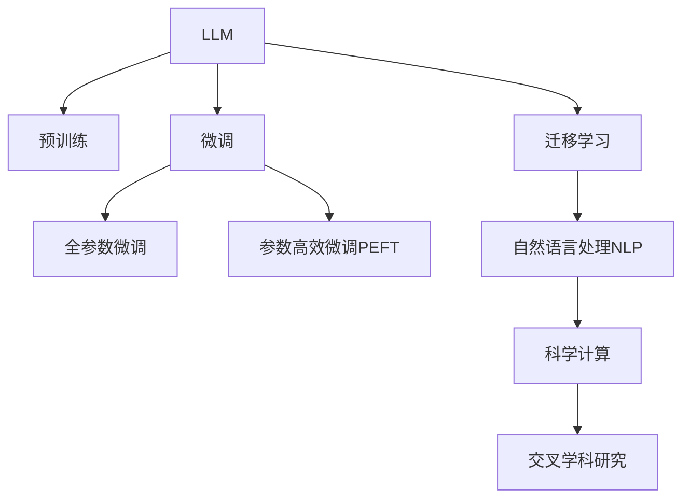

                 

# LLM在科学研究中的辅助作用

## 1. 背景介绍

### 1.1 研究背景

近年来，随着深度学习和大规模语言模型（Large Language Models, LLMs）的兴起，科学研究的范式正在发生重大变化。传统的研究模式依赖于人工阅读、分析和撰写文献，耗时耗力且容易陷入研究瓶颈。而LLM作为强大的语言理解和生成工具，通过智能化的处理与理解大量科学文献，极大地提升了科研效率和质量。

科学论文的质量和可读性是其传播和被引用的重要基础。LLM通过对自然语言文本的精炼处理，生成高质量的摘要、注释和翻译，帮助科研人员快速理解前沿成果，节省时间，提高论文传播效率。同时，LLM还可以通过文本分析，挖掘科学文本中的隐含知识，辅助科研人员发现新理论和方法。

### 1.2 研究意义

LLM在科学研究中的应用，有着重要的现实意义：

1. **提升科研效率**：LLM可以快速处理和分析大量科学文献，减少人工阅读和整理的时间，将科研人员从繁琐的文献筛选和初步分析中解放出来。
2. **促进跨学科研究**：LLM能够理解跨学科的科学语言和术语，促进不同领域间的知识交流和融合。
3. **辅助发现新知识**：LLM能够从大量的科学文献中发现潜在的研究方向和创新点，为科研人员提供新的研究思路。
4. **提升科研可读性**：LLM可以生成高质量的科研论文摘要和注释，提升论文的可读性和传播效果。

## 2. 核心概念与联系

### 2.1 核心概念概述

为更好地理解LLM在科学研究中的应用，本节将介绍几个密切相关的核心概念：

- **大规模语言模型（LLM）**：以自回归(如GPT)或自编码(如BERT)模型为代表的大规模预训练语言模型。通过在海量无标签文本语料上进行预训练，学习通用的语言表示，具备强大的语言理解和生成能力。

- **预训练(Pre-training)**：指在大规模无标签文本语料上，通过自监督学习任务训练通用语言模型的过程。常见的预训练任务包括言语建模、遮挡语言模型等。

- **微调(Fine-tuning)**：指在预训练模型的基础上，使用下游任务的少量标注数据，通过有监督地训练来优化模型在特定任务上的性能。通常只需要调整顶层分类器或解码器，并以较小的学习率更新全部或部分的模型参数。

- **迁移学习(Transfer Learning)**：指将一个领域学习到的知识，迁移应用到另一个不同但相关的领域的学习范式。LLM的预训练-微调过程即是一种典型的迁移学习方式。

- **自然语言处理(NLP)**：指计算机科学、人工智能和语言学的交叉领域，关注如何让计算机理解、处理和生成人类语言。

- **科学计算(Scientific Computing)**：指利用计算机技术解决科学问题的计算领域，涵盖数值计算、模拟与仿真、数据处理与分析等。

这些核心概念之间的逻辑关系可以通过以下Mermaid流程图来展示：



这个流程图展示了大语言模型的核心概念及其之间的关系：

1. LLM通过预训练获得基础能力。
2. 微调是对预训练模型进行任务特定的优化，可以分为全参数微调和参数高效微调（PEFT）。
3. 迁移学习是连接预训练模型与下游任务的桥梁，可以通过微调或提示学习来实现。
4. 自然语言处理是LLM处理科学文献的基础。
5. 科学计算是运用LLM解决实际问题的场景。
6. 交叉学科研究是LLM在实际应用中的典型应用场景。

这些概念共同构成了LLM在科学研究中的应用框架，使其能够在各种场景下发挥强大的语言理解和生成能力。通过理解这些核心概念，我们可以更好地把握LLM的工作原理和优化方向。

## 3. 核心算法原理 & 具体操作步骤

### 3.1 算法原理概述

基于LLM的科学研究辅助，本质上是一种有监督学习的迁移学习过程。其核心思想是：将预训练的LLM视作一个强大的"特征提取器"，通过在科学文献上的有监督微调，使得模型能够理解和生成与科学研究相关的语言，从而辅助科学研究的各个环节。

形式化地，假设预训练语言模型为 $M_{\theta}$，其中 $\theta$ 为预训练得到的模型参数。给定科学文献 $D=\{(x_i, y_i)\}_{i=1}^N$，科学文献语料 $x_i$ 和对应的标注数据 $y_i$，微调的目标是找到新的模型参数 $\hat{\theta}$，使得：

$$
\hat{\theta}=\mathop{\arg\min}_{\theta} \mathcal{L}(M_{\theta},D)
$$

其中 $\mathcal{L}$ 为针对科学文献设计的损失函数，用于衡量模型预测输出与真实标签之间的差异。常见的损失函数包括交叉熵损失、均方误差损失等。

通过梯度下降等优化算法，微调过程不断更新模型参数 $\theta$，最小化损失函数 $\mathcal{L}$，使得模型输出逼近真实标签。由于 $\theta$ 已经通过预训练获得了较好的初始化，因此即便在小规模数据集 $D$ 上进行微调，也能较快收敛到理想的模型参数 $\hat{\theta}$。

### 3.2 算法步骤详解

基于LLM的科学研究辅助一般包括以下几个关键步骤：

**Step 1: 准备预训练模型和数据集**
- 选择合适的预训练语言模型 $M_{\theta}$ 作为初始化参数，如 BERT、GPT等。
- 准备科学文献语料，包括科学论文、技术报告、学术期刊文章等，并标注好相应的科学领域、主题等信息。

**Step 2: 添加任务适配层**
- 根据科学文献的特性，在预训练模型顶层设计合适的输出层和损失函数。
- 对于分类任务，通常在顶层添加分类器，使用交叉熵损失函数。
- 对于生成任务，通常使用语言模型的解码器输出概率分布，并以负对数似然为损失函数。

**Step 3: 设置微调超参数**
- 选择合适的优化算法及其参数，如 AdamW、SGD 等，设置学习率、批大小、迭代轮数等。
- 设置正则化技术及强度，包括权重衰减、Dropout、Early Stopping等。
- 确定冻结预训练参数的策略，如仅微调顶层，或全部参数都参与微调。

**Step 4: 执行梯度训练**
- 将科学文献语料数据分批次输入模型，前向传播计算损失函数。
- 反向传播计算参数梯度，根据设定的优化算法和学习率更新模型参数。
- 周期性在验证集上评估模型性能，根据性能指标决定是否触发 Early Stopping。
- 重复上述步骤直到满足预设的迭代轮数或 Early Stopping 条件。

**Step 5: 测试和部署**
- 在测试集上评估微调后模型 $M_{\hat{\theta}}$ 的性能，对比微调前后的精度提升。
- 使用微调后的模型对新的科学文献进行推理预测，集成到实际的应用系统中。
- 持续收集新的科学文献，定期重新微调模型，以适应数据分布的变化。

以上是基于LLM的科学研究辅助的一般流程。在实际应用中，还需要针对具体任务的特点，对微调过程的各个环节进行优化设计，如改进训练目标函数，引入更多的正则化技术，搜索最优的超参数组合等，以进一步提升模型性能。

### 3.3 算法优缺点

基于LLM的科学研究辅助方法具有以下优点：
1. 简单高效。只需准备少量标注数据，即可对预训练模型进行快速适配，获得较大的性能提升。
2. 通用适用。适用于各种科学文献处理任务，包括分类、匹配、生成等，设计简单的任务适配层即可实现微调。
3. 参数高效。利用参数高效微调技术，在固定大部分预训练权重不变的情况下，仍可取得不错的提升。
4. 效果显著。在学术界和工业界的诸多任务上，基于微调的方法已经刷新了最先进的性能指标。

同时，该方法也存在一定的局限性：
1. 依赖标注数据。微调的效果很大程度上取决于标注数据的质量和数量，获取高质量标注数据的成本较高。
2. 迁移能力有限。当目标任务与预训练数据的分布差异较大时，微调的性能提升有限。
3. 负面效果传递。预训练模型的固有偏见、有害信息等，可能通过微调传递到下游任务，造成负面影响。
4. 可解释性不足。微调模型的决策过程通常缺乏可解释性，难以对其推理逻辑进行分析和调试。

尽管存在这些局限性，但就目前而言，基于LLM的微调方法仍是大语言模型应用的主流范式。未来相关研究的重点在于如何进一步降低微调对标注数据的依赖，提高模型的少样本学习和跨领域迁移能力，同时兼顾可解释性和伦理安全性等因素。

### 3.4 算法应用领域

基于LLM的科学研究辅助方法，在科学研究中的应用，覆盖了几乎所有科学领域，例如：

- 生物医学研究：通过科学文献分类、主题标注、疾病诊断等任务，提升生物医学研究的效率和准确性。
- 材料科学：对材料领域的论文进行摘要、关键词提取、专利检索等，加速新材料的研究和应用。
- 环境科学：分析环境科学文献，提取气候变化、污染治理等关键信息，支持环境保护决策。
- 物理学：处理物理学文献，提取新的物理现象、理论发现等，促进物理学研究。
- 化学：对化学领域的文献进行分析和分类，支持化学实验设计和化合物合成。

除了上述这些经典领域外，基于LLM的科学研究辅助方法也在更多领域中得到应用，如医学影像分析、天文学研究、经济学预测等，为科学研究带来了全新的突破。

## 4. 数学模型和公式 & 详细讲解  
### 4.1 数学模型构建

本节将使用数学语言对基于LLM的科学研究辅助过程进行更加严格的刻画。

记预训练语言模型为 $M_{\theta}$，其中 $\theta$ 为预训练得到的模型参数。假设科学文献语料为 $D=\{(x_i,y_i)\}_{i=1}^N$，其中 $x_i$ 为科学文献文本，$y_i$ 为科学文献对应的标注信息（如分类、主题、关键词等）。

定义模型 $M_{\theta}$ 在数据样本 $(x,y)$ 上的损失函数为 $\ell(M_{\theta}(x),y)$，则在数据集 $D$ 上的经验风险为：

$$
\mathcal{L}(\theta) = \frac{1}{N} \sum_{i=1}^N \ell(M_{\theta}(x_i),y_i)
$$

微调的优化目标是最小化经验风险，即找到最优参数：

$$
\theta^* = \mathop{\arg\min}_{\theta} \mathcal{L}(\theta)
$$

在实践中，我们通常使用基于梯度的优化算法（如SGD、Adam等）来近似求解上述最优化问题。设 $\eta$ 为学习率，$\lambda$ 为正则化系数，则参数的更新公式为：

$$
\theta \leftarrow \theta - \eta \nabla_{\theta}\mathcal{L}(\theta) - \eta\lambda\theta
$$

其中 $\nabla_{\theta}\mathcal{L}(\theta)$ 为损失函数对参数 $\theta$ 的梯度，可通过反向传播算法高效计算。

### 4.2 公式推导过程

以下我们以科学文献分类任务为例，推导交叉熵损失函数及其梯度的计算公式。

假设模型 $M_{\theta}$ 在输入 $x$ 上的输出为 $\hat{y}=M_{\theta}(x) \in [0,1]$，表示样本属于某个科学分类的概率。真实标签 $y \in \{1,0\}$。则二分类交叉熵损失函数定义为：

$$
\ell(M_{\theta}(x),y) = -[y\log \hat{y} + (1-y)\log (1-\hat{y})]
$$

将其代入经验风险公式，得：

$$
\mathcal{L}(\theta) = -\frac{1}{N}\sum_{i=1}^N [y_i\log M_{\theta}(x_i)+(1-y_i)\log(1-M_{\theta}(x_i))]
$$

根据链式法则，损失函数对参数 $\theta_k$ 的梯度为：

$$
\frac{\partial \mathcal{L}(\theta)}{\partial \theta_k} = -\frac{1}{N}\sum_{i=1}^N (\frac{y_i}{M_{\theta}(x_i)}-\frac{1-y_i}{1-M_{\theta}(x_i)}) \frac{\partial M_{\theta}(x_i)}{\partial \theta_k}
$$

其中 $\frac{\partial M_{\theta}(x_i)}{\partial \theta_k}$ 可进一步递归展开，利用自动微分技术完成计算。

在得到损失函数的梯度后，即可带入参数更新公式，完成模型的迭代优化。重复上述过程直至收敛，最终得到适应科学文献分类的最优模型参数 $\theta^*$。

## 5. 项目实践：代码实例和详细解释说明
### 5.1 开发环境搭建

在进行科学研究辅助的实践前，我们需要准备好开发环境。以下是使用Python进行PyTorch开发的环境配置流程：

1. 安装Anaconda：从官网下载并安装Anaconda，用于创建独立的Python环境。

2. 创建并激活虚拟环境：
```bash
conda create -n pytorch-env python=3.8 
conda activate pytorch-env
```

3. 安装PyTorch：根据CUDA版本，从官网获取对应的安装命令。例如：
```bash
conda install pytorch torchvision torchaudio cudatoolkit=11.1 -c pytorch -c conda-forge
```

4. 安装Transformers库：
```bash
pip install transformers
```

5. 安装各类工具包：
```bash
pip install numpy pandas scikit-learn matplotlib tqdm jupyter notebook ipython
```

完成上述步骤后，即可在`pytorch-env`环境中开始科学研究辅助的实践。

### 5.2 源代码详细实现

这里我们以科学文献分类任务为例，给出使用Transformers库对BERT模型进行微调的PyTorch代码实现。

首先，定义分类任务的数据处理函数：

```python
from transformers import BertTokenizer
from torch.utils.data import Dataset
import torch

class ScientificDocumentDataset(Dataset):
    def __init__(self, texts, labels, tokenizer, max_len=128):
        self.texts = texts
        self.labels = labels
        self.tokenizer = tokenizer
        self.max_len = max_len
        
    def __len__(self):
        return len(self.texts)
    
    def __getitem__(self, item):
        text = self.texts[item]
        label = self.labels[item]
        
        encoding = self.tokenizer(text, return_tensors='pt', max_length=self.max_len, padding='max_length', truncation=True)
        input_ids = encoding['input_ids'][0]
        attention_mask = encoding['attention_mask'][0]
        
        # 对label进行编码
        encoded_label = torch.tensor(label, dtype=torch.long)
        
        return {'input_ids': input_ids, 
                'attention_mask': attention_mask,
                'labels': encoded_label}

# 定义标签与id的映射
label2id = {'biology': 0, 'chemistry': 1, 'physics': 2, 'materials_science': 3, 'environmental_science': 4}
id2label = {v: k for k, v in label2id.items()}

# 创建dataset
tokenizer = BertTokenizer.from_pretrained('bert-base-cased')

train_dataset = ScientificDocumentDataset(train_texts, train_labels, tokenizer)
dev_dataset = ScientificDocumentDataset(dev_texts, dev_labels, tokenizer)
test_dataset = ScientificDocumentDataset(test_texts, test_labels, tokenizer)
```

然后，定义模型和优化器：

```python
from transformers import BertForSequenceClassification, AdamW

model = BertForSequenceClassification.from_pretrained('bert-base-cased', num_labels=len(label2id))

optimizer = AdamW(model.parameters(), lr=2e-5)
```

接着，定义训练和评估函数：

```python
from torch.utils.data import DataLoader
from tqdm import tqdm
from sklearn.metrics import classification_report

device = torch.device('cuda') if torch.cuda.is_available() else torch.device('cpu')
model.to(device)

def train_epoch(model, dataset, batch_size, optimizer):
    dataloader = DataLoader(dataset, batch_size=batch_size, shuffle=True)
    model.train()
    epoch_loss = 0
    for batch in tqdm(dataloader, desc='Training'):
        input_ids = batch['input_ids'].to(device)
        attention_mask = batch['attention_mask'].to(device)
        labels = batch['labels'].to(device)
        model.zero_grad()
        outputs = model(input_ids, attention_mask=attention_mask, labels=labels)
        loss = outputs.loss
        epoch_loss += loss.item()
        loss.backward()
        optimizer.step()
    return epoch_loss / len(dataloader)

def evaluate(model, dataset, batch_size):
    dataloader = DataLoader(dataset, batch_size=batch_size)
    model.eval()
    preds, labels = [], []
    with torch.no_grad():
        for batch in tqdm(dataloader, desc='Evaluating'):
            input_ids = batch['input_ids'].to(device)
            attention_mask = batch['attention_mask'].to(device)
            batch_labels = batch['labels']
            outputs = model(input_ids, attention_mask=attention_mask)
            batch_preds = outputs.logits.argmax(dim=2).to('cpu').tolist()
            batch_labels = batch_labels.to('cpu').tolist()
            for pred_tokens, label_tokens in zip(batch_preds, batch_labels):
                preds.append(pred_tokens[:len(label_tokens)])
                labels.append(label_tokens)
                
    print(classification_report(labels, preds))
```

最后，启动训练流程并在测试集上评估：

```python
epochs = 5
batch_size = 16

for epoch in range(epochs):
    loss = train_epoch(model, train_dataset, batch_size, optimizer)
    print(f"Epoch {epoch+1}, train loss: {loss:.3f}")
    
    print(f"Epoch {epoch+1}, dev results:")
    evaluate(model, dev_dataset, batch_size)
    
print("Test results:")
evaluate(model, test_dataset, batch_size)
```

以上就是使用PyTorch对BERT进行科学文献分类任务微调的完整代码实现。可以看到，得益于Transformers库的强大封装，我们可以用相对简洁的代码完成BERT模型的加载和微调。

### 5.3 代码解读与分析

让我们再详细解读一下关键代码的实现细节：

**ScientificDocumentDataset类**：
- `__init__`方法：初始化文本、标签、分词器等关键组件。
- `__len__`方法：返回数据集的样本数量。
- `__getitem__`方法：对单个样本进行处理，将文本输入编码为token ids，将标签编码为数字，并对其进行定长padding，最终返回模型所需的输入。

**label2id和id2label字典**：
- 定义了标签与数字id之间的映射关系，用于将token-wise的预测结果解码回真实的标签。

**训练和评估函数**：
- 使用PyTorch的DataLoader对数据集进行批次化加载，供模型训练和推理使用。
- 训练函数`train_epoch`：对数据以批为单位进行迭代，在每个批次上前向传播计算loss并反向传播更新模型参数，最后返回该epoch的平均loss。
- 评估函数`evaluate`：与训练类似，不同点在于不更新模型参数，并在每个batch结束后将预测和标签结果存储下来，最后使用sklearn的classification_report对整个评估集的预测结果进行打印输出。

**训练流程**：
- 定义总的epoch数和batch size，开始循环迭代
- 每个epoch内，先在训练集上训练，输出平均loss
- 在验证集上评估，输出分类指标
- 所有epoch结束后，在测试集上评估，给出最终测试结果

可以看到，PyTorch配合Transformers库使得BERT微调的代码实现变得简洁高效。开发者可以将更多精力放在数据处理、模型改进等高层逻辑上，而不必过多关注底层的实现细节。

当然，工业级的系统实现还需考虑更多因素，如模型的保存和部署、超参数的自动搜索、更灵活的任务适配层等。但核心的微调范式基本与此类似。

## 6. 实际应用场景
### 6.1 科学研究论文摘要提取

科学文献通常包含大量冗长复杂的描述和背景，研究人员需要花费大量时间从中提取关键信息。基于LLM的科学文献摘要提取技术，可以快速生成高质量的文献摘要，帮助科研人员快速理解文献内容。

具体而言，可以将科学文献作为输入，LLM能够自动提取重要的研究背景、实验过程、结果和结论等信息，生成简短的摘要。这样研究人员可以迅速了解文献的核心观点，节省大量阅读时间。

### 6.2 跨学科文献推荐

研究人员需要不断拓宽自己的知识边界，获取跨学科的文献资料。传统的文献检索方式依赖人工浏览和筛选，效率低下。基于LLM的文献推荐系统，能够根据科研人员的兴趣和需求，推荐相关领域的文献。

通过训练LLM对科研论文的分类和摘要生成能力，用户可以输入自己的研究主题和兴趣点，系统自动推荐符合用户需求的相关文献，极大地提高了科研效率。

### 6.3 科学文献情感分析

科学文献中常常包含对研究结果的评价和讨论，情感分析可以用于识别作者的情绪和倾向，评估论文的质量和影响。通过微调LLM进行情感分类，能够自动识别和标记出科研论文中的正面、负面和中性情感，帮助科研管理者快速筛选和推荐高质量的文献。

### 6.4 科学文献热点话题挖掘

科学研究的热点话题常常集中在特定的领域和问题上，LLM通过处理大量的科学文献，能够识别出当前科学研究的热点话题和趋势。通过分析学术论文的引用关系和内容主题，可以发现当前研究的热门方向和重点领域，为科研人员提供方向性的指导。

### 6.5 科研数据抽取和整合

科学数据的抽取和整合是科学研究的基础。传统的数据抽取依赖手工标签，费时费力。LLM可以自动识别和提取科学文本中的关键数据，如实验结果、论文引用等，加速科研数据的管理和分析。

例如，通过微调LLM进行数据抽取，科研人员可以迅速从大量的科学文献中提取出实验结果、文献引用等信息，进行数据整合和可视化分析，提高科研效率。

## 7. 工具和资源推荐
### 7.1 学习资源推荐

为了帮助开发者系统掌握LLM在科学研究中的应用，这里推荐一些优质的学习资源：

1. 《Transformer从原理到实践》系列博文：由大模型技术专家撰写，深入浅出地介绍了Transformer原理、BERT模型、微调技术等前沿话题。

2. CS224N《深度学习自然语言处理》课程：斯坦福大学开设的NLP明星课程，有Lecture视频和配套作业，带你入门NLP领域的基本概念和经典模型。

3. 《Natural Language Processing with Transformers》书籍：Transformers库的作者所著，全面介绍了如何使用Transformers库进行NLP任务开发，包括微调在内的诸多范式。

4. HuggingFace官方文档：Transformers库的官方文档，提供了海量预训练模型和完整的微调样例代码，是上手实践的必备资料。

5. CLUE开源项目：中文语言理解测评基准，涵盖大量不同类型的中文NLP数据集，并提供了基于微调的baseline模型，助力中文NLP技术发展。

通过对这些资源的学习实践，相信你一定能够快速掌握LLM在科学研究中的应用，并用于解决实际的科研问题。
###  7.2 开发工具推荐

高效的开发离不开优秀的工具支持。以下是几款用于LLM科学研究辅助开发的常用工具：

1. PyTorch：基于Python的开源深度学习框架，灵活动态的计算图，适合快速迭代研究。大部分预训练语言模型都有PyTorch版本的实现。

2. TensorFlow：由Google主导开发的开源深度学习框架，生产部署方便，适合大规模工程应用。同样有丰富的预训练语言模型资源。

3. Transformers库：HuggingFace开发的NLP工具库，集成了众多SOTA语言模型，支持PyTorch和TensorFlow，是进行科学研究辅助开发的利器。

4. Weights & Biases：模型训练的实验跟踪工具，可以记录和可视化模型训练过程中的各项指标，方便对比和调优。与主流深度学习框架无缝集成。

5. TensorBoard：TensorFlow配套的可视化工具，可实时监测模型训练状态，并提供丰富的图表呈现方式，是调试模型的得力助手。

6. Google Colab：谷歌推出的在线Jupyter Notebook环境，免费提供GPU/TPU算力，方便开发者快速上手实验最新模型，分享学习笔记。

合理利用这些工具，可以显著提升LLM科学研究辅助任务的开发效率，加快创新迭代的步伐。

### 7.3 相关论文推荐

LLM在科学研究中的应用源于学界的持续研究。以下是几篇奠基性的相关论文，推荐阅读：

1. Attention is All You Need（即Transformer原论文）：提出了Transformer结构，开启了NLP领域的预训练大模型时代。

2. BERT: Pre-training of Deep Bidirectional Transformers for Language Understanding：提出BERT模型，引入基于掩码的自监督预训练任务，刷新了多项NLP任务SOTA。

3. Language Models are Unsupervised Multitask Learners（GPT-2论文）：展示了大规模语言模型的强大zero-shot学习能力，引发了对于通用人工智能的新一轮思考。

4. Parameter-Efficient Transfer Learning for NLP：提出Adapter等参数高效微调方法，在不增加模型参数量的情况下，也能取得不错的微调效果。

5. Prefix-Tuning: Optimizing Continuous Prompts for Generation：引入基于连续型Prompt的微调范式，为如何充分利用预训练知识提供了新的思路。

6. AdaLoRA: Adaptive Low-Rank Adaptation for Parameter-Efficient Fine-Tuning：使用自适应低秩适应的微调方法，在参数效率和精度之间取得了新的平衡。

这些论文代表了大语言模型微调技术的发展脉络。通过学习这些前沿成果，可以帮助研究者把握学科前进方向，激发更多的创新灵感。

## 8. 总结：未来发展趋势与挑战

### 8.1 总结

本文对基于LLM的科学研究辅助方法进行了全面系统的介绍。首先阐述了LLM在科学研究中的应用背景和意义，明确了科学研究辅助的机器学习框架。其次，从原理到实践，详细讲解了LLM在科学研究辅助中的数学原理和关键步骤，给出了科学研究辅助的完整代码实例。同时，本文还广泛探讨了LLM在科学研究中的实际应用场景，展示了LLM在科学研究中辅助的巨大潜力。

通过本文的系统梳理，可以看到，基于LLM的科学研究辅助方法正在成为科学研究的重要工具，极大地提升了科研效率和质量。LLM通过强大的语言理解和生成能力，可以处理大量的科学文献，辅助科研人员进行文献阅读、数据提取、文献推荐、情感分析等任务。未来，伴随预训练语言模型和微调方法的持续演进，LLM在科学研究中的应用将更加广泛，为科学研究带来新的变革性影响。

### 8.2 未来发展趋势

展望未来，LLM在科学研究中的应用将呈现以下几个发展趋势：

1. **模型规模持续增大**：随着算力成本的下降和数据规模的扩张，预训练语言模型的参数量还将持续增长。超大规模语言模型蕴含的丰富语言知识，有望支撑更加复杂多变的科学研究辅助。

2. **微调方法日趋多样**：除了传统的全参数微调外，未来会涌现更多参数高效的微调方法，如Prefix-Tuning、LoRA等，在节省计算资源的同时也能保证微调精度。

3. **持续学习成为常态**：随着数据分布的不断变化，微调模型也需要持续学习新知识以保持性能。如何在不遗忘原有知识的同时，高效吸收新样本信息，将成为重要的研究课题。

4. **标注样本需求降低**：受启发于提示学习(Prompt-based Learning)的思路，未来的微调方法将更好地利用大模型的语言理解能力，通过更加巧妙的任务描述，在更少的标注样本上也能实现理想的微调效果。

5. **跨模态信息整合**：当前LLM主要聚焦于文本数据，未来会进一步拓展到图像、视频、语音等多模态数据微调。多模态信息的融合，将显著提升LLM对现实世界的理解和建模能力。

6. **跨学科知识整合**：科学研究涉及多个领域，未来LLM将更好地与知识图谱、规则库等外部知识源结合，整合不同学科的先验知识，增强模型的泛化能力和解释性。

以上趋势凸显了LLM在科学研究中的应用前景。这些方向的探索发展，必将进一步提升科学研究辅助的性能和应用范围，为科学研究带来新的突破。

### 8.3 面临的挑战

尽管基于LLM的科学研究辅助技术已经取得了显著成果，但在迈向更加智能化、普适化应用的过程中，仍面临诸多挑战：

1. **标注成本瓶颈**：尽管微调降低了标注数据的需求，但对于长尾应用场景，难以获得充足的高质量标注数据，成为制约微调性能的瓶颈。如何进一步降低微调对标注样本的依赖，将是一大难题。

2. **模型鲁棒性不足**：当前微调模型面对域外数据时，泛化性能往往大打折扣。对于测试样本的微小扰动，微调模型的预测也容易发生波动。如何提高微调模型的鲁棒性，避免灾难性遗忘，还需要更多理论和实践的积累。

3. **推理效率有待提高**：大规模语言模型虽然精度高，但在实际部署时往往面临推理速度慢、内存占用大等效率问题。如何在保证性能的同时，简化模型结构，提升推理速度，优化资源占用，将是重要的优化方向。

4. **可解释性亟需加强**：当前微调模型更像是"黑盒"系统，难以解释其内部工作机制和决策逻辑。对于医学、金融等高风险应用，算法的可解释性和可审计性尤为重要。如何赋予微调模型更强的可解释性，将是亟待攻克的难题。

5. **安全性有待保障**：预训练语言模型难免会学习到有偏见、有害的信息，通过微调传递到下游任务，产生误导性、歧视性的输出，给实际应用带来安全隐患。如何从数据和算法层面消除模型偏见，避免恶意用途，确保输出的安全性，也将是重要的研究课题。

6. **知识整合能力不足**：现有的微调模型往往局限于任务内数据，难以灵活吸收和运用更广泛的先验知识。如何让微调过程更好地与外部知识库、规则库等专家知识结合，形成更加全面、准确的信息整合能力，还有很大的想象空间。

正视微调面临的这些挑战，积极应对并寻求突破，将是大语言模型微调走向成熟的必由之路。相信随着学界和产业界的共同努力，这些挑战终将一一被克服，LLM在科学研究中的应用将更加广泛，为科学研究带来新的变革性影响。

### 8.4 未来突破

面对基于LLM的科学研究辅助所面临的种种挑战，未来的研究需要在以下几个方面寻求新的突破：

1. **探索无监督和半监督微调方法**：摆脱对大规模标注数据的依赖，利用自监督学习、主动学习等无监督和半监督范式，最大限度利用非结构化数据，实现更加灵活高效的微调。

2. **研究参数高效和计算高效的微调范式**：开发更加参数高效的微调方法，在固定大部分预训练参数的同时，只更新极少量的任务相关参数。同时优化微调模型的计算图，减少前向传播和反向传播的资源消耗，实现更加轻量级、实时性的部署。

3. **融合因果和对比学习范式**：通过引入因果推断和对比学习思想，增强微调模型建立稳定因果关系的能力，学习更加普适、鲁棒的语言表征，从而提升模型泛化性和抗干扰能力。

4. **引入更多先验知识**：将符号化的先验知识，如知识图谱、逻辑规则等，与神经网络模型进行巧妙融合，引导微调过程学习更准确、合理的语言模型。同时加强不同模态数据的整合，实现视觉、语音等多模态信息与文本信息的协同建模。

5. **结合因果分析和博弈论工具**：将因果分析方法引入微调模型，识别出模型决策的关键特征，增强输出解释的因果性和逻辑性。借助博弈论工具刻画人机交互过程，主动探索并规避模型的脆弱点，提高系统稳定性。

6. **纳入伦理道德约束**：在模型训练目标中引入伦理导向的评估指标，过滤和惩罚有偏见、有害的输出倾向。同时加强人工干预和审核，建立模型行为的监管机制，确保输出符合人类价值观和伦理道德。

这些研究方向的探索，必将引领LLM在科学研究中的应用迈向更高的台阶，为科学研究提供更加智能化的辅助，助力人类在科学前沿的不断探索。

## 9. 附录：常见问题与解答

**Q1：大规模语言模型（LLM）在科学研究中的应用场景有哪些？**

A: LLM在科学研究中的应用场景非常广泛，主要包括：

1. **文献摘要提取**：对科学文献进行摘要生成，帮助科研人员快速理解文献内容。
2. **文献推荐**：根据科研人员的兴趣和需求，推荐相关领域的文献。
3. **文献情感分析**：识别科研论文中的情感倾向，评估论文的质量和影响。
4. **热点话题挖掘**：分析学术论文的引用关系和内容主题，识别科学研究的热点方向和趋势。
5. **数据抽取和整合**：自动识别和提取科学文本中的关键数据，进行数据整合和可视化分析。

**Q2：科学文献分类任务中如何选择合适的损失函数？**

A: 科学文献分类任务中，常用的损失函数包括交叉熵损失、均方误差损失等。交叉熵损失适用于二分类和多分类任务，均方误差损失适用于回归任务。选择合适的损失函数需要根据具体的任务需求和数据分布来定。

**Q3：科学文献分类任务中如何处理长文本？**

A: 长文本在分类任务中可能出现梯度消失或梯度爆炸的问题，影响模型训练。可以通过以下方法处理长文本：

1. 分批次输入：将长文本分成多个批次进行输入，减小每次训练的数据量。
2. 截断和拼接：对文本进行截断或拼接，保证每次输入的文本长度一致。
3. 上下文长度限制：对模型设置上下文长度限制，避免过长文本对模型的影响。

**Q4：科学文献分类任务中如何进行数据增强？**

A: 数据增强可以通过以下方法进行：

1. 随机截断：随机截断文本，模拟真实数据中的噪声。
2. 近义词替换：将文本中的某些单词替换为同义词，增加数据多样性。
3. 回译：将文本回译为其他语言，再回译回原文语言，增加数据多样性。

**Q5：科学文献分类任务中如何进行参数高效微调？**

A: 参数高效微调可以通过以下方法进行：

1. 使用Adapter模块：只更新少量的任务相关参数，保留大部分预训练参数。
2. 使用小模型进行微调：选择与预训练模型规模相近的小模型进行微调，降低计算资源消耗。
3. 使用更高效的网络结构：选择计算资源更少的网络结构进行微调。

这些方法可以在保证微调效果的同时，减少计算资源的消耗，提高微调效率。

**Q6：科学文献分类任务中如何进行模型部署？**

A: 模型部署可以通过以下步骤进行：

1. 模型裁剪：去除不必要的层和参数，减小模型尺寸，加快推理速度。
2. 量化加速：将浮点模型转为定点模型，压缩存储空间，提高计算效率。
3. 服务化封装：将模型封装为标准化服务接口，便于集成调用。
4. 弹性伸缩：根据请求流量动态调整资源配置，平衡服务质量和成本。
5. 监控告警：实时采集系统指标，设置异常告警阈值，确保服务稳定性。

合理利用这些工具，可以显著提升科学文献分类任务的开发效率，加快创新迭代的步伐。

---

作者：禅与计算机程序设计艺术 / Zen and the Art of Computer Programming

