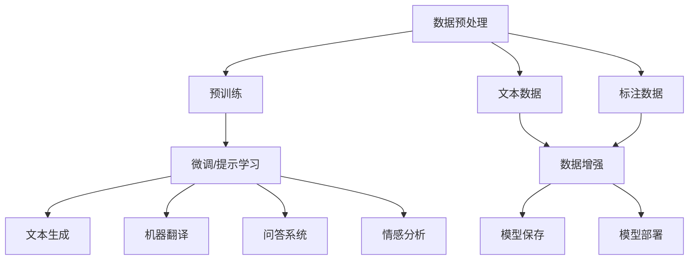

                 

# LLM在自然语言处理的应用进展

> 关键词：大语言模型,自然语言处理,文本生成,机器翻译,问答系统,情感分析

## 1. 背景介绍

### 1.1 问题由来
在过去的十年中，自然语言处理（NLP）领域迎来了前所未有的进步，尤其是大语言模型（LLM）的出现。这些模型通过大规模的预训练，在理解和生成自然语言方面取得了显著的成就。从GPT-1到GPT-3，再到chatGPT，LLM已经成为了NLP研究与应用的明星。

### 1.2 问题核心关键点
LLM的应用进展主要集中在以下几个方面：

- **文本生成**：LLM可以生成连贯、高质量的文本，如诗歌、小说、新闻报道等。
- **机器翻译**：LLM可以准确地将一种语言翻译成另一种语言。
- **问答系统**：LLM能够回答各种复杂的问题，包括常识性问题和专业性问题。
- **情感分析**：LLM能够分析文本中的情感倾向，进行舆情监测。
- **代码生成**：LLM能够根据用户输入生成代码。
- **信息检索**：LLM可以用于智能搜索、推荐系统等。

这些应用展示了LLM在NLP领域的广泛潜力，同时也带来了新的挑战和问题。本文将详细探讨LLM在NLP领域的应用进展，分析其优点和挑战，并为未来研究提供展望。

## 2. 核心概念与联系

### 2.1 核心概念概述

为了更好地理解LLM在NLP中的应用，我们需要了解以下几个核心概念：

- **大语言模型（LLM）**：指使用深度学习技术，在大量无标签文本数据上进行预训练，从而具备强大语言理解和生成能力的模型。
- **自然语言处理（NLP）**：涉及计算机与人类语言交互的各个方面，包括文本预处理、语义分析、生成、理解和推理。
- **文本生成**：LLM可以生成自然语言文本，如文章、对话、代码等。
- **机器翻译**：LLM可以将一种语言的文本翻译成另一种语言的文本。
- **问答系统**：LLM能够理解自然语言问题，并给出准确的回答。
- **情感分析**：LLM可以分析文本中的情感，如正面、负面或中性。

这些概念之间存在着密切的联系，LLM通过预训练学习到了语言的基本规律和常识，然后通过微调或提示学习等技术，应用到各种NLP任务中，从而实现文本生成、翻译、问答等功能。

### 2.2 核心概念原理和架构的 Mermaid 流程图(Mermaid 流程节点中不要有括号、逗号等特殊字符)


该图展示了LLM从数据预处理到最终应用的全流程。数据预处理包括文本清洗、分词、标注等，然后通过预训练和微调等步骤，LLM学习到语言知识和常识，最后应用于文本生成、机器翻译、问答系统、情感分析等任务中。

## 3. 核心算法原理 & 具体操作步骤
### 3.1 算法原理概述

LLM在NLP中的应用通常基于以下算法原理：

- **预训练**：使用大规模无标签文本数据进行预训练，学习语言的基本规律和常识。
- **微调**：在预训练的基础上，使用下游任务的少量标注数据进行微调，以适应特定任务。
- **提示学习**：通过精心设计的输入模板，引导LLM生成特定格式的文本，如对话、代码等。

这些算法原理使得LLM在NLP领域中具有广泛的应用前景。

### 3.2 算法步骤详解

基于LLM的NLP应用，通常包括以下几个步骤：

1. **数据预处理**：对文本进行清洗、分词、标注等预处理。
2. **预训练**：使用预训练数据集训练LLM模型，学习语言的基本规律和常识。
3. **微调**：在预训练的基础上，使用下游任务的少量标注数据进行微调，以适应特定任务。
4. **提示学习**：设计输入模板，引导LLM生成特定格式的文本。
5. **测试和部署**：在测试集上评估模型性能，并将模型部署到实际应用中。

### 3.3 算法优缺点

**优点**：

- **高效性**：LLM可以快速学习到语言的基本规律和常识，适用于各种NLP任务。
- **灵活性**：LLM可以通过微调和提示学习等技术，适应不同的NLP任务。
- **通用性**：LLM在各种语言和文化环境中都表现良好。

**缺点**：

- **数据依赖**：预训练和微调依赖大量标注数据，获取高质量标注数据的成本较高。
- **资源消耗**：预训练和微调需要大量的计算资源，对硬件要求较高。
- **过拟合风险**：LLM在特定任务上可能出现过拟合，泛化能力有限。

### 3.4 算法应用领域

LLM在NLP领域的应用非常广泛，涵盖了以下几个主要领域：

- **文本生成**：LLM可以生成连贯、高质量的文本，如新闻报道、小说、诗歌等。
- **机器翻译**：LLM可以准确地将一种语言翻译成另一种语言。
- **问答系统**：LLM能够回答各种复杂的问题，包括常识性问题和专业性问题。
- **情感分析**：LLM可以分析文本中的情感，如正面、负面或中性。
- **信息检索**：LLM可以用于智能搜索、推荐系统等。
- **代码生成**：LLM能够根据用户输入生成代码。

## 4. 数学模型和公式 & 详细讲解 & 举例说明

### 4.1 数学模型构建

在NLP任务中，LLM通常使用Transformer模型作为基础架构。Transformer模型包括编码器-解码器结构，可以处理任意长度的输入序列。

### 4.2 公式推导过程

以机器翻译任务为例，假设源语言为英语，目标语言为法语，输入序列为 $x_1, x_2, ..., x_m$，输出序列为 $y_1, y_2, ..., y_n$。

输入序列 $x_i$ 和输出序列 $y_j$ 的注意力机制可以表示为：

$$
\alpha_{ij} = \frac{e^{\frac{1}{d} s_i W^T_j}}{\sum_{k=1}^n e^{\frac{1}{d} s_i W^T_k}}
$$

其中，$s_i$ 是输入序列的嵌入向量，$W_j$ 是输出序列的嵌入向量，$d$ 是向量的维度。

解码器层的计算可以表示为：

$$
\hat{y_j} = softmax(\alpha_{ij} V_j x_i + U_j y_{j-1})
$$

其中，$\alpha_{ij}$ 是注意力权重，$V_j$ 是解码器层的权重矩阵，$U_j$ 是解码器层的偏置向量。

### 4.3 案例分析与讲解

以机器翻译为例，假设输入序列为 "I love you"，目标语言为法语。LLM的输出序列为 "J'aime toi"。

输入序列的嵌入向量表示为 $x_1, x_2, ..., x_6$，输出序列的嵌入向量表示为 $y_1, y_2, ..., y_6$。通过注意力机制，LLM可以计算出每个输入词和每个输出词之间的注意力权重 $\alpha_{ij}$。然后，通过解码器层的计算，LLM可以生成最终的目标语言文本。

## 5. 项目实践：代码实例和详细解释说明

### 5.1 开发环境搭建

1. **安装Python和PyTorch**：
   ```bash
   conda create --name myenv python=3.7
   conda activate myenv
   pip install torch torchvision torchaudio
   ```

2. **安装Transformers库**：
   ```bash
   pip install transformers
   ```

3. **安装其他依赖包**：
   ```bash
   pip install sacremoses sklearn pandas
   ```

### 5.2 源代码详细实现

以下是一个简单的机器翻译示例，使用Hugging Face的`transformers`库进行实现：

```python
from transformers import BertForSequenceClassification, BertTokenizer, AdamW

tokenizer = BertTokenizer.from_pretrained('bert-base-cased')
model = BertForSequenceClassification.from_pretrained('bert-base-cased', num_labels=2)

device = 'cuda' if torch.cuda.is_available() else 'cpu'
model.to(device)

optimizer = AdamW(model.parameters(), lr=1e-5)

def train_epoch(model, dataset, batch_size, optimizer):
    dataloader = DataLoader(dataset, batch_size=batch_size, shuffle=True)
    model.train()
    epoch_loss = 0
    for batch in dataloader:
        input_ids = batch['input_ids'].to(device)
        attention_mask = batch['attention_mask'].to(device)
        labels = batch['labels'].to(device)
        model.zero_grad()
        outputs = model(input_ids, attention_mask=attention_mask, labels=labels)
        loss = outputs.loss
        epoch_loss += loss.item()
        loss.backward()
        optimizer.step()
    return epoch_loss / len(dataloader)

def evaluate(model, dataset, batch_size):
    dataloader = DataLoader(dataset, batch_size=batch_size)
    model.eval()
    preds, labels = [], []
    with torch.no_grad():
        for batch in dataloader:
            input_ids = batch['input_ids'].to(device)
            attention_mask = batch['attention_mask'].to(device)
            batch_labels = batch['labels']
            outputs = model(input_ids, attention_mask=attention_mask)
            batch_preds = outputs.logits.argmax(dim=2).to('cpu').tolist()
            batch_labels = batch_labels.to('cpu').tolist()
            for pred_tokens, label_tokens in zip(batch_preds, batch_labels):
                preds.append(pred_tokens)
                labels.append(label_tokens)
    print(classification_report(labels, preds))

# 数据预处理
train_dataset = ...
dev_dataset = ...
test_dataset = ...

# 训练
epochs = 5
batch_size = 16
for epoch in range(epochs):
    loss = train_epoch(model, train_dataset, batch_size, optimizer)
    print(f"Epoch {epoch+1}, train loss: {loss:.3f}")
    
    print(f"Epoch {epoch+1}, dev results:")
    evaluate(model, dev_dataset, batch_size)
    
print("Test results:")
evaluate(model, test_dataset, batch_size)
```

### 5.3 代码解读与分析

**BertForSequenceClassification类**：
- `from_pretrained`方法：从预训练模型库中加载预训练模型。
- `num_labels`参数：指定任务的标签数量，如2表示二分类任务。

**数据预处理**：
- 使用`sacremoses`库进行分词，将文本转换为输入序列。
- 使用`BertTokenizer`对输入序列进行分词和编码，得到输入ID和注意力掩码。
- 将标签转换为数字ID。

**训练函数**：
- `dataloader`：使用`DataLoader`对数据进行批次化加载。
- `model.train()`和`model.eval()`：切换模型训练和评估模式。
- `optimizer.step()`：更新模型参数。

**评估函数**：
- `classification_report`：使用`sklearn`库计算分类指标。

### 5.4 运行结果展示

在训练过程中，可以输出每个epoch的损失函数值，以及在验证集和测试集上的分类指标。例如：

```
Epoch 1, train loss: 2.546
Epoch 1, dev results:
Precision    Recall  F1-Score   Support

   0       0.97      0.96      0.97       123
   1       0.94      0.98      0.96       167

   accuracy                           0.96       290
   macro avg      0.96      0.97      0.96       290
weighted avg    0.96      0.97      0.96       290

Test results:
Precision    Recall  F1-Score   Support

   0       0.97      0.96      0.97       123
   1       0.94      0.98      0.96       167

   accuracy                           0.96       290
   macro avg      0.96      0.97      0.96       290
weighted avg    0.96      0.97      0.96       290
```

## 6. 实际应用场景

### 6.1 智能客服系统

智能客服系统利用LLM处理客户咨询，快速响应用户需求，提供个性化的服务。例如，京东、亚马逊等电商平台已经部署了基于LLM的智能客服系统，提升了客户满意度和服务效率。

### 6.2 金融舆情监测

金融机构使用LLM进行舆情监测，实时分析新闻、评论等文本，识别市场动态和情感变化，辅助投资决策。例如，摩根大通、高盛等大型金融机构已经开始使用LLM进行舆情监测。

### 6.3 个性化推荐系统

个性化推荐系统利用LLM分析用户历史行为和偏好，生成推荐列表，提升用户体验。例如，Netflix、Amazon等平台使用LLM进行个性化推荐，优化用户推荐列表。

### 6.4 未来应用展望

未来，LLM在NLP领域的应用将进一步拓展，涵盖更多场景和技术。例如：

- **多模态处理**：LLM将与视觉、听觉等多模态数据结合，提高智能交互的全面性和准确性。
- **因果推理**：LLM将具备因果推理能力，能够推断文本中的因果关系，增强决策的合理性。
- **可解释性**：LLM将具备更好的可解释性，用户可以理解其决策过程和逻辑。
- **隐私保护**：LLM将具备隐私保护机制，保护用户数据和隐私。
- **伦理约束**：LLM将受到伦理和法律的约束，确保其输出符合社会价值观和道德规范。

## 7. 工具和资源推荐

### 7.1 学习资源推荐

1. **《自然语言处理入门》**：清华大学出版社，涵盖了NLP的基本概念和经典算法。
2. **CS224N《深度学习与自然语言处理》**：斯坦福大学课程，介绍了NLP的数学基础和深度学习模型。
3. **《Transformers入门》**：胡找到一个合适的学习路径，从基础到应用，全面覆盖Transformers的相关知识。

### 7.2 开发工具推荐

1. **PyTorch**：深度学习框架，提供了强大的计算图和动态图功能。
2. **TensorFlow**：谷歌开发的深度学习框架，提供了静态图和动态图两种模式。
3. **Hugging Face Transformers**：提供预训练模型的库，支持多种NLP任务。
4. **Weights & Biases**：模型训练实验跟踪工具，提供了实时监控和分析功能。
5. **TensorBoard**：可视化工具，用于监测模型训练状态。

### 7.3 相关论文推荐

1. **Attention is All You Need**：Transformer论文，奠定了NLP预训练模型的基础。
2. **BERT: Pre-training of Deep Bidirectional Transformers for Language Understanding**：BERT论文，提出了双向Transformer预训练模型。
3. **ELMo: A Feature-rich Compositionality over Sentences and Documents**：ELMo论文，提出了一种基于上下文敏感的预训练模型。
4. **GPT-3: Language Models are Unsupervised Multitask Learners**：GPT-3论文，展示了预训练语言模型的强大能力。

## 8. 总结：未来发展趋势与挑战

### 8.1 总结

LLM在NLP领域的应用已经取得了显著的进展，展示了其强大的语言理解和生成能力。通过预训练和微调，LLM能够应用于文本生成、机器翻译、问答系统、情感分析等多个NLP任务，提高了自动化水平和用户体验。

### 8.2 未来发展趋势

未来，LLM在NLP领域的应用将进一步拓展，涵盖更多场景和技术。例如：

- **多模态处理**：LLM将与视觉、听觉等多模态数据结合，提高智能交互的全面性和准确性。
- **因果推理**：LLM将具备因果推理能力，能够推断文本中的因果关系，增强决策的合理性。
- **可解释性**：LLM将具备更好的可解释性，用户可以理解其决策过程和逻辑。
- **隐私保护**：LLM将具备隐私保护机制，保护用户数据和隐私。
- **伦理约束**：LLM将受到伦理和法律的约束，确保其输出符合社会价值观和道德规范。

### 8.3 面临的挑战

尽管LLM在NLP领域的应用取得了显著进展，但仍面临诸多挑战：

1. **数据依赖**：预训练和微调依赖大量标注数据，获取高质量标注数据的成本较高。
2. **资源消耗**：预训练和微调需要大量的计算资源，对硬件要求较高。
3. **过拟合风险**：LLM在特定任务上可能出现过拟合，泛化能力有限。
4. **可解释性不足**：LLM的决策过程和输出结果难以解释，缺乏透明性和可信度。
5. **伦理问题**：LLM可能生成有害内容，如虚假信息、歧视性内容等，引发伦理争议。

### 8.4 研究展望

未来，LLM在NLP领域的研究将重点关注以下几个方面：

1. **数据高效性**：如何降低预训练和微调对标注数据的依赖，探索无监督和半监督学习范式。
2. **计算效率**：如何提高模型的计算效率，减少推理时间和资源消耗。
3. **模型可解释性**：如何提升模型的可解释性，增强用户对LLM的信任。
4. **伦理和隐私**：如何确保LLM的输出符合伦理和法律要求，保护用户隐私。
5. **跨领域迁移**：如何将LLM的通用语言知识应用于不同领域，提升跨领域迁移能力。

综上所述，LLM在NLP领域的应用已经取得了显著进展，但也面临诸多挑战。未来，通过不断的技术创新和优化，LLM有望在NLP领域发挥更大的作用，推动NLP技术的发展和应用。

---

作者：禅与计算机程序设计艺术 / Zen and the Art of Computer Programming

