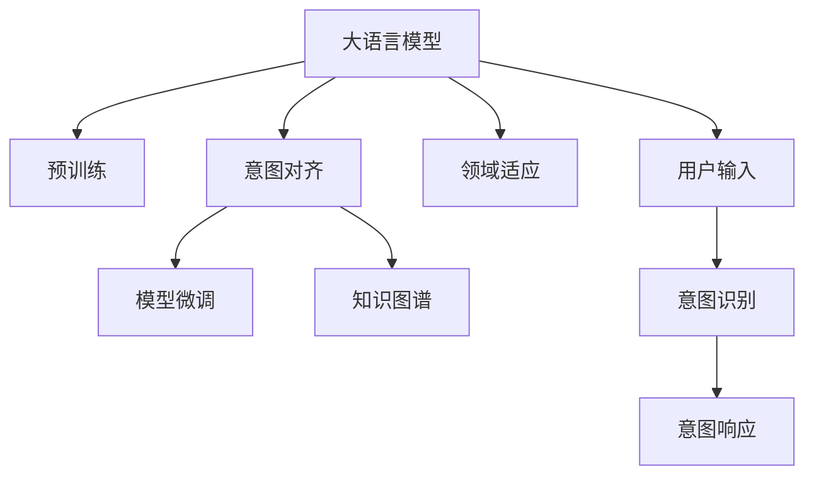

                 

# LLM意图对齐:实现人机协作的基础

> 关键词：大语言模型,意图对齐,人机协作,模型适配,深度学习,自然语言处理(NLP)

## 1. 背景介绍

### 1.1 问题由来

随着大语言模型(LLMs)如GPT、BERT等在自然语言处理(NLP)领域的崛起，其在信息检索、对话系统、翻译等众多任务上展示了强大能力。然而，LLMs往往缺乏对任务意图的准确把握，难以有效协调与用户的互动。例如，一个用户在询问“如何前往最近的图书馆”时，LLMs可能无法准确识别其查询目的，给出不相关或不完整的回答。意图对齐因此成为了人机协作中不可或缺的一环，其核心在于让LLMs理解并响应用户真正所需。

### 1.2 问题核心关键点

意图对齐技术的目的在于确保LLMs能够理解并响应用户的真正需求，即在对话、问答等交互场景中准确识别用户意图，并提供相应的回答或行动。其核心在于如何将通用大模型的广泛知识与特定任务需求有效结合，并根据用户的输入不断优化模型，实现人机协作的精准匹配。

当前，意图对齐主要通过以下几种方式实现：
1. 上下文理解：利用用户输入中的上下文信息，识别意图。
2. 领域适应：将预训练模型适应到特定领域，提升在特定场景下的性能。
3. 模型微调：通过少量标注数据微调模型，使其更好地服务于特定任务。
4. 知识图谱：结合知识图谱等外部知识源，丰富模型的知识库，提升推理能力。

### 1.3 问题研究意义

意图对齐技术对于提升人机协作的精准度、响应速度和用户体验具有重要意义：

1. 提升用户满意度：准确理解用户意图，减少误解和不必要的交互，提升用户体验。
2. 提高工作效率：自动化的意图识别可以减少人工干预，提高工作效率。
3. 促进创新应用：意图对齐使得LLMs能够支持更多创新的应用场景，如智能客服、个性化推荐、智能家居等。
4. 强化数据利用：通过意图对齐技术，最大化利用用户输入数据，挖掘更多有价值的信息。

意图对齐技术的不断发展，将推动NLP技术在更多实际场景中的落地应用，加速人工智能技术向人机协作领域的演进。

## 2. 核心概念与联系

### 2.1 核心概念概述

为了更好地理解意图对齐技术的核心思想和应用流程，本节将介绍几个关键概念：

- **大语言模型(LLM)**：指基于Transformer架构，在自监督学习任务如语言建模、掩码语言建模等上预训练的大型神经网络模型，具备强大的语言理解和生成能力。
- **意图对齐**：指通过理解用户输入的语义信息，将LLM的通用知识与特定任务需求相匹配，从而实现精准的意图识别和响应。
- **领域适应**：指将通用预训练模型通过特定领域的少量标注数据进行微调，提升在特定领域的应用效果。
- **知识图谱**：指结构化的知识库，用于存储实体、关系、属性等信息，辅助LLM进行推理和知识抽取。
- **模型微调**：指在特定任务的少量标注数据上，对预训练模型进行有监督的学习，优化模型参数，提升任务性能。

这些概念之间的联系可以通过以下Mermaid流程图展示：



此流程图展示了意图对齐的核心流程，其中：

1. 大语言模型通过预训练获得广泛的语言知识和表示能力。
2. 意图对齐技术通过理解用户输入，将通用知识与特定任务需求匹配，实现精准意图识别。
3. 领域适应和模型微调进一步优化模型，提升特定任务的效果。
4. 知识图谱丰富模型的知识库，增强推理能力。

### 2.2 核心概念原理和架构

意图对齐技术通常基于以下几个原理：

- **上下文理解**：通过分析用户输入的上下文信息，识别出意图。上下文可以包括用户输入的词汇、短语、句子等。
- **意图分类**：将用户输入映射到预定义的意图类别，如查询、指令、反馈等。
- **实体识别**：识别用户输入中提到的实体，如人名、地点、时间等，辅助意图识别。
- **响应生成**：根据识别出的意图，生成相应的回答或行动。

意图对齐的架构一般包括输入处理、意图识别、响应生成三部分，如下：

```
用户输入 -> 输入处理 -> 意图识别 -> 响应生成
```

- **输入处理**：包括分词、词性标注、句法分析等，将自然语言转化为计算机可处理的形式。
- **意图识别**：通过模型预测用户输入的意图类别。常见的方法包括基于规则的、统计学习的方法，以及最新的深度学习方法。
- **响应生成**：根据意图生成相应的回答或行动，可以是简单的文本回答，也可以是复杂的自然语言生成任务。

## 3. 核心算法原理 & 具体操作步骤

### 3.1 算法原理概述

意图对齐的本质在于将大语言模型的通用知识与特定任务需求相结合，使其在特定场景下精准响应用户需求。其核心思想可以概括为以下几点：

1. **上下文理解**：利用用户输入的上下文信息，识别意图。
2. **意图分类**：将用户意图映射到预定义的类别，如查询、指令、反馈等。
3. **实体识别**：识别并提取用户输入中的实体信息。
4. **响应生成**：根据意图和实体信息，生成相应的回答或行动。

### 3.2 算法步骤详解

#### 3.2.1 输入处理

输入处理是意图对齐的首要步骤，其目标是将自然语言输入转化为计算机可处理的形式。常用的处理方法包括：

- **分词**：将句子分割成单词或短语，以便后续处理。
- **词性标注**：标记每个单词的词性，如名词、动词、形容词等。
- **句法分析**：分析句子的结构和语法，如主谓宾关系等。
- **命名实体识别**：识别并标记出人名、地名、组织机构名等实体。

#### 3.2.2 意图分类

意图分类是通过模型对用户输入进行分类，识别出其背后的意图。常见的意图分类方法包括：

- **基于规则的方法**：通过编写规则匹配用户输入，识别出意图。
- **基于统计的方法**：利用训练好的分类模型，根据用户输入预测意图。
- **基于深度学习的方法**：利用深度神经网络，在大量标注数据上进行训练，识别用户意图。

#### 3.2.3 实体识别

实体识别旨在从用户输入中提取出有意义的实体信息，如人名、地点、时间等。常见的实体识别方法包括：

- **基于规则的方法**：通过编写规则匹配用户输入中的实体。
- **基于统计的方法**：利用标注数据训练的实体识别模型，识别出实体信息。
- **基于深度学习的方法**：利用深度神经网络，在大量标注数据上进行训练，识别并标记实体。

#### 3.2.4 响应生成

响应生成是指根据用户输入的意图和实体信息，生成相应的回答或行动。常见的响应生成方法包括：

- **模板匹配**：根据预先定义的模板，填充实体信息，生成回答。
- **基于规则的方法**：根据规则生成回答。
- **基于深度学习的方法**：利用深度神经网络，生成自然语言回答。

### 3.3 算法优缺点

意图对齐技术具有以下优点：

1. **精准识别**：通过上下文理解和意图分类，能够精准识别用户意图，避免误解。
2. **高效响应**：利用深度学习模型，能够快速处理大量用户输入，提升响应速度。
3. **灵活扩展**：通过模型微调和领域适应，可以适应不同任务和领域的需求。

同时，也存在一些缺点：

1. **数据依赖**：需要大量标注数据进行训练，标注成本较高。
2. **模型复杂度**：深度学习模型复杂度较高，训练和推理速度较慢。
3. **泛化能力**：在特定领域或特定类型任务上，可能存在泛化能力不足的问题。

### 3.4 算法应用领域

意图对齐技术可以广泛应用于以下领域：

- **智能客服**：通过意图对齐技术，智能客服能够准确理解用户需求，提供快速、准确的回复。
- **对话系统**：在对话系统中，意图对齐技术能够帮助系统理解用户意图，生成连贯的对话内容。
- **推荐系统**：通过意图对齐，推荐系统能够理解用户偏好，提供个性化的推荐。
- **医疗咨询**：在医疗咨询应用中，意图对齐技术能够帮助系统理解患者需求，提供专业的医疗建议。
- **教育培训**：在教育培训中，意图对齐技术能够帮助系统理解学生需求，提供个性化的教学内容。

## 4. 数学模型和公式 & 详细讲解 & 举例说明

### 4.1 数学模型构建

意图对齐技术的数学模型可以构建为以下形式：

设用户输入为 $X$，模型预测意图为 $Y$，响应为 $A$。则意图对齐模型可以表示为：

$$
Y = f(X; \theta)
$$

其中 $f$ 为意图分类模型，$\theta$ 为模型参数。

### 4.2 公式推导过程

以基于深度学习的意图分类模型为例，公式推导过程如下：

设用户输入 $X$ 经过预处理后的向量表示为 $\vec{x}$，模型的参数为 $\theta$，则意图分类模型的输出概率为：

$$
P(Y|X) = softmax(W \vec{x} + b)
$$

其中 $W$ 和 $b$ 为模型的权重和偏置。通过最大化似然函数，进行训练：

$$
\max_{\theta} \sum_{i=1}^N \log P(Y_i|X_i)
$$

### 4.3 案例分析与讲解

以一个简单的例子来说明意图对齐的流程：

假设用户输入为“请推荐一家附近的餐厅”，意图分类模型预测出意图为“查询”，实体识别模型识别出“餐厅”这一实体。基于此，生成回答：“您好，您需要找到附近的餐厅吗？这里有一些推荐：XX餐厅、YY餐厅和ZZ餐厅。您需要了解更多信息吗？”

## 5. 项目实践：代码实例和详细解释说明

### 5.1 开发环境搭建

在进行意图对齐实践前，我们需要准备好开发环境。以下是使用Python进行PyTorch开发的环境配置流程：

1. 安装Anaconda：从官网下载并安装Anaconda，用于创建独立的Python环境。

2. 创建并激活虚拟环境：
```bash
conda create -n intentalignment python=3.8 
conda activate intentalignment
```

3. 安装PyTorch：根据CUDA版本，从官网获取对应的安装命令。例如：
```bash
conda install pytorch torchvision torchaudio cudatoolkit=11.1 -c pytorch -c conda-forge
```

4. 安装Transformers库：
```bash
pip install transformers
```

5. 安装各类工具包：
```bash
pip install numpy pandas scikit-learn matplotlib tqdm jupyter notebook ipython
```

完成上述步骤后，即可在`intentalignment`环境中开始意图对齐实践。

### 5.2 源代码详细实现

这里我们以命名实体识别(NER)任务为例，给出使用Transformers库对BERT模型进行意图分类和实体识别的PyTorch代码实现。

首先，定义NER任务的数据处理函数：

```python
from transformers import BertTokenizer
from torch.utils.data import Dataset
import torch

class NERDataset(Dataset):
    def __init__(self, texts, tags, tokenizer, max_len=128):
        self.texts = texts
        self.tags = tags
        self.tokenizer = tokenizer
        self.max_len = max_len
        
    def __len__(self):
        return len(self.texts)
    
    def __getitem__(self, item):
        text = self.texts[item]
        tags = self.tags[item]
        
        encoding = self.tokenizer(text, return_tensors='pt', max_length=self.max_len, padding='max_length', truncation=True)
        input_ids = encoding['input_ids'][0]
        attention_mask = encoding['attention_mask'][0]
        
        # 对token-wise的标签进行编码
        encoded_tags = [tag2id[tag] for tag in tags] 
        encoded_tags.extend([tag2id['O']] * (self.max_len - len(encoded_tags)))
        labels = torch.tensor(encoded_tags, dtype=torch.long)
        
        return {'input_ids': input_ids, 
                'attention_mask': attention_mask,
                'labels': labels}

# 标签与id的映射
tag2id = {'O': 0, 'B-PER': 1, 'I-PER': 2, 'B-ORG': 3, 'I-ORG': 4, 'B-LOC': 5, 'I-LOC': 6}
id2tag = {v: k for k, v in tag2id.items()}

# 创建dataset
tokenizer = BertTokenizer.from_pretrained('bert-base-cased')

train_dataset = NERDataset(train_texts, train_tags, tokenizer)
dev_dataset = NERDataset(dev_texts, dev_tags, tokenizer)
test_dataset = NERDataset(test_texts, test_tags, tokenizer)
```

然后，定义模型和优化器：

```python
from transformers import BertForTokenClassification, AdamW

model = BertForTokenClassification.from_pretrained('bert-base-cased', num_labels=len(tag2id))

optimizer = AdamW(model.parameters(), lr=2e-5)
```

接着，定义训练和评估函数：

```python
from torch.utils.data import DataLoader
from tqdm import tqdm
from sklearn.metrics import classification_report

device = torch.device('cuda') if torch.cuda.is_available() else torch.device('cpu')
model.to(device)

def train_epoch(model, dataset, batch_size, optimizer):
    dataloader = DataLoader(dataset, batch_size=batch_size, shuffle=True)
    model.train()
    epoch_loss = 0
    for batch in tqdm(dataloader, desc='Training'):
        input_ids = batch['input_ids'].to(device)
        attention_mask = batch['attention_mask'].to(device)
        labels = batch['labels'].to(device)
        model.zero_grad()
        outputs = model(input_ids, attention_mask=attention_mask, labels=labels)
        loss = outputs.loss
        epoch_loss += loss.item()
        loss.backward()
        optimizer.step()
    return epoch_loss / len(dataloader)

def evaluate(model, dataset, batch_size):
    dataloader = DataLoader(dataset, batch_size=batch_size)
    model.eval()
    preds, labels = [], []
    with torch.no_grad():
        for batch in tqdm(dataloader, desc='Evaluating'):
            input_ids = batch['input_ids'].to(device)
            attention_mask = batch['attention_mask'].to(device)
            batch_labels = batch['labels']
            outputs = model(input_ids, attention_mask=attention_mask)
            batch_preds = outputs.logits.argmax(dim=2).to('cpu').tolist()
            batch_labels = batch_labels.to('cpu').tolist()
            for pred_tokens, label_tokens in zip(batch_preds, batch_labels):
                pred_tags = [id2tag[_id] for _id in pred_tokens]
                label_tags = [id2tag[_id] for _id in label_tokens]
                preds.append(pred_tags[:len(label_tags)])
                labels.append(label_tags)
                
    print(classification_report(labels, preds))
```

最后，启动训练流程并在测试集上评估：

```python
epochs = 5
batch_size = 16

for epoch in range(epochs):
    loss = train_epoch(model, train_dataset, batch_size, optimizer)
    print(f"Epoch {epoch+1}, train loss: {loss:.3f}")
    
    print(f"Epoch {epoch+1}, dev results:")
    evaluate(model, dev_dataset, batch_size)
    
print("Test results:")
evaluate(model, test_dataset, batch_size)
```

以上就是使用PyTorch对BERT进行命名实体识别任务意图分类的完整代码实现。可以看到，得益于Transformers库的强大封装，我们可以用相对简洁的代码完成BERT模型的加载和微调。

### 5.3 代码解读与分析

让我们再详细解读一下关键代码的实现细节：

**NERDataset类**：
- `__init__`方法：初始化文本、标签、分词器等关键组件。
- `__len__`方法：返回数据集的样本数量。
- `__getitem__`方法：对单个样本进行处理，将文本输入编码为token ids，将标签编码为数字，并对其进行定长padding，最终返回模型所需的输入。

**tag2id和id2tag字典**：
- 定义了标签与数字id之间的映射关系，用于将token-wise的预测结果解码回真实的标签。

**训练和评估函数**：
- 使用PyTorch的DataLoader对数据集进行批次化加载，供模型训练和推理使用。
- 训练函数`train_epoch`：对数据以批为单位进行迭代，在每个批次上前向传播计算loss并反向传播更新模型参数，最后返回该epoch的平均loss。
- 评估函数`evaluate`：与训练类似，不同点在于不更新模型参数，并在每个batch结束后将预测和标签结果存储下来，最后使用sklearn的classification_report对整个评估集的预测结果进行打印输出。

**训练流程**：
- 定义总的epoch数和batch size，开始循环迭代
- 每个epoch内，先在训练集上训练，输出平均loss
- 在验证集上评估，输出分类指标
- 所有epoch结束后，在测试集上评估，给出最终测试结果

可以看到，PyTorch配合Transformers库使得BERT意图分类的代码实现变得简洁高效。开发者可以将更多精力放在数据处理、模型改进等高层逻辑上，而不必过多关注底层的实现细节。

当然，工业级的系统实现还需考虑更多因素，如模型的保存和部署、超参数的自动搜索、更灵活的任务适配层等。但核心的意图对齐范式基本与此类似。

## 6. 实际应用场景
### 6.1 智能客服系统

基于意图对齐技术的智能客服系统能够准确理解用户需求，提供快速、准确的回复，提升用户满意度。具体实现如下：

1. 收集用户的历史咨询记录，标注用户的意图和实体信息。
2. 利用BERT模型进行意图分类和实体识别。
3. 根据用户意图生成回复，并在回复中提及提到的实体。
4. 持续收集用户反馈，优化意图分类模型和实体识别模型。

### 6.2 对话系统

在对话系统中，意图对齐技术能够帮助系统理解用户意图，生成连贯的对话内容，提升用户体验。具体实现如下：

1. 在对话历史中提取上下文信息。
2. 利用BERT模型进行意图分类和实体识别。
3. 根据用户意图生成回复，并在回复中提及提到的实体。
4. 持续收集对话数据，优化意图分类模型和实体识别模型。

### 6.3 推荐系统

在推荐系统中，意图对齐技术能够理解用户偏好，提供个性化的推荐。具体实现如下：

1. 收集用户的历史行为数据，标注用户的意图和实体信息。
2. 利用BERT模型进行意图分类和实体识别。
3. 根据用户意图推荐相关物品，并在推荐中提及提到的实体。
4. 持续收集用户反馈，优化意图分类模型和实体识别模型。

### 6.4 未来应用展望

随着意图对齐技术的发展，未来将在更多领域得到应用，为各行各业带来变革性影响。

在智慧医疗领域，意图对齐技术能够帮助医疗咨询系统理解患者需求，提供专业的医疗建议。在金融领域，意图对齐技术能够帮助金融客服系统理解用户意图，提供精准的金融服务。在教育领域，意图对齐技术能够帮助教育系统理解学生需求，提供个性化的教学内容。在智能家居领域，意图对齐技术能够帮助智能家居系统理解用户指令，提供智能化的家居服务。

## 7. 工具和资源推荐
### 7.1 学习资源推荐

为了帮助开发者系统掌握意图对齐技术的理论基础和实践技巧，这里推荐一些优质的学习资源：

1. 《自然语言处理入门：Transformer和语言模型》系列博文：由大模型技术专家撰写，深入浅出地介绍了Transformer原理、BERT模型、意图对齐技术等前沿话题。

2. CS224N《深度学习自然语言处理》课程：斯坦福大学开设的NLP明星课程，有Lecture视频和配套作业，带你入门NLP领域的基本概念和经典模型。

3. 《自然语言处理与深度学习》书籍：深度学习权威书籍，全面介绍了NLP的基本概念、经典模型和前沿技术，包括意图对齐在内的诸多研究方向。

4. HuggingFace官方文档：Transformers库的官方文档，提供了海量预训练模型和完整的意图对齐样例代码，是上手实践的必备资料。

5. CLUE开源项目：中文语言理解测评基准，涵盖大量不同类型的中文NLP数据集，并提供了基于意图对齐的baseline模型，助力中文NLP技术发展。

通过对这些资源的学习实践，相信你一定能够快速掌握意图对齐技术的精髓，并用于解决实际的NLP问题。

### 7.2 开发工具推荐

高效的开发离不开优秀的工具支持。以下是几款用于意图对齐开发的常用工具：

1. PyTorch：基于Python的开源深度学习框架，灵活动态的计算图，适合快速迭代研究。大部分预训练语言模型都有PyTorch版本的实现。

2. TensorFlow：由Google主导开发的开源深度学习框架，生产部署方便，适合大规模工程应用。同样有丰富的预训练语言模型资源。

3. Transformers库：HuggingFace开发的NLP工具库，集成了众多SOTA语言模型，支持PyTorch和TensorFlow，是进行意图对齐任务开发的利器。

4. Weights & Biases：模型训练的实验跟踪工具，可以记录和可视化模型训练过程中的各项指标，方便对比和调优。与主流深度学习框架无缝集成。

5. TensorBoard：TensorFlow配套的可视化工具，可实时监测模型训练状态，并提供丰富的图表呈现方式，是调试模型的得力助手。

6. Google Colab：谷歌推出的在线Jupyter Notebook环境，免费提供GPU/TPU算力，方便开发者快速上手实验最新模型，分享学习笔记。

合理利用这些工具，可以显著提升意图对齐任务的开发效率，加快创新迭代的步伐。

### 7.3 相关论文推荐

意图对齐技术的发展源于学界的持续研究。以下是几篇奠基性的相关论文，推荐阅读：

1. Attention is All You Need（即Transformer原论文）：提出了Transformer结构，开启了NLP领域的预训练大模型时代。

2. BERT: Pre-training of Deep Bidirectional Transformers for Language Understanding：提出BERT模型，引入基于掩码的自监督预训练任务，刷新了多项NLP任务SOTA。

3. Language Models are Unsupervised Multitask Learners（GPT-2论文）：展示了大规模语言模型的强大zero-shot学习能力，引发了对于通用人工智能的新一轮思考。

4. Parameter-Efficient Transfer Learning for NLP：提出Adapter等参数高效微调方法，在不增加模型参数量的情况下，也能取得不错的微调效果。

5. Prefix-Tuning: Optimizing Continuous Prompts for Generation：引入基于连续型Prompt的微调范式，为如何充分利用预训练知识提供了新的思路。

6. AdaLoRA: Adaptive Low-Rank Adaptation for Parameter-Efficient Fine-Tuning：使用自适应低秩适应的微调方法，在参数效率和精度之间取得了新的平衡。

这些论文代表了大语言模型意图对齐技术的发展脉络。通过学习这些前沿成果，可以帮助研究者把握学科前进方向，激发更多的创新灵感。

## 8. 总结：未来发展趋势与挑战

### 8.1 总结

本文对基于深度学习的意图对齐技术进行了全面系统的介绍。首先阐述了意图对齐技术的背景和意义，明确了意图对齐在提升人机协作精准度方面的重要价值。其次，从原理到实践，详细讲解了意图对齐的数学模型和操作步骤，给出了意图对齐任务开发的完整代码实例。同时，本文还广泛探讨了意图对齐技术在多个实际场景中的应用前景，展示了其巨大的应用潜力。此外，本文精选了意图对齐技术的各类学习资源，力求为读者提供全方位的技术指引。

通过本文的系统梳理，可以看到，基于深度学习的意图对齐技术已经成为NLP领域的重要范式，极大地提升了人机协作的精准度和效率。未来，伴随深度学习技术的发展，意图对齐技术必将在更多应用场景中得到广泛应用，推动人工智能技术向人机协作领域的演进。

### 8.2 未来发展趋势

展望未来，意图对齐技术将呈现以下几个发展趋势：

1. 模型规模持续增大。随着算力成本的下降和数据规模的扩张，预训练语言模型的参数量还将持续增长。超大模型的广泛应用，将进一步提升意图对齐的精准度。

2. 意图识别技术不断进步。通过引入更多的上下文信息，利用多模态数据，意图识别技术将不断提升其精准度。

3. 跨领域迁移能力增强。通过领域适应和迁移学习，意图对齐技术将能够更好地适应不同领域的需求。

4. 知识图谱融合提升。结合知识图谱，意图对齐技术将能够利用外部知识库，提升推理能力和知识整合能力。

5. 智能对话系统普及。意图对齐技术将推动智能对话系统在更多应用场景中的普及，提升用户体验和系统智能化水平。

6. 自动化程度提高。自动化意图识别和响应生成技术的发展，将显著提升意图对齐技术的实用性和推广价值。

以上趋势凸显了意图对齐技术的广阔前景。这些方向的探索发展，必将进一步提升意图对齐技术的精准度和应用范围，推动NLP技术向人机协作领域的深入应用。

### 8.3 面临的挑战

尽管意图对齐技术已经取得了瞩目成就，但在迈向更加智能化、普适化应用的过程中，它仍面临着诸多挑战：

1. 数据依赖问题。意图对齐技术需要大量标注数据进行训练，标注成本较高，且标注数据质量对模型性能影响较大。

2. 模型泛化能力不足。在特定领域或特定任务上，意图对齐模型的泛化能力可能不足，难以适应复杂多变的场景。

3. 对抗攻击风险。意图对齐模型可能受到对抗样本攻击，导致意图识别错误，产生误导性回复。

4. 模型可解释性不足。意图对齐模型通常是一个"黑盒"系统，难以解释其内部工作机制和决策逻辑，这对于高风险应用领域尤为重要。

5. 系统鲁棒性不足。意图对齐模型可能对输入噪声、拼写错误等不鲁棒，影响系统稳定性。

6. 跨领域迁移难度大。不同领域的意图对齐模型难以进行有效迁移，需要针对每个领域单独训练和优化。

正视意图对齐面临的这些挑战，积极应对并寻求突破，将是大语言模型意图对齐技术走向成熟的必由之路。相信随着学界和产业界的共同努力，这些挑战终将一一被克服，意图对齐技术必将在构建智能人机交互系统中扮演越来越重要的角色。

### 8.4 研究展望

面向未来，意图对齐技术需要在以下几个方向进行深入研究：

1. 无监督意图对齐方法。探索利用非结构化数据，如文本、语音、图像等，实现无监督意图对齐，降低标注数据需求。

2. 多模态意图对齐方法。结合文本、语音、图像等多种模态数据，提升意图识别的精准度和鲁棒性。

3. 跨领域意图对齐方法。探索跨领域意图对齐技术，提升模型在不同领域间的迁移能力。

4. 自动化意图生成方法。探索自动化的意图生成方法，提升系统的自动化程度和灵活性。

5. 知识图谱融合方法。探索知识图谱与意图对齐技术的融合方法，提升系统的知识整合能力和推理能力。

6. 意图对齐系统的鲁棒性。探索提升意图对齐系统鲁棒性的方法，应对各种输入噪声和对抗攻击。

7. 意图对齐的可解释性。探索提升意图对齐系统可解释性的方法，增强系统的透明性和可信任度。

这些研究方向将进一步拓展意图对齐技术的边界，推动其向更高层次的智能化、普适化发展。

## 9. 附录：常见问题与解答

**Q1：意图对齐是否适用于所有NLP任务？**

A: 意图对齐技术在大多数NLP任务上都能取得不错的效果，特别是对于对话系统、推荐系统等依赖上下文的任务。但对于一些特定领域的任务，如医学、法律等，仅仅依靠通用语料预训练的模型可能难以很好地适应。此时需要在特定领域语料上进一步预训练，再进行意图对齐，才能获得理想效果。

**Q2：意图对齐过程中如何选择合适的上下文信息？**

A: 选择合适的上下文信息是意图对齐成功的关键。通常上下文信息包括用户的输入、历史对话记录、用户行为数据等。选择合适的上下文信息可以显著提升意图识别的精准度。

**Q3：意图对齐是否需要大量标注数据？**

A: 意图对齐通常需要大量的标注数据进行训练，标注成本较高。但通过迁移学习和多任务学习等技术，可以在少量标注数据上取得较好的效果。

**Q4：意图对齐的模型如何进行微调？**

A: 意图对齐模型通常在预训练大模型的基础上进行微调，通过在特定任务上的少量标注数据进行有监督学习，优化模型参数。微调过程中需要选择合适的学习率、正则化技术等，以避免过拟合。

**Q5：意图对齐的模型如何应用于实际场景？**

A: 意图对齐的模型可以通过API接口形式，集成到实际的业务系统中，如智能客服、智能家居、智能推荐等。具体应用流程包括：

1. 收集用户输入。
2. 对用户输入进行预处理，提取上下文信息。
3. 利用意图对齐模型进行意图识别和实体识别。
4. 根据意图生成响应。
5. 持续收集用户反馈，优化意图对齐模型。

通过以上步骤，意图对齐模型能够广泛应用于实际场景中，提升人机协作的精准度和用户体验。

---

作者：禅与计算机程序设计艺术 / Zen and the Art of Computer Programming

