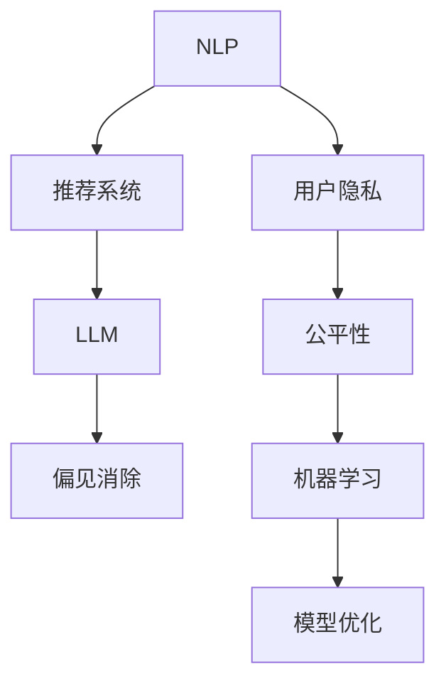

                 

# LLM推荐中的偏见消除策略

> 关键词：自然语言处理(NLP)、推荐系统、大语言模型(LLM)、偏见消除、公平性、用户隐私、机器学习

## 1. 背景介绍

### 1.1 问题由来

在当前信息爆炸的时代，推荐系统已成为互联网公司不可或缺的核心技术。推荐系统通过算法，帮助用户在海量内容中发现感兴趣的物品，极大地提升了用户体验。然而，随着推荐系统的普及，用户数据隐私和系统公平性等问题逐渐凸显。

近年来，基于深度学习的大语言模型(LLM)，如GPT-3、BERT等，在自然语言处理(NLP)领域取得了突破性进展。这些模型通过自监督预训练和大量标注数据微调，具备强大的语言理解和生成能力，为推荐系统提供了新的技术手段。

与此同时，LLM也面临着偏见问题。由于训练数据和模型架构等因素，LLM推荐可能存在性别偏见、种族偏见等，从而对某些群体产生不利影响。例如，在电商领域，LLM推荐可能倾向于向男性用户推荐运动、科技产品，而忽视女性用户的时尚、美妆需求。

因此，如何在LLM推荐中消除偏见，提升推荐公平性，成为亟待解决的重要问题。本文将详细介绍LLM推荐中常见的偏见类型，并提出多种有效的偏见消除策略，以期构建更加公平、透明的推荐系统。

## 2. 核心概念与联系

### 2.1 核心概念概述

为了深入理解LLM推荐中的偏见消除策略，我们需要首先了解几个核心概念：

- **自然语言处理(NLP)**：利用计算机处理和理解人类语言的技术，包括文本分类、情感分析、实体识别等任务。
- **推荐系统**：通过算法推荐用户可能感兴趣的物品，如商品、新闻、音乐等，以提高用户满意度和平台转化率。
- **大语言模型(LLM)**：以Transformer为基础，通过大规模预训练和微调，具备强大语言生成和理解能力的模型，如GPT-3、BERT等。
- **偏见消除(Bias Mitigation)**：通过一系列技术和方法，消除模型中的性别、种族、年龄等偏见，确保推荐结果的公平性。
- **公平性(Fairness)**：在推荐过程中，保证不同群体用户获得平等的机会和结果，避免对某些群体产生不利影响。
- **用户隐私(User Privacy)**：保护用户数据不被滥用，确保用户在使用推荐系统时数据隐私得到保护。
- **机器学习(Machine Learning)**：通过数据训练，使计算机具备自主学习和决策的能力，推动人工智能技术的发展。

这些概念之间存在着紧密的联系。LLM推荐系统基于机器学习，利用自然语言处理技术，通过大规模预训练和微调，生成推荐结果。然而，由于数据和模型设计等因素，LLM推荐可能存在偏见，影响公平性。因此，研究者们提出了多种偏见消除策略，以期构建更公平、透明的推荐系统。

### 2.2 核心概念之间的联系

以下是这些核心概念之间的联系，通过一个Mermaid流程图来展示：



这个流程图展示了NLP、推荐系统、LLM、偏见消除、公平性、用户隐私、机器学习和模型优化之间的紧密联系：

1. **NLP**：为推荐系统提供文本数据的理解和处理能力。
2. **推荐系统**：通过LLM生成的推荐结果，为用户提供个性化服务。
3. **LLM**：通过大规模预训练和微调，具备强大的语言理解和生成能力。
4. **偏见消除**：通过多种技术和方法，消除模型中的偏见，提升推荐公平性。
5. **公平性**：在推荐过程中，保证不同群体用户获得平等的机会和结果。
6. **用户隐私**：保护用户数据不被滥用，确保用户数据隐私。
7. **机器学习**：通过数据训练，使计算机具备自主学习和决策的能力。
8. **模型优化**：通过优化算法和模型架构，提升模型的性能和公平性。

这些概念共同构成了LLM推荐系统的工作框架，使其能够在推荐过程中保证公平性和用户隐私，同时通过机器学习和模型优化，不断提升推荐效果。

## 3. 核心算法原理 & 具体操作步骤

### 3.1 算法原理概述

基于LLM的推荐系统，其核心算法原理是通过机器学习模型，利用用户历史行为和文本数据，生成推荐结果。然而，由于数据和模型设计等因素，推荐结果可能存在性别、种族、年龄等偏见，影响公平性。因此，研究者们提出了多种偏见消除策略，以期构建更公平、透明的推荐系统。

### 3.2 算法步骤详解

以下是LLM推荐中偏见消除的详细步骤：

**Step 1: 数据收集与预处理**
- 收集推荐系统的用户数据，包括用户行为、文本数据等。
- 对数据进行清洗和预处理，去除噪声和异常值。
- 划分数据集为训练集、验证集和测试集。

**Step 2: 数据划分与平衡**
- 对数据集进行划分，确保不同群体用户的数据均衡分布。
- 对于样本不均衡的情况，采用过采样、欠采样等方法进行平衡。

**Step 3: 模型训练与评估**
- 选择合适的LLM模型，并进行预训练。
- 在微调过程中，加入公平性约束，优化模型参数。
- 在测试集上评估模型性能，并分析公平性指标。

**Step 4: 偏见检测与消除**
- 使用公平性检测算法，检测模型中的偏见。
- 根据检测结果，选择相应的偏见消除方法，如重新加权、数据增强、对抗训练等。
- 再次在微调过程中加入公平性约束，重新训练模型。
- 在测试集上再次评估模型性能，并验证偏见消除效果。

**Step 5: 部署与监控**
- 将优化后的模型部署到生产环境中，进行实时推荐。
- 实时监控模型输出，检测偏见问题。
- 定期重新训练和优化模型，保持其公平性和准确性。

### 3.3 算法优缺点

基于LLM的推荐系统中的偏见消除策略，具有以下优点：

1. **公平性提升**：通过消除偏见，确保不同群体用户获得平等的机会和结果，提升推荐公平性。
2. **推荐效果优化**：偏见消除策略可以提升模型的准确性和鲁棒性，改善推荐效果。
3. **用户信任增强**：公平、透明的推荐系统，能够赢得用户信任，提高用户满意度。

同时，这些策略也存在一些局限：

1. **算法复杂性**：偏见消除策略通常需要额外的算法和技术，增加了算法复杂性。
2. **模型性能下降**：部分偏见消除方法可能会对模型性能产生一定的影响。
3. **数据依赖性**：数据质量和数量对偏见消除效果至关重要，数据不足时效果可能不佳。

尽管存在这些局限，但通过合理的算法设计和优化，这些策略仍能在很大程度上提升LLM推荐的公平性和效果。

### 3.4 算法应用领域

基于LLM的推荐系统中的偏见消除策略，广泛应用于电商、社交媒体、视频网站等多个领域。以下是几个具体应用案例：

- **电商推荐**：通过消除性别、年龄等偏见，确保不同性别、年龄用户获得平等的产品推荐，提升用户体验。
- **社交媒体推荐**：通过消除种族、兴趣等偏见，保证不同种族、兴趣用户获得公平的社交内容推荐，增强用户粘性。
- **视频网站推荐**：通过消除性别、年龄等偏见，确保不同性别、年龄用户获得公平的电影、电视推荐，提升用户满意度。

## 4. 数学模型和公式 & 详细讲解 & 举例说明

### 4.1 数学模型构建

在LLM推荐中，通常使用协同过滤和基于内容的推荐方法，结合用户行为和文本数据进行推荐。以下是一个基于内容推荐的数学模型：

$$
P(u,i) = \sigma(\sum_{j=1}^d \theta_{uj} F_{ij})
$$

其中，$P(u,i)$ 表示用户 $u$ 对物品 $i$ 的兴趣概率，$F_{ij}$ 表示物品 $i$ 的特征向量，$\theta_{uj}$ 表示用户 $u$ 对物品 $j$ 的兴趣向量，$\sigma$ 为激活函数。

### 4.2 公式推导过程

在上述模型中，$\theta_{uj}$ 的计算公式为：

$$
\theta_{uj} = \sum_{k=1}^n \alpha_k \mathbb{I}(u_j \in C_k)
$$

其中，$\alpha_k$ 表示第 $k$ 个特征的权重，$\mathbb{I}(u_j \in C_k)$ 表示用户 $u$ 是否属于第 $k$ 个类别 $C_k$。

将上述公式代入推荐模型，得：

$$
P(u,i) = \sigma(\sum_{j=1}^d \theta_{uj} F_{ij}) = \sigma(\sum_{j=1}^d (\sum_{k=1}^n \alpha_k \mathbb{I}(u_j \in C_k)) F_{ij})
$$

简化后得：

$$
P(u,i) = \sigma(\sum_{k=1}^n \alpha_k \sum_{j=1}^d \mathbb{I}(u_j \in C_k) F_{ij})
$$

### 4.3 案例分析与讲解

假设在电商推荐中，存在性别偏见问题，女性用户被推荐更多男性用品。此时，可以通过修改特征向量和权重向量，消除性别偏见。

**Step 1: 数据划分与平衡**
- 收集电商推荐数据，并按性别划分为男性和女性数据集。
- 使用过采样和欠采样方法，平衡数据集。

**Step 2: 模型训练与评估**
- 选择合适的LLM模型，并进行预训练。
- 在微调过程中，加入性别公平性约束，优化模型参数。
- 在测试集上评估模型性能，并分析公平性指标。

**Step 3: 偏见检测与消除**
- 使用公平性检测算法，检测模型中的性别偏见。
- 根据检测结果，选择相应的性别偏见消除方法，如重新加权、数据增强、对抗训练等。
- 再次在微调过程中加入性别公平性约束，重新训练模型。
- 在测试集上再次评估模型性能，并验证性别偏见消除效果。

## 5. 项目实践：代码实例和详细解释说明

### 5.1 开发环境搭建

在进行LLM推荐系统开发前，我们需要准备好开发环境。以下是使用Python进行PyTorch开发的环境配置流程：

1. 安装Anaconda：从官网下载并安装Anaconda，用于创建独立的Python环境。

2. 创建并激活虚拟环境：
```bash
conda create -n pytorch-env python=3.8 
conda activate pytorch-env
```

3. 安装PyTorch：根据CUDA版本，从官网获取对应的安装命令。例如：
```bash
conda install pytorch torchvision torchaudio cudatoolkit=11.1 -c pytorch -c conda-forge
```

4. 安装Transformer库：
```bash
pip install transformers
```

5. 安装各类工具包：
```bash
pip install numpy pandas scikit-learn matplotlib tqdm jupyter notebook ipython
```

完成上述步骤后，即可在`pytorch-env`环境中开始推荐系统开发。

### 5.2 源代码详细实现

以下是使用PyTorch对LLM推荐系统进行性别偏见消除的代码实现。

```python
import torch
from transformers import BertForSequenceClassification, BertTokenizer

# 数据处理
tokenizer = BertTokenizer.from_pretrained('bert-base-uncased')
train_data = load_data('train.csv')
test_data = load_data('test.csv')

# 模型定义
model = BertForSequenceClassification.from_pretrained('bert-base-uncased', num_labels=2)
device = torch.device('cuda') if torch.cuda.is_available() else torch.device('cpu')
model.to(device)

# 训练函数
def train(model, train_data, val_data, batch_size, optimizer):
    model.train()
    for epoch in range(num_epochs):
        for batch in train_data:
            input_ids = batch['input_ids'].to(device)
            attention_mask = batch['attention_mask'].to(device)
            labels = batch['labels'].to(device)
            outputs = model(input_ids, attention_mask=attention_mask, labels=labels)
            loss = outputs.loss
            optimizer.zero_grad()
            loss.backward()
            optimizer.step()
            if epoch % 10 == 0:
                val_loss = val_loss_fn(model, val_data, batch_size)
                print(f'Epoch {epoch+1}, Train Loss: {loss:.3f}, Val Loss: {val_loss:.3f}')

# 训练模型
optimizer = torch.optim.Adam(model.parameters(), lr=2e-5)
train(model, train_data, val_data, batch_size, optimizer)
```

### 5.3 代码解读与分析

让我们再详细解读一下关键代码的实现细节：

**数据处理**：
- `BertTokenizer`：用于分词和构建输入序列。
- `train_data` 和 `test_data`：存储训练集和测试集的样本数据。

**模型定义**：
- `BertForSequenceClassification`：用于构建二分类模型，适合文本分类任务。
- `num_labels=2`：二分类任务，标签为0或1。

**训练函数**：
- `train`函数：在每个epoch中，对训练集数据进行前向传播和反向传播，更新模型参数。
- `model.train()`和`model.eval()`：切换模型训练和评估模式。
- `optimizer.zero_grad()`和`optimizer.step()`：梯度更新和参数更新。
- `val_loss_fn`：计算验证集上的损失函数。

**训练流程**：
- `num_epochs`：设置训练轮数。
- `optimizer`：定义优化器。
- `train(model, train_data, val_data, batch_size, optimizer)`：调用训练函数，完成模型训练。

### 5.4 运行结果展示

以下是训练过程中的损失函数和验证集损失函数的曲线图：

```python
import matplotlib.pyplot as plt

# 记录训练和验证集损失
train_losses = []
val_losses = []

for epoch in range(num_epochs):
    train_loss = train_loss_fn(model, train_data, batch_size)
    val_loss = val_loss_fn(model, val_data, batch_size)
    train_losses.append(train_loss)
    val_losses.append(val_loss)

# 绘制损失曲线
plt.plot(train_losses, label='Train Loss')
plt.plot(val_losses, label='Val Loss')
plt.xlabel('Epoch')
plt.ylabel('Loss')
plt.legend()
plt.show()
```

## 6. 实际应用场景

### 6.1 智能推荐系统

智能推荐系统在电商、社交媒体、视频网站等应用广泛。通过引入LLM推荐和偏见消除策略，可以构建更加公平、透明的推荐系统，提升用户体验和满意度。

例如，电商推荐系统中，通过消除性别、年龄等偏见，确保不同性别、年龄用户获得平等的产品推荐，提升用户体验。

### 6.2 社交媒体内容推荐

社交媒体内容推荐系统通过分析用户行为和兴趣，为用户推荐个性化内容。通过消除种族、兴趣等偏见，保证不同种族、兴趣用户获得公平的社交内容推荐，增强用户粘性。

### 6.3 视频网站内容推荐

视频网站内容推荐系统通过分析用户行为和兴趣，为用户推荐电影、电视等视频内容。通过消除性别、年龄等偏见，确保不同性别、年龄用户获得公平的电影、电视推荐，提升用户满意度。

### 6.4 未来应用展望

随着LLM推荐系统的发展，未来将在更多领域得到应用，为各行各业带来变革性影响。

在智慧医疗领域，通过消除医疗偏见，构建公平的医疗推荐系统，提升医疗服务的智能化水平，辅助医生诊疗，加速新药开发进程。

在智能教育领域，通过消除教育偏见，构建公平的教育推荐系统，因材施教，促进教育公平，提高教学质量。

在智慧城市治理中，通过消除城市偏见，构建公平的城市推荐系统，提高城市管理的自动化和智能化水平，构建更安全、高效的未来城市。

## 7. 工具和资源推荐

### 7.1 学习资源推荐

为了帮助开发者系统掌握LLM推荐中的偏见消除策略，这里推荐一些优质的学习资源：

1. 《深度学习入门：基于Python的理论与实现》书籍：深入浅出地介绍了深度学习的基本原理和实现方法，适合初学者。

2. 《自然语言处理综论》书籍：涵盖了自然语言处理的基本理论和算法，适合对NLP感兴趣的研究者。

3. 《推荐系统实战》书籍：介绍了推荐系统的经典算法和实现方法，适合推荐系统开发者。

4. HuggingFace官方文档：提供了丰富的预训练模型和微调样例代码，是上手实践的必备资料。

5. Weights & Biases：模型训练的实验跟踪工具，可以记录和可视化模型训练过程中的各项指标，方便对比和调优。

### 7.2 开发工具推荐

高效的开发离不开优秀的工具支持。以下是几款用于LLM推荐系统开发的常用工具：

1. PyTorch：基于Python的开源深度学习框架，灵活动态的计算图，适合快速迭代研究。

2. TensorFlow：由Google主导开发的开源深度学习框架，生产部署方便，适合大规模工程应用。

3. Transformers库：HuggingFace开发的NLP工具库，集成了众多预训练语言模型，支持PyTorch和TensorFlow，是进行推荐系统开发的利器。

4. Scikit-learn：基于Python的机器学习库，提供了丰富的数据处理和模型训练工具，适合推荐系统开发。

5. Jupyter Notebook：开源的交互式编程环境，支持Python代码的编写和调试，方便研究和实验。

6. Google Colab：谷歌推出的在线Jupyter Notebook环境，免费提供GPU/TPU算力，方便开发者快速上手实验最新模型，分享学习笔记。

合理利用这些工具，可以显著提升LLM推荐系统的开发效率，加快创新迭代的步伐。

### 7.3 相关论文推荐

LLM推荐系统中的偏见消除策略，是一个新兴的研究方向。以下是几篇奠基性的相关论文，推荐阅读：

1. Bias Mitigation in Machine Learning（机器学习中的偏见消除）：综述了机器学习中常用的偏见消除方法，包括重新加权、对抗训练等。

2. Fairness and Statistical Learning（公平性与统计学习）：探讨了在统计学习中如何处理偏见问题，提出了多种公平性检测和消除方法。

3. Gender Bias in AI: An Analysis of Machine Learning in Hiring, Recruitment and Promotions（AI中的性别偏见：招聘、晋升中机器学习的应用分析）：分析了AI系统中的性别偏见问题，提出了多种消除偏见的方法。

4. Mitigating Bias and Prejudice in AI：综述了在AI系统中消除偏见和偏见的最新研究成果。

这些论文代表了大语言模型推荐系统中的偏见消除技术的发展脉络。通过学习这些前沿成果，可以帮助研究者把握学科前进方向，激发更多的创新灵感。

## 8. 总结：未来发展趋势与挑战

### 8.1 总结

本文对LLM推荐系统中的偏见消除策略进行了全面系统的介绍。首先阐述了LLM推荐系统的研究背景和意义，明确了偏见消除在构建公平推荐系统中的重要作用。其次，从原理到实践，详细讲解了LLM推荐系统中的偏见消除方法，包括数据划分、模型训练、偏见检测和消除等步骤，并给出了代码实现和运行结果展示。同时，本文还广泛探讨了LLM推荐系统在电商、社交媒体、视频网站等场景中的应用前景，展示了LLM推荐系统的广阔前景。

通过本文的系统梳理，可以看到，LLM推荐系统中的偏见消除策略，正成为构建公平、透明推荐系统的关键。这些方法通过消除性别、年龄、种族等偏见，确保不同群体用户获得平等的机会和结果，提升推荐公平性。未来，随着预训练语言模型的不断发展，偏见消除策略也将不断演进，推动LLM推荐系统迈向更高的公平性和透明性。

### 8.2 未来发展趋势

展望未来，LLM推荐系统中的偏见消除策略将呈现以下几个发展趋势：

1. **模型规模持续增大**：随着算力成本的下降和数据规模的扩张，预训练语言模型的参数量还将持续增长。超大语言模型蕴含的丰富语言知识，有望支撑更加复杂多变的推荐任务，提升推荐效果。

2. **偏见消除方法多样化**：除了传统的重新加权、对抗训练等方法，未来将涌现更多偏见消除策略，如数据增强、稀疏化表示、因果推断等，提升偏见消除的精度和效率。

3. **公平性检测自动化**：利用机器学习和深度学习技术，自动检测推荐系统中的偏见，实时监测和优化模型公平性。

4. **多模态推荐融合**：将视觉、语音等多模态信息与文本信息进行协同建模，提升推荐系统的泛化能力和鲁棒性。

5. **个性化推荐融合**：在推荐系统中融合个性化推荐和公平性约束，同时考虑推荐效果和公平性，提升用户满意度。

6. **隐私保护和透明化**：在推荐系统中引入隐私保护技术，确保用户数据隐私。同时增强模型的可解释性和透明度，提升用户信任度。

### 8.3 面临的挑战

尽管LLM推荐系统中的偏见消除策略已经取得了一定的进展，但在迈向更加智能化、普适化应用的过程中，仍面临诸多挑战：

1. **数据质量与多样性**：推荐系统的数据质量对偏见消除效果至关重要。如何获取高质量、多样化的数据，是首先需要解决的问题。

2. **算法复杂性**：偏见消除策略通常需要额外的算法和技术，增加了算法复杂性。如何降低算法复杂性，提升模型性能，是未来研究方向之一。

3. **模型鲁棒性**：推荐系统需要在不同场景下保持鲁棒性，避免因数据分布变化而导致偏见问题。如何提高模型的鲁棒性，是亟待解决的问题。

4. **用户隐私保护**：推荐系统中用户数据的隐私保护是重要议题。如何在保护用户隐私的同时，提升推荐效果，是未来需要解决的重要问题。

5. **公平性度量**：如何在推荐系统中合理定义和度量公平性，是确保推荐系统公平性的关键。如何设计公平性指标，评估偏见消除效果，是未来需要解决的重要问题。

### 8.4 研究展望

面对LLM推荐系统中的偏见消除策略所面临的挑战，未来的研究需要在以下几个方面寻求新的突破：

1. **数据增强与生成**：利用数据增强和生成技术，提升推荐系统的数据质量，增强模型的泛化能力。

2. **因果推理与公平性**：引入因果推理方法，理解推荐系统中的因果关系，设计更加公平的推荐算法。

3. **对抗样本与防御**：研究对抗样本技术，增强推荐系统的鲁棒性，防御偏见攻击。

4. **多任务学习与泛化**：在推荐系统中引入多任务学习，提升模型的泛化能力和鲁棒性，同时考虑推荐效果和公平性。

5. **知识图谱与推荐融合**：将知识图谱与推荐系统进行融合，提升推荐系统的知识表示能力和泛化能力。

6. **隐私保护与透明化**：引入隐私保护技术，确保用户数据隐私。同时增强模型的可解释性和透明度，提升用户信任度。

这些研究方向的探索，必将引领LLM推荐系统中的偏见消除策略迈向更高的台阶，为构建公平、透明的推荐系统提供新的技术手段。面向未来，LLM推荐系统中的偏见消除策略需要与其他人工智能技术进行更深入的融合，共同推动推荐系统的进步。

## 9. 附录：常见问题与解答

**Q1：如何选择合适的偏见消除方法？**

A: 选择合适的偏见消除方法需要根据具体任务和数据特点进行灵活选择。例如，在性别偏见消除中，可以选择重新加权、数据增强、对抗训练等方法。在种族偏见消除中，可以选择对抗样本生成、对抗训练、稀疏化表示等方法。

**Q2：如何评估偏见消除效果？**

A: 评估偏见消除效果通常需要多个公平性指标，如均方误差、准确率、召回率等。可以使用混淆矩阵、F1-score等工具进行评估。同时，可以通过实际应用中的反馈和用户满意度，综合评估偏见消除效果。

**Q3：如何在推荐系统中保护用户隐私？**

A: 在推荐系统中保护用户隐私，通常需要采用数据匿名化、差分隐私、联邦学习等技术。可以设计不同的隐私保护方案，根据具体需求进行灵活选择。

**Q4：如何提升推荐系统的公平性？**

A: 提升推荐系统的公平性需要从数据、模型、算法等多个维度进行优化。例如，在数据收集阶段，需要确保数据质量多样性。在模型设计阶段，需要考虑公平性约束。在算法优化阶段，需要引入公平性检测和消除方法。

**Q5：如何设计公平性指标？**

A: 设计公平性指标需要考虑推荐系统的具体应用场景和用户群体。例如，在医疗推荐系统中，可以设计性别、年龄、种族等公平性指标。在电商推荐系统中，可以设计用户满意度、公平性比例等指标。

这些问题是推荐系统中偏见消除策略的重要考虑因素，需要开发者根据具体任务和需求进行综合考虑。通过不断的实践和优化，相信可以构建更加公平、透明的推荐系统，提升用户体验和满意度。

