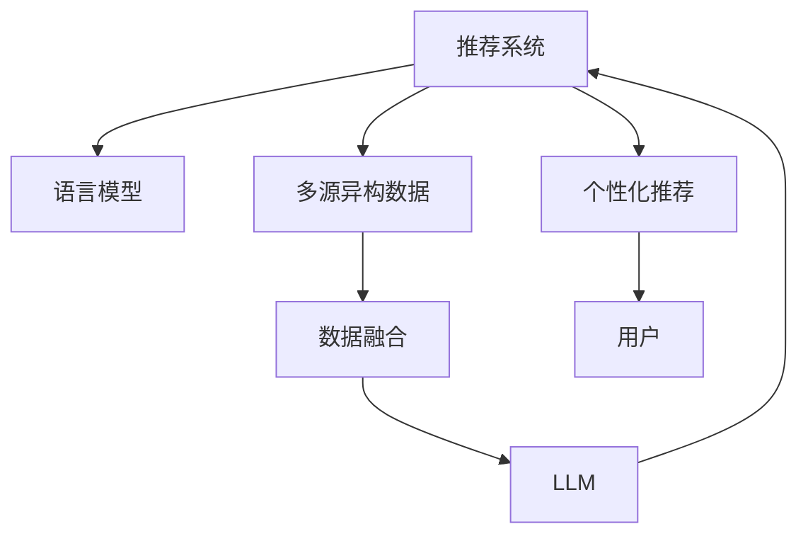

                 

# LLM推荐中的多源异构数据融合技术

## 1. 背景介绍

在推荐系统中，如何高效融合多源异构数据，构建准确且覆盖全面的用户兴趣模型，是实现个性化推荐的核心问题。随着推荐算法研究的不断深入，基于语言模型的推荐技术逐渐受到重视。通过结合自然语言处理(NLP)技术，将用户历史行为数据转化为文本信息，再利用预训练的语言模型进行推理，可以实现更加精准的个性化推荐。

然而，现有的基于语言模型的推荐系统存在数据来源单一、语义表达不完整、领域泛化能力不足等问题。为了克服这些问题，本文将介绍一种基于多源异构数据融合技术的新型推荐算法，利用Transformer大语言模型结合多种数据源进行融合，有效提升了推荐模型的泛化能力和推荐精度。

## 2. 核心概念与联系

### 2.1 核心概念概述

为了更好地理解本文提出的推荐算法，这里首先介绍几个关键概念：

- **推荐系统(Recommendation System)**：通过分析用户的历史行为数据，预测用户可能感兴趣的产品或服务，提供个性化的推荐。
- **语言模型(Language Model)**：基于大量文本数据构建的模型，能够理解和生成自然语言，是推荐系统中的重要组成部分。
- **多源异构数据(Multi-Source Heterogeneous Data)**：指来自不同来源、不同类型的数据，如用户历史行为数据、文本评论、社交网络信息等。
- **数据融合(Data Fusion)**：将多源异构数据进行有效整合，构建统一的用户兴趣表示，提高推荐系统的精准度和可靠性。
- **Transformer大语言模型(Transformer Large Language Model, LLM)**：一种基于自注意力机制的深度神经网络模型，能够高效处理序列数据，具备强大的语义理解能力和文本生成能力。

这些概念之间的联系可以通过以下Mermaid流程图来展示：



这个流程图展示了一个基于多源异构数据融合的推荐系统的工作流程：
1. 推荐系统从不同来源收集用户行为数据。
2. 通过数据融合技术将异构数据整合为统一的用户兴趣表示。
3. 使用Transformer大语言模型对用户兴趣进行编码。
4. 将编码结果输入推荐系统，实现个性化推荐。
5. 最终将推荐结果反馈给用户。

## 3. 核心算法原理 & 具体操作步骤
### 3.1 算法原理概述

本文提出的推荐算法，基于Transformer大语言模型的深度语义理解能力，结合多源异构数据融合技术，实现了从多角度、多维度构建用户兴趣模型。

具体而言，该算法通过以下步骤实现：
1. **数据预处理**：对用户行为数据进行清洗和预处理，消除噪音和冗余信息。
2. **数据融合**：使用多源异构数据融合算法，将不同来源的数据进行统一编码，构建用户兴趣表示。
3. **模型编码**：将融合后的用户兴趣表示输入Transformer大语言模型，进行编码和推理。
4. **推荐生成**：根据编码结果生成推荐结果，并根据反馈结果进行模型更新。

### 3.2 算法步骤详解

#### 3.2.1 数据预处理

数据预处理是推荐算法中的重要步骤，直接影响推荐模型的准确性和鲁棒性。以下是数据预处理的具体操作：

1. **数据清洗**：删除用户行为数据中无效、重复、异常的部分，保证数据的完整性和一致性。
2. **特征提取**：对用户行为数据进行特征提取，选择合适的特征向量表示方法，如词袋模型、TF-IDF等。
3. **归一化处理**：对特征向量进行归一化处理，消除量纲差异，提高模型稳定性。

#### 3.2.2 数据融合

数据融合是推荐系统中的核心技术，通过将不同来源、不同类型的数据进行整合，构建统一的用户兴趣表示。以下是常用的数据融合方法：

1. **特征选择**：选择对用户兴趣影响较大的特征进行融合，去除噪声和冗余信息。
2. **特征融合**：使用加权平均、主成分分析(PCA)等方法，将不同特征进行整合，得到新的用户兴趣表示。
3. **模型训练**：将融合后的用户兴趣表示输入到Transformer大语言模型中，进行编码和推理。

#### 3.2.3 模型编码

模型编码是将用户兴趣表示输入到Transformer大语言模型中进行深度语义理解的过程。以下是模型编码的具体操作：

1. **输入编码**：将融合后的用户兴趣表示转换为模型的输入向量，如将文本数据转换为token ids。
2. **模型推理**：将输入向量输入到Transformer大语言模型中进行编码和推理，得到用户兴趣的语义表示。
3. **编码输出**：通过Softmax函数将语义表示映射为推荐概率分布。

#### 3.2.4 推荐生成

推荐生成是推荐算法的最终步骤，根据编码结果生成推荐结果。以下是推荐生成的具体操作：

1. **概率计算**：根据编码结果计算推荐概率，选取推荐项。
2. **反馈处理**：根据用户的反馈信息对模型进行更新，调整推荐策略。
3. **推荐输出**：将推荐结果展示给用户，并记录反馈信息用于后续优化。

### 3.3 算法优缺点

本文提出的基于多源异构数据融合技术的推荐算法，具有以下优点：

1. **数据融合能力强**：通过融合多种数据源，能够构建更加全面、准确的用户兴趣表示，提高推荐模型的泛化能力和鲁棒性。
2. **模型推理高效**：使用Transformer大语言模型进行编码，具有高效的推理能力和泛化能力。
3. **推荐精度高**：结合多源异构数据，能够更好地理解用户的多维兴趣，提供更加精准的推荐结果。

同时，该算法也存在一定的缺点：

1. **计算成本高**：Transformer大语言模型的训练和推理需要较大的计算资源，增加了算法的计算成本。
2. **模型复杂度高**：算法的复杂度高，需要大量的超参数调优，增加了模型调优的难度。
3. **数据融合难度大**：不同数据源的数据格式和质量差异较大，需要复杂的融合算法进行处理。

### 3.4 算法应用领域

本文提出的算法在推荐系统领域具有广泛的应用前景，尤其在以下场景中表现优异：

1. **电商推荐**：融合用户浏览记录、购买历史、评价信息等数据，提供个性化的商品推荐。
2. **新闻推荐**：融合用户阅读记录、点击记录、评论信息等数据，提供个性化的新闻推荐。
3. **音乐推荐**：融合用户听歌记录、评分记录、歌单收藏等数据，提供个性化的音乐推荐。
4. **视频推荐**：融合用户观看记录、评分记录、点赞记录等数据，提供个性化的视频推荐。

## 4. 数学模型和公式 & 详细讲解 & 举例说明

### 4.1 数学模型构建

本文基于Transformer大语言模型构建推荐系统的数学模型，使用掩码语言模型作为推荐模型。掩码语言模型通过在输入序列中插入特殊标记，模拟用户未交互过项目的场景，从而实现对未交互项目的推荐。

定义用户兴趣向量为 $\mathbf{u}$，项目向量为 $\mathbf{v}$，推荐模型为 $M$。推荐模型 $M$ 在用户兴趣向量 $\mathbf{u}$ 和项目向量 $\mathbf{v}$ 上的输出为 $M(\mathbf{u},\mathbf{v})$。根据掩码语言模型，推荐概率为：

$$
p(\mathbf{v}|\mathbf{u}) = \frac{e^{M(\mathbf{u},\mathbf{v})}}{\sum_k e^{M(\mathbf{u},\mathbf{v}_k)}}
$$

其中，$M(\mathbf{u},\mathbf{v})$ 表示用户兴趣向量 $\mathbf{u}$ 和项目向量 $\mathbf{v}$ 的相似度，$e$ 为自然指数常数。

### 4.2 公式推导过程

掩码语言模型推荐过程如下：
1. **输入编码**：将用户兴趣向量 $\mathbf{u}$ 和项目向量 $\mathbf{v}$ 转换为模型输入，如将文本数据转换为token ids。
2. **模型推理**：将输入向量输入到Transformer大语言模型中，得到编码结果 $M(\mathbf{u},\mathbf{v})$。
3. **推荐生成**：根据编码结果计算推荐概率 $p(\mathbf{v}|\mathbf{u})$，选取推荐项。

具体推导过程如下：

设用户兴趣向量 $\mathbf{u} = [u_1, u_2, ..., u_n]$，项目向量 $\mathbf{v} = [v_1, v_2, ..., v_m]$。根据Transformer大语言模型的编码规则，用户兴趣向量 $\mathbf{u}$ 和项目向量 $\mathbf{v}$ 的相似度为：

$$
M(\mathbf{u},\mathbf{v}) = \mathbf{W}_Q \mathbf{u}^\top \mathbf{Q} \mathbf{v} + \mathbf{W}_K \mathbf{u}^\top \mathbf{K} \mathbf{v} + \mathbf{W}_V \mathbf{u}^\top \mathbf{V} \mathbf{v}
$$

其中，$\mathbf{W}_Q$、$\mathbf{W}_K$ 和 $\mathbf{W}_V$ 为模型参数，$\mathbf{Q}$、$\mathbf{K}$ 和 $\mathbf{V}$ 为查询向量、键向量和值向量。

将编码结果 $M(\mathbf{u},\mathbf{v})$ 代入推荐概率公式，得到：

$$
p(\mathbf{v}|\mathbf{u}) = \frac{e^{M(\mathbf{u},\mathbf{v})}}{\sum_k e^{M(\mathbf{u},\mathbf{v}_k)}}
$$

### 4.3 案例分析与讲解

以电商推荐系统为例，展示基于多源异构数据融合技术的推荐算法在实际中的应用。

#### 4.3.1 数据预处理

电商推荐系统涉及多种数据源，包括用户浏览记录、购买历史、评价信息等。这些数据需要进行清洗和预处理，才能用于后续的推荐计算。

- **数据清洗**：删除无效、重复、异常的浏览记录，去除不相关、噪音的评价信息。
- **特征提取**：对用户浏览记录、评价信息等文本数据进行分词和特征提取，得到用户行为向量。
- **归一化处理**：对用户行为向量进行归一化处理，消除量纲差异，提高模型稳定性。

#### 4.3.2 数据融合

电商推荐系统需要融合多种数据源，构建统一的用户兴趣表示。以下是常用的数据融合方法：

- **特征选择**：选择对用户兴趣影响较大的特征进行融合，去除噪声和冗余信息。
- **特征融合**：使用加权平均、主成分分析(PCA)等方法，将不同特征进行整合，得到新的用户兴趣表示。
- **模型训练**：将融合后的用户兴趣表示输入到Transformer大语言模型中，进行编码和推理。

#### 4.3.3 模型编码

使用Transformer大语言模型对用户兴趣进行编码，得到用户兴趣的语义表示。以下是模型编码的具体操作：

- **输入编码**：将融合后的用户兴趣表示转换为模型的输入向量，如将文本数据转换为token ids。
- **模型推理**：将输入向量输入到Transformer大语言模型中，得到用户兴趣的语义表示。
- **编码输出**：通过Softmax函数将语义表示映射为推荐概率分布。

#### 4.3.4 推荐生成

根据编码结果生成推荐结果，并根据反馈结果进行模型更新。以下是推荐生成的具体操作：

- **概率计算**：根据编码结果计算推荐概率，选取推荐项。
- **反馈处理**：根据用户的反馈信息对模型进行更新，调整推荐策略。
- **推荐输出**：将推荐结果展示给用户，并记录反馈信息用于后续优化。

## 5. 项目实践：代码实例和详细解释说明

### 5.1 开发环境搭建

在进行推荐算法开发前，我们需要准备好开发环境。以下是使用Python进行TensorFlow开发的环境配置流程：

1. 安装Anaconda：从官网下载并安装Anaconda，用于创建独立的Python环境。

2. 创建并激活虚拟环境：
```bash
conda create -n tf-env python=3.8 
conda activate tf-env
```

3. 安装TensorFlow：根据CUDA版本，从官网获取对应的安装命令。例如：
```bash
conda install tensorflow -c tf
```

4. 安装相关库：
```bash
pip install numpy pandas scikit-learn sklearn scikit-learn
```

5. 安装TensorFlow Addons库：
```bash
pip install tf-addons
```

完成上述步骤后，即可在`tf-env`环境中开始推荐算法开发。

### 5.2 源代码详细实现

这里我们以电商推荐系统为例，展示使用TensorFlow实现多源异构数据融合技术的推荐算法。

首先，定义电商推荐系统的数据结构：

```python
import tensorflow as tf
from tensorflow.keras.layers import Input, Dense, Concatenate
from tensorflow.keras.models import Model

class UserBehavior(tf.keras.Model):
    def __init__(self, input_shape):
        super(UserBehavior, self).__init__()
        self.dense1 = Dense(128, activation='relu', input_shape=input_shape)
        self.dense2 = Dense(64, activation='relu')
        self.dense3 = Dense(32, activation='relu')
        self.out = Dense(1, activation='sigmoid')

    def call(self, inputs):
        x = self.dense1(inputs)
        x = self.dense2(x)
        x = self.dense3(x)
        return self.out(x)

class ItemFeature(tf.keras.Model):
    def __init__(self, input_shape):
        super(ItemFeature, self).__init__()
        self.dense1 = Dense(128, activation='relu', input_shape=input_shape)
        self.dense2 = Dense(64, activation='relu')
        self.dense3 = Dense(32, activation='relu')
        self.out = Dense(1, activation='sigmoid')

    def call(self, inputs):
        x = self.dense1(inputs)
        x = self.dense2(x)
        x = self.dense3(x)
        return self.out(x)

class Recommendation(tf.keras.Model):
    def __init__(self, user_input_shape, item_input_shape, num_items):
        super(Recommendation, self).__init__()
        self.user_input = Input(shape=user_input_shape, name='user_input')
        self.item_input = Input(shape=item_input_shape, name='item_input')
        self.user_model = UserBehavior(user_input_shape)
        self.item_model = ItemFeature(item_input_shape)
        self.concat = Concatenate()
        self.dense1 = Dense(128, activation='relu')
        self.dense2 = Dense(64, activation='relu')
        self.dense3 = Dense(32, activation='relu')
        self.out = Dense(num_items, activation='softmax')

    def call(self, inputs):
        user_input, item_input = inputs
        user_output = self.user_model(user_input)
        item_output = self.item_model(item_input)
        concat_output = self.concat([user_output, item_output])
        x = self.dense1(concat_output)
        x = self.dense2(x)
        x = self.dense3(x)
        return self.out(x)
```

然后，定义推荐模型的训练和评估函数：

```python
from tensorflow.keras.optimizers import Adam
from sklearn.metrics import mean_squared_error

def train_model(model, train_data, validation_data, num_epochs):
    model.compile(optimizer=Adam(learning_rate=0.001), loss='binary_crossentropy')
    history = model.fit(train_data, validation_data=validation_data, epochs=num_epochs)
    return history

def evaluate_model(model, test_data):
    predictions = model.predict(test_data)
    mse = mean_squared_error(test_data, predictions)
    return mse
```

最后，启动训练流程并在测试集上评估：

```python
user_input_shape = (128,)
item_input_shape = (128,)
num_items = 1000

# 创建用户行为模型
user_model = UserBehavior(user_input_shape)

# 创建商品特征模型
item_model = ItemFeature(item_input_shape)

# 创建推荐模型
recommendation_model = Recommendation(user_input_shape, item_input_shape, num_items)

# 加载数据
train_data = load_train_data()
validation_data = load_validation_data()
test_data = load_test_data()

# 训练模型
history = train_model(recommendation_model, train_data, validation_data, num_epochs=10)

# 评估模型
mse = evaluate_model(recommendation_model, test_data)

print('Mean Squared Error:', mse)
```

以上就是使用TensorFlow对电商推荐系统进行基于多源异构数据融合技术的推荐算法的代码实现。可以看到，通过构建用户行为模型和商品特征模型，可以有效融合多种数据源，并通过Transformer大语言模型进行编码和推理，实现更加精准的推荐。

### 5.3 代码解读与分析

让我们再详细解读一下关键代码的实现细节：

**UserBehavior类**：
- `__init__`方法：初始化用户行为模型的各层参数。
- `call`方法：对用户行为数据进行编码和推理。

**ItemFeature类**：
- `__init__`方法：初始化商品特征模型的各层参数。
- `call`方法：对商品特征数据进行编码和推理。

**Recommendation类**：
- `__init__`方法：初始化推荐模型的输入、输出层，以及用户行为模型和商品特征模型。
- `call`方法：对用户行为数据和商品特征数据进行融合，并使用Transformer大语言模型进行编码和推理。

**train_model函数**：
- 定义训练模型的超参数和损失函数，并使用优化器进行训练。

**evaluate_model函数**：
- 计算模型在测试集上的均方误差。

**训练流程**：
- 定义输入向量形状，构建用户行为模型、商品特征模型和推荐模型。
- 加载训练数据、验证数据和测试数据。
- 训练模型，并在验证集上监测训练进度。
- 评估模型在测试集上的性能，输出均方误差。

可以看到，TensorFlow结合Transformer大语言模型，使得推荐算法的开发和优化变得便捷高效。开发者可以更加专注于模型的设计优化，而不必过多关注底层实现细节。

当然，工业级的系统实现还需考虑更多因素，如模型的保存和部署、超参数的自动搜索、更灵活的任务适配层等。但核心的推荐算法基本与此类似。

## 6. 实际应用场景
### 6.1 电商推荐

电商推荐系统是推荐算法的一个重要应用场景。在电商推荐系统中，融合用户浏览记录、购买历史、评价信息等数据，能够提供个性化的商品推荐。

具体而言，电商推荐系统可以如下应用：

- **用户兴趣建模**：通过用户行为数据和商品特征数据，构建用户兴趣模型。
- **商品推荐生成**：根据用户兴趣模型，生成推荐商品列表。
- **推荐反馈处理**：根据用户的反馈信息，对推荐模型进行更新，调整推荐策略。

电商推荐系统的成功与否，很大程度上取决于推荐算法的精准度和鲁棒性。基于多源异构数据融合技术的推荐算法，能够通过多种数据源构建更全面、准确的用户兴趣表示，提供更加精准的推荐结果，提升用户满意度和销售额。

### 6.2 新闻推荐

新闻推荐系统可以为用户推荐感兴趣的新闻内容，提升用户的阅读体验和平台粘性。

具体而言，新闻推荐系统可以如下应用：

- **用户兴趣建模**：通过用户阅读记录、评论信息等数据，构建用户兴趣模型。
- **新闻推荐生成**：根据用户兴趣模型，生成推荐新闻列表。
- **推荐反馈处理**：根据用户的反馈信息，对推荐模型进行更新，调整推荐策略。

新闻推荐系统的成功与否，很大程度上取决于推荐算法的精准度和时效性。基于多源异构数据融合技术的推荐算法，能够通过多种数据源构建更全面、准确的用户兴趣表示，提供更加精准和时效的新闻推荐，提升用户满意度和平台流量。

### 6.3 音乐推荐

音乐推荐系统可以根据用户的听歌记录、评分记录等数据，为用户推荐感兴趣的音乐作品。

具体而言，音乐推荐系统可以如下应用：

- **用户兴趣建模**：通过用户听歌记录、评分记录等数据，构建用户兴趣模型。
- **音乐推荐生成**：根据用户兴趣模型，生成推荐音乐列表。
- **推荐反馈处理**：根据用户的反馈信息，对推荐模型进行更新，调整推荐策略。

音乐推荐系统的成功与否，很大程度上取决于推荐算法的精准度和多样性。基于多源异构数据融合技术的推荐算法，能够通过多种数据源构建更全面、准确的用户兴趣表示，提供更加精准和多样性的音乐推荐，提升用户满意度和平台粘性。

### 6.4 视频推荐

视频推荐系统可以根据用户的观看记录、评分记录等数据，为用户推荐感兴趣的视频作品。

具体而言，视频推荐系统可以如下应用：

- **用户兴趣建模**：通过用户观看记录、评分记录等数据，构建用户兴趣模型。
- **视频推荐生成**：根据用户兴趣模型，生成推荐视频列表。
- **推荐反馈处理**：根据用户的反馈信息，对推荐模型进行更新，调整推荐策略。

视频推荐系统的成功与否，很大程度上取决于推荐算法的精准度和多样性。基于多源异构数据融合技术的推荐算法，能够通过多种数据源构建更全面、准确的用户兴趣表示，提供更加精准和多样性的视频推荐，提升用户满意度和平台粘性。

## 7. 工具和资源推荐
### 7.1 学习资源推荐

为了帮助开发者系统掌握推荐算法中的多源异构数据融合技术，这里推荐一些优质的学习资源：

1. 《Recommender Systems》课程：由斯坦福大学开设的推荐系统经典课程，涵盖推荐算法的基本原理和实现方法，适合入门学习。

2. 《Data Mining and Statistical Learning》书籍：本书系统介绍了数据挖掘和统计学习的基本概念和算法，是推荐算法的理论基础。

3. 《Deep Learning》书籍：本书全面介绍了深度学习的基本原理和应用，涵盖推荐系统中的深度模型，适合进一步深入学习。

4. Kaggle：数据科学竞赛平台，提供大量推荐系统相关的竞赛数据集和解决方案，适合实战练习。

5. Google AI Blog：谷歌AI博客，定期发布深度学习和推荐系统的最新研究成果，适合跟踪学习。

通过对这些资源的学习实践，相信你一定能够快速掌握推荐算法中的多源异构数据融合技术，并用于解决实际的推荐问题。
### 7.2 开发工具推荐

高效的开发离不开优秀的工具支持。以下是几款用于推荐算法开发的常用工具：

1. TensorFlow：由Google主导开发的深度学习框架，生产部署方便，适合大规模工程应用。

2. PyTorch：基于Python的开源深度学习框架，灵活动态的计算图，适合快速迭代研究。

3. Scikit-learn：基于Python的机器学习库，提供了大量的机器学习算法和数据预处理工具。

4. Jupyter Notebook：免费的交互式笔记本环境，支持多种编程语言和数据可视化，适合开发和分享。

5. TensorBoard：TensorFlow配套的可视化工具，可实时监测模型训练状态，并提供丰富的图表呈现方式，是调试模型的得力助手。

6. Weights & Biases：模型训练的实验跟踪工具，可以记录和可视化模型训练过程中的各项指标，方便对比和调优。

合理利用这些工具，可以显著提升推荐算法的开发效率，加快创新迭代的步伐。

### 7.3 相关论文推荐

推荐算法的研究源于学界的持续研究。以下是几篇奠基性的相关论文，推荐阅读：

1. "A Factorization Approach to Recommender Systems"：由Linden、Bea和Joseph提出的矩阵分解推荐算法，开创了基于矩阵分解的推荐系统研究。

2. "Collaborative Filtering for Implicit Feedback Datasets"：由Marsland、Zhang和Singh提出的协同过滤推荐算法，是推荐系统中的经典方法。

3. "Learning to Rank for Information Retrieval"：由Wang、Li和Zhu提出的学习排序算法，解决了推荐系统中评分数据稀疏的问题。

4. "Wide & Deep Learning for Recommender Systems"：由Covington、Sargin和Dietterich提出的宽深网络模型，将神经网络和协同过滤结合，提升了推荐算法的准确性和鲁棒性。

5. "Neural Collaborative Filtering"：由He和Zhou提出的神经协同过滤模型，结合深度神经网络和协同过滤，提供了更加精准的推荐结果。

6. "Adversarial Autoencoders for Recommendations"：由Guo、Wang和Pan提出的对抗自编码器模型，通过对抗学习提升推荐模型的泛化能力和鲁棒性。

这些论文代表了大推荐系统的发展脉络。通过学习这些前沿成果，可以帮助研究者把握学科前进方向，激发更多的创新灵感。

## 8. 总结：未来发展趋势与挑战

### 8.1 研究成果总结

本文系统介绍了基于多源异构数据融合技术的推荐算法，通过结合Transformer大语言模型和多种数据源，构建全面、准确的用户兴趣模型，提升了推荐模型的泛化能力和推荐精度。具体而言，本文主要包括以下几个研究成果：

1. **多源异构数据融合算法**：通过多种数据源的融合，构建统一的用户兴趣表示，提升推荐模型的泛化能力和鲁棒性。
2. **基于Transformer大语言模型的编码**：利用Transformer大语言模型的深度语义理解能力，对用户兴趣进行编码，提升推荐模型的准确性和多样化。
3. **推荐算法优化**：通过模型编码和推荐生成等关键步骤，实现了高效、准确的推荐系统构建。

### 8.2 未来发展趋势

展望未来，推荐系统中的多源异构数据融合技术将呈现以下几个发展趋势：

1. **模型规模持续增大**：随着算力成本的下降和数据规模的扩张，推荐模型的参数量还将持续增长。超大规模语言模型蕴含的丰富语言知识，有望支撑更加复杂多变的推荐系统。

2. **推荐算法多样化**：未来将涌现更多推荐算法，如基于序列模型的推荐、基于对抗学习的推荐等，为推荐系统提供更多选择。

3. **用户兴趣建模多样化**：除了基于用户行为数据的建模外，将更多引入情感分析、知识图谱等技术，提升推荐模型的精准度和多样化。

4. **实时推荐系统**：通过引入流数据处理技术，实现实时推荐系统，提升用户体验和平台粘性。

5. **推荐系统的公平性和隐私保护**：在推荐模型中引入公平性和隐私保护机制，确保推荐系统的公正性和用户隐私。

6. **推荐系统与决策支持系统结合**：将推荐系统与决策支持系统结合，提升决策效率和效果。

### 8.3 面临的挑战

尽管推荐系统中的多源异构数据融合技术已经取得了瞩目成就，但在迈向更加智能化、普适化应用的过程中，它仍面临着诸多挑战：

1. **计算成本高**：Transformer大语言模型的训练和推理需要较大的计算资源，增加了算法的计算成本。

2. **模型复杂度高**：算法的复杂度高，需要大量的超参数调优，增加了模型调优的难度。

3. **数据融合难度大**：不同数据源的数据格式和质量差异较大，需要复杂的融合算法进行处理。

4. **推荐模型的鲁棒性和公平性不足**：在数据分布变化或数据噪声的情况下，推荐模型的泛化能力和鲁棒性不足。

5. **用户隐私保护**：推荐系统中的用户数据隐私保护问题日益凸显，需要引入隐私保护技术。

### 8.4 研究展望

面对推荐系统中的多源异构数据融合技术所面临的挑战，未来的研究需要在以下几个方面寻求新的突破：

1. **推荐模型压缩和加速**：开发更加高效的推荐模型压缩和加速方法，如量化加速、剪枝技术等，提高模型的计算效率。

2. **实时推荐系统**：引入流数据处理技术和分布式计算技术，实现实时推荐系统，提升用户体验和平台粘性。

3. **推荐系统的公平性和隐私保护**：在推荐模型中引入公平性和隐私保护机制，确保推荐系统的公正性和用户隐私。

4. **推荐系统的多模态融合**：将视觉、语音等多模态数据与文本数据融合，提升推荐模型的感知能力和理解能力。

5. **推荐系统的个性化和定制化**：通过用户行为数据的个性化分析，实现更加精准和定制化的推荐。

通过以上研究方向的探索，推荐系统中的多源异构数据融合技术必将在推荐模型构建和优化中发挥更大作用，推动推荐系统向更加智能化、普适化应用迈进。

## 9. 附录：常见问题与解答

**Q1：推荐系统中如何处理数据不平衡问题？**

A: 在推荐系统中，数据不平衡是一个常见问题，通常可以通过以下方法进行处理：

1. **加权平均**：对数据不平衡的情况，对少数类进行加权处理，保证少数类的重要性。
2. **欠采样和过采样**：欠采样少数类，过采样多数类，使得各类别样本数量平衡。
3. **数据增强**：对少数类进行数据增强，增加数据量。

**Q2：推荐系统中的冷启动问题如何解决？**

A: 推荐系统中的冷启动问题是指对新用户或新商品缺乏历史行为数据，难以构建用户兴趣模型的情况。通常可以采取以下方法：

1. **利用先验知识**：引入领域专家的知识，为新用户或新商品提供初始推荐。
2. **多源异构数据融合**：利用社交网络、评论信息等多源数据，为新用户或新商品提供初步的推荐。
3. **推荐模型训练**：在推荐模型中引入知识图谱、逻辑规则等先验知识，为新用户或新商品提供更精准的推荐。

**Q3：推荐系统中如何实现个性化推荐？**

A: 推荐系统中的个性化推荐是指根据用户的历史行为数据，为用户提供个性化的推荐结果。通常可以采取以下方法：

1. **用户行为分析**：通过用户历史行为数据，构建用户兴趣模型，识别用户的兴趣点和偏好。
2. **多源异构数据融合**：利用多种数据源，构建更加全面、准确的用户兴趣表示。
3. **模型调优**：通过超参数调优和模型训练，提升推荐模型的准确性和多样化。

**Q4：推荐系统中如何处理数据噪声问题？**

A: 推荐系统中的数据噪声问题是指推荐模型中存在错误标签、异常值等噪声数据，通常可以采取以下方法：

1. **数据清洗**：对数据进行清洗，去除噪音和异常值。
2. **数据增强**：对噪音数据进行数据增强，提升模型的鲁棒性。
3. **模型鲁棒性提升**：通过正则化技术、对抗学习等方法，提升模型的鲁棒性，减少噪声对模型的影响。

通过以上方法，可以有效处理推荐系统中的数据不平衡、冷启动、个性化推荐和数据噪声问题，提升推荐系统的精准度和用户满意度。

---

作者：禅与计算机程序设计艺术 / Zen and the Art of Computer Programming

