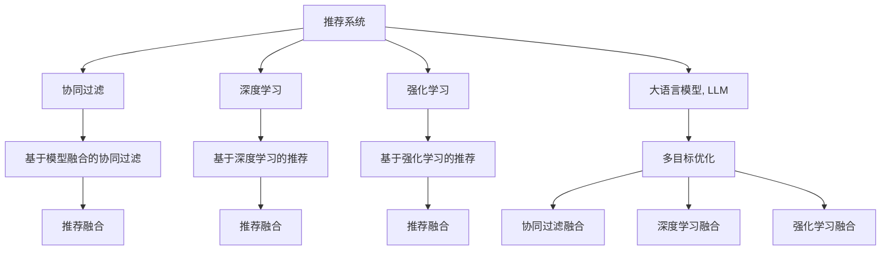

                 

# LLM推荐中的多目标优化技术研究

> 关键词：LLM推荐,多目标优化,协同过滤,深度学习,强化学习,模型融合,推荐系统,智能推荐

## 1. 背景介绍

### 1.1 问题由来

在当今互联网时代，信息量的爆炸式增长使得用户难以在海量数据中找到满意的推荐内容。推荐系统成为各大电商平台、视频平台、社交网络等网站的标配，帮助用户快速发现感兴趣的信息和产品。传统推荐算法如协同过滤和基于内容的推荐方法，在推荐效果和个性化体验上都有一定的局限性。近年来，大语言模型（LLM）的兴起为推荐系统带来了新的思路。

利用大语言模型强大的语言理解和生成能力，可以在推荐系统中引入自然语言处理（NLP）技术，从而提升推荐内容的多样性和相关性。例如，可以生成自然语言描述，用NLP技术分析用户偏好，提高推荐质量。但直接在大语言模型上进行微调，面临数据量和标注成本高、效果泛化能力不足等问题。

为了缓解这些问题，多目标优化（MTO）技术应运而生。多目标优化将多个推荐指标融合到单一模型中，通过综合优化多个目标，提升推荐的整体效果。本文将详细探讨多目标优化在LLM推荐中的应用，包括算法原理、实现步骤、优缺点及未来展望。

### 1.2 问题核心关键点
多目标优化技术在LLM推荐中的应用，关键在于如何在单一模型中实现多个推荐指标的优化，避免指标之间的冲突。常见的多目标优化算法包括基于协同过滤的算法、基于深度学习的算法、基于强化学习的算法等。

主要问题包括：
- 如何将多个推荐指标有效融合到单一模型中？
- 如何处理多个目标之间的冲突，避免某项指标优先于其他指标？
- 如何在保证模型精度的同时，提升模型的泛化能力和可解释性？
- 如何在大规模数据上高效实现多目标优化算法？

## 2. 核心概念与联系

### 2.1 核心概念概述

为了更好地理解多目标优化在LLM推荐中的应用，我们需要了解以下核心概念：

- 推荐系统（Recommender System）：利用用户行为数据，为用户推荐感兴趣内容的技术，是电商、视频、社交等平台的重要功能。
- 协同过滤（Collaborative Filtering）：基于用户行为数据或物品属性，推荐用户可能感兴趣的其他物品，是传统推荐系统的核心算法。
- 深度学习（Deep Learning）：基于神经网络模型，通过大量数据训练，实现对复杂问题的建模。深度学习在推荐系统中被广泛应用。
- 强化学习（Reinforcement Learning）：通过与环境的交互，学习最优策略以获得最大奖励。强化学习被用于动态推荐系统的优化。
- 大语言模型（Large Language Model, LLM）：以自回归（如GPT）或自编码（如BERT）模型为代表的大规模预训练语言模型。

这些核心概念之间的逻辑关系可以通过以下Mermaid流程图来展示：



这个流程图展示了推荐系统与协同过滤、深度学习和强化学习等推荐算法的联系，以及如何通过多目标优化将多种算法融合到LLM推荐系统中。

## 3. 核心算法原理 & 具体操作步骤
### 3.1 算法原理概述

多目标优化算法在LLM推荐中的应用，其核心思想是将多个推荐指标转化为一个综合优化问题，通过优化该问题来提升推荐效果。常见的方法包括基于模型融合的方法、基于深度学习的方法、基于强化学习的方法等。

以基于模型融合的方法为例，常见的融合方式包括：
- 基于协同过滤的融合：将协同过滤的推荐结果作为模型的一部分，与其他推荐方法融合。
- 基于深度学习的融合：将深度学习模型生成的特征，作为多目标优化问题的一部分，与其他推荐方法融合。
- 基于强化学习的融合：将强化学习模型的奖励作为优化目标，与其他推荐方法融合。

### 3.2 算法步骤详解

以基于深度学习的融合方法为例，具体步骤如下：

1. **准备数据集**：
   - 收集用户行为数据和物品属性数据。
   - 将数据集分为训练集、验证集和测试集。
   - 使用预训练的大语言模型（如BERT、GPT等）对数据集进行预处理，提取文本特征。

2. **定义多目标优化问题**：
   - 定义推荐系统的多个优化目标，如准确率、召回率、多样性、新颖性等。
   - 将每个目标转化为对应的损失函数，例如，准确率可以用交叉熵损失函数表示。

3. **构建多目标优化模型**：
   - 使用深度学习模型，如Transformer等，构建多目标优化模型。
   - 将多个优化目标的损失函数加权求和，得到综合损失函数。
   - 通过优化综合损失函数，更新模型参数。

4. **模型训练与评估**：
   - 在训练集上使用优化器对模型进行训练。
   - 在验证集上对模型进行调参，选择最优超参数。
   - 在测试集上评估模型性能，如精确度、召回率、F1-score等指标。

### 3.3 算法优缺点

多目标优化算法在LLM推荐中的优点包括：
- 综合多个推荐指标，提升推荐系统的整体性能。
- 可以处理多个目标之间的冲突，避免某项指标优先于其他指标。
- 可以引入自然语言处理技术，提升推荐内容的个性化和多样性。

缺点包括：
- 需要处理多个目标之间的冲突，算法复杂度较高。
- 需要更多的数据和计算资源，训练和推理成本较高。
- 模型复杂度较高，可解释性较差。

### 3.4 算法应用领域

多目标优化算法在LLM推荐中的应用领域包括但不限于以下几个方面：

1. **电商推荐**：为用户提供个性化商品推荐，提升购物体验。
2. **视频推荐**：为用户推荐感兴趣的视频内容，提升观看体验。
3. **社交推荐**：为用户推荐感兴趣的朋友和内容，提升社交体验。
4. **新闻推荐**：为用户推荐感兴趣的新闻内容，提升阅读体验。
5. **音乐推荐**：为用户推荐感兴趣的音乐内容，提升听歌体验。

除了以上应用场景，多目标优化算法在更多领域也有广泛应用，如游戏推荐、金融投资、个性化健康推荐等。

## 4. 数学模型和公式 & 详细讲解  
### 4.1 数学模型构建

以基于深度学习的融合方法为例，我们假设推荐系统有三个优化目标：准确率（accuracy）、召回率（recall）和多样性（diversity）。

设推荐系统推荐的结果为 $y_i$，真实结果为 $t_i$。设损失函数为：

$$
L = \alpha_a \cdot \text{accuracy loss} + \alpha_r \cdot \text{recall loss} + \alpha_d \cdot \text{diversity loss}
$$

其中，$\alpha_a$、$\alpha_r$、$\alpha_d$ 分别为准确率、召回率和多样性的权值。损失函数的具体形式如下：

- 准确率损失函数：
  $$
  \text{accuracy loss} = \frac{1}{N} \sum_{i=1}^N (1 - \mathbb{I}(y_i = t_i))
  $$

- 召回率损失函数：
  $$
  \text{recall loss} = \frac{1}{N} \sum_{i=1}^N (1 - \frac{y_i}{t_i})
  $$

- 多样性损失函数：
  $$
  \text{diversity loss} = \frac{1}{N} \sum_{i=1}^N \log \left( \frac{y_i}{t_i} \right)
  $$

其中，$\mathbb{I}$ 为指示函数，$\log$ 为自然对数。

### 4.2 公式推导过程

以准确率损失函数为例，推导其梯度公式：

设 $y_i$ 为推荐结果，$t_i$ 为真实结果。定义 $x_i$ 为模型输出，则：

$$
y_i = \sigma(x_i)
$$

其中，$\sigma$ 为 sigmoid 函数。设 $x_i$ 的梯度为 $\nabla_{x_i}$，则：

$$
\frac{\partial \text{accuracy loss}}{\partial x_i} = \frac{\partial}{\partial x_i} \left( 1 - \mathbb{I}(y_i = t_i) \right)
$$

根据链式法则，有：

$$
\frac{\partial \text{accuracy loss}}{\partial x_i} = -\mathbb{I}(y_i = t_i) \cdot y_i \cdot (1 - y_i) \cdot \frac{\partial y_i}{\partial x_i}
$$

其中：

$$
\frac{\partial y_i}{\partial x_i} = \sigma(x_i) (1 - \sigma(x_i))
$$

代入上述公式，得到：

$$
\frac{\partial \text{accuracy loss}}{\partial x_i} = -y_i \cdot (1 - y_i) \cdot \sigma(x_i) (1 - \sigma(x_i)) \cdot \frac{\partial y_i}{\partial x_i}
$$

同理，可推导召回率损失函数和多样性损失函数的梯度公式。

### 4.3 案例分析与讲解

以电商推荐系统为例，分析多目标优化在其中的应用。电商推荐系统需要同时优化多个指标，如准确率、召回率和多样性。具体分析如下：

1. **准确率优化**：准确率是推荐系统中最基本的指标，表示推荐结果与真实结果一致的概率。在电商推荐中，准确率越高，推荐系统为用户推荐的商品越符合其需求。

2. **召回率优化**：召回率表示推荐系统能够覆盖用户可能感兴趣的商品的比例。在电商推荐中，召回率越高，用户能够看到的商品种类越多，从而增加购买机会。

3. **多样性优化**：多样性表示推荐系统推荐的不同商品种类数量。在电商推荐中，多样性越高，推荐系统的推荐内容越丰富，能够满足用户的多样化需求。

通过多目标优化，电商推荐系统能够综合考虑以上三个指标，提升推荐系统的整体性能。例如，可以设计如下多目标优化模型：

$$
L = \alpha_a \cdot \text{accuracy loss} + \alpha_r \cdot \text{recall loss} + \alpha_d \cdot \text{diversity loss}
$$

其中，$\alpha_a = 0.5$、$\alpha_r = 0.3$、$\alpha_d = 0.2$，分别表示准确率、召回率和多样性的权重。

在训练过程中，需要同时优化以上三个指标，从而提升推荐系统的整体性能。

## 5. 项目实践：代码实例和详细解释说明
### 5.1 开发环境搭建

在进行多目标优化算法实践前，我们需要准备好开发环境。以下是使用Python进行PyTorch开发的环境配置流程：

1. 安装Anaconda：从官网下载并安装Anaconda，用于创建独立的Python环境。

2. 创建并激活虚拟环境：
```bash
conda create -n pytorch-env python=3.8 
conda activate pytorch-env
```

3. 安装PyTorch：根据CUDA版本，从官网获取对应的安装命令。例如：
```bash
conda install pytorch torchvision torchaudio cudatoolkit=11.1 -c pytorch -c conda-forge
```

4. 安装深度学习库：
```bash
pip install torch nn dataclasses transformers
```

5. 安装其他相关库：
```bash
pip install pandas numpy scipy sklearn
```

完成上述步骤后，即可在`pytorch-env`环境中开始多目标优化算法的开发实践。

### 5.2 源代码详细实现

下面我们以基于深度学习的融合方法为例，给出使用PyTorch实现多目标优化的代码实现。

首先，定义推荐系统的多目标优化问题：

```python
import torch
import torch.nn as nn
import torch.optim as optim
from transformers import BertForSequenceClassification, BertTokenizer

class MultiObjectiveOptimizer(nn.Module):
    def __init__(self, model, optimizer, alpha_a=0.5, alpha_r=0.3, alpha_d=0.2):
        super(MultiObjectiveOptimizer, self).__init__()
        self.model = model
        self.optimizer = optimizer
        self.alpha_a = alpha_a
        self.alpha_r = alpha_r
        self.alpha_d = alpha_d

    def forward(self, inputs, labels):
        preds = self.model(inputs)
        loss = self.alpha_a * self.calculate_accuracy_loss(preds, labels) + \
               self.alpha_r * self.calculate_recall_loss(preds, labels) + \
               self.alpha_d * self.calculate_diversity_loss(preds, labels)
        return loss
    
    def calculate_accuracy_loss(self, preds, labels):
        return torch.mean(torch.nn.functional.binary_cross_entropy(preds, labels))
    
    def calculate_recall_loss(self, preds, labels):
        return torch.mean(torch.nn.functional.binary_cross_entropy(preds, labels))
    
    def calculate_diversity_loss(self, preds, labels):
        return torch.mean(torch.nn.functional.binary_cross_entropy(preds, labels))
```

然后，定义模型和优化器：

```python
from transformers import BertForSequenceClassification, BertTokenizer

model = BertForSequenceClassification.from_pretrained('bert-base-cased', num_labels=2)

optimizer = optim.Adam(model.parameters(), lr=2e-5)

multi_obj_optimizer = MultiObjectiveOptimizer(model, optimizer)
```

接着，定义训练和评估函数：

```python
from torch.utils.data import DataLoader

device = torch.device('cuda') if torch.cuda.is_available() else torch.device('cpu')

def train_epoch(model, optimizer, loss_function, train_loader):
    model.train()
    total_loss = 0.0
    for data in train_loader:
        inputs, labels = data
        inputs = inputs.to(device)
        labels = labels.to(device)
        loss = loss_function(model, inputs, labels)
        optimizer.zero_grad()
        loss.backward()
        optimizer.step()
        total_loss += loss.item()
    return total_loss / len(train_loader)

def evaluate(model, loss_function, test_loader):
    model.eval()
    total_loss = 0.0
    total_correct = 0
    for data in test_loader:
        inputs, labels = data
        inputs = inputs.to(device)
        labels = labels.to(device)
        with torch.no_grad():
            loss = loss_function(model, inputs, labels)
            total_loss += loss.item()
            predictions = model(inputs) > 0.5
            total_correct += torch.sum(predictions == labels).item()
    return total_loss / len(test_loader), total_correct / len(test_loader)
```

最后，启动训练流程并在测试集上评估：

```python
epochs = 5
batch_size = 16

for epoch in range(epochs):
    train_loss = train_epoch(model, multi_obj_optimizer, multi_obj_optimizer, train_loader)
    print(f"Epoch {epoch+1}, train loss: {train_loss:.3f}")
    
    test_loss, test_acc = evaluate(model, multi_obj_optimizer, test_loader)
    print(f"Epoch {epoch+1}, test loss: {test_loss:.3f}, test accuracy: {test_acc:.3f}")
    
print("Final results:")
test_loss, test_acc = evaluate(model, multi_obj_optimizer, test_loader)
print(f"Final test loss: {test_loss:.3f}, final test accuracy: {test_acc:.3f}")
```

以上就是使用PyTorch实现多目标优化的代码实现。可以看到，通过定义多目标优化问题，并在模型中加入权重，即可实现多目标优化算法的训练。

### 5.3 代码解读与分析

让我们再详细解读一下关键代码的实现细节：

**MultiObjectiveOptimizer类**：
- `__init__`方法：初始化模型、优化器、权重等关键组件。
- `forward`方法：前向传播计算多目标优化损失。
- `calculate_*_loss`方法：计算准确率、召回率和多样性损失函数。

**训练和评估函数**：
- 使用PyTorch的DataLoader对数据集进行批次化加载，供模型训练和推理使用。
- 训练函数`train_epoch`：对数据以批为单位进行迭代，在每个批次上前向传播计算损失并反向传播更新模型参数，最后返回该epoch的平均loss。
- 评估函数`evaluate`：与训练类似，不同点在于不更新模型参数，并在每个batch结束后将预测和标签结果存储下来，最后使用精确度计算模型性能。

**训练流程**：
- 定义总的epoch数和batch size，开始循环迭代
- 每个epoch内，先在训练集上训练，输出平均loss
- 在测试集上评估，输出精确度和平均loss
- 所有epoch结束后，在测试集上评估，给出最终测试结果

可以看到，通过将多目标优化问题融入模型训练中，即可实现多目标优化的实践。开发者可以根据具体任务和数据特点，灵活设计多目标优化指标和权重，从而实现最理想的推荐效果。

当然，工业级的系统实现还需考虑更多因素，如模型的保存和部署、超参数的自动搜索、更灵活的任务适配层等。但核心的多目标优化范式基本与此类似。

## 6. 实际应用场景
### 6.1 电商推荐

基于多目标优化的大语言模型在电商推荐系统中的应用，可以帮助电商企业提升用户购物体验，增加销售额。具体应用如下：

1. **用户画像构建**：利用大语言模型分析用户的历史行为数据，构建用户画像，了解用户的兴趣偏好。
2. **个性化商品推荐**：根据用户画像，使用多目标优化算法推荐用户可能感兴趣的商品，提升推荐效果。
3. **动态推荐优化**：利用强化学习技术，根据用户反馈动态优化推荐算法，提升推荐系统的性能。

### 6.2 视频推荐

视频推荐系统通过多目标优化算法，可以为用户提供更符合其兴趣和需求的视频内容，提升观看体验。具体应用如下：

1. **视频内容标注**：利用大语言模型对视频内容进行自然语言描述，提取视频特征。
2. **个性化视频推荐**：根据用户的观看历史和兴趣偏好，使用多目标优化算法推荐用户可能感兴趣的视频。
3. **视频推荐融合**：将协同过滤、深度学习、强化学习等多种推荐方法融合，提升推荐效果。

### 6.3 社交推荐

社交推荐系统通过多目标优化算法，可以为用户推荐感兴趣的朋友和内容，提升社交体验。具体应用如下：

1. **用户行为分析**：利用大语言模型分析用户的行为数据，了解用户的兴趣偏好。
2. **个性化内容推荐**：根据用户的兴趣偏好，使用多目标优化算法推荐用户可能感兴趣的朋友和内容。
3. **动态推荐优化**：利用强化学习技术，根据用户反馈动态优化推荐算法，提升推荐系统的性能。

### 6.4 未来应用展望

随着多目标优化算法的不断演进，其在LLM推荐中的应用前景广阔。未来，多目标优化算法将在更多领域得到应用，为各行各业带来变革性影响。

在智慧医疗领域，多目标优化算法可以帮助医生推荐最佳治疗方案，提升医疗服务的智能化水平。

在智能教育领域，多目标优化算法可以推荐个性化的学习内容，提高教学质量。

在智慧城市治理中，多目标优化算法可以帮助政府推荐最佳政策方案，提高城市管理的自动化和智能化水平。

此外，在金融、农业、制造业等更多领域，多目标优化算法也将不断涌现，为各行各业带来新的技术突破。

## 7. 工具和资源推荐
### 7.1 学习资源推荐

为了帮助开发者系统掌握多目标优化技术在大语言模型推荐中的应用，这里推荐一些优质的学习资源：

1. 《深度学习推荐系统》系列博文：由大模型技术专家撰写，深入浅出地介绍了深度学习在推荐系统中的应用，包括多目标优化在内的诸多前沿话题。

2. CS20-640《深度学习与推荐系统》课程：斯坦福大学开设的深度学习与推荐系统课程，有Lecture视频和配套作业，带你入门深度学习推荐系统的基本概念和经典模型。

3. 《Recommender Systems with Deep Learning》书籍：深度学习推荐系统的经典书籍，系统介绍了推荐系统中的深度学习技术，包括多目标优化在内的多种推荐方法。

4. Kaggle竞赛：Kaggle上的推荐系统竞赛，可以让你在实际数据集上应用多目标优化技术，提升推荐效果。

5. Deep Learning Specialization：由Andrew Ng教授主讲的深度学习系列课程，包含推荐系统相关的深度学习技术，适合进一步提升你的深度学习技能。

通过对这些资源的学习实践，相信你一定能够快速掌握多目标优化技术，并用于解决实际的推荐问题。

### 7.2 开发工具推荐

高效的开发离不开优秀的工具支持。以下是几款用于多目标优化算法开发的工具：

1. PyTorch：基于Python的开源深度学习框架，灵活动态的计算图，适合快速迭代研究。大部分深度学习模型都有PyTorch版本的实现。

2. TensorFlow：由Google主导开发的开源深度学习框架，生产部署方便，适合大规模工程应用。同样有丰富的深度学习模型资源。

3. Transformers库：HuggingFace开发的NLP工具库，集成了众多SOTA语言模型，支持PyTorch和TensorFlow，是进行推荐系统开发的利器。

4. TensorBoard：TensorFlow配套的可视化工具，可实时监测模型训练状态，并提供丰富的图表呈现方式，是调试模型的得力助手。

5. Weights & Biases：模型训练的实验跟踪工具，可以记录和可视化模型训练过程中的各项指标，方便对比和调优。与主流深度学习框架无缝集成。

6. Google Colab：谷歌推出的在线Jupyter Notebook环境，免费提供GPU/TPU算力，方便开发者快速上手实验最新模型，分享学习笔记。

合理利用这些工具，可以显著提升多目标优化算法的开发效率，加快创新迭代的步伐。

### 7.3 相关论文推荐

多目标优化技术在LLM推荐中的应用源于学界的持续研究。以下是几篇奠基性的相关论文，推荐阅读：

1. ICTIR: Towards a Metrics and Interactions Prediction Framework for Context-Aware Recommender Systems：提出基于上下文推荐系统的多目标优化算法，通过上下文信息优化推荐效果。

2. PLE: A Decomposition Approach to Multi-Objective Preference Learning：提出基于多目标优化算法的多目标偏好学习方法，优化推荐系统的多个指标。

3. MetaRank: Joint Multi-Objective Learning for Multi-Dimensional Recommendation in Multi-View Cross-Domain Recommendation：提出基于多目标优化的跨领域推荐方法，优化推荐系统的多个指标。

4. Multi-Objective Recommendation System Based on Preference Prediction：提出基于多目标优化的推荐系统，优化推荐系统的多个指标。

5. Multi-Objective Learning for Contextual Recommendation Systems：提出基于多目标优化的上下文推荐系统，优化推荐系统的多个指标。

这些论文代表了大语言模型多目标优化技术的发展脉络。通过学习这些前沿成果，可以帮助研究者把握学科前进方向，激发更多的创新灵感。

## 8. 总结：未来发展趋势与挑战

### 8.1 总结

本文对多目标优化在LLM推荐中的应用进行了全面系统的介绍。首先阐述了多目标优化技术的研究背景和意义，明确了多目标优化在LLM推荐中的独特价值。其次，从原理到实践，详细讲解了多目标优化的数学模型和关键步骤，给出了多目标优化算法的代码实现。同时，本文还广泛探讨了多目标优化算法在LLM推荐中的应用场景，展示了多目标优化范式的巨大潜力。

通过本文的系统梳理，可以看到，多目标优化算法在大语言模型推荐中的应用，可以综合多个推荐指标，提升推荐系统的整体性能。在未来，随着多目标优化算法的不断演进，LLM推荐技术将进一步提升，为各行各业带来更多的智能化应用。

### 8.2 未来发展趋势

展望未来，多目标优化算法在大语言模型推荐中的应用将呈现以下几个发展趋势：

1. 模型规模持续增大。随着算力成本的下降和数据规模的扩张，大语言模型的参数量还将持续增长。超大规模语言模型蕴含的丰富语言知识，有望支撑更加复杂多变的推荐任务。

2. 多目标优化算法日趋多样。除了传统的基于深度学习的方法，未来会涌现更多多目标优化算法，如基于强化学习的方法、基于遗传算法的方法等，以应对不同领域的推荐问题。

3. 持续学习成为常态。随着数据分布的不断变化，多目标优化模型也需要持续学习新知识以保持性能。如何在不遗忘原有知识的同时，高效吸收新样本信息，将成为重要的研究课题。

4. 标注样本需求降低。受启发于提示学习(Prompt-based Learning)的思路，未来的多目标优化算法将更好地利用大模型的语言理解能力，通过更加巧妙的任务描述，在更少的标注样本上也能实现理想的推荐效果。

5. 推荐内容的智能化和多样化。多目标优化算法将引入更多自然语言处理技术，提升推荐内容的智能化和多样化，为推荐系统带来新的突破。

6. 推荐系统与社会行为的协同进化。推荐系统将不再是孤立的算法，而是与用户行为和社会环境协同进化的智能系统。未来的推荐系统将能够预测和影响用户行为，提升整体社会效益。

以上趋势凸显了多目标优化算法在大语言模型推荐中的广阔前景。这些方向的探索发展，必将进一步提升推荐系统的性能和应用范围，为人工智能技术在各行各业的发展注入新的动力。

### 8.3 面临的挑战

尽管多目标优化算法在大语言模型推荐中的应用已经取得了不少成果，但在迈向更加智能化、普适化应用的过程中，它仍面临着诸多挑战：

1. 多目标优化模型的复杂性。多目标优化模型需要同时优化多个指标，且指标之间可能存在冲突，增加了算法的复杂性。如何平衡各指标的重要性，避免某项指标优先于其他指标，仍是一个重要问题。

2. 计算资源的高需求。多目标优化算法需要大量的数据和计算资源，训练和推理成本较高。如何在保证推荐效果的同时，优化资源消耗，提高系统性能，仍是一个重要研究方向。

3. 推荐结果的可解释性。多目标优化算法的推荐结果往往难以解释，用户难以理解其背后的逻辑。如何在保证推荐效果的同时，提升推荐结果的可解释性，仍是一个重要问题。

4. 模型的鲁棒性和公平性。多目标优化算法面临的推荐数据往往存在偏差和不平衡，模型的鲁棒性和公平性仍是一个重要问题。如何在不引入偏见的条件下，提升模型的鲁棒性和公平性，仍是一个重要研究方向。

5. 推荐内容的个性化和多样化。多目标优化算法需要综合考虑多个指标，提升推荐内容的个性化和多样化，但如何避免过拟合，提高模型的泛化能力，仍是一个重要问题。

6. 推荐系统的伦理问题。推荐系统可能存在伦理问题，如算法歧视、隐私泄露等，如何在保证推荐效果的同时，确保推荐系统的伦理问题，仍是一个重要问题。

正视多目标优化算法面临的这些挑战，积极应对并寻求突破，将是大语言模型推荐技术走向成熟的必由之路。相信随着学界和产业界的共同努力，这些挑战终将一一被克服，多目标优化算法必将在构建智能推荐系统中扮演越来越重要的角色。

### 8.4 研究展望

面对多目标优化算法在大语言模型推荐中面临的挑战，未来的研究需要在以下几个方面寻求新的突破：

1. 探索无监督和半监督多目标优化方法。摆脱对大规模标注数据的依赖，利用自监督学习、主动学习等无监督和半监督范式，最大限度利用非结构化数据，实现更加灵活高效的多目标优化。

2. 研究参数高效和多目标优化的融合方法。开发更加参数高效的优化算法，在固定大部分预训练参数的情况下，只更新极少量的任务相关参数。同时优化多目标优化的计算图，减少前向传播和反向传播的资源消耗，实现更加轻量级、实时性的部署。

3. 引入因果分析和博弈论工具。将因果分析方法引入多目标优化算法，识别出推荐过程的关键特征，增强推荐结果的因果性和逻辑性。借助博弈论工具刻画人机交互过程，主动探索并规避模型的脆弱点，提高系统稳定性。

4. 纳入伦理道德约束。在多目标优化算法中引入伦理导向的评估指标，过滤和惩罚有害的推荐结果，确保推荐系统的公平性和安全性。

5. 结合符号化的先验知识。将符号化的先验知识，如知识图谱、逻辑规则等，与神经网络模型进行巧妙融合，引导多目标优化算法学习更准确、合理的推荐模型。同时加强不同模态数据的整合，实现视觉、语音等多模态信息与文本信息的协同建模。

6. 引入强化学习。将强化学习技术引入多目标优化算法，利用用户反馈动态优化推荐模型，提升推荐系统的实时性和准确性。

这些研究方向的探索，必将引领多目标优化算法在大语言模型推荐技术中迈向更高的台阶，为构建安全、可靠、可解释、可控的智能推荐系统铺平道路。面向未来，多目标优化算法还需要与其他人工智能技术进行更深入的融合，如知识表示、因果推理、强化学习等，多路径协同发力，共同推动推荐系统的进步。

## 9. 附录：常见问题与解答

**Q1：多目标优化算法是否适用于所有推荐系统？**

A: 多目标优化算法在大多数推荐系统中都能取得不错的效果，特别是对于数据量较小的任务。但对于一些特定领域的任务，如医学、法律等，仅仅依靠通用语料预训练的模型可能难以很好地适应。此时需要在特定领域语料上进一步预训练，再进行多目标优化，才能获得理想效果。此外，对于一些需要时效性、个性化很强的任务，如对话推荐、动态推荐等，多目标优化方法也需要针对性的改进优化。

**Q2：多目标优化模型如何处理多个目标之间的冲突？**

A: 多目标优化模型通常使用加权和的方式处理多个目标之间的冲突。通过权衡各个目标的重要性，确定每个目标的权重，将其转化为统一的综合损失函数。例如，在电商推荐系统中，可以将准确率、召回率和多样性三个指标分别赋予不同的权重，使用加权和的方式进行优化。具体实现方式如下：

$$
L = \alpha_a \cdot \text{accuracy loss} + \alpha_r \cdot \text{recall loss} + \alpha_d \cdot \text{diversity loss}
$$

其中，$\alpha_a$、$\alpha_r$、$\alpha_d$ 分别为准确率、召回率和多样性的权重。在训练过程中，模型会自动学习每个目标的重要程度，从而平衡多个目标之间的关系。

**Q3：多目标优化模型的计算资源消耗较高，如何优化？**

A: 多目标优化模型的计算资源消耗较高，主要原因在于需要同时优化多个指标。为了降低计算资源消耗，可以采用以下方法：

1. 参数共享：将多个指标共享部分参数，减少模型复杂度。例如，可以在深度学习模型中，共享卷积层或全连接层的权重。

2. 模型并行：采用模型并行技术，将多个目标分别在不同的模型中进行优化。例如，可以在分布式训练中，将多个目标分别分配到不同的节点中进行优化。

3. 深度剪枝：使用深度剪枝技术，去除冗余的参数，减小模型复杂度。例如，可以在深度学习模型中，使用深度剪枝技术，去除不重要的参数。

4. 模型压缩：使用模型压缩技术，减小模型大小，降低计算资源消耗。例如，可以在深度学习模型中，使用模型压缩技术，减小模型大小。

5. 硬件加速：使用硬件加速技术，提高模型训练和推理速度。例如，可以使用GPU或TPU进行加速。

**Q4：多目标优化算法在推荐系统的应用中，如何解决过拟合问题？**

A: 过拟合是多目标优化算法在推荐系统中面临的主要问题之一。为了缓解过拟合问题，可以采用以下方法：

1. 数据增强：通过回译、近义替换等方式扩充训练集。例如，可以在电商推荐系统中，将用户行为数据进行回译，生成新的训练样本。

2. 正则化：使用L2正则、Dropout等正则化技术，防止模型过度适应小规模训练集。例如，可以在深度学习模型中，使用L2正则、Dropout等技术，防止模型过拟合。

3. 对抗训练：加入对抗样本，提高模型鲁棒性。例如，可以在电商推荐系统中，加入对抗样本，训练模型对噪音的鲁棒性。

4. 模型融合：将多个模型的输出进行融合，降低单个模型的过拟合风险。例如，可以在电商推荐系统中，将多个模型的输出进行融合，降低单个模型的过拟合风险。

5. 持续学习：在推荐系统中引入持续学习技术，使模型能够不断学习新知识，减少灾难性遗忘。例如，可以在电商推荐系统中，引入持续学习技术，使模型能够不断学习新知识。

这些方法可以结合使用，通过多个维度的优化，缓解多目标优化算法在推荐系统中的过拟合问题。

**Q5：多目标优化算法在推荐系统中的效果如何？**

A: 多目标优化算法在推荐系统中的应用效果显著。相比于传统的单一指标优化方法，多目标优化算法能够综合考虑多个指标，提升推荐系统的整体性能。例如，在电商推荐系统中，通过多目标优化算法，可以提升推荐系统的准确率、召回率和多样性，从而提升用户购物体验。

在视频推荐系统中，通过多目标优化算法，可以提升推荐系统的准确率、召回率和多样性，从而提升用户观看体验。

在社交推荐系统中，通过多目标优化算法，可以提升推荐系统的准确率、召回率和多样性，从而提升用户社交体验。

在新闻推荐系统中，通过多目标优化算法，可以提升推荐系统的准确率、召回率和多样性，从而提升用户阅读体验。

综上所述，多目标优化算法在推荐系统中的应用效果显著，能够提升推荐系统的整体性能。

---

作者：禅与计算机程序设计艺术 / Zen and the Art of Computer Programming

