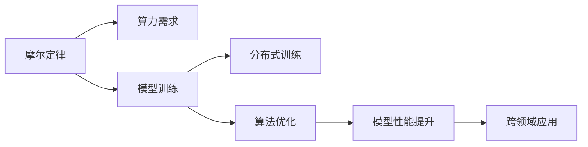

                 

# LLM是否会迎来自己的摩尔定律?

> 关键词：大语言模型(LLM),摩尔定律,模型训练,算力需求,深度学习,人工智能

## 1. 背景介绍

### 1.1 问题由来
在计算机技术领域，摩尔定律一直被视为推动技术进步的核心动力。随着半导体工艺的不断发展，集成电路的集成度呈指数级提升，芯片性能和能效不断增强，推动了从个人电脑到超级计算机的广泛应用。而今天，我们正站在人工智能的新起点上，大语言模型(LLM)作为AI领域的新兴技术，其性能提升是否会遵循类似的摩尔定律，迎来指数级的增长？

### 1.2 问题核心关键点
大语言模型，即能通过自监督学习从大规模文本数据中学习语言知识和常识，并在特定任务上进行微调以获得优异的性能。这些模型通常包含数十亿个参数，并在分布式集群上进行训练。相比传统的算法模型，大语言模型需要更强大的算力和更复杂的训练过程。

1. **算力需求**：大语言模型的训练和推理需要大量的算力支持，包括高性能GPU、TPU等设备。训练过程通常涉及数百万个样本，时间成本高昂。

2. **模型更新**：随着新任务的出现，模型的微调和更新变得更为频繁，如何在保证性能的同时降低训练成本，成为了研究焦点。

3. **硬件与软件协同**：算力提升依赖于硬件的进步，但软件架构和算法优化也至关重要。如何优化模型训练和推理流程，提高计算效率，是提升大语言模型性能的关键。

4. **跨领域应用**：大语言模型在各个领域的应用日益广泛，从自然语言处理到图像识别，从智能客服到医疗诊断，未来其应用范围将进一步扩展。

## 2. 核心概念与联系

### 2.1 核心概念概述

为深入理解大语言模型是否会迎来自己的摩尔定律，需要先了解几个核心概念：

- **摩尔定律**：由英特尔联合创始人戈登·摩尔提出，预测集成电路的集成度每18个月翻一番，性能提升并保持能耗不变。
- **大语言模型(LLM)**：以Transformer为基础的大规模预训练语言模型，能够理解自然语言的含义和结构，执行复杂的语言任务。
- **模型训练**：通过大量数据和算力，训练大语言模型，优化其参数以提升模型性能。
- **分布式训练**：使用多台计算机并行训练大模型，提高训练速度和效率。
- **算法优化**：通过改进优化算法、模型结构和计算流程，提高模型训练和推理的效率。

这些概念之间的逻辑关系可以通过以下Mermaid流程图来展示：



### 2.2 核心概念原理和架构的 Mermaid 流程图

```mermaid
graph LR
    A[大语言模型(LLM)] --> B[预训练]
    A --> C[微调]
    C --> D[全参数微调]
    C --> E[参数高效微调]
    A --> F[分布式训练]
    F --> G[多机多卡训练]
    A --> H[算法优化]
    H --> I[模型压缩]
    I --> J[梯度累积]
    H --> K[混合精度训练]
    A --> L[量化加速]
    L --> M[模型并行]
    A --> N[硬件进步]
    N --> O[专用硬件]
    N --> P[通用硬件]
    O --> Q[TPU]
    P --> R[GPU]
```

## 3. 核心算法原理 & 具体操作步骤

### 3.1 算法原理概述

大语言模型的训练和性能提升遵循与传统计算机技术类似的摩尔定律。即随着硬件性能的提升和算法优化的不断进步，大语言模型的计算能力将呈指数级增长。以下是具体原理和操作步骤：

### 3.2 算法步骤详解

#### 3.2.1 算法原理概述

大语言模型的训练和性能提升遵循与传统计算机技术类似的摩尔定律。即随着硬件性能的提升和算法优化的不断进步，大语言模型的计算能力将呈指数级增长。以下是具体原理和操作步骤：

1. **硬件进步**：
   - **芯片集成度提升**：新工艺的采用使得集成电路的集成度更高，芯片性能更强。
   - **专用硬件设计**：如TPU、FPGA等专用硬件的设计，进一步提升了计算效率。
   - **分布式计算**：多机多卡并行计算，显著提高了训练速度。

2. **算法优化**：
   - **模型压缩**：通过剪枝、量化等方法，减小模型参数规模，减少计算量。
   - **梯度累积**：多批次合并为一个批次进行计算，提高计算效率。
   - **混合精度训练**：使用32位和16位精度混合计算，降低内存消耗和计算时间。
   - **模型并行**：使用数据并行、模型并行等技术，进一步提升计算速度。

3. **分布式训练**：
   - **多机多卡并行**：利用多台计算机和多个GPU进行并行计算，缩短训练时间。
   - **参数分布式优化**：分布式优化算法如DeepSpeed、Horovod等，提高了参数更新效率。

#### 3.2.2 算法步骤详解

1. **预训练阶段**：
   - 收集大规模无标签文本数据，使用自监督学习任务进行预训练，如掩码语言模型、预测下一位等。
   - 使用分布式训练，在多台机器上进行大规模并行计算。
   - 使用算法优化，如模型压缩、混合精度训练等，提高计算效率。

2. **微调阶段**：
   - 选择合适的下游任务，收集少量标注数据。
   - 使用全参数微调或参数高效微调，根据具体任务需求调整模型参数。
   - 应用数据增强、正则化等技术，防止过拟合。

3. **性能评估和优化**：
   - 在验证集上评估模型性能，根据结果调整学习率、优化器等超参数。
   - 应用模型压缩、量化等技术，减小模型参数规模，提高推理效率。
   - 使用分布式训练，进一步加速模型训练和推理。

### 3.3 算法优缺点

#### 3.3.1 算法优点

- **高效训练**：通过分布式训练和多机多卡并行，显著缩短训练时间。
- **算法优化**：多种优化方法如混合精度训练、模型压缩等，提高了计算效率和模型性能。
- **模型压缩**：通过剪枝、量化等技术，减小模型参数规模，降低了计算资源需求。

#### 3.3.2 算法缺点

- **高硬件需求**：大语言模型需要高性能的GPU、TPU等设备，初期投入较大。
- **训练成本高**：大规模训练需要大量算力，成本高昂。
- **算法复杂性**：分布式训练和算法优化技术要求高，需要专业的知识和经验。

### 3.4 算法应用领域

大语言模型在多个领域得到了广泛应用，包括：

- **自然语言处理**：文本分类、情感分析、机器翻译、问答系统等。
- **计算机视觉**：图像分类、目标检测、图像生成等。
- **语音识别**：语音转文本、语音合成等。
- **机器人学**：智能对话、决策支持、自动化控制等。
- **金融科技**：风险评估、投资分析、客户服务等。

## 4. 数学模型和公式 & 详细讲解 & 举例说明

### 4.1 数学模型构建

大语言模型的训练通常基于大规模无标签文本数据，通过自监督学习任务进行预训练。以下是一个简单的预训练模型的数学模型构建过程：

1. **自监督学习任务**：
   - **掩码语言模型**：对于每个输入的文本，随机掩码其中的一些位置，然后预测这些位置的词。
   - **预测下一位**：对于每个输入的文本，预测下一个单词或字符。

2. **损失函数**：
   - **交叉熵损失**：对于掩码语言模型，使用交叉熵损失衡量预测与真实标签的差异。
   - **序列到序列模型**：对于预测下一位，使用序列到序列模型的损失函数，如TensorFlow中的`tf.keras.losses.SparseCategoricalCrossentropy`。

3. **优化器**：
   - **AdamW**：一种自适应优化算法，结合了Adagrad和RMSprop的优点。
   - **SGD**：一种基本的优化算法，用于大规模数据集的训练。

### 4.2 公式推导过程

#### 4.2.1 掩码语言模型

对于一个长度为 $L$ 的文本序列 $x=(x_1, x_2, ..., x_L)$，掩码 $M$ 表示被随机掩码的位置。假设掩码后的文本序列为 $x^M$，模型预测的序列为 $\hat{x}^M$。掩码语言模型的损失函数为：

$$
\mathcal{L}(x, \hat{x}^M) = -\frac{1}{L} \sum_{i=1}^{L} \mathbb{1}(i \in M) \log \hat{x}_i
$$

其中 $\mathbb{1}(i \in M)$ 为 indicator 函数，当 $i$ 在掩码位置时，$\mathbb{1}(i \in M) = 1$，否则为0。

#### 4.2.2 预测下一位

对于文本序列 $x=(x_1, x_2, ..., x_L)$，模型预测的下一位单词为 $\hat{x}_{L+1}$。预测下一位的损失函数为：

$$
\mathcal{L}(x, \hat{x}_{L+1}) = -\log \hat{x}_{L+1}
$$

### 4.3 案例分析与讲解

#### 4.3.1 案例分析

以BERT模型为例，其预训练过程包括以下步骤：

1. **数据准备**：
   - 收集大规模无标签文本数据，如 Wikipedia 和新闻数据。
   - 将数据分为训练集、验证集和测试集。

2. **模型构建**：
   - 使用Transformer模型结构，包含自注意力机制。
   - 使用BERT的掩码语言模型和下一句预测任务。

3. **训练过程**：
   - 使用分布式训练，在多个GPU上进行并行计算。
   - 使用AdamW优化器和交叉熵损失函数。
   - 设置训练轮数和批大小。

#### 4.3.2 讲解

BERT的预训练过程主要通过自监督学习任务，使得模型学习了丰富的语言知识。在训练过程中，模型参数通过反向传播不断更新，以最小化损失函数。通过大量的训练数据和算力支持，BERT模型逐渐从无标签数据中学习到语言的通用表示。

## 5. 项目实践：代码实例和详细解释说明

### 5.1 开发环境搭建

1. **安装Python**：从官网下载并安装Python，版本建议为3.8以上。
2. **安装PyTorch**：使用以下命令进行安装。
   ```bash
   pip install torch torchvision torchaudio
   ```
3. **安装TensorFlow**：使用以下命令进行安装。
   ```bash
   pip install tensorflow tensorflow-addons
   ```
4. **安装Horovod**：使用以下命令进行安装。
   ```bash
   pip install horovod
   ```

### 5.2 源代码详细实现

以下是一个简单的BERT模型微调的代码实现：

```python
import torch
import torch.nn as nn
import torch.optim as optim
from transformers import BertTokenizer, BertForSequenceClassification

# 准备数据
tokenizer = BertTokenizer.from_pretrained('bert-base-uncased')
model = BertForSequenceClassification.from_pretrained('bert-base-uncased', num_labels=2)

# 定义训练函数
def train(model, train_loader, optimizer, device):
    model.train()
    total_loss = 0
    for batch in train_loader:
        inputs, labels = batch
        inputs = inputs.to(device)
        labels = labels.to(device)
        outputs = model(inputs)
        loss = nn.CrossEntropyLoss()(outputs, labels)
        optimizer.zero_grad()
        loss.backward()
        optimizer.step()
        total_loss += loss.item()
    return total_loss / len(train_loader)

# 定义评估函数
def evaluate(model, test_loader, device):
    model.eval()
    total_loss = 0
    correct = 0
    with torch.no_grad():
        for batch in test_loader:
            inputs, labels = batch
            inputs = inputs.to(device)
            labels = labels.to(device)
            outputs = model(inputs)
            loss = nn.CrossEntropyLoss()(outputs, labels)
            total_loss += loss.item()
            _, preds = torch.max(outputs, 1)
            correct += torch.sum(preds == labels.data)
    return total_loss / len(test_loader), correct / len(test_loader.dataset)

# 训练模型
device = torch.device('cuda' if torch.cuda.is_available() else 'cpu')
train_loader = torch.utils.data.DataLoader(train_dataset, batch_size=16, shuffle=True)
test_loader = torch.utils.data.DataLoader(test_dataset, batch_size=16, shuffle=False)
optimizer = optim.Adam(model.parameters(), lr=2e-5)

for epoch in range(10):
    train_loss = train(model, train_loader, optimizer, device)
    test_loss, acc = evaluate(model, test_loader, device)
    print(f'Epoch {epoch+1}, Train Loss: {train_loss:.4f}, Test Loss: {test_loss:.4f}, Accuracy: {acc:.4f}')
```

### 5.3 代码解读与分析

#### 5.3.1 代码解读

- **数据准备**：使用BertTokenizer进行文本预处理，将文本转换为模型可接受的格式。
- **模型构建**：使用BertForSequenceClassification模型，并指定标签数为2。
- **训练函数**：对模型进行前向传播，计算损失，反向传播更新参数。
- **评估函数**：对模型进行前向传播，计算损失，评估模型准确率。
- **训练循环**：在训练集和测试集上不断迭代训练，调整模型参数。

#### 5.3.2 代码分析

- **模型选择**：根据任务需求选择合适的模型架构，如Bert、RoBERTa等。
- **数据加载**：使用DataLoader将数据集加载到模型中，设置批大小和是否洗牌。
- **优化器**：选择合适的优化器，如Adam、SGD等，并设置学习率。
- **损失函数**：根据任务类型选择合适的损失函数，如交叉熵、均方误差等。

## 6. 实际应用场景

### 6.1 智能客服系统

大语言模型在智能客服系统中有着广泛的应用。通过微调，模型能够理解客户的问题，并提供相关的解答或解决方案。系统可以在处理大量客户咨询时，保持高效和一致的响应，显著提高客户满意度。

### 6.2 金融舆情监测

在金融领域，大语言模型可以用于舆情监测和情感分析。通过微调，模型能够自动分析市场新闻、评论等，识别负面信息，帮助金融机构及时应对市场风险。

### 6.3 个性化推荐系统

在电商、视频等个性化推荐场景中，大语言模型可以用于用户兴趣的分析和推荐内容的生成。通过微调，模型能够更好地理解用户行为，提供更加精准的推荐内容，提升用户体验。

## 7. 工具和资源推荐

### 7.1 学习资源推荐

1. **《深度学习》(Deep Learning) by Ian Goodfellow**：深入讲解深度学习的基本原理和算法。
2. **《Transformer》by Jacob Devlin et al**：详细介绍Transformer模型的原理和实现。
3. **HuggingFace官方文档**：包含大量预训练模型的介绍和微调样例。
4. **OpenAI Blog**：定期发布关于大语言模型和微调的最新研究进展。

### 7.2 开发工具推荐

1. **PyTorch**：强大的深度学习框架，支持分布式训练和模型压缩。
2. **TensorFlow**：领先的深度学习框架，支持多种硬件加速和分布式训练。
3. **Horovod**：开源的分布式深度学习框架，支持多种深度学习框架。
4. **TensorBoard**：用于可视化深度学习模型训练的实时监控工具。

### 7.3 相关论文推荐

1. **Attention is All You Need**：Transformer模型的提出，开启了深度学习领域的新纪元。
2. **BERT: Pre-training of Deep Bidirectional Transformers for Language Understanding**：提出BERT模型，使得预训练语言模型在NLP任务上取得突破。
3. **AdamW: A Method for Stable and Efficient Training of Deep Learning Models**：提出AdamW优化器，加速深度学习模型的训练。

## 8. 总结：未来发展趋势与挑战

### 8.1 研究成果总结

大语言模型在多个领域展示了其强大的能力和应用潜力。通过微调，模型可以在特定任务上取得优异的性能，显著提升工作效率和用户体验。

### 8.2 未来发展趋势

1. **算力需求提升**：随着模型复杂度的增加，算力需求将持续增长，推动硬件和软件技术的发展。
2. **算法优化进步**：分布式训练、混合精度训练等技术将进一步提升计算效率和模型性能。
3. **跨领域应用拓展**：大语言模型将在更多垂直行业得到应用，推动AI技术的普及和落地。
4. **知识整合能力增强**：模型将更好地整合外部知识，提升知识推理和推理能力。

### 8.3 面临的挑战

1. **高昂的初期投入**：高性能硬件设备和算力投入高，初期成本较大。
2. **训练时间漫长**：大规模模型训练时间长，需要优化算法和硬件加速。
3. **模型复杂性增加**：模型结构复杂，需要专业的知识和经验。
4. **数据依赖性强**：模型的性能依赖于大规模高质量数据，数据获取困难。

### 8.4 研究展望

1. **高效训练技术**：开发更高效的分布式训练和算法优化技术，缩短训练时间，降低成本。
2. **模型压缩与量化**：通过剪枝、量化等方法，减小模型参数规模，降低内存消耗和计算时间。
3. **跨领域知识整合**：整合外部知识，提升模型的知识推理和推理能力。
4. **模型解释性与可解释性**：提高模型的可解释性，增强其决策过程的透明度和可信度。

## 9. 附录：常见问题与解答

**Q1：大语言模型微调是否适用于所有NLP任务？**

A: 大语言模型微调在大多数NLP任务上都能取得不错的效果，特别是对于数据量较小的任务。但对于一些特定领域的任务，如医学、法律等，仅仅依靠通用语料预训练的模型可能难以很好地适应。此时需要在特定领域语料上进一步预训练，再进行微调，才能获得理想效果。此外，对于一些需要时效性、个性化很强的任务，如对话、推荐等，微调方法也需要针对性的改进优化。

**Q2：大语言模型训练和推理需要哪些硬件支持？**

A: 大语言模型训练和推理需要高性能的GPU、TPU等设备，以及分布式计算能力。具体硬件需求取决于模型规模和任务复杂度。

**Q3：如何提高大语言模型的训练效率？**

A: 可以通过算法优化如混合精度训练、梯度累积、模型压缩等技术，提高大语言模型的训练效率。同时，利用分布式计算和专用硬件，如TPU，进一步加速训练过程。

**Q4：大语言模型在实际应用中面临哪些挑战？**

A: 大语言模型在实际应用中面临高昂的初期投入、训练时间漫长、模型复杂性增加等挑战。需要开发更高效的训练算法和硬件支持，优化模型结构，整合外部知识，提升模型的可解释性。

**Q5：未来大语言模型的发展方向是什么？**

A: 未来大语言模型将朝着高效训练、参数高效微调、跨领域知识整合、可解释性增强等方向发展，推动其在更多垂直行业的落地应用。

**Q6：如何保障大语言模型的安全性？**

A: 保障大语言模型的安全性，需要从数据预处理、模型训练、部署等多个环节进行严格控制，避免有害信息的传播和模型误用的发生。

---

作者：禅与计算机程序设计艺术 / Zen and the Art of Computer Programming

