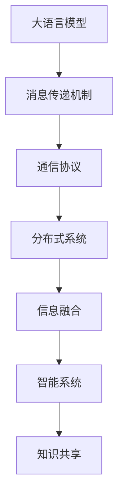

                 

# LLM消息机制:智能系统的通信桥梁

> 关键词：大语言模型(LLM),消息传递机制,通信协议,分布式系统,信息融合,智能系统,知识共享

## 1. 背景介绍

### 1.1 问题由来

随着人工智能技术的发展，特别是大语言模型（Large Language Model, LLM）的涌现，智能系统在各个领域得到了广泛应用，如智能客服、智能医疗、智能推荐等。然而，尽管智能系统在处理单个任务时表现出强大的能力，但在涉及多个组件协同工作时，仍然面临诸多挑战。

如何实现不同智能组件之间的无缝通信与信息共享，使得系统能够灵活地进行任务调度与知识整合，成为当前智能系统设计中的一个重要课题。基于大语言模型的消息机制提供了一种高效、灵活、可扩展的通信解决方案，能够满足智能系统在分布式环境中的通信需求。

### 1.2 问题核心关键点

大语言模型消息机制的核心在于：

- **通信协议**：定义智能组件之间交互的语言和格式，确保不同组件能够互相理解和协作。
- **信息融合**：将多个来源的信息进行整合，形成更加全面、准确的模型输出。
- **分布式协作**：通过消息机制，实现智能组件的分布式部署和协同工作，提升系统处理大规模任务的能力。
- **灵活配置**：消息机制应支持动态配置，适应不同应用场景和任务需求。
- **安全与隐私保护**：在信息传递过程中，保证数据的安全性和隐私性。

本文将详细探讨大语言模型消息机制的设计原理、操作步骤、实际应用以及未来发展方向，为智能系统的通信架构提供理论与实践的指导。

## 2. 核心概念与联系

### 2.1 核心概念概述

大语言模型消息机制的核心概念包括：

- **大语言模型(Large Language Model, LLM)**：以Transformer架构为基础的预训练语言模型，具备强大的自然语言理解和生成能力。
- **消息传递机制**：一种用于智能系统组件间交互的通信协议，基于消息的形式进行数据交换。
- **通信协议**：定义消息格式、编码方式、传输规则等，确保不同系统组件之间的数据互通。
- **分布式系统**：由多个独立运行的智能组件通过消息机制协同工作的系统结构。
- **信息融合**：将不同来源的信息进行合并、整合，形成更高层次的模型输出。
- **智能系统**：融合了人工智能技术和消息机制的自动化、智能化系统。

这些核心概念通过以下Mermaid流程图展示它们的逻辑关系：



此图展示了大语言模型消息机制的工作流程：

1. 大语言模型作为核心组件，通过消息传递机制进行通信。
2. 消息传递机制采用通信协议定义交互格式。
3. 分布式系统利用通信协议进行组件间协作。
4. 信息融合提升系统输出的准确性和全面性。
5. 智能系统整合信息融合结果，实现知识共享。

## 3. 核心算法原理 & 具体操作步骤

### 3.1 算法原理概述

大语言模型消息机制的原理基于以下两个核心概念：

1. **分布式通信协议**：定义智能组件之间的消息格式和传输规则，确保不同组件能够互相理解和协作。
2. **信息融合算法**：将不同来源的信息进行整合，形成更加全面、准确的模型输出。

在分布式通信协议中，常用的消息格式包括JSON、Protocol Buffers等，它们都具有结构化、易解析的特点。而信息融合算法通常采用自监督学习、集成学习等方法，将多个来源的信息进行整合。

### 3.2 算法步骤详解

大语言模型消息机制的主要操作步骤包括：

**Step 1: 设计消息格式**

- 定义消息的结构和内容，包括消息类型、消息体、消息头等。
- 确定消息的编码方式，如Base64、JSON等。
- 设计消息传输的路由规则，保证消息能够到达目的地。

**Step 2: 实现消息传递机制**

- 选择合适的通信框架，如gRPC、RabbitMQ等，实现消息的发送和接收。
- 实现消息的序列化和反序列化，将Python对象转换为消息体。
- 设计消息队列、缓冲区等数据结构，优化消息传输效率。

**Step 3: 设计信息融合算法**

- 选择合适的信息融合方法，如集成学习、自监督学习等。
- 设计融合算法，将不同来源的信息进行整合。
- 实现融合算法的数据处理流程，包括去重、合并、分类等操作。

**Step 4: 实现分布式系统**

- 将大语言模型部署到多个节点上，形成分布式系统。
- 实现消息传递的分布式路由，确保消息能够到达正确节点。
- 实现组件间的数据共享和同步，保证系统一致性。

**Step 5: 测试与优化**

- 进行系统集成测试，验证各个组件之间的通信与协作。
- 使用负载测试工具，评估系统的性能和稳定性。
- 根据测试结果，优化系统架构和算法，提升系统效率。

### 3.3 算法优缺点

大语言模型消息机制具有以下优点：

1. **灵活性**：消息机制能够适应不同的应用场景和任务需求，灵活配置组件和算法。
2. **可扩展性**：通过分布式通信协议，系统能够支持大规模任务的协同工作。
3. **高效性**：信息融合算法能够将多个来源的信息进行整合，提升系统输出的准确性和全面性。
4. **可复用性**：消息机制可以作为通用的通信框架，应用于不同领域的智能系统。

同时，该机制也存在一些缺点：

1. **复杂性**：实现消息机制和信息融合算法需要较复杂的技术栈和算法知识。
2. **资源消耗**：分布式通信和信息融合可能消耗大量的计算和存储资源。
3. **安全性**：消息传输过程中需要保证数据的安全性和隐私性，避免数据泄露。
4. **同步问题**：不同组件之间的同步和协作可能存在一定的延时和阻塞。

### 3.4 算法应用领域

大语言模型消息机制已经在多个领域得到了应用，如智能客服、智能推荐、智能医疗等，具体应用场景如下：

- **智能客服**：在智能客服系统中，消息机制能够实现客户咨询请求和响应之间的及时沟通。
- **智能推荐**：在智能推荐系统中，消息机制能够实现多个推荐组件之间的信息共享和协同工作。
- **智能医疗**：在智能医疗系统中，消息机制能够实现不同医疗组件之间的数据交换和协作。
- **智能金融**：在智能金融系统中，消息机制能够实现交易信息、风险评估等组件之间的数据共享和协同工作。

## 4. 数学模型和公式 & 详细讲解 & 举例说明

### 4.1 数学模型构建

消息机制的核心是消息的传递和信息融合，以下是消息传递和信息融合的数学模型构建。

**消息传递模型**

假设消息 $M$ 的发送者为 $S$，接收者为 $R$，消息格式为 $(\text{header}, \text{body})$，其中 header 包含消息元数据，body 为消息内容。

**信息融合模型**

假设消息 $M_1, M_2, \ldots, M_n$ 来自不同来源，信息融合的目标是将其合并为一个综合消息 $M_f$。信息融合算法 $F$ 接受不同来源的消息，并输出融合后的综合消息。

### 4.2 公式推导过程

**消息传递公式**

消息 $M$ 在节点 $S$ 和 $R$ 之间传递的公式如下：

$$
M_{R} = F_S(M, S, R) = (\text{header}(M), F_B(M,\text{body}(M)))
$$

其中 $F_B$ 为消息体融合算法，$F_S$ 为消息传递算法。

**信息融合公式**

假设消息体 $M_i$ 来自不同来源，信息融合公式如下：

$$
M_f = F(M_1, M_2, \ldots, M_n) = \mathop{\arg\min}_{M} \sum_{i=1}^n \ell_i(M_i, M)
$$

其中 $\ell_i$ 为消息体之间的损失函数，$F$ 为信息融合算法。

### 4.3 案例分析与讲解

**智能客服场景**

在智能客服系统中，客户咨询请求通过消息机制发送到智能客服组件。客服组件接收到消息后，进行处理并返回响应。消息机制确保了请求和响应的及时沟通，提升了客户满意度。

**智能推荐场景**

在智能推荐系统中，消息机制用于协同不同推荐组件之间的信息共享。例如，内容推荐组件、用户画像组件等通过消息机制进行数据交换，协同生成推荐结果，提升了推荐的准确性和多样性。

## 5. 项目实践：代码实例和详细解释说明

### 5.1 开发环境搭建

在进行消息机制的实践前，我们需要准备好开发环境。以下是使用Python进行gRPC开发的配置流程：

1. 安装Anaconda：从官网下载并安装Anaconda，用于创建独立的Python环境。

2. 创建并激活虚拟环境：
```bash
conda create -n grpc-env python=3.8 
conda activate grpc-env
```

3. 安装gRPC：从官网获取对应的安装命令，例如：
```bash
pip install grpcio
```

4. 安装第三方库：
```bash
pip install protobuf grpcio
```

完成上述步骤后，即可在`grpc-env`环境中开始消息机制的开发。

### 5.2 源代码详细实现

下面我们以智能推荐系统为例，给出使用gRPC实现消息传递和信息融合的Python代码实现。

首先，定义消息体的结构：

```python
message Message:
    string topic = 1
    string body = 2
```

然后，定义信息融合算法：

```python
def fusion_messages(messages):
    # 此处实现具体的信息融合算法，如集成学习、自监督学习等
    pass
```

接着，定义消息传递协议：

```python
def send_message(message, recipient):
    # 此处实现消息的发送和接收，使用gRPC框架
    pass

def receive_message(recipient):
    # 此处实现消息的接收和处理
    pass
```

最后，启动消息传递和信息融合的流程：

```python
if __name__ == '__main__':
    messages = [
        message(topic='content', body='电影推荐'),
        message(topic='user', body='张三，年龄25岁')
    ]
    
    fused_message = fusion_messages(messages)
    
    send_message(fused_message, 'recommendation_system')
```

以上就是使用gRPC实现消息传递和信息融合的完整代码实现。可以看到，通过gRPC框架，我们能够高效地实现不同组件之间的通信与协作。

### 5.3 代码解读与分析

让我们再详细解读一下关键代码的实现细节：

**消息定义**

- `message Message`：定义消息体的结构，包括 topic 和 body。

**信息融合**

- `fusion_messages`：实现具体的信息融合算法，通常采用集成学习、自监督学习等方法。

**消息传递**

- `send_message`：实现消息的发送和接收，使用gRPC框架实现网络通信。
- `receive_message`：实现消息的接收和处理，将消息转换为可用的数据格式。

**启动流程**

- `if __name__ == '__main__':`：启动程序的入口。
- `messages`：定义消息体，用于信息融合。
- `fused_message`：调用信息融合算法，得到综合消息。
- `send_message`：将综合消息发送到推荐系统。

可以看到，使用gRPC框架，我们可以非常方便地实现不同组件之间的通信与协作，使得消息机制的应用变得简单高效。

## 6. 实际应用场景

### 6.1 智能客服系统

消息机制在大语言模型的智能客服系统中起到了至关重要的作用。通过消息机制，客服组件能够及时响应客户咨询请求，处理客户问题，提升客户满意度。

### 6.2 智能推荐系统

在智能推荐系统中，消息机制能够实现不同推荐组件之间的信息共享和协同工作，提升推荐的准确性和多样性。

### 6.3 智能医疗系统

在智能医疗系统中，消息机制能够实现不同医疗组件之间的数据交换和协作，提升医疗服务的智能化水平。

### 6.4 未来应用展望

随着消息机制的不断演进，未来将在更多领域得到应用，为智能系统带来新的突破：

- **智能城市**：消息机制在智慧城市治理中的应用将提高城市管理的自动化和智能化水平，构建更安全、高效的未来城市。
- **智慧金融**：消息机制在智能金融中的应用将提升金融服务的智能化水平，降低金融风险。
- **智慧教育**：消息机制在智能教育中的应用将提高教育服务的智能化水平，因材施教，促进教育公平。
- **智能制造**：消息机制在智能制造中的应用将提高生产效率和质量，提升工业自动化水平。

## 7. 工具和资源推荐

### 7.1 学习资源推荐

为了帮助开发者系统掌握大语言模型消息机制的理论基础和实践技巧，这里推荐一些优质的学习资源：

1. **《gRPC实战指南》**：详细介绍gRPC的使用方法和最佳实践，适合初学者和进阶开发者。
2. **《消息队列实战指南》**：介绍消息队列的使用方法和最佳实践，适合开发者在系统设计中应用消息机制。
3. **《分布式系统设计》**：介绍分布式系统的设计和实现方法，适合高级开发者。
4. **《Python消息队列实战》**：详细介绍Python中常用的消息队列框架，如RabbitMQ、Kafka等，适合开发者在系统开发中使用消息机制。

通过对这些资源的学习实践，相信你一定能够快速掌握大语言模型消息机制的精髓，并用于解决实际的系统问题。

### 7.2 开发工具推荐

高效的开发离不开优秀的工具支持。以下是几款用于大语言模型消息机制开发的常用工具：

1. **gRPC**：高性能的跨语言通信框架，支持消息的发送和接收。
2. **RabbitMQ**：开源的消息队列系统，支持分布式部署和数据持久化。
3. **Kafka**：高吞吐量的分布式消息队列系统，支持流数据的处理和存储。
4. **TensorBoard**：可视化工具，用于监测模型训练状态和性能指标。
5. **Prometheus**：监控工具，用于实时采集系统指标，设置异常告警阈值。

合理利用这些工具，可以显著提升大语言模型消息机制的开发效率，加快创新迭代的步伐。

### 7.3 相关论文推荐

大语言模型消息机制的发展源于学界的持续研究。以下是几篇奠基性的相关论文，推荐阅读：

1. **《Scalable Distributed DNN Training Using Message Passing》**：介绍分布式深度学习系统的消息传递机制，适合系统设计开发者。
2. **《分布式系统中的消息传递机制》**：介绍分布式系统中的消息传递方法，适合系统设计开发者。
3. **《消息队列的设计与实现》**：介绍消息队列的设计和实现方法，适合系统开发和设计开发者。

这些论文代表了大语言模型消息机制的发展脉络。通过学习这些前沿成果，可以帮助研究者把握学科前进方向，激发更多的创新灵感。

## 8. 总结：未来发展趋势与挑战

### 8.1 总结

本文对大语言模型消息机制进行了全面系统的介绍。首先阐述了大语言模型消息机制的研究背景和意义，明确了消息机制在智能系统中的应用价值。其次，从原理到实践，详细讲解了大语言模型消息机制的设计原理和操作步骤，给出了消息机制任务的开发代码实例。同时，本文还广泛探讨了消息机制在智能系统中的实际应用场景，展示了消息机制范式的巨大潜力。此外，本文精选了消息机制技术的各类学习资源，力求为读者提供全方位的技术指引。

通过本文的系统梳理，可以看到，大语言模型消息机制为智能系统的通信架构提供了一种高效、灵活、可扩展的解决方案，极大地提升了智能系统的协作能力。

### 8.2 未来发展趋势

展望未来，大语言模型消息机制将呈现以下几个发展趋势：

1. **可扩展性**：消息机制将支持更大规模的分布式系统，适应更多的应用场景和任务需求。
2. **实时性**：消息机制将支持低延迟的消息传递，提高系统的响应速度。
3. **安全性**：消息机制将加强数据加密和访问控制，保护数据的安全性和隐私性。
4. **智能性**：消息机制将结合人工智能技术，提高信息的自动分析和处理能力。
5. **异构性**：消息机制将支持异构系统组件的集成和通信，提高系统的兼容性和灵活性。

### 8.3 面临的挑战

尽管大语言模型消息机制已经取得了瞩目成就，但在迈向更加智能化、普适化应用的过程中，它仍面临着诸多挑战：

1. **复杂性**：实现消息机制需要较复杂的技术栈和算法知识，开发难度较大。
2. **资源消耗**：分布式通信和信息融合可能消耗大量的计算和存储资源，需要优化资源使用。
3. **安全性**：消息传输过程中需要保证数据的安全性和隐私性，避免数据泄露。
4. **同步问题**：不同组件之间的同步和协作可能存在一定的延时和阻塞，需要优化通信效率。

### 8.4 未来突破

面对大语言模型消息机制所面临的种种挑战，未来的研究需要在以下几个方面寻求新的突破：

1. **简化技术栈**：开发更加易于理解和实现的消息机制，降低开发难度和复杂性。
2. **优化资源使用**：采用高效的通信协议和信息融合算法，降低资源消耗，提高系统效率。
3. **加强安全保护**：引入加密技术和访问控制机制，保护数据的安全性和隐私性。
4. **提高通信效率**：优化消息传递协议，降低同步延时和阻塞，提高系统响应速度。
5. **结合人工智能**：结合人工智能技术，提高信息的自动分析和处理能力，提升系统智能化水平。

这些研究方向的探索，必将引领大语言模型消息机制技术迈向更高的台阶，为智能系统的通信架构提供更加高效、灵活、安全的解决方案。

## 9. 附录：常见问题与解答

**Q1: 消息机制如何适应不同的应用场景？**

A: 消息机制通过灵活配置和设计，能够适应不同的应用场景。例如，在智能推荐系统中，可以使用不同的消息格式和路由规则，满足推荐组件之间的数据交换需求。在智能医疗系统中，可以根据医疗组件的特性，设计不同的信息融合算法和消息格式。

**Q2: 消息机制的性能瓶颈在哪里？**

A: 消息机制的性能瓶颈主要在于通信协议和信息融合算法的效率。选择合适的通信协议和高效的信息融合算法，可以显著提升系统的性能。例如，使用高效的RabbitMQ消息队列，可以降低消息传递的延迟和资源消耗。采用分布式计算和存储技术，可以提高系统的处理能力和扩展性。

**Q3: 如何保证消息机制的安全性？**

A: 消息机制的安全性主要通过加密技术和访问控制机制来实现。例如，在消息传递过程中，使用SSL/TLS协议进行加密，防止数据泄露。在消息接收和处理过程中，进行身份验证和权限控制，保证数据的安全性和隐私性。

**Q4: 如何优化消息机制的通信效率？**

A: 优化消息机制的通信效率主要通过以下方法：
1. 选择合适的通信协议，如RabbitMQ、Kafka等，提高消息传递的效率。
2. 设计高效的路由规则，减少消息传递的延时和阻塞。
3. 采用分布式计算和存储技术，提高系统的处理能力和扩展性。
4. 使用缓存和负载均衡技术，优化消息传递的资源使用。

这些方法可以显著提升消息机制的通信效率，降低系统延迟和资源消耗。

**Q5: 消息机制如何与人工智能技术结合？**

A: 消息机制可以与人工智能技术结合，提高信息的自动分析和处理能力。例如，在智能推荐系统中，可以使用大语言模型对推荐结果进行自然语言处理，生成更具吸引力的推荐描述。在智能客服系统中，可以使用大语言模型对客户咨询进行自然语言理解，提供更加智能化的服务。

通过将消息机制与人工智能技术结合，可以进一步提升智能系统的智能化水平，满足更多场景的需求。

---

作者：禅与计算机程序设计艺术 / Zen and the Art of Computer Programming

