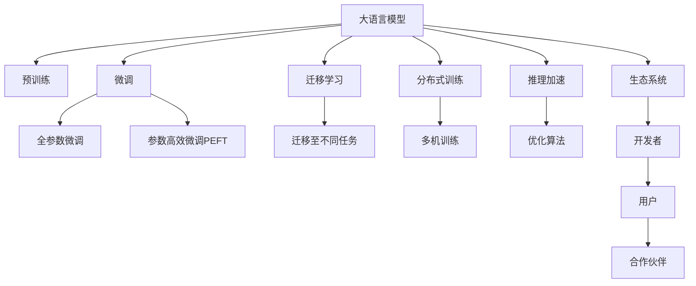

                 

# LLM生态：AI产业的新增长点

> 关键词：大语言模型, 预训练, 微调, 迁移学习, 自然语言处理(NLP), 生态系统, 技术创新

## 1. 背景介绍

### 1.1 问题由来
近年来，随着深度学习技术的迅猛发展，大语言模型（Large Language Models, LLMs）在自然语言处理（Natural Language Processing, NLP）领域取得了显著进展。这些模型通过在大规模无标签文本数据上进行预训练，学习到了丰富的语言知识，具有强大的语言理解和生成能力。LLMs的应用不仅限于文本生成、翻译、问答等传统任务，还延伸到了智能客服、金融分析、医疗诊断等多个垂直领域，推动了AI技术的广泛应用。

然而，尽管LLMs在各个领域展现出了惊人的潜力，其高昂的开发和维护成本、对大规模标注数据的需求以及微调过程中可能出现的过拟合等问题，仍然限制了其在实际应用中的推广。因此，如何构建一个稳定、高效、低成本的LLM生态系统，成为当前AI产业亟待解决的重要课题。

### 1.2 问题核心关键点
为了实现这一目标，LLM生态系统的建设需要关注以下几个核心关键点：

- **预训练模型的多样性与完备性**：不同应用场景需要不同特性的预训练模型，如通用的BERT、专业的M2M-100等。
- **微调方法的灵活性与效率**：根据任务需求选择合适的微调方法，如全参数微调、参数高效微调（PEFT）、零样本学习等。
- **迁移学习的泛化性与适应性**：将预训练知识迁移到特定任务，提升模型在新场景下的表现。
- **分布式训练与推理的扩展性**：构建支持大规模分布式训练与推理的系统，提升模型训练与部署效率。
- **生态系统的开放性与协作性**：鼓励开发者与用户共同构建、分享和迭代，形成良性循环。

## 2. 核心概念与联系

### 2.1 核心概念概述

为了更好地理解LLM生态系统的构建，我们首先需要理解几个核心概念：

- **大语言模型(LLM)**：基于自回归或自编码模型，通过在大规模无标签文本数据上进行预训练，学习到语言的通用表示，具备强大的语言理解和生成能力。
- **预训练**：在无标签数据上训练模型，学习语言的普遍知识。预训练通常包括语言建模、掩码语言模型等任务。
- **微调**：在预训练模型的基础上，使用下游任务的少量标注数据，通过有监督学习优化模型在该任务上的性能。
- **迁移学习**：将预训练模型应用于新的、但相关的领域，提升模型在新任务上的表现。
- **分布式训练**：使用多台计算设备同时训练模型，加速模型训练过程。
- **推理加速**：通过优化模型结构和算法，提升模型推理的速度和效率。
- **生态系统**：由开发者、用户、合作伙伴等组成的多边系统，共同构建、维护和使用LLM平台，形成良性循环。

这些概念之间存在紧密的联系，通过合适的工具和技术，可以将它们整合到一个高效的生态系统中，推动LLM技术的广泛应用。

### 2.2 核心概念原理和架构的 Mermaid 流程图



## 3. 核心算法原理 & 具体操作步骤

### 3.1 算法原理概述

基于大语言模型的生态系统，其核心算法原理可以归纳为以下几个方面：

1. **预训练模型的构建**：通过在大规模无标签数据上训练预训练模型，学习到语言的基本规则和常见模式。
2. **微调方法的优化**：根据下游任务的特性，选择合适的微调方法，优化模型在特定任务上的性能。
3. **迁移学习的实现**：将预训练模型迁移到新任务上，提升模型在新场景下的泛化能力。
4. **分布式训练与推理**：利用分布式计算技术，提高模型训练和推理的效率。
5. **生态系统的构建**：建立开放、协作的生态系统，促进开发者、用户和合作伙伴之间的互动。

### 3.2 算法步骤详解

下面我们将详细介绍大语言模型生态系统的构建步骤：

1. **预训练模型的选择与优化**：
   - 根据具体应用需求，选择适合的预训练模型。
   - 在预训练模型的基础上，进行必要的优化，如剪枝、量化等，减少模型规模，提升推理效率。

2. **微调方法的确定**：
   - 根据任务特点，选择合适的微调方法。例如，对于分类任务，可以使用全参数微调；对于生成任务，可以使用参数高效微调（PEFT）。
   - 设计合适的损失函数和优化器，设置合理的超参数，如学习率、批大小等。

3. **迁移学习的实施**：
   - 确定迁移学习的目标任务，选择合适的数据集。
   - 对预训练模型进行微调，适应新任务的需求。
   - 评估微调后的模型性能，根据需要进行调整。

4. **分布式训练与推理的实现**：
   - 搭建分布式训练环境，利用多台计算设备同时训练模型。
   - 使用GPU、TPU等加速设备，提高模型训练和推理速度。
   - 采用数据并行、模型并行等技术，提高系统扩展性。

5. **生态系统的构建与维护**：
   - 建立开放的API接口，方便开发者和用户使用。
   - 提供丰富的文档和示例，帮助用户快速上手。
   - 定期更新模型和工具，提升系统性能和安全性。

### 3.3 算法优缺点

基于大语言模型的生态系统构建方法，具有以下优点：

- **高效性**：通过分布式训练和推理，可以显著提升模型训练和推理的速度。
- **灵活性**：通过选择合适的微调方法，可以适应多种任务需求。
- **开放性**：通过开放的生态系统，鼓励开发者和用户共同构建和迭代。

同时，也存在一些缺点：

- **成本高**：构建和维护大规模分布式系统需要较高的成本。
- **复杂性**：分布式训练和推理的实现较为复杂，需要较强的技术背景。
- **依赖性**：生态系统的构建和维护依赖于开发者和用户的共同努力，需要持续的投入。

### 3.4 算法应用领域

基于大语言模型的生态系统，已经在多个领域得到了广泛应用：

- **智能客服**：通过微调后的对话模型，实现7x24小时不间断服务，提升客户咨询体验。
- **金融分析**：利用微调后的情感分析模型，实时监测市场舆情，辅助决策。
- **医疗诊断**：通过微调后的文本分类和实体识别模型，辅助医生诊疗，提升诊断准确性。
- **翻译**：利用微调后的机器翻译模型，实现高精度的文本翻译。
- **智能推荐**：通过微调后的个性化推荐模型，提升推荐系统的效果和用户满意度。

## 4. 数学模型和公式 & 详细讲解 & 举例说明

### 4.1 数学模型构建

构建大语言模型生态系统，需要定义一系列数学模型。下面以一个简单的分类任务为例，介绍模型的构建过程。

假设我们有一个二分类任务，输入为 $x \in \mathbb{R}^d$，输出为 $y \in \{0,1\}$。定义模型的输入层、隐藏层和输出层，并设定损失函数 $\ell(y,\hat{y})$。

### 4.2 公式推导过程

根据上述模型定义，我们设定的损失函数为交叉熵损失：

$$
\ell(y,\hat{y}) = -y\log\hat{y} - (1-y)\log(1-\hat{y})
$$

其中 $\hat{y} = \sigma(W^Tx + b)$，$\sigma$ 为激活函数，$W$ 和 $b$ 为模型的权重和偏置。

在微调过程中，我们需要最小化损失函数 $\ell$，即：

$$
\hat{\theta} = \mathop{\arg\min}_{\theta} \frac{1}{N}\sum_{i=1}^N \ell(y_i, \hat{y}_i)
$$

其中 $\theta$ 为模型的所有参数，包括权重和偏置。

### 4.3 案例分析与讲解

假设我们要在医疗诊断领域构建一个二分类模型，用于判断病患是否患有某种疾病。我们可以使用BERT预训练模型，对其进行微调。具体步骤如下：

1. **数据准备**：收集带标签的病患数据，将文本数据输入BERT模型。
2. **模型选择**：选择适当的微调方法，如全参数微调或参数高效微调（PEFT）。
3. **训练模型**：使用交叉熵损失函数和Adam优化器，对模型进行微调。
4. **评估模型**：在测试集上评估模型性能，调整超参数。
5. **部署模型**：将微调后的模型部署到生产环境中，实时预测新病患是否患病。

## 5. 项目实践：代码实例和详细解释说明

### 5.1 开发环境搭建

在构建大语言模型生态系统时，我们需要一个稳定、高效的环境。以下是构建开发环境的步骤：

1. **安装Python和相关工具**：确保Python 3.x版本已安装，并配置好相关的依赖包。
2. **安装PyTorch和Transformers库**：这些是构建和训练大语言模型的必备工具。
3. **搭建分布式训练环境**：可以使用Amazon SageMaker、Google Cloud等云平台，搭建分布式训练环境。

### 5.2 源代码详细实现

以下是使用PyTorch和Transformers库构建和微调BERT模型的代码实现。

```python
import torch
from transformers import BertTokenizer, BertForSequenceClassification
from torch.utils.data import DataLoader

# 定义模型和优化器
model = BertForSequenceClassification.from_pretrained('bert-base-uncased', num_labels=2)
optimizer = torch.optim.Adam(model.parameters(), lr=2e-5)

# 定义数据集和数据加载器
tokenizer = BertTokenizer.from_pretrained('bert-base-uncased')
train_data = ...
train_loader = DataLoader(train_data, batch_size=16)

# 定义训练过程
model.train()
for batch in train_loader:
    inputs, labels = batch
    outputs = model(inputs)
    loss = outputs.loss
    optimizer.zero_grad()
    loss.backward()
    optimizer.step()

# 定义评估过程
model.eval()
for batch in dev_loader:
    inputs, labels = batch
    outputs = model(inputs)
    preds = outputs.predictions.argmax(dim=1)
    print(classification_report(labels, preds))
```

### 5.3 代码解读与分析

上述代码实现了使用BERT模型进行二分类任务微调的基本过程。

**tokenizer定义**：使用BERT分词器对输入文本进行分词，并转换为模型可接受的格式。

**模型定义**：使用BertForSequenceClassification类定义分类模型，并设置训练标签数量。

**数据集定义**：定义训练数据和标签，并使用DataLoader将数据集划分为小批量进行训练和评估。

**训练过程**：在训练过程中，前向传播计算模型输出和损失，反向传播更新模型参数，使用Adam优化器更新模型权重。

**评估过程**：在评估过程中，使用模型对验证集进行预测，并使用classification_report打印分类报告。

## 6. 实际应用场景

### 6.1 智能客服系统

基于大语言模型的智能客服系统，已经在电商、银行、保险等多个行业得到广泛应用。智能客服系统通过微调后的对话模型，能够理解客户意图，提供7x24小时不间断服务，大幅提升客户咨询体验和响应速度。

### 6.2 金融舆情监测

在金融领域，智能舆情监测系统能够实时监测市场舆情，帮助金融机构及时发现潜在的风险。通过微调后的情感分析模型，系统能够快速识别出市场情绪的变化趋势，辅助决策者进行风险控制。

### 6.3 个性化推荐系统

个性化推荐系统通过微调后的模型，能够更好地理解用户兴趣和行为，推荐用户可能感兴趣的商品和服务。通过将用户的浏览、购买记录与微调后的模型进行结合，推荐系统能够提供更加个性化、精准的推荐结果。

### 6.4 未来应用展望

未来，大语言模型的生态系统将更加完善和多样化，能够在更多领域发挥作用。以下是一些未来应用展望：

1. **医疗健康**：通过微调后的模型，帮助医生进行疾病诊断和治疗方案推荐。
2. **教育培训**：通过微调后的模型，提供个性化的学习推荐，提升学习效果。
3. **金融分析**：通过微调后的模型，进行市场情绪分析和交易策略优化。
4. **智能家居**：通过微调后的模型，实现智能语音交互和设备控制。
5. **智慧城市**：通过微调后的模型，实现城市事件监测和应急管理。

## 7. 工具和资源推荐

### 7.1 学习资源推荐

为了帮助开发者系统掌握大语言模型生态系统的构建，这里推荐一些优质的学习资源：

1. **《Transformer from the Inside Out》**：由BERT团队成员撰写的博客系列，详细介绍了BERT模型的构建和微调方法。
2. **CS224N《Natural Language Processing with Deep Learning》**：斯坦福大学开设的NLP经典课程，涵盖预训练模型、微调方法等多个主题。
3. **《Natural Language Processing with Transformers》**：Transformers库的作者所著，介绍了如何使用Transformers库进行NLP任务开发。
4. **CLUE开源项目**：中文语言理解测评基准，提供了丰富的预训练模型和微调样例代码，助力中文NLP技术发展。

### 7.2 开发工具推荐

以下是几款用于大语言模型生态系统构建的常用工具：

1. **PyTorch**：基于Python的开源深度学习框架，支持分布式训练和推理，适合快速迭代研究。
2. **TensorFlow**：由Google主导开发的开源深度学习框架，支持高效的分布式训练，适合大规模工程应用。
3. **Transformers库**：HuggingFace开发的NLP工具库，集成了多种预训练模型，支持PyTorch和TensorFlow，是构建生态系统的利器。
4. **Weights & Biases**：模型训练的实验跟踪工具，可以记录和可视化模型训练过程中的各项指标，方便对比和调优。
5. **TensorBoard**：TensorFlow配套的可视化工具，可实时监测模型训练状态，并提供丰富的图表呈现方式。
6. **Amazon SageMaker**：支持分布式训练和推理的云平台，提供强大的GPU和TPU资源，适合构建大规模系统。

### 7.3 相关论文推荐

大语言模型生态系统的构建和优化离不开学界的持续研究。以下是几篇奠基性的相关论文，推荐阅读：

1. **Attention is All You Need**：提出了Transformer结构，开启了NLP领域的预训练大模型时代。
2. **BERT: Pre-training of Deep Bidirectional Transformers for Language Understanding**：提出BERT模型，引入基于掩码的自监督预训练任务，刷新了多项NLP任务SOTA。
3. **Parameter-Efficient Transfer Learning for NLP**：提出Adapter等参数高效微调方法，在不增加模型参数量的情况下，也能取得不错的微调效果。
4. **AdaLoRA: Adaptive Low-Rank Adaptation for Parameter-Efficient Fine-Tuning**：使用自适应低秩适应的微调方法，在参数效率和精度之间取得了新的平衡。
5. **Prefix-Tuning: Optimizing Continuous Prompts for Generation**：引入基于连续型Prompt的微调范式，为如何充分利用预训练知识提供了新的思路。

## 8. 总结：未来发展趋势与挑战

### 8.1 研究成果总结

大语言模型生态系统的构建，推动了NLP技术的广泛应用，提升了各行业的智能化水平。主要研究成果包括：

1. **预训练模型的多样性与完备性**：不同应用场景需要不同特性的预训练模型。
2. **微调方法的灵活性与效率**：根据任务需求选择合适的微调方法，优化模型在特定任务上的性能。
3. **迁移学习的泛化性与适应性**：将预训练模型应用于新的领域，提升模型在新场景下的表现。
4. **分布式训练与推理的扩展性**：构建支持大规模分布式训练与推理的系统，提升模型训练和部署效率。
5. **生态系统的开放性与协作性**：建立开放、协作的生态系统，促进开发者、用户和合作伙伴之间的互动。

### 8.2 未来发展趋势

未来，大语言模型生态系统将继续发展，呈现以下几个趋势：

1. **模型规模持续增大**：随着算力成本的下降和数据规模的扩张，预训练语言模型的参数量还将持续增长。超大规模语言模型蕴含的丰富语言知识，有望支撑更加复杂多变的下游任务微调。
2. **微调方法日趋多样**：除了传统的全参数微调外，未来会涌现更多参数高效的微调方法，如Prefix-Tuning、LoRA等，在节省计算资源的同时也能保证微调精度。
3. **持续学习成为常态**：随着数据分布的不断变化，微调模型也需要持续学习新知识以保持性能。如何在不遗忘原有知识的同时，高效吸收新样本信息，将成为重要的研究课题。
4. **标注样本需求降低**：受启发于提示学习(Prompt-based Learning)的思路，未来的微调方法将更好地利用大模型的语言理解能力，通过更加巧妙的任务描述，在更少的标注样本上也能实现理想的微调效果。
5. **多模态微调崛起**：当前的微调主要聚焦于纯文本数据，未来会进一步拓展到图像、视频、语音等多模态数据微调。多模态信息的融合，将显著提升语言模型对现实世界的理解和建模能力。

### 8.3 面临的挑战

尽管大语言模型生态系统已经取得了显著进展，但在迈向更加智能化、普适化应用的过程中，仍面临诸多挑战：

1. **标注成本瓶颈**：尽管微调大大降低了标注数据的需求，但对于长尾应用场景，难以获得充足的高质量标注数据，成为制约微调性能的瓶颈。如何进一步降低微调对标注样本的依赖，将是一大难题。
2. **模型鲁棒性不足**：当前微调模型面对域外数据时，泛化性能往往大打折扣。对于测试样本的微小扰动，微调模型的预测也容易发生波动。如何提高微调模型的鲁棒性，避免灾难性遗忘，还需要更多理论和实践的积累。
3. **推理效率有待提高**：大规模语言模型虽然精度高，但在实际部署时往往面临推理速度慢、内存占用大等效率问题。如何在保证性能的同时，简化模型结构，提升推理速度，优化资源占用，将是重要的优化方向。
4. **可解释性亟需加强**：当前微调模型更像是"黑盒"系统，难以解释其内部工作机制和决策逻辑。对于医疗、金融等高风险应用，算法的可解释性和可审计性尤为重要。如何赋予微调模型更强的可解释性，将是亟待攻克的难题。
5. **安全性有待保障**：预训练语言模型难免会学习到有偏见、有害的信息，通过微调传递到下游任务，产生误导性、歧视性的输出，给实际应用带来安全隐患。如何从数据和算法层面消除模型偏见，避免恶意用途，确保输出的安全性，也将是重要的研究课题。
6. **知识整合能力不足**：现有的微调模型往往局限于任务内数据，难以灵活吸收和运用更广泛的先验知识。如何让微调过程更好地与外部知识库、规则库等专家知识结合，形成更加全面、准确的信息整合能力，还有很大的想象空间。

### 8.4 研究展望

面对大语言模型生态系统所面临的挑战，未来的研究需要在以下几个方面寻求新的突破：

1. **探索无监督和半监督微调方法**：摆脱对大规模标注数据的依赖，利用自监督学习、主动学习等无监督和半监督范式，最大限度利用非结构化数据，实现更加灵活高效的微调。
2. **研究参数高效和计算高效的微调范式**：开发更加参数高效的微调方法，在固定大部分预训练参数的同时，只更新极少量的任务相关参数。同时优化微调模型的计算图，减少前向传播和反向传播的资源消耗，实现更加轻量级、实时性的部署。
3. **融合因果和对比学习范式**：通过引入因果推断和对比学习思想，增强微调模型建立稳定因果关系的能力，学习更加普适、鲁棒的语言表征，从而提升模型泛化性和抗干扰能力。
4. **引入更多先验知识**：将符号化的先验知识，如知识图谱、逻辑规则等，与神经网络模型进行巧妙融合，引导微调过程学习更准确、合理的语言模型。同时加强不同模态数据的整合，实现视觉、语音等多模态信息与文本信息的协同建模。
5. **结合因果分析和博弈论工具**：将因果分析方法引入微调模型，识别出模型决策的关键特征，增强输出解释的因果性和逻辑性。借助博弈论工具刻画人机交互过程，主动探索并规避模型的脆弱点，提高系统稳定性。
6. **纳入伦理道德约束**：在模型训练目标中引入伦理导向的评估指标，过滤和惩罚有偏见、有害的输出倾向。同时加强人工干预和审核，建立模型行为的监管机制，确保输出符合人类价值观和伦理道德。

这些研究方向的探索，必将引领大语言模型生态系统迈向更高的台阶，为构建安全、可靠、可解释、可控的智能系统铺平道路。面向未来，大语言模型生态系统还需要与其他人工智能技术进行更深入的融合，如知识表示、因果推理、强化学习等，多路径协同发力，共同推动自然语言理解和智能交互系统的进步。只有勇于创新、敢于突破，才能不断拓展语言模型的边界，让智能技术更好地造福人类社会。

## 9. 附录：常见问题与解答

**Q1：大语言模型生态系统是否适用于所有NLP任务？**

A: 大语言模型生态系统在大多数NLP任务上都能取得不错的效果，特别是对于数据量较小的任务。但对于一些特定领域的任务，如医学、法律等，仅仅依靠通用语料预训练的模型可能难以很好地适应。此时需要在特定领域语料上进一步预训练，再进行微调，才能获得理想效果。此外，对于一些需要时效性、个性化很强的任务，如对话、推荐等，微调方法也需要针对性的改进优化。

**Q2：微调过程中如何选择合适的学习率？**

A: 微调的学习率一般要比预训练时小1-2个数量级，如果使用过大的学习率，容易破坏预训练权重，导致过拟合。一般建议从1e-5开始调参，逐步减小学习率，直至收敛。也可以使用warmup策略，在开始阶段使用较小的学习率，再逐渐过渡到预设值。需要注意的是，不同的优化器(如AdamW、Adafactor等)以及不同的学习率调度策略，可能需要设置不同的学习率阈值。

**Q3：采用大语言模型微调时会面临哪些资源瓶颈？**

A: 目前主流的预训练大模型动辄以亿计的参数规模，对算力、内存、存储都提出了很高的要求。GPU/TPU等高性能设备是必不可少的，但即便如此，超大批次的训练和推理也可能遇到显存不足的问题。因此需要采用一些资源优化技术，如梯度积累、混合精度训练、模型并行等，来突破硬件瓶颈。同时，模型的存储和读取也可能占用大量时间和空间，需要采用模型压缩、稀疏化存储等方法进行优化。

**Q4：如何缓解微调过程中的过拟合问题？**

A: 过拟合是微调面临的主要挑战，尤其是在标注数据不足的情况下。常见的缓解策略包括：
1. 数据增强：通过回译、近义替换等方式扩充训练集
2. 正则化：使用L2正则、Dropout、Early Stopping等避免过拟合
3. 对抗训练：引入对抗样本，提高模型鲁棒性
4. 参数高效微调：只调整少量参数(如Adapter、Prefix等)，减小过拟合风险
5. 多模型集成：训练多个微调模型，取平均输出，抑制过拟合

这些策略往往需要根据具体任务和数据特点进行灵活组合。只有在数据、模型、训练、推理等各环节进行全面优化，才能最大限度地发挥大模型微调的威力。

**Q5：微调模型在落地部署时需要注意哪些问题？**

A: 将微调模型转化为实际应用，还需要考虑以下因素：
1. 模型裁剪：去除不必要的层和参数，减小模型尺寸，加快推理速度
2. 量化加速：将浮点模型转为定点模型，压缩存储空间，提高计算效率
3. 服务化封装：将模型封装为标准化服务接口，便于集成调用
4. 弹性伸缩：根据请求流量动态调整资源配置，平衡服务质量和成本
5. 监控告警：实时采集系统指标，设置异常告警阈值，确保服务稳定性
6. 安全防护：采用访问鉴权、数据脱敏等措施，保障数据和模型安全

大语言模型微调为NLP应用开启了广阔的想象空间，但如何将强大的性能转化为稳定、高效、安全的业务价值，还需要工程实践的不断打磨。唯有从数据、算法、工程、业务等多个维度协同发力，才能真正实现人工智能技术在垂直行业的规模化落地。总之，微调需要开发者根据具体任务，不断迭代和优化模型、数据和算法，方能得到理想的效果。

---

作者：禅与计算机程序设计艺术 / Zen and the Art of Computer Programming

