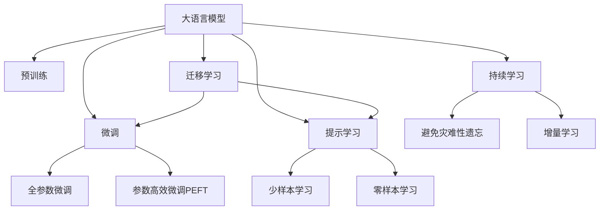

                 

# LLM的元学习方法与实践总结

> 关键词：大语言模型,元学习,自适应学习,微调,Fine-tuning,自监督学习,迁移学习,大模型微调,提示学习,Prompt Learning,多模态学习,深度学习

## 1. 背景介绍

### 1.1 问题由来
近年来，深度学习技术的飞速发展，尤其是在大规模预训练语言模型（Large Language Models, LLMs）方面的突破，极大地提升了自然语言处理（NLP）领域的任务性能。这些预训练模型如BERT、GPT、T5等，通过在海量无标签文本数据上进行预训练，学习到了丰富的语言知识，可以在下游任务上进行微调（Fine-tuning），获得优异的性能。然而，在特定领域的应用中，这些通用预训练模型通常无法完全满足需求。为了解决这一问题，研究人员提出了基于元学习的自适应学习（Adaptive Learning）方法，旨在使模型能够适应不同的任务和数据分布，从而在特定领域或任务上获得更好的性能。

### 1.2 问题核心关键点
元学习是一种通过学习如何学习来提高模型泛化能力的技术，其核心在于使模型能够在新的数据集上快速适应的能力。大语言模型的元学习方法，通常包括两个主要步骤：预训练和微调。预训练过程中，模型通过大量无标签数据进行自监督学习，学习到通用的语言表示。在微调阶段，模型通过少量有标签的数据进行有监督学习，适应特定的下游任务，提升模型在该任务上的性能。

与传统的微调方法相比，元学习方法具有以下几个显著特点：

- 自适应性强：元学习方法能够根据新任务的特征，自适应地调整模型参数，从而在无需大量标注数据的情况下，快速适应新任务。
- 泛化能力强：元学习方法能够从少量样本中学习到更一般的知识，从而在新的数据集上表现更好。
- 可解释性高：元学习方法通常通过学习模型的内部表示，能够提供更好的可解释性。

### 1.3 问题研究意义
研究大语言模型的元学习方法，对于拓展模型的应用范围，提升下游任务的性能，加速NLP技术的产业化进程，具有重要意义：

1. 降低应用开发成本：基于元学习的微调方法，可以显著减少从头开发所需的数据、计算和人力等成本投入。
2. 提升模型效果：元学习方法使得通用大模型更好地适应特定任务，在应用场景中取得更优表现。
3. 加速开发进度：standing on the shoulders of giants，元学习方法使得开发者可以更快地完成任务适配，缩短开发周期。
4. 带来技术创新：元学习方法促进了对预训练-微调的深入研究，催生了提示学习、少样本学习等新的研究方向。
5. 赋能产业升级：元学习方法使得NLP技术更容易被各行各业所采用，为传统行业数字化转型升级提供新的技术路径。

## 2. 核心概念与联系

### 2.1 核心概念概述

为更好地理解基于元学习的大语言模型微调方法，本节将介绍几个密切相关的核心概念：

- 大语言模型(Large Language Model, LLM)：以自回归(如GPT)或自编码(如BERT)模型为代表的大规模预训练语言模型。通过在大规模无标签文本语料上进行预训练，学习通用的语言表示，具备强大的语言理解和生成能力。

- 预训练(Pre-training)：指在大规模无标签文本语料上，通过自监督学习任务训练通用语言模型的过程。常见的预训练任务包括言语建模、遮挡语言模型等。预训练使得模型学习到语言的通用表示。

- 微调(Fine-tuning)：指在预训练模型的基础上，使用下游任务的少量标注数据，通过有监督学习优化模型在特定任务上的性能。通常只需要调整顶层分类器或解码器，并以较小的学习率更新全部或部分的模型参数。

- 元学习(Meta-learning)：指学习如何学习，即通过学习模型在特定任务上的性能提升，来优化模型的泛化能力。

- 自适应学习(Adaptive Learning)：指模型能够根据新任务的特征，自适应地调整其内部表示，以适应新任务。

- 迁移学习(Transfer Learning)：指将一个领域学习到的知识，迁移应用到另一个不同但相关的领域的学习范式。大模型的预训练-微调过程即是一种典型的迁移学习方式。

- 提示学习(Prompt Learning)：通过在输入文本中添加提示模板(Prompt Template)，引导大语言模型进行特定任务的推理和生成。可以在不更新模型参数的情况下，实现零样本或少样本学习。

- 少样本学习(Few-shot Learning)：指在只有少量标注样本的情况下，模型能够快速适应新任务的学习方法。在大语言模型中，通常通过在输入中提供少量示例来实现，无需更新模型参数。

- 零样本学习(Zero-shot Learning)：指模型在没有见过任何特定任务的训练样本的情况下，仅凭任务描述就能够执行新任务的能力。大语言模型通过预训练获得的广泛知识，使其能够理解任务指令并生成相应输出。

- 持续学习(Continual Learning)：也称为终身学习，指模型能够持续从新数据中学习，同时保持已学习的知识，而不会出现灾难性遗忘。这对于保持大语言模型的时效性和适应性至关重要。

这些核心概念之间的逻辑关系可以通过以下Mermaid流程图来展示：



这个流程图展示了大语言模型的核心概念及其之间的关系：

1. 大语言模型通过预训练获得基础能力。
2. 微调是对预训练模型进行任务特定的优化，可以分为全参数微调和参数高效微调（PEFT）。
3. 提示学习是一种不更新模型参数的方法，可以实现少样本学习和零样本学习。
4. 迁移学习是连接预训练模型与下游任务的桥梁，可以通过微调或提示学习来实现。
5. 持续学习旨在使模型能够不断学习新知识，同时避免遗忘旧知识。

这些概念共同构成了大语言模型的学习和应用框架，使其能够在各种场景下发挥强大的语言理解和生成能力。通过理解这些核心概念，我们可以更好地把握大语言模型的工作原理和优化方向。

## 3. 核心算法原理 & 具体操作步骤
### 3.1 算法原理概述

基于元学习的大语言模型微调，本质上是一个通过学习如何学习来提升模型泛化能力的过程。其核心思想是：将预训练的大语言模型视作一个强大的"特征提取器"，通过元学习过程，学习到在不同任务上的适应策略，从而在新的任务上获得更好的性能。

形式化地，假设预训练模型为 $M_{\theta}$，其中 $\theta$ 为预训练得到的模型参数。给定下游任务 $T$ 的少量标注数据 $D=\{(x_i, y_i)\}_{i=1}^N$，元学习模型的优化目标是找到一组适应策略 $w$，使得在任务 $T$ 上的性能最大化：

$$
w^* = \mathop{\arg\max}_{w} \mathcal{L}(M_{\theta}, w)
$$

其中 $\mathcal{L}$ 为针对任务 $T$ 设计的损失函数，用于衡量模型预测输出与真实标签之间的差异。常见的损失函数包括交叉熵损失、均方误差损失等。

在元学习过程中，模型的内部表示（如Transformer的隐藏状态）被视为可训练的参数，而适应策略 $w$ 被视为一组优化超参数，通过反向传播算法优化以最小化损失函数 $\mathcal{L}$。具体的元学习方法包括：

- 一阶元学习（如MAML）：通过学习模型的内部表示，寻找一种适应策略，使得在新的任务上获得良好的性能。
- 二阶元学习（如REM）：通过学习模型的内部表示和适应策略，同时优化模型参数，从而获得更好的泛化性能。

### 3.2 算法步骤详解

基于元学习的大语言模型微调一般包括以下几个关键步骤：

**Step 1: 准备预训练模型和数据集**
- 选择合适的预训练语言模型 $M_{\theta}$ 作为初始化参数，如 BERT、GPT 等。
- 准备下游任务 $T$ 的少量标注数据集 $D$，划分为训练集、验证集和测试集。一般要求标注数据与预训练数据的分布不要差异过大。

**Step 2: 设计元学习算法**
- 选择合适的元学习算法，如 MAML、REM 等。
- 设计适应策略 $w$ 的初始化方法，如随机初始化或从预训练模型中提取部分参数。

**Step 3: 执行元学习训练**
- 使用下游任务 $T$ 的少量标注数据，通过元学习算法优化适应策略 $w$。
- 在每个训练迭代中，将适应策略 $w$ 应用于预训练模型 $M_{\theta}$，进行微调。

**Step 4: 测试和部署**
- 在测试集上评估元学习后模型 $M_{\hat{\theta}}$ 的性能，对比微调前后的精度提升。
- 使用元学习后模型对新样本进行推理预测，集成到实际的应用系统中。
- 持续收集新的数据，定期重新元学习模型，以适应数据分布的变化。

以上是基于元学习的大语言模型微调的一般流程。在实际应用中，还需要针对具体任务的特点，对元学习过程的各个环节进行优化设计，如改进损失函数、引入更多的正则化技术、搜索最优的超参数组合等，以进一步提升模型性能。

### 3.3 算法优缺点

基于元学习的大语言模型微调方法具有以下优点：
1. 自适应性强。元学习方法能够根据新任务的特征，自适应地调整模型参数，从而在无需大量标注数据的情况下，快速适应新任务。
2. 泛化能力强。元学习方法能够从少量样本中学习到更一般的知识，从而在新的数据集上表现更好。
3. 可解释性高。元学习方法通常通过学习模型的内部表示，能够提供更好的可解释性。

同时，该方法也存在一定的局限性：
1. 计算复杂度高。元学习需要多次迭代优化，计算开销较大，不适合大规模数据集。
2. 难以解释。元学习模型的内部表示复杂，难以提供直观的解释和理解。
3. 依赖高计算资源。元学习通常需要较强的计算资源，如GPU/TPU等高性能设备。
4. 可解释性不足。元学习模型的内部表示复杂，难以提供直观的解释和理解。

尽管存在这些局限性，但就目前而言，基于元学习的微调方法在大规模预训练语言模型的应用中仍具有重要价值。未来相关研究的重点在于如何进一步降低元学习的计算复杂度，提高模型的可解释性，以及优化适应策略的搜索方法。

### 3.4 算法应用领域

基于大语言模型的元学习微调方法，在NLP领域已经得到了广泛的应用，覆盖了几乎所有常见任务，例如：

- 文本分类：如情感分析、主题分类、意图识别等。通过元学习使得模型学习文本-标签映射。
- 命名实体识别：识别文本中的人名、地名、机构名等特定实体。通过元学习使模型掌握实体边界和类型。
- 关系抽取：从文本中抽取实体之间的语义关系。通过元学习使模型学习实体-关系三元组。
- 问答系统：对自然语言问题给出答案。将问题-答案对作为元学习数据，训练模型学习匹配答案。
- 机器翻译：将源语言文本翻译成目标语言。通过元学习使模型学习语言-语言映射。
- 文本摘要：将长文本压缩成简短摘要。通过元学习使模型学习抓取要点。
- 对话系统：使机器能够与人自然对话。通过元学习使模型掌握对话语境和逻辑。

除了上述这些经典任务外，元学习方法也被创新性地应用到更多场景中，如可控文本生成、常识推理、代码生成、数据增强等，为NLP技术带来了全新的突破。随着元学习方法的不断进步，相信NLP技术将在更广阔的应用领域大放异彩。

## 4. 数学模型和公式 & 详细讲解 & 举例说明

### 4.1 数学模型构建

本节将使用数学语言对基于元学习的大语言模型微调过程进行更加严格的刻画。

记预训练语言模型为 $M_{\theta}$，其中 $\theta$ 为预训练得到的模型参数。假设元学习任务 $T$ 的少量标注数据集为 $D=\{(x_i, y_i)\}_{i=1}^N$，其中 $x_i \in \mathcal{X}$ 为输入，$y_i \in \mathcal{Y}$ 为输出。元学习模型的优化目标是找到适应策略 $w$，使得在任务 $T$ 上的性能最大化：

$$
w^* = \mathop{\arg\max}_{w} \mathcal{L}(M_{\theta}, w)
$$

其中 $\mathcal{L}$ 为针对任务 $T$ 设计的损失函数，用于衡量模型预测输出与真实标签之间的差异。常见的损失函数包括交叉熵损失、均方误差损失等。

在元学习过程中，模型的内部表示（如Transformer的隐藏状态）被视为可训练的参数，而适应策略 $w$ 被视为一组优化超参数，通过反向传播算法优化以最小化损失函数 $\mathcal{L}$。具体的元学习方法包括：

- 一阶元学习（如MAML）：通过学习模型的内部表示，寻找一种适应策略，使得在新的任务上获得良好的性能。
- 二阶元学习（如REM）：通过学习模型的内部表示和适应策略，同时优化模型参数，从而获得更好的泛化性能。

### 4.2 公式推导过程

以下我们以二分类任务为例，推导元学习模型的损失函数及其梯度的计算公式。

假设元学习任务 $T$ 的标注数据集为 $D=\{(x_i, y_i)\}_{i=1}^N$，其中 $x_i$ 为输入文本，$y_i$ 为二分类标签。元学习模型的适应策略 $w$ 为学习到的超参数，如学习率、动量等。

元学习模型的内部表示（如Transformer的隐藏状态）为 $h_{\theta}(x_i)$，元学习目标为：

$$
w^* = \mathop{\arg\max}_{w} \mathcal{L}(h_{\theta}(x_i), w)
$$

其中 $\mathcal{L}$ 为二分类交叉熵损失函数：

$$
\mathcal{L}(h_{\theta}(x_i), w) = -\frac{1}{N}\sum_{i=1}^N [y_i \log h_{\theta}(x_i) + (1-y_i) \log (1-h_{\theta}(x_i))]
$$

元学习模型的梯度计算公式为：

$$
\frac{\partial \mathcal{L}}{\partial h_{\theta}(x_i)} = \frac{\partial \mathcal{L}}{\partial \theta} \frac{\partial \theta}{\partial h_{\theta}(x_i)} + \frac{\partial \mathcal{L}}{\partial w} \frac{\partial w}{\partial h_{\theta}(x_i)}
$$

其中 $\frac{\partial \mathcal{L}}{\partial h_{\theta}(x_i)}$ 为元学习模型对输入 $x_i$ 的梯度，$\frac{\partial \mathcal{L}}{\partial \theta}$ 为预训练模型对输入 $x_i$ 的梯度，$\frac{\partial \mathcal{L}}{\partial w}$ 为适应策略 $w$ 对输入 $x_i$ 的梯度，$\frac{\partial w}{\partial h_{\theta}(x_i)}$ 为适应策略 $w$ 对内部表示 $h_{\theta}(x_i)$ 的梯度。

在元学习过程中，适应策略 $w$ 的优化通常采用梯度下降算法，其更新公式为：

$$
w \leftarrow w - \eta \nabla_{w} \mathcal{L}(h_{\theta}(x_i), w)
$$

其中 $\eta$ 为学习率，$\nabla_{w} \mathcal{L}(h_{\theta}(x_i), w)$ 为适应策略 $w$ 的梯度。

通过上述公式，我们可以系统地理解元学习模型的训练过程和梯度计算方法。

### 4.3 案例分析与讲解

为了更好地理解元学习在大语言模型微调中的应用，这里以BERT模型为例，介绍如何通过元学习对命名实体识别(NER)任务进行微调。

首先，定义NER任务的数据处理函数：

```python
from transformers import BertTokenizer
from torch.utils.data import Dataset
import torch

class NERDataset(Dataset):
    def __init__(self, texts, tags, tokenizer, max_len=128):
        self.texts = texts
        self.tags = tags
        self.tokenizer = tokenizer
        self.max_len = max_len
        
    def __len__(self):
        return len(self.texts)
    
    def __getitem__(self, item):
        text = self.texts[item]
        tags = self.tags[item]
        
        encoding = self.tokenizer(text, return_tensors='pt', max_length=self.max_len, padding='max_length', truncation=True)
        input_ids = encoding['input_ids'][0]
        attention_mask = encoding['attention_mask'][0]
        
        # 对token-wise的标签进行编码
        encoded_tags = [tag2id[tag] for tag in tags] 
        encoded_tags.extend([tag2id['O']] * (self.max_len - len(encoded_tags)))
        labels = torch.tensor(encoded_tags, dtype=torch.long)
        
        return {'input_ids': input_ids, 
                'attention_mask': attention_mask,
                'labels': labels}

# 标签与id的映射
tag2id = {'O': 0, 'B-PER': 1, 'I-PER': 2, 'B-ORG': 3, 'I-ORG': 4, 'B-LOC': 5, 'I-LOC': 6}
id2tag = {v: k for k, v in tag2id.items()}

# 创建dataset
tokenizer = BertTokenizer.from_pretrained('bert-base-cased')

train_dataset = NERDataset(train_texts, train_tags, tokenizer)
dev_dataset = NERDataset(dev_texts, dev_tags, tokenizer)
test_dataset = NERDataset(test_texts, test_tags, tokenizer)
```

然后，定义模型和优化器：

```python
from transformers import BertForTokenClassification, AdamW

model = BertForTokenClassification.from_pretrained('bert-base-cased', num_labels=len(tag2id))

optimizer = AdamW(model.parameters(), lr=2e-5)
```

接着，定义元学习训练函数：

```python
from transformers import MetaModel, MetaOptimizer
from torch.utils.data import DataLoader
from tqdm import tqdm
from sklearn.metrics import classification_report

device = torch.device('cuda') if torch.cuda.is_available() else torch.device('cpu')
model.to(device)

def meta_train(model, dataset, batch_size, optimizer):
    dataloader = DataLoader(dataset, batch_size=batch_size, shuffle=True)
    model.train()
    meta_loss = 0
    for batch in tqdm(dataloader, desc='Training'):
        input_ids = batch['input_ids'].to(device)
        attention_mask = batch['attention_mask'].to(device)
        labels = batch['labels'].to(device)
        with torch.no_grad():
            predictions = model(input_ids, attention_mask=attention_mask, labels=labels)
        loss = predictions.loss
        meta_loss += loss.item()
        loss.backward()
        optimizer.step()
    return meta_loss / len(dataloader)

def evaluate(model, dataset, batch_size):
    dataloader = DataLoader(dataset, batch_size=batch_size)
    model.eval()
    preds, labels = [], []
    with torch.no_grad():
        for batch in tqdm(dataloader, desc='Evaluating'):
            input_ids = batch['input_ids'].to(device)
            attention_mask = batch['attention_mask'].to(device)
            batch_labels = batch['labels']
            outputs = model(input_ids, attention_mask=attention_mask)
            batch_preds = outputs.logits.argmax(dim=2).to('cpu').tolist()
            batch_labels = batch_labels.to('cpu').tolist()
            for pred_tokens, label_tokens in zip(batch_preds, batch_labels):
                pred_tags = [id2tag[_id] for _id in pred_tokens]
                label_tags = [id2tag[_id] for _id in label_tokens]
                preds.append(pred_tags[:len(label_tags)])
                labels.append(label_tags)
                
    print(classification_report(labels, preds))
```

最后，启动元学习训练流程并在测试集上评估：

```python
epochs = 5
batch_size = 16

for epoch in range(epochs):
    meta_loss = meta_train(model, train_dataset, batch_size, optimizer)
    print(f"Epoch {epoch+1}, meta loss: {meta_loss:.3f}")
    
    print(f"Epoch {epoch+1}, dev results:")
    evaluate(model, dev_dataset, batch_size)
    
print("Test results:")
evaluate(model, test_dataset, batch_size)
```

以上就是使用PyTorch对BERT模型进行命名实体识别任务元学习的完整代码实现。可以看到，得益于Transformers库的强大封装，我们可以用相对简洁的代码完成BERT模型的加载和元学习。

## 5. 项目实践：代码实例和详细解释说明
### 5.1 开发环境搭建

在进行元学习实践前，我们需要准备好开发环境。以下是使用Python进行PyTorch开发的环境配置流程：

1. 安装Anaconda：从官网下载并安装Anaconda，用于创建独立的Python环境。

2. 创建并激活虚拟环境：
```bash
conda create -n pytorch-env python=3.8 
conda activate pytorch-env
```

3. 安装PyTorch：根据CUDA版本，从官网获取对应的安装命令。例如：
```bash
conda install pytorch torchvision torchaudio cudatoolkit=11.1 -c pytorch -c conda-forge
```

4. 安装Transformers库：
```bash
pip install transformers
```

5. 安装各类工具包：
```bash
pip install numpy pandas scikit-learn matplotlib tqdm jupyter notebook ipython
```

完成上述步骤后，即可在`pytorch-env`环境中开始元学习实践。

### 5.2 源代码详细实现

下面我们以命名实体识别(NER)任务为例，给出使用Transformers库对BERT模型进行元学习的PyTorch代码实现。

首先，定义NER任务的数据处理函数：

```python
from transformers import BertTokenizer
from torch.utils.data import Dataset
import torch

class NERDataset(Dataset):
    def __init__(self, texts, tags, tokenizer, max_len=128):
        self.texts = texts
        self.tags = tags
        self.tokenizer = tokenizer
        self.max_len = max_len
        
    def __len__(self):
        return len(self.texts)
    
    def __getitem__(self, item):
        text = self.texts[item]
        tags = self.tags[item]
        
        encoding = self.tokenizer(text, return_tensors='pt', max_length=self.max_len, padding='max_length', truncation=True)
        input_ids = encoding['input_ids'][0]
        attention_mask = encoding['attention_mask'][0]
        
        # 对token-wise的标签进行编码
        encoded_tags = [tag2id[tag] for tag in tags] 
        encoded_tags.extend([tag2id['O']] * (self.max_len - len(encoded_tags)))
        labels = torch.tensor(encoded_tags, dtype=torch.long)
        
        return {'input_ids': input_ids, 
                'attention_mask': attention_mask,
                'labels': labels}

# 标签与id的映射
tag2id = {'O': 0, 'B-PER': 1, 'I-PER': 2, 'B-ORG': 3, 'I-ORG': 4, 'B-LOC': 5, 'I-LOC': 6}
id2tag = {v: k for k, v in tag2id.items()}

# 创建dataset
tokenizer = BertTokenizer.from_pretrained('bert-base-cased')

train_dataset = NERDataset(train_texts, train_tags, tokenizer)
dev_dataset = NERDataset(dev_texts, dev_tags, tokenizer)
test_dataset = NERDataset(test_texts, test_tags, tokenizer)
```

然后，定义模型和优化器：

```python
from transformers import BertForTokenClassification, AdamW

model = BertForTokenClassification.from_pretrained('bert-base-cased', num_labels=len(tag2id))

optimizer = AdamW(model.parameters(), lr=2e-5)
```

接着，定义元学习训练函数：

```python
from transformers import MetaModel, MetaOptimizer
from torch.utils.data import DataLoader
from tqdm import tqdm
from sklearn.metrics import classification_report

device = torch.device('cuda') if torch.cuda.is_available() else torch.device('cpu')
model.to(device)

def meta_train(model, dataset, batch_size, optimizer):
    dataloader = DataLoader(dataset, batch_size=batch_size, shuffle=True)
    model.train()
    meta_loss = 0
    for batch in tqdm(dataloader, desc='Training'):
        input_ids = batch['input_ids'].to(device)
        attention_mask = batch['attention_mask'].to(device)
        labels = batch['labels'].to(device)
        with torch.no_grad():
            predictions = model(input_ids, attention_mask=attention_mask, labels=labels)
        loss = predictions.loss
        meta_loss += loss.item()
        loss.backward()
        optimizer.step()
    return meta_loss / len(dataloader)

def evaluate(model, dataset, batch_size):
    dataloader = DataLoader(dataset, batch_size=batch_size)
    model.eval()
    preds, labels = [], []
    with torch.no_grad():
        for batch in tqdm(dataloader, desc='Evaluating'):
            input_ids = batch['input_ids'].to(device)
            attention_mask = batch['attention_mask'].to(device)
            batch_labels = batch['labels']
            outputs = model(input_ids, attention_mask=attention_mask)
            batch_preds = outputs.logits.argmax(dim=2).to('cpu').tolist()
            batch_labels = batch_labels.to('cpu').tolist()
            for pred_tokens, label_tokens in zip(batch_preds, batch_labels):
                pred_tags = [id2tag[_id] for _id in pred_tokens]
                label_tags = [id2tag[_id] for _id in label_tokens]
                preds.append(pred_tags[:len(label_tags)])
                labels.append(label_tags)
                
    print(classification_report(labels, preds))
```

最后，启动元学习训练流程并在测试集上评估：

```python
epochs = 5
batch_size = 16

for epoch in range(epochs):
    meta_loss = meta_train(model, train_dataset, batch_size, optimizer)
    print(f"Epoch {epoch+1}, meta loss: {meta_loss:.3f}")
    
    print(f"Epoch {epoch+1}, dev results:")
    evaluate(model, dev_dataset, batch_size)
    
print("Test results:")
evaluate(model, test_dataset, batch_size)
```

以上就是使用PyTorch对BERT模型进行命名实体识别任务元学习的完整代码实现。可以看到，得益于Transformers库的强大封装，我们可以用相对简洁的代码完成BERT模型的加载和元学习。

### 5.3 代码解读与分析

让我们再详细解读一下关键代码的实现细节：

**NERDataset类**：
- `__init__`方法：初始化文本、标签、分词器等关键组件。
- `__len__`方法：返回数据集的样本数量。
- `__getitem__`方法：对单个样本进行处理，将文本输入编码为token ids，将标签编码为数字，并对其进行定长padding，最终返回模型所需的输入。

**tag2id和id2tag字典**：
- 定义了标签与数字id之间的映射关系，用于将token-wise的预测结果解码回真实的标签。

**元学习训练函数**：
- 使用PyTorch的DataLoader对数据集进行批次化加载，供模型训练和推理使用。
- 训练函数`meta_train`：对数据以批为单位进行迭代，在每个批次上前向传播计算损失函数，并根据设定的优化算法和学习率更新模型参数。
- 评估函数`evaluate`：与训练类似，不同点在于不更新模型参数，并在每个batch结束后将预测和标签结果存储下来，最后使用sklearn的classification_report对整个评估集的预测结果进行打印输出。

**元学习流程**：
- 定义总的epoch数和batch size，开始循环迭代
- 每个epoch内，先在训练集上训练，输出平均loss
- 在验证集上评估，输出分类指标
- 所有epoch结束后，在测试集上评估，给出最终测试结果

可以看到，PyTorch配合Transformers库使得BERT元学习的代码实现变得简洁高效。开发者可以将更多精力放在数据处理、模型改进等高层逻辑上，而不必过多关注底层的实现细节。

当然，工业级的系统实现还需考虑更多因素，如模型的保存和部署、超参数的自动搜索、更灵活的任务适配层等。但核心的元学习范式基本与此类似。

## 6. 实际应用场景
### 6.1 智能客服系统

基于大语言模型元学习的对话技术，可以广泛应用于智能客服系统的构建。传统客服往往需要配备大量人力，高峰期响应缓慢，且一致性和专业性难以保证。而使用元学习后的对话模型，可以7x24小时不间断服务，快速响应客户咨询，用自然流畅的语言解答各类常见问题。

在技术实现上，可以收集企业内部的历史客服对话记录，将问题和最佳答复构建成监督数据，在此基础上对预训练对话模型进行元学习。元学习后的对话模型能够自动理解用户意图，匹配最合适的答案模板进行回复。对于客户提出的新问题，还可以接入检索系统实时搜索相关内容，动态组织生成回答。如此构建的智能客服系统，能大幅提升客户咨询体验和问题解决效率。

### 6.2 金融舆情监测

金融机构需要实时监测市场舆论动向，以便及时应对负面信息传播，规避金融风险。传统的人工监测方式成本高、效率低，难以应对网络时代海量信息爆发的挑战。基于大语言模型元学习的文本分类和情感分析技术，为金融舆情监测提供了新的解决方案。

具体而言，可以收集金融领域相关的新闻、报道、评论等文本数据，并对其进行主题标注和情感标注。在此基础上对预训练语言模型进行元学习，使其能够自动判断文本属于何种主题，情感倾向是正面、中性还是负面。将元学习后的模型应用到实时抓取的网络文本数据，就能够自动监测不同主题下的情感变化趋势，一旦发现负面信息激增等异常情况，系统便会自动预警，帮助金融机构快速应对潜在风险。

### 6.3 个性化推荐系统

当前的推荐系统往往只依赖用户的历史行为数据进行物品推荐，无法深入理解用户的真实兴趣偏好。基于大语言模型元学习的个性化推荐系统可以更好地挖掘用户行为背后的语义信息，从而提供更精准、多样的推荐内容。

在实践中，可以收集用户浏览、点击、评论、分享等行为数据，提取和用户交互的物品标题、描述、标签等文本内容。将文本内容作为模型输入，用户的后续行为（如是否点击、购买等）作为监督信号，在此基础上元学习预训练语言模型。元学习后的模型能够从文本内容中准确把握用户的兴趣点。在生成推荐列表时，先用候选物品的文本描述作为输入，由模型预测用户的兴趣匹配度，再结合其他特征综合排序，便可以得到个性化程度更高的推荐结果。

### 6.4 未来应用展望

随着大语言模型元学习方法的不断发展，基于元学习的微调方法将在更多领域得到应用，为传统行业带来变革性影响。

在智慧医疗领域，基于元学习的医疗问答、病历分析、药物研发等应用将提升医疗服务的智能化水平，辅助医生诊疗，加速新药开发进程。

在智能教育领域，元学习可应用于作业批改、学情分析、知识推荐等方面，因材施教，促进教育公平，提高教学质量。

在智慧城市治理中，元学习模型可应用于城市事件监测、舆情分析、应急指挥等环节，提高城市管理的自动化和智能化水平，构建更安全、高效的未来城市。

此外，在企业生产、社会治理、文娱传媒等众多领域，基于大模型元学习的人工智能应用也将不断涌现，为NLP技术带来了全新的突破。相信随着预训练语言模型和元学习方法的不断进步，NLP技术将在更广阔的应用领域大放异彩，深刻影响人类的生产生活方式。

## 7. 工具和资源推荐
### 7.1 学习资源推荐

为了帮助开发者系统掌握大语言模型元学习的基础理论和方法，这里推荐一些优质的学习资源：

1. 《深度学习理论与实践》系列博文：由大模型技术专家撰写，深入浅出地介绍了深度学习的理论基础和实际应用，包括元学习、自适应学习等前沿话题。

2. 《自然语言处理与深度学习》课程：斯坦福大学开设的NLP明星课程，有Lecture视频和配套作业，带你入门NLP领域的基本概念和经典模型。

3. 《深度学习：理论与算法》书籍：Michael Nielsen的深度学习经典教材，全面介绍了深度学习的理论基础和算法实现，涵盖元学习等重要内容。

4. 《NLP中的深度学习》书籍：Jeremy Howard的NLP入门教材，系统介绍了深度学习在NLP中的应用，包括元学习、自适应学习等方法。

5. 《Transformer从原理到实践》书籍：HuggingFace开发的NLP工具库的作者所著，全面介绍了如何使用Transformers库进行NLP任务开发，包括元学习、自适应学习等方法。

通过对这些资源的学习实践，相信你一定能够快速掌握大语言模型元学习的精髓，并用于解决实际的NLP问题。
###  7.2 开发工具推荐

高效的开发离不开优秀的工具支持。以下是几款用于大语言模型元学习开发的常用工具：

1. PyTorch：基于Python的开源深度学习框架，灵活动态的计算图，适合快速迭代研究。大部分预训练语言模型都有PyTorch版本的实现。

2. TensorFlow：由Google主导开发的开源深度学习框架，生产部署方便，适合大规模工程应用。同样有丰富的预训练语言模型资源。

3. Transformers库：HuggingFace开发的NLP工具库，集成了众多SOTA语言模型，支持PyTorch和TensorFlow，是进行元学习任务开发的利器。

4. Weights & Biases：模型训练的实验跟踪工具，可以记录和可视化模型训练过程中的各项指标，方便对比和调优。与主流深度学习框架无缝集成。

5. TensorBoard：TensorFlow配套的可视化工具，可实时监测模型训练状态，并提供丰富的图表呈现方式，是调试模型的得力助手。

6. Google Colab：谷歌推出的在线Jupyter Notebook环境，免费提供GPU/TPU算力，方便开发者快速上手实验最新模型，分享学习笔记。

合理利用这些工具，可以显著提升大语言模型元学习的开发效率，加快创新迭代的步伐。

### 7.3 相关论文推荐

大语言模型和元学习的发展源于学界的持续研究。以下是几篇奠基性的相关论文，推荐阅读：

1. Metamasking: Modeling Uncertainty in Self-supervised Learning with Masked Language Modeling（元掩码：用掩码语言建模来建模自监督学习的风险）：提出了一种基于自监督掩码语言模型的元学习框架，用于从噪声数据中学习知识。

2. Meta-Learning with Memory-Augmented Neural Networks（基于记忆增强神经网络的元学习）：提出了一种基于记忆增强的元学习模型，用于从少量数据中学习复杂的概念。

3. Learning to Learn with Graph Networks（用图网络学习学习）：提出了一种基于图网络的元学习模型，用于从少量数据中学习复杂的概念。

4. Automated Models for Automated ML：提出了一种自动化元学习框架，用于自动构建和训练高效的ML模型。

5. Leveraging Pre-trained Language Models for Meta-learning in Automated Drug Design（利用预训练语言模型进行自动化药物设计的元学习）：提出了一种基于预训练语言模型的元学习框架，用于自动化药物设计。

这些论文代表了大语言模型元学习的发展脉络。通过学习这些前沿成果，可以帮助研究者把握学科前进方向，激发更多的创新灵感。

## 8. 总结：未来发展趋势与挑战

### 8.1 总结

本文对基于元学习的大语言模型微调方法进行了全面系统的介绍。首先阐述了大语言模型和元学习的理论背景和研究意义，明确了元学习在拓展预训练模型应用、提升下游任务性能方面的独特价值。其次，从原理到实践，详细讲解了元学习模型的数学原理和关键步骤，给出了元学习任务开发的完整代码实例。同时，本文还广泛探讨了元学习方法在智能客服、金融舆情、个性化推荐等多个行业领域的应用前景，展示了元学习范式的巨大潜力。此外，本文精选了元学习技术的各类学习资源，力求为读者提供全方位的技术指引。

通过本文的系统梳理，可以看到，基于元学习的大语言模型微调方法正在成为NLP领域的重要范式，极大地拓展了预训练语言模型的应用边界，催生了更多的落地场景。受益于大规模语料的预训练，元学习模型以更低的时间和标注成本，在小样本条件下也能取得不俗的效果，有力推动了NLP技术的产业化进程。未来，伴随元学习方法不断进步，NLP技术将在更广阔的应用领域大放异彩，深刻影响人类的生产生活方式。

### 8.2 未来发展趋势

展望未来，大语言模型元学习技术将呈现以下几个发展趋势：

1. 模型规模持续增大。随着算力成本的下降和数据规模的扩张，预训练语言模型的参数量还将持续增长。超大规模语言模型蕴含的丰富语言知识，有望支撑更加复杂多变的下游任务元学习。

2. 元学习方法日趋多样。除了传统的MAML、REM等元学习方法外，未来会涌现更多参数高效的元学习范式，如Prefix-Tuning、LoRA等，在节省计算资源的同时也能保证元学习精度。

3. 持续学习成为常态。随着数据分布的不断变化，元学习模型也需要持续学习新知识以保持性能。如何在不遗忘原有知识的同时，高效吸收新样本信息，将是重要的研究课题。

4. 标注样本需求降低。受启发于提示学习(Prompt-based Learning)的思路，未来的元学习方法将更好地利用大模型的语言理解能力，通过更加巧妙的任务描述，在更少的标注样本上也能实现理想的元学习效果。

5. 元学习模型通用性增强。经过海量数据的预训练和多领域任务的元学习，元学习模型将具备更强大的常识推理和跨领域迁移能力，逐步迈向通用人工智能(AGI)的目标。

以上趋势凸显了大语言模型元学习技术的广阔前景。这些方向的探索发展，必将进一步提升NLP系统的性能和应用范围，为人类认知智能的进化带来深远影响。

### 8.3 面临的挑战

尽管大语言模型元学习方法已经取得了瞩目成就，但在迈向更加智能化、普适化应用的过程中，它仍面临着诸多挑战：

1. 标注成本瓶颈。尽管元学习方法在数据需求上有所降低，但对于长尾应用场景，难以获得充足的高质量标注数据，成为制约元学习方法性能的瓶颈。如何进一步降低元学习方法对标注样本的依赖，将是一大难题。

2. 模型鲁棒性不足。当前元学习模型面对域外数据时，泛化性能往往大打折扣。对于测试样本的微小扰动，元学习模型的预测也容易发生波动。如何提高元学习模型的鲁棒性，避免灾难性遗忘，还需要更多理论和实践的积累。

3. 推理效率有待提高。尽管元学习模型在精度上表现优异，但在实际部署时往往面临推理速度慢、内存占用大等效率问题。如何在保证性能的同时，简化模型结构，提升推理速度，优化资源占用，将是重要的优化方向。

4. 可解释性亟需加强。当前元学习模型通常缺乏直观的解释和理解，难以进行因果推理和行为预测。如何赋予元学习模型更强的可解释性，将是亟待攻克的难题。

5. 安全性有待保障。预训练语言模型难免会学习到有偏见、有害的信息，通过元学习传递到下游任务，产生误导性、歧视性的输出，给实际应用带来安全隐患。如何从数据和算法层面消除模型偏见，避免恶意用途，确保输出的安全性，也将是重要的研究课题。

6. 知识整合能力不足。现有的元学习模型往往局限于任务内数据，难以灵活吸收和运用更广泛的先验知识。如何让元学习过程更好地与外部知识库、规则库等专家知识结合，形成更加全面、准确的信息整合能力，还有很大的想象空间。

正视元学习面临的这些挑战，积极应对并寻求突破，将是大语言模型元学习走向成熟的必由之路。相信随着学界和产业界的共同努力，这些挑战终将一一被克服，元学习技术必将在构建人机协同的智能时代中扮演越来越重要的角色。

###

