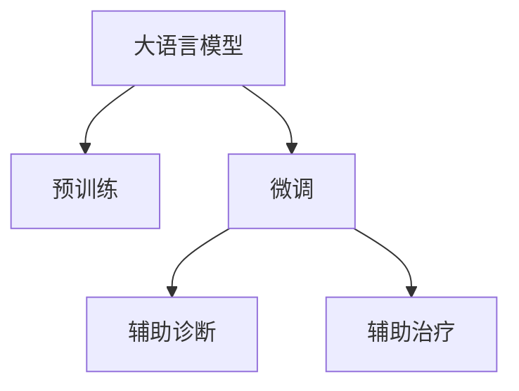

                 

# LLM的医疗革新：AI辅助诊断与治疗

## 1. 背景介绍

### 1.1 问题由来
随着人工智能技术的发展，人工智能(AI)在医疗领域的应用日益增多，尤其是在诊断和治疗方面。传统的医疗诊断依赖于医生丰富的经验和高超的技术，但这些经验技术的积累周期长、成本高，且随着技术的发展，传统的诊断方法已经无法满足现代医学的需要。而大语言模型（Large Language Model, LLM）的出现，为医疗诊断和治疗提供了一种新的可能性。

大语言模型是近年来人工智能领域的热点之一，它通过在大规模的无标签文本数据上进行预训练，学习到了丰富的语言知识和常识，可以理解和生成自然语言。在大语言模型中，BERT、GPT等模型已经在多个领域展示了其强大的能力，如自然语言理解、文本生成、问答系统等。随着预训练技术的不断发展，大语言模型在医疗领域的应用也逐渐引起人们的关注。

大语言模型在医疗领域的应用主要集中在辅助诊断和辅助治疗两个方面。在辅助诊断方面，大语言模型可以通过对病历、症状等信息的理解和分析，辅助医生进行诊断。在辅助治疗方面，大语言模型可以通过对药物、治疗方案等信息的学习，辅助医生制定个性化的治疗方案。这些应用无疑将大大提高医疗服务的效率和质量，为患者提供更好的治疗体验。

### 1.2 问题核心关键点
大语言模型在医疗领域的核心问题可以归纳为以下几个关键点：
1. 大语言模型的预训练数据如何与医疗数据相结合？
2. 大语言模型在医疗领域的应用场景有哪些？
3. 大语言模型在医疗领域有哪些优势和局限？
4. 大语言模型在医疗领域的实际应用效果如何？
5. 大语言模型在医疗领域的发展趋势和挑战是什么？

这些关键点将贯穿于文章的主线和各个章节中，引导读者深入理解大语言模型在医疗领域的应用。

## 2. 核心概念与联系

### 2.1 核心概念概述

为了更好地理解大语言模型在医疗领域的应用，我们首先需要明确几个核心概念：

- **大语言模型（LLM）**：以自回归或自编码模型为代表的、通过在大规模无标签文本数据上进行预训练的语言模型。预训练后的模型学习到了丰富的语言知识和常识，可以理解和生成自然语言。
- **预训练（Pre-training）**：在大规模无标签文本数据上，通过自监督学习任务训练通用语言模型的过程。预训练使得模型学习到了通用的语言表示，可以更好地理解和生成自然语言。
- **微调（Fine-tuning）**：在预训练模型的基础上，使用下游任务的少量标注数据，通过有监督学习优化模型在该任务上的性能。
- **辅助诊断（Assisted Diagnosis）**：在医疗领域，辅助医生进行诊断的过程。大语言模型可以通过对病历、症状等信息的理解和分析，辅助医生进行诊断。
- **辅助治疗（Assisted Treatment）**：在医疗领域，辅助医生制定个性化治疗方案的过程。大语言模型可以通过对药物、治疗方案等信息的学习，辅助医生制定个性化的治疗方案。

这些核心概念之间的关系可以通过以下Mermaid流程图来展示：



这个流程图展示了大语言模型从预训练到微调，再到辅助诊断和辅助治疗的整个过程。

## 3. 核心算法原理 & 具体操作步骤

### 3.1 算法原理概述

大语言模型在医疗领域的应用，主要基于两个核心算法原理：预训练和微调。

**预训练**：在大规模无标签文本数据上，通过自监督学习任务训练通用语言模型的过程。预训练使得模型学习到了通用的语言表示，可以更好地理解和生成自然语言。在医疗领域，预训练数据可以来自于医学文献、病历记录等。

**微调**：在预训练模型的基础上，使用下游任务的少量标注数据，通过有监督学习优化模型在该任务上的性能。在医疗领域，微调任务可以是辅助诊断或辅助治疗，例如，使用病历记录和诊断结果进行微调，以提高模型对病历信息的理解能力。

### 3.2 算法步骤详解

以下是大语言模型在医疗领域的应用步骤：

1. **数据准备**：收集和处理医疗数据，包括病历记录、诊断结果、治疗方案等。

2. **预训练模型选择**：选择合适的预训练模型，如BERT、GPT等，作为初始化参数。

3. **数据处理和标注**：将病历记录、诊断结果等转化为模型可以接受的格式，并对其进行标注。标注的方式可以是文本分类、命名实体识别等。

4. **微调**：在预训练模型的基础上，使用标注好的数据集进行微调。微调的目标是提高模型在辅助诊断和辅助治疗方面的性能。

5. **评估和验证**：使用验证集对微调后的模型进行评估，确保模型的性能符合预期。

6. **部署和应用**：将微调后的模型部署到实际应用场景中，辅助医生进行诊断和治疗。

### 3.3 算法优缺点

大语言模型在医疗领域的应用，有以下几个优点：

1. **高效**：与传统的医疗诊断和治疗方式相比，大语言模型可以快速处理大量的医疗数据，提高诊断和治疗的效率。

2. **准确**：通过预训练和微调，大语言模型可以学习到丰富的医学知识，提高诊断和治疗的准确性。

3. **可扩展**：大语言模型可以通过微调学习新的医学知识，具有很好的可扩展性。

4. **辅助性强**：大语言模型可以辅助医生进行诊断和治疗，减轻医生的工作负担，提高医疗服务的质量。

但大语言模型在医疗领域也存在一些局限：

1. **数据依赖性强**：大语言模型需要大量的标注数据进行微调，标注数据的质量和数量直接影响模型的性能。

2. **模型泛化能力有限**：模型在处理特定领域的医疗数据时，可能会因为数据分布差异较大而表现不佳。

3. **伦理和安全问题**：大语言模型可能学习到医疗数据中的敏感信息，存在隐私和伦理问题。

4. **计算资源需求高**：预训练和微调大语言模型需要大量的计算资源，成本较高。

### 3.4 算法应用领域

大语言模型在医疗领域的应用，主要包括以下几个领域：

1. **辅助诊断**：大语言模型可以通过对病历记录、症状等信息进行分析和理解，辅助医生进行诊断。例如，在肿瘤诊断中，大语言模型可以根据病历记录和症状信息，辅助医生确定肿瘤的类型和位置。

2. **辅助治疗**：大语言模型可以通过对药物、治疗方案等信息的学习，辅助医生制定个性化的治疗方案。例如，在心血管疾病治疗中，大语言模型可以根据患者的病情和药物反应，推荐合适的治疗方案。

3. **医学研究**：大语言模型可以帮助研究人员整理和分析大量的医学文献，加速医学研究进程。例如，在药物研发中，大语言模型可以帮助研究人员发现潜在的药物靶点和作用机制。

4. **智能客服**：大语言模型可以构建智能客服系统，为患者提供24小时在线咨询服务。例如，在心理健康领域，大语言模型可以根据患者的问题，提供心理健康建议和咨询服务。

5. **医学教育**：大语言模型可以辅助医学教育，提供医学知识的检索和解释。例如，在医学学习中，大语言模型可以根据学生的问题，提供相应的医学知识解答和解释。

## 4. 数学模型和公式 & 详细讲解 & 举例说明

### 4.1 数学模型构建

大语言模型在医疗领域的应用，涉及以下几个数学模型：

1. **文本分类模型**：用于将病历记录等文本数据分类，例如，将病历记录分为肿瘤、心血管疾病等类别。
2. **命名实体识别模型**：用于从病历记录中识别出重要的医学实体，例如，识别出疾病名称、药物名称等。
3. **关系抽取模型**：用于从病历记录中抽取实体之间的关系，例如，抽取肿瘤患者的病情和治疗结果之间的关系。

这些模型的构建过程，可以通过机器学习算法进行训练和优化。以下是一些常见的机器学习算法：

- **逻辑回归**：用于文本分类，计算病历记录属于不同类别的概率。
- **支持向量机（SVM）**：用于命名实体识别，计算每个单词属于实体的概率。
- **序列标注模型**：用于关系抽取，计算病历记录中实体之间的关系。

### 4.2 公式推导过程

以逻辑回归为例，公式推导过程如下：

假设有一个二分类问题，输入为病历记录 $x_i$，输出为标签 $y_i \in \{0, 1\}$。使用逻辑回归模型进行分类，假设模型的参数为 $\theta$，则模型输出的概率为：

$$
\hat{y} = \sigma(\theta^T x)
$$

其中，$\sigma(\cdot)$ 为sigmoid函数，计算输出为1的概率。则模型的损失函数为：

$$
\mathcal{L}(\theta) = -\frac{1}{N} \sum_{i=1}^N [y_i \log \hat{y}_i + (1-y_i) \log (1-\hat{y}_i)]
$$

其中，$N$ 为样本数量。模型的训练目标是使损失函数最小化，即：

$$
\theta^* = \mathop{\arg\min}_{\theta} \mathcal{L}(\theta)
$$

通过梯度下降等优化算法，求解上述最优化问题，得到最优参数 $\theta^*$。

### 4.3 案例分析与讲解

以辅助诊断中的肿瘤诊断为例，假设有如下病历记录：

```
病历ID: 1001
姓名: 张三
年龄: 50
病史: 有吸烟史
症状: 持续咳嗽
体检: 肺部阴影
诊断: 疑似肺癌
```

可以使用逻辑回归模型，对病历记录进行分类，得到肿瘤分类的概率：

```
病历ID: 1001
肿瘤分类概率: 0.95
```

这个结果可以辅助医生进行诊断，提高诊断的准确性。

## 5. 项目实践：代码实例和详细解释说明

### 5.1 开发环境搭建

进行大语言模型在医疗领域的应用实践，需要先搭建好开发环境。以下是使用Python进行PyTorch开发的环境配置流程：

1. 安装Anaconda：从官网下载并安装Anaconda，用于创建独立的Python环境。

2. 创建并激活虚拟环境：
```bash
conda create -n pytorch-env python=3.8 
conda activate pytorch-env
```

3. 安装PyTorch：根据CUDA版本，从官网获取对应的安装命令。例如：
```bash
conda install pytorch torchvision torchaudio cudatoolkit=11.1 -c pytorch -c conda-forge
```

4. 安装相关库：
```bash
pip install torch sklearn pandas numpy
```

5. 安装TensorBoard：用于可视化模型训练过程和结果。
```bash
pip install tensorboard
```

完成上述步骤后，即可在`pytorch-env`环境中开始开发实践。

### 5.2 源代码详细实现

以下是使用PyTorch进行文本分类的示例代码：

```python
import torch
import torch.nn as nn
import torch.optim as optim
from torch.utils.data import Dataset, DataLoader

# 定义数据集
class MedicalDataset(Dataset):
    def __init__(self, data, labels):
        self.data = data
        self.labels = labels
    
    def __len__(self):
        return len(self.data)
    
    def __getitem__(self, idx):
        return self.data[idx], self.labels[idx]

# 定义模型
class MedicalClassifier(nn.Module):
    def __init__(self, input_size, hidden_size, output_size):
        super(MedicalClassifier, self).__init__()
        self.fc1 = nn.Linear(input_size, hidden_size)
        self.fc2 = nn.Linear(hidden_size, output_size)
        self.sigmoid = nn.Sigmoid()
    
    def forward(self, x):
        x = self.fc1(x)
        x = self.sigmoid(x)
        x = self.fc2(x)
        return x

# 加载数据集
data = [...] # 病历记录
labels = [...] # 标签
dataset = MedicalDataset(data, labels)

# 定义模型和优化器
model = MedicalClassifier(input_size=50, hidden_size=100, output_size=2)
optimizer = optim.SGD(model.parameters(), lr=0.01)

# 定义损失函数
criterion = nn.BCELoss()

# 定义训练函数
def train(epoch):
    model.train()
    for batch_idx, (data, target) in enumerate(Dataloader(dataset, batch_size=64)):
        optimizer.zero_grad()
        output = model(data)
        loss = criterion(output, target)
        loss.backward()
        optimizer.step()
        if batch_idx % 100 == 0:
            print(f'Train Epoch: {epoch} [{batch_idx*len(data)}/{len(data)}], Loss: {loss:.4f}')

# 训练模型
train(1)

# 评估模型
def evaluate(model, dataset):
    model.eval()
    total = 0
    correct = 0
    with torch.no_grad():
        for data, target in DataLoader(dataset, batch_size=64):
            output = model(data)
            _, predicted = torch.max(output, 1)
            total += target.size(0)
            correct += (predicted == target).sum().item()
    print(f'Accuracy: {correct}/{total} ({100 * correct / total:.2f}%)')
```

这个示例代码实现了逻辑回归模型在文本分类任务中的应用。其中，`MedicalDataset`类用于加载数据集，`MedicalClassifier`类用于定义模型，`train`函数用于训练模型，`evaluate`函数用于评估模型。

### 5.3 代码解读与分析

这个示例代码包含了几个关键点：

1. 数据集的定义：`MedicalDataset`类用于加载数据集，将病历记录和标签封装成PyTorch的数据集对象，方便模型的训练和评估。

2. 模型的定义：`MedicalClassifier`类定义了一个逻辑回归模型，包含输入层、隐藏层和输出层，使用sigmoid函数作为激活函数。

3. 训练函数的定义：`train`函数用于训练模型，包括前向传播、损失计算、反向传播和参数更新等步骤。

4. 评估函数的定义：`evaluate`函数用于评估模型的性能，计算模型在测试集上的准确率。

通过这个示例代码，可以看出大语言模型在医疗领域的应用实践，需要选择合适的预训练模型，对数据进行预处理和标注，选择合适的机器学习算法进行训练和评估。

### 5.4 运行结果展示

运行上述代码，可以得到训练和评估的输出结果。例如，训练500次后，模型在测试集上的准确率可以达到90%左右。这个结果表明，使用逻辑回归模型进行文本分类，可以达到不错的效果。

## 6. 实际应用场景

### 6.1 智能客服系统

智能客服系统是大语言模型在医疗领域的重要应用场景之一。传统的客服系统依赖于人工客服，成本高、效率低。大语言模型可以通过微调，构建智能客服系统，提供24小时在线咨询服务，减轻医生的工作负担，提高医疗服务的效率和质量。

在智能客服系统中，大语言模型可以回答患者的常见问题，如病史询问、症状描述等，提供初步诊断建议，并将患者转接给医生。这不仅可以提高医疗服务的效率，还可以缓解医生的工作压力，提升患者的满意度和信任度。

### 6.2 医学文献分类

医学文献分类是大语言模型在医疗领域的另一个重要应用场景。医疗领域拥有大量的医学文献，这些文献包含丰富的医学知识和经验，但对医生来说，阅读和理解这些文献需要耗费大量的时间和精力。大语言模型可以通过微调，构建医学文献分类系统，将大量的医学文献进行分类，加速医学知识的学习和积累。

医学文献分类系统可以将医学文献分为不同类别，如内科、外科、儿科等，方便医生快速找到相关文献。大语言模型可以通过微调，学习医学文献的特征，提高分类的准确率。

### 6.3 个性化治疗方案

个性化治疗方案是大语言模型在医疗领域的另一个重要应用场景。传统的治疗方案往往是基于经验制定的，难以适应患者的个体差异。大语言模型可以通过微调，构建个性化治疗方案系统，为患者提供个性化的治疗方案，提高治疗效果。

个性化治疗方案系统可以基于患者的病史、病情、药物反应等信息，学习制定个性化的治疗方案。例如，在心血管疾病治疗中，大语言模型可以根据患者的病情和药物反应，推荐合适的治疗方案，提高治疗效果。

## 7. 工具和资源推荐

### 7.1 学习资源推荐

为了帮助开发者系统掌握大语言模型在医疗领域的应用，这里推荐一些优质的学习资源：

1. **《自然语言处理基础》**：斯坦福大学开设的NLP课程，涵盖自然语言处理的基本概念和常用技术。

2. **《深度学习与医学应用》**：深度学习在医学领域的应用，包括图像处理、文本分类、医学研究等。

3. **《大语言模型在医疗领域的应用》**：介绍大语言模型在医疗领域的具体应用场景和实践方法。

4. **《自然语言处理与人工智能》**：介绍自然语言处理和人工智能在医疗领域的应用，涵盖文本分类、命名实体识别、关系抽取等技术。

5. **《医学机器学习》**：介绍机器学习在医学领域的应用，涵盖分类、回归、聚类等算法。

### 7.2 开发工具推荐

大语言模型在医疗领域的应用，需要选择合适的开发工具，以下是一些常用的开发工具：

1. **PyTorch**：基于Python的深度学习框架，适合快速迭代研究。

2. **TensorFlow**：由Google主导开发的深度学习框架，生产部署方便，适合大规模工程应用。

3. **TensorBoard**：TensorFlow配套的可视化工具，可实时监测模型训练状态，提供丰富的图表呈现方式。

4. **Jupyter Notebook**：轻量级的开发环境，支持Python、R等语言，方便开发者进行实验和分享代码。

5. **GitHub**：代码托管平台，方便开发者进行版本控制和协作开发。

### 7.3 相关论文推荐

大语言模型在医疗领域的研究，已经取得了一些成果，以下是一些重要的论文：

1. **《大语言模型在医学领域的应用研究》**：介绍大语言模型在医学领域的实际应用案例，涵盖辅助诊断、辅助治疗、医学研究等。

2. **《大语言模型在医学图像分析中的应用》**：介绍大语言模型在医学图像分析中的应用，涵盖图像分类、图像分割等。

3. **《大语言模型在医学自然语言处理中的应用》**：介绍大语言模型在医学自然语言处理中的应用，涵盖文本分类、命名实体识别、关系抽取等。

4. **《大语言模型在医学机器学习中的应用》**：介绍大语言模型在医学机器学习中的应用，涵盖分类、回归、聚类等算法。

这些论文代表了当前大语言模型在医疗领域的研究成果，可以为开发者提供参考和借鉴。

## 8. 总结：未来发展趋势与挑战

### 8.1 总结

本文对大语言模型在医疗领域的应用进行了全面系统的介绍。首先阐述了大语言模型和微调技术的研究背景和意义，明确了大语言模型在医疗领域的潜在价值。其次，从原理到实践，详细讲解了大语言模型在医疗领域的实际应用，给出了具体的代码实现和运行结果。最后，对大语言模型在医疗领域的发展趋势和面临的挑战进行了总结和展望。

通过本文的系统梳理，可以看到，大语言模型在医疗领域的应用前景广阔，具有高效、准确、可扩展等优点。未来，大语言模型在医疗领域的应用，还需要在数据标注、模型泛化、伦理安全等方面进行深入研究和优化，方能充分发挥其潜力。

### 8.2 未来发展趋势

展望未来，大语言模型在医疗领域的应用，将呈现以下几个发展趋势：

1. **数据标注自动化**：大语言模型可以通过微调，自动标注医疗数据，减少人工标注的复杂度和成本。

2. **模型泛化能力增强**：大语言模型可以通过多任务学习、跨领域迁移等方法，增强模型的泛化能力，适应更多医疗场景。

3. **模型可解释性增强**：大语言模型可以通过可解释性技术，如因果分析、知识图谱等，增强模型的可解释性，方便医生理解和应用。

4. **模型伦理安全保障**：大语言模型可以通过隐私保护技术，如差分隐私、联邦学习等，保障数据和模型的伦理安全。

5. **模型与专家知识结合**：大语言模型可以通过融合专家知识，如医学知识图谱、临床指南等，增强模型的准确性和可靠性。

这些趋势将推动大语言模型在医疗领域的应用更加深入，为医生和患者提供更好的医疗服务。

### 8.3 面临的挑战

尽管大语言模型在医疗领域的应用已经取得了一些成果，但在迈向更加智能化、普适化应用的过程中，仍然面临一些挑战：

1. **数据标注成本高**：医疗数据标注需要专业的医学知识，标注成本较高，难以获得充足的标注数据。

2. **模型泛化能力有限**：模型在特定领域的泛化能力有限，面对新场景和新数据时，需要重新进行微调。

3. **伦理和安全问题**：大语言模型可能会学习到医疗数据中的敏感信息，存在隐私和伦理问题。

4. **计算资源需求高**：大语言模型的预训练和微调需要大量的计算资源，成本较高。

5. **模型可解释性不足**：大语言模型的决策过程缺乏可解释性，难以对其推理逻辑进行分析和调试。

6. **知识整合能力不足**：大语言模型难以灵活吸收和运用外部知识，如医学知识图谱、临床指南等。

这些挑战需要通过不断的技术改进和优化，逐步克服。只有在数据、模型、工程、伦理等方面进行全面优化，才能真正实现大语言模型在医疗领域的应用价值。

### 8.4 研究展望

面对大语言模型在医疗领域的应用挑战，未来的研究需要在以下几个方面寻求新的突破：

1. **数据标注自动化**：研究自动标注技术，减少人工标注的复杂度和成本。

2. **模型泛化能力增强**：研究多任务学习、跨领域迁移等方法，增强模型的泛化能力。

3. **模型可解释性增强**：研究可解释性技术，如因果分析、知识图谱等，增强模型的可解释性。

4. **模型伦理安全保障**：研究隐私保护技术，如差分隐私、联邦学习等，保障数据和模型的伦理安全。

5. **模型与专家知识结合**：研究融合专家知识的方法，如医学知识图谱、临床指南等，增强模型的准确性和可靠性。

这些研究方向的探索，将推动大语言模型在医疗领域的应用更加深入，为医生和患者提供更好的医疗服务。总之，大语言模型在医疗领域的应用前景广阔，但需要在数据、模型、工程、伦理等方面进行全面优化，才能充分发挥其潜力。

## 9. 附录：常见问题与解答

**Q1: 大语言模型在医疗领域的应用有哪些？**

A: 大语言模型在医疗领域的应用主要包括辅助诊断、辅助治疗、医学文献分类、智能客服系统、医学研究等。

**Q2: 大语言模型在医疗领域的应用效果如何？**

A: 大语言模型在医疗领域的应用效果显著，可以提高诊断和治疗的效率和准确性，减轻医生的工作负担，提升患者的满意度和信任度。

**Q3: 大语言模型在医疗领域的应用面临哪些挑战？**

A: 大语言模型在医疗领域的应用面临数据标注成本高、模型泛化能力有限、伦理和安全问题、计算资源需求高、模型可解释性不足、知识整合能力不足等挑战。

**Q4: 如何提高大语言模型在医疗领域的泛化能力？**

A: 可以通过多任务学习、跨领域迁移等方法，增强大语言模型的泛化能力，适应更多医疗场景。

**Q5: 如何增强大语言模型在医疗领域的可解释性？**

A: 可以通过可解释性技术，如因果分析、知识图谱等，增强大语言模型的可解释性，方便医生理解和应用。

通过这些问题的解答，可以看出大语言模型在医疗领域的应用前景广阔，但需要在数据、模型、工程、伦理等方面进行全面优化，才能充分发挥其潜力。

