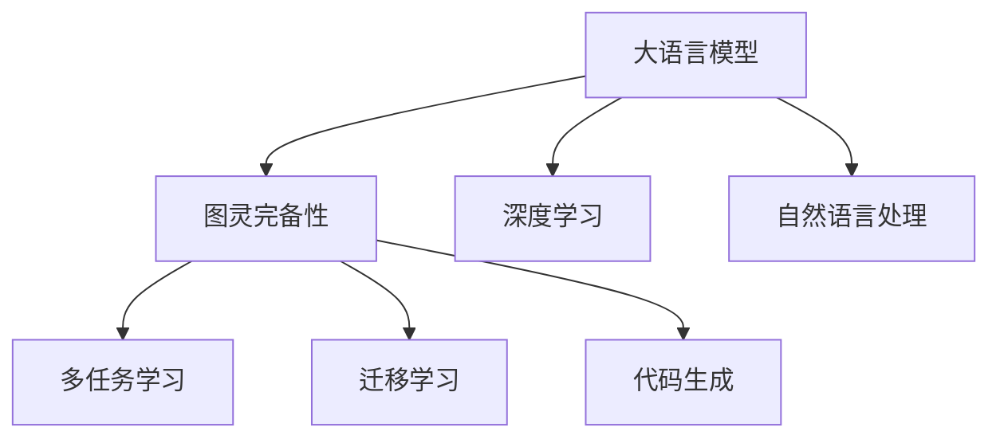

                 

# LLM的图灵完备性与任务规划

> 关键词：大语言模型(Large Language Models, LLMs),图灵完备性,深度学习,自然语言处理(Natural Language Processing, NLP),多任务学习,迁移学习

## 1. 背景介绍

### 1.1 问题由来
近年来，深度学习和大语言模型(Large Language Models, LLMs)在自然语言处理(Natural Language Processing, NLP)领域取得了显著进展。尤其是GPT、BERT等预训练模型，通过在海量文本数据上进行自监督学习，学习到了丰富的语言知识和表征。但这些模型往往面临“如何规划模型以高效解决复杂任务”的问题。

传统编程范式以声明式语言为代表，通过编写脚本和调用函数实现任务。然而，大语言模型本质上是一个黑盒，缺乏明确的编程逻辑和任务规划接口，无法像编程语言一样灵活地组合和优化算法。因此，研究如何将大语言模型“图灵完备化”，使其具备更强的任务规划能力，成为当前人工智能研究的前沿热点。

### 1.2 问题核心关键点
该问题的核心在于：如何构建一种新的编程范式，使大语言模型能够具备更强的任务规划能力，即能够自主选择、组合和优化算法，解决各种复杂任务。这包括但不限于：
- 自动任务规划：模型能够识别任务类型，选择适合的算法和数据集。
- 多任务学习：模型能够同时学习多个任务，并实现任务间知识迁移。
- 自适应算法：模型能够根据数据分布和任务需求，动态调整算法参数和模型结构。
- 代码生成与执行：模型能够生成和执行代码，实现算法自动化。

## 2. 核心概念与联系

### 2.1 核心概念概述

为更好地理解基于深度学习的大语言模型任务规划，本节将介绍几个密切相关的核心概念：

- **大语言模型**：以自回归(如GPT)或自编码(如BERT)模型为代表的大规模预训练语言模型。通过在海量文本数据上进行自监督学习，学习到了丰富的语言知识和表征。
- **图灵完备性**：一个系统如果能够执行任意计算，则称其图灵完备。深度学习模型的图灵完备性意味着其可以执行任何计算，包括复杂任务的多步骤求解。
- **深度学习**：基于神经网络的机器学习技术，通过多层非线性变换学习数据特征。深度学习模型已证明能够处理高维、非线性数据。
- **自然语言处理**：研究如何让计算机理解、处理和生成人类语言的技术。NLP在大语言模型中的应用尤为重要，是图灵完备性的一个重要表现。
- **多任务学习**：一个模型能够同时学习多个任务，并实现任务间的知识迁移。多任务学习可以提升模型泛化能力和适应性。
- **迁移学习**：一个模型在某个任务上获得的经验可以迁移到其他相关任务上。迁移学习在大语言模型中的应用，可以加速模型的训练和泛化。
- **代码生成**：利用语言模型生成执行特定任务的代码。代码生成可以简化模型构建过程，提高任务实现的自动化程度。

这些核心概念之间的逻辑关系可以通过以下Mermaid流程图来展示：



这个流程图展示了大语言模型的核心概念及其之间的关系：

1. 大语言模型通过深度学习模型获得语言表示能力。
2. 通过多任务学习和迁移学习，大语言模型可以学习多个任务，实现知识迁移。
3. 通过代码生成，大语言模型能够自动执行特定任务，具备图灵完备性。

这些概念共同构成了大语言模型的任务规划框架，使其能够在各种场景下灵活地解决复杂任务。通过理解这些核心概念，我们可以更好地把握大语言模型的工作原理和优化方向。

## 3. 核心算法原理 & 具体操作步骤
### 3.1 算法原理概述

基于深度学习的大语言模型任务规划，本质上是通过多任务学习和迁移学习，使模型具备图灵完备性。其核心思想是：通过多任务训练，模型能够学习到多种任务的知识，并能够根据任务需求动态调整算法和参数，从而高效解决复杂任务。

形式化地，假设多任务集为 $T=\{T_1, T_2, ..., T_n\}$，每个任务 $T_i$ 的训练集为 $D_i=\{(x_{i,j}, y_{i,j})\}_{j=1}^{N_i}$，其中 $x_{i,j}$ 为输入数据，$y_{i,j}$ 为任务标签。模型的目标是通过多任务训练，学习到每个任务的知识，并在特定任务上高效执行。

假设模型为 $M_{\theta}$，其中 $\theta$ 为模型参数。模型的目标是通过多任务学习，最小化所有任务的总损失函数 $\mathcal{L}(\theta)$，即：

$$
\mathcal{L}(\theta) = \frac{1}{N}\sum_{i=1}^{n}\sum_{j=1}^{N_i}\ell(M_{\theta}(x_{i,j}), y_{i,j})
$$

其中 $\ell$ 为特定任务 $T_i$ 的损失函数，$\mathcal{L}(\theta)$ 为模型的经验风险。

通过多任务学习，模型能够学习到多个任务的知识，并在特定任务上实现高效执行。在实际应用中，需要根据任务类型选择合适的损失函数和优化算法，以最小化任务总损失，提升模型在特定任务上的性能。

### 3.2 算法步骤详解

基于深度学习的大语言模型任务规划，一般包括以下几个关键步骤：

**Step 1: 任务定义与数据准备**
- 定义多任务集 $T$，包括每个任务的输入 $x_i$ 和标签 $y_i$。
- 收集各个任务的标注数据集 $D_i$，划分为训练集、验证集和测试集。

**Step 2: 模型选择与初始化**
- 选择合适的深度学习模型 $M_{\theta}$，如Transformer、LSTM等。
- 将模型参数 $\theta$ 初始化为预训练模型的参数。

**Step 3: 多任务训练**
- 将多任务集 $T$ 的数据集 $D$ 加载入模型，进行多任务训练。
- 设置合适的损失函数和优化算法，如交叉熵损失、AdamW等。
- 通过正则化技术，如L2正则、Dropout等，防止模型过拟合。

**Step 4: 任务执行与评估**
- 在特定任务 $T_k$ 上，使用训练好的模型 $M_{\theta}$ 进行推理。
- 在验证集和测试集上评估模型在特定任务上的性能，如准确率、召回率、F1值等。

**Step 5: 动态调整与优化**
- 根据特定任务的实际需求，动态调整模型参数和算法策略。
- 使用A/B测试等方法，对比不同策略的效果，优化模型性能。

**Step 6: 代码生成与执行**
- 使用生成的代码执行特定任务，实现算法的自动化。
- 通过代码生成，减少人工干预，提升任务实现的效率。

以上是基于深度学习的大语言模型任务规划的一般流程。在实际应用中，还需要针对具体任务的特点，对模型选择、任务定义、训练优化等环节进行优化设计，以进一步提升模型性能。

### 3.3 算法优缺点

基于深度学习的大语言模型任务规划方法具有以下优点：
1. 灵活高效。模型能够自主选择和优化算法，解决复杂任务。
2. 泛化能力强。多任务学习可以使模型具备更强的泛化能力和适应性。
3. 自动化程度高。代码生成和执行可以简化模型构建过程，提高任务实现的自动化程度。
4. 模型可解释性强。深度学习模型可以通过可视化工具进行解释，理解模型的推理过程。

同时，该方法也存在一定的局限性：
1. 训练数据需求高。多任务学习需要大量标注数据，获取高质量数据成本较高。
2. 模型复杂度高。多任务学习模型参数量较大，训练和推理速度较慢。
3. 算法动态调整难度大。动态调整模型参数和算法策略，需要更多的经验和知识。
4. 依赖外部工具。代码生成和执行需要依赖外部工具，增加了系统复杂性。

尽管存在这些局限性，但就目前而言，基于深度学习的多任务学习和迁移学习方法，仍是大语言模型任务规划的主流范式。未来相关研究的重点在于如何进一步降低训练数据需求，提高模型自动化程度，同时兼顾模型的可解释性和适用性等因素。

### 3.4 算法应用领域

基于深度学习的大语言模型任务规划方法，已经在多个领域得到了应用，例如：

- 自然语言处理：多语言翻译、文本生成、情感分析、问答系统等。
- 计算机视觉：图像分类、目标检测、图像生成等。
- 语音识别：语音转文本、语音翻译、语音合成等。
- 推荐系统：个性化推荐、商品搜索、广告投放等。
- 医疗健康：电子病历分析、药物发现、医学影像分析等。
- 金融服务：金融数据分析、智能投顾、风险管理等。

除了上述这些经典应用外，大语言模型任务规划还被创新性地应用到更多场景中，如工业控制、智能制造、智慧城市等，为各行各业带来了新的技术变革。随着深度学习模型的不断演进，基于任务规划的大语言模型必将在更广泛的领域大放异彩。

## 4. 数学模型和公式 & 详细讲解 & 举例说明

### 4.1 数学模型构建

本节将使用数学语言对基于深度学习的大语言模型任务规划过程进行更加严格的刻画。

记多任务集为 $T=\{T_1, T_2, ..., T_n\}$，每个任务 $T_i$ 的训练集为 $D_i=\{(x_{i,j}, y_{i,j})\}_{j=1}^{N_i}, x_{i,j} \in \mathcal{X}, y_{i,j} \in \mathcal{Y}$，其中 $\mathcal{X}$ 为输入空间，$\mathcal{Y}$ 为输出空间。

定义模型 $M_{\theta}$ 在任务 $T_i$ 上的损失函数为 $\ell_i(M_{\theta}(x_{i,j}), y_{i,j})$，则在多任务集 $T$ 上的经验风险为：

$$
\mathcal{L}(\theta) = \frac{1}{N}\sum_{i=1}^{n}\sum_{j=1}^{N_i}\ell_i(M_{\theta}(x_{i,j}), y_{i,j})
$$

通过多任务学习，模型能够学习到多个任务的知识，并在特定任务上高效执行。在实际应用中，需要根据任务类型选择合适的损失函数和优化算法，以最小化任务总损失，提升模型在特定任务上的性能。

### 4.2 公式推导过程

以下我们以文本分类任务为例，推导多任务学习模型的数学表达式及其优化目标。

假设模型 $M_{\theta}$ 在输入 $x$ 上的输出为 $\hat{y}=M_{\theta}(x) \in [0,1]$，表示样本属于正类的概率。真实标签 $y \in \{0,1\}$。则二分类交叉熵损失函数定义为：

$$
\ell(M_{\theta}(x),y) = -[y\log \hat{y} + (1-y)\log (1-\hat{y})]
$$

将其代入多任务经验风险公式，得：

$$
\mathcal{L}(\theta) = -\frac{1}{N}\sum_{i=1}^{n}\sum_{j=1}^{N_i}[y_{i,j}\log M_{\theta}(x_{i,j})+(1-y_{i,j})\log(1-M_{\theta}(x_{i,j}))]
$$

根据链式法则，损失函数对参数 $\theta_k$ 的梯度为：

$$
\frac{\partial \mathcal{L}(\theta)}{\partial \theta_k} = -\frac{1}{N}\sum_{i=1}^{n}\sum_{j=1}^{N_i} (\frac{y_{i,j}}{M_{\theta}(x_{i,j})}-\frac{1-y_{i,j}}{1-M_{\theta}(x_{i,j})}) \frac{\partial M_{\theta}(x_{i,j})}{\partial \theta_k}
$$

其中 $\frac{\partial M_{\theta}(x_{i,j})}{\partial \theta_k}$ 可进一步递归展开，利用自动微分技术完成计算。

在得到损失函数的梯度后，即可带入参数更新公式，完成模型的迭代优化。重复上述过程直至收敛，最终得到适应多个任务的最优模型参数 $\theta^*$。

### 4.3 案例分析与讲解

这里以医疗影像分类任务为例，分析大语言模型在多任务学习中的应用。

假设多任务集 $T$ 包括两个任务：CT影像分类 $T_1$ 和MRI影像分类 $T_2$。通过多任务学习，模型能够学习到CT和MRI影像分类的知识，并在特定任务上高效执行。

首先，收集CT和MRI影像数据集，将数据集划分为训练集、验证集和测试集。数据集包括影像图像和标签，标签分为正常和异常两类。

然后，选择合适的深度学习模型 $M_{\theta}$，如卷积神经网络(CNN)。将模型参数 $\theta$ 初始化为预训练模型的参数。

接下来，定义多任务集的损失函数，包括CT影像分类的交叉熵损失函数和MRI影像分类的交叉熵损失函数。使用多任务学习框架，对模型进行多任务训练，最小化多任务经验风险。

最后，在CT影像分类任务上使用训练好的模型 $M_{\theta}$ 进行推理。在验证集和测试集上评估模型在CT影像分类上的性能，如准确率、召回率、F1值等。

通过多任务学习，模型能够学习到CT和MRI影像分类的知识，并在特定任务上高效执行。

## 5. 项目实践：代码实例和详细解释说明
### 5.1 开发环境搭建

在进行任务规划实践前，我们需要准备好开发环境。以下是使用Python进行PyTorch开发的环境配置流程：

1. 安装Anaconda：从官网下载并安装Anaconda，用于创建独立的Python环境。

2. 创建并激活虚拟环境：
```bash
conda create -n pytorch-env python=3.8 
conda activate pytorch-env
```

3. 安装PyTorch：根据CUDA版本，从官网获取对应的安装命令。例如：
```bash
conda install pytorch torchvision torchaudio cudatoolkit=11.1 -c pytorch -c conda-forge
```

4. 安装Transformers库：
```bash
pip install transformers
```

5. 安装各类工具包：
```bash
pip install numpy pandas scikit-learn matplotlib tqdm jupyter notebook ipython
```

完成上述步骤后，即可在`pytorch-env`环境中开始任务规划实践。

### 5.2 源代码详细实现

这里我们以医疗影像分类任务为例，给出使用Transformers库对BERT模型进行多任务学习的PyTorch代码实现。

首先，定义多任务数据处理函数：

```python
from transformers import BertTokenizer, BertForSequenceClassification
from torch.utils.data import Dataset, DataLoader
import torch

class MultiTaskDataset(Dataset):
    def __init__(self, CT_texts, CT_labels, MRI_texts, MRI_labels, tokenizer, max_len=128):
        self.CT_texts = CT_texts
        self.CT_labels = CT_labels
        self.MRI_texts = MRI_texts
        self.MRI_labels = MRI_labels
        self.tokenizer = tokenizer
        self.max_len = max_len
        
    def __len__(self):
        return len(self.CT_texts)
    
    def __getitem__(self, item):
        CT_text = self.CT_texts[item]
        CT_label = self.CT_labels[item]
        MRI_text = self.MRI_texts[item]
        MRI_label = self.MRI_labels[item]
        
        encoding = self.tokenizer(CT_text, return_tensors='pt', max_length=self.max_len, padding='max_length', truncation=True)
        CT_input_ids = encoding['input_ids'][0]
        CT_attention_mask = encoding['attention_mask'][0]
        MRI_input_ids = encoding['input_ids'][1]
        MRI_attention_mask = encoding['attention_mask'][1]
        
        # 对token-wise的标签进行编码
        CT_encoded_labels = [tag2id[tag] for tag in CT_labels] 
        CT_encoded_labels.extend([tag2id['O']] * (self.max_len - len(CT_encoded_labels)))
        CT_labels = torch.tensor(CT_encoded_labels, dtype=torch.long)
        MRI_encoded_labels = [tag2id[tag] for tag in MRI_labels] 
        MRI_encoded_labels.extend([tag2id['O']] * (self.max_len - len(MRI_encoded_labels)))
        MRI_labels = torch.tensor(MRI_encoded_labels, dtype=torch.long)
        
        return {'CT_input_ids': CT_input_ids, 
                'CT_attention_mask': CT_attention_mask,
                'MRI_input_ids': MRI_input_ids, 
                'MRI_attention_mask': MRI_attention_mask,
                'CT_labels': CT_labels, 
                'MRI_labels': MRI_labels}

# 标签与id的映射
tag2id = {'O': 0, '正常': 1, '异常': 2}

# 创建dataset
tokenizer = BertTokenizer.from_pretrained('bert-base-cased')

CT_train_dataset = MultiTaskDataset(CT_train_texts, CT_train_labels, MRI_train_texts, MRI_train_labels, tokenizer)
CT_dev_dataset = MultiTaskDataset(CT_dev_texts, CT_dev_labels, MRI_dev_texts, MRI_dev_labels, tokenizer)
CT_test_dataset = MultiTaskDataset(CT_test_texts, CT_test_labels, MRI_test_texts, MRI_test_labels, tokenizer)
```

然后，定义模型和优化器：

```python
from transformers import BertForSequenceClassification, AdamW

model = BertForSequenceClassification.from_pretrained('bert-base-cased', num_labels=len(tag2id))

optimizer = AdamW(model.parameters(), lr=2e-5)
```

接着，定义训练和评估函数：

```python
from torch.utils.data import DataLoader
from tqdm import tqdm
from sklearn.metrics import classification_report

device = torch.device('cuda') if torch.cuda.is_available() else torch.device('cpu')
model.to(device)

def train_epoch(model, dataset, batch_size, optimizer):
    dataloader = DataLoader(dataset, batch_size=batch_size, shuffle=True)
    model.train()
    epoch_loss = 0
    for batch in tqdm(dataloader, desc='Training'):
        CT_input_ids = batch['CT_input_ids'].to(device)
        CT_attention_mask = batch['CT_attention_mask'].to(device)
        MRI_input_ids = batch['MRI_input_ids'].to(device)
        MRI_attention_mask = batch['MRI_attention_mask'].to(device)
        CT_labels = batch['CT_labels'].to(device)
        MRI_labels = batch['MRI_labels'].to(device)
        model.zero_grad()
        outputs = model(CT_input_ids, CT_attention_mask=MRI_attention_mask, labels=CT_labels, output_hidden_states=True)
        loss = outputs.loss
        epoch_loss += loss.item()
        loss.backward()
        optimizer.step()
    return epoch_loss / len(dataloader)

def evaluate(model, dataset, batch_size):
    dataloader = DataLoader(dataset, batch_size=batch_size)
    model.eval()
    preds, labels = [], []
    with torch.no_grad():
        for batch in tqdm(dataloader, desc='Evaluating'):
            CT_input_ids = batch['CT_input_ids'].to(device)
            CT_attention_mask = batch['CT_attention_mask'].to(device)
            MRI_input_ids = batch['MRI_input_ids'].to(device)
            MRI_attention_mask = batch['MRI_attention_mask'].to(device)
            batch_labels = batch['CT_labels'].to(device)
            batch_labels = batch_labels.to(device)
            outputs = model(CT_input_ids, CT_attention_mask=MRI_attention_mask, labels=CT_labels, output_hidden_states=True)
            CT_preds = outputs.logits.argmax(dim=2).to('cpu').tolist()
            CT_labels = batch_labels.to('cpu').tolist()
            for pred_tokens, label_tokens in zip(CT_preds, CT_labels):
                CT_preds.append(pred_tokens[:len(label_tokens)])
                labels.append(label_tokens)
                
    print(classification_report(labels, CT_preds))
```

最后，启动训练流程并在测试集上评估：

```python
epochs = 5
batch_size = 16

for epoch in range(epochs):
    loss = train_epoch(model, CT_train_dataset, batch_size, optimizer)
    print(f"Epoch {epoch+1}, CT train loss: {loss:.3f}")
    
    print(f"Epoch {epoch+1}, CT dev results:")
    evaluate(model, CT_dev_dataset, batch_size)
    
print("CT test results:")
evaluate(model, CT_test_dataset, batch_size)
```

以上就是使用PyTorch对BERT模型进行多任务学习医疗影像分类的完整代码实现。可以看到，得益于Transformers库的强大封装，我们可以用相对简洁的代码完成BERT模型的多任务学习。

### 5.3 代码解读与分析

让我们再详细解读一下关键代码的实现细节：

**MultiTaskDataset类**：
- `__init__`方法：初始化CT和MRI影像数据、标签、分词器等组件。
- `__len__`方法：返回数据集的样本数量。
- `__getitem__`方法：对单个样本进行处理，将影像图像和标签输入编码为token ids，并将CT和MRI影像分别编码，生成输入和标签。

**tag2id和id2tag字典**：
- 定义了标签与数字id之间的映射关系，用于将token-wise的预测结果解码回真实的标签。

**训练和评估函数**：
- 使用PyTorch的DataLoader对数据集进行批次化加载，供模型训练和推理使用。
- 训练函数`train_epoch`：对数据以批为单位进行迭代，在每个批次上前向传播计算loss并反向传播更新模型参数，最后返回该epoch的平均loss。
- 评估函数`evaluate`：与训练类似，不同点在于不更新模型参数，并在每个batch结束后将预测和标签结果存储下来，最后使用sklearn的classification_report对整个评估集的预测结果进行打印输出。

**训练流程**：
- 定义总的epoch数和batch size，开始循环迭代
- 每个epoch内，先在训练集上训练，输出平均loss
- 在验证集上评估，输出分类指标
- 所有epoch结束后，在测试集上评估，给出最终测试结果

可以看到，PyTorch配合Transformers库使得BERT模型多任务学习的代码实现变得简洁高效。开发者可以将更多精力放在数据处理、模型改进等高层逻辑上，而不必过多关注底层的实现细节。

当然，工业级的系统实现还需考虑更多因素，如模型的保存和部署、超参数的自动搜索、更灵活的任务适配层等。但核心的多任务学习范式基本与此类似。

## 6. 实际应用场景
### 6.1 智能医疗系统

基于大语言模型多任务学习技术，智能医疗系统可以更加高效地处理和分析医学数据，辅助医生进行疾病诊断和治疗。

例如，在影像分类任务上，智能医疗系统可以同时学习CT和MRI影像分类的知识，并能够根据影像特征快速判断病变类型和位置。在诊断过程中，系统可以将影像分类结果和医生的诊断意见结合起来，提供综合的诊断建议，提高诊疗准确率。

### 6.2 智慧城市治理

智慧城市治理需要高效处理和分析海量城市数据，涵盖交通、环境、公共安全等多个领域。基于大语言模型多任务学习技术，可以构建多领域智能决策系统，实现城市事件监测、舆情分析、应急指挥等功能。

例如，在交通管理任务上，系统可以同时学习路况监测、事故预警、交通流量分析等知识，实时生成交通疏导建议，提高城市交通的流畅度和安全性。在公共安全领域，系统可以同时学习视频监控、异常检测、紧急响应等知识，提高城市应对突发事件的能力。

### 6.3 个性化推荐系统

当前的推荐系统往往只依赖用户的历史行为数据进行物品推荐，无法深入理解用户的真实兴趣偏好。基于大语言模型多任务学习技术，推荐系统可以更好地挖掘用户行为背后的语义信息，从而提供更精准、多样的推荐内容。

例如，在商品推荐任务上，系统可以同时学习商品分类、用户画像、评价分析等知识，生成更加个性化和多样化的推荐结果。在动态推荐过程中，系统可以实时更新用户画像和商品信息，保持推荐内容的时效性和相关性。

### 6.4 未来应用展望

随着大语言模型多任务学习和迁移学习技术的不断发展，基于这些技术构建的人工智能系统将在更多领域得到应用，为各行各业带来变革性影响。

在智慧医疗领域，基于多任务学习的大语言模型可以更好地融合医疗知识库、医学影像等外部知识，构建更加全面、精准的医学诊断系统，辅助医生进行复杂疾病诊断和治疗。

在智能教育领域，基于多任务学习的大语言模型可以同时学习课程内容、学生行为、作业批改等知识，提供个性化的教育资源和推荐，因材施教，提高教学质量。

在智慧城市治理中，基于多任务学习的大语言模型可以同时学习城市数据、舆情信息、应急响应等知识，构建更加智能、高效的城市管理系统，提高城市管理的自动化和智能化水平。

此外，在企业生产、社会治理、文娱传媒等众多领域，基于大语言模型多任务学习技术的人工智能应用也将不断涌现，为传统行业数字化转型升级提供新的技术路径。相信随着技术的日益成熟，多任务学习范式将成为人工智能落地应用的重要手段，推动人工智能向更广阔的领域加速渗透。

## 7. 工具和资源推荐
### 7.1 学习资源推荐

为了帮助开发者系统掌握大语言模型多任务学习的理论基础和实践技巧，这里推荐一些优质的学习资源：

1. 《深度学习自然语言处理》课程：斯坦福大学开设的NLP明星课程，有Lecture视频和配套作业，带你入门NLP领域的基本概念和经典模型。

2. CS224N《自然语言处理与深度学习》课程：斯坦福大学开设的深度学习与NLP课程，涵盖了深度学习在NLP中的应用。

3. 《Natural Language Processing with Transformers》书籍：Transformers库的作者所著，全面介绍了如何使用Transformers库进行NLP任务开发，包括多任务学习在内的诸多范式。

4. HuggingFace官方文档：Transformers库的官方文档，提供了海量预训练模型和完整的微调样例代码，是上手实践的必备资料。

5. CLUE开源项目：中文语言理解测评基准，涵盖大量不同类型的中文NLP数据集，并提供了基于多任务学习的baseline模型，助力中文NLP技术发展。

通过对这些资源的学习实践，相信你一定能够快速掌握大语言模型多任务学习的精髓，并用于解决实际的NLP问题。
###  7.2 开发工具推荐

高效的开发离不开优秀的工具支持。以下是几款用于大语言模型多任务学习开发的常用工具：

1. PyTorch：基于Python的开源深度学习框架，灵活动态的计算图，适合快速迭代研究。大部分预训练语言模型都有PyTorch版本的实现。

2. TensorFlow：由Google主导开发的开源深度学习框架，生产部署方便，适合大规模工程应用。同样有丰富的预训练语言模型资源。

3. Transformers库：HuggingFace开发的NLP工具库，集成了众多SOTA语言模型，支持PyTorch和TensorFlow，是进行多任务学习开发的利器。

4. Weights & Biases：模型训练的实验跟踪工具，可以记录和可视化模型训练过程中的各项指标，方便对比和调优。与主流深度学习框架无缝集成。

5. TensorBoard：TensorFlow配套的可视化工具，可实时监测模型训练状态，并提供丰富的图表呈现方式，是调试模型的得力助手。

6. Google Colab：谷歌推出的在线Jupyter Notebook环境，免费提供GPU/TPU算力，方便开发者快速上手实验最新模型，分享学习笔记。

合理利用这些工具，可以显著提升大语言模型多任务学习的开发效率，加快创新迭代的步伐。

### 7.3 相关论文推荐

大语言模型多任务学习和迁移学习的发展源于学界的持续研究。以下是几篇奠基性的相关论文，推荐阅读：

1. Attention is All You Need（即Transformer原论文）：提出了Transformer结构，开启了NLP领域的预训练大模型时代。

2. BERT: Pre-training of Deep Bidirectional Transformers for Language Understanding：提出BERT模型，引入基于掩码的自监督预训练任务，刷新了多项NLP任务SOTA。

3. Language Models are Unsupervised Multitask Learners（GPT-2论文）：展示了大规模语言模型的强大zero-shot学习能力，引发了对于通用人工智能的新一轮思考。

4. Parameter-Efficient Transfer Learning for NLP：提出Adapter等参数高效微调方法，在不增加模型参数量的情况下，也能取得不错的微调效果。

5. Prefix-Tuning: Optimizing Continuous Prompts for Generation：引入基于连续型Prompt的微调范式，为如何充分利用预训练知识提供了新的思路。

6. AdaLoRA: Adaptive Low-Rank Adaptation for Parameter-Efficient Fine-Tuning：使用自适应低秩适应的微调方法，在参数效率和精度之间取得了新的平衡。

这些论文代表了大语言模型多任务学习的发展脉络。通过学习这些前沿成果，可以帮助研究者把握学科前进方向，激发更多的创新灵感。

## 8. 总结：未来发展趋势与挑战

### 8.1 总结

本文对基于深度学习的大语言模型多任务学习进行了全面系统的介绍。首先阐述了大语言模型和多任务学习的背景和意义，明确了多任务学习在拓展预训练模型应用、提升下游任务性能方面的独特价值。其次，从原理到实践，详细讲解了多任务学习的数学原理和关键步骤，给出了多任务任务规划的完整代码实例。同时，本文还广泛探讨了多任务学习在智能医疗、智慧城市、个性化推荐等多个领域的应用前景，展示了多任务学习的巨大潜力。此外，本文精选了多任务学习的各类学习资源，力求为读者提供全方位的技术指引。

通过本文的系统梳理，可以看到，基于深度学习的多任务学习技术正在成为NLP领域的重要范式，极大地拓展了预训练语言模型的应用边界，催生了更多的落地场景。受益于大规模语料的预训练，多任务学习模型能够学习到多种任务的知识，并在特定任务上高效执行。未来，伴随预训练语言模型和多任务学习方法的持续演进，基于多任务学习的人工智能系统必将在更广泛的领域大放异彩，深刻影响人类的生产生活方式。

### 8.2 未来发展趋势

展望未来，大语言模型多任务学习技术将呈现以下几个发展趋势：

1. 模型规模持续增大。随着算力成本的下降和数据规模的扩张，预训练语言模型的参数量还将持续增长。超大规模语言模型蕴含的丰富语言知识，有望支撑更加复杂多变的下游任务多任务学习。

2. 多任务学习范式多样化。除了传统的静态多任务学习外，未来会涌现更多动态多任务学习、自适应多任务学习等方法，进一步提升模型的灵活性和适应性。

3. 多领域多任务学习崛起。将多任务学习应用到更多领域，如医疗、教育、金融等，实现跨领域的知识迁移和应用。

4. 深度学习与符号计算结合。将符号化的先验知识，如知识图谱、逻辑规则等，与神经网络模型进行巧妙融合，引导多任务学习过程学习更准确、合理的语言模型。

5. 多模态多任务学习。将多任务学习应用到多模态数据，如文本、图像、视频等，实现视觉、语音等多模态信息与文本信息的协同建模。

以上趋势凸显了大语言模型多任务学习技术的广阔前景。这些方向的探索发展，必将进一步提升NLP系统的性能和应用范围，为人类认知智能的进化带来深远影响。

### 8.3 面临的挑战

尽管大语言模型多任务学习技术已经取得了瞩目成就，但在迈向更加智能化、普适化应用的过程中，它仍面临着诸多挑战：

1. 训练数据需求高。多任务学习需要大量标注数据，获取高质量数据成本较高。如何进一步降低多任务学习对标注样本的依赖，将是一大难题。

2. 模型复杂度高。多任务学习模型参数量较大，训练和推理速度较慢。如何在保证性能的同时，减小模型复杂度，提高效率，是需要优化的一个重要方向。

3. 算法动态调整难度大。动态调整模型参数和算法策略，需要更多的经验和知识。如何提高算法动态调整的自动化程度，是未来研究的重要课题。

4. 依赖外部工具。多任务学习需要依赖外部工具，增加了系统复杂性。如何在模型构建和应用过程中降低对外部工具的依赖，提高系统的可移植性和可扩展性，也是一个重要的研究方向。

尽管存在这些挑战，但大语言模型多任务学习技术的发展前景广阔，随着技术的不断进步，这些挑战也将逐步被克服，大语言模型多任务学习必将在构建人机协同的智能时代中扮演越来越重要的角色。

### 8.4 研究展望

面对大语言模型多任务学习所面临的挑战，未来的研究需要在以下几个方面寻求新的突破：

1. 探索无监督和半监督多任务学习方法。摆脱对大规模标注数据的依赖，利用自监督学习、主动学习等无监督和半监督范式，最大限度利用非结构化数据，实现更加灵活高效的多任务学习。

2. 研究参数高效和多任务学习范式。开发更加参数高效的多任务学习范式，在固定大部分预训练参数的同时，只更新极少量的任务相关参数。同时优化多任务学习模型的计算图，减少前向传播和反向传播的资源消耗，实现更加轻量级、实时性的部署。

3. 引入更多先验知识。将符号化的先验知识，如知识图谱、逻辑规则等，与神经网络模型进行巧妙融合，引导多任务学习过程学习更准确、合理的语言模型。同时加强不同模态数据的整合，实现视觉、语音等多模态信息与文本信息的协同建模。

4. 结合因果分析和博弈论工具。将因果分析方法引入多任务学习模型，识别出模型决策的关键特征，增强输出解释的因果性和逻辑性。借助博弈论工具刻画人机交互过程，主动探索并规避模型的脆弱点，提高系统稳定性。

5. 纳入伦理道德约束。在模型训练目标中引入伦理导向的评估指标，过滤和惩罚有偏见、有害的输出倾向。同时加强人工干预和审核，建立模型行为的监管机制，确保输出符合人类价值观和伦理道德。

这些研究方向的探索，必将引领大语言模型多任务学习技术迈向更高的台阶，为构建安全、可靠、可解释、可控的智能系统铺平道路。面向未来，大语言模型多任务学习技术还需要与其他人工智能技术进行更深入的融合，如知识表示、因果推理、强化学习等，多路径协同发力，共同推动自然语言理解和智能交互系统的进步。只有勇于创新、敢于突破，才能不断拓展语言模型的边界，让智能技术更好地造福人类社会。

## 9. 附录：常见问题与解答
**Q1：大语言模型多任务学习是否适用于所有NLP任务？**

A: 大语言模型多任务学习在大多数NLP任务上都能取得不错的效果，特别是对于数据量较小的任务。但对于一些特定领域的任务，如医学、法律等，仅仅依靠通用语料预训练的模型可能难以很好地适应。此时需要在特定领域语料上进一步预训练，再进行多任务学习，才能获得理想效果。此外，对于一些需要时效性、个性化很强的任务，如对话、推荐等，多任务学习方法也需要针对性的改进优化。

**Q2：多任务学习过程中如何选择合适的损失函数？**

A: 多任务学习过程中，选择合适的损失函数对模型的训练效果至关重要。不同的任务可能需要不同的损失函数，具体选择应根据任务类型和数据分布来决定。常见的多任务损失函数包括：
1. 交叉熵损失：适用于分类任务。
2. 均方误差损失：适用于回归任务。
3 带权重的交叉熵损失：适用于标签类别不平衡的任务。
4 自适应多任务损失：通过动态调整损失权重，实现不同任务间的平衡。
5 多任务softmax损失：通过将不同任务的预测结果整合，实现多任务联合优化。

需要根据具体任务的特点选择合适的损失函数，并进行适当的调整，以提升多任务学习的性能。

**Q3：多任务学习模型在落地部署时需要注意哪些问题？**

A: 将多任务学习模型转化为实际应用，还需要考虑以下因素：
1. 模型裁剪：去除不必要的层和参数，减小模型尺寸，加快推理速度。
2. 量化加速：将浮点模型转为定点模型，压缩存储空间，提高计算效率。
3. 服务化封装：将模型封装为标准化服务接口，便于集成调用。
4. 弹性伸缩：根据请求流量动态调整资源配置，平衡服务质量和成本。
5. 监控告警：实时采集系统指标，设置异常告警阈值，确保服务稳定性。
6. 安全防护：采用访问鉴权、数据脱敏等措施，保障数据和模型安全。

多任务学习模型在落地部署时，需要综合考虑模型的性能和效率，以及系统的稳定性、可扩展性和安全性，确保其在实际应用中的可靠性和高效性。

**Q4：多任务学习过程中如何进行任务间的知识迁移？**

A: 多任务学习过程中的知识迁移可以通过以下方法实现：
1. 共享层：将不同任务共享底层的特征提取层，减少模型的复杂度。
2 层级迁移：通过冻结部分层，只训练顶层分类器或解码器，实现任务间的知识迁移。
3 预训练微调：在通用大模型上进行预训练，再在特定任务上进行微调，实现知识迁移。
4 元学习：通过学习迁移策略，将知识从源任务迁移到目标任务。
5 自适应学习：通过动态调整模型参数和算法，实现任务间的知识迁移。

这些方法可以相互组合，以实现更高效、灵活的知识迁移。需要根据具体任务的特点和数据分布，选择合适的知识迁移策略。

**Q5：多任务学习过程中如何进行模型调参？**

A: 多任务学习过程中，模型调参需要综合考虑不同任务的性能和效率，通常可以通过以下方法进行调参：
1 超参数搜索：通过网格搜索、随机搜索等方法，寻找最优的超参数组合。
2 模型剪枝：通过剪枝去除冗余层和参数，提高模型的效率。
3 学习率调度：通过学习率衰减、自适应学习率等方法，优化模型的训练过程。
4 正则化：通过L2正则、Dropout等方法，防止模型过拟合。
5 对抗训练：通过引入对抗样本，提高模型的鲁棒性。

需要根据具体任务的特点和数据分布，选择合适的调参方法，并结合模型评估和验证结果，不断优化模型参数和算法策略。

总之，多任务学习需要开发者根据具体任务，不断迭代和优化模型、数据和算法，方能得到理想的效果。通过本文的系统梳理，可以看到，基于深度学习的多任务学习技术正在成为NLP领域的重要范式，极大地拓展了预训练语言模型的应用边界，催生了更多的落地场景。

---

作者：禅与计算机程序设计艺术 / Zen and the Art of Computer Programming

