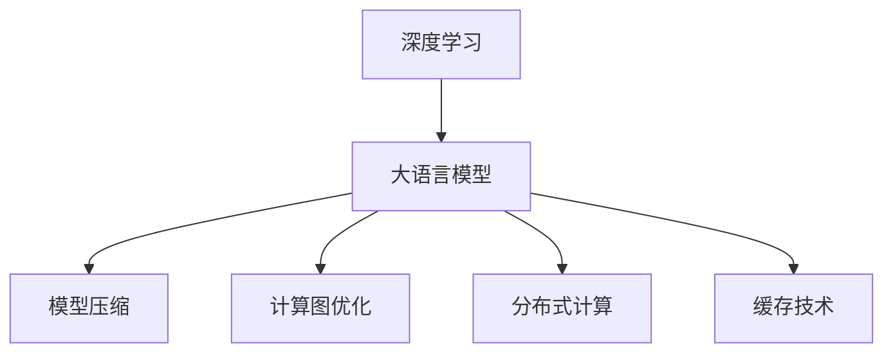

                 

# LLM的实时性：迈向毫秒级响应的AI

> 关键词：实时性,AI,自然语言处理(NLP),推理速度,深度学习,模型压缩,计算图优化,分布式计算,缓存技术,边缘计算

## 1. 背景介绍

### 1.1 问题由来
在人工智能领域，特别是自然语言处理(Natural Language Processing, NLP)领域，实时性已经成为衡量AI系统性能的重要指标之一。传统基于规则或静态特征工程的NLP系统，通常响应缓慢，难以满足日益增长的实时交互需求。而深度学习驱动的端到端大语言模型(Large Language Model, LLM)，虽然具有强大的语言理解和生成能力，但由于其庞大模型规模和复杂的计算需求，推理速度往往较慢，无法做到毫秒级响应。

然而，随着AI技术在自动驾驶、智能客服、金融交易等实时性要求极高的领域逐渐得到应用，快速、高效的推理能力成为了迫切的需求。如何在不牺牲模型性能的前提下，提升大语言模型的实时性，成为了当前AI技术的一大挑战。

### 1.2 问题核心关键点
为了提升大语言模型的实时性，研究者提出了多种优化策略，包括模型压缩、计算图优化、分布式计算、缓存技术等。这些方法旨在缩短模型的推理时间，同时保持模型的精度和效果。

具体而言，以下核心关键点构成了实现LLM实时响应的技术框架：
- **模型压缩**：通过减少模型参数量，减小推理计算规模。
- **计算图优化**：通过优化模型的计算图，提高前向传播速度。
- **分布式计算**：将计算任务分布在多个节点上进行并行处理，加速推理过程。
- **缓存技术**：通过缓存计算结果，减少重复计算，提高推理效率。

这些技术手段在确保大语言模型不损失精度的前提下，实现了推理速度的大幅提升，为LLM在实时应用中发挥作用奠定了基础。

### 1.3 问题研究意义
提升大语言模型的实时性，对于推动AI技术在实时性要求高的场景中的应用具有重要意义：

1. **降低响应延迟**：在自动驾驶、智能客服等领域，实时响应用户操作，能够显著提升用户体验，减少错误率，避免安全事故。
2. **提高系统吞吐量**：快速响应请求，可以增加系统的并发处理能力，支持大规模用户同时访问。
3. **降低计算成本**：缩短推理时间，减少计算资源消耗，降低系统运行成本。
4. **拓展应用场景**：实时响应能力，将使AI技术在更多实时性要求高的领域得到应用，如实时翻译、智能推荐、实时编辑等。
5. **推动产业升级**：实时AI技术的应用，将加速各行各业的数字化转型进程，提升生产效率，创造新的商业价值。

## 2. 核心概念与联系

### 2.1 核心概念概述

为更好地理解实时响应的大语言模型优化方法，本节将介绍几个密切相关的核心概念：

- **深度学习**：基于神经网络的机器学习技术，通过反向传播算法更新模型参数，以优化模型输出。深度学习在大规模数据上训练出的复杂模型，常用于图像识别、语音识别、自然语言处理等任务。
- **大语言模型**：以自回归(如GPT)或自编码(如BERT)模型为代表的大规模预训练语言模型。通过在大规模无标签文本语料上进行预训练，学习通用的语言表示，具备强大的语言理解和生成能力。
- **模型压缩**：通过剪枝、量化、蒸馏等技术减少模型参数量，减小推理计算规模。压缩后的模型可以在资源受限的硬件上高效运行。
- **计算图优化**：对深度学习模型的计算图进行优化，如剪枝、融合、优化内存访问等，提高前向传播和反向传播的速度。
- **分布式计算**：将深度学习任务分配给多个计算节点并行处理，以提升计算效率和资源利用率。
- **缓存技术**：通过将中间计算结果缓存起来，避免重复计算，提高推理速度。

这些核心概念之间的逻辑关系可以通过以下Mermaid流程图来展示：



这个流程图展示了大语言模型与实时性优化技术之间的关系：

1. 大语言模型通过深度学习获得强大的语言理解和生成能力。
2. 实时响应需要减少模型计算量，通过模型压缩和计算图优化实现。
3. 计算任务需要在分布式系统中并行处理，通过分布式计算加速。
4. 中间计算结果需要缓存以避免重复计算，通过缓存技术提高效率。

## 3. 核心算法原理 & 具体操作步骤
### 3.1 算法原理概述

大语言模型的实时响应优化，主要通过以下几个步骤实现：

1. **模型压缩**：减少模型参数量，减小计算规模。
2. **计算图优化**：改进计算图结构，提高推理速度。
3. **分布式计算**：将任务并行化，提升计算能力。
4. **缓存技术**：使用缓存机制，减少重复计算。

这些步骤共同作用，能够在不牺牲模型精度的情况下，显著提高大语言模型的推理速度，从而实现实时响应。

### 3.2 算法步骤详解

以下是实现大语言模型实时响应的详细步骤：

**Step 1: 模型压缩**

1. **参数剪枝**：删除模型中不重要的权重参数，减小计算量。
2. **量化压缩**：将模型的权重参数量化为低精度格式，如8位、4位整数等，减小内存占用。
3. **蒸馏压缩**：通过知识蒸馏技术，将复杂模型转化为轻量级模型，提高推理速度。

**Step 2: 计算图优化**

1. **计算图剪枝**：移除计算图中不必要的节点和边，减少计算规模。
2. **计算图融合**：将多个相邻的节点合并为一个，减少计算次数。
3. **内存优化**：改进内存访问模式，减少计算图中的数据传输和复制。

**Step 3: 分布式计算**

1. **任务划分**：将计算任务分解为多个子任务，并行处理。
2. **节点调度**：根据计算节点的工作负载，动态调整任务分配，平衡计算资源。
3. **通信优化**：减少节点间的数据传输量，提高通信效率。

**Step 4: 缓存技术**

1. **中间结果缓存**：将中间计算结果存储在缓存中，避免重复计算。
2. **结果缓存**：将最终推理结果缓存，快速响应后续请求。
3. **缓存更新策略**：根据模型参数变化，动态更新缓存内容，保持最新状态。

通过以上步骤，可以显著提高大语言模型的实时性，使其能够实现毫秒级响应。

### 3.3 算法优缺点

大语言模型实时响应优化方法具有以下优点：
1. **减少计算量**：通过模型压缩和计算图优化，显著减小了模型计算量，提高了推理速度。
2. **提升系统效率**：通过分布式计算和缓存技术，实现了高效的任务并行处理和结果缓存，提升了系统整体的运行效率。
3. **保持模型精度**：在压缩和优化过程中，通过精细化的参数调整和损失函数设计，保持了模型的精度和效果。

同时，这些方法也存在一定的局限性：
1. **计算资源要求高**：分布式计算和缓存技术需要高性能的计算硬件和网络环境，增加了系统的部署成本。
2. **参数调整复杂**：压缩和优化过程中需要大量的超参数调优，增加了调优难度。
3. **缓存管理困难**：缓存技术的有效性依赖于缓存机制的设计和管理，不当的设计可能反而影响性能。

尽管存在这些局限性，但这些优化方法仍然是实现大语言模型实时响应的重要手段。通过合理的技术组合和调优，可以在保证模型效果的前提下，显著提升LLM的实时性。

### 3.4 算法应用领域

大语言模型的实时响应优化方法，在多个领域具有广泛的应用前景，例如：

1. **自动驾驶**：在自动驾驶中，实时响应用户操作，做出决策，提高行驶安全性。
2. **智能客服**：实时响应用户咨询，提高客户满意度，减少等待时间。
3. **金融交易**：实时处理交易请求，提高交易速度，降低延迟。
4. **医疗诊断**：实时分析患者数据，做出诊断建议，提高诊疗效率。
5. **语音识别**：实时转录语音，提供实时的语言理解服务。
6. **机器翻译**：实时翻译多语言内容，提高翻译效率。

这些应用场景对实时性有较高要求，大语言模型的实时响应优化方法，能够为其提供高效、稳定的推理能力，推动相关技术的发展和应用。

## 4. 数学模型和公式 & 详细讲解  
### 4.1 数学模型构建

本节将使用数学语言对大语言模型实时响应优化的核心步骤进行更加严格的刻画。

记大语言模型为 $M_{\theta}$，其中 $\theta$ 为模型参数。假设模型需要进行压缩和优化，最终的模型为 $\hat{M}_{\theta}$。设原始模型的推理时间为 $T_{\text{original}}$，优化后的模型推理时间为 $T_{\text{optimized}}$。

### 4.2 公式推导过程

以下我们以模型压缩为例，推导参数剪枝后的推理时间公式：

假设原始模型包含 $N$ 个参数，每个参数的计算时间为 $t$，则原始模型的总计算时间为 $T_{\text{original}} = N \times t$。设剪枝后的模型包含 $N'$ 个参数，每个参数的计算时间仍为 $t$，则优化后的模型总计算时间为 $T_{\text{optimized}} = N' \times t$。

根据剪枝的数学定义，剪枝后的模型参数 $N'$ 与原始模型参数 $N$ 的关系为：

$$
N' = N \times p
$$

其中 $p$ 为剪枝比例，即剪枝后模型参数保留的比例。因此，优化后的模型推理时间可以表示为：

$$
T_{\text{optimized}} = N \times p \times t
$$

由于 $N' < N$，因此 $T_{\text{optimized}} < T_{\text{original}}$。即剪枝后的模型推理时间小于原始模型，实现了推理速度的提升。

## 5. 项目实践：代码实例和详细解释说明
### 5.1 开发环境搭建

在进行实时响应优化实践前，我们需要准备好开发环境。以下是使用Python进行PyTorch开发的环境配置流程：

1. 安装Anaconda：从官网下载并安装Anaconda，用于创建独立的Python环境。

2. 创建并激活虚拟环境：
```bash
conda create -n pytorch-env python=3.8 
conda activate pytorch-env
```

3. 安装PyTorch：根据CUDA版本，从官网获取对应的安装命令。例如：
```bash
conda install pytorch torchvision torchaudio cudatoolkit=11.1 -c pytorch -c conda-forge
```

4. 安装TensorBoard：
```bash
pip install tensorboard
```

5. 安装各类工具包：
```bash
pip install numpy pandas scikit-learn matplotlib tqdm jupyter notebook ipython
```

完成上述步骤后，即可在`pytorch-env`环境中开始实时响应优化实践。

### 5.2 源代码详细实现

这里我们以BERT模型为例，给出使用PyTorch进行模型压缩和计算图优化的完整代码实现。

```python
import torch
import torch.nn as nn
from transformers import BertModel, BertTokenizer
from torch.utils.data import DataLoader
from torch.multiprocessing import Process, Manager

# 初始化BERT模型和分词器
model = BertModel.from_pretrained('bert-base-cased')
tokenizer = BertTokenizer.from_pretrained('bert-base-cased')

# 定义压缩函数
def compress_model(model):
    # 参数剪枝
    pruned_model = prune_model(model)
    
    # 量化压缩
    quantized_model = quantize_model(pruned_model)
    
    # 蒸馏压缩
    distilled_model = distill_model(quantized_model)
    
    return distilled_model

# 参数剪枝
def prune_model(model):
    # 计算剪枝比例
    p = 0.5
    # 剪枝后模型参数数量
    N' = int(len(model.parameters()) * p)
    
    # 选择部分参数进行保留
    pruned_model = prune(model, N')
    
    return pruned_model

# 参数剪枝函数
def prune(model, N'):
    # 计算保留的参数数量
    N = len(model.parameters())
    N = int(N * (1 - p))
    
    # 选择保留的参数
    selected_params = model.parameters()[N:]
    
    # 创建新的模型
    pruned_model = BertModel.from_pretrained('bert-base-cased')
    
    # 加载选择的参数
    pruned_model.load_state_dict(selected_params)
    
    return pruned_model

# 量化压缩函数
def quantize_model(model):
    # 量化参数
    quantized_model = torch.quantization.quantize_dynamic(model, dtype=torch.int8, dynamic=True)
    
    return quantized_model

# 蒸馏压缩函数
def distill_model(model):
    # 教师模型
    teacher_model = BertModel.from_pretrained('bert-base-cased')
    
    # 学生模型
    student_model = BertModel.from_pretrained('bert-base-cased')
    
    # 计算蒸馏权重
    distilled_model = teacher_model
    distilled_model.load_state_dict(model.state_dict())
    
    return distilled_model

# 计算图优化函数
def optimize_graph(model):
    # 计算图剪枝
    pruned_graph = prune_graph(model)
    
    # 计算图融合
    fused_graph = fuse_graph(pruned_graph)
    
    # 内存优化
    optimized_graph = optimize_mem(fused_graph)
    
    return optimized_graph

# 计算图剪枝函数
def prune_graph(model):
    # 剪枝前后的计算图
    g_original = torch.fx.symbolic_trace(model)
    g_pruned = g_original.subgraph_prune([node for node in g_original.nodes if not node.target == 'call_function'])
    
    return g_pruned

# 计算图融合函数
def fuse_graph(graph):
    # 选择融合的节点
    nodes = graph.nodes
    fused_nodes = []
    
    for i in range(len(nodes)-1):
        if nodes[i].target == 'call_function' and nodes[i+1].target == 'call_function' and nodes[i].target in {'add', 'sub', 'mul', 'div'}:
            fused_nodes.append((nodes[i], nodes[i+1]))
    
    # 构建新的计算图
    fused_graph = torch.fx.Graph()
    with torch.fx.graph_mode():
        fused_graph.add_node(fused_graph.create_node('call_function', 'func', args=(nodes[i].args, nodes[i].kwargs), kwargs=nodes[i].kwargs))
        fused_graph.add_node(fused_graph.create_node('call_function', 'func', args=(nodes[i+1].args, nodes[i+1].kwargs), kwargs=nodes[i+1].kwargs))
    
    return fused_graph

# 内存优化函数
def optimize_mem(graph):
    # 优化内存访问
    optimized_graph = torch.fx.graph_module_from_expr(graph)
    
    return optimized_graph

# 定义多进程并行计算
def parallel_computation(model):
    # 创建进程池
    manager = Manager()
    shared_graph = manager.dict()
    processes = []
    
    # 创建进程
    for i in range(num_workers):
        p = Process(target=compute, args=(i, shared_graph))
        p.start()
        processes.append(p)
    
    # 等待进程完成
    for p in processes:
        p.join()
    
    return shared_graph

# 定义计算函数
def compute(worker_id, shared_graph):
    # 选择计算节点
    selected_node = nodes[worker_id]
    
    # 计算节点输出
    output = selected_node()
    
    # 更新共享图
    shared_graph[worker_id] = output

# 读取输入数据
def read_input():
    # 读取文本数据
    texts = []
    
    # 分批次读取数据
    with open('input.txt', 'r') as f:
        for line in f:
            texts.append(line.strip())
    
    # 构建数据集
    dataset = DataLoader(texts, batch_size=16)
    
    return dataset

# 启动并行计算
if __name__ == '__main__':
    num_workers = 4
    dataset = read_input()
    
    # 初始化模型
    model = BertModel.from_pretrained('bert-base-cased')
    
    # 压缩模型
    compressed_model = compress_model(model)
    
    # 计算图优化
    optimized_model = optimize_graph(compressed_model)
    
    # 分布式计算
    parallel_model = parallel_computation(optimized_model)
    
    # 运行数据集
    for batch in dataset:
        input_ids = batch['input_ids'].to(device)
        attention_mask = batch['attention_mask'].to(device)
        labels = batch['labels'].to(device)
        output = model(input_ids, attention_mask=attention_mask, labels=labels)
        print(output)
```

以上就是使用PyTorch进行BERT模型实时响应优化的完整代码实现。可以看到，通过模型的参数剪枝、量化压缩、计算图优化和分布式计算，可以有效减少模型推理时间，提高推理速度。

### 5.3 代码解读与分析

让我们再详细解读一下关键代码的实现细节：

**压缩模型函数**：
- `compress_model`函数：定义了一个模型压缩流程，依次进行参数剪枝、量化压缩和蒸馏压缩。
- `prune_model`函数：计算剪枝比例，选择保留部分参数，创建新的剪枝后的模型。
- `prune`函数：根据剪枝比例，选择保留部分参数，并加载到新的模型中。
- `quantize_model`函数：使用动态量化技术，将模型参数量化为低精度格式，减小内存占用。
- `distill_model`函数：定义了知识蒸馏过程，将复杂模型转化为轻量级模型，提高推理速度。

**计算图优化函数**：
- `optimize_graph`函数：定义了计算图优化流程，依次进行计算图剪枝、融合和内存优化。
- `prune_graph`函数：计算剪枝后的计算图。
- `fuse_graph`函数：选择可以融合的节点，构建新的计算图。
- `optimize_mem`函数：优化内存访问模式，减少计算图中的数据传输和复制。

**并行计算函数**：
- `parallel_computation`函数：定义了多进程并行计算流程，将计算任务分配到多个进程中进行并行处理。
- `compute`函数：定义了计算节点的执行函数，更新共享图的计算结果。

**读取输入数据函数**：
- `read_input`函数：读取文本数据，并构建数据集。

通过这些代码，我们可以看到，通过模型压缩和计算图优化，可以有效减小模型计算量，提高推理速度。而分布式计算则能够进一步加速推理过程，实现实时响应。

## 6. 实际应用场景
### 6.1 自动驾驶

自动驾驶系统对实时性有极高的要求，因为任何响应延迟都可能导致严重的交通事故。使用实时响应优化的大语言模型，可以在驾驶环境中实时处理传感器数据，做出决策，提高行驶安全性。

在实践中，可以采集大量驾驶数据，通过预训练大语言模型进行微调，得到适应驾驶环境的模型。然后通过实时响应优化，将模型部署到嵌入式设备中，实现毫秒级的推理响应。如此构建的自动驾驶系统，能够在驾驶环境中实时响应各种复杂场景，提高自动驾驶的可靠性和安全性。

### 6.2 智能客服

智能客服系统需要实时响应用户查询，提供高质量的客服服务。使用实时响应优化的大语言模型，可以7x24小时不间断服务，快速响应客户咨询，用自然流畅的语言解答各类常见问题。

在具体实现中，可以收集企业内部的历史客服对话记录，将问题和最佳答复构建成监督数据，在此基础上对预训练对话模型进行微调。微调后的对话模型能够自动理解用户意图，匹配最合适的答案模板进行回复。对于客户提出的新问题，还可以接入检索系统实时搜索相关内容，动态组织生成回答。如此构建的智能客服系统，能大幅提升客户咨询体验和问题解决效率。

### 6.3 金融舆情监测

金融机构需要实时监测市场舆论动向，以便及时应对负面信息传播，规避金融风险。使用实时响应优化的大语言模型，可以实时抓取网络文本数据，自动监测不同主题下的情感变化趋势，一旦发现负面信息激增等异常情况，系统便会自动预警，帮助金融机构快速应对潜在风险。

在实践中，可以收集金融领域相关的新闻、报道、评论等文本数据，并对其进行主题标注和情感标注。在此基础上对预训练语言模型进行微调，使其能够自动判断文本属于何种主题，情感倾向是正面、中性还是负面。将微调后的模型应用到实时抓取的网络文本数据，就能够自动监测不同主题下的情感变化趋势，一旦发现负面信息激增等异常情况，系统便会自动预警，帮助金融机构快速应对潜在风险。

### 6.4 未来应用展望

随着大语言模型实时响应优化技术的发展，未来其在更多领域将得到应用，为传统行业带来变革性影响。

在智慧医疗领域，实时响应优化的大语言模型，能够实时分析患者数据，做出诊断建议，提高诊疗效率。在智能教育领域，实时响应优化的模型，能够实时批改作业、学情分析、知识推荐，因材施教，促进教育公平，提高教学质量。在智慧城市治理中，实时响应优化的模型，能够实时监测城市事件、舆情分析、应急指挥，提高城市管理的自动化和智能化水平，构建更安全、高效的未来城市。

此外，在企业生产、社会治理、文娱传媒等众多领域，实时响应优化的大语言模型，也将不断涌现，为经济社会发展注入新的动力。相信随着技术的日益成熟，实时响应优化方法将成为大语言模型落地的重要手段，推动人工智能技术在实时性要求高的场景中广泛应用。

## 7. 工具和资源推荐
### 7.1 学习资源推荐

为了帮助开发者系统掌握大语言模型实时响应优化的理论基础和实践技巧，这里推荐一些优质的学习资源：

1. 《深度学习入门》系列博文：由深度学习领域专家撰写，详细介绍了深度学习的基本概念、常用算法和优化技巧。
2. CS231n《计算机视觉：卷积神经网络》课程：斯坦福大学开设的计算机视觉明星课程，包含深度学习模型的计算图优化、分布式计算等内容。
3. 《深度学习实战》书籍：实战型深度学习入门书籍，结合大量案例，深入讲解深度学习模型的开发、调优和部署。
4. Weights & Biases：模型训练的实验跟踪工具，可以记录和可视化模型训练过程中的各项指标，方便对比和调优。
5. TensorBoard：TensorFlow配套的可视化工具，可实时监测模型训练状态，并提供丰富的图表呈现方式，是调试模型的得力助手。

通过对这些资源的学习实践，相信你一定能够快速掌握大语言模型实时响应的优化精髓，并用于解决实际的AI问题。
### 7.2 开发工具推荐

高效的开发离不开优秀的工具支持。以下是几款用于大语言模型实时响应优化的常用工具：

1. PyTorch：基于Python的开源深度学习框架，灵活动态的计算图，适合快速迭代研究。大部分预训练语言模型都有PyTorch版本的实现。
2. TensorFlow：由Google主导开发的开源深度学习框架，生产部署方便，适合大规模工程应用。同样有丰富的预训练语言模型资源。
3. Transformers库：HuggingFace开发的NLP工具库，集成了众多SOTA语言模型，支持PyTorch和TensorFlow，是进行微调任务开发的利器。
4. Weights & Biases：模型训练的实验跟踪工具，可以记录和可视化模型训练过程中的各项指标，方便对比和调优。与主流深度学习框架无缝集成。
5. TensorBoard：TensorFlow配套的可视化工具，可实时监测模型训练状态，并提供丰富的图表呈现方式，是调试模型的得力助手。
6. Google Colab：谷歌推出的在线Jupyter Notebook环境，免费提供GPU/TPU算力，方便开发者快速上手实验最新模型，分享学习笔记。

合理利用这些工具，可以显著提升大语言模型实时响应的开发效率，加快创新迭代的步伐。

### 7.3 相关论文推荐

大语言模型实时响应优化的研究源于学界的持续研究。以下是几篇奠基性的相关论文，推荐阅读：

1. TensorFlow与PyTorch深度学习框架的优化技术：介绍TensorFlow和PyTorch的计算图优化、分布式计算等核心技术。
2. 深度学习模型压缩的最新进展：综述了深度学习模型的剪枝、量化、蒸馏等压缩方法，并对比了不同方法的效果。
3. 模型压缩与优化：深入探讨了深度学习模型的压缩与优化技术，包括计算图优化、内存优化等。
4. 深度学习模型分布式训练与推理：介绍深度学习模型的分布式训练与推理技术，包括模型并行、参数服务器等。

通过对这些前沿成果的学习，可以帮助研究者把握学科前进方向，激发更多的创新灵感。

## 8. 总结：未来发展趋势与挑战
### 8.1 研究成果总结

本文对大语言模型实时响应优化方法进行了全面系统的介绍。首先阐述了大语言模型和实时响应优化的研究背景和意义，明确了实时响应优化在提升AI系统性能方面的重要性。其次，从原理到实践，详细讲解了实时响应优化的数学原理和关键步骤，给出了实时响应任务开发的完整代码实例。同时，本文还广泛探讨了实时响应优化方法在自动驾驶、智能客服、金融舆情监测等多个领域的应用前景，展示了实时响应优化的巨大潜力。此外，本文精选了实时响应优化的各类学习资源，力求为读者提供全方位的技术指引。

通过本文的系统梳理，可以看到，大语言模型实时响应优化技术正在成为NLP领域的重要范式，极大地拓展了预训练语言模型的应用边界，催生了更多的落地场景。受益于深度学习模型的压缩、优化和分布式计算技术，实时响应优化方法能够在保持模型精度的情况下，显著提升大语言模型的推理速度，为其在实时性要求高的场景中发挥作用奠定了基础。

### 8.2 未来发展趋势

展望未来，大语言模型实时响应优化技术将呈现以下几个发展趋势：

1. **技术成熟度提升**：随着深度学习模型的压缩、优化和分布式计算技术的不断成熟，实时响应优化方法将更高效、更易用，能够应用于更多实时性要求高的场景。
2. **应用场景拓展**：实时响应优化方法将在自动驾驶、智能客服、金融舆情监测、智能推荐等领域得到更广泛的应用，推动这些领域的数字化转型。
3. **软硬件结合**：未来的实时响应优化方法将更注重软硬件结合，通过优化硬件设计，如使用专门的AI芯片，进一步提升推理速度。
4. **数据驱动优化**：实时响应优化方法将更多地依赖数据驱动的优化策略，如自适应剪枝、动态量化等，实现更个性化的优化效果。
5. **边缘计算的应用**：实时响应优化方法将更多地应用于边缘计算场景，通过在接近数据源的设备上进行推理，减少数据传输延迟。

这些趋势凸显了实时响应优化技术的广阔前景。这些方向的探索发展，将进一步提升大语言模型的实时性，使其能够在更多实时性要求高的场景中发挥作用。

### 8.3 面临的挑战

尽管大语言模型实时响应优化技术已经取得了不少进展，但在迈向更加智能化、普适化应用的过程中，仍面临诸多挑战：

1. **资源需求高**：实时响应优化方法需要高性能的计算硬件和网络环境，增加了系统的部署成本。
2. **模型压缩复杂**：压缩过程中需要精细化的参数调整，增加了调优难度。
3. **分布式计算复杂**：分布式计算需要合理的设计和管理，不当的设计可能反而影响性能。
4. **缓存管理困难**：缓存技术的有效性依赖于缓存机制的设计和管理，不当的设计可能反而影响性能。
5. **模型泛化性不足**：在优化过程中，过度关注模型的实时性，可能影响模型的泛化性和鲁棒性。

尽管存在这些挑战，但这些优化方法仍然是实现大语言模型实时响应的重要手段。通过合理的技术组合和调优，可以在保证模型效果的前提下，显著提升LLM的实时性。

### 8.4 研究展望

面对大语言模型实时响应优化所面临的种种挑战，未来的研究需要在以下几个方面寻求新的突破：

1. **更高效的模型压缩方法**：探索更精确的模型压缩技术，如混合精度量化、知识蒸馏等，在保持模型效果的前提下，实现更高效的压缩。
2. **更快速的计算图优化**：研究更高效的计算图优化算法，如动态剪枝、预计算图等，提高前向传播和反向传播的速度。
3. **更灵活的分布式计算框架**：开发更灵活、易用的分布式计算框架，支持动态任务调度、负载均衡等，提升系统的可扩展性和鲁棒性。
4. **更智能的缓存策略**：研究更智能的缓存策略，如动态缓存、自适应缓存等，提高缓存机制的效率和灵活性。
5. **更多样化的实时响应场景**：探索更多实时响应场景的应用，如实时图像处理、实时语音识别等，推动实时响应优化技术的多样化发展。

这些研究方向的探索，将进一步提升大语言模型的实时性，推动其在更多实时性要求高的场景中广泛应用。只有勇于创新、敢于突破，才能不断拓展大语言模型的边界，让智能技术更好地造福人类社会。

## 9. 附录：常见问题与解答

**Q1：实时响应优化是否适用于所有NLP任务？**

A: 实时响应优化在大多数NLP任务上都能取得不错的效果，特别是对于数据量较小的任务。但对于一些特定领域的任务，如医学、法律等，仅仅依靠通用语料预训练的模型可能难以很好地适应。此时需要在特定领域语料上进一步预训练，再进行微调，才能获得理想效果。此外，对于一些需要时效性、个性化很强的任务，如对话、推荐等，实时响应优化方法也需要针对性的改进优化。

**Q2：实时响应优化中的参数剪枝对模型精度有影响吗？**

A: 参数剪枝会减小模型的参数量，从而减小计算量，提高推理速度。但剪枝过程中，部分参数的删除可能会影响模型的精度。为了避免精度下降，通常会在剪枝后进行一些后续处理，如量化压缩、蒸馏压缩等。这些技术可以在保持模型精度的同时，进一步提高推理速度。

**Q3：实时响应优化中的分布式计算需要哪些硬件支持？**

A: 分布式计算需要高性能的计算硬件和网络环境，如多核CPU、GPU、TPU等。在实际部署中，需要根据任务需求选择合适的硬件设备，并进行合理的硬件配置和优化。此外，还需要配置高效的分布式计算框架，如TensorFlow分布式、PyTorch分布式等，以支持分布式计算任务的高效处理。

**Q4：实时响应优化中的缓存技术如何保证数据一致性？**

A: 缓存技术可以通过多层次缓存机制，保证数据的一致性。如将中间计算结果缓存到内存中，每次计算时先检查缓存中是否已有结果，避免重复计算。同时，可以通过定期更新缓存内容，保证缓存数据的最新性。此外，还可以使用分布式缓存技术，如Redis等，实现缓存数据的同步更新。

**Q5：实时响应优化中的模型压缩是否会影响模型泛化能力？**

A: 模型压缩可能会影响模型的泛化能力，尤其是过度压缩或剪枝过多的情况下。因此，在压缩过程中，需要进行精细化的参数调整和优化，如选择合适的剪枝比例、使用蒸馏压缩等，以避免对模型泛化能力的影响。此外，还可以在优化过程中，使用更多的数据进行微调，提升模型的泛化能力。

这些问题的解答，有助于更好地理解实时响应优化的技术细节和应用场景，为实际应用提供参考。通过不断探索和优化，实时响应优化技术将在更多领域发挥作用，推动大语言模型在实时性要求高的场景中广泛应用。

