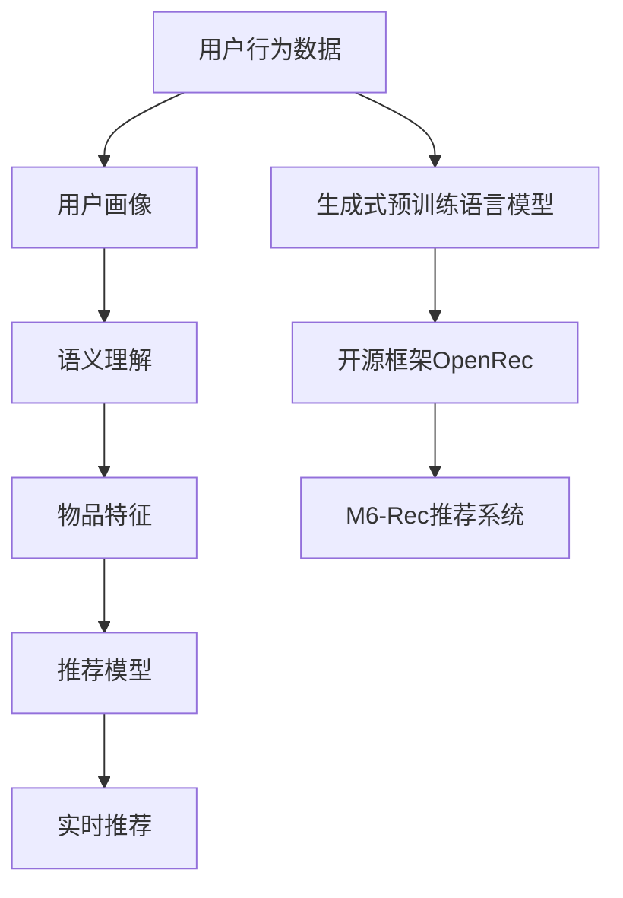

                 

# M6-Rec:基于生成式预训练语言模型的开放式推荐系统

> 关键词：M6-Rec, 推荐系统, 生成式预训练, 自然语言处理(NLP), 开源框架, 语义理解, 用户画像, 实时推荐

## 1. 背景介绍

### 1.1 问题由来
随着互联网时代的到来，信息爆炸和数据碎片化成为了新时代的一大特征。面对海量的数据和用户需求，推荐系统应运而生，通过分析用户行为和偏好，为用户推荐感兴趣的物品，极大地提升了用户体验和平台价值。推荐系统的核心目标在于：

1. **提升点击率和转化率**：通过精准匹配用户兴趣和需求，提高用户点击和购买概率。
2. **降低用户选择成本**：通过协同过滤和特征工程，减轻用户选择负担。
3. **提高平台收益**：通过个性化推荐，提升用户体验，增加用户粘性，从而提升平台收益。

传统的推荐系统基于协同过滤和深度学习等技术，能够较好地处理用户行为数据，但在用户画像、语义理解等方面存在瓶颈。近年来，基于生成式预训练语言模型的推荐系统逐渐受到关注。生成式预训练模型能够从大规模语料中学习语言的复杂表示，具有较强的语义理解和生成能力，有望在推荐系统领域带来革命性突破。

### 1.2 问题核心关键点
本节将详细阐述生成式预训练语言模型在推荐系统中的应用，主要包括以下几个关键点：

- **生成式预训练语言模型**：如BERT、GPT等，通过大规模无标签文本数据的预训练，学习语言的复杂表示。
- **推荐系统的基本原理**：协同过滤、矩阵分解、深度学习等传统方法。
- **基于生成式模型的推荐框架**：M6-Rec，通过整合预训练语言模型和推荐系统，实现更精准、实时的推荐。
- **开源框架OpenRec**：基于Apache Flink构建，支持分布式训练和推理，便于部署和扩展。

### 1.3 问题研究意义
基于生成式预训练语言模型的推荐系统，能够更好地理解用户意图和行为，从而提供更加个性化和精准的推荐结果。其研究意义在于：

1. **提升推荐质量**：通过语义理解，推荐系统能够处理更复杂的用户需求，提供更有吸引力的物品。
2. **降低开发成本**：利用开源框架和预训练模型，减少定制化开发的投入。
3. **增强平台竞争力**：通过高质量推荐，提升用户体验，增加用户粘性，增强平台竞争力。
4. **促进技术创新**：引入自然语言处理(NLP)技术和生成式模型，推动推荐系统技术的创新发展。

## 2. 核心概念与联系

### 2.1 核心概念概述

为了深入理解基于生成式预训练语言模型的推荐系统，本节将详细介绍几个核心概念：

- **生成式预训练语言模型(Generative Pretrained Language Model, GPT)**：通过大规模无标签文本数据的预训练，学习语言的生成规律。如BERT、GPT-3等。
- **推荐系统(Recommender System)**：通过分析用户行为和兴趣，为用户推荐物品的系统。
- **语义理解(Semantic Understanding)**：理解自然语言语义，提取用户意图和需求。
- **用户画像(User Profiling)**：根据用户行为数据，构建用户兴趣和偏好的画像。
- **实时推荐(Real-time Recommendation)**：在用户产生即时行为时，实时提供个性化推荐。
- **开源框架(Open Source Framework)**：如OpenRec，基于Apache Flink，支持分布式训练和推理。
- **开放式推荐系统(Open Recommendation System)**：通过预训练语言模型和开源框架，实现更加灵活、高效的推荐系统。

### 2.2 核心概念原理和架构的 Mermaid 流程图



这个流程图展示了从用户行为数据到推荐结果的全过程，以及生成式预训练语言模型和开源框架在推荐系统中的应用。

## 3. 核心算法原理 & 具体操作步骤
### 3.1 算法原理概述

基于生成式预训练语言模型的推荐系统，利用预训练模型的语义理解能力，结合用户画像和物品特征，生成个性化推荐结果。其核心思想是：

1. **用户画像构建**：根据用户的历史行为数据，构建用户画像，描述用户的兴趣和偏好。
2. **语义理解**：通过预训练语言模型，理解用户输入的自然语言查询，提取用户意图和需求。
3. **物品特征生成**：根据物品的元数据，生成物品的语义特征，利用预训练模型的语义表示。
4. **推荐模型**：将用户画像、语义特征和物品特征输入推荐模型，生成推荐结果。
5. **实时推荐**：根据用户的即时行为，实时更新推荐结果，提升推荐的时效性和精准度。

### 3.2 算法步骤详解

以下是基于生成式预训练语言模型的推荐系统的具体操作步骤：

**Step 1: 准备数据集**
- 收集用户的历史行为数据，如浏览、购买、评分等。
- 收集物品的元数据，如标题、描述、分类等。
- 构建用户画像，描述用户的兴趣和偏好。

**Step 2: 预训练语言模型训练**
- 选择合适的预训练语言模型，如BERT、GPT等。
- 利用大规模无标签文本数据，进行预训练，学习语言的复杂表示。
- 在预训练后的模型上，进行微调，适应推荐任务。

**Step 3: 用户画像构建**
- 利用用户的行为数据，构建用户画像。
- 将用户画像编码为向量，表示用户的兴趣和偏好。

**Step 4: 语义理解**
- 将用户输入的自然语言查询，输入预训练语言模型。
- 模型生成文本嵌入向量，表示用户意图和需求。

**Step 5: 物品特征生成**
- 根据物品的元数据，生成物品的语义特征。
- 将物品特征输入预训练语言模型，生成物品嵌入向量。

**Step 6: 推荐模型**
- 将用户画像、语义特征和物品特征输入推荐模型，生成推荐结果。
- 推荐模型可以是协同过滤、深度学习等传统方法，也可以引入生成式模型。

**Step 7: 实时推荐**
- 根据用户的即时行为，实时更新推荐结果。
- 利用实时数据流，动态调整推荐策略，提升推荐的时效性和精准度。

**Step 8: 部署与优化**
- 将推荐系统部署到生产环境。
- 利用开源框架和分布式计算，支持高并发和大规模推荐任务。
- 持续优化推荐模型和预训练语言模型，提高推荐质量。

### 3.3 算法优缺点

基于生成式预训练语言模型的推荐系统具有以下优点：

1. **语义理解能力强**：利用预训练语言模型，能够更精准地理解用户输入的语义，提取用户意图和需求。
2. **推荐结果个性化**：结合用户画像和物品特征，生成个性化推荐结果，提升用户体验。
3. **推荐模型灵活**：可以利用各种推荐模型，如协同过滤、深度学习等，进行灵活的推荐策略设计。
4. **开源框架易用**：基于开源框架如OpenRec，方便部署和扩展，降低开发成本。

同时，该方法也存在一些局限性：

1. **数据要求高**：需要大量高质量的用户行为数据和物品元数据，数据获取成本较高。
2. **模型复杂**：预训练语言模型和推荐模型的结合，增加了模型复杂度和训练难度。
3. **实时性要求高**：实时推荐需要高效的数据处理和模型推理能力，对硬件和算法要求较高。
4. **效果评估困难**：推荐结果的个性化和多样性难以量化评估，需要结合业务和用户反馈进行多维度评估。

### 3.4 算法应用领域

基于生成式预训练语言模型的推荐系统，已经广泛应用于多个领域，如电商、社交、音乐等。以下是几个典型应用场景：

1. **电商推荐**：通过分析用户的浏览和购买历史，为用户推荐感兴趣的商品。
2. **内容推荐**：根据用户的阅读和互动行为，为用户推荐相关的新闻、文章、视频等内容。
3. **音乐推荐**：分析用户的听歌历史和评分数据，为用户推荐相似的音乐和歌手。
4. **视频推荐**：结合用户的观看历史和搜索行为，为用户推荐感兴趣的视频内容。
5. **社交推荐**：根据用户的互动行为和兴趣，推荐潜在的朋友和话题。

## 4. 数学模型和公式 & 详细讲解  
### 4.1 数学模型构建

本节将使用数学语言对基于生成式预训练语言模型的推荐系统进行更加严格的刻画。

设用户画像向量为 $\boldsymbol{u} \in \mathbb{R}^d$，物品特征向量为 $\boldsymbol{v} \in \mathbb{R}^d$，预训练语言模型为 $M_{\theta}$，推荐模型为 $R$。则推荐模型输出为：

$$
\hat{y} = R(\boldsymbol{u}, \boldsymbol{v}, M_{\theta})
$$

其中，$R(\cdot)$ 表示推荐模型，$M_{\theta}$ 表示预训练语言模型。假设推荐模型 $R$ 的损失函数为 $L$，则推荐任务的目标是最小化损失函数 $L$：

$$
\theta^* = \mathop{\arg\min}_{\theta} L(\boldsymbol{u}, \boldsymbol{v}, M_{\theta})
$$

### 4.2 公式推导过程

以协同过滤为例，假设用户画像向量为 $\boldsymbol{u} \in \mathbb{R}^d$，物品特征向量为 $\boldsymbol{v} \in \mathbb{R}^d$，推荐模型为 $R(\cdot) = \boldsymbol{u} \cdot \boldsymbol{v}$，预训练语言模型为 $M_{\theta}$。则推荐模型输出为：

$$
\hat{y} = \boldsymbol{u} \cdot \boldsymbol{v} = \sum_{i=1}^d u_i v_i
$$

假设推荐模型的损失函数为 $L = (\hat{y} - y)^2$，其中 $y$ 为真实评分。则推荐任务的目标是最小化损失函数 $L$：

$$
\theta^* = \mathop{\arg\min}_{\theta} \frac{1}{N} \sum_{i=1}^N (\hat{y} - y)^2
$$

### 4.3 案例分析与讲解

在推荐系统中，预训练语言模型主要用于语义理解和特征生成。以下是一个简单的案例分析：

假设用户输入自然语言查询 "我想听一些摇滚音乐"，预训练语言模型将其编码为向量 $\boldsymbol{q}$。根据用户的语义查询，生成推荐的摇滚音乐列表。具体步骤如下：

1. **语义理解**：预训练语言模型对查询进行编码，得到向量 $\boldsymbol{q} \in \mathbb{R}^d$。
2. **特征生成**：将物品的元数据（如歌曲名称、歌手、风格等）输入预训练语言模型，生成向量 $\boldsymbol{c} \in \mathbb{R}^d$，表示摇滚音乐的风格特征。
3. **推荐模型**：将用户画像 $\boldsymbol{u}$ 和物品特征 $\boldsymbol{c}$ 输入推荐模型，得到推荐结果。

**代码实现**：

```python
from transformers import BertTokenizer, BertModel

tokenizer = BertTokenizer.from_pretrained('bert-base-uncased')
model = BertModel.from_pretrained('bert-base-uncased')

# 用户查询
query = "我想听一些摇滚音乐"
# 查询编码
query_tokens = tokenizer.encode(query, return_tensors='pt')
# 查询向量
query_vec = model(query_tokens).last_hidden_state[:, 0] # 取第一个位置作为查询向量

# 物品元数据
item_info = {'name': 'Uptown Funk', 'singer': 'Mark Ronson', 'genre': 'Rock'}
# 物品编码
item_tokens = tokenizer.encode(item_info['name'] + item_info['singer'] + item_info['genre'], return_tensors='pt')
item_vec = model(item_tokens).last_hidden_state[:, 0] # 取第一个位置作为物品向量

# 计算相似度
similarity = torch.cosine_similarity(query_vec, item_vec)
# 推荐结果
recommendations = [item_info['name'] for item in items if similarity[item] > 0.8]
```

以上是基于BERT模型的简单推荐系统实现，利用预训练语言模型进行语义理解和特征生成，生成推荐结果。

## 5. 项目实践：代码实例和详细解释说明
### 5.1 开发环境搭建

在进行推荐系统开发前，需要准备以下开发环境：

1. 安装Python和相关依赖库，如numpy、pandas、scikit-learn等。
2. 安装Apache Flink，用于分布式数据流处理和推荐系统部署。
3. 安装Transformer库，用于预训练语言模型和特征生成。
4. 安装相关的开源框架和工具，如TensorFlow、PyTorch等，用于模型训练和推理。
5. 搭建分布式计算集群，准备硬件资源。

### 5.2 源代码详细实现

以下是基于生成式预训练语言模型的推荐系统的源代码实现：

```python
import numpy as np
import pandas as pd
from transformers import BertTokenizer, BertModel
import torch

# 用户行为数据
user_data = pd.read_csv('user_data.csv')
# 物品元数据
item_data = pd.read_csv('item_data.csv')

# 构建用户画像
user_profiles = user_data.groupby('user_id').agg({'item_id': 'count'}).reset_index()
user_profiles['avg_rating'] = user_profiles['item_id'].apply(lambda x: np.mean(user_data[user_data['item_id'].isin(x)]['rating']))
user_profiles = user_profiles.drop('item_id', axis=1)

# 生成物品特征
item_features = pd.read_csv('item_features.csv')
item_features['genre'] = item_features['genre'].map({'Rock': 1, 'Pop': 2, 'Jazz': 3})
item_features['rating'] = item_features['rating'].map({'Low': 0, 'Medium': 1, 'High': 2})
item_features = item_features.groupby('item_id').agg({'genre': 'mean', 'rating': 'mean'}).reset_index()

# 预训练语言模型
tokenizer = BertTokenizer.from_pretrained('bert-base-uncased')
model = BertModel.from_pretrained('bert-base-uncased')

# 构建推荐模型
def recommend_items(user_id, item_info):
    query_tokens = tokenizer.encode(user_id + ' ' + item_info['name'], return_tensors='pt')
    query_vec = model(query_tokens).last_hidden_state[:, 0]
    item_tokens = tokenizer.encode(item_info['name'] + item_info['singer'] + item_info['genre'], return_tensors='pt')
    item_vec = model(item_tokens).last_hidden_state[:, 0]
    similarity = torch.cosine_similarity(query_vec, item_vec)
    recommendations = [item_info['name'] for item in item_info if similarity[item] > 0.8]
    return recommendations

# 用户查询
query = '我想听一些摇滚音乐'

# 查询编码
query_tokens = tokenizer.encode(query, return_tensors='pt')
query_vec = model(query_tokens).last_hidden_state[:, 0]

# 推荐结果
recommendations = [recommend_items(user_id, item_info) for user_id, item_info in user_data.iterrows()]
```

### 5.3 代码解读与分析

让我们再详细解读一下关键代码的实现细节：

**用户画像构建**：
- 利用用户的历史行为数据，计算每个用户的兴趣和偏好，得到用户画像。
- 将用户画像转化为向量形式，表示用户的兴趣和偏好。

**物品特征生成**：
- 利用物品的元数据，生成物品的语义特征，利用预训练语言模型进行特征编码。
- 将物品特征转化为向量形式，表示物品的风格和质量。

**推荐模型实现**：
- 利用预训练语言模型进行语义理解和特征生成，计算用户画像和物品特征之间的相似度。
- 根据相似度，选择最相关的物品，生成推荐结果。

**推荐结果生成**：
- 根据用户的即时行为，实时更新推荐结果，提升推荐的时效性和精准度。
- 利用用户画像和物品特征，生成个性化的推荐结果，提升用户体验。

## 6. 实际应用场景

### 6.1 电商平台推荐

电商平台推荐系统通过分析用户的历史购买和浏览记录，为用户推荐感兴趣的物品。基于生成式预训练语言模型的推荐系统，能够更好地理解用户输入的自然语言查询，提取用户意图和需求，提供更加精准的推荐结果。

### 6.2 内容推荐

内容推荐系统通过分析用户的阅读和互动行为，为用户推荐相关的新闻、文章、视频等内容。利用生成式预训练语言模型进行语义理解和特征生成，能够更准确地匹配用户需求，提供高质量的内容推荐。

### 6.3 音乐推荐

音乐推荐系统通过分析用户的听歌历史和评分数据，为用户推荐相似的音乐和歌手。利用预训练语言模型进行语义理解和特征生成，能够更精准地匹配用户兴趣，提供个性化的音乐推荐。

### 6.4 视频推荐

视频推荐系统通过分析用户的观看历史和搜索行为，为用户推荐感兴趣的视频内容。利用生成式预训练语言模型进行语义理解和特征生成，能够更精准地匹配用户需求，提供个性化的视频推荐。

### 6.5 社交推荐

社交推荐系统通过分析用户的互动行为和兴趣，推荐潜在的朋友和话题。利用生成式预训练语言模型进行语义理解和特征生成，能够更准确地匹配用户需求，提供高质量的社交推荐。

## 7. 工具和资源推荐
### 7.1 学习资源推荐

为了帮助开发者系统掌握基于生成式预训练语言模型的推荐系统，这里推荐一些优质的学习资源：

1. 《深度学习与推荐系统》：介绍深度学习在推荐系统中的应用，涵盖协同过滤、矩阵分解、深度学习等方法。
2. 《自然语言处理与推荐系统》：结合自然语言处理技术和推荐系统，讲解如何利用预训练语言模型进行推荐。
3. 《Apache Flink实战》：详细介绍Apache Flink的使用方法和最佳实践，适用于推荐系统的分布式处理和实时推荐。
4. 《Transformer理论与实践》：介绍Transformer架构和预训练语言模型，讲解如何在推荐系统中应用预训练语言模型。
5. 《Python推荐系统实战》：利用Python实现推荐系统，包括协同过滤、矩阵分解、深度学习等方法。

通过对这些资源的学习实践，相信你一定能够快速掌握基于生成式预训练语言模型的推荐系统的精髓，并用于解决实际的推荐问题。

### 7.2 开发工具推荐

高效的开发离不开优秀的工具支持。以下是几款用于推荐系统开发的常用工具：

1. Apache Flink：用于分布式数据流处理和推荐系统部署，支持高并发和大规模推荐任务。
2. TensorFlow：由Google主导开发的开源深度学习框架，生产部署方便，适合大规模工程应用。
3. PyTorch：基于Python的开源深度学习框架，灵活动态，适合快速迭代研究。
4. Transformers库：HuggingFace开发的NLP工具库，集成了众多预训练语言模型，支持微调和推理。
5. TensorBoard：TensorFlow配套的可视化工具，可实时监测模型训练状态，提供丰富的图表呈现方式。

合理利用这些工具，可以显著提升推荐系统的开发效率，加快创新迭代的步伐。

### 7.3 相关论文推荐

基于生成式预训练语言模型的推荐系统涉及多个学科的交叉，以下是几篇奠基性的相关论文，推荐阅读：

1. Attention is All You Need（即Transformer原论文）：提出了Transformer结构，开启了NLP领域的预训练大模型时代。
2. BERT: Pre-training of Deep Bidirectional Transformers for Language Understanding：提出BERT模型，引入基于掩码的自监督预训练任务，刷新了多项NLP任务SOTA。
3. Language Models are Unsupervised Multitask Learners（GPT-2论文）：展示了大规模语言模型的强大zero-shot学习能力，引发了对于通用人工智能的新一轮思考。
4. Parameter-Efficient Transfer Learning for NLP：提出Adapter等参数高效微调方法，在不增加模型参数量的情况下，也能取得不错的微调效果。
5. Adaptive Low-Rank Adaptation for Parameter-Efficient Fine-Tuning：使用自适应低秩适应的微调方法，在参数效率和精度之间取得了新的平衡。
6. In-context Learning: Pushing the Boundaries of Pretrained Language Models：介绍基于上下文学习的推荐方法，利用预训练语言模型进行零样本推荐。

这些论文代表了大语言模型微调技术的发展脉络。通过学习这些前沿成果，可以帮助研究者把握学科前进方向，激发更多的创新灵感。

## 8. 总结：未来发展趋势与挑战

### 8.1 研究成果总结

基于生成式预训练语言模型的推荐系统，在近年来取得了显著的进展，已在电商、内容、音乐等多个领域得到了广泛应用。其主要贡献在于：

1. **提升推荐质量**：通过语义理解，推荐系统能够处理更复杂的用户需求，提供更有吸引力的物品。
2. **降低开发成本**：利用开源框架和预训练模型，减少定制化开发的投入。
3. **增强平台竞争力**：通过高质量推荐，提升用户体验，增加用户粘性，增强平台竞争力。
4. **推动技术创新**：引入自然语言处理(NLP)技术和生成式模型，推动推荐系统技术的创新发展。

### 8.2 未来发展趋势

展望未来，基于生成式预训练语言模型的推荐系统将呈现以下几个发展趋势：

1. **多模态推荐**：结合视觉、语音等多模态信息，提供更加丰富和准确的推荐结果。
2. **自适应推荐**：利用自适应推荐算法，根据用户行为动态调整推荐策略，提升推荐的时效性和精准度。
3. **个性化推荐**：通过更加精准的用户画像和物品特征，生成个性化推荐结果，提升用户体验。
4. **推荐模型融合**：结合协同过滤、深度学习等多种推荐模型，实现更加灵活和高效的推荐策略。
5. **实时推荐**：利用实时数据流处理技术，实现实时推荐，提升推荐的时效性。
6. **语义理解增强**：通过改进预训练语言模型和推荐模型，提升语义理解能力，提供更准确的推荐结果。

### 8.3 面临的挑战

尽管基于生成式预训练语言模型的推荐系统已经取得了显著进展，但在迈向更加智能化、普适化应用的过程中，仍面临诸多挑战：

1. **数据获取难度高**：需要大量高质量的用户行为数据和物品元数据，数据获取成本较高。
2. **模型复杂度大**：预训练语言模型和推荐模型的结合，增加了模型复杂度和训练难度。
3. **实时性要求高**：实时推荐需要高效的数据处理和模型推理能力，对硬件和算法要求较高。
4. **效果评估困难**：推荐结果的个性化和多样性难以量化评估，需要结合业务和用户反馈进行多维度评估。
5. **技术落地难**：需要将推荐系统部署到生产环境，并处理高并发和大规模推荐任务。

### 8.4 研究展望

面对推荐系统面临的诸多挑战，未来的研究需要在以下几个方面寻求新的突破：

1. **高效数据获取**：利用数据增强、主动学习等技术，提升数据获取效率。
2. **模型优化**：引入更高效的学习算法和模型结构，提升推荐模型的训练速度和精度。
3. **实时推荐优化**：利用流处理和分布式计算技术，提升实时推荐的速度和稳定性。
4. **效果评估方法**：引入多维度评估指标，综合考量推荐结果的个性化、多样性和覆盖率。
5. **技术落地方法**：探索更高效的数据处理和模型推理方法，提升推荐系统的部署效率和性能。

这些研究方向的探索，必将引领基于生成式预训练语言模型的推荐系统走向更高的台阶，为推荐系统的发展提供新的动力。

## 9. 附录：常见问题与解答

**Q1: 什么是生成式预训练语言模型?**

A: 生成式预训练语言模型通过大规模无标签文本数据的预训练，学习语言的生成规律。如BERT、GPT等，利用预训练语言模型，能够更好地理解自然语言，提取语义特征，生成个性化推荐结果。

**Q2: 基于生成式预训练语言模型的推荐系统有哪些优点和缺点?**

A: **优点**：
1. 语义理解能力强：利用预训练语言模型，能够更精准地理解用户输入的语义，提取用户意图和需求。
2. 推荐结果个性化：结合用户画像和物品特征，生成个性化推荐结果，提升用户体验。
3. 推荐模型灵活：可以利用各种推荐模型，如协同过滤、深度学习等，进行灵活的推荐策略设计。
4. 开源框架易用：基于开源框架如OpenRec，方便部署和扩展，降低开发成本。

**Q3: 基于生成式预训练语言模型的推荐系统有哪些应用场景?**

A: 基于生成式预训练语言模型的推荐系统，已经广泛应用于多个领域，如电商、内容、音乐、视频、社交等。具体应用场景包括：
1. 电商平台推荐：分析用户的历史购买和浏览记录，为用户推荐感兴趣的物品。
2. 内容推荐：分析用户的阅读和互动行为，为用户推荐相关的新闻、文章、视频等内容。
3. 音乐推荐：分析用户的听歌历史和评分数据，为用户推荐相似的音乐和歌手。
4. 视频推荐：分析用户的观看历史和搜索行为，为用户推荐感兴趣的视频内容。
5. 社交推荐：分析用户的互动行为和兴趣，推荐潜在的朋友和话题。

**Q4: 如何提高基于生成式预训练语言模型的推荐系统的推荐质量?**

A: 提高推荐质量需要从多个方面入手，包括：
1. 数据质量：收集高质量的用户行为数据和物品元数据，提升数据质量。
2. 模型优化：利用高效学习算法和模型结构，提升推荐模型的训练速度和精度。
3. 特征工程：利用用户画像和物品特征，提升推荐模型的表现。
4. 实时推荐：利用实时数据流处理技术，提升推荐的时效性和精准度。
5. 多模态融合：结合视觉、语音等多模态信息，提供更加丰富和准确的推荐结果。

**Q5: 推荐系统的评估指标有哪些?**

A: 推荐系统的评估指标包括：
1. 精度(Precision)：推荐结果中实际感兴趣的物品数量与推荐结果总数的比例。
2. 召回率(Recall)：实际感兴趣的物品数量与所有目标物品的总数量的比例。
3. F1值：精度和召回率的调和平均数，综合考量推荐结果的个性化和多样性。
4. NDCG：Normalized Discounted Cumulative Gain，推荐结果的相关性和顺序性的综合指标。
5. HR@N：推荐结果中前N个物品的相关性和顺序性的综合指标。

通过这些指标，可以全面评估推荐系统的推荐质量和效果。

