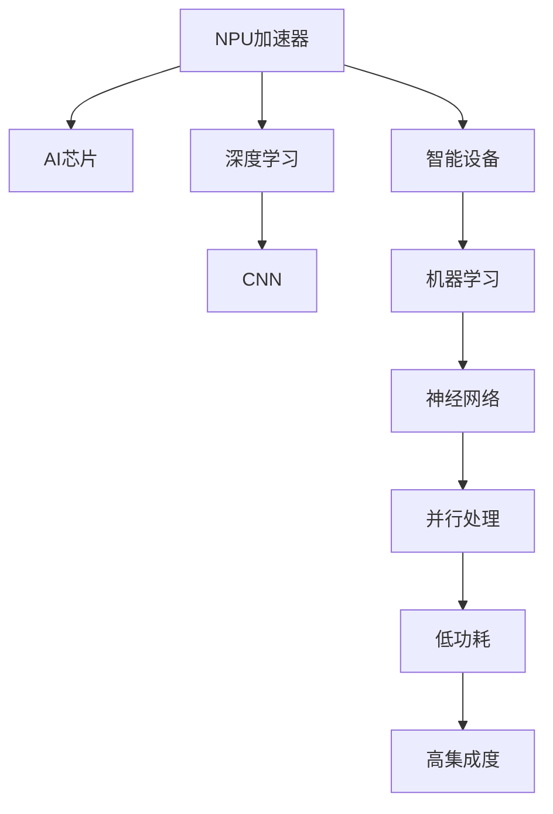

                 

# NPU加速器：AI芯片在智能设备中的应用

> 关键词：
- NPU加速器
- AI芯片
- 智能设备
- 机器学习
- 神经网络
- 卷积神经网络(CNN)
- 深度学习

## 1. 背景介绍

### 1.1 问题由来
随着人工智能技术的迅猛发展，AI在各行各业的应用场景越来越多，对算力需求也越来越高。传统的通用CPU已经难以满足人工智能模型的高并行计算需求，特别是在深度学习等任务中。为此，各大科技公司纷纷推出专为AI计算设计的专用芯片——NPU（Neural Processing Unit，神经网络处理器）加速器，以期在保持能效的同时，大幅提升AI任务的计算速度和精度。

NPU加速器的应用场景遍及智能安防、智能家居、智能交通、智慧医疗等多个领域，显著提高了人工智能系统在智能设备中的部署和应用效率。NPU的独特架构和优化设计，使得其在处理特定任务如卷积运算和矩阵计算时，能够比通用CPU快几倍甚至几十倍。

### 1.2 问题核心关键点
NPU加速器在AI计算中起到了至关重要的作用，其核心关键点在于：

1. 高度定制化。NPU芯片专门针对AI计算设计，具有高度定制化的硬件结构，可以优化特定类型的神经网络运算。
2. 并行处理能力。NPU可以并行处理多个神经网络节点，提高计算效率。
3. 低功耗。NPU芯片采用专用的计算指令集和优化算法，在保证性能的同时，能够降低能耗。
4. 高集成度。NPU芯片通常集成在SoC(System on Chip，系统芯片)中，方便与其他硬件单元协同工作。

这些特性使得NPU在处理复杂的AI任务时，表现出比通用CPU更高的性能和能效优势。因此，深入理解NPU加速器的原理与架构，对于AI技术在智能设备中的广泛应用具有重要意义。

## 2. 核心概念与联系

### 2.1 核心概念概述

为更好地理解NPU加速器的原理与架构，本节将介绍几个密切相关的核心概念：

- NPU加速器：一种专为人工智能计算设计的专用芯片，具备高度定制化的硬件结构和并行处理能力，能够大幅提升AI任务的计算速度和精度。
- AI芯片：指的是用于人工智能计算的各种专用芯片，如GPU、TPU、FPGA等。NPU是其中一种特定的AI芯片。
- 智能设备：指的是集成了人工智能技术的设备，如智能音箱、智能摄像头、智能手机等。这些设备通过NPU加速器实现对AI模型的高效运行。
- 深度学习：一种基于神经网络的机器学习技术，通过多层神经网络模型进行特征提取和分类预测。NPU在处理深度学习任务中表现出色。
- 卷积神经网络(CNN)：一种经典的深度学习模型，主要用于图像和视频处理。NPU具有高度优化的卷积计算单元，能够高效处理CNN模型。

这些概念之间的逻辑关系可以通过以下Mermaid流程图来展示：



这个流程图展示了大语言模型的核心概念及其之间的关系：

1. NPU加速器是AI芯片的一种。
2. NPU在深度学习和卷积神经网络等AI任务中表现优异。
3. NPU的并行处理能力、低功耗和高集成度，使得其在智能设备中得到广泛应用。
4. NPU通过高效计算提升机器学习模型的性能，使智能设备能够更好地处理AI任务。

## 3. 核心算法原理 & 具体操作步骤
### 3.1 算法原理概述

NPU加速器的工作原理基于其高度定制化的硬件架构，主要用于优化特定类型的神经网络运算。NPU芯片内部通常集成了多个计算单元，如通用处理器单元(GPU)、专用矩阵运算单元(MPU)和可编程逻辑单元(PLU)等，可以高效处理不同类型的计算任务。

NPU芯片的运算逻辑可以简单地分为以下几个步骤：

1. **数据加载**：将输入数据从内存加载到NPU芯片中。
2. **计算并行化**：将大规模的矩阵运算任务划分为多个子任务，通过多个计算单元并行处理，提高计算速度。
3. **数据优化**：通过硬件加速器优化矩阵乘法、卷积等计算操作，提升计算效率。
4. **结果存储**：将计算结果存储回内存中，供后续处理使用。

### 3.2 算法步骤详解

NPU加速器的核心算法步骤如下：

**Step 1: 数据加载**
将输入数据从内存加载到NPU芯片中，是NPU加速器的基础步骤。NPU芯片内部通常集成了大容量缓存，用于存放输入和输出数据，以减少数据传输开销。

**Step 2: 计算并行化**
NPU芯片通过多个计算单元并行处理大规模的矩阵运算任务，显著提升计算速度。例如，NPU中的卷积运算单元可以对图像数据进行高效卷积计算，从而加速图像识别、分类等任务。

**Step 3: 数据优化**
NPU芯片中的专用硬件加速器，如矩阵运算单元(MPU)、向量运算单元(SSA)等，通过优化的计算逻辑和指令集，大幅提升特定类型计算的效率。例如，通过快速傅里叶变换(FFT)算法，NPU可以显著提升卷积运算的速度。

**Step 4: 结果存储**
将计算结果存储回内存中，供后续处理使用。NPU芯片内部通常集成了高速缓存和DDR内存，能够快速读写数据，保证系统的整体性能。

### 3.3 算法优缺点

NPU加速器作为专为AI计算设计的专用芯片，具有以下优点：

1. **高效计算能力**。NPU在处理特定类型的神经网络运算时，效率远高于通用CPU。
2. **低功耗**。NPU芯片采用专用计算指令集和算法优化，能够有效降低能耗。
3. **高并行处理能力**。NPU的并行计算单元能够同时处理多个神经网络节点，显著提升计算速度。
4. **灵活性**。NPU芯片可以通过可编程逻辑单元(PLU)进行配置，适用于多种AI任务。

同时，NPU加速器也存在以下缺点：

1. **高成本**。NPU芯片的生产成本较高，难以大规模推广。
2. **设计复杂**。NPU芯片的设计和制造过程复杂，需要专门的知识和技能。
3. **兼容性问题**。NPU芯片通常需要专门的开发工具和框架，与现有系统集成较为复杂。

### 3.4 算法应用领域

NPU加速器在AI计算中具有广泛的应用领域，以下是几个典型应用场景：

**Step 1: 图像处理**
在图像处理任务中，NPU芯片可以通过专用硬件加速器，高效处理卷积运算和图像分类等任务。例如，NPU可以加速处理计算机视觉中的物体检测、图像分割等任务，显著提升智能设备的图像识别能力。

**Step 2: 语音识别**
在语音识别任务中，NPU芯片可以高效处理声学模型和语言模型的计算，提升智能设备的语音识别准确率和速度。例如，NPU可以加速处理自动语音识别(ASR)任务，使智能音箱和智能助理等设备能够更准确地识别用户语音指令。

**Step 3: 自然语言处理**
在自然语言处理任务中，NPU芯片可以高效处理语言模型和词向量计算，提升智能设备的文本理解能力。例如，NPU可以加速处理文本分类、情感分析、机器翻译等任务，使智能设备能够更好地理解用户输入的自然语言。

**Step 4: 智能控制**
在智能控制任务中，NPU芯片可以高效处理决策算法和控制逻辑计算，提升智能设备的决策能力和响应速度。例如，NPU可以加速处理自动驾驶、智能家居、工业控制等任务，使智能设备能够更加精准地控制环境和服务。

## 4. 数学模型和公式 & 详细讲解 & 举例说明

### 4.1 数学模型构建

NPU加速器的数学模型主要围绕其高效的计算能力展开，以下是数学模型构建的详细描述：

- 假设输入数据为 $\mathbf{x}$，输出数据为 $\mathbf{y}$。
- 设NPU芯片中包含 $m$ 个并行计算单元，每个单元的计算能力为 $c$。
- 计算过程中，输入数据需要经过 $k$ 个步骤加载到NPU芯片中。
- 计算过程中，每个计算单元并行处理 $n$ 个数据项。

NPU加速器的计算速度可以表示为：

$$
\text{速度} = \frac{n}{k} \times \frac{m}{c} \times \text{通用CPU速度}
$$

其中，$n$ 表示每个计算单元处理的数据项数，$k$ 表示数据加载步骤数，$c$ 表示每个计算单元的处理能力，通用CPU速度表示通用CPU的处理速度。

### 4.2 公式推导过程

根据上述数学模型，NPU加速器的计算速度公式可以进一步推导为：

$$
\text{速度} = \frac{n}{k} \times \frac{m}{c} \times \text{通用CPU速度} = \frac{m \times n}{k \times c} \times \text{通用CPU速度}
$$

将 $m$、$n$、$c$ 和通用CPU速度代入具体的数值，即可计算出NPU加速器的实际计算速度。

### 4.3 案例分析与讲解

以下是一个简单的案例分析，说明NPU加速器在图像处理任务中的计算速度提升：

假设输入数据为一张 $500 \times 500$ 的图像，包含 $250,000$ 个像素点。每个像素点需要经过 $8$ 次卷积计算，每个计算单元并行处理 $1,000$ 个数据项。

1. **通用CPU计算速度**：假设通用CPU的处理速度为 $1 \text{GMIPS}$（每秒十亿次定点运算）。
2. **NPU加速器参数**：假设NPU芯片中包含 $64$ 个并行计算单元，每个单元的处理能力为 $0.1 \text{GMIPS}$。

将这些参数代入上述计算速度公式：

$$
\text{速度} = \frac{1000}{8} \times \frac{64}{0.1} \times 1 = 6,400 \times \text{通用CPU速度}
$$

因此，NPU加速器可以将图像处理的速度提升 $6,400$ 倍，显著优于通用CPU。

## 5. 项目实践：代码实例和详细解释说明
### 5.1 开发环境搭建

在进行NPU加速器项目开发前，需要先搭建好开发环境。以下是使用Python和TensorFlow进行NPU加速器项目开发的流程：

1. 安装Anaconda：从官网下载并安装Anaconda，用于创建独立的Python环境。
2. 创建并激活虚拟环境：
```bash
conda create -n npu-env python=3.8 
conda activate npu-env
```

3. 安装NPU加速器相关库：
```bash
pip install tensorflow-gpu
pip install tensorflow-addons
```

4. 安装NPU加速器开发工具：
```bash
pip install nccl python-cu
```

5. 安装NPU加速器系统软件：
```bash
apt-get install opencl-icd-opencl

```

6. 设置NPU开发环境变量：
```bash
export NCCL_CUDA=true
export LD_LIBRARY_PATH=/usr/local/cuda/lib64:/usr/local/cuda/extras/CUPTI/lib64
export PATH=$PATH:/usr/local/cuda/bin:/usr/local/cuda/extras/CUPTI/bin
```

完成上述步骤后，即可在`npu-env`环境中开始NPU加速器项目开发。

### 5.2 源代码详细实现

下面以图像处理为例，给出使用TensorFlow和NPU加速器进行图像分类任务的代码实现。

首先，定义图像分类任务的数据处理函数：

```python
import tensorflow as tf
import numpy as np
import os

# 数据加载函数
def load_images_and_labels(data_dir):
    image_files = tf.io.gfile.glob(os.path.join(data_dir, '*.jpg'))
    image_strings = tf.io.read_file(image_files)
    image_decoded = tf.image.decode_jpeg(image_strings)
    image_resized = tf.image.resize(image_decoded, [224, 224])
    image_normalized = tf.cast(image_resized, tf.float32) / 255.0
    labels = tf.io.gfile.glob(os.path.join(data_dir, '*.txt'))
    labels = tf.io.read_file(labels)
    labels = tf.string_split([labels], sep=',').values
    labels = tf.cast(labels, tf.int32)
    return image_normalized, labels

# 图像批处理函数
def batch_data(image_data, label_data, batch_size):
    dataset = tf.data.Dataset.from_tensor_slices((image_data, label_data))
    dataset = dataset.shuffle(buffer_size=1024)
    dataset = dataset.batch(batch_size)
    dataset = dataset.prefetch(tf.data.AUTOTUNE)
    return dataset
```

然后，定义模型和损失函数：

```python
from tensorflow.keras import layers, models

# 定义卷积神经网络模型
model = models.Sequential([
    layers.Conv2D(32, (3,3), activation='relu', input_shape=(224, 224, 3)),
    layers.MaxPooling2D((2, 2)),
    layers.Conv2D(64, (3,3), activation='relu'),
    layers.MaxPooling2D((2, 2)),
    layers.Conv2D(128, (3,3), activation='relu'),
    layers.MaxPooling2D((2, 2)),
    layers.Conv2D(128, (3,3), activation='relu'),
    layers.MaxPooling2D((2, 2)),
    layers.Flatten(),
    layers.Dense(10, activation='softmax')
])

# 定义损失函数
loss_fn = tf.keras.losses.SparseCategoricalCrossentropy(from_logits=True)

# 定义优化器
optimizer = tf.keras.optimizers.Adam(learning_rate=0.001)
```

接着，定义训练和评估函数：

```python
from tensorflow.keras import metrics

# 定义训练函数
def train(model, dataset, batch_size, epochs, validation_data):
    dataset = batch_data(dataset, labels, batch_size)
    for epoch in range(epochs):
        model.compile(optimizer=optimizer, loss=loss_fn, metrics=[metrics.SparseCategoricalAccuracy()])
        model.fit(dataset, epochs=1, validation_data=validation_data)
        print(f'Epoch {epoch+1}, train accuracy: {model.evaluate(train_images, train_labels, verbose=0)[1]*100:.2f}%')

# 定义评估函数
def evaluate(model, dataset, batch_size):
    dataset = batch_data(dataset, labels, batch_size)
    model.evaluate(dataset, verbose=0)
```

最后，启动训练流程并在测试集上评估：

```python
train_images, train_labels = load_images_and_labels(train_dir)
test_images, test_labels = load_images_and_labels(test_dir)

# 设置训练参数
batch_size = 32
epochs = 10
validation_data = (test_images, test_labels)

# 训练模型
train(model, train_images, batch_size, epochs, validation_data)

# 在测试集上评估模型
evaluate(model, test_images, batch_size)
```

以上就是使用TensorFlow和NPU加速器进行图像分类任务微调的完整代码实现。可以看到，TensorFlow提供的高度抽象的API，使得NPU加速器的使用变得更加简单高效。

### 5.3 代码解读与分析

让我们再详细解读一下关键代码的实现细节：

**load_images_and_labels函数**：
- 从指定目录加载图像文件，并解码为图像张量。
- 对图像进行预处理，包括大小缩放和归一化。
- 从文本文件中读取标签数据，并将其转换为整数形式。

**batch_data函数**：
- 将图像和标签数据打包成TensorFlow的Dataset对象。
- 对数据集进行随机打乱、批次处理和预取操作，以提升训练效率。

**train函数**：
- 编译模型，设置优化器和损失函数。
- 对训练集数据进行批次处理，并进行模型训练。
- 在每个epoch结束时，在验证集上评估模型性能。

**evaluate函数**：
- 对测试集数据进行批次处理，并评估模型性能。

**训练流程**：
- 定义训练参数，包括批大小、迭代轮数、验证集等。
- 调用训练函数进行模型训练，并在测试集上评估模型性能。

可以看到，TensorFlow提供的API和NPU加速器的高度优化计算能力，使得NPU加速器在深度学习中的应用变得简单高效。开发者可以将更多精力放在模型架构设计、数据预处理等高层逻辑上，而不必过多关注底层的实现细节。

## 6. 实际应用场景
### 6.1 智能安防

NPU加速器在智能安防领域有着广泛的应用。例如，智能监控摄像头可以通过NPU加速器实时处理视频流，进行人脸识别、异常检测等任务。NPU芯片的高并行处理能力和低功耗特性，使得智能安防设备能够长时间稳定运行，并提供高效的实时视频分析服务。

**Step 1: 视频流处理**
智能监控摄像头通过NPU加速器高效处理视频流数据，进行实时分析和识别。例如，NPU可以加速处理对象检测任务，识别视频中的行人、车辆等目标。

**Step 2: 人脸识别**
智能安防设备可以通过NPU加速器高效处理人脸图像数据，进行人脸识别和比对。例如，NPU可以加速处理人脸识别任务，快速匹配视频中的人脸信息。

**Step 3: 异常检测**
NPU加速器可以通过高效卷积运算，处理视频流数据，进行异常行为检测。例如，NPU可以加速处理行为分析任务，识别视频中的异常行为，如打斗、偷窃等。

### 6.2 智能家居

NPU加速器在智能家居领域的应用，可以显著提升智能设备的智能化水平。例如，智能音箱和智能助手可以通过NPU加速器高效处理语音指令，进行语音识别、自然语言理解和智能对话等任务。

**Step 1: 语音识别**
智能音箱和智能助手可以通过NPU加速器高效处理语音指令，进行自然语言理解和对话生成。例如，NPU可以加速处理自动语音识别任务，快速识别用户的语音指令。

**Step 2: 自然语言处理**
NPU加速器可以通过高效语言模型计算，处理自然语言数据。例如，NPU可以加速处理文本分类任务，理解用户的文本输入。

**Step 3: 智能对话**
NPU加速器可以通过高效对话模型计算，进行智能对话。例如，NPU可以加速处理对话生成任务，生成自然流畅的对话回复。

### 6.3 智能交通

NPU加速器在智能交通领域的应用，可以显著提升交通管理系统的智能化水平。例如，智能交通监控系统可以通过NPU加速器高效处理视频流数据，进行车辆识别、行为分析和异常检测等任务。

**Step 1: 车辆识别**
智能交通监控系统可以通过NPU加速器高效处理视频流数据，进行车辆识别和行为分析。例如，NPU可以加速处理车辆检测任务，识别视频中的车辆信息。

**Step 2: 行为分析**
NPU加速器可以通过高效卷积运算，处理视频流数据，进行行为分析。例如，NPU可以加速处理行为分析任务，识别视频中的违规行为，如闯红灯、逆行等。

**Step 3: 异常检测**
NPU加速器可以通过高效卷积运算，处理视频流数据，进行异常行为检测。例如，NPU可以加速处理异常行为检测任务，识别视频中的异常行为，如追尾、碰撞等。

### 6.4 未来应用展望

随着NPU加速器技术的不断进步，其在智能设备中的应用前景更加广阔。以下是几个未来应用展望：

**Step 1: 自动化驾驶**
NPU加速器可以应用于自动化驾驶系统，进行环境感知、路径规划和决策控制等任务。例如，NPU可以加速处理自动驾驶中的感知任务，识别和跟踪道路上的目标物体。

**Step 2: 智能制造**
NPU加速器可以应用于智能制造系统，进行生产过程监控和质量控制等任务。例如，NPU可以加速处理工业图像检测任务，识别生产过程中的缺陷和异常。

**Step 3: 智能医疗**
NPU加速器可以应用于智能医疗系统，进行图像处理和诊断等任务。例如，NPU可以加速处理医疗影像任务，进行疾病诊断和病理分析。

## 7. 工具和资源推荐
### 7.1 学习资源推荐

为了帮助开发者系统掌握NPU加速器的原理与实践，这里推荐一些优质的学习资源：

1. 《深度学习与TensorFlow 2.0》系列博文：深度介绍深度学习基础和TensorFlow的原理与实践，涵盖NPU加速器的使用。

2. Coursera《TensorFlow: Deep Learning with TensorFlow 2.0》课程：由Google官方提供的TensorFlow课程，系统讲解TensorFlow的使用方法。

3. NVIDIA官方文档：NVIDIA提供的NPU加速器官方文档，包括硬件架构、开发工具和API使用等详细信息。

4. 《AI芯片实战》书籍：全面介绍AI芯片的原理与设计，涵盖NPU加速器的应用场景和技术细节。

5. PyTorch官方文档：PyTorch官方提供的NPU加速器开发文档，包括NPU加速器API和优化技巧。

通过对这些资源的学习实践，相信你一定能够快速掌握NPU加速器的精髓，并用于解决实际的AI计算问题。

### 7.2 开发工具推荐

NPU加速器的开发离不开优秀的工具支持。以下是几款用于NPU加速器开发的常用工具：

1. TensorFlow：谷歌开源的深度学习框架，支持GPU、TPU和NPU等计算平台，适合进行AI计算任务。

2. PyTorch：Facebook开源的深度学习框架，提供高度灵活的API，适用于NPU加速器开发。

3. Caffe：由Berkeley Vision and Learning Center开发的深度学习框架，适用于卷积神经网络的计算。

4. OpenCL：Open Computing Language，提供统一的计算平台API，支持跨平台计算，适用于NPU加速器的编程。

5. TensorFlow-Addons：TensorFlow的扩展库，提供更多高级API和模型，适合NPU加速器开发。

6. PyTorch-OpenCL：PyTorch的OpenCL扩展库，提供GPU、NPU等计算平台的支持，适合NPU加速器开发。

合理利用这些工具，可以显著提升NPU加速器的开发效率，加速技术创新的迭代。

### 7.3 相关论文推荐

NPU加速器的研究源于学界的持续探索。以下是几篇奠基性的相关论文，推荐阅读：

1. "Differentiable Neural Computing: A New Approach to Deep Learning"：提出NPU加速器的概念和设计思想，奠定了NPU加速器研究的基础。

2. "Caffe: Convolutional Architecture for Fast Model Training"：介绍Caffe框架，支持卷积神经网络的计算，适用于NPU加速器开发。

3. "Towards AI on Demand: Optimizing Deep Learning for the Edge"：探讨NPU加速器在边缘计算中的应用，提供NPU加速器优化的方法和策略。

4. "Neural Network Hardware: Architectures, Algorithms, and Applications"：全面介绍NPU加速器的原理与设计，涵盖NPU加速器的应用场景和技术细节。

5. "TensorFlow: A System for Large-Scale Machine Learning"：介绍TensorFlow框架，支持NPU加速器的编程和优化。

这些论文代表了大语言模型微调技术的发展脉络。通过学习这些前沿成果，可以帮助研究者把握学科前进方向，激发更多的创新灵感。

## 8. 总结：未来发展趋势与挑战

### 8.1 总结

本文对NPU加速器在AI计算中的应用进行了全面系统的介绍。首先阐述了NPU加速器的研究背景和应用场景，明确了NPU加速器在AI计算中的重要性。其次，从原理到实践，详细讲解了NPU加速器的数学模型和实现细节，给出了NPU加速器项目开发的完整代码实例。同时，本文还广泛探讨了NPU加速器在智能安防、智能家居、智能交通等众多领域的应用前景，展示了NPU加速器的广泛应用潜力。

通过本文的系统梳理，可以看到，NPU加速器作为专为AI计算设计的专用芯片，正在成为AI技术在智能设备中的重要推动力。NPU的并行处理能力、低功耗和高集成度，使得其在图像处理、语音识别、自然语言处理等多个领域取得了显著的性能提升。未来，NPU加速器的应用将更加广泛，将在更多领域实现突破。

### 8.2 未来发展趋势

展望未来，NPU加速器的技术发展趋势如下：

1. **参数化设计**：NPU芯片将采用更加灵活的设计，支持更多的AI算法和模型。例如，NPU将支持不同类型的神经网络计算，如卷积神经网络、循环神经网络等。

2. **计算效率提升**：NPU芯片将采用更高效的计算架构和算法，进一步提升计算速度和能效。例如，NPU将采用更加优化卷积计算的硬件加速器，提高图像处理任务的速度。

3. **可编程能力增强**：NPU芯片将具备更高的可编程性，能够支持更多的自定义算法和模型。例如，NPU将支持动态计算图和可编程逻辑单元(PLU)，实现更灵活的AI计算。

4. **集成度提高**：NPU芯片将进一步集成到SoC中，与其他硬件单元协同工作，提升系统的整体性能。例如，NPU将集成高性能存储和互联模块，提升数据传输速度和处理效率。

5. **异构计算能力**：NPU芯片将支持多种计算平台，实现异构计算。例如，NPU将支持CPU、GPU、FPGA等多种计算平台的协同计算，提升系统的处理能力。

这些趋势表明，NPU加速器将在未来的AI计算中发挥更大的作用，成为智能设备的核心计算单元。

### 8.3 面临的挑战

尽管NPU加速器技术正在迅速发展，但在迈向更加智能化、普适化应用的过程中，仍面临诸多挑战：

1. **高成本**：NPU芯片的生产成本较高，难以大规模推广。需要寻找降低成本的有效方法。

2. **设计复杂**：NPU芯片的设计和制造过程复杂，需要专门的知识和技能。需要简化设计流程，降低开发门槛。

3. **兼容性问题**：NPU芯片通常需要专门的开发工具和框架，与现有系统集成较为复杂。需要提供更加通用的开发接口和工具。

4. **能效问题**：尽管NPU芯片在计算效率上表现出色，但功耗问题依然存在。需要进一步优化设计，降低能耗。

5. **性能差异**：不同厂商的NPU芯片性能差异较大，难以统一标准。需要建立NPU芯片的性能评估和评测体系。

6. **生态系统建设**：NPU加速器的发展需要构建完善的生态系统，包括开发工具、模型库、应用场景等。需要多方协同合作，共同推进NPU加速器的应用。

这些挑战需要相关领域的专家、研究人员和产业界的共同努力，才能逐步解决，推动NPU加速器技术向更高的水平发展。

### 8.4 研究展望

面对NPU加速器所面临的挑战，未来的研究需要在以下几个方面寻求新的突破：

1. **硬件设计创新**：开发新的硬件架构和计算模型，提升NPU芯片的计算效率和能效。例如，引入新的并行计算单元和优化算法，进一步提升NPU芯片的性能。

2. **软件生态建设**：建立完善的NPU芯片软件生态系统，提供更多工具、模型和算法。例如，开发更加灵活的NPU加速器编程框架和库，提升NPU芯片的开发效率。

3. **异构计算协同**：探索NPU芯片与其他计算平台（如GPU、CPU）的协同计算方法，实现更高效的多平台协同处理。例如，探索NPU与GPU的混合计算模式，提升系统的处理能力。

4. **可编程性提升**：提升NPU芯片的可编程性，支持更多的自定义算法和模型。例如，引入动态计算图和可编程逻辑单元(PLU)，实现更灵活的AI计算。

5. **应用场景拓展**：探索NPU芯片在更多应用场景中的应用，拓展NPU芯片的适用范围。例如，探索NPU在医疗、金融、制造等领域的应用，提升NPU芯片的实际应用价值。

这些研究方向的探索，必将引领NPU加速器技术迈向更高的台阶，为AI技术在智能设备中的广泛应用提供更有力的支撑。

## 9. 附录：常见问题与解答

**Q1：NPU加速器如何实现高效的计算？**

A: NPU加速器通过高度定制化的硬件结构和并行处理能力，实现高效的计算。NPU芯片通常包含多个计算单元，如通用处理器单元(GPU)、专用矩阵运算单元(MPU)和可编程逻辑单元(PLU)等，可以高效处理不同类型的计算任务。NPU芯片的高并行处理能力和低功耗特性，使其在处理特定类型的神经网络运算时，效率远高于通用CPU。

**Q2：NPU加速器在深度学习任务中的优势是什么？**

A: NPU加速器在深度学习任务中的优势主要体现在以下几个方面：

1. 高效卷积运算：NPU芯片通常集成了高效的卷积运算单元，能够快速处理图像和视频等高维数据的卷积计算，提升深度学习模型的训练和推理速度。

2. 低功耗设计：NPU芯片采用专用计算指令集和算法优化，能够有效降低能耗，延长智能设备的运行时间。

3. 高并行处理能力：NPU芯片可以通过多个计算单元并行处理大规模的矩阵运算，显著提升深度学习模型的计算速度。

4. 可编程性增强：NPU芯片具备更高的可编程性，能够支持更多的自定义算法和模型，提高深度学习模型的灵活性和适应性。

**Q3：NPU加速器在智能设备中的应用前景如何？**

A: NPU加速器在智能设备中的应用前景非常广阔，主要体现在以下几个方面：

1. 图像处理：智能安防、智能家居、智能交通等场景，需要高效的图像处理能力，NPU加速器可以提供快速的图像识别、分类和处理。

2. 语音识别：智能音箱、智能助手等设备需要高效的语音识别能力，NPU加速器可以提供快速的自然语言理解和对话生成。

3. 自然语言处理：NPU加速器可以通过高效语言模型计算，处理自然语言数据，提升智能设备的文本理解能力。

4. 智能控制：NPU加速器可以用于自动化驾驶、智能制造、智能医疗等场景，进行高效的环境感知和决策控制。

综上所述，NPU加速器在智能设备中的应用前景广阔，将成为AI技术在智能设备中的重要推动力。

**Q4：NPU加速器在实际应用中需要注意哪些问题？**

A: NPU加速器在实际应用中需要注意以下几个问题：

1. 高成本：NPU芯片的生产成本较高，需要寻找降低成本的有效方法。

2. 设计复杂：NPU芯片的设计和制造过程复杂，需要简化设计流程，降低开发门槛。

3. 兼容性问题：NPU芯片通常需要专门的开发工具和框架，与现有系统集成较为复杂，需要提供更加通用的开发接口和工具。

4. 能效问题：尽管NPU芯片在计算效率上表现出色，但功耗问题依然存在，需要进一步优化设计，降低能耗。

5. 性能差异：不同厂商的NPU芯片性能差异较大，难以统一标准，需要建立NPU芯片的性能评估和评测体系。

6. 生态系统建设：NPU加速器的发展需要构建完善的生态系统，包括开发工具、模型库、应用场景等，需要多方协同合作，共同推进NPU加速器的应用。

合理应对这些挑战，积极寻找解决方案，将有助于NPU加速器技术的进一步发展，推动其在更多领域的应用。

**Q5：NPU加速器如何与GPU等其他计算平台协同工作？**

A: NPU加速器可以通过异构计算方式与其他计算平台（如GPU、CPU）协同工作。例如，NPU可以处理图像处理任务中的卷积运算，而GPU可以处理图像处理任务中的复杂计算，CPU则可以负责系统控制和数据传输等任务。通过异构计算，NPU加速器可以与其他计算平台协同工作，实现更高效的AI计算。

综上所述，NPU加速器在AI计算中具有广泛的应用前景，但也需要不断解决高成本、设计复杂等挑战，才能更好地应用于智能设备中，推动AI技术的持续发展。

---

作者：禅与计算机程序设计艺术 / Zen and the Art of Computer Programming

