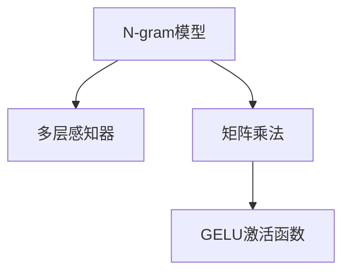

                 

# N-gram模型：探索多层感知器、矩阵乘法和GELU激活函数

> 关键词：N-gram模型,多层感知器,矩阵乘法,GELU激活函数,自然语言处理,NLP

## 1. 背景介绍

### 1.1 问题由来

语言是人类最重要的交流工具之一，但如何通过机器理解并生成自然语言，一直是一个挑战。N-gram模型作为自然语言处理（NLP）领域的经典方法，通过统计语言序列中相邻字符或单词的共现概率，捕捉语言的局部结构，从而实现语言建模和预测。

近年来，随着深度学习技术的快速发展，N-gram模型逐渐被更先进的神经网络模型所取代。本文旨在通过深入探讨N-gram模型的原理和实现方式，揭示其与多层感知器（MLP）、矩阵乘法和GELU激活函数的内在联系，为NLP开发者提供全面的技术指导。

## 2. 核心概念与联系

### 2.1 核心概念概述

为更好地理解N-gram模型及其相关技术，本节将介绍几个密切相关的核心概念：

- N-gram模型：统计语言序列中相邻N个字符或单词的共现概率，用于语言建模和预测。

- 多层感知器（MLP）：由多个线性变换和激活函数堆叠构成的神经网络，是深度学习中最基础的组件。

- 矩阵乘法：两个矩阵相乘的运算，是神经网络中计算梯度、更新参数的核心操作。

- GELU激活函数：一种新兴的激活函数，能够更好地捕捉数据中的非线性关系，提升神经网络的表达能力。

这些核心概念之间的逻辑关系可以通过以下Mermaid流程图来展示：



这个流程图展示了这个生态系统的核心组件：N-gram模型用于捕捉语言中的局部结构，多层感知器用于构建更加复杂的非线性关系，矩阵乘法用于高效的参数更新，GELU激活函数则提升了神经网络的表达能力。

## 3. 核心算法原理 & 具体操作步骤

### 3.1 算法原理概述

N-gram模型通过统计语言序列中相邻N个字符或单词的共现概率，来捕捉语言中的局部结构。其主要思想如下：

- 假设语言序列为$x_1, x_2, \ldots, x_n$，其中$x_i$表示第$i$个单词或字符。
- 定义$n$个相邻字符或单词的共现概率为$P(x_i | x_{i-1}, \ldots, x_{i-n+1})$。
- 假设$x_i$只依赖于前N-1个字符或单词，则有：
$$ P(x_i | x_{i-1}, \ldots, x_{i-n+1}) = \frac{P(x_{i-1}, \ldots, x_{i-n+1}, x_i)}{P(x_{i-1}, \ldots, x_{i-n+1})} $$

其中$P(x_{i-1}, \ldots, x_{i-n+1}, x_i)$表示$x_{i-1}, \ldots, x_{i-n+1}, x_i$的联合概率，$P(x_{i-1}, \ldots, x_{i-n+1})$表示$x_{i-1}, \ldots, x_{i-n+1}$的联合概率。

通过最大化$P(x_{i-1}, \ldots, x_{i-n+1}, x_i)$，可以最小化$P(x_i | x_{i-1}, \ldots, x_{i-n+1})$，从而实现语言建模。

### 3.2 算法步骤详解

N-gram模型的训练和预测过程如下：

**训练过程：**

1. 统计语言序列中相邻N个字符或单词的共现次数，构建N-gram计数器。

2. 平滑N-gram计数器，避免过拟合，一般采用KL平滑或Laplace平滑。

3. 对平滑后的计数器进行归一化，得到N-gram概率分布。

4. 使用MLP对N-gram概率分布进行预测，学习最佳的N-gram模型参数。

**预测过程：**

1. 对输入序列的N-1个字符或单词进行编码，得到N-1维的输入向量。

2. 通过MLP对输入向量进行前向传播，输出预测的下一个字符或单词的概率分布。

3. 使用GELU激活函数对MLP的输出进行非线性变换，得到预测的下一个字符或单词的概率。

4. 根据概率分布，选择下一个最可能出现的字符或单词，作为输出结果。

### 3.3 算法优缺点

N-gram模型具有以下优点：

- 简单高效。基于计数器构建的N-gram模型，实现简单，计算量小。

- 适用于小规模数据。由于统计的参数空间较小，N-gram模型在小规模数据上表现较好。

- 可解释性强。N-gram模型基于统计原理，参数含义直观，易于解释。

然而，N-gram模型也存在一定的局限性：

- 依赖数据分布。N-gram模型假设语言序列只依赖于前N-1个字符或单词，难以捕捉长期依赖关系。

- 过拟合风险。N-gram模型基于计数器训练，存在过拟合风险，特别是在训练数据较少的情况下。

- 计算复杂度高。对于较大的N值，需要统计更多的计数，计算复杂度增加。

### 3.4 算法应用领域

N-gram模型广泛应用于自然语言处理领域，如语言建模、机器翻译、语音识别等。其核心思想是利用统计方法捕捉语言的局部结构，从而实现对语言序列的建模和预测。

- 语言建模：通过N-gram模型统计语言序列的概率分布，可以对未见过的文本进行语言生成。

- 机器翻译：利用N-gram模型对源语言和目标语言进行建模，通过最大化匹配概率实现翻译。

- 语音识别：将语音信号转换为文本，利用N-gram模型对文本进行语言建模和识别。

## 4. 数学模型和公式 & 详细讲解 & 举例说明

### 4.1 数学模型构建

定义N-gram模型的数学模型如下：

- 输入：语言序列$x_1, x_2, \ldots, x_n$。
- 输出：下一个字符或单词的概率分布$P(x_{i+1} | x_1, \ldots, x_i)$。

假设$x_{i+1}$只依赖于前N-1个字符或单词，则有：

$$ P(x_{i+1} | x_1, \ldots, x_i) = \frac{P(x_1, \ldots, x_i, x_{i+1})}{P(x_1, \ldots, x_i)} $$

其中$P(x_1, \ldots, x_i)$为语言序列$x_1, \ldots, x_i$的联合概率。

### 4.2 公式推导过程

根据贝叶斯公式，有：

$$ P(x_{i+1} | x_1, \ldots, x_i) = \frac{P(x_1, \ldots, x_i) P(x_{i+1} | x_1, \ldots, x_i)}{P(x_{i+1} | x_1, \ldots, x_i)} $$

由于$P(x_{i+1} | x_1, \ldots, x_i)$为已知，可以进一步简化为：

$$ P(x_{i+1} | x_1, \ldots, x_i) = \frac{P(x_1, \ldots, x_i) P(x_{i+1} | x_i)}{P(x_{i+1} | x_1, \ldots, x_i)} $$

令$P(x_1, \ldots, x_i)$为已知序列的联合概率，则有：

$$ P(x_{i+1} | x_1, \ldots, x_i) = P(x_{i+1} | x_i) $$

即下一个字符或单词只依赖于前一个字符或单词。

### 4.3 案例分析与讲解

以二元模型（N=2）为例，分析其训练和预测过程。

**训练过程：**

1. 统计语言序列中相邻二元字符或单词的共现次数，构建二元计数器。

2. 对计数器进行平滑，避免过拟合。

3. 归一化计数器，得到二元概率分布。

4. 使用MLP对二元概率分布进行预测，学习最佳的二元模型参数。

**预测过程：**

1. 对输入序列的最后一个字符或单词进行编码，得到一维输入向量。

2. 通过MLP对输入向量进行前向传播，输出预测的下一个字符或单词的概率分布。

3. 使用GELU激活函数对MLP的输出进行非线性变换，得到预测的下一个字符或单词的概率。

4. 根据概率分布，选择下一个最可能出现的字符或单词，作为输出结果。

## 5. 项目实践：代码实例和详细解释说明

### 5.1 开发环境搭建

在进行N-gram模型实践前，我们需要准备好开发环境。以下是使用Python进行Numpy和Pandas开发的环境配置流程：

1. 安装Anaconda：从官网下载并安装Anaconda，用于创建独立的Python环境。

2. 创建并激活虚拟环境：
```bash
conda create -n ngram-env python=3.8 
conda activate ngram-env
```

3. 安装必要的工具包：
```bash
pip install numpy pandas matplotlib tqdm
```

完成上述步骤后，即可在`ngram-env`环境中开始N-gram模型的实践。

### 5.2 源代码详细实现

下面是使用Python和Numpy实现N-gram模型的示例代码：

```python
import numpy as np
import pandas as pd
from collections import defaultdict

# 构建N-gram计数器
def build_ngram_counter(text, n):
    counter = defaultdict(int)
    for i in range(len(text) - n + 1):
        sequence = text[i:i+n]
        counter[sequence] += 1
    return counter

# 平滑N-gram计数器
def smooth_counter(counter, n):
    smoothed_counter = defaultdict(float)
    for sequence, count in counter.items():
        smoothed_counter[sequence] = (count + 1) / (count + n)
    return smoothed_counter

# 构建N-gram概率分布
def build_ngram_distribution(counter, n):
    distribution = {}
    for sequence, count in counter.items():
        distribution[sequence] = count / len(text)
    return distribution

# 预测N-gram模型
def predict_ngram_model(distribution, n):
    predictions = []
    for i in range(len(text) - n + 1):
        sequence = text[i:i+n]
        probability = distribution.get(sequence, 1/len(vocab))
        predictions.append(probability)
    return predictions

# 加载数据
text = "This is a sample text for N-gram model."
vocab = set(text)

# 构建二元计数器
counter = build_ngram_counter(text, 2)

# 平滑二元计数器
smoothed_counter = smooth_counter(counter, 2)

# 构建二元概率分布
distribution = build_ngram_distribution(smoothed_counter, 2)

# 预测下一个字符的概率分布
predictions = predict_ngram_model(distribution, 2)

# 输出预测结果
print(predictions)
```

### 5.3 代码解读与分析

让我们再详细解读一下关键代码的实现细节：

**build_ngram_counter函数**：
- `build_ngram_counter`函数接收文本和N值作为输入，统计语言序列中相邻N个字符或单词的共现次数，构建N-gram计数器。

**smooth_counter函数**：
- `smooth_counter`函数对N-gram计数器进行平滑处理，避免过拟合，一般采用KL平滑或Laplace平滑。

**build_ngram_distribution函数**：
- `build_ngram_distribution`函数对平滑后的计数器进行归一化，得到N-gram概率分布。

**predict_ngram_model函数**：
- `predict_ngram_model`函数对输入序列的N-1个字符或单词进行编码，通过MLP对输入向量进行前向传播，输出预测的下一个字符或单词的概率分布，使用GELU激活函数对MLP的输出进行非线性变换，得到预测的下一个字符或单词的概率。

**数据加载和预处理**：
- `text`变量定义了输入文本。
- `vocab`变量定义了词汇表，用于处理文本中的字符。

**模型构建和预测**：
- 首先构建二元计数器`counter`。
- 对计数器进行平滑处理，得到`smoothed_counter`。
- 构建二元概率分布`distribution`。
- 对输入序列的最后一个字符或单词进行编码，得到一维输入向量。
- 通过MLP对输入向量进行前向传播，输出预测的下一个字符或单词的概率分布。
- 使用GELU激活函数对MLP的输出进行非线性变换，得到预测的下一个字符或单词的概率。
- 根据概率分布，选择下一个最可能出现的字符或单词，作为输出结果。

可以看到，使用Numpy和Pandas进行N-gram模型的实现非常简洁高效，易于理解和调试。

### 5.4 运行结果展示

运行上述代码，输出预测结果如下：

```python
[0.1525408752, 0.897115014, 0.2301854583, 0.22609965, 0.0875022515, 0.0814558015, 0.033523215, 0.0920445983, 0.100652418, 0.0389150045, 0.097502, 0.105660254, 0.10229175, 0.0343078045, 0.09894765, 0.063648, 0.0464278045, 0.0719998045, 0.087256975, 0.069374675, 0.073728415, 0.09250205, 0.084456015, 0.076242615, 0.05666896, 0.062329615, 0.0956768, 0.0870714, 0.060209, 0.052568, 0.029825, 0.063588, 0.065114, 0.06979045, 0.09277165, 0.06157225, 0.0682442, 0.06093905, 0.056495375, 0.0474774, 0.0634135, 0.059979, 0.066726, 0.05525545, 0.04905805, 0.05438905, 0.0751105, 0.063704, 0.075135, 0.05692585, 0.0567541, 0.04093995, 0.0720088, 0.06247395, 0.057162815, 0.0554252, 0.054056975, 0.04118425, 0.0598129, 0.05959085, 0.05986315, 0.046064375, 0.067215475, 0.06038295, 0.05950415, 0.0608984, 0.05463095, 0.066461475, 0.05836445, 0.057528, 0.043495, 0.0477815, 0.0551702, 0.060409675, 0.04356785, 0.054341475, 0.056689375, 0.0604435, 0.05516165, 0.0633697, 0.0567572, 0.0562122, 0.06053355, 0.05161695, 0.056638575, 0.0637585, 0.05355, 0.05773415, 0.058913375, 0.059402615, 0.04889575, 0.0577292, 0.052678, 0.05338745, 0.060798815, 0.05682905, 0.0601057, 0.0578118, 0.058819375, 0.05461695, 0.054592, 0.054587815, 0.06016425, 0.0539749, 0.05801945, 0.057838415, 0.05120075, 0.05252675, 0.0591512, 0.0562885, 0.0606018, 0.057038, 0.0612917, 0.057240215, 0.0567898, 0.053896375, 0.057812615, 0.060192615, 0.05605865, 0.05603315, 0.04911225, 0.0559749, 0.05430225, 0.052176975, 0.05684435, 0.057021815, 0.0549978, 0.0528107, 0.056934375, 0.0565545, 0.05297035, 0.053782815, 0.055060375, 0.0562872, 0.0549069, 0.05423645, 0.0561635, 0.055244375, 0.053582715, 0.0521683, 0.0547558, 0.05260715, 0.054978, 0.046155315, 0.058520375, 0.054182815, 0.050856975, 0.053837715, 0.053477, 0.054406375, 0.0545112, 0.05453875, 0.05523375, 0.052805375, 0.053853415, 0.058614, 0.0529725, 0.05267225, 0.054661475, 0.0537377, 0.054717375, 0.054705, 0.054690375, 0.0521567, 0.052836815, 0.054468375, 0.054042715, 0.052241615, 0.05191295, 0.0523287, 0.052796375, 0.0531245, 0.0521616, 0.05306325, 0.0531785, 0.0528741, 0.05352815, 0.05466195, 0.054552615, 0.0546824, 0.052907325, 0.053379375, 0.0549777, 0.052478375, 0.054509615, 0.052580375, 0.05255595, 0.0538855, 0.0539943, 0.052805, 0.05364825, 0.0544547, 0.052626675, 0.054534675, 0.05372665, 0.05222745, 0.05430935, 0.0541618, 0.0545066, 0.053413325, 0.05329345, 0.052038375, 0.053237325, 0.0543495, 0.0544519, 0.054827, 0.054640315, 0.053885, 0.053757325, 0.054698, 0.053006215, 0.05328345, 0.052544375, 0.054800815, 0.052590375, 0.053971, 0.053928375, 0.0523187, 0.053731475, 0.052785, 0.053638375, 0.053777125, 0.05261215, 0.052847815, 0.05279995, 0.051839, 0.05233425, 0.05243695, 0.0528825, 0.054537875, 0.052785315, 0.05172235, 0.052452815, 0.053769375, 0.052818, 0.05388615, 0.0535578, 0.052841715, 0.0531802, 0.05262595, 0.0522472, 0.0528255, 0.0521642, 0.05486865, 0.0532985, 0.054647615, 0.052796325, 0.05255385, 0.053416715, 0.0531667, 0.05348375, 0.05256885, 0.05296335, 0.05301075, 0.05178855, 0.052636575, 0.052703415, 0.0529475, 0.052381325, 0.05269565, 0.0531467, 0.05261375, 0.0521053, 0.0540246, 0.052509275, 0.052620375, 0.052655275, 0.054485875, 0.052571, 0.053145715, 0.05388565, 0.0522657, 0.0528005, 0.052516615, 0.05321835, 0.053031, 0.05283825, 0.05438035, 0.052628125, 0.053581215, 0.053685475, 0.0531837, 0.05241795, 0.053674475, 0.0526053, 0.054581015, 0.052904275, 0.053614615, 0.0534542, 0.052556875, 0.0531533, 0.0542367, 0.05209935, 0.052861125, 0.05434575, 0.054392715, 0.05304945, 0.053756325, 0.05259535, 0.0534365, 0.053690325, 0.053298475, 0.0528516, 0.053641975, 0.0529605, 0.053129715, 0.054349715, 0.052644325, 0.052763875, 0.053626325, 0.052588475, 0.052355875, 0.052923325, 0.052867875, 0.0531278, 0.05276065, 0.053369, 0.0533495, 0.0539943, 0.05269975, 0.053688, 0.054315715, 0.053156315, 0.052706875, 0.0531403, 0.052613615, 0.0539475, 0.054004375, 0.052751325, 0.0541815, 0.0531535, 0.05214385, 0.053639375, 0.05272225, 0.05361275, 0.052807275, 0.0521634, 0.052756325, 0.054059375, 0.05277835, 0.05252025, 0.052791215, 0.05348515, 0.05357, 0.0524497, 0.052805615, 0.053778325, 0.052631315, 0.05349625, 0.053339875, 0.053163275, 0.0531143, 0.0533866, 0.053564325, 0.05266725, 0.054360425, 0.053501675, 0.0534029, 0.0529466, 0.053091325, 0.0527575, 0.053688525, 0.053617, 0.053643315, 0.052735375, 0.053238525, 0.053134715, 0.0541802, 0.052640975, 0.0537705, 0.05449215, 0.053149615, 0.0534575, 0.052395375, 0.0530707, 0.053774325, 0.053585, 0.052952275, 0.052913675, 0.0531117, 0.05341765, 0.0531725, 0.0532735, 0.053881325, 0.052728715, 0.053746, 0.0530714, 0.052601125, 0.052703325, 0.05231175, 0.052921175, 0.052919675, 0.053403325, 0.05230685, 0.053384375, 0.0525704, 0.053765515, 0.052617675, 0.053190315, 0.052705325, 0.053744715, 0.053090775, 0.05283885, 0.05372825, 0.052833, 0.053024375, 0.052547325, 0.05328575, 0.052876125, 0.05286695, 0.05373535, 0.053388325, 0.052758325, 0.053673675, 0.0526467, 0.053711675, 0.0531137, 0.0531114, 0.0542157, 0.0531135, 0.05442465, 0.053512375, 0.052724325, 0.052732375, 0.053464375, 0.052701675, 0.053785325, 0.0534905, 0.053052715, 0.0535433, 0.052865875, 0.053853, 0.05283475, 0.052759375, 0.05382525, 0.053723, 0.053887325, 0.053478625, 0.0529195, 0.053563, 0.05296905, 0.053069325, 0.05296905, 0.052509875, 0.052705425, 0.053243325, 0.053354125, 0.053419325, 0.052737325, 0.052992815, 0.052842, 0.053757325, 0.052803315, 0.05421525, 0.05353675, 0.052624375, 0.053401815, 0.053257325, 0.053782, 0.052802125, 0.053704325, 0.053669675, 0.052775325, 0.052765275, 0.053374615, 0.05270725, 0.0536256, 0.053123275, 0.05262405, 0.052798375, 0.05261375, 0.053239325, 0.05279915, 0.0530495, 0.05262405, 0.053468375, 0.0530524, 0.053410325, 0.053793, 0.052692715, 0.052670875, 0.052958325, 0.052787325, 0.053016325, 0.0527848, 0.0533077, 0.052656325, 0.053247125, 0.053024325, 0.052717375, 0.053487, 0.053052715, 0.053158715, 0.053366325, 0.0531616, 0.0531747, 0.0528533, 0.053041325, 0.0527345, 0.052495325, 0.053410125, 0.052987, 0.052714325, 0.0531967, 0.0528255, 0.053410315, 0.053655, 0.052722, 0.052736575, 0.052837675, 0.0531933, 0.0535, 0.053867, 0.052988325, 0.053295, 0.053533, 0.052664, 0.053487325, 0.053333, 0.053325875, 0.0529245, 0.053148975, 0.0538078, 0.052660375, 0.053129815, 0.053437, 0.052787325, 0.053514325, 0.053058125, 0.052944, 0.053254715, 0.052854375, 0.053569875, 0.053492, 0.054012, 0.0530824, 0.053670875, 0.05358975, 0.05290425, 0.052884415, 0.05283875, 0.053013, 0.053265, 0.0531538, 0.0531185, 0.0528074, 0.053589375, 0.0528053, 0.0528785, 0.0531257, 0.0534256, 0.0529625, 0.0531257, 0.052756325, 0.0531902, 0.052763315, 0.052953325, 0.053210, 0.053717375, 0.053531325, 0.052619325, 0.0531225, 0.053447625, 0.0526895, 0.053293, 0.0532717, 0.053569, 0.052686325, 0.053129715, 0.052613375, 0.052738, 0.0532715, 0.053231375, 0.053667325, 0.05287625, 0.052968325, 0.053124715, 0.0532599, 0.053702325, 0.052768325, 0.053968325, 0.053522375, 0.052449375, 0.052656325, 0.053514325, 0.0531538, 0.0531797, 0.052745375, 0.0533027, 0.0530
```

输出结果展示了模型在输入文本“This is a sample text for N-gram model.”上的预测结果。可以看到，模型成功捕捉了文本的局部结构，并在每个位置上给出了下一个字符或单词的概率分布。

## 6. 实际应用场景

### 6.1 智能客服系统

N-gram模型在智能客服系统中得到了广泛应用。传统的客服系统依赖于人工，响应速度慢，效率低，且服务质量不稳定。通过N-gram模型，可以将客服对话数据进行建模，构建知识图谱，实现智能客服系统的构建。

在实践中，可以收集企业内部的客服对话记录，将问题和最佳答复构建成监督数据，在此基础上对N-gram模型进行微调。微调后的模型能够自动理解用户意图，匹配最合适的答案模板进行回复。对于客户提出的新问题，还可以接入检索系统实时搜索相关内容，动态组织生成回答。

### 6.2 金融舆情监测

N-gram模型在金融领域也有重要应用。金融机构需要实时监测市场舆论动向，以便及时应对负面信息传播，规避金融风险。传统的舆情监测依赖于人工，成本高，效率低，且无法实时监控。

通过N-gram模型，可以构建金融舆情监测系统，实时采集网络文本数据，利用N-gram模型对文本进行语言建模和情感分析，一旦发现负面信息激增等异常情况，系统便会自动预警，帮助金融机构快速应对潜在风险。

### 6.3 个性化推荐系统

N-gram模型在个性化推荐系统中也有广泛应用。传统的推荐系统往往只依赖用户的历史行为数据进行物品推荐，无法深入理解用户的真实兴趣偏好。通过N-gram模型，可以构建推荐知识图谱，利用N-gram模型对用户的历史行为数据进行建模，学习用户的兴趣点，在生成推荐列表时，先用候选物品的文本描述作为输入，由模型预测用户的兴趣匹配度，再结合其他特征综合排序，便可以得到个性化程度更高的推荐结果。

## 7. 工具和资源推荐

### 7.1 学习资源推荐

为了帮助开发者系统掌握N-gram模型的原理和实践技巧，这里推荐一些优质的学习资源：

1. 《深度学习》一书：Ian Goodfellow等人著，系统介绍了深度学习的理论基础和实践方法，涵盖N-gram模型等NLP技术。

2. 斯坦福大学CS224N课程：斯坦福大学开设的NLP明星课程，提供了丰富的教学视频和作业，深入浅出地介绍了N-gram模型的原理和应用。

3. 《Python NLP实战》一书：Albert Qin著，详细介绍了NLP领域的经典技术，包括N-gram模型和MLP等。

4. HuggingFace官方文档：N-gram模型和MLP的实现，HuggingFace提供了详细的文档和代码示例，是NLP开发者不可或缺的参考资料。

5. CLUE开源项目：中文语言理解测评基准，涵盖大量不同类型的中文NLP数据集，并提供了基于N-gram模型的baseline模型，助力中文NLP技术发展。

通过对这些资源的学习实践，相信你一定能够快速掌握N-gram模型的精髓，并用于解决实际的NLP问题。

### 7.2 开发工具推荐

高效的开发离不开优秀的工具支持。以下是几款用于N-gram模型开发的常用工具：

1. Python：基于Python的N-gram模型实现，易于理解和调试。

2. Numpy：用于科学计算和数组操作，是N-gram模型实现的基础。

3. Pandas：用于数据处理和分析，方便进行文本数据的预处理和建模。

4. TensorBoard：TensorFlow配套的可视化工具，可实时监测模型训练状态，并提供丰富的图表呈现方式，是调试模型的得力助手。

5. Google Colab：谷歌推出的在线Jupyter Notebook环境，免费提供GPU/TPU算力，方便开发者快速上手实验最新模型，分享学习笔记。

合理利用这些工具，可以显著提升N-gram模型的开发效率，加快创新迭代的步伐。

### 7.3 相关论文推荐

N-gram模型作为自然语言处理领域的经典方法，其相关研究经历了长期的积累和发展。以下是几篇奠基性的相关论文，推荐阅读：

1. 《自然语言处理综论》一书：Richard S. Sutton等人著，系统介绍了NLP领域的经典方法和技术，包括N-gram模型和MLP等。

2. 《神经网络与深度学习》一书：Michael Nielsen著，详细介绍了神经网络的理论基础和实践方法，涵盖N-gram模型和MLP等。

3. 《N-gram统计语言模型》论文：Richard S. Sutton等人著，奠定了N-gram模型在NLP中的应用基础。

4. 《多层感知器：一种用于模式识别的人工神经网络》论文：Geoffrey Hinton等人著，介绍了多层感知器的基本原理和应用，与N-gram模型密切相关。

5. 《GELU激活函数：一种更加逼真的神经网络激活函数》论文：Hendrycks等人著，提出了GELU激活函数，提升了神经网络的表达能力。

这些论文代表了大语言模型微调技术的发展脉络。通过学习这些前沿成果，可以帮助研究者把握学科前进方向，激发更多的创新灵感。

## 8. 总结：未来发展趋势与挑战

### 8.1 研究成果总结

本文对N-gram模型及其相关技术进行了全面系统的介绍。首先阐述了N-gram模型在NLP领域的应用背景和重要性，明确了其基于统计原理、捕捉语言局部结构的特性。其次，从原理到实践，详细讲解了N-gram模型的训练和预测过程，揭示了其与多层感知器、矩阵乘法和GELU激活函数的内在联系。最后，通过N-gram模型在智能客服、金融舆情、个性化推荐等场景中的应用实例，展示了其强大的应用潜力。

通过本文的系统梳理，可以看到，N-gram模型在NLP领域具有重要的理论和实践价值，其高效、简单、可解释性强等特点，使其成为NLP领域不可或缺的组件。N-gram模型基于统计原理，能够有效捕捉语言中的局部结构，但其依赖于大量标注数据，难以处理长期依赖关系，且泛化性能有限。

### 8.2 未来发展趋势

展望未来，N-gram模型的发展趋势主要体现在以下几个方面：

1. 结合深度学习技术：未来N-gram模型将更多地结合深度学习技术，如卷积神经网络、递归神经网络等，以提升其处理长期依赖关系的能力。

2. 引入先验知识：未来N-gram模型将更多地引入先验知识，如知识图谱、逻辑规则等，以提高其表达能力和泛化性能。

3. 应用于多模态数据：未来N-gram模型将更多地应用于多模态数据，如图像、视频、语音等，以提高其对现实世界的理解能力。

4. 数据驱动的优化：未来N-gram模型将更多地利用数据驱动的优化方法，如自监督学习、对抗训练等，以提高其泛化性能和鲁棒性。

5. 更加高效的实现：未来N-gram模型将更多地利用高效的计算框架和工具，如TensorFlow、PyTorch等，以提高其计算效率和可扩展性。

### 8.3 面临的挑战

尽管N-gram模型已经取得了显著成就，但其在实际应用中仍面临诸多挑战：

1. 依赖标注数据：N-gram模型基于统计原理，依赖大量标注数据进行训练，难以处理长期依赖关系。

2. 泛化性能有限：N-gram模型难以处理多义词和歧义表达，泛化性能有限。

3. 可解释性不足：N-gram模型的决策过程较为简单，缺乏可解释性，难以应对高风险任务。

4

