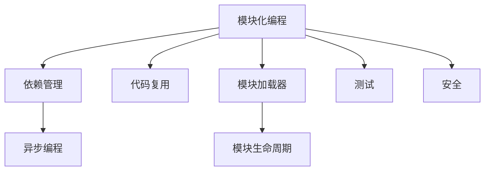

                 

# Node.js 模块化编程：管理大型项目

## 1. 背景介绍

### 1.1 问题由来
Node.js作为JavaScript运行时环境，因其强大的非阻塞I/O能力和丰富的第三方生态，广泛应用于Web应用、API开发、实时数据处理、命令行工具等多个场景。但随着项目的规模和复杂度不断提升，管理大型Node.js项目也变得越来越困难。如何有效地组织、管理和维护大型Node.js项目，成为了每一个开发者必须面对的问题。

### 1.2 问题核心关键点
大型Node.js项目面临的核心挑战包括但不限于：代码组织混乱、依赖管理复杂、性能瓶颈、安全漏洞、版本管理混乱等问题。这些问题不仅影响了项目的开发效率，也增加了维护成本。

因此，本文将重点探讨如何通过模块化编程的方式，有效管理大型Node.js项目，提升项目的开发效率、代码质量、性能和安全性。

## 2. 核心概念与联系

### 2.1 核心概念概述

为了更好地理解如何管理大型Node.js项目，本节将介绍几个密切相关的核心概念：

- 模块化编程(Modular Programming)：将复杂系统拆分为多个独立且可复用的模块，通过清晰的接口和依赖关系，提升系统的可维护性和可扩展性。
- 依赖管理(Dependency Management)：管理和组织项目的第三方依赖库，确保项目依赖一致性，避免版本冲突和重复安装。
- 代码复用(Copy-On-Write)：通过共享代码库的方式，减少代码冗余，提升开发效率。
- 模块加载器(Module Loader)：自动查找和加载模块的机制，提升代码加载速度和启动性能。
- 模块生命周期(Module Lifecycle)：模块在创建、加载、使用和卸载时的生命周期管理，确保资源正确释放。
- 异步编程(Asynchronous Programming)：Node.js的核心特性之一，通过非阻塞I/O操作和事件驱动机制，提升并发处理能力和系统响应速度。

这些核心概念之间的逻辑关系可以通过以下Mermaid流程图来展示：



这个流程图展示了大规模Node.js项目的核心概念及其之间的关系：

1. 模块化编程是基础，将项目拆分为多个模块，并通过清晰接口管理模块依赖。
2. 依赖管理确保项目依赖一致性，避免版本冲突和重复安装。
3. 代码复用减少代码冗余，提升开发效率。
4. 模块加载器提升代码加载速度和启动性能。
5. 异步编程提升并发处理能力和系统响应速度。
6. 测试和安全保障项目质量。

这些概念共同构成了大型Node.js项目的开发框架，帮助开发者更好地管理和维护项目。

## 3. 核心算法原理 & 具体操作步骤
### 3.1 算法原理概述

管理大型Node.js项目的关键在于模块化设计和高效依赖管理。本文将从这两个方面详细阐述如何通过模块化编程提升项目管理和维护效率。

### 3.2 算法步骤详解

**Step 1: 项目初始化与模块划分**

- 使用Node.js内置的`npm init`命令创建项目，初始化项目结构。
- 根据项目需求，将项目划分为多个独立且可复用的模块，每个模块负责特定功能。例如，将Web应用分为路由模块、控制器模块、模型模块等。

**Step 2: 依赖管理**

- 使用`npm init`初始化项目时，通过指定`dependencies`和`devDependencies`字段，管理项目的第三方依赖库。
- 使用`npm install`命令安装依赖库，使用`npm uninstall`命令卸载不需要的依赖库。
- 定期检查依赖库的版本，确保项目依赖一致性，避免版本冲突和重复安装。

**Step 3: 代码复用**

- 使用`copy-on-write`技术，通过共享代码库的方式，减少代码冗余。
- 例如，使用`copy-on-write`的代码复用工具如`duplicate-free`，将代码库分为公共代码和私有代码两部分，公共代码由多个模块共享，私有代码由特定模块使用。

**Step 4: 模块加载器**

- 使用Node.js内置的`require`函数加载模块，通过清晰的模块路径和接口管理，提升代码加载速度和启动性能。
- 例如，使用`require`加载路由模块，使用`module.exports`导出模块接口，供其他模块使用。

**Step 5: 模块生命周期**

- 在模块加载、使用和卸载时，管理模块的生命周期，确保资源正确释放。
- 例如，在模块加载时，初始化模块状态；在使用时，处理模块任务；在卸载时，释放模块资源。

**Step 6: 异步编程**

- 使用Node.js的事件驱动机制和异步编程模型，提升并发处理能力和系统响应速度。
- 例如，使用`setTimeout`和`setInterval`函数实现异步操作，使用`Promise`和`async/await`提升异步编程的简洁性和可读性。

### 3.3 算法优缺点

模块化编程具有以下优点：
1. 提升开发效率。模块化分工明确，每个模块功能单一，代码复用率高，开发效率提升。
2. 提升可维护性。模块之间独立且清晰，代码结构良好，便于后续维护和扩展。
3. 提升可扩展性。模块化设计便于添加新功能或模块，不影响现有代码结构。

但模块化编程也存在以下缺点：
1. 依赖管理复杂。依赖库数量多，版本更新频繁，依赖冲突风险高。
2. 代码冗余。模块之间功能重叠，代码冗余不可避免。
3. 性能瓶颈。模块之间通信开销较大，性能瓶颈明显。

尽管如此，通过合理使用模块化编程，可以有效提升项目管理和维护效率，对于大型Node.js项目尤为重要。

### 3.4 算法应用领域

模块化编程在Node.js项目中广泛应用，覆盖了Web应用、API开发、实时数据处理、命令行工具等多个领域。以下是一些典型应用场景：

- **Web应用**：通过模块化设计，将应用拆分为路由模块、控制器模块、模型模块、服务等，提升开发效率和系统可维护性。
- **API开发**：使用模块化设计，将API接口、路由、数据处理等模块独立管理，提升API开发和维护效率。
- **实时数据处理**：通过模块化设计，将数据收集、数据处理、数据存储等模块独立管理，提升实时数据处理系统的稳定性和扩展性。
- **命令行工具**：使用模块化设计，将命令行工具功能拆分为多个模块，提升工具的灵活性和可扩展性。
- **中台架构**：使用模块化设计，将公共模块独立管理，提升企业级应用的灵活性和可复用性。

## 4. 数学模型和公式 & 详细讲解 & 举例说明

### 4.1 数学模型构建

本节将使用数学语言对Node.js模块化编程的流程进行更加严格的刻画。

设大型Node.js项目由N个模块组成，每个模块由代码库C和接口I构成，接口I由一组函数和变量组成。模块之间通过接口I进行通信，形成依赖关系。

设模块i的依赖集合为D(i)，模块j对模块i的依赖权重为W(i,j)，则模块i的总依赖权重为：

$$
w(i) = \sum_{j \in D(i)} W(i,j)
$$

模块i对模块j的依赖权重为：

$$
w(j,i) = \frac{w(i)}{\sum_{k \in D(i)} W(i,k)}
$$

### 4.2 公式推导过程

在大型Node.js项目中，模块之间的依赖关系往往是复杂的。通过上述公式，可以计算每个模块的依赖权重，从而确定每个模块的加载顺序和依赖关系。

例如，在Web应用中，路由模块依赖控制器模块和模型模块，控制器模块依赖模型模块和数据处理模块。通过计算依赖权重，可以确定路由模块的加载顺序，先加载控制器模块和模型模块，再加载路由模块。

### 4.3 案例分析与讲解

假设一个大型Node.js项目包含以下几个模块：

- 路由模块：负责处理HTTP请求
- 控制器模块：处理请求数据并调用模型处理
- 模型模块：处理业务逻辑
- 数据处理模块：处理数据库操作
- 用户模块：处理用户身份验证

通过计算依赖权重，可以确定各个模块的加载顺序：

- 路由模块依赖控制器模块和模型模块，依赖权重为0.5
- 控制器模块依赖模型模块和数据处理模块，依赖权重为0.3
- 模型模块和数据处理模块相互依赖，依赖权重均为0.5
- 用户模块与其它模块相互独立，依赖权重为0

根据依赖权重，可以确定模块的加载顺序，先加载模型模块和数据处理模块，再加载控制器模块，最后加载路由模块。

## 5. 项目实践：代码实例和详细解释说明
### 5.1 开发环境搭建

在进行Node.js项目开发前，我们需要准备好开发环境。以下是使用Node.js和npm搭建开发环境的步骤：

1. 安装Node.js：从官网下载并安装Node.js，安装过程中需要选择LTS版本以确保稳定性和兼容性。
2. 安装npm：npm是Node.js的包管理器，用于安装和管理依赖库。
3. 创建项目目录：使用`mkdir`命令创建项目目录，使用`cd`命令进入项目目录。
4. 初始化项目：使用`npm init`命令初始化项目，根据提示设置项目基本信息。
5. 安装依赖库：使用`npm install`命令安装项目依赖库，例如`npm install express`安装Express框架。

### 5.2 源代码详细实现

下面以Express框架为例，展示如何使用Node.js和npm进行模块化编程和依赖管理。

首先，创建项目目录和package.json文件：

```bash
mkdir express-example
cd express-example
npm init
```

初始化后，进入package.json文件，添加依赖库：

```json
{
  "name": "express-example",
  "version": "1.0.0",
  "description": "A simple Express example",
  "main": "index.js",
  "scripts": {
    "start": "node index.js"
  },
  "repository": {
    "type": "git",
    "url": "https://github.com/username/express-example.git"
  },
  "keywords": [],
  "author": "John Doe",
  "license": "ISC",
  "dependencies": {
    "express": "^4.17.1",
    "body-parser": "^1.19.0"
  },
  "devDependencies": {
    "nodemon": "^2.0.8"
  }
}
```

然后，创建项目入口文件index.js：

```javascript
const express = require('express');
const bodyParser = require('body-parser');
const app = express();

// 使用body-parser中间件解析请求体
app.use(bodyParser.json());

// 定义路由处理函数
app.get('/', (req, res) => {
  res.send('Hello, world!');
});

// 启动服务
app.listen(3000, () => {
  console.log('Example app listening on port 3000!');
});
```

在package.json文件中添加"start"脚本，启动项目：

```json
{
  "name": "express-example",
  "version": "1.0.0",
  "description": "A simple Express example",
  "main": "index.js",
  "scripts": {
    "start": "node index.js"
  },
  "repository": {
    "type": "git",
    "url": "https://github.com/username/express-example.git"
  },
  "keywords": [],
  "author": "John Doe",
  "license": "ISC",
  "dependencies": {
    "express": "^4.17.1",
    "body-parser": "^1.19.0"
  },
  "devDependencies": {
    "nodemon": "^2.0.8"
  }
}
```

在命令行中使用`npm start`启动项目：

```bash
npm start
```

### 5.3 代码解读与分析

让我们再详细解读一下关键代码的实现细节：

**package.json文件**：
- `name`和`version`字段指定项目名称和版本号。
- `description`字段描述项目功能。
- `main`字段指定入口文件。
- `scripts`字段定义项目脚本。
- `repository`字段指定项目Git仓库地址。
- `dependencies`字段指定项目的第三方依赖库。
- `devDependencies`字段指定项目的开发依赖库。

**index.js文件**：
- 使用`require`函数加载Express和body-parser库。
- 使用`app`对象定义HTTP路由处理函数。
- 使用`app.listen`函数启动服务，监听端口3000。

通过上述步骤，我们成功搭建了一个使用Express框架的Node.js项目，通过模块化编程和依赖管理，提升了项目的开发效率和可维护性。

## 6. 实际应用场景
### 6.1 智慧城市监控系统

智慧城市监控系统通过实时收集和处理城市数据，提升城市管理和公共安全水平。使用Node.js模块化编程，可以将系统拆分为数据收集模块、数据处理模块、数据存储模块、监控模块等，每个模块独立开发、测试和维护。

在实际部署时，使用Kubernetes等容器化技术，实现模块化部署和管理，提升系统的稳定性和扩展性。同时，通过异步编程和事件驱动机制，提高系统的并发处理能力和系统响应速度。

### 6.2 智能客服系统

智能客服系统通过自然语言处理技术，实现自动化客服功能，提升客户服务体验和效率。使用Node.js模块化编程，可以将系统拆分为用户模块、消息模块、意图识别模块、回复生成模块等，每个模块独立开发、测试和维护。

在实际部署时，使用微服务架构，将系统拆分为多个微服务，提升系统的灵活性和可扩展性。同时，通过异步编程和事件驱动机制，提高系统的并发处理能力和系统响应速度。

### 6.3 智能推荐系统

智能推荐系统通过分析用户行为数据，实现个性化推荐功能，提升用户满意度和粘性。使用Node.js模块化编程，可以将系统拆分为用户模块、行为分析模块、推荐算法模块、推荐展示模块等，每个模块独立开发、测试和维护。

在实际部署时，使用Kubernetes等容器化技术，实现模块化部署和管理，提升系统的稳定性和扩展性。同时，通过异步编程和事件驱动机制，提高系统的并发处理能力和系统响应速度。

### 6.4 未来应用展望

随着Node.js模块化编程技术的不断发展，基于模块化编程的Node.js项目将在更多领域得到应用，为各行各业带来变革性影响。

在智慧医疗领域，使用模块化编程开发医疗问答系统、病历分析系统、药物研发系统等，提升医疗服务的智能化水平，辅助医生诊疗，加速新药开发进程。

在智能教育领域，使用模块化编程开发个性化推荐系统、智能题库系统、学习管理系统等，因材施教，促进教育公平，提高教学质量。

在智慧城市治理中，使用模块化编程开发城市事件监测系统、舆情分析系统、应急指挥系统等，提高城市管理的自动化和智能化水平，构建更安全、高效的未来城市。

此外，在企业生产、社会治理、文娱传媒等众多领域，基于模块化编程的Node.js项目也将不断涌现，为传统行业数字化转型升级提供新的技术路径。

## 7. 工具和资源推荐
### 7.1 学习资源推荐

为了帮助开发者系统掌握Node.js模块化编程的理论基础和实践技巧，这里推荐一些优质的学习资源：

1. 《Node.js设计模式》书籍：深入浅出地介绍了Node.js模块化编程的各种设计模式，如单例模式、观察者模式、事件驱动模式等。
2. 《Node.js高级编程》书籍：详细介绍了Node.js模块化编程的各种高级技巧，如异步编程、事件驱动、中间件等。
3. 《Node.js实战》书籍：通过实战项目，介绍Node.js模块化编程的各种应用场景，如Web应用、API开发、实时数据处理等。
4. Node.js官方文档：详细介绍了Node.js的各个模块、API和最佳实践，是开发者快速上手Node.js的重要资料。
5. NodeSchool网站：提供大量Node.js模块化编程的教程和项目，适合初学者和进阶者。

通过对这些资源的学习实践，相信你一定能够快速掌握Node.js模块化编程的精髓，并用于解决实际的开发问题。

### 7.2 开发工具推荐

高效的开发离不开优秀的工具支持。以下是几款用于Node.js模块化编程开发的常用工具：

1. Visual Studio Code：功能强大的代码编辑器，支持各种语言和框架，内置Node.js调试功能，适合开发复杂项目。
2. npm：Node.js的包管理器，用于安装、管理和发布依赖库，是Node.js项目的基础工具。
3. Nodemon：自动重启Node.js应用的工具，可以实时观察代码变动，提高开发效率。
4. Webpack：模块打包工具，可以将多个模块打包成一个应用，提升应用性能。
5. Babel：JavaScript编译器，可以将现代JavaScript代码编译为兼容各种浏览器的代码，提升代码兼容性。

合理利用这些工具，可以显著提升Node.js模块化编程的开发效率，加快创新迭代的步伐。

### 7.3 相关论文推荐

Node.js模块化编程的发展源于学界的持续研究。以下是几篇奠基性的相关论文，推荐阅读：

1. "Node.js: I/O-Driven, Persistent, Event-Driven Programming Language and Runtime"：介绍Node.js的核心特性和设计理念，是理解Node.js模块化编程的必读论文。
2. "Modules in JavaScript: The Power of Reusability"：深入探讨JavaScript模块化编程的各种实现方式和设计模式，是Node.js模块化编程的重要参考资料。
3. "Node.js Architecture: Design and Implementation"：介绍Node.js架构设计和实现细节，是深入理解Node.js模块化编程的重要资料。

这些论文代表了大规模Node.js模块化编程的发展脉络。通过学习这些前沿成果，可以帮助研究者把握学科前进方向，激发更多的创新灵感。

## 8. 总结：未来发展趋势与挑战
### 8.1 研究成果总结

本文对Node.js模块化编程的管理大型项目的方法进行了全面系统的介绍。首先阐述了模块化编程在管理大型Node.js项目中的重要性，明确了模块化编程在提升项目开发效率、可维护性和可扩展性方面的独特价值。其次，从原理到实践，详细讲解了Node.js模块化编程的数学模型和具体步骤，给出了模块化编程任务开发的完整代码实例。同时，本文还广泛探讨了模块化编程在多个行业领域的应用前景，展示了模块化编程范式的巨大潜力。

通过本文的系统梳理，可以看到，模块化编程是管理大型Node.js项目的关键，能够有效提升项目的开发效率、代码质量和性能。未来，伴随Node.js模块化编程技术的持续演进，相信Node.js项目的管理和维护将更加高效和可靠。

### 8.2 未来发展趋势

展望未来，Node.js模块化编程技术将呈现以下几个发展趋势：

1. 模块化设计工具化。随着开发工具的不断进步，自动化模块化设计工具将逐步普及，帮助开发者快速生成模块化结构，提升开发效率。
2. 模块协作平台化。使用DevOps工具和平台，如Jenkins、Docker、Kubernetes等，实现模块的自动化部署、管理和扩展，提升系统稳定性和可扩展性。
3. 模块生命周期管理自动化。通过开发工具和平台，实现模块的生命周期管理自动化，提升代码质量和性能。
4. 模块化和云原生深度融合。将Node.js模块化编程与云原生技术深度融合，实现更高效、更灵活的云原生应用开发和部署。

以上趋势凸显了Node.js模块化编程技术的广阔前景。这些方向的探索发展，必将进一步提升Node.js项目的开发效率和性能，为行业带来变革性影响。

### 8.3 面临的挑战

尽管Node.js模块化编程技术已经取得了瞩目成就，但在迈向更加智能化、普适化应用的过程中，它仍面临着诸多挑战：

1. 依赖管理复杂。依赖库数量多，版本更新频繁，依赖冲突风险高。如何更好地管理依赖库，避免版本冲突，仍是一大难题。
2. 代码冗余。模块之间功能重叠，代码冗余不可避免。如何有效复用代码，减少冗余，仍需更多探索。
3. 性能瓶颈。模块之间通信开销较大，性能瓶颈明显。如何提升模块间通信效率，提升性能，仍需深入优化。
4. 安全漏洞。Node.js模块化编程面临的安全威胁日益增加，如SQL注入、跨站脚本攻击等。如何加强模块安全性，保障应用安全，仍需更多投入。
5. 开发成本。模块化设计增加了代码复杂性，开发成本和维护成本增加。如何平衡模块化设计和开发成本，仍需更多探索。

尽管存在这些挑战，但通过不断优化和改进，Node.js模块化编程技术将不断成熟，为开发者提供更高效、更可靠、更安全的开发环境。

### 8.4 研究展望

面对Node.js模块化编程所面临的种种挑战，未来的研究需要在以下几个方面寻求新的突破：

1. 探索自动化的模块化设计工具。通过开发自动化工具，帮助开发者快速生成模块化结构，提升开发效率。
2. 研究更高效的模块间通信机制。开发更高效的通信协议和中间件，减少模块间通信开销，提升性能。
3. 加强模块安全性研究。开发更安全的模块设计和开发工具，保障应用安全。
4. 探索更灵活的模块化协作平台。使用DevOps工具和平台，实现模块的自动化部署、管理和扩展，提升系统稳定性和可扩展性。
5. 研究更高效、更灵活的云原生应用开发和部署。将Node.js模块化编程与云原生技术深度融合，实现更高效、更灵活的云原生应用开发和部署。

这些研究方向的探索，必将引领Node.js模块化编程技术迈向更高的台阶，为开发者提供更高效、更可靠、更安全的开发环境。面向未来，Node.js模块化编程技术还需要与其他技术进行更深入的融合，如知识表示、因果推理、强化学习等，多路径协同发力，共同推动Node.js项目的持续发展和进步。

## 9. 附录：常见问题与解答

**Q1：如何选择合适的模块化设计策略？**

A: 选择合适的模块化设计策略需要考虑项目的规模、复杂度和需求。一般来说，小型项目可以使用单体应用设计，中型项目可以使用微服务架构设计，大型项目可以使用分布式微服务架构设计。此外，还需要考虑模块之间的依赖关系和接口设计，确保模块独立且可复用。

**Q2：模块化设计对开发效率和维护成本有何影响？**

A: 模块化设计可以提升开发效率和可维护性，但也增加了代码复杂性和开发成本。一般来说，模块化设计需要更多的设计和开发投入，但可以减少代码冗余和维护成本。因此，需要权衡模块化设计和开发成本之间的关系，选择最适合项目的模块化设计策略。

**Q3：如何在大型Node.js项目中管理依赖库？**

A: 在大型Node.js项目中，管理依赖库是关键。可以使用npm等包管理器，使用`dependencies`和`devDependencies`字段管理项目依赖库。定期检查依赖库的版本，确保项目依赖一致性，避免版本冲突和重复安装。

**Q4：模块化设计如何提升项目开发效率？**

A: 模块化设计通过拆分项目为多个独立且可复用的模块，可以减少代码冗余，提升开发效率。每个模块独立开发、测试和维护，可以并行开发多个模块，提升开发速度。此外，模块化设计还可以灵活添加新功能，提升项目可扩展性。

**Q5：如何在大型Node.js项目中实现模块的生命周期管理？**

A: 在大型Node.js项目中，模块的生命周期管理非常重要。可以使用Node.js内置的生命周期钩子函数，如`module.exports`和`module.exports.B丁\`，管理模块的加载、使用和卸载。同时，可以使用Node.js的事件驱动机制，实现模块的异步加载和卸载，提升系统响应速度。

---

作者：禅与计算机程序设计艺术 / Zen and the Art of Computer Programming

