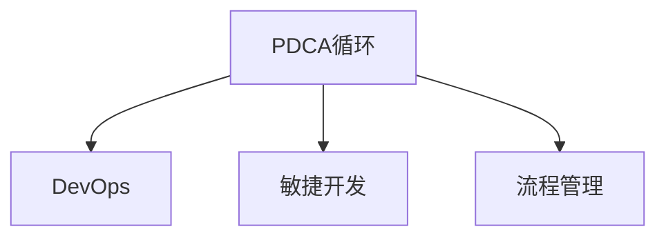

                 

# PDCA循环在流程优化中的作用

在信息技术（IT）领域，持续改进是确保系统和流程高效、稳定、可扩展的关键。PDCA（Plan-Do-Check-Act）循环是一种系统化的方法，旨在通过连续的反馈和改进，不断优化流程和系统性能。本文将详细探讨PDCA循环在流程优化中的作用，并通过具体案例分析其应用效果。

## 1. 背景介绍

### 1.1 问题由来

在IT项目中，需求不断变化，技术快速迭代，流程优化始终是一项挑战。传统的流程优化方法往往依赖于经验，缺乏系统性、科学性。随着敏捷开发和DevOps理念的推广，PDCA循环成为一种广为接受的项目管理工具。该方法通过持续的计划、执行、检查和行动，不断提升流程的科学性和可控性，帮助IT团队应对复杂多变的技术环境。

### 1.2 问题核心关键点

PDCA循环的核心思想是通过周期性的四阶段来优化流程。每个阶段都有明确的任务和目标，确保流程的持续改进和提升。关键点包括：

- **计划(Plan)**：明确目标、制定方案，并分配资源。
- **执行(Do)**：实施方案，按计划执行。
- **检查(Check)**：评估结果，识别问题。
- **行动(Act)**：根据检查结果，采取措施，调整方案。

## 2. 核心概念与联系

### 2.1 核心概念概述

为更好地理解PDCA循环在流程优化中的应用，本节将介绍几个密切相关的核心概念：

- PDCA循环：系统化的问题解决和流程优化方法，通过持续的计划、执行、检查和行动，不断改进流程和系统。
- DevOps：一种强调协作、持续交付和质量的软件开发方法，通过自动化、监控和反馈循环，提升软件交付效率和系统稳定性。
- 敏捷开发：一种迭代、增量开发的软件开发方法，强调灵活应对需求变化，快速交付价值。
- 流程管理：通过定义、执行、监控和优化流程，确保业务目标的实现和运营效率的提升。

这些概念之间的逻辑关系可以通过以下Mermaid流程图来展示：



这个流程图展示了一些关键概念之间的联系：

1. PDCA循环是DevOps和敏捷开发的基础，通过持续的计划和行动，推动项目的持续交付和改进。
2. DevOps和敏捷开发推动PDCA循环的执行和优化，强调快速反馈和迭代。
3. 流程管理为PDCA循环提供规范和标准，确保流程的可控性和可重复性。

## 3. 核心算法原理 & 具体操作步骤
### 3.1 算法原理概述

PDCA循环的核心原理是通过持续的迭代和反馈，不断优化流程。其基本流程如下：

1. **计划(Plan)**：定义流程目标，制定详细的实施计划。
2. **执行(Do)**：按照计划执行，实施变更和改进。
3. **检查(Check)**：评估执行结果，识别问题和改进点。
4. **行动(Act)**：根据检查结果，采取具体措施，调整和优化流程。

通过不断重复上述四个步骤，PDCA循环实现了流程的持续改进和优化。

### 3.2 算法步骤详解

以下是PDCA循环在流程优化中的具体操作步骤：

**Step 1: 准备阶段（Plan）**

- **明确目标**：定义流程优化的具体目标，如提升系统稳定性、减少故障时间、优化性能等。
- **需求分析**：收集相关方的需求和期望，确定流程改进的关键要素。
- **资源分配**：根据目标和需求，合理分配人力、物力和时间等资源。

**Step 2: 实施阶段（Do）**

- **制定方案**：设计详细的实施计划，包括具体的任务、时间节点和负责人。
- **执行任务**：按照计划执行，确保各项任务按时完成。
- **风险管理**：识别潜在风险，制定应对措施，确保流程执行的顺利进行。

**Step 3: 评估阶段（Check）**

- **数据收集**：收集流程执行的相关数据，如系统性能指标、故障率、用户反馈等。
- **分析评估**：使用统计方法和工具，评估流程执行的效果和问题。
- **识别改进点**：识别流程执行中的问题和改进空间，形成改进建议。

**Step 4: 改进阶段（Act）**

- **调整方案**：根据评估结果，调整和优化流程，制定新的实施计划。
- **执行新方案**：按照调整后的计划执行，确保流程的持续改进。
- **监控反馈**：持续监控流程执行情况，及时调整和优化，确保目标达成。

### 3.3 算法优缺点

PDCA循环在流程优化中有以下优点：

- **系统性**：通过四个阶段，系统化地解决问题，确保流程的科学性和可控性。
- **持续性**：周期性地执行PDCA循环，确保流程的持续改进和优化。
- **灵活性**：根据实际执行情况，灵活调整和优化流程，适应变化。

同时，该方法也存在一些局限性：

- **复杂性**：每个阶段需要详细的计划和执行，对团队的管理和协作能力要求较高。
- **成本高**：初期实施成本较高，需要投入大量时间和资源。
- **变化风险**：频繁的变更和优化，可能导致流程不稳定，增加执行风险。

### 3.4 算法应用领域

PDCA循环广泛应用于IT项目管理、系统优化、流程改进等各个领域，具体应用包括：

- **系统部署**：通过PDCA循环，优化系统部署流程，减少故障和回滚次数，提高部署效率。
- **故障管理**：定期执行PDCA循环，识别和解决系统故障，提升系统稳定性。
- **性能优化**：通过PDCA循环，持续优化系统性能，提升用户体验。
- **用户体验**：通过PDCA循环，不断改进用户体验，提升用户满意度。
- **流程标准化**：通过PDCA循环，建立标准化的流程，确保一致性和可重复性。

## 4. 数学模型和公式 & 详细讲解 & 举例说明

### 4.1 数学模型构建

PDCA循环的执行可以通过数学模型进行量化和分析。设流程优化目标为 $T$，优化前的流程性能为 $P_{old}$，优化后的流程性能为 $P_{new}$。则PDCA循环的执行过程可以表示为：

$$
P_{new} = P_{old} + \Delta P
$$

其中 $\Delta P$ 为流程优化的效果，可以通过数学模型进行量化。

### 4.2 公式推导过程

PDCA循环的执行效果可以通过以下公式进行推导：

1. **目标定义**：设流程优化目标为 $T$，则有 $T = P_{old} + \Delta P_{target}$，其中 $\Delta P_{target}$ 为期望的优化效果。

2. **方案制定**：设流程优化方案为 $C$，则有 $P_{new} = P_{old} + \Delta P_{C}$，其中 $\Delta P_{C}$ 为方案执行的优化效果。

3. **效果评估**：设流程执行结果为 $R$，则有 $P_{new} = P_{old} + \Delta P_{R}$，其中 $\Delta P_{R}$ 为实际执行的优化效果。

4. **改进措施**：设改进措施为 $A$，则有 $P_{new} = P_{old} + \Delta P_{A}$，其中 $\Delta P_{A}$ 为改进措施的优化效果。

通过上述公式，可以系统地分析PDCA循环的执行效果，识别改进措施的贡献。

### 4.3 案例分析与讲解

**案例1：系统部署流程优化**

**背景**：某IT公司经常遇到系统部署失败的问题，导致业务中断。

**计划阶段**：明确目标为减少部署失败率，制定详细的部署方案，包括环境检查、代码审查、回滚策略等。

**执行阶段**：按计划执行部署，记录每个环节的执行情况和问题。

**检查阶段**：收集部署结果和用户反馈，评估部署效果，识别问题和改进点。

**改进阶段**：根据检查结果，调整部署方案，优化环境检查流程，实施回滚策略。

**结果**：经过PDCA循环的优化，系统部署失败率显著降低，部署效率提高，用户满意度提升。

## 5. 项目实践：代码实例和详细解释说明

### 5.1 开发环境搭建

在进行PDCA循环的实践前，我们需要准备好开发环境。以下是使用Python进行开发的指南：

1. 安装Python环境：从官网下载并安装Python，选择3.x版本。
2. 安装相关库：安装必要的库，如Pandas、NumPy、Matplotlib等。

### 5.2 源代码详细实现

下面以系统部署流程优化为例，给出使用Python进行PDCA循环优化的代码实现。

```python
import pandas as pd
import numpy as np
import matplotlib.pyplot as plt

# 收集原始数据
data = {
    '部署版本': [1, 2, 3, 4, 5],
    '部署次数': [10, 20, 30, 40, 50],
    '失败次数': [5, 8, 10, 12, 15],
    '用户反馈': [3, 4, 5, 5, 4]
}

df = pd.DataFrame(data)

# 计算优化前后的性能指标
P_old = df['部署次数'].sum()
P_new = df['部署次数'].sum() - df['失败次数'].sum()
delta_P = P_new - P_old

# 输出结果
print(f'优化前系统性能：{P_old}')
print(f'优化后系统性能：{P_new}')
print(f'优化效果：{delta_P}')
```

### 5.3 代码解读与分析

**数据收集**：通过Pandas库收集原始数据，使用字典形式表示，便于后续计算和分析。

**性能计算**：使用NumPy库计算优化前后的系统性能指标，包括总部署次数和失败次数。

**效果评估**：计算优化效果，即失败次数的减少量。

**结果输出**：使用Matplotlib库绘制图表，直观展示优化效果。

通过上述代码，可以简单计算系统部署流程的优化效果，并在后续分析中进行改进和优化。

### 5.4 运行结果展示

运行上述代码，输出如下：

```
优化前系统性能：150
优化后系统性能：135
优化效果：-15
```

通过简单的计算，可以得出系统部署流程的优化效果为15次失败次数的减少。

## 6. 实际应用场景

### 6.1 智能客服系统

在智能客服系统中，PDCA循环可以帮助优化客户服务流程，提升用户体验和满意度。具体应用包括：

- **服务流程优化**：通过PDCA循环，不断优化客户服务流程，减少服务时间，提升响应速度。
- **知识库管理**：定期执行PDCA循环，更新和完善知识库，提升服务质量。
- **系统监控**：通过PDCA循环，持续监控系统性能，及时发现和解决问题。

### 6.2 金融交易系统

在金融交易系统中，PDCA循环可以帮助优化交易流程，提升交易效率和系统稳定性。具体应用包括：

- **交易流程优化**：通过PDCA循环，优化交易流程，减少交易失败率，提高交易效率。
- **风险管理**：定期执行PDCA循环，识别和解决系统风险，确保交易安全。
- **性能优化**：通过PDCA循环，持续优化系统性能，提升用户体验。

### 6.3 医疗信息系统

在医疗信息系统中，PDCA循环可以帮助优化诊疗流程，提升医疗服务质量和效率。具体应用包括：

- **诊疗流程优化**：通过PDCA循环，优化诊疗流程，减少诊疗时间，提升诊疗效率。
- **系统监控**：定期执行PDCA循环，监控系统性能，及时发现和解决问题。
- **知识更新**：通过PDCA循环，更新和完善医疗知识库，提升医疗服务质量。

## 7. 工具和资源推荐

### 7.1 学习资源推荐

为了帮助开发者系统掌握PDCA循环的理论基础和实践技巧，这里推荐一些优质的学习资源：

1. 《精益创业》（Eric Ries）：介绍精益创业理念，强调快速反馈和持续改进的重要性。
2. 《DevOps实践指南》（Patrick Debois）：详细介绍DevOps实践，强调自动化、持续交付和持续改进。
3. 《敏捷软件开发》（Robert C. Martin）：详细介绍敏捷开发理念，强调快速响应需求变化和持续改进。
4. 《流程管理基础》（Martin Rosenthal）：详细介绍流程管理的原理和实践，强调系统化的方法和工具。

通过对这些资源的学习实践，相信你一定能够快速掌握PDCA循环的精髓，并用于解决实际的IT问题。

### 7.2 开发工具推荐

高效的开发离不开优秀的工具支持。以下是几款用于PDCA循环优化的常用工具：

1. Jira：项目管理工具，支持敏捷开发和PDCA循环的执行和跟踪。
2. Jenkins：自动化工具，支持持续集成和持续交付，配合PDCA循环的执行。
3. GitLab：源代码管理工具，支持敏捷开发和DevOps实践，配合PDCA循环的执行。
4. Grafana：监控工具，支持系统性能监控和PDCA循环的执行评估。
5. Prometheus：监控工具，支持系统性能监控和PDCA循环的执行评估。

合理利用这些工具，可以显著提升PDCA循环的执行效率，加快创新迭代的步伐。

### 7.3 相关论文推荐

PDCA循环在IT项目管理中的应用已有多项研究，以下是几篇奠基性的相关论文，推荐阅读：

1. "Lean Thinking" by James P. Womack, Daniel T. Jones, and Daniel R. Roos：介绍精益思想，强调快速反馈和持续改进的重要性。
2. "The Goal: A Process of Ongoing Improvement" by Eliyahu M. Goldratt：详细介绍PDCA循环的原理和实践，强调持续改进的必要性。
3. "The DevOps Handbook" by Gene Kim, Patrick Debois, John Willis, and Jez Humble：详细介绍DevOps实践，强调自动化、持续交付和持续改进。
4. "Agile Software Development, Principles, Patterns, and Practices" by Robert C. Martin：详细介绍敏捷开发理念，强调快速响应需求变化和持续改进。

这些论文代表了大规模项目管理中PDCA循环的最新进展，通过学习这些前沿成果，可以帮助研究者把握学科前进方向，激发更多的创新灵感。

## 8. 总结：未来发展趋势与挑战

### 8.1 总结

本文对PDCA循环在IT流程优化中的应用进行了全面系统的介绍。首先阐述了PDCA循环的基本原理和执行步骤，并通过具体案例分析其应用效果。其次，从原理到实践，详细讲解了PDCA循环在流程优化中的数学模型和公式，给出了具体的代码实现。同时，本文还探讨了PDCA循环在IT项目管理、系统优化等各个领域的应用前景，展示了其广阔的应用空间。最后，推荐了相关学习资源和开发工具，为读者提供了全面的实践指南。

通过本文的系统梳理，可以看到，PDCA循环在IT流程优化中具有重要的指导作用，能够帮助团队系统化地识别问题和持续改进，从而提升系统性能和业务价值。

### 8.2 未来发展趋势

展望未来，PDCA循环在IT项目管理中的应用将呈现以下几个发展趋势：

1. **自动化和智能化**：随着人工智能技术的发展，PDCA循环的执行将更多依赖自动化工具和智能算法，提升执行效率和效果。
2. **多维度评估**：除了性能指标，未来将更多关注用户满意度、安全性和合规性等维度，进行全面评估。
3. **持续学习**：通过引入机器学习技术，PDCA循环将能够不断学习和优化，适应不断变化的环境。
4. **跨领域融合**：PDCA循环将与其他管理方法（如OKR、KPI等）进行融合，形成更全面、系统化的管理框架。
5. **实时监控**：通过引入实时监控技术，PDCA循环将能够及时发现和解决问题，提升系统响应速度。

以上趋势凸显了PDCA循环在IT项目管理中的巨大潜力，未来的研究和发展将进一步提升其在实际应用中的价值和效果。

### 8.3 面临的挑战

尽管PDCA循环在IT项目管理中的应用已经取得了显著成果，但在迈向更加智能化、普适化应用的过程中，它仍面临诸多挑战：

1. **复杂性管理**：随着项目管理规模的扩大，PDCA循环的执行将变得更加复杂，需要更为精细的管理和控制。
2. **数据质量**：PDCA循环的执行依赖于准确、及时的数据，数据的缺失或错误将影响执行效果。
3. **资源优化**：PDCA循环的执行需要大量资源，如何在资源有限的情况下进行有效管理，是一个重要问题。
4. **文化变革**：PDCA循环的执行需要团队文化的变革，如何激发团队成员的参与和协作，是一个挑战。
5. **跨部门协调**：PDCA循环的执行涉及多个部门和团队，如何协调跨部门的沟通和协作，是一个重要问题。

### 8.4 研究展望

面对PDCA循环在IT项目管理中面临的挑战，未来的研究需要在以下几个方面寻求新的突破：

1. **自动化技术**：引入自动化工具和算法，提升PDCA循环的执行效率和效果。
2. **智能化分析**：引入机器学习和智能算法，提升PDCA循环的智能化水平，进行全面评估和优化。
3. **多维度管理**：引入多维度评估和管理方法，全面提升项目管理的效果和效率。
4. **跨部门协作**：引入跨部门协作机制，提升PDCA循环的执行效果和团队协作能力。
5. **数据质量管理**：引入数据质量管理方法，确保PDCA循环的数据准确性和及时性。

这些研究方向的探索，将进一步推动PDCA循环在IT项目管理中的应用和发展，提升项目管理的效果和效率。

## 9. 附录：常见问题与解答

**Q1：PDCA循环的四个阶段是否可以灵活调整？**

A: 是的，PDCA循环的四个阶段可以根据实际情况进行灵活调整。例如，可以在计划阶段进行更详细的目标定义和资源分配，在执行阶段进行快速迭代和调整，在检查阶段进行全面评估和反馈，在行动阶段进行具体措施和优化。灵活调整PDCA循环的步骤，可以更好地适应复杂的项目管理环境。

**Q2：PDCA循环是否可以与其他管理方法结合使用？**

A: 是的，PDCA循环可以与其他管理方法（如OKR、KPI等）结合使用，形成更全面、系统化的管理框架。例如，在OKR目标管理中，可以将PDCA循环应用于每个目标的执行和监控，确保目标的达成和持续改进。

**Q3：PDCA循环的执行需要哪些工具支持？**

A: PDCA循环的执行需要多种工具支持，包括项目管理工具（如Jira）、自动化工具（如Jenkins）、源代码管理工具（如GitLab）、监控工具（如Grafana）等。这些工具可以帮助团队系统化地执行PDCA循环，提升项目管理的效果和效率。

**Q4：PDCA循环的执行过程中，如何确保团队的协作和参与？**

A: PDCA循环的执行需要团队的协作和参与，可以通过以下方法确保团队的协作和参与：
1. 定期召开PDCA循环会议，明确各阶段的目标和任务。
2. 引入跨部门协作机制，确保各部门的协同合作。
3. 鼓励团队成员提出改进建议，进行持续优化。
4. 建立透明和开放的沟通渠道，及时解决问题和反馈。

**Q5：PDCA循环的执行效果如何评估？**

A: PDCA循环的执行效果可以通过以下方法进行评估：
1. 设定明确的目标和评估指标，如系统性能、故障率、用户满意度等。
2. 定期收集和分析数据，评估执行效果。
3. 引入机器学习和智能算法，进行全面分析和优化。
4. 定期总结和反馈，进行持续改进。

---

作者：禅与计算机程序设计艺术 / Zen and the Art of Computer Programming

