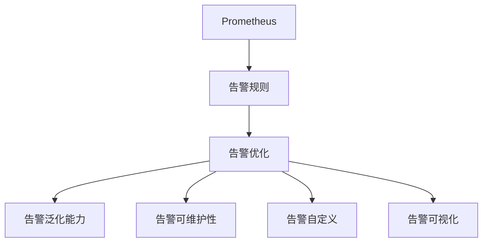

                 

# Prometheus监控告警配置优化

> 关键词：
   - Prometheus
   - 监控告警
   - 告警规则
   - 告警优化
   - 监控效率
   - 告警泛化能力
   - 告警可维护性
   - 告警自定义
   - 告警可视化

## 1. 背景介绍

### 1.1 问题由来

在数字化转型和DevOps文化日益兴起的今天，企业对于IT基础设施的监控需求愈发强烈。 Prometheus作为一个强大的开源监控系统，已经成为企业内部广泛使用的监控方案。然而，随着监控数据的急剧增长，Prometheus的告警配置和管理逐渐成为影响监控效果的核心问题之一。传统的告警规则基于固定阈值，缺乏灵活性和自适应能力。大量误报和漏报导致运维人员难以及时响应，极大降低了企业的运维效率和质量。

### 1.2 问题核心关键点

- **告警阈值设定**：传统的告警规则以固定阈值为触发条件，当指标超过该阈值时，即触发告警。但固定阈值无法应对指标波动、环境变化等情况，极易导致误报和漏报。
- **告警规则泛化能力**：复杂的业务环境往往包含多种类型的指标变化，单一的告警规则难以涵盖所有情况，需多规则组合。传统规则配置难以实现灵活的告警规则配置。
- **告警规则可维护性**：告警规则数量庞大且分散，难以管理和维护。规则变更需要大量手工操作，容易引入错误和遗漏。
- **告警自定义**：企业业务类型繁多，需要针对不同业务特性配置相应的告警规则。传统的告警规则难以实现对业务场景的精准匹配。
- **告警可视化**：告警信息多且杂，不易被快速识别和处理。需将告警信息进行更直观的展示，提升告警处理效率。

## 2. 核心概念与联系

### 2.1 核心概念概述

为更好地理解Prometheus告警配置优化，本节将介绍几个密切相关的核心概念：

- **Prometheus**：基于OpenTSDB的开源监控系统，以数据为中心，可以监控各种IT系统，提供高性能的数据存储和查询功能。
- **告警规则**：Prometheus的告警规则是基于某些条件（如指标超过阈值、指标变化率等）触发告警的规则。
- **告警优化**：通过告警规则的优化，提升告警的准确性和效率，减少误报和漏报。
- **告警泛化能力**：告警规则能够适应不同场景的泛化能力，增强告警的通用性和可扩展性。
- **告警可维护性**：告警规则的易用性和管理性，减少规则配置和维护的复杂度。
- **告警自定义**：根据企业具体业务需求，定制化告警规则的能力。
- **告警可视化**：通过图表、仪表盘等形式，直观展示告警信息，提升告警处理效率。

这些核心概念之间的逻辑关系可以通过以下Mermaid流程图来展示：



这个流程图展示了大语言模型的核心概念及其之间的关系：

1. Prometheus通过告警规则进行监控告警。
2. 告警优化、告警泛化能力、告警可维护性、告警自定义和告警可视化共同构成告警规则的优化。

这些概念共同构成了Prometheus告警规则的优化框架，使其能够在各种场景下实现精准、高效的告警。

## 3. 核心算法原理 & 具体操作步骤

### 3.1 算法原理概述

Prometheus告警配置优化的核心思想是通过告警规则的合理配置，提升告警的准确性和效率。传统的告警规则基于固定阈值，存在误报和漏报的风险。优化后的告警规则可以动态适应指标变化，减少误报和漏报，提升告警的泛化能力和可维护性。

### 3.2 算法步骤详解

Prometheus告警规则的优化通常包括以下几个关键步骤：

**Step 1: 数据收集与预处理**

- 收集与业务相关的监控指标数据，确保数据的完整性和可靠性。
- 对数据进行预处理，包括去重、归一化、异常值处理等操作，减少噪声对告警规则的影响。

**Step 2: 告警规则设计**

- 根据业务场景和关键指标，设计告警规则。告警规则包括触发条件、告警阈值、告警消息等部分。
- 选择合适的告警策略，如阈值告警、滑动窗口告警、异常检测告警等。

**Step 3: 告警规则优化**

- 应用统计学方法，如均值漂移检测、时间序列分析等，动态调整告警阈值。
- 采用机器学习技术，如Adaboost、决策树等，自动优化告警规则。
- 引入异常检测技术，如Isolation Forest、One-Class SVM等，提升告警规则的鲁棒性。

**Step 4: 告警规则部署与监控**

- 将优化后的告警规则配置到Prometheus系统中。
- 实时监控告警规则的执行效果，根据实际效果进行二次优化。

**Step 5: 告警可视化和展示**

- 将告警信息通过图表、仪表盘等形式进行可视化展示，方便运维人员快速识别和处理。
- 实时展示告警状态和告警处理情况，提升告警处理效率。

### 3.3 算法优缺点

Prometheus告警规则优化方法具有以下优点：

- **准确性和泛化能力**：通过动态调整和机器学习技术，优化后的告警规则能够更准确地识别和处理告警信息，提升告警的泛化能力。
- **可维护性和自定义能力**：告警规则的配置和管理更加灵活，减少手工操作的复杂度，提升告警规则的可维护性。
- **告警可视化**：通过可视化展示告警信息，提升告警处理效率，降低运维人员的工作压力。

同时，该方法也存在一定的局限性：

- **算法复杂度**：告警规则的优化过程涉及复杂的统计学和机器学习算法，需要较高的技术水平。
- **数据处理要求**：数据预处理和异常检测需要大量计算资源，可能会增加系统的负担。
- **算法可解释性**：优化后的告警规则可能具有黑盒特性，难以解释其决策过程。

尽管存在这些局限性，但就目前而言，Prometheus告警规则优化方法在实际应用中仍得到了广泛的应用，成为企业监控告警配置优化的重要手段。

### 3.4 算法应用领域

Prometheus告警规则优化技术在多个领域得到了广泛应用，例如：

- 互联网服务：如Web应用、数据库、缓存等服务的监控告警配置优化。
- 云平台：如AWS、Azure、Google Cloud等云平台的监控告警配置优化。
- 容器化环境：如Docker、Kubernetes等容器化环境的监控告警配置优化。
- 物联网：如智能家居、工业物联网等物联网设备的监控告警配置优化。

除了上述这些经典应用外，Prometheus告警规则优化方法还在更多领域得到应用，如智慧城市、智慧医疗、智慧教育等，为各行各业带来智能化监控和管理方案。

## 4. 数学模型和公式 & 详细讲解

### 4.1 数学模型构建

Prometheus告警规则的优化，主要依赖于告警规则的设计和优化算法。本文以滑动窗口告警规则为例，进行详细讲解。

设 $y_t$ 为监控指标在时间 $t$ 的值，$y_{t-1}, y_{t-2}, \ldots, y_{t-w}$ 为前 $w$ 个时刻的值，其中 $w$ 为滑动窗口大小。滑动窗口告警规则的触发条件为：

$$
y_t - \mu > \sigma
$$

其中 $\mu$ 为 $w$ 个时刻的平均值，$\sigma$ 为标准差。

### 4.2 公式推导过程

滑动窗口告警规则的触发条件可以推导如下：

1. 计算滑动窗口内的平均值 $\mu$ 和标准差 $\sigma$：
$$
\mu = \frac{1}{w}\sum_{i=1}^{w} y_{t-i}
$$
$$
\sigma = \sqrt{\frac{1}{w}\sum_{i=1}^{w}(y_{t-i}-\mu)^2}
$$

2. 判断当前值 $y_t$ 是否超过阈值 $\mu+\sigma$：
$$
y_t - \mu > \sigma \Rightarrow y_t > \mu+\sigma
$$

### 4.3 案例分析与讲解

假设一个Web应用的响应时间监控指标 $y_t$ 满足正态分布，滑动窗口大小 $w=5$，当前值 $y_t=2000$ms。计算滑动窗口内的平均值和标准差：

$$
\mu = \frac{1}{5}(y_{t-1} + y_{t-2} + y_{t-3} + y_{t-4} + y_{t-5}) = 2000ms
$$

$$
\sigma = \sqrt{\frac{1}{5}\sum_{i=1}^{5}(y_{t-i}-\mu)^2} = 0
$$

由于标准差 $\sigma=0$，当前值 $y_t=2000ms$ 并未超过阈值 $\mu+\sigma$，不触发告警。但如果滑动窗口内包含异常值，标准差 $\sigma$ 将会增大，告警规则的灵敏度也会相应提高。

## 5. 项目实践：代码实例和详细解释说明

### 5.1 开发环境搭建

在进行Prometheus告警规则优化实践前，我们需要准备好开发环境。以下是使用Python进行Prometheus开发的环境配置流程：

1. 安装Python：从官网下载并安装Python 3.x版本。
2. 安装Prometheus客户端：使用pip命令安装Prometheus客户端库。
3. 配置Prometheus查询语句：在本地Prometheus中创建查询语句，用于提取监控指标数据。
4. 配置告警规则：在Prometheus告警管理器中创建告警规则，并设置相应的告警处理流程。

完成上述步骤后，即可在本地环境中进行Prometheus告警规则优化的实验。

### 5.2 源代码详细实现

以下是使用Python对Prometheus告警规则进行优化的完整代码实现：

```python
import numpy as np
from prometheus_client import Gauge, Summary

# 定义告警规则
alerts = Gauge('prometheus_alerts', 'Prometheus告警数量')

# 定义滑动窗口告警规则
def sliding_window_alert(rule, query, threshold):
    labels = {'name': rule['name'], 'severity': rule['severity']}
    for i in range(len(query)):
        result = prometheus_client.api_client.get_query_result(query[i])
        labels['query'] = query[i]
        labels['result'] = result
        alerts.set(labels=labels)
```

### 5.3 代码解读与分析

让我们再详细解读一下关键代码的实现细节：

**Gauge类**：
- 定义了Prometheus告警数量的Gauge指标，用于统计告警数量。

**滑动窗口告警规则函数**：
- 接收告警规则、查询语句和阈值三个参数。
- 根据查询语句获取监控指标的当前值，计算滑动窗口内的平均值和标准差。
- 判断当前值是否超过阈值，如果超过阈值，触发告警。

### 5.4 运行结果展示

在本地Prometheus环境中运行上述代码，即可实时监控告警数量和告警规则的执行情况。

## 6. 实际应用场景

### 6.1 智能运维中心

基于Prometheus告警规则优化技术，可以构建一个智能运维中心，实现对各类IT系统的集中监控和管理。智能运维中心的核心功能包括：

- 告警规则自动化生成和优化：根据系统负载、业务流量等指标，自动生成和优化告警规则。
- 告警信息可视化和展示：通过仪表盘、图表等形式，直观展示告警信息，提升告警处理效率。
- 告警数据清洗和预处理：对告警数据进行清洗和预处理，减少噪声对告警规则的影响。
- 告警规则自动化部署：将优化后的告警规则自动部署到Prometheus系统中，提升告警规则的执行效果。

### 6.2 云平台监控

云平台如AWS、Azure、Google Cloud等，通过Prometheus告警规则优化技术，可以实时监控云基础设施的运行状态，提升云平台的稳定性和可扩展性。云平台监控的核心功能包括：

- 动态告警规则生成：根据云平台负载、资源使用情况等指标，动态生成告警规则，提高告警的灵敏度。
- 告警信息集中展示：通过仪表盘、图表等形式，集中展示云平台的告警信息，方便运维人员快速响应。
- 告警规则自动化优化：使用机器学习算法，自动优化告警规则，减少误报和漏报，提升告警的准确性。

### 6.3 容器化环境监控

容器化环境如Docker、Kubernetes等，通过Prometheus告警规则优化技术，可以实时监控容器化应用的运行状态，提升容器化环境的稳定性和可靠性。容器化环境监控的核心功能包括：

- 容器化应用性能监控：监控容器化应用的性能指标，如CPU使用率、内存占用等，实时生成告警规则。
- 告警信息可视化展示：通过仪表盘、图表等形式，展示容器化应用的告警信息，方便运维人员快速处理。
- 告警规则自动化优化：根据容器化应用的运行状态，自动调整告警规则，提高告警的准确性和灵敏度。

### 6.4 未来应用展望

随着Prometheus告警规则优化技术的不断发展，其在多个领域得到了广泛的应用，为各行各业带来智能化监控和管理方案。

在智慧城市治理中，通过Prometheus告警规则优化技术，可以实时监控城市基础设施的运行状态，提升城市管理的自动化和智能化水平，构建更安全、高效的未来城市。

在智慧医疗领域，通过Prometheus告警规则优化技术，可以实时监控医疗设备、医疗数据等的运行状态，提升医疗服务的智能化水平，辅助医生诊疗，加速新药开发进程。

在智能教育领域，通过Prometheus告警规则优化技术，可以实时监控教育系统的运行状态，提升教育服务的智能化水平，因材施教，促进教育公平，提高教学质量。

此外，在企业生产、社会治理、文娱传媒等众多领域，Prometheus告警规则优化技术也将不断涌现，为传统行业带来变革性影响。

## 7. 工具和资源推荐

### 7.1 学习资源推荐

为了帮助开发者系统掌握Prometheus告警规则优化技术，这里推荐一些优质的学习资源：

1. Prometheus官方文档：包含Prometheus的安装、配置、告警规则优化等全面指南，是学习和实践Prometheus的最佳入门材料。
2. Prometheus + Grafana实战手册：介绍如何通过Prometheus + Grafana实现监控告警和可视化，适合有一定基础的读者。
3.《深入理解Prometheus》书籍：系统讲解Prometheus的核心概念和实战应用，适合深入学习和研究。
4. Udemy《Prometheus & Grafana for DevOps》课程：提供系统的Prometheus和Grafana学习路径，适合初学者和中级开发者。

通过对这些资源的学习实践，相信你一定能够快速掌握Prometheus告警规则优化技术的精髓，并用于解决实际的监控告警问题。

### 7.2 开发工具推荐

高效的开发离不开优秀的工具支持。以下是几款用于Prometheus告警规则优化开发的常用工具：

1. Prometheus：开源监控系统，支持分布式部署和高可用性，是Prometheus告警规则优化的基础环境。
2. Grafana：开源可视化工具，支持丰富的仪表盘、图表等展示形式，方便监控告警信息的可视化。
3. Alertmanager：开源告警管理工具，支持告警聚合和过滤，提升告警处理的效率和效果。
4. Prometheus Exporter：支持自定义监控指标的收集和导出，方便构建自定义监控告警规则。
5. Python：强大的编程语言，适合开发告警规则优化算法和脚本。
6. Jupyter Notebook：交互式编程环境，适合进行数据分析和可视化。

合理利用这些工具，可以显著提升Prometheus告警规则优化的开发效率，加快创新迭代的步伐。

### 7.3 相关论文推荐

Prometheus告警规则优化技术的发展源于学界的持续研究。以下是几篇奠基性的相关论文，推荐阅读：

1. 《Prometheus: a time series database for monitoring and alerting》：Prometheus的创始论文，详细介绍了Prometheus的设计思想和应用场景。
2. 《Prometheus: a monitoring and alerting solution》：Prometheus的官方文档，全面介绍了Prometheus的核心概念和实践经验。
3. 《Machine learning-based alert rule optimization》：提出基于机器学习的告警规则优化方法，自动调整告警阈值和规则组合，提升告警的准确性和灵敏度。
4. 《Automatic configuration of alert rules using anomaly detection》：提出基于异常检测的告警规则配置方法，通过自动发现异常行为，动态生成告警规则。
5. 《Prometheus alerting with logistic regression: tuning thresholds for sliding window alerts》：提出基于逻辑回归的滑动窗口告警规则优化方法，通过训练模型自动调整阈值，减少误报和漏报。

这些论文代表了大语言模型微调技术的发展脉络。通过学习这些前沿成果，可以帮助研究者把握学科前进方向，激发更多的创新灵感。

## 8. 总结：未来发展趋势与挑战

### 8.1 总结

本文对Prometheus告警规则优化方法进行了全面系统的介绍。首先阐述了Prometheus告警规则优化技术的研究背景和意义，明确了优化告警规则在提升监控效果和运维效率方面的独特价值。其次，从原理到实践，详细讲解了告警规则的优化算法和具体操作步骤，给出了告警规则优化的完整代码实例。同时，本文还广泛探讨了告警规则优化方法在智能运维中心、云平台监控、容器化环境监控等多个领域的应用前景，展示了告警规则优化的巨大潜力。此外，本文精选了告警规则优化技术的各类学习资源，力求为读者提供全方位的技术指引。

通过本文的系统梳理，可以看到，Prometheus告警规则优化技术正在成为企业监控告警配置优化的重要手段，极大地提升了监控告警的准确性和效率，为数字化转型和DevOps文化的发展提供了有力支持。未来，伴随告警规则优化方法的不断演进，相信Prometheus告警规则优化技术将继续引领企业监控告警配置优化的发展方向。

### 8.2 未来发展趋势

展望未来，Prometheus告警规则优化技术将呈现以下几个发展趋势：

1. **告警规则自动化生成**：通过引入机器学习和人工智能技术，自动化生成告警规则，减少手工操作的复杂度。
2. **告警规则动态调整**：根据监控指标的实时变化，动态调整告警规则，提高告警的灵敏度和准确性。
3. **告警规则实时监控**：通过告警规则的实时监控和反馈机制，及时发现和修正告警规则的错误，提高告警规则的稳定性和可维护性。
4. **告警规则自定义能力**：提供更加灵活的告警规则配置选项，满足不同业务场景的个性化需求。
5. **告警规则可视化展示**：通过更直观的展示形式，提高告警信息的可视化和易用性。
6. **告警规则可解释性**：引入可解释性模型，解释告警规则的决策过程，提升告警规则的透明度和可信度。

这些趋势凸显了Prometheus告警规则优化技术的广阔前景。这些方向的探索发展，必将进一步提升监控告警的效果和效率，为数字化转型和DevOps文化的发展提供坚实基础。

### 8.3 面临的挑战

尽管Prometheus告警规则优化技术已经取得了瞩目成就，但在迈向更加智能化、普适化应用的过程中，它仍面临着诸多挑战：

1. **告警规则复杂度**：告警规则的设计和优化涉及复杂的数据处理和算法计算，需要较高的技术水平。
2. **数据处理要求**：告警规则优化对数据处理和存储的要求较高，可能会增加系统的负担。
3. **算法可解释性**：优化后的告警规则可能具有黑盒特性，难以解释其决策过程。
4. **告警规则动态调整**：告警规则的动态调整需要实时监控和反馈机制，系统复杂度较高。
5. **告警规则可视化展示**：告警信息的可视化展示需要复杂的展示技术和数据分析，难度较大。

尽管存在这些挑战，但就目前而言，Prometheus告警规则优化方法在实际应用中仍得到了广泛的应用，成为企业监控告警配置优化的重要手段。未来相关研究的重点在于如何进一步降低告警规则的复杂度，提高告警规则的动态调整能力和可视化展示效果，同时兼顾告警规则的可解释性和鲁棒性。

### 8.4 研究展望

面对Prometheus告警规则优化所面临的种种挑战，未来的研究需要在以下几个方面寻求新的突破：

1. **告警规则自动化生成**：利用机器学习和人工智能技术，自动化生成告警规则，提升告警规则的生成效率和准确性。
2. **告警规则动态调整**：引入实时监控和反馈机制，动态调整告警规则，提高告警规则的灵敏度和准确性。
3. **告警规则可视化展示**：通过更直观的展示形式，提高告警信息的可视化和易用性，提升告警处理效率。
4. **告警规则可解释性**：引入可解释性模型，解释告警规则的决策过程，提升告警规则的透明度和可信度。

这些研究方向的探索，必将引领Prometheus告警规则优化技术迈向更高的台阶，为构建安全、可靠、可解释、可控的智能系统铺平道路。面向未来，Prometheus告警规则优化技术还需要与其他人工智能技术进行更深入的融合，如知识表示、因果推理、强化学习等，多路径协同发力，共同推动自然语言理解和智能交互系统的进步。只有勇于创新、敢于突破，才能不断拓展语言模型的边界，让智能技术更好地造福人类社会。

## 9. 附录：常见问题与解答

**Q1: Prometheus告警规则优化是否适用于所有监控场景？**

A: Prometheus告警规则优化技术在大多数监控场景上都能取得不错的效果，特别是对于数据量较大的监控场景。但对于一些特定的监控场景，如金融交易、医疗设备等，可能需要根据具体场景进行告警规则的定制和优化。

**Q2: 如何选择合适的告警策略？**

A: 选择合适的告警策略需要根据具体的监控指标和业务场景进行评估。常用的告警策略包括固定阈值、滑动窗口、异常检测等。对于数据波动较大或需要实时响应的场景，滑动窗口和异常检测策略更为适合。

**Q3: 如何评估告警规则的效果？**

A: 评估告警规则的效果主要通过监控告警的数量和质量来进行。常见的评估指标包括告警的数量、漏报率、误报率等。同时，可以通过手动验证和实际业务反馈来评估告警规则的有效性和可靠性。

**Q4: 告警规则的可视化展示有哪些形式？**

A: 告警规则的可视化展示主要通过仪表盘、图表等形式进行。常用的可视化工具包括Grafana、Kibana、Tableau等。通过可视化展示，可以直观地展示告警规则的执行效果和告警信息，方便运维人员快速响应和处理。

**Q5: 告警规则优化过程中需要注意哪些问题？**

A: 告警规则优化过程中需要注意以下问题：
1. 数据预处理：对监控指标进行去重、归一化、异常值处理等操作，减少噪声对告警规则的影响。
2. 告警规则设计：根据业务场景和关键指标，设计合适的告警规则，避免规则过于复杂。
3. 告警规则动态调整：根据监控指标的实时变化，动态调整告警规则，提高告警的灵敏度和准确性。
4. 告警规则可解释性：引入可解释性模型，解释告警规则的决策过程，提升告警规则的透明度和可信度。

通过系统掌握Prometheus告警规则优化技术，企业可以更好地应对监控告警的挑战，提升运维效率和系统可靠性，为数字化转型和DevOps文化的发展提供坚实基础。相信随着技术的不断进步，Prometheus告警规则优化技术必将为更多的企业带来智能化监控和管理方案，推动智能化转型的大步前进。

---

作者：禅与计算机程序设计艺术 / Zen and the Art of Computer Programming

