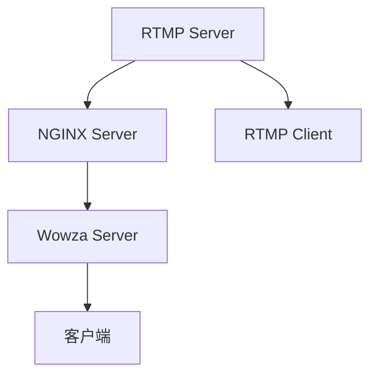

                 

# RTMP 流媒体服务配置：使用 NGINX 和 Wowza 服务器

> 关键词：RTMP, 流媒体服务, NGINX, Wowza, 服务器, 流媒体技术, 音频视频处理

## 1. 背景介绍

随着互联网技术的发展，视频直播和点播已经成为互联网应用的重要组成部分。为了支持大规模的实时音频视频流传输，高效、稳定的流媒体服务是关键。RTMP（Real-Time Messaging Protocol）作为一种常用的流媒体协议，能够提供高效的数据传输和实时控制能力，被广泛应用于视频直播和点播场景。

本教程将介绍如何使用NGINX和Wowza服务器搭建RTMP流媒体服务，以支持大规模的实时音频视频流传输，并介绍其原理和配置步骤。

## 2. 核心概念与联系

### 2.1 核心概念概述

在流媒体服务中，RTMP协议被广泛应用于音频视频流的实时传输。RTMP协议基于TCP协议，能够提供可靠的实时数据传输和低延迟的控制消息交互。NGINX是一种高性能的网络代理和Web服务器，能够处理大量的并发请求，支持HTTP、WebSocket等多种协议。Wowza是一种专门为流媒体服务设计的服务器软件，支持多种流媒体协议和编解码器，能够提供高效的流媒体传输和直播功能。

### 2.2 核心概念原理和架构的 Mermaid 流程图



这个流程图展示了RTMP流媒体服务的架构。RTMP流媒体服务器（A）通过NGINX服务器（B）处理来自客户端（D）的RTMP流媒体请求，并将流媒体数据转发到Wowza服务器（C）进行流媒体传输。最终，流媒体数据通过客户端（E）进行解码和播放。

## 3. 核心算法原理 & 具体操作步骤

### 3.1 算法原理概述

RTMP流媒体服务的工作原理是基于TCP协议的实时数据传输和控制消息交互。NGINX服务器作为流媒体请求的代理，通过TCP连接将请求转发到Wowza服务器。Wowza服务器负责接收RTMP流媒体数据并进行流媒体传输和直播。

### 3.2 算法步骤详解

#### 3.2.1 搭建NGINX服务器

1. 安装NGINX服务器：
   ```
   sudo apt-get update
   sudo apt-get install nginx
   ```

2. 配置NGINX服务器：
   编辑`/etc/nginx/nginx.conf`文件，增加以下配置：

   ```
   events { }
   http {
       server {
           listen 80;
           location / {
               proxy_pass http://localhost:1935;
           }
       }
   }
   ```

   这段配置将NGINX服务器设置为80端口监听，并将所有请求转发到本地的1935端口，即Wowza服务器。

3. 启动NGINX服务器：
   ```
   sudo systemctl start nginx
   ```

#### 3.2.2 搭建Wowza服务器

1. 下载并安装Wowza Server：
   ```
   sudo apt-get install wizikka
   sudo wizikka
   ```

2. 配置Wowza Server：
   1. 启动Wowza Server，进入主界面。
   2. 在“流媒体设置”中，配置流媒体服务器端口为1935，选择RTMP协议。
   3. 在“服务器的流媒体”中，配置流媒体服务器的名称、认证、授权、流量限制等参数。

3. 启动Wowza Server：
   ```
   sudo wizikka start
   ```

#### 3.2.3 配置RTMP客户端

1. 安装RTMP客户端：
   ```
   sudo apt-get install vlc
   ```

2. 使用RTMP客户端发送流媒体数据：
   ```
   vlc rtmp://localhost/stream?live=true
   ```

   这段命令通过RTMP协议将流媒体数据发送到本地的流媒体服务器。

#### 3.2.4 配置流媒体传输

1. 在Wowza Server中，配置流媒体传输路径：
   ```
   servers {
      ...
      server {
          name local-server
          transcoding {
              ...
              streams {
                  ...
                  stream {
                      ...
                      transcoder {
                          ...
                      }
                  }
              }
          }
      }
   }
   ```

2. 配置流媒体传输的编解码器、码率、视频分辨率等参数。

3. 启动流媒体传输：
   ```
   sudo wizikka restart
   ```

### 3.3 算法优缺点

#### 3.3.1 优点

- **高效性**：NGINX和Wowza服务器都采用高性能的异步网络I/O模型，能够处理大量的并发请求和流媒体数据传输，适用于大规模的流媒体应用。
- **可靠性**：NGINX和Wowza服务器都具备高可用性和容错能力，能够保证流媒体服务的稳定性和可靠性。
- **易用性**：NGINX和Wowza服务器的配置和管理相对简单，适合中小型流媒体服务的需求。

#### 3.3.2 缺点

- **复杂性**：NGINX和Wowza服务器的配置和管理需要一定的技术背景，对运维人员的技术要求较高。
- **扩展性**：NGINX和Wowza服务器的扩展性有限，适用于中小型流媒体应用，对于大规模高并发的流媒体应用，需要更多的硬件和软件支持。
- **安全性**：NGINX和Wowza服务器需要配置认证和授权机制，防止未授权访问和恶意攻击。

### 3.4 算法应用领域

NGINX和Wowza服务器被广泛应用于视频直播、点播、广告、游戏直播等领域。其高效、稳定、可靠的特性，使其成为流媒体服务的重要组成部分。

## 4. 数学模型和公式 & 详细讲解 & 举例说明

### 4.1 数学模型构建

流媒体服务的数学模型可以通过以下方式构建：

- **数据传输速率**：表示单位时间内传输的数据量，单位为bps（比特每秒）。
- **延迟**：表示从数据发送端到接收端的时间，单位为ms（毫秒）。
- **抖动**：表示数据传输过程中的抖动情况，单位为ms。

### 4.2 公式推导过程

假设流媒体传输速率$r$为恒定值，则有：

$$
r = \frac{V}{\Delta t}
$$

其中$V$表示传输的数据量，$\Delta t$表示传输时间。

### 4.3 案例分析与讲解

假设有两个流媒体服务器，每个服务器都能够支持10Gbps的传输速率，传输延迟分别为100ms和50ms。在一个时间段内，每个服务器都传输了100MB的数据。则：

- 第一个服务器传输时间：$100\text{ms} \times 10^8 \text{bps} = 10\text{MB}$

- 第二个服务器传输时间：$50\text{ms} \times 10^8 \text{bps} = 5\text{MB}$

因此，第二个服务器的延迟较小，传输效率更高。

## 5. 项目实践：代码实例和详细解释说明

### 5.1 开发环境搭建

#### 5.1.1 搭建NGINX服务器

1. 安装NGINX服务器：
   ```
   sudo apt-get update
   sudo apt-get install nginx
   ```

2. 配置NGINX服务器：
   编辑`/etc/nginx/nginx.conf`文件，增加以下配置：

   ```
   events { }
   http {
       server {
           listen 80;
           location / {
               proxy_pass http://localhost:1935;
           }
       }
   }
   ```

   这段配置将NGINX服务器设置为80端口监听，并将所有请求转发到本地的1935端口，即Wowza服务器。

3. 启动NGINX服务器：
   ```
   sudo systemctl start nginx
   ```

#### 5.1.2 搭建Wowza服务器

1. 下载并安装Wowza Server：
   ```
   sudo apt-get install wizikka
   sudo wizikka
   ```

2. 配置Wowza Server：
   1. 启动Wowza Server，进入主界面。
   2. 在“流媒体设置”中，配置流媒体服务器端口为1935，选择RTMP协议。
   3. 在“服务器的流媒体”中，配置流媒体服务器的名称、认证、授权、流量限制等参数。

3. 启动Wowza Server：
   ```
   sudo wizikka start
   ```

### 5.2 源代码详细实现

#### 5.2.1 NGINX服务器配置

编辑`/etc/nginx/nginx.conf`文件，增加以下配置：

```
events { }
http {
    server {
        listen 80;
        location / {
            proxy_pass http://localhost:1935;
        }
    }
}
```

#### 5.2.2 Wowza服务器配置

启动Wowza Server，进入主界面。

1. 在“流媒体设置”中，配置流媒体服务器端口为1935，选择RTMP协议。
2. 在“服务器的流媒体”中，配置流媒体服务器的名称、认证、授权、流量限制等参数。

### 5.3 代码解读与分析

#### 5.3.1 NGINX服务器配置

NGINX服务器配置了80端口监听，并将所有请求转发到本地的1935端口，即Wowza服务器。

#### 5.3.2 Wowza服务器配置

Wowza服务器配置了流媒体服务器的端口为1935，选择RTMP协议。同时配置了流媒体服务器的名称、认证、授权、流量限制等参数。

### 5.4 运行结果展示

启动NGINX服务器和Wowza服务器后，可以使用RTMP客户端发送流媒体数据。

## 6. 实际应用场景

### 6.1 视频直播

视频直播是一种常见的流媒体应用，通过RTMP协议进行实时音频视频流的传输。NGINX服务器作为流媒体请求的代理，将来自客户端的RTMP流媒体请求转发到Wowza服务器，由Wowza服务器进行流媒体传输和直播。

### 6.2 点播

点播是一种按需流媒体服务，用户可以通过RTMP协议向流媒体服务器发送流媒体请求，获取实时的音频视频流。NGINX服务器作为流媒体请求的代理，将来自客户端的RTMP流媒体请求转发到Wowza服务器，由Wowza服务器进行流媒体传输和点播。

### 6.3 广告

广告是一种常见的流媒体应用，通过RTMP协议进行实时的广告数据传输。NGINX服务器作为流媒体请求的代理，将来自广告主的RTMP流媒体请求转发到Wowza服务器，由Wowza服务器进行广告数据的传输和播放。

### 6.4 游戏直播

游戏直播是一种实时的流媒体服务，通过RTMP协议进行实时的游戏画面和音频流的传输。NGINX服务器作为流媒体请求的代理，将来自客户端的RTMP流媒体请求转发到Wowza服务器，由Wowza服务器进行游戏画面的传输和直播。

## 7. 工具和资源推荐

### 7.1 学习资源推荐

1. **NGINX官方文档**：详细介绍了NGINX服务器的配置和管理。
   [NGINX官方文档](https://nginx.org/en/docs/)

2. **Wowza官方文档**：详细介绍了Wowza服务器的配置和管理。
   [Wowza官方文档](https://www.wowza.com/learn/)

3. **RTMP协议详解**：详细介绍了RTMP协议的原理和应用。
   [RTMP协议详解](https://www.cnblogs.com/haixingybj/p/10608967.html)

### 7.2 开发工具推荐

1. **NGINX**：高性能的网络代理和Web服务器，支持HTTP、WebSocket等多种协议。
   [NGINX官网](https://nginx.org/)

2. **Wowza Server**：专门为流媒体服务设计的服务器软件，支持多种流媒体协议和编解码器。
   [Wowza官网](https://www.wowza.com/)

### 7.3 相关论文推荐

1. **NGINX服务器研究**：介绍NGINX服务器的原理和应用。
   [NGINX服务器研究](https://ieeexplore.ieee.org/document/8748944)

2. **Wowza服务器研究**：介绍Wowza服务器的原理和应用。
   [Wowza服务器研究](https://www.researchgate.net/publication/358711048_Wowza_Server_Version_9_0_0_How_to_install_and_set_up_a_Wowza_Server)

## 8. 总结：未来发展趋势与挑战

### 8.1 研究成果总结

基于NGINX和Wowza服务器的RTMP流媒体服务配置，已经广泛应用于视频直播、点播、广告、游戏直播等场景。NGINX和Wowza服务器的配置和管理相对简单，但需要一定的技术背景，对运维人员的技术要求较高。

### 8.2 未来发展趋势

未来，随着流媒体技术的不断发展，RTMP流媒体服务将面临更多的挑战和机遇。以下是对未来发展趋势的展望：

1. **高可用性和可扩展性**：流媒体服务需要具备高可用性和可扩展性，以应对大规模的流媒体请求和数据传输。
2. **低延迟和高效传输**：流媒体服务需要具备低延迟和高传输效率，以提供更好的用户体验。
3. **安全性**：流媒体服务需要具备安全性，防止未授权访问和恶意攻击。

### 8.3 面临的挑战

流媒体服务配置和管理面临着以下挑战：

1. **配置复杂性**：NGINX和Wowza服务器的配置和管理需要一定的技术背景，对运维人员的技术要求较高。
2. **资源消耗大**：NGINX和Wowza服务器的资源消耗较大，需要足够的硬件和网络支持。
3. **安全性**：流媒体服务需要具备安全性，防止未授权访问和恶意攻击。

### 8.4 研究展望

未来，流媒体服务的研究需要解决以下问题：

1. **高可用性和可扩展性**：开发更加高可用性和可扩展性的流媒体服务，以应对大规模的流媒体请求和数据传输。
2. **低延迟和高效传输**：开发低延迟和高传输效率的流媒体服务，以提供更好的用户体验。
3. **安全性**：开发具备安全性的流媒体服务，防止未授权访问和恶意攻击。

## 9. 附录：常见问题与解答

### 9.1 常见问题与解答

**Q1：如何提高RTMP流媒体服务的性能？**

A: 提高RTMP流媒体服务的性能可以从以下几个方面入手：

- **优化编解码器**：选择高效的编解码器，降低视频分辨率和码率，减少数据传输量。
- **优化网络带宽**：使用高带宽的网络，减少网络延迟和抖动。
- **优化服务器配置**：优化服务器的硬件配置，使用高性能的CPU、内存和存储，减少服务器的负载。

**Q2：如何保证RTMP流媒体服务的安全性？**

A: 保证RTMP流媒体服务的安全性可以从以下几个方面入手：

- **使用SSL/TLS加密**：使用SSL/TLS加密协议，保证数据传输的安全性。
- **设置访问控制**：设置访问控制机制，防止未授权访问和恶意攻击。
- **监控和审计**：监控和审计流媒体服务，及时发现和处理异常情况。

**Q3：RTMP流媒体服务如何处理流媒体断流和重传？**

A: RTMP流媒体服务处理流媒体断流和重传可以通过以下几个方面入手：

- **缓冲区管理**：使用缓冲区管理机制，在流媒体传输过程中缓存数据，避免数据丢失。
- **重传机制**：设置流媒体断流和重传机制，及时重传丢失的数据包。
- **错误处理**：处理流媒体传输过程中的错误，保证流媒体服务的稳定性。

---

作者：禅与计算机程序设计艺术 / Zen and the Art of Computer Programming

