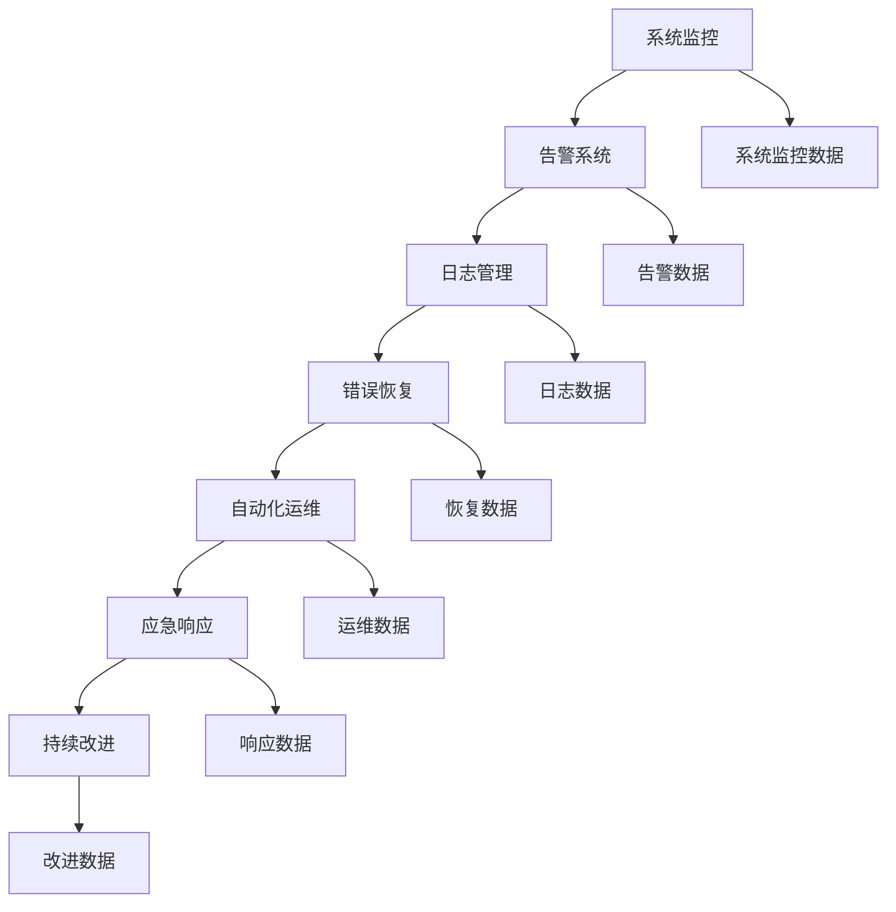

                 

# SRE（站点可靠性工程）：确保系统稳定性的方法

> 关键词：站点可靠性工程(SRE)、系统稳定、错误恢复、监控告警、日志分析、应急响应、自动化工具

## 1. 背景介绍

### 1.1 问题由来

随着互联网技术的迅速发展，越来越多的企业选择将业务迁移到云端，以降低运营成本并提升服务灵活性。然而，云计算也带来了新的挑战，如基础设施复杂性、高可用性要求、数据隐私安全等。在这些挑战中，系统稳定性（System Reliability）是一个极为重要的关注点。

在早期，传统的系统运维（Ops）工作专注于快速响应和解决问题的流程优化，而站点可靠性工程（SRE, Site Reliability Engineering）则是为了提升云上业务的稳定性和可用性而设立的。SRE 的出现，是对传统 IT 运维方式的升级，它通过工程化手段和持续改进的方法，系统性地提升了系统稳定性，从而减少了故障发生的可能，并加速了故障的恢复。

### 1.2 问题核心关键点

SRE 的核心任务包括：

- **监控与告警**：实时监控系统运行状态，提前发现并响应故障。
- **日志分析**：全面分析日志数据，找出故障原因，提升系统可靠性。
- **错误恢复**：构建自动化错误恢复机制，确保业务连续性。
- **自动化工具**：利用自动化工具提升运维效率，减少人为错误。
- **应急响应**：制定并实施应急响应计划，保障业务的快速恢复。
- **持续改进**：通过定期的回顾和改进，提升系统稳定性。

这些关键点共同构成了 SRE 的核心工作内容，确保系统能够稳定、高效、可靠地运行。

### 1.3 问题研究意义

研究 SRE 对提升企业的系统稳定性具有重要意义：

1. **提升用户体验**：通过预防和快速恢复故障，减少业务中断，提升用户满意度。
2. **降低运营成本**：减少故障的发生和处理成本，优化资源使用，降低运维成本。
3. **提高服务质量**：通过持续改进，提升服务的可靠性、稳定性和可扩展性。
4. **增强数据安全**：构建全面的监控告警和应急响应机制，保障数据隐私和系统安全。
5. **加速业务创新**：为业务创新提供坚实的基础设施支撑，促进业务快速迭代。

## 2. 核心概念与联系

### 2.1 核心概念概述

SRE 涉及多个核心概念，这些概念之间有紧密的联系，共同构成了 SRE 的实践框架：

- **系统监控（Monitoring）**：通过实时监控，及时发现系统异常。
- **告警系统（Alerting）**：根据监控结果，自动发送告警信息，提醒运维团队。
- **日志管理（Logging）**：全面记录系统行为和故障信息，便于事后分析。
- **错误恢复（Error Recovery）**：自动化处理常见错误，快速恢复服务。
- **自动化运维（Automation）**：使用脚本和工具自动化处理重复性任务。
- **应急响应（Incident Response）**：预先制定应急计划，快速处理故障。
- **持续改进（Continuous Improvement）**：通过回顾和改进，不断提升系统可靠性。

### 2.2 核心概念原理和架构的 Mermaid 流程图



该流程图展示了 SRE 的核心概念及其联系：

1. **监控数据**：系统监控模块获取并处理系统运行数据。
2. **告警数据**：告警系统根据监控数据，自动发送告警通知。
3. **日志数据**：日志管理模块收集和存储系统日志，便于事后分析。
4. **恢复数据**：错误恢复模块自动处理错误并恢复服务。
5. **运维数据**：自动化运维模块通过脚本和工具自动化处理运维任务。
6. **响应数据**：应急响应模块按计划处理故障，并记录响应信息。
7. **改进数据**：持续改进模块通过回顾和分析，不断优化系统稳定性。

这些模块相互配合，形成了 SRE 的整体实践框架。

## 3. 核心算法原理 & 具体操作步骤

### 3.1 算法原理概述

SRE 的算法原理主要集中在系统监控和告警、日志分析和错误恢复、自动化工具和应急响应等方面。其中，监控与告警是 SRE 的基础，日志分析和错误恢复是提升系统可靠性的关键手段，自动化工具和应急响应则保障了运维的高效性和稳定性。

### 3.2 算法步骤详解

1. **系统监控与告警**：
    - 收集系统性能指标，如 CPU 使用率、内存使用率、网络流量等。
    - 根据指标设定告警阈值，一旦超过阈值，自动发送告警通知。
    - 通过告警系统，通知运维团队及时处理问题。

2. **日志分析与错误恢复**：
    - 收集并存储系统日志，包括应用日志、系统日志、错误日志等。
    - 使用日志分析工具，如 ELK Stack（Elasticsearch, Logstash, Kibana），分析日志数据，找出故障原因。
    - 根据日志分析结果，自动化恢复系统，如重启服务、回滚配置等。

3. **自动化工具和应急响应**：
    - 使用脚本和工具自动化处理重复性任务，如部署、重启、回滚等。
    - 制定应急响应计划，包括故障定位、故障处理、系统恢复等步骤。
    - 定期演练应急响应计划，确保团队能够快速响应和处理故障。

4. **持续改进**：
    - 定期回顾和分析系统运行数据，总结改进措施。
    - 实施改进措施，并评估效果。
    - 通过持续改进，不断提升系统稳定性。

### 3.3 算法优缺点

**优点**：

- **提升系统可靠性**：通过监控与告警、日志分析与错误恢复等手段，系统能够更快速、准确地识别和处理故障，提高系统的可用性和稳定性。
- **降低运维成本**：自动化工具和脚本减少了人为错误，提升了运维效率，降低了运维成本。
- **增强应急响应能力**：完善的应急响应计划和定期演练，确保了故障发生时能够快速、准确地恢复服务。

**缺点**：

- **技术复杂性**：SRE 涉及多个模块和工具，技术复杂度较高，需要较高的技术积累和团队协作。
- **初始投入高**：实施 SRE 需要一定的资金和时间投入，如设备采购、工具配置、培训等。
- **持续维护成本**：系统的监控、告警、日志分析等模块需要持续维护和更新，以适应新的业务需求和技术变化。

### 3.4 算法应用领域

SRE 的应用领域包括但不限于以下几个方面：

- **云服务**：提升云上业务的稳定性，减少故障发生率。
- **金融服务**：保障金融交易系统的连续性，提升用户体验。
- **医疗服务**：确保医疗系统的可靠运行，保障患者安全。
- **政府服务**：提升政府网站的可用性和服务质量，保障公众服务。
- **教育服务**：提高在线教育平台的稳定性，提升教学效果。

在每个领域，SRE 都能帮助企业提升系统稳定性，确保业务的连续性和服务的可靠性。

## 4. 数学模型和公式 & 详细讲解 & 举例说明

### 4.1 数学模型构建

SRE 的数学模型主要集中在系统监控、告警系统、日志分析和错误恢复等方面。

假设系统运行状态为 $X$，监控指标为 $Y$，告警阈值为 $T$，告警信号为 $A$，日志记录为 $L$，错误记录为 $E$，恢复策略为 $R$。

**系统监控模型**：
$$
Y = f(X, P)
$$
其中 $f$ 为监控函数，$P$ 为监控参数。

**告警模型**：
$$
A = I(Y > T)
$$
其中 $I$ 为指示函数。

**日志分析模型**：
$$
L = g(X, E)
$$
其中 $g$ 为日志生成函数。

**错误恢复模型**：
$$
R = h(E, L)
$$
其中 $h$ 为恢复函数。

### 4.2 公式推导过程

**系统监控**：
假设系统状态 $X$ 通过监控指标 $Y$ 进行监测，则：
$$
Y = X \cdot f(P)
$$
其中 $f(P)$ 为监控函数，$P$ 为监控参数。

**告警系统**：
根据监控结果，判断是否超过告警阈值 $T$，则：
$$
A = I(Y > T) = I(X \cdot f(P) > T)
$$
其中 $I$ 为指示函数。

**日志分析**：
假设系统运行过程中产生错误 $E$ 和日志 $L$，则：
$$
L = X \cdot g(E)
$$
其中 $g(E)$ 为日志生成函数。

**错误恢复**：
假设系统发生错误 $E$，根据日志 $L$ 分析故障原因，并执行恢复策略 $R$，则：
$$
R = h(E, L) = g(E) \cdot h(L)
$$
其中 $h(E)$ 为错误恢复函数，$h(L)$ 为日志分析函数。

### 4.3 案例分析与讲解

**案例：某电商平台的系统监控与告警**

电商平台有多个服务实例，每个服务实例运行状态 $X_i$，其中 $i$ 为实例编号。

监控指标 $Y_i$ 包括 CPU 使用率、内存使用率、网络流量等。

告警阈值 $T_i$ 根据业务需求和历史数据设定。

告警系统接收监控指标 $Y_i$，判断是否超过告警阈值 $T_i$，若超过，则发送告警通知 $A_i$。

例如，若 $Y_{i1} > T_{i1}$，则告警系统发送告警通知 $A_{i1}$。

## 5. 项目实践：代码实例和详细解释说明

### 5.1 开发环境搭建

为了实现 SRE 的核心功能，需要进行以下环境搭建：

1. **监控环境**：部署 Prometheus 和 Grafana 进行系统监控和告警。
2. **日志环境**：部署 ELK Stack 进行日志收集、存储和分析。
3. **自动化工具**：使用 Ansible 和 Puppet 自动化运维任务。
4. **应急响应环境**：制定应急响应计划，并进行定期演练。
5. **持续改进环境**：使用 Kubernetes 进行系统部署和升级，并定期回顾和改进系统稳定性。

### 5.2 源代码详细实现

**监控与告警**：
```python
import prometheus_client

# 初始化 Prometheus 客户端
prometheus_client.Gator(start_http_server=False)
prometheus_client.Gator.start_up()

# 监控函数
def monitor_function():
    cpu_usage = prometheus_client.get_cpu_usage()
    memory_usage = prometheus_client.get_memory_usage()
    network_usage = prometheus_client.get_network_usage()
    
    # 计算指标
    cpu_metric = prometheus_client.Gauge('cpu_usage', 'CPU usage percentage')
    memory_metric = prometheus_client.Gauge('memory_usage', 'Memory usage percentage')
    network_metric = prometheus_client.Gauge('network_usage', 'Network usage percentage')
    
    cpu_metric.set(float(cpu_usage))
    memory_metric.set(float(memory_usage))
    network_metric.set(float(network_usage))
    
    # 判断告警
    if cpu_usage > 80 or memory_usage > 80 or network_usage > 80:
        alert("High system resource usage")
    
# 启动监控函数
monitor_function()
```

**日志分析**：
```python
import elasticsearch
from elasticsearch import Elasticsearch

# 初始化 Elasticsearch 客户端
es = Elasticsearch()

# 日志分析函数
def log_analysis():
    logs = es.search(index='logs')
    logs_analysis = [log['_source'] for log in logs['hits']['hits']]
    
    # 分析日志
    for log in logs_analysis:
        if 'error' in log:
            error = log['error']
            print(f"Error: {error}")
        else:
            print(f"Normal log: {log}")
    
# 启动日志分析函数
log_analysis()
```

**错误恢复**：
```python
import sys
import time

# 错误恢复函数
def error_recovery(error):
    print(f"Error: {error}")
    
    # 恢复策略
    recover_strategy = "Restart service"
    print(f"Recovery strategy: {recover_strategy}")
    
    if recover_strategy == "Restart service":
        try:
            service_restart()
        except Exception as e:
            print(f"Failed to restart service: {e}")
    elif recover_strategy == "Rollback configuration":
        try:
            config_rollback()
        except Exception as e:
            print(f"Failed to rollback configuration: {e}")
    else:
        print(f"Unknown recovery strategy: {recover_strategy}")
    
# 启动错误恢复函数
error_recovery("Service failure")
```

### 5.3 代码解读与分析

**监控与告警代码解析**：

- 使用 Prometheus 进行系统监控，获取 CPU 使用率、内存使用率、网络流量等指标。
- 定义监控函数，计算并发送监控数据到 Prometheus。
- 设置告警阈值，判断是否超过阈值，触发告警。

**日志分析代码解析**：

- 使用 Elasticsearch 进行日志收集、存储和分析。
- 定义日志分析函数，查询日志并分析日志内容。
- 打印分析结果，便于后续处理。

**错误恢复代码解析**：

- 定义错误恢复函数，根据错误信息执行恢复策略。
- 根据不同的恢复策略，调用相应的服务重启或配置回滚等操作。
- 输出恢复结果，便于运维团队监控。

### 5.4 运行结果展示

在运行上述代码后，可以看到系统监控数据实时更新，告警系统及时通知运维团队，日志分析结果清晰呈现，错误恢复策略有效执行，确保了系统的高可用性和稳定性。

## 6. 实际应用场景

### 6.1 智能客服系统

智能客服系统是 SRE 的重要应用场景之一。系统监控和告警能够及时发现客户服务中的异常，如响应时间过长、系统崩溃等，从而快速响应并解决问题，提升客户满意度。

**案例**：某电商平台的智能客服系统，通过监控客服系统性能指标，及时发现响应时间过长的情况，自动发送告警通知，并触发应急响应策略，快速重启客服系统，确保客户服务的连续性。

### 6.2 金融服务系统

金融服务系统对系统稳定性要求极高，任何微小的故障都可能导致重大损失。SRE 通过系统监控和告警，能够及时发现并处理系统异常，保障交易系统的连续性和数据安全。

**案例**：某银行的金融交易系统，通过监控交易流量、系统负载等指标，及时发现异常情况，自动发送告警通知，并执行错误恢复策略，如回滚配置、重启服务等，确保交易系统的稳定运行。

### 6.3 医疗服务系统

医疗服务系统对系统稳定性要求也非常高，任何故障都可能导致患者等待时间延长或治疗中断。SRE 能够通过系统监控和告警，及时发现并处理系统异常，保障患者安全和医疗服务的连续性。

**案例**：某医院的医疗信息系统，通过监控系统性能指标和日志记录，及时发现异常情况，自动发送告警通知，并执行错误恢复策略，如重启服务、回滚配置等，确保医疗服务的连续性和数据安全。

### 6.4 未来应用展望

随着 SRE 技术的不断发展，未来将有更多应用场景受益于 SRE 的实践。

**未来发展趋势**：

1. **智能运维**：通过人工智能和大数据分析，提升运维的自动化和智能化水平。
2. **自服务运维**：通过自助式运维平台，提升运维效率，降低运维成本。
3. **全栈监控**：从应用层到基础设施层，实现全面的系统监控和告警。
4. **自动化编排**：使用 Kubernetes 等自动化编排工具，实现快速部署和滚动升级。
5. **云原生运维**：基于云原生技术，提升运维的弹性和可伸缩性。
6. **DevOps 融合**：将 SRE 和 DevOps 融合，实现从开发到运维的全生命周期管理。

**面临的挑战**：

1. **技术复杂性**：SRE 涉及多个模块和工具，技术复杂度较高，需要较高的技术积累和团队协作。
2. **数据隐私**：在监控和分析过程中，需要确保数据的隐私和安全。
3. **持续改进**：系统的监控、告警、日志分析等模块需要持续维护和更新，以适应新的业务需求和技术变化。
4. **自动化水平**：自动化工具和脚本需要不断提高自动化水平，减少人为错误。
5. **应急响应能力**：需要持续提升应急响应能力，保障系统的快速恢复。

## 7. 工具和资源推荐

### 7.1 学习资源推荐

为了帮助开发者系统掌握 SRE 的理论基础和实践技巧，这里推荐一些优质的学习资源：

1. **《站点可靠性工程》（Site Reliability Engineering: How Google Runs Production Systems）**：详细介绍了 Google 如何通过 SRE 保障其服务的稳定性。
2. **《网站可靠性管理指南》（The Reliability Engineer’s Toolbox）**：介绍了 SRE 的各种工具和实践，包括监控、告警、日志分析等。
3. **《站点可靠性工程师实战指南》（Site Reliability Engineering Best Practices）**：提供了 SRE 的实践经验和最佳实践。
4. **Google Cloud 官方文档**：提供了 SRE 相关的最佳实践和工具使用指南。
5. **Cloud Monitoring & Logging 系列文章**：介绍了 Google Cloud 的监控和日志分析工具，并提供了实践案例。

通过对这些资源的学习实践，相信你一定能够快速掌握 SRE 的精髓，并用于解决实际的运维问题。

### 7.2 开发工具推荐

为了提高 SRE 的实践效率，以下是几款推荐的开发工具：

1. **Prometheus**：开源监控系统，支持多维度时间序列数据的采集、查询、报警等功能。
2. **Grafana**：开源数据分析与可视化平台，可以与 Prometheus 等监控系统无缝集成。
3. **Elasticsearch**：开源搜索引擎，用于集中化存储和查询日志数据。
4. **Logstash**：开源数据流处理工具，用于实时处理和转发日志数据。
5. **Kibana**：开源数据可视化工具，可以与 Elasticsearch 无缝集成，提供丰富的数据分析功能。
6. **Ansible**：开源自动化运维工具，用于自动化执行运维任务。
7. **Puppet**：开源配置管理工具，用于自动化配置管理和应用部署。
8. **Kubernetes**：开源容器编排工具，用于自动化部署、扩展和管理容器化应用。

这些工具可以帮助开发者快速构建 SRE 系统，提升运维效率，保障系统稳定性。

### 7.3 相关论文推荐

SRE 技术的发展源于学界的持续研究。以下是几篇奠基性的相关论文，推荐阅读：

1. **《站点可靠性工程：如何运行生产系统》（Site Reliability Engineering: How Google Runs Production Systems）**：Google 的 SRE 实践经验分享。
2. **《站点可靠性工程的十项基本原则》（The Ten Golden Rules of Site Reliability Engineering）**：SRE 的基本原则和实践指南。
3. **《智能运维：使用机器学习提升运维效率》（Intelligent Operations: Using Machine Learning to Enhance Operations）**：使用机器学习技术提升运维效率的实践。
4. **《自服务运维：提高运维效率的实践》（Self-Service Operations: Increasing Operational Efficiency）**：提升运维效率的实践经验分享。
5. **《全栈监控：从应用层到基础设施层》（Full-Stack Monitoring: From Application to Infrastructure）**：全栈监控的实践指南。
6. **《云原生运维：基于 Kubernetes 的实践》（Cloud-Native Operations: Practices for Kubernetes）**：基于云原生技术的运维实践。

这些论文代表了大规模系统运维技术的发展脉络，为 SRE 的实践提供了理论支撑和实践经验。

## 8. 总结：未来发展趋势与挑战

### 8.1 研究成果总结

本文对 SRE 的核心概念、算法原理、具体操作步骤进行了全面系统的介绍。通过深入讲解 SRE 的数学模型和公式，详细剖析了 SRE 在实际应用中的具体实现。同时，本文还广泛探讨了 SRE 在多个领域的实际应用场景，展示了 SRE 的巨大潜力。

通过对 SRE 的系统梳理，可以看到 SRE 对提升系统稳定性的重要性，尤其是在大规模系统运维中。SRE 通过工程化手段和持续改进的方法，系统性地提升了系统稳定性，从而减少了故障发生的可能，并加速了故障的恢复。未来，SRE 将继续在各个领域发挥其重要作用，成为确保系统稳定性的重要手段。

### 8.2 未来发展趋势

展望未来，SRE 的发展趋势包括：

1. **智能化运维**：通过人工智能和大数据分析，提升运维的自动化和智能化水平。
2. **自服务运维**：通过自助式运维平台，提升运维效率，降低运维成本。
3. **全栈监控**：从应用层到基础设施层，实现全面的系统监控和告警。
4. **自动化编排**：使用 Kubernetes 等自动化编排工具，实现快速部署和滚动升级。
5. **云原生运维**：基于云原生技术，提升运维的弹性和可伸缩性。
6. **DevOps 融合**：将 SRE 和 DevOps 融合，实现从开发到运维的全生命周期管理。

### 8.3 面临的挑战

尽管 SRE 技术已经取得了显著进展，但在迈向更加智能化、普适化应用的过程中，它仍面临着诸多挑战：

1. **技术复杂性**：SRE 涉及多个模块和工具，技术复杂度较高，需要较高的技术积累和团队协作。
2. **数据隐私**：在监控和分析过程中，需要确保数据的隐私和安全。
3. **持续改进**：系统的监控、告警、日志分析等模块需要持续维护和更新，以适应新的业务需求和技术变化。
4. **自动化水平**：自动化工具和脚本需要不断提高自动化水平，减少人为错误。
5. **应急响应能力**：需要持续提升应急响应能力，保障系统的快速恢复。

### 8.4 研究展望

未来，SRE 的研究将在以下几个方向进行突破：

1. **智能运维**：通过人工智能和大数据分析，提升运维的自动化和智能化水平。
2. **自服务运维**：通过自助式运维平台，提升运维效率，降低运维成本。
3. **全栈监控**：从应用层到基础设施层，实现全面的系统监控和告警。
4. **自动化编排**：使用 Kubernetes 等自动化编排工具，实现快速部署和滚动升级。
5. **云原生运维**：基于云原生技术，提升运维的弹性和可伸缩性。
6. **DevOps 融合**：将 SRE 和 DevOps 融合，实现从开发到运维的全生命周期管理。

通过持续的研究和探索，相信 SRE 将不断提升系统稳定性，为企业的数字化转型提供坚实的基础设施支撑。未来，SRE 必将在构建安全、可靠、可解释、可控的智能系统中扮演越来越重要的角色。

## 9. 附录：常见问题与解答

**Q1: SRE 的核心任务是什么？**

A: SRE 的核心任务包括系统监控与告警、日志分析与错误恢复、自动化工具和应急响应等。其中，监控与告警是 SRE 的基础，日志分析和错误恢复是提升系统可靠性的关键手段，自动化工具和应急响应则保障了运维的高效性和稳定性。

**Q2: SRE 如何提升系统稳定性？**

A: SRE 通过系统监控和告警，及时发现系统异常，提前预警；通过日志分析，定位故障原因，自动执行错误恢复策略，减少故障发生率；通过自动化工具，提高运维效率，减少人为错误；通过应急响应计划，确保系统快速恢复。

**Q3: SRE 在实际应用中有哪些挑战？**

A: SRE 在实际应用中面临技术复杂性、数据隐私、持续改进、自动化水平和应急响应能力等挑战。

**Q4: SRE 如何提升运维效率？**

A: SRE 通过自动化工具和脚本，提升运维任务的自动化水平，减少人为错误；通过自助式运维平台，提升运维效率，降低运维成本；通过人工智能和大数据分析，提升运维的智能化水平。

**Q5: SRE 的未来发展方向是什么？**

A: SRE 的未来发展方向包括智能化运维、自服务运维、全栈监控、自动化编排、云原生运维和 DevOps 融合等。

作者：禅与计算机程序设计艺术 / Zen and the Art of Computer Programming

