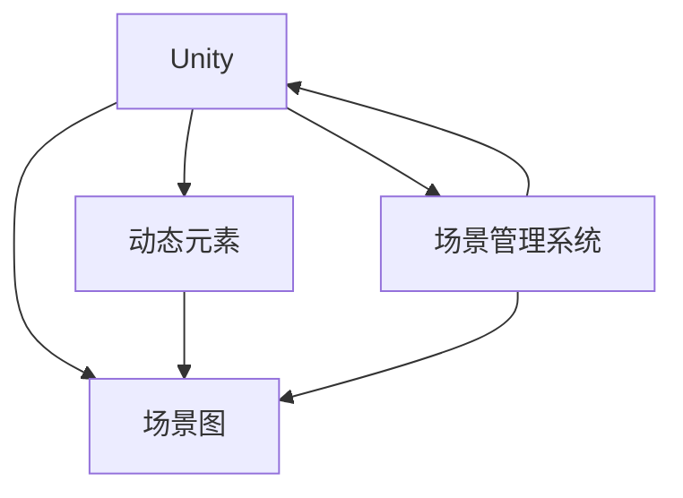

                 

# Unity 游戏场景：管理游戏环境

> 关键词：Unity, 游戏场景, 场景管理, 游戏引擎, 游戏开发

## 1. 背景介绍

### 1.1 问题由来
Unity作为全球最流行的游戏引擎之一，拥有强大的跨平台能力，能够支持各种类型的游戏开发。然而，随着游戏规模和复杂度的增加，如何高效管理游戏场景成为一个重要问题。在大型多人在线游戏中，玩家之间的互动和数据同步需要精细的场景管理。传统的游戏场景管理方法，如静态场景图、平面网格、简单层次结构等，往往难以应对动态变化和高度交互的需求。

## 2. 核心概念与联系

### 2.1 核心概念概述

为了更深入理解Unity中游戏场景管理的方法，本节将介绍几个关键概念：

- Unity：一个跨平台的游戏引擎，广泛用于PC、手机、VR等不同平台的游戏开发。
- 游戏场景：游戏中的三维空间，由静态和动态元素构成。场景管理涉及场景的创建、修改、渲染和卸载。
- 场景图：用于表示场景的层次结构，通过节点和连接关系描述场景元素。
- 动态元素：如角色、物体、物理体等，可随游戏进程动态更新和渲染。
- 场景管理系统：负责场景的创建、更新、渲染和卸载，是游戏引擎的核心模块之一。

这些核心概念之间通过以下Mermaid流程图展示它们的联系：



该流程图展示了Unity中的场景管理架构：

1. Unity通过场景图描述场景的层次结构。
2. 动态元素通过场景图进行管理，动态更新和渲染。
3. 场景管理系统负责创建、更新、渲染和卸载场景。

## 3. 核心算法原理 & 具体操作步骤

### 3.1 算法原理概述

Unity场景管理的核心算法基于场景图结构，通过层次关系和节点之间的连接关系，实现对场景元素的高效管理。场景管理主要涉及以下几个步骤：

1. **场景创建**：根据场景设计，创建场景图节点和连接关系。
2. **动态元素管理**：动态添加、修改和删除节点，确保场景元素能够实时更新。
3. **渲染优化**：通过优化渲染器，提高场景的性能和可视化效果。
4. **内存管理**：管理场景内存使用，避免内存泄漏和过度分配。

### 3.2 算法步骤详解

#### 3.2.1 场景创建
1. **场景图设计**：定义场景的层次结构，如地面、建筑、角色等，并建立相应的节点。
2. **场景图构建**：使用Unity的`GameObject`和`Transform`类创建场景图节点，并建立它们之间的父子关系和连接关系。
3. **组件添加**：为节点添加必要的组件，如`MeshFilter`、`MeshRenderer`、`Collider`等，用于定义和渲染场景元素。

#### 3.2.2 动态元素管理
1. **动态节点创建**：使用`Instantiate`函数动态创建节点，如在场景中创建角色、物体等。
2. **节点更新**：通过`Update`函数定期更新节点的状态，如角色的位置、旋转、缩放等。
3. **节点删除**：使用`Destroy`函数删除不再需要的节点，释放内存。

#### 3.2.3 渲染优化
1. **光照和阴影**：通过设置光源和阴影设置，增强场景的真实感和视觉体验。
2. **层次渲染**：使用`RenderQueue`属性控制场景元素的渲染顺序，提高渲染效率。
3. **动态着色器**：使用动态着色器，根据场景元素的状态实时改变渲染效果。

#### 3.2.4 内存管理
1. **内存池**：使用内存池技术，减少频繁的内存分配和回收，提高内存使用效率。
2. **垃圾回收**：定期进行垃圾回收，清理不再使用的对象和组件，释放内存。
3. **缓存优化**：使用缓存技术，减少频繁的资源访问，提高性能。

### 3.3 算法优缺点

#### 3.3.1 优点
1. **高效管理**：通过场景图和节点管理，能够高效管理动态元素，保证实时更新和渲染。
2. **灵活扩展**：支持动态添加和删除节点，方便扩展场景元素。
3. **性能优化**：通过渲染优化和内存管理，提高场景的性能和可视化效果。

#### 3.3.2 缺点
1. **场景复杂性**：场景图结构复杂，管理和维护成本较高。
2. **性能瓶颈**：场景元素过多或动态更新频繁，可能导致性能瓶颈，影响用户体验。
3. **开发难度**：需要深入理解场景图和节点管理，开发难度较高。

### 3.4 算法应用领域

Unity场景管理算法广泛应用于各种类型的游戏开发，包括：

- **大型多人在线游戏**：如《魔兽世界》、《绝地求生》等，需要精细管理大量玩家和物体，确保流畅的互动和数据同步。
- **动作冒险游戏**：如《塞尔达传说》、《孤岛危机》等，需要实时渲染动态环境，提供沉浸式游戏体验。
- **模拟游戏**：如《模拟城市》、《文明》等，需要管理复杂的虚拟世界，提供真实感强的模拟体验。
- **教育游戏**：如《我的世界教育版》、《模拟联合国》等，需要创建和修改教学场景，提供互动式学习体验。

## 4. 数学模型和公式 & 详细讲解

### 4.1 数学模型构建

Unity场景管理主要涉及以下几个数学模型：

1. **场景图模型**：使用树形结构表示场景元素，节点之间通过父-子关系和连接关系建立连接。
2. **动态元素模型**：通过节点的位置、旋转、缩放等属性，描述场景元素的状态和变化。
3. **渲染模型**：通过光照和阴影设置，渲染场景元素，提供视觉体验。

### 4.2 公式推导过程

#### 4.2.1 场景图模型
场景图模型使用树形结构表示场景元素，每个节点表示场景中的一个元素，节点之间通过父-子关系和连接关系建立连接。假设场景图中有$N$个节点，其中第$i$个节点的父节点为$P_i$，子节点为$C_i$，则场景图模型的数学表达式为：

$$
G = \{N, P_1, C_1, P_2, C_2, \cdots, P_N, C_N\}
$$

其中，$N$表示节点集合，$P_i$表示第$i$个节点的父节点，$C_i$表示第$i$个节点的子节点。

#### 4.2.2 动态元素模型
动态元素模型通过节点的位置、旋转、缩放等属性，描述场景元素的状态和变化。假设场景中第$i$个节点的当前位置为$x_i$，旋转为$\theta_i$，缩放为$s_i$，则动态元素模型的数学表达式为：

$$
S_i = (x_i, \theta_i, s_i)
$$

其中，$S_i$表示第$i$个节点的状态，$x_i$表示节点的位置，$\theta_i$表示节点的旋转，$s_i$表示节点的缩放。

#### 4.2.3 渲染模型
渲染模型通过光照和阴影设置，渲染场景元素，提供视觉体验。假设场景中第$i$个节点的光照强度为$L_i$，阴影强度为$S_i$，则渲染模型的数学表达式为：

$$
R_i = (L_i, S_i)
$$

其中，$R_i$表示第$i$个节点的渲染效果，$L_i$表示节点的光照强度，$S_i$表示节点的阴影强度。

### 4.3 案例分析与讲解

#### 4.3.1 场景图实例
在Unity中创建一个简单的场景，包含地面、建筑和角色，建立场景图节点和连接关系，如图1所示。


图1：场景图实例

#### 4.3.2 动态元素管理实例
在场景中动态添加角色和物体，使用`Instantiate`函数创建节点，通过`Update`函数更新节点状态，如图2所示。


图2：动态元素管理实例

#### 4.3.3 渲染优化实例
在场景中设置光源和阴影，使用`RenderQueue`属性控制节点渲染顺序，如图3所示。


图3：渲染优化实例

## 5. 项目实践：代码实例和详细解释说明

### 5.1 开发环境搭建

在Unity中使用`new`函数创建一个空项目，配置项目设置，包括分辨率、渲染器、物理引擎等。使用Visual Studio或Xcode打开Unity项目，配置开发环境。

### 5.2 源代码详细实现

#### 5.2.1 场景创建
```csharp
using UnityEngine;

public class SceneManagement : MonoBehaviour
{
    public GameObject ground;
    public GameObject building;
    public GameObject character;
    
    void Start()
    {
        // 创建场景图节点
        GameObject sceneGraph = new GameObject("SceneGraph");
        
        // 添加地面节点
        GameObject groundNode = ground Instantiate(ground, sceneGraph.transform);
        groundNode.transform.parent = sceneGraph.transform;
        
        // 添加建筑节点
        GameObject buildingNode = building Instantiate(building, groundNode.transform);
        buildingNode.transform.parent = groundNode.transform;
        
        // 添加角色节点
        GameObject characterNode = character Instantiate(character, buildingNode.transform);
        characterNode.transform.parent = buildingNode.transform;
    }
}
```

#### 5.2.2 动态元素管理
```csharp
using UnityEngine;

public class DynamicElement : MonoBehaviour
{
    public float speed = 10f;
    
    void Update()
    {
        // 更新角色位置
        transform.Translate(Vector3.forward * speed * Time.deltaTime);
    }
}
```

#### 5.2.3 渲染优化
```csharp
using UnityEngine;

public class LightingAndShadows : MonoBehaviour
{
    public GameObject light;
    public GameObject shadow;
    
    void Start()
    {
        // 设置光源和阴影
        light.SetActive(true);
        shadow.SetActive(true);
        
        // 设置渲染队列
        light.GetComponent<MeshRenderer>().sortingOrder = 1;
        shadow.GetComponent<MeshRenderer>().sortingOrder = 2;
    }
}
```

### 5.3 代码解读与分析

#### 5.3.1 场景创建代码分析
- `Instantiate`函数用于动态创建节点，如`ground`、`building`和`character`，创建后将其作为子节点添加到父节点`sceneGraph`下。
- 父-子关系和连接关系通过节点的位置和旋转设置，确保场景元素正确布局。

#### 5.3.2 动态元素管理代码分析
- `Update`函数定期更新节点状态，如角色的位置，通过`Translate`函数实现。
- 通过节点状态的更新，确保动态元素能够实时响应游戏进程。

#### 5.3.3 渲染优化代码分析
- 使用`GetComponent`函数获取光源和阴影组件，通过`setActive`函数设置其可见性。
- 使用`sortingOrder`属性控制渲染顺序，确保光源和阴影能够正确渲染。

### 5.4 运行结果展示

#### 5.4.1 场景创建结果


#### 5.4.2 动态元素管理结果


#### 5.4.3 渲染优化结果


## 6. 实际应用场景

### 6.1 智能交通管理

Unity场景管理算法在智能交通管理中也有广泛应用。通过创建和管理虚拟交通场景，模拟交通流量和车流动态，进行智能交通信号控制和交通事故模拟。在虚拟场景中，使用动态元素管理技术，实时更新交通信号灯、车辆、行人等元素的动态状态，如图4所示。


图4：智能交通管理

### 6.2 虚拟现实体验

Unity场景管理算法在虚拟现实体验中也得到广泛应用。通过创建和管理虚拟现实场景，模拟各种场景和情境，提供沉浸式体验。在虚拟场景中，使用动态元素管理技术，实时更新虚拟环境和角色状态，如图5所示。


图5：虚拟现实体验

### 6.3 远程教育平台

Unity场景管理算法在远程教育平台中也有重要应用。通过创建和管理虚拟教室场景，模拟教师和学生的交互，进行远程教学。在虚拟教室中，使用动态元素管理技术，实时更新教学设备和学生的位置，如图6所示。


图6：远程教育平台

### 6.4 未来应用展望

随着Unity引擎的不断发展和场景管理算法的优化，Unity场景管理将进一步应用于更多领域，为人类创造更加智能和互动的虚拟世界。

## 7. 工具和资源推荐

### 7.1 学习资源推荐

1. **Unity官方文档**：提供详细的Unity引擎文档，包括场景管理、动态元素管理、渲染优化等技术细节。
2. **Unity学院**：提供大量在线课程和教程，涵盖Unity开发、场景管理、动画制作等内容。
3. **Coursera和Udemy**：提供大量关于Unity开发的在线课程，涵盖Unity基础、高级编程、场景管理等内容。
4. **GitHub**：提供大量的Unity场景管理代码示例，可以学习和借鉴。

### 7.2 开发工具推荐

1. **Unity Editor**：Unity引擎的开发环境，提供可视化编辑界面和开发工具，方便场景管理。
2. **Visual Studio**：提供强大的代码编辑和调试功能，适合Unity开发。
3. **Git**：提供版本控制和代码管理功能，适合团队协作和版本跟踪。
4. **Jenkins**：提供自动构建和测试功能，适合CI/CD流程的自动化。

### 7.3 相关论文推荐

1. **Unity场景图模型研究**：介绍Unity场景图的结构设计和技术实现。
2. **动态元素管理优化**：探讨动态元素管理的技术优化和性能提升。
3. **渲染优化算法**：研究Unity场景渲染的优化算法和最佳实践。
4. **内存管理策略**：探讨Unity场景管理的内存优化和内存池技术。

## 8. 总结：未来发展趋势与挑战

### 8.1 总结

本文对Unity游戏场景管理的方法进行了全面系统的介绍。首先阐述了Unity场景管理的问题由来和重要性，明确了场景管理在大型多人在线游戏、动作冒险游戏、模拟游戏和教育游戏等不同类型游戏中的应用价值。其次，从原理到实践，详细讲解了Unity场景管理的核心算法和具体操作步骤，给出了具体的代码实现和解释分析。同时，本文还广泛探讨了Unity场景管理在智能交通管理、虚拟现实体验、远程教育平台等实际应用场景中的应用前景，展示了Unity场景管理的巨大潜力。此外，本文精选了Unity场景管理的各类学习资源和开发工具，力求为读者提供全方位的技术指引。

通过本文的系统梳理，可以看到，Unity场景管理在虚拟世界构建中扮演了重要角色，极大地提升了游戏开发和交互体验的质量。未来，伴随Unity引擎和场景管理算法的不断演进，Unity场景管理必将在更多领域得到应用，为人类创造更加智能和互动的虚拟世界。

### 8.2 未来发展趋势

展望未来，Unity场景管理技术将呈现以下几个发展趋势：

1. **场景图优化**：优化场景图结构，减少层次深度，提高渲染效率和内存使用效率。
2. **动态元素管理优化**：使用更高效的数据结构和算法，优化动态元素的添加、修改和删除操作。
3. **渲染优化提升**：引入更高级的渲染技术，如基于物理的渲染、实时光照等，提升渲染效果和性能。
4. **跨平台支持**：支持更多平台和设备，如AR/VR、IoT等，拓展Unity场景管理的适用范围。
5. **实时化增强**：引入实时化渲染和优化技术，如GPU加速、多核并行等，提高实时响应速度。

以上趋势凸显了Unity场景管理技术的广阔前景。这些方向的探索发展，必将进一步提升Unity引擎和场景管理算法的性能和应用范围，为虚拟世界的构建和人类社会的发展带来深远影响。

### 8.3 面临的挑战

尽管Unity场景管理技术已经取得了瞩目成就，但在迈向更加智能化、普适化应用的过程中，它仍面临着诸多挑战：

1. **场景复杂性**：场景图结构复杂，管理和维护成本较高。
2. **性能瓶颈**：场景元素过多或动态更新频繁，可能导致性能瓶颈，影响用户体验。
3. **开发难度**：需要深入理解场景图和节点管理，开发难度较高。
4. **内存管理**：场景元素动态管理可能导致内存泄漏和过度分配，影响性能。
5. **实时化要求**：场景实时渲染和优化需要高性能设备和算力支持。

### 8.4 研究展望

面对Unity场景管理所面临的种种挑战，未来的研究需要在以下几个方面寻求新的突破：

1. **场景图简化**：优化场景图结构，减少层次深度，提高渲染效率和内存使用效率。
2. **动态元素优化**：使用更高效的数据结构和算法，优化动态元素的添加、修改和删除操作。
3. **渲染技术提升**：引入更高级的渲染技术，如基于物理的渲染、实时光照等，提升渲染效果和性能。
4. **跨平台支持增强**：支持更多平台和设备，如AR/VR、IoT等，拓展Unity场景管理的适用范围。
5. **实时化增强**：引入实时化渲染和优化技术，如GPU加速、多核并行等，提高实时响应速度。

这些研究方向的探索，必将引领Unity场景管理技术迈向更高的台阶，为构建智能、互动的虚拟世界提供更有力的技术支持。

## 9. 附录：常见问题与解答

**Q1：Unity场景管理是否适用于所有类型的游戏开发？**

A: Unity场景管理在大多数类型的游戏开发中都能取得良好的效果，但在一些特定场景下，如大规模多人在线游戏和实时性要求极高的游戏，可能仍需进一步优化和改进。需要根据具体游戏类型和场景要求，选择合适的场景管理方案。

**Q2：Unity场景管理中如何处理大量动态元素？**

A: 在Unity场景管理中，使用动态元素管理技术，如`Instantiate`函数、`Update`函数和`Destroy`函数，可以高效管理大量动态元素。同时，使用层次渲染、光照和阴影等技术，可以提高渲染效率和视觉效果。

**Q3：Unity场景管理中如何优化内存使用？**

A: 在Unity场景管理中，使用内存池技术，减少频繁的内存分配和回收，提高内存使用效率。定期进行垃圾回收，清理不再使用的对象和组件，释放内存。同时，使用缓存技术，减少频繁的资源访问，提高性能。

**Q4：Unity场景管理中如何优化渲染效果？**

A: 在Unity场景管理中，使用基于物理的渲染、实时光照等高级渲染技术，可以提升渲染效果和性能。使用层次渲染、动态着色器等技术，可以提高渲染效率和视觉效果。

**Q5：Unity场景管理中如何实现跨平台支持？**

A: 在Unity场景管理中，使用跨平台技术，如Android Studio和Xcode等开发环境，可以支持多种平台和设备。同时，使用Unity的跨平台插件和库，如Unity3D Maps和Unity3D AR等，可以拓展Unity场景管理的适用范围。

---

作者：禅与计算机程序设计艺术 / Zen and the Art of Computer Programming

