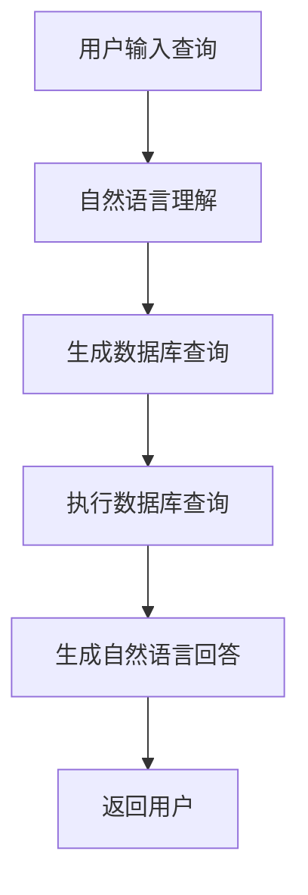

# 【LangChain编程：从入门到实践】数据库问答场景

## 1.背景介绍

在现代数据驱动的世界中，数据库问答系统变得越来越重要。无论是企业内部的数据查询，还是面向用户的智能问答系统，能够高效、准确地从数据库中提取信息是关键。LangChain作为一种新兴的编程框架，提供了强大的工具和方法来构建复杂的数据库问答系统。本篇文章将深入探讨如何使用LangChain编程框架，从入门到实践，构建一个高效的数据库问答系统。

## 2.核心概念与联系

在开始具体操作之前，我们需要了解一些核心概念和它们之间的联系。

### 2.1 LangChain简介

LangChain是一个用于构建自然语言处理（NLP）应用的编程框架。它提供了丰富的工具和库，支持从数据预处理、模型训练到部署的全流程开发。

### 2.2 数据库问答系统

数据库问答系统是一种能够理解自然语言查询，并从数据库中提取相关信息的系统。它通常包括以下几个部分：
- **自然语言理解（NLU）**：将用户的自然语言查询转换为结构化的数据库查询。
- **数据库查询**：执行结构化查询并获取结果。
- **结果生成**：将查询结果转换为自然语言回答。

### 2.3 LangChain与数据库问答系统的联系

LangChain提供了强大的NLP工具，可以用于自然语言理解部分。同时，它也支持与各种数据库的集成，使得数据库查询和结果生成变得更加简便。

## 3.核心算法原理具体操作步骤

在构建数据库问答系统时，我们需要遵循以下几个核心步骤：

### 3.1 数据预处理

数据预处理是构建任何NLP系统的第一步。我们需要对用户的自然语言查询进行分词、词性标注、命名实体识别等处理。

### 3.2 模型训练

使用LangChain的预训练模型或自定义模型进行训练，以便系统能够理解用户的查询意图。

### 3.3 查询生成

将用户的自然语言查询转换为结构化的数据库查询。这里可以使用SQL或其他查询语言。

### 3.4 查询执行

执行生成的数据库查询，并获取结果。

### 3.5 结果生成

将数据库查询结果转换为自然语言回答，并返回给用户。

以下是一个简化的Mermaid流程图，展示了数据库问答系统的核心流程：



## 4.数学模型和公式详细讲解举例说明

在数据库问答系统中，数学模型和公式主要用于自然语言理解和查询生成部分。以下是一些关键的数学模型和公式：

### 4.1 词向量模型

词向量模型将词语表示为向量，以便计算词语之间的相似度。常见的词向量模型包括Word2Vec和GloVe。

$$
\text{Word2Vec}(w) = \frac{1}{|C(w)|} \sum_{c \in C(w)} \text{context}(c)
$$

### 4.2 句子嵌入

句子嵌入将整个句子表示为向量，以便进行句子级别的相似度计算。常见的句子嵌入模型包括BERT和Sentence-BERT。

$$
\text{Sentence-BERT}(s) = \text{BERT}(s)
$$

### 4.3 意图识别

意图识别是将用户的自然语言查询映射到预定义的意图类别。可以使用分类模型来实现。

$$
\text{Intent}(q) = \arg\max_{i} P(i|q)
$$

### 4.4 查询生成

查询生成是将用户的自然语言查询转换为结构化的数据库查询。可以使用模板匹配或生成模型来实现。

$$
\text{SQL}(q) = \text{Template}(q)
$$

## 5.项目实践：代码实例和详细解释说明

在这一部分，我们将通过一个具体的代码实例，展示如何使用LangChain构建一个简单的数据库问答系统。

### 5.1 环境配置

首先，我们需要安装LangChain和相关的依赖库。

```bash
pip install langchain
pip install transformers
pip install sqlalchemy
```

### 5.2 数据预处理

我们将使用LangChain的预处理工具对用户的自然语言查询进行处理。

```python
from langchain.preprocessing import TextPreprocessor

preprocessor = TextPreprocessor()
query = "What is the capital of France?"
tokens = preprocessor.tokenize(query)
print(tokens)
```

### 5.3 模型训练

我们将使用预训练的BERT模型进行意图识别和查询生成。

```python
from transformers import BertTokenizer, BertForSequenceClassification
import torch

tokenizer = BertTokenizer.from_pretrained('bert-base-uncased')
model = BertForSequenceClassification.from_pretrained('bert-base-uncased')

inputs = tokenizer(query, return_tensors='pt')
outputs = model(**inputs)
intent = torch.argmax(outputs.logits, dim=1)
print(intent)
```

### 5.4 查询生成

我们将用户的自然语言查询转换为SQL查询。

```python
def generate_sql(query):
    if "capital" in query:
        return "SELECT capital FROM countries WHERE name = 'France'"
    return ""

sql_query = generate_sql(query)
print(sql_query)
```

### 5.5 查询执行

我们将生成的SQL查询执行，并获取结果。

```python
from sqlalchemy import create_engine

engine = create_engine('sqlite:///example.db')
result = engine.execute(sql_query).fetchone()
print(result)
```

### 5.6 结果生成

我们将数据库查询结果转换为自然语言回答。

```python
def generate_answer(result):
    return f"The capital of France is {result[0]}."

answer = generate_answer(result)
print(answer)
```

## 6.实际应用场景

数据库问答系统在多个领域都有广泛的应用。以下是一些实际应用场景：

### 6.1 企业内部数据查询

企业内部员工可以使用数据库问答系统快速查询公司内部的数据，如销售记录、库存信息等。

### 6.2 客户支持

客户支持系统可以使用数据库问答系统快速回答用户的常见问题，如产品信息、订单状态等。

### 6.3 医疗问答

医疗问答系统可以使用数据库问答系统快速回答患者的常见问题，如药物信息、疾病症状等。

### 6.4 教育领域

教育领域的问答系统可以使用数据库问答系统快速回答学生的常见问题，如课程信息、考试安排等。

## 7.工具和资源推荐

在构建数据库问答系统时，以下工具和资源可以提供很大的帮助：

### 7.1 LangChain

LangChain是一个强大的NLP编程框架，提供了丰富的工具和库，支持从数据预处理、模型训练到部署的全流程开发。

### 7.2 Transformers

Transformers是一个由Hugging Face开发的开源库，提供了多种预训练的NLP模型，如BERT、GPT-3等。

### 7.3 SQLAlchemy

SQLAlchemy是一个Python的SQL工具包和对象关系映射（ORM）库，支持多种数据库的连接和操作。

### 7.4 SpaCy

SpaCy是一个用于高级自然语言处理的开源库，提供了高效的分词、词性标注、命名实体识别等功能。

## 8.总结：未来发展趋势与挑战

数据库问答系统在未来有着广阔的发展前景，但也面临着一些挑战。

### 8.1 发展趋势

- **多模态问答**：未来的问答系统将不仅限于文本，还将支持图像、音频等多种模态的输入和输出。
- **个性化问答**：未来的问答系统将更加注重个性化，根据用户的历史记录和偏好提供定制化的回答。
- **实时问答**：未来的问答系统将更加注重实时性，能够快速响应用户的查询。

### 8.2 挑战

- **数据隐私**：在处理用户数据时，如何保护用户的隐私是一个重要的挑战。
- **自然语言理解**：如何提高系统对自然语言的理解能力，特别是对复杂查询的理解，是一个重要的技术挑战。
- **系统性能**：在处理大规模数据时，如何保证系统的性能和响应速度是一个重要的工程挑战。

## 9.附录：常见问题与解答

### 9.1 如何处理用户的模糊查询？

对于用户的模糊查询，可以使用模糊匹配算法，如编辑距离、Jaccard相似度等，来匹配最接近的数据库记录。

### 9.2 如何提高系统的准确性？

可以通过增加训练数据、使用更先进的模型、进行模型调优等方法来提高系统的准确性。

### 9.3 如何处理多轮对话？

可以使用对话管理器来跟踪用户的多轮对话状态，并根据上下文生成合适的回答。

### 9.4 如何处理大规模数据？

可以使用分布式数据库和并行计算技术来处理大规模数据，并保证系统的性能和响应速度。

### 9.5 如何保护用户的隐私？

可以使用数据加密、访问控制等技术来保护用户的隐私，并遵守相关的法律法规。

---

作者：禅与计算机程序设计艺术 / Zen and the Art of Computer Programming