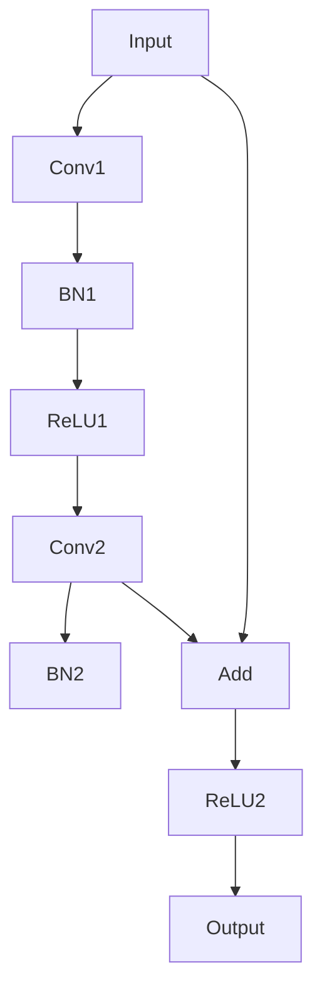
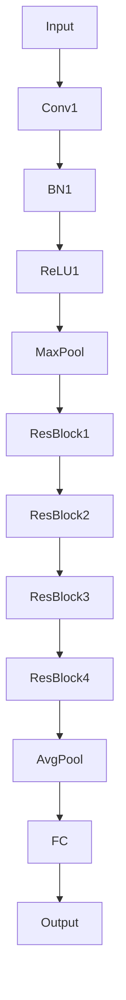

# 从零开始大模型开发与微调：ResNet实战

## 1.背景介绍

在深度学习领域，卷积神经网络（CNN）已经成为图像识别和分类任务的主力军。然而，随着网络层数的增加，传统的CNN架构面临着梯度消失和梯度爆炸的问题。为了解决这些问题，何凯明等人在2015年提出了残差网络（ResNet），其通过引入残差块（Residual Block）成功训练了超过100层的深度网络，并在多个图像识别任务中取得了显著的效果。

## 2.核心概念与联系

### 2.1 残差块

残差块是ResNet的核心组件，通过引入跳跃连接（Skip Connection），它允许信息在网络中直接传递，从而缓解了梯度消失的问题。其基本结构如下：



### 2.2 跳跃连接

跳跃连接是指在残差块中，输入直接加到输出上。这种设计使得网络可以学习到输入和输出之间的残差，从而更容易优化。

### 2.3 深度网络

ResNet的一个显著特点是其深度可以非常大，常见的有ResNet-18、ResNet-34、ResNet-50、ResNet-101和ResNet-152等。深度的增加使得网络能够捕捉到更复杂的特征。

## 3.核心算法原理具体操作步骤

### 3.1 残差块的构建

残差块的构建包括两个卷积层，每个卷积层后面跟着批量归一化（Batch Normalization）和ReLU激活函数。跳跃连接将输入直接加到第二个卷积层的输出上。

### 3.2 网络的堆叠

通过堆叠多个残差块，可以构建出深度不同的ResNet模型。以ResNet-50为例，其网络结构如下：



### 3.3 损失函数与优化

ResNet通常使用交叉熵损失函数（Cross-Entropy Loss）进行分类任务的优化。常用的优化算法包括随机梯度下降（SGD）和Adam。

## 4.数学模型和公式详细讲解举例说明

### 4.1 残差块公式

假设输入为 $x$，残差块的输出为 $F(x) + x$，其中 $F(x)$ 表示卷积层、批量归一化和ReLU的组合操作。

$$
F(x) = W_2 \cdot \text{ReLU}(W_1 \cdot x + b_1) + b_2
$$

### 4.2 损失函数

对于分类任务，交叉熵损失函数定义为：

$$
L = -\sum_{i=1}^{N} y_i \log(\hat{y}_i)
$$

其中，$y_i$ 是真实标签，$\hat{y}_i$ 是预测概率。

### 4.3 反向传播

在反向传播过程中，跳跃连接的引入使得梯度可以直接传递到前面的层，从而缓解了梯度消失的问题。

## 5.项目实践：代码实例和详细解释说明

### 5.1 环境准备

首先，确保你已经安装了必要的库，如PyTorch、NumPy和Matplotlib。

```bash
pip install torch torchvision numpy matplotlib
```

### 5.2 构建ResNet模型

以下是一个简单的ResNet-18模型的实现：

```python
import torch
import torch.nn as nn
import torch.nn.functional as F

class BasicBlock(nn.Module):
    def __init__(self, in_channels, out_channels, stride=1):
        super(BasicBlock, self).__init__()
        self.conv1 = nn.Conv2d(in_channels, out_channels, kernel_size=3, stride=stride, padding=1, bias=False)
        self.bn1 = nn.BatchNorm2d(out_channels)
        self.conv2 = nn.Conv2d(out_channels, out_channels, kernel_size=3, stride=1, padding=1, bias=False)
        self.bn2 = nn.BatchNorm2d(out_channels)
        self.shortcut = nn.Sequential()
        if stride != 1 or in_channels != out_channels:
            self.shortcut = nn.Sequential(
                nn.Conv2d(in_channels, out_channels, kernel_size=1, stride=stride, bias=False),
                nn.BatchNorm2d(out_channels)
            )

    def forward(self, x):
        out = F.relu(self.bn1(self.conv1(x)))
        out = self.bn2(self.conv2(out))
        out += self.shortcut(x)
        out = F.relu(out)
        return out

class ResNet(nn.Module):
    def __init__(self, block, num_blocks, num_classes=10):
        super(ResNet, self).__init__()
        self.in_channels = 64
        self.conv1 = nn.Conv2d(3, 64, kernel_size=3, stride=1, padding=1, bias=False)
        self.bn1 = nn.BatchNorm2d(64)
        self.layer1 = self._make_layer(block, 64, num_blocks[0], stride=1)
        self.layer2 = self._make_layer(block, 128, num_blocks[1], stride=2)
        self.layer3 = self._make_layer(block, 256, num_blocks[2], stride=2)
        self.layer4 = self._make_layer(block, 512, num_blocks[3], stride=2)
        self.linear = nn.Linear(512, num_classes)

    def _make_layer(self, block, out_channels, num_blocks, stride):
        strides = [stride] + [1]*(num_blocks-1)
        layers = []
        for stride in strides:
            layers.append(block(self.in_channels, out_channels, stride))
            self.in_channels = out_channels
        return nn.Sequential(*layers)

    def forward(self, x):
        out = F.relu(self.bn1(self.conv1(x)))
        out = self.layer1(out)
        out = self.layer2(out)
        out = self.layer3(out)
        out = self.layer4(out)
        out = F.avg_pool2d(out, 4)
        out = out.view(out.size(0), -1)
        out = self.linear(out)
        return out

def ResNet18():
    return ResNet(BasicBlock, [2, 2, 2, 2])
```

### 5.3 训练与测试

以下是训练和测试代码：

```python
import torch.optim as optim
import torchvision
import torchvision.transforms as transforms

# 数据预处理
transform = transforms.Compose([
    transforms.ToTensor(),
    transforms.Normalize((0.5, 0.5, 0.5), (0.5, 0.5, 0.5)),
])

trainset = torchvision.datasets.CIFAR10(root='./data', train=True, download=True, transform=transform)
trainloader = torch.utils.data.DataLoader(trainset, batch_size=100, shuffle=True, num_workers=2)

testset = torchvision.datasets.CIFAR10(root='./data', train=False, download=True, transform=transform)
testloader = torch.utils.data.DataLoader(testset, batch_size=100, shuffle=False, num_workers=2)

# 模型、损失函数和优化器
net = ResNet18()
criterion = nn.CrossEntropyLoss()
optimizer = optim.SGD(net.parameters(), lr=0.1, momentum=0.9, weight_decay=5e-4)

# 训练
for epoch in range(10):  # 训练10个epoch
    net.train()
    running_loss = 0.0
    for i, data in enumerate(trainloader, 0):
        inputs, labels = data
        optimizer.zero_grad()
        outputs = net(inputs)
        loss = criterion(outputs, labels)
        loss.backward()
        optimizer.step()
        running_loss += loss.item()
        if i % 100 == 99:  # 每100个batch打印一次
            print(f'[Epoch {epoch + 1}, Batch {i + 1}] loss: {running_loss / 100:.3f}')
            running_loss = 0.0

print('Finished Training')

# 测试
net.eval()
correct = 0
total = 0
with torch.no_grad():
    for data in testloader:
        images, labels = data
        outputs = net(images)
        _, predicted = torch.max(outputs.data, 1)
        total += labels.size(0)
        correct += (predicted == labels).sum().item()

print(f'Accuracy of the network on the 10000 test images: {100 * correct / total:.2f}%')
```

## 6.实际应用场景

### 6.1 图像分类

ResNet在图像分类任务中表现出色，广泛应用于ImageNet等大型数据集的分类任务。

### 6.2 目标检测

通过将ResNet作为特征提取器，结合Faster R-CNN等目标检测算法，可以实现高效的目标检测。

### 6.3 图像分割

ResNet也被用于图像分割任务，如U-Net和Mask R-CNN等模型中，通过其强大的特征提取能力，提高了分割精度。

## 7.工具和资源推荐

### 7.1 开发工具

- **PyTorch**：一个开源的深度学习框架，提供了灵活的模型构建和训练接口。
- **TensorFlow**：另一个流行的深度学习框架，适用于大规模分布式训练。

### 7.2 数据集

- **ImageNet**：一个大型图像数据集，广泛用于图像分类和目标检测任务。
- **CIFAR-10**：一个小型图像数据集，适用于快速原型开发和测试。

### 7.3 资源

- **论文**：何凯明等人的《Deep Residual Learning for Image Recognition》是理解ResNet的基础。
- **教程**：PyTorch和TensorFlow的官方文档和教程提供了详细的使用指南。

## 8.总结：未来发展趋势与挑战

### 8.1 未来发展趋势

随着深度学习技术的不断发展，ResNet的变种和改进版本不断涌现，如ResNeXt、DenseNet等。这些新模型在保持高效特征提取能力的同时，进一步提高了模型的性能和训练效率。

### 8.2 挑战

尽管ResNet在许多任务中表现出色，但其计算复杂度和内存占用仍然是一个挑战。未来的研究方向可能包括模型压缩和加速技术，以提高模型的实际应用性能。

## 9.附录：常见问题与解答

### 9.1 为什么ResNet能解决梯度消失问题？

ResNet通过引入跳跃连接，使得梯度可以直接传递到前面的层，从而缓解了梯度消失的问题。

### 9.2 如何选择ResNet的深度？

选择ResNet的深度取决于具体任务和数据集。对于小型数据集，如CIFAR-10，ResNet-18或ResNet-34可能已经足够；对于大型数据集，如ImageNet，ResNet-50或更深的模型可能更合适。

### 9.3 ResNet的训练时间长吗？

ResNet的训练时间取决于模型的深度和数据集的大小。通常，深度越大，训练时间越长。可以通过使用GPU加速训练过程。

### 9.4 如何微调ResNet模型？

微调ResNet模型通常包括以下步骤：加载预训练模型、冻结部分层、修改最后的全连接层以适应新任务、重新训练模型。

### 9.5 ResNet适用于哪些任务？

ResNet广泛应用于图像分类、目标检测、图像分割等任务。其强大的特征提取能力使其在各种计算机视觉任务中表现出色。

---

作者：禅与计算机程序设计艺术 / Zen and the Art of Computer Programming