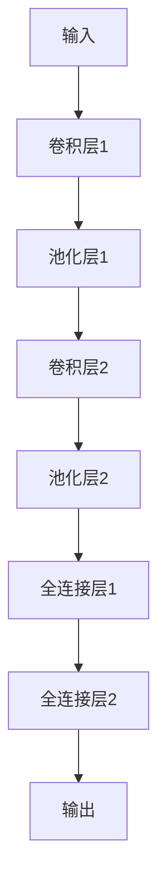

## 1. 背景介绍

在自然语言处理领域，文本分类是一个重要的任务。传统的文本分类任务通常是基于单词的，即将文本中的单词作为特征进行分类。然而，在某些情况下，单词级别的特征并不足够表达文本的语义信息，例如在处理中文文本时，一个单词可能包含多个字符，而这些字符的组合方式对于文本的语义有着重要的影响。因此，字符级别的文本分类成为了一个备受关注的研究方向。

本文将介绍如何从零开始开发一个字符级别的文本分类模型，并通过微调的方式提高模型的性能。

## 2. 核心概念与联系

### 2.1 字符级别的文本分类

字符级别的文本分类是指将文本中的字符作为特征进行分类。与单词级别的文本分类相比，字符级别的文本分类可以更好地处理中文等语言中存在的多音字、歧义词等问题。

### 2.2 微调

微调是指在一个已经训练好的模型的基础上，针对新的任务或数据集进行进一步的训练，以提高模型在新任务或数据集上的性能。

## 3. 核心算法原理具体操作步骤

### 3.1 模型架构

本文使用的模型是基于卷积神经网络（Convolutional Neural Network，CNN）的字符级别文本分类模型。模型的架构如下所示：



模型的输入是一个文本序列，每个字符被表示为一个向量。模型的输出是文本的类别。

### 3.2 训练过程

模型的训练过程包括以下步骤：

1. 将文本序列转化为字符向量序列。
2. 将字符向量序列输入到模型中，得到模型的输出。
3. 计算模型的损失函数，使用反向传播算法更新模型的参数。
4. 重复步骤2-3，直到模型收敛。

### 3.3 微调过程

微调过程包括以下步骤：

1. 将预训练模型的参数加载到模型中。
2. 将新的数据集输入到模型中，得到模型的输出。
3. 计算模型的损失函数，使用反向传播算法更新模型的参数。
4. 重复步骤2-3，直到模型收敛。

## 4. 数学模型和公式详细讲解举例说明

### 4.1 模型公式

模型的输出可以表示为：

$$
y = softmax(Wx + b)
$$

其中，$x$ 是输入的字符向量序列，$W$ 和 $b$ 是模型的参数，$softmax$ 是一个归一化函数，将模型的输出转化为概率分布。

### 4.2 损失函数

模型的损失函数可以表示为交叉熵损失函数：

$$
L = -\sum_{i=1}^{n} y_i \log \hat{y_i}
$$

其中，$y$ 是真实的标签，$\hat{y}$ 是模型的输出。

## 5. 项目实践：代码实例和详细解释说明

### 5.1 数据集

本文使用的数据集是AG News，包含4个类别的新闻文本。数据集可以从以下链接下载：https://drive.google.com/file/d/0Bz8a_Dbh9QhbUDNpeUdjb0wxRms/view

### 5.2 数据预处理

首先，我们需要将文本序列转化为字符向量序列。这可以通过以下代码实现：

```python
import numpy as np

def text_to_char_sequence(text, char_dict, max_len):
    char_seq = np.zeros((max_len,), dtype=np.int32)
    for i, char in enumerate(text):
        if i >= max_len:
            break
        if char in char_dict:
            char_seq[i] = char_dict[char]
        else:
            char_seq[i] = char_dict['<unk>']
    return char_seq

def load_data(data_path, char_dict, max_len):
    texts = []
    labels = []
    with open(data_path, 'r', encoding='utf-8') as f:
        for line in f:
            label, text = line.strip().split('\t')
            texts.append(text_to_char_sequence(text, char_dict, max_len))
            labels.append(int(label) - 1)
    return np.array(texts), np.array(labels)
```

其中，`char_dict` 是字符到整数的映射表，`max_len` 是字符向量的最大长度。

### 5.3 模型训练

模型的训练可以通过以下代码实现：

```python
import tensorflow as tf

def train_model(train_data, train_labels, val_data, val_labels, char_dict, max_len, num_classes, batch_size, num_epochs):
    model = tf.keras.Sequential([
        tf.keras.layers.Input(shape=(max_len,), dtype=tf.int32),
        tf.keras.layers.Embedding(len(char_dict), 128),
        tf.keras.layers.Conv1D(128, 5, activation='relu'),
        tf.keras.layers.MaxPooling1D(5),
        tf.keras.layers.Conv1D(128, 5, activation='relu'),
        tf.keras.layers.MaxPooling1D(5),
        tf.keras.layers.Flatten(),
        tf.keras.layers.Dense(128, activation='relu'),
        tf.keras.layers.Dense(num_classes, activation='softmax')
    ])
    model.compile(optimizer='adam',
                  loss='sparse_categorical_crossentropy',
                  metrics=['accuracy'])
    model.fit(train_data, train_labels, batch_size=batch_size, epochs=num_epochs,
              validation_data=(val_data, val_labels))
    return model
```

其中，模型的架构与前面介绍的相同。

### 5.4 模型微调

模型的微调可以通过以下代码实现：

```python
def fine_tune_model(model, train_data, train_labels, val_data, val_labels, batch_size, num_epochs):
    model.compile(optimizer=tf.keras.optimizers.Adam(lr=1e-5),
                  loss='sparse_categorical_crossentropy',
                  metrics=['accuracy'])
    model.fit(train_data, train_labels, batch_size=batch_size, epochs=num_epochs,
              validation_data=(val_data, val_labels))
    return model
```

## 6. 实际应用场景

字符级别的文本分类可以应用于各种文本分类任务，例如情感分析、垃圾邮件过滤等。

## 7. 工具和资源推荐

- TensorFlow：一个流行的深度学习框架，提供了丰富的卷积神经网络模型和工具。
- Keras：一个高级深度学习框架，提供了简单易用的接口和模型。
- AG News数据集：一个常用的文本分类数据集，包含4个类别的新闻文本。

## 8. 总结：未来发展趋势与挑战

字符级别的文本分类是一个备受关注的研究方向，未来将会有更多的研究工作涉及到该领域。然而，字符级别的文本分类也面临着一些挑战，例如如何处理长文本、如何处理多语言等问题。

## 9. 附录：常见问题与解答

暂无。


作者：禅与计算机程序设计艺术 / Zen and the Art of Computer Programming