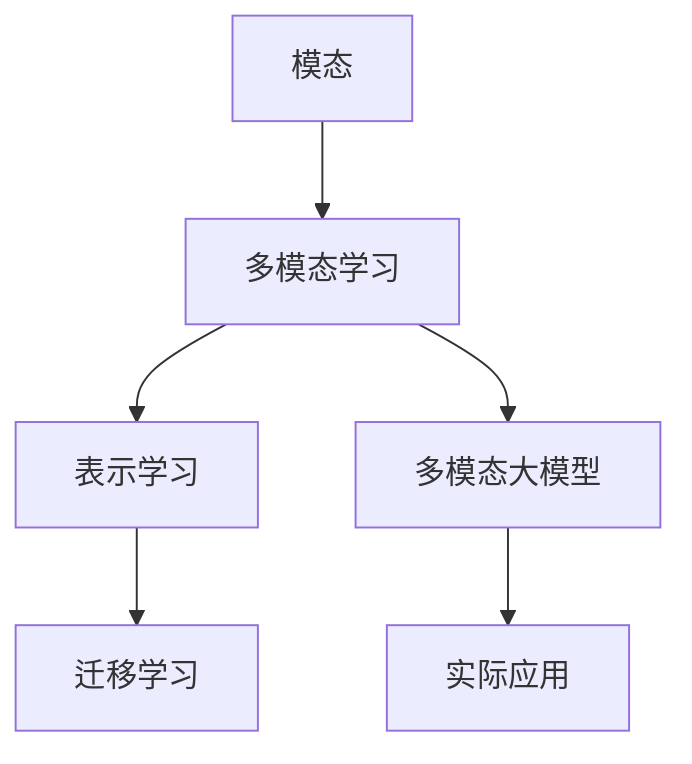
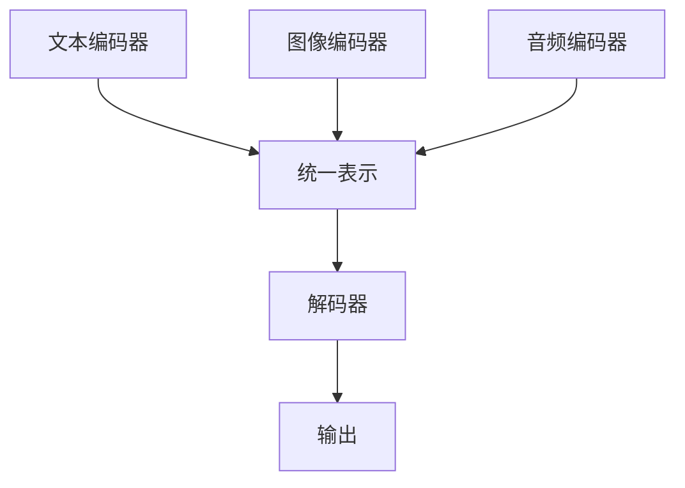

# 多模态大模型：技术原理与实战 OpenAI成功的因素

## 1.背景介绍

在人工智能领域，多模态大模型（Multimodal Large Models）正逐渐成为研究和应用的热点。多模态大模型指的是能够处理和理解多种类型数据（如文本、图像、音频等）的模型。OpenAI作为这一领域的先驱，通过其开创性的研究和应用，展示了多模态大模型的巨大潜力和广泛应用前景。

### 1.1 多模态大模型的定义

多模态大模型是指能够同时处理多种数据类型的人工智能模型。这些数据类型可以包括但不限于文本、图像、音频和视频。通过整合不同模态的数据，这些模型能够实现更为复杂和智能的任务。

### 1.2 OpenAI的贡献

OpenAI在多模态大模型领域的贡献主要体现在以下几个方面：
- **技术创新**：开发了如GPT-3和DALL-E等具有里程碑意义的模型。
- **开源与合作**：通过开源和合作，推动了整个AI社区的发展。
- **实际应用**：在多个领域展示了多模态大模型的实际应用价值，如医疗、教育和娱乐等。

### 1.3 研究背景

多模态大模型的研究背景可以追溯到早期的机器学习和深度学习技术。随着计算能力和数据量的增加，研究人员逐渐认识到单一模态数据的局限性，开始探索如何将多种模态的数据整合到一个统一的模型中。

## 2.核心概念与联系

在深入探讨多模态大模型之前，我们需要了解一些核心概念和它们之间的联系。

### 2.1 模态

模态（Modality）指的是数据的类型或形式。常见的模态包括：
- **文本**：自然语言处理（NLP）中的主要数据形式。
- **图像**：计算机视觉（CV）中的主要数据形式。
- **音频**：语音识别和生成中的主要数据形式。
- **视频**：结合了图像和音频的复杂数据形式。

### 2.2 多模态学习

多模态学习（Multimodal Learning）是指通过整合多种模态的数据来训练模型，以实现更为复杂和智能的任务。其核心思想是利用不同模态数据的互补性，提高模型的性能和泛化能力。

### 2.3 表示学习

表示学习（Representation Learning）是多模态学习中的一个关键概念。它指的是通过学习数据的低维表示（Embedding），使得不同模态的数据可以在同一个空间中进行比较和操作。

### 2.4 迁移学习

迁移学习（Transfer Learning）在多模态大模型中也扮演着重要角色。通过在一个任务上训练好的模型参数，可以迁移到另一个相关任务上，从而减少训练时间和数据需求。

### 2.5 核心联系

这些核心概念之间的联系可以通过以下Mermaid图示来表示：



## 3.核心算法原理具体操作步骤

多模态大模型的核心算法涉及多个复杂的步骤和技术。以下是一个典型的多模态大模型的训练和应用流程。

### 3.1 数据预处理

数据预处理是多模态大模型训练的第一步。不同模态的数据需要进行不同的预处理操作。

#### 3.1.1 文本数据预处理

- **分词**：将文本分割成单词或子词。
- **词向量表示**：使用词嵌入（如Word2Vec或BERT）将单词转换为向量。

#### 3.1.2 图像数据预处理

- **归一化**：将像素值归一化到[0, 1]范围。
- **数据增强**：通过旋转、裁剪等操作增加数据的多样性。

#### 3.1.3 音频数据预处理

- **采样**：将音频信号采样为固定频率。
- **特征提取**：提取如MFCC（梅尔频率倒谱系数）等特征。

### 3.2 模型架构设计

多模态大模型的架构设计是其性能的关键。常见的架构包括：

#### 3.2.1 编码器-解码器架构

编码器-解码器架构是多模态大模型中常用的一种架构。编码器将不同模态的数据转换为统一的表示，解码器则根据任务需求生成输出。



#### 3.2.2 交叉模态注意力机制

交叉模态注意力机制（Cross-modal Attention）是多模态大模型中的一个重要技术。它通过计算不同模态数据之间的相关性，提高模型的理解能力。

### 3.3 模型训练

模型训练是多模态大模型开发的核心步骤。常用的训练方法包括：

#### 3.3.1 监督学习

通过标注数据进行训练，常用于分类和回归任务。

#### 3.3.2 自监督学习

通过设计预训练任务（如掩码语言模型）进行训练，减少对标注数据的依赖。

#### 3.3.3 迁移学习

通过在大规模数据上预训练模型，然后在特定任务上进行微调。

### 3.4 模型评估

模型评估是验证多模态大模型性能的重要步骤。常用的评估指标包括：

- **准确率**：分类任务中的常用指标。
- **均方误差**：回归任务中的常用指标。
- **BLEU分数**：自然语言生成任务中的常用指标。

## 4.数学模型和公式详细讲解举例说明

在多模态大模型中，数学模型和公式是理解其工作原理的关键。以下是一些核心的数学概念和公式。

### 4.1 词嵌入

词嵌入是将单词转换为向量的技术。常用的词嵌入方法包括Word2Vec和BERT。

#### 4.1.1 Word2Vec

Word2Vec通过训练一个神经网络，将单词映射到一个低维向量空间。其目标函数为：

$$
J(\theta) = -\sum_{t=1}^{T} \sum_{-c \leq j \leq c, j \neq 0} \log p(w_{t+j} | w_t)
$$

其中，$w_t$表示当前单词，$w_{t+j}$表示上下文单词，$c$表示上下文窗口大小。

#### 4.1.2 BERT

BERT使用自注意力机制，通过掩码语言模型（Masked Language Model, MLM）进行训练。其目标函数为：

$$
L = -\sum_{i=1}^{N} \log p(w_i | w_{1:i-1}, w_{i+1:N})
$$

其中，$w_i$表示被掩码的单词，$N$表示序列长度。

### 4.2 交叉模态注意力机制

交叉模态注意力机制通过计算不同模态数据之间的相关性，提高模型的理解能力。其计算公式为：

$$
Attention(Q, K, V) = \text{softmax}\left(\frac{QK^T}{\sqrt{d_k}}\right)V
$$

其中，$Q$表示查询向量，$K$表示键向量，$V$表示值向量，$d_k$表示键向量的维度。

### 4.3 损失函数

损失函数是模型训练的核心。常用的损失函数包括交叉熵损失和均方误差。

#### 4.3.1 交叉熵损失

交叉熵损失常用于分类任务。其公式为：

$$
L = -\sum_{i=1}^{N} y_i \log(\hat{y}_i)
$$

其中，$y_i$表示真实标签，$\hat{y}_i$表示预测概率。

#### 4.3.2 均方误差

均方误差常用于回归任务。其公式为：

$$
L = \frac{1}{N} \sum_{i=1}^{N} (y_i - \hat{y}_i)^2
$$

其中，$y_i$表示真实值，$\hat{y}_i$表示预测值。

## 5.项目实践：代码实例和详细解释说明

为了更好地理解多模态大模型的实际应用，我们将通过一个具体的项目实例来展示其实现过程。

### 5.1 项目简介

本项目将实现一个简单的多模态大模型，用于图像和文本的联合分类任务。我们将使用PyTorch框架进行实现。

### 5.2 数据集准备

我们将使用Flickr30k数据集，该数据集包含图像和对应的文本描述。

### 5.3 代码实现

#### 5.3.1 数据预处理

首先，我们需要对图像和文本数据进行预处理。

```python
import torch
from torchvision import transforms
from transformers import BertTokenizer

# 图像预处理
image_transforms = transforms.Compose([
    transforms.Resize((224, 224)),
    transforms.ToTensor(),
    transforms.Normalize(mean=[0.485, 0.456, 0.406], std=[0.229, 0.224, 0.225])
])

# 文本预处理
tokenizer = BertTokenizer.from_pretrained('bert-base-uncased')

def preprocess_text(text):
    return tokenizer(text, padding='max_length', max_length=128, truncation=True, return_tensors='pt')
```

#### 5.3.2 模型架构

接下来，我们定义多模态大模型的架构。

```python
import torch.nn as nn
from transformers import BertModel
from torchvision.models import resnet50

class MultimodalModel(nn.Module):
    def __init__(self):
        super(MultimodalModel, self).__init__()
        self.text_encoder = BertModel.from_pretrained('bert-base-uncased')
        self.image_encoder = resnet50(pretrained=True)
        self.image_encoder.fc = nn.Linear(self.image_encoder.fc.in_features, 768)
        self.classifier = nn.Linear(768 * 2, 10)  # 假设有10个类别

    def forward(self, text, image):
        text_features = self.text_encoder(**text).last_hidden_state[:, 0, :]
        image_features = self.image_encoder(image)
        combined_features = torch.cat((text_features, image_features), dim=1)
        output = self.classifier(combined_features)
        return output
```

#### 5.3.3 模型训练

最后，我们定义模型的训练过程。

```python
import torch.optim as optim
from torch.utils.data import DataLoader

# 假设我们有一个自定义的数据集类Flickr30kDataset
train_loader = DataLoader(Flickr30kDataset(), batch_size=32, shuffle=True)

model = MultimodalModel().to(device)
criterion = nn.CrossEntropyLoss()
optimizer = optim.Adam(model.parameters(), lr=1e-4)

for epoch in range(num_epochs):
    model.train()
    for batch in train_loader:
        text, image, labels = batch
        text, image, labels = text.to(device), image.to(device), labels.to(device)
        
        optimizer.zero_grad()
        outputs = model(text, image)
        loss = criterion(outputs, labels)
        loss.backward()
        optimizer.step()
    
    print(f'Epoch {epoch+1}/{num_epochs}, Loss: {loss.item()}')
```

## 6.实际应用场景

多模态大模型在多个实际应用场景中展示了其强大的能力。以下是一些典型的应用场景。

### 6.1 医疗诊断

在医疗领域，多模态大模型可以整合患者的文本病历、医学图像和基因数据，从而提供更为准确的诊断和治疗建议。

### 6.2 教育

在教育领域，多模态大模型可以通过分析学生的文本作业、语音回答和视频表现，提供个性化的学习建议和反馈。

### 6.3 娱乐

在娱乐领域，多模态大模型可以用于生成高质量的图像、视频和音乐内容，提升用户体验。

### 6.4 自动驾驶

在自动驾驶领域，多模态大模型可以整合摄像头、雷达和激光雷达的数据，从而提高车辆的感知和决策能力。

## 7.工具和资源推荐

在开发和应用多模态大模型的过程中，有许多工具和资源可以帮助我们提高效率和效果。

### 7.1 开发工具

- **PyTorch**：一个灵活且强大的深度学习框架，适用于多模态大模型的开发。
- **TensorFlow**：另一个流行的深度学习框架，提供了丰富的工具和资源。

### 7.2 数据集

- **Flickr30k**：一个包含图像和文本描述的数据集，适用于多模态学习任务。
- **MS COCO**：一个大规模的图像数据集，包含丰富的标注信息。

### 7.3 预训练模型

- **BERT**：一个强大的预训练语言模型，适用于文本模态的处理。
- **ResNet**：一个经典的卷积神经网络，适用于图像模态的处理。

## 8.总结：未来发展趋势与挑战

多模态大模型在人工智能领域展示了巨大的潜力，但也面临着许多挑战和未来的发展方向。

### 8.1 未来发展趋势

- **更高效的模型架构**：研究更高效的模型架构，以减少计算资源的消耗。
- **更广泛的应用场景**：探索多模态大模型在更多领域的应用，如金融、法律等。
- **更智能的交互方式**：开发更智能的交互方式，使得多模态大模型能够更好地理解和响应用户需求。

### 8.2 挑战

- **数据隐私和安全**：如何在保护用户数据隐私的前提下，充分利用多模态数据。
- **模型解释性**：如何提高多模态大模型的解释性，使得其决策过程更加透明。
- **计算资源**：多模态大模型通常需要大量的计算资源，如何提高其训练和推理效率是一个重要的研究方向。

## 9.附录：常见问题与解答

### 9.1 多模态大模型的优势是什么？

多模态大模型的优势在于其能够整合多种类型的数据，从而实现更为复杂和智能的任务。例如，在医疗诊断中，整合文本病历和医学图像可以提供更为准确的诊断结果。

### 9.2 如何选择合适的数据集？

选择数据集时，应根据具体的任务需求和数据模态来选择。例如，如果任务涉及图像和文本的联合分类，可以选择Flickr30k或MS COCO数据集。

### 9.3 多模态大模型的训练需要哪些资源？

多模态大模型的训练通常需要大量的计算资源，包括高性能的GPU和大规模的存储空间。此外，还需要丰富的标注数据和预训练模型。

### 9.4 如何提高多模态大模型的性能？

提高多模态大模型性能的方法包括：
- **优化模型架构**：研究更高效的模型架构，如交叉模态注意力机制。
- **数据增强**：通过数据增强技术增加数据的多样性。
- **迁移学习**：利用预训练模型进行迁移学习，减少训练时间和数据需求。

### 9.5 多模态大模型的未来发展方向是什么？

多模态大模型的未来发展方向包括：
- **更高效的模型架构**：研究更高效的模型架构，以减少计算资源的消耗。
- **更广泛的应用场景**：探索多模态大模型在更多领域的应用，如金融、法律等。
- **更智能的交互方式**：开发更智能的交互方式，使得多模态大模型能够更好地理解和响应用户需求。

---

作者：禅与计算机程序设计艺术 / Zen and the Art of Computer Programming