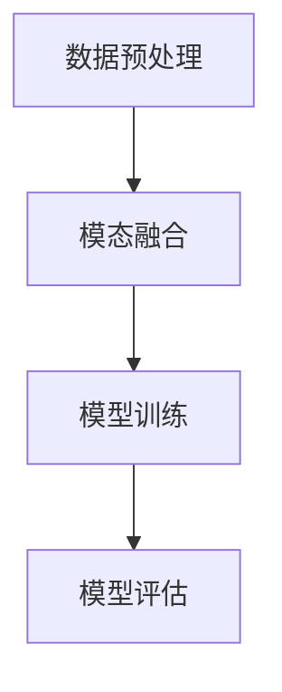

# 多模态大模型：技术原理与实战 大模型在软件研发领域的实战案例与前沿探索

## 1.背景介绍

在人工智能领域，多模态大模型（Multimodal Large Models, MLMs）正逐渐成为研究和应用的热点。多模态大模型能够处理和理解多种类型的数据，如文本、图像、音频和视频，从而实现更为复杂和智能的任务。这些模型在自然语言处理、计算机视觉、语音识别等领域展现出了强大的能力，并且在软件研发中也有着广泛的应用前景。

## 2.核心概念与联系

### 2.1 多模态数据

多模态数据是指来自不同模态（如文本、图像、音频、视频等）的数据。这些数据类型各自具有独特的特征和信息表达方式。多模态大模型的目标是融合这些不同模态的数据，以实现更为全面和准确的理解和处理。

### 2.2 大模型

大模型通常指的是具有大量参数的深度学习模型，如GPT-3、BERT、DALL-E等。这些模型通过大规模的数据训练，能够捕捉复杂的模式和关系，从而在各种任务中表现出色。

### 2.3 多模态大模型的联系

多模态大模型结合了多模态数据和大模型的优势，通过融合不同模态的数据，能够实现更为复杂和智能的任务。例如，结合文本和图像数据的模型可以实现图像描述生成、图像问答等任务。

## 3.核心算法原理具体操作步骤

### 3.1 数据预处理

多模态大模型的训练需要对不同模态的数据进行预处理。具体步骤包括：

1. **文本数据预处理**：分词、去停用词、词向量表示等。
2. **图像数据预处理**：图像缩放、归一化、数据增强等。
3. **音频数据预处理**：采样、特征提取（如MFCC）、归一化等。

### 3.2 模态融合

模态融合是多模态大模型的核心步骤之一。常见的模态融合方法包括：

1. **早期融合**：在模型输入层进行模态融合，将不同模态的数据拼接在一起。
2. **中期融合**：在模型的中间层进行模态融合，通过注意力机制或其他方法融合不同模态的特征。
3. **晚期融合**：在模型输出层进行模态融合，将不同模态的输出结果进行组合。

### 3.3 模型训练

多模态大模型的训练过程通常包括以下步骤：

1. **模型初始化**：初始化模型参数。
2. **前向传播**：计算模型的输出。
3. **损失计算**：根据模型的输出和真实标签计算损失。
4. **反向传播**：计算梯度并更新模型参数。
5. **迭代训练**：重复上述步骤，直到模型收敛。

### 3.4 模型评估

模型评估是验证多模态大模型性能的重要步骤。常见的评估指标包括准确率、精确率、召回率、F1-score等。



## 4.数学模型和公式详细讲解举例说明

### 4.1 模态融合的数学表示

假设有两种模态的数据：文本数据 $X_t$ 和图像数据 $X_i$。模态融合的数学表示可以如下：

$$
H_t = f_t(X_t)
$$

$$
H_i = f_i(X_i)
$$

其中，$f_t$ 和 $f_i$ 分别是处理文本和图像数据的特征提取函数。模态融合可以表示为：

$$
H = g(H_t, H_i)
$$

其中，$g$ 是模态融合函数，可以是简单的拼接操作，也可以是复杂的注意力机制。

### 4.2 损失函数

多模态大模型的损失函数通常包括多种模态的损失。例如，对于文本和图像的联合任务，损失函数可以表示为：

$$
L = \alpha L_t + \beta L_i
$$

其中，$L_t$ 和 $L_i$ 分别是文本和图像的损失，$\alpha$ 和 $\beta$ 是权重系数。

### 4.3 示例：图像描述生成

图像描述生成任务的目标是根据图像生成相应的文本描述。其数学模型可以表示为：

$$
P(Y|X) = \prod_{t=1}^{T} P(y_t|y_{1:t-1}, X)
$$

其中，$X$ 是图像数据，$Y$ 是生成的文本描述，$y_t$ 是第 $t$ 个词。

## 5.项目实践：代码实例和详细解释说明

### 5.1 数据预处理

```python
import torch
from transformers import BertTokenizer, BertModel
from torchvision import transforms
from PIL import Image

# 文本数据预处理
tokenizer = BertTokenizer.from_pretrained('bert-base-uncased')
text = "A cat sitting on a mat."
inputs = tokenizer(text, return_tensors="pt")

# 图像数据预处理
transform = transforms.Compose([
    transforms.Resize((224, 224)),
    transforms.ToTensor(),
    transforms.Normalize(mean=[0.485, 0.456, 0.406], std=[0.229, 0.224, 0.225]),
])
image = Image.open("cat.jpg")
image = transform(image).unsqueeze(0)
```

### 5.2 模态融合

```python
class MultimodalModel(torch.nn.Module):
    def __init__(self):
        super(MultimodalModel, self).__init__()
        self.text_model = BertModel.from_pretrained('bert-base-uncased')
        self.image_model = torch.nn.Sequential(
            torch.nn.Conv2d(3, 64, kernel_size=3, stride=1, padding=1),
            torch.nn.ReLU(),
            torch.nn.MaxPool2d(kernel_size=2, stride=2),
            torch.nn.Flatten(),
            torch.nn.Linear(64 * 112 * 112, 256),
            torch.nn.ReLU()
        )
        self.fc = torch.nn.Linear(256 + 768, 10)  # 假设输出为10类

    def forward(self, text_inputs, image_inputs):
        text_features = self.text_model(**text_inputs).last_hidden_state[:, 0, :]
        image_features = self.image_model(image_inputs)
        combined_features = torch.cat((text_features, image_features), dim=1)
        output = self.fc(combined_features)
        return output

model = MultimodalModel()
```

### 5.3 模型训练

```python
import torch.optim as optim

# 损失函数和优化器
criterion = torch.nn.CrossEntropyLoss()
optimizer = optim.Adam(model.parameters(), lr=0.001)

# 训练循环
for epoch in range(10):  # 假设训练10个epoch
    model.train()
    optimizer.zero_grad()
    outputs = model(inputs, image)
    loss = criterion(outputs, labels)
    loss.backward()
    optimizer.step()
    print(f"Epoch {epoch+1}, Loss: {loss.item()}")
```

## 6.实际应用场景

### 6.1 图像描述生成

多模态大模型可以用于图像描述生成，即根据图像生成相应的文本描述。这在自动驾驶、智能监控等领域有着广泛的应用。

### 6.2 图像问答

图像问答任务的目标是根据图像和问题生成相应的答案。这在智能客服、教育等领域有着重要的应用。

### 6.3 多模态情感分析

多模态情感分析结合了文本、图像、音频等多种模态的数据，以实现更为准确的情感分析。这在社交媒体分析、市场调研等领域有着广泛的应用。

## 7.工具和资源推荐

### 7.1 工具

1. **Transformers**：Hugging Face 提供的用于自然语言处理的库，支持多种预训练模型。
2. **Torchvision**：PyTorch 提供的用于计算机视觉的库，包含常用的数据集、模型和变换。
3. **OpenCV**：用于图像处理的开源库，支持多种图像处理操作。

### 7.2 资源

1. **COCO Dataset**：常用的图像数据集，包含丰富的图像和标注信息。
2. **LibriSpeech**：常用的语音数据集，包含大量的语音和文本对。
3. **Hugging Face Model Hub**：提供多种预训练模型和数据集，方便快速实验和应用。

## 8.总结：未来发展趋势与挑战

多模态大模型在人工智能领域展现出了巨大的潜力，但也面临着诸多挑战。未来的发展趋势和挑战包括：

1. **模型规模和计算资源**：多模态大模型通常具有大量的参数，训练和推理需要大量的计算资源。
2. **数据融合和对齐**：不同模态的数据具有不同的特征和时间尺度，如何有效地融合和对齐这些数据是一个重要的研究方向。
3. **模型解释性和可控性**：多模态大模型的复杂性增加了模型的解释性和可控性问题，如何提高模型的透明度和可控性是一个重要的挑战。

## 9.附录：常见问题与解答

### 9.1 多模态大模型的优势是什么？

多模态大模型能够融合不同模态的数据，从而实现更为全面和准确的理解和处理。这在许多复杂任务中具有显著的优势。

### 9.2 如何选择合适的模态融合方法？

选择合适的模态融合方法需要根据具体任务和数据特点进行权衡。早期融合适用于模态间关系较强的任务，中期融合和晚期融合适用于模态间关系较弱的任务。

### 9.3 多模态大模型的训练需要哪些资源？

多模态大模型的训练通常需要大量的计算资源，包括高性能的GPU或TPU、大规模的数据集和长时间的训练时间。

### 9.4 如何评估多模态大模型的性能？

多模态大模型的性能评估需要结合多种模态的评估指标，如准确率、精确率、召回率、F1-score等。

### 9.5 多模态大模型的应用前景如何？

多模态大模型在自然语言处理、计算机视觉、语音识别等领域具有广泛的应用前景，未来有望在更多领域实现突破。

---

作者：禅与计算机程序设计艺术 / Zen and the Art of Computer Programming