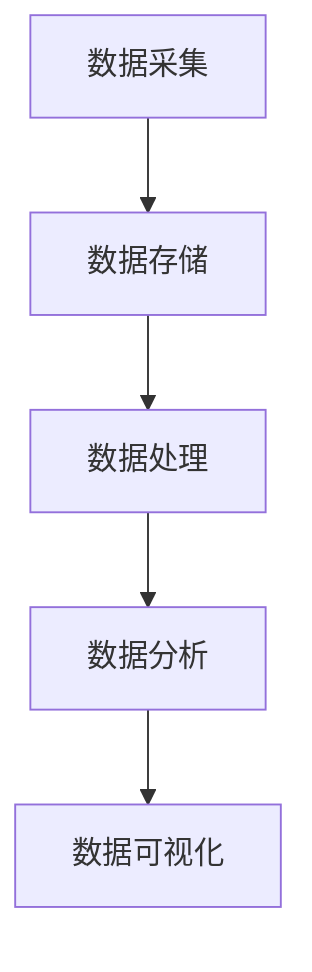

# 大数据架构原理与代码实例讲解

## 1.背景介绍

在当今信息爆炸的时代，数据已经成为企业和组织的重要资产。大数据技术的兴起，使得我们能够从海量数据中提取有价值的信息，进而驱动业务决策和创新。大数据架构是实现这一目标的关键，它涉及数据的采集、存储、处理和分析等多个环节。本文将深入探讨大数据架构的原理，并通过具体的代码实例帮助读者更好地理解和应用这些技术。

## 2.核心概念与联系

### 2.1 大数据的定义

大数据通常被定义为具有高容量、高速度和高多样性的数据集，这些数据集超出了传统数据处理工具的处理能力。大数据的四个主要特征被称为4V：Volume（数据量）、Velocity（速度）、Variety（多样性）和Veracity（真实性）。

### 2.2 大数据架构的组成部分

大数据架构通常包括以下几个关键组成部分：

- **数据采集**：从各种数据源（如传感器、日志文件、社交媒体等）收集数据。
- **数据存储**：使用分布式存储系统（如HDFS、NoSQL数据库）存储海量数据。
- **数据处理**：使用分布式计算框架（如Hadoop、Spark）对数据进行处理和分析。
- **数据分析**：使用数据挖掘、机器学习等技术从数据中提取有价值的信息。
- **数据可视化**：使用可视化工具（如Tableau、D3.js）展示分析结果。

### 2.3 各组成部分的联系

这些组成部分相互联系，共同构成了一个完整的大数据处理流程。数据采集是起点，数据存储是基础，数据处理是核心，数据分析是目标，数据可视化是结果展示。



## 3.核心算法原理具体操作步骤

### 3.1 数据采集

数据采集是大数据处理的第一步，涉及从各种数据源获取数据。常用的数据采集工具包括Flume、Kafka等。

#### 3.1.1 Flume

Flume是一个分布式、可靠且可用的系统，用于高效地收集、聚合和移动大量日志数据。

#### 3.1.2 Kafka

Kafka是一个分布式流处理平台，主要用于构建实时数据管道和流应用。

### 3.2 数据存储

数据存储是大数据处理的基础，常用的存储系统包括HDFS、HBase、Cassandra等。

#### 3.2.1 HDFS

HDFS（Hadoop Distributed File System）是Hadoop的分布式文件系统，适用于存储大规模数据。

#### 3.2.2 HBase

HBase是一个分布式、面向列的存储系统，适用于实时读写大规模数据。

### 3.3 数据处理

数据处理是大数据处理的核心，常用的处理框架包括Hadoop、Spark等。

#### 3.3.1 Hadoop

Hadoop是一个开源的分布式计算框架，主要包括HDFS和MapReduce两个核心组件。

#### 3.3.2 Spark

Spark是一个快速、通用的分布式计算系统，支持多种数据处理任务，如批处理、流处理、机器学习等。

### 3.4 数据分析

数据分析是大数据处理的目标，常用的分析技术包括数据挖掘、机器学习等。

#### 3.4.1 数据挖掘

数据挖掘是从大规模数据中提取有价值信息的过程，常用的技术包括关联规则、聚类分析等。

#### 3.4.2 机器学习

机器学习是通过算法从数据中学习模式和规律的过程，常用的算法包括回归、分类、聚类等。

### 3.5 数据可视化

数据可视化是展示分析结果的重要手段，常用的可视化工具包括Tableau、D3.js等。

## 4.数学模型和公式详细讲解举例说明

### 4.1 线性回归

线性回归是一种基本的机器学习算法，用于预测连续值。其数学模型如下：

$$
y = \beta_0 + \beta_1 x + \epsilon
$$

其中，$y$ 是预测值，$x$ 是输入特征，$\beta_0$ 和 $\beta_1$ 是模型参数，$\epsilon$ 是误差项。

### 4.2 K-means聚类

K-means聚类是一种常用的无监督学习算法，用于将数据集划分为 $k$ 个簇。其目标是最小化簇内的平方误差和：

$$
J = \sum_{i=1}^{k} \sum_{x \in C_i} ||x - \mu_i||^2
$$

其中，$C_i$ 是第 $i$ 个簇，$\mu_i$ 是第 $i$ 个簇的中心。

### 4.3 关联规则

关联规则用于发现数据集中项之间的关系。常用的指标包括支持度和置信度：

$$
\text{支持度}(A \Rightarrow B) = \frac{\text{出现}(A \cup B)}{\text{总事务数}}
$$

$$
\text{置信度}(A \Rightarrow B) = \frac{\text{出现}(A \cup B)}{\text{出现}(A)}
$$

## 5.项目实践：代码实例和详细解释说明

### 5.1 数据采集示例

以下是使用Kafka进行数据采集的示例代码：

```python
from kafka import KafkaProducer

producer = KafkaProducer(bootstrap_servers='localhost:9092')
producer.send('test_topic', b'Hello, Kafka!')
producer.close()
```

### 5.2 数据存储示例

以下是使用HDFS进行数据存储的示例代码：

```python
from hdfs import InsecureClient

client = InsecureClient('http://localhost:50070', user='hadoop')
client.write('/user/hadoop/test.txt', data='Hello, HDFS!')
```

### 5.3 数据处理示例

以下是使用Spark进行数据处理的示例代码：

```python
from pyspark import SparkContext

sc = SparkContext("local", "Word Count")
text_file = sc.textFile("hdfs://localhost:9000/user/hadoop/test.txt")
counts = text_file.flatMap(lambda line: line.split(" ")) \
                  .map(lambda word: (word, 1)) \
                  .reduceByKey(lambda a, b: a + b)
counts.saveAsTextFile("hdfs://localhost:9000/user/hadoop/output")
```

### 5.4 数据分析示例

以下是使用Scikit-learn进行线性回归的示例代码：

```python
from sklearn.linear_model import LinearRegression
import numpy as np

# 生成示例数据
X = np.array([[1], [2], [3], [4], [5]])
y = np.array([1, 3, 2, 3, 5])

# 创建线性回归模型
model = LinearRegression()
model.fit(X, y)

# 预测
predictions = model.predict(X)
print(predictions)
```

### 5.5 数据可视化示例

以下是使用Matplotlib进行数据可视化的示例代码：

```python
import matplotlib.pyplot as plt

# 生成示例数据
X = [1, 2, 3, 4, 5]
y = [1, 3, 2, 3, 5]

# 绘制散点图
plt.scatter(X, y, color='blue')

# 绘制回归线
plt.plot(X, [1.2, 2.2, 3.2, 4.2, 5.2], color='red')

plt.xlabel('X')
plt.ylabel('y')
plt.title('Linear Regression')
plt.show()
```

## 6.实际应用场景

### 6.1 电商推荐系统

大数据技术在电商推荐系统中得到了广泛应用。通过分析用户的浏览和购买行为，可以为用户推荐个性化的商品，从而提高销售额和用户满意度。

### 6.2 金融风险控制

在金融领域，大数据技术被用于风险控制和欺诈检测。通过分析交易数据和用户行为，可以识别潜在的风险和欺诈行为，保护金融系统的安全。

### 6.3 医疗健康

大数据技术在医疗健康领域也有广泛应用。通过分析患者的病历和基因数据，可以提供个性化的治疗方案，提高医疗服务的质量和效率。

### 6.4 智能交通

在智能交通领域，大数据技术被用于交通流量预测和优化。通过分析交通数据，可以优化交通信号控制，减少交通拥堵，提高交通效率。

## 7.工具和资源推荐

### 7.1 数据采集工具

- **Apache Flume**：用于高效地收集、聚合和移动大量日志数据。
- **Apache Kafka**：用于构建实时数据管道和流应用。

### 7.2 数据存储工具

- **Hadoop HDFS**：分布式文件系统，适用于存储大规模数据。
- **Apache HBase**：分布式、面向列的存储系统，适用于实时读写大规模数据。

### 7.3 数据处理工具

- **Apache Hadoop**：开源的分布式计算框架，主要包括HDFS和MapReduce两个核心组件。
- **Apache Spark**：快速、通用的分布式计算系统，支持多种数据处理任务。

### 7.4 数据分析工具

- **Scikit-learn**：Python的机器学习库，提供了各种机器学习算法。
- **TensorFlow**：开源的机器学习框架，适用于构建和训练深度学习模型。

### 7.5 数据可视化工具

- **Tableau**：强大的数据可视化工具，适用于商业智能和数据分析。
- **D3.js**：基于JavaScript的数据可视化库，适用于创建交互式图表。

## 8.总结：未来发展趋势与挑战

### 8.1 未来发展趋势

随着数据量的不断增长和技术的不断进步，大数据技术将继续发展。未来，大数据技术将更加注重实时性和智能化，更多地与人工智能、物联网等技术结合，推动各行各业的数字化转型。

### 8.2 面临的挑战

尽管大数据技术前景广阔，但也面临一些挑战。首先是数据隐私和安全问题，如何保护用户数据不被滥用是一个重要课题。其次是数据质量问题，如何保证数据的准确性和完整性也是一个难题。此外，大数据技术的复杂性和高成本也是企业面临的挑战。

## 9.附录：常见问题与解答

### 9.1 大数据技术的学习路径是什么？

大数据技术的学习路径通常包括以下几个阶段：

1. **基础知识**：学习编程语言（如Python、Java）、数据结构和算法、数据库原理等基础知识。
2. **大数据框架**：学习Hadoop、Spark等大数据处理框架的原理和使用方法。
3. **数据分析**：学习数据挖掘、机器学习等数据分析技术。
4. **项目实践**：通过实际项目积累经验，提升实战能力。

### 9.2 如何选择合适的大数据存储系统？

选择大数据存储系统时，需要考虑以下几个因素：

1. **数据类型**：不同存储系统适用于不同类型的数据，如HDFS适用于大规模文件存储，HBase适用于实时读写数据。
2. **性能要求**：根据数据的读写频率和延迟要求选择合适的存储系统。
3. **扩展性**：选择具有良好扩展性的存储系统，以应对数据量的增长。
4. **成本**：考虑存储系统的硬件和维护成本。

### 9.3 大数据技术在企业中的应用有哪些？

大数据技术在企业中的应用非常广泛，主要包括以下几个方面：

1. **业务决策**：通过数据分析支持业务决策，提高决策的科学性和准确性。
2. **客户关系管理**：通过分析客户数据，提供个性化的服务和营销，提高客户满意度和忠诚度。
3. **运营优化**：通过分析运营数据，优化业务流程，提高运营效率和效益。
4. **风险控制**：通过分析风险数据，识别潜在风险，制定风险控制策略，保护企业安全。

作者：禅与计算机程序设计艺术 / Zen and the Art of Computer Programming