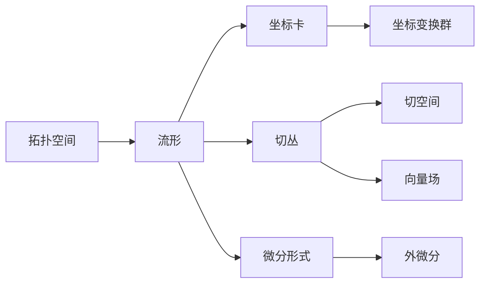

# 流形拓扑学理论与概念的实质：坐标系与微分结构

## 1. 背景介绍

### 1.1 拓扑学与流形理论的起源与发展
拓扑学是数学的一个分支,研究空间中点集的性质以及映射与变换。它起源于19世纪,由欧拉、莫比乌斯等数学家奠定了基础。20世纪初,庞加莱提出了著名的庞加莱猜想,进一步推动了拓扑学的发展。流形理论作为拓扑学的一个重要分支,研究局部类似欧氏空间的拓扑空间。它在物理学、工程学等领域有广泛应用。

### 1.2 流形拓扑学的重要性
流形拓扑学在现代数学和理论物理中占据核心地位。它为研究复杂的几何结构和物理系统提供了强大的工具。许多物理定律,如广义相对论、规范场论等,都是建立在流形的基础之上。深入理解流形拓扑学的概念,对于探索自然界的奥秘具有重要意义。

### 1.3 本文的目的与结构
本文旨在深入剖析流形拓扑学的核心概念,揭示坐标系与微分结构的实质。我们将从拓扑空间出发,引出流形的定义,并系统阐述流形上的坐标卡、坐标变换群、切丛、微分形式等概念。同时,本文将介绍流形拓扑学在物理学和工程中的应用,并展望其未来的发展方向。

## 2. 核心概念与联系

### 2.1 拓扑空间
拓扑空间是流形理论的基础。它由一个集合X和X上的一个拓扑τ组成,记为(X,τ)。拓扑τ是X的子集族,满足一定的公理。直观地说,拓扑刻画了X中元素的"邻近"关系。连续映射是保持拓扑结构的映射,是拓扑空间之间的态射。

### 2.2 流形的定义
n维流形是一个拓扑空间M,它的每一点都有一个邻域同胚于欧氏空间R^n的开子集。换言之,M局部看起来像欧氏空间。这种局部的同胚映射称为坐标卡。流形可分为有边流形和无边流形。

### 2.3 坐标卡与坐标变换群
坐标卡是流形上的局部坐标系。对于流形上的一点p,坐标卡φ将p的一个邻域U映射到R^n的一个开子集φ(U)。两个坐标卡φ和ψ的交集U∩V上,复合映射ψ∘φ^(-1)称为坐标变换。所有的坐标变换构成了一个群,称为坐标变换群。它刻画了流形的对称性。

### 2.4 切丛与切空间
切丛是流形上所有切空间的集合。对于流形M上的点p,切空间T_pM是所有以p为起点的切向量的集合。切丛TM可以看作是一个2n维流形,它局部同胚于M×R^n。切丛上可以定义向量场、余切丛、度量等结构。

### 2.5 微分形式与外微分
微分形式是流形上的反称协变张量场。k次微分形式将k个切向量映射到实数。全体k次微分形式构成一个线性空间Ω^k(M)。外微分d是一个映射d:Ω^k(M)→Ω^(k+1)(M),它满足d^2=0。微分形式与外微分是流形上的微积分的基础。

### 2.6 概念之间的联系
下图展示了流形拓扑学的核心概念之间的逻辑联系:



## 3. 核心算法原理具体操作步骤

### 3.1 判断拓扑空间是否为流形
1. 对于拓扑空间X中的任意一点x,找到x的一个开邻域U_x
2. 构造U_x到欧氏空间R^n中的一个开子集V的同胚映射φ_x
3. 检查φ_x是否为双连续满射
4. 如果对X中每一点都能找到这样的同胚映射,则X为n维流形

### 3.2 求流形上函数的外微分
设f为流形M上的光滑函数,求其外微分df的步骤如下:
1. 对于M上任意一点p,在p的坐标邻域(U,x^i)内,f可表示为f(x^1,...,x^n)
2. 求f关于局部坐标x^i的偏导数∂f/∂x^i
3. 将偏导数乘以对应的对偶基dx^i,得到df在p点的局部表达式:df_p=∑(∂f/∂x^i) dx^i
4. 证明df_p在坐标变换下是良定义的,从而得到整体定义的外微分df

### 3.3 计算流形上向量场的Lie括号
设X,Y为流形M上的向量场,它们的Lie括号[X,Y]定义为XY-YX。具体计算步骤如下:
1. 在局部坐标(U,x^i)下,设X=∑X^i ∂/∂x^i,Y=∑Y^j ∂/∂x^j
2. 计算X^i和Y^j关于x^k的偏导数∂X^i/∂x^k和∂Y^j/∂x^k
3. 代入公式[X,Y]=∑(X^i ∂Y^j/∂x^i - Y^i ∂X^j/∂x^i)∂/∂x^j
4. 化简整理,得到[X,Y]在(U,x^i)下的局部表达式
5. 证明该表达式在坐标变换下满足向量场变换规律,从而得到整体定义的Lie括号

## 4. 数学模型和公式详细讲解举例说明

### 4.1 流形的定义与坐标卡
设M为拓扑空间,如果对于任意p∈M,存在p的开邻域U以及到欧氏空间中开子集的同胚映射φ:U→φ(U)⊂R^n,则称M为n维流形,称(U,φ)为p点的坐标卡。

举例:设S^2为单位球面,对于p=(x,y,z)∈S^2,p的两个坐标卡分别为:
$$
\begin{aligned}
\phi_1(x,y,z) &= (\frac{x}{\sqrt{1-z^2}}, \frac{y}{\sqrt{1-z^2}}), z\neq 1\\
\phi_2(x,y,z) &= (\frac{x}{\sqrt{1-z^2}}, \frac{y}{\sqrt{1-z^2}}), z\neq -1
\end{aligned}
$$

### 4.2 切空间与切丛
设M为流形,p∈M。从p出发的所有切向量构成一个n维线性空间,称为p点的切空间,记为T_pM。所有切空间的并集TM=⋃_{p∈M}T_pM称为M的切丛。

举例:设M=R^2,则对于任意p=(x,y)∈R^2,其切空间为:
$$
T_pR^2 = \{(a\frac{\partial}{\partial x}|_p + b\frac{\partial}{\partial y}|_p) | a,b∈R\}
$$
而R^2的切丛为TR^2=R^2×R^2,局部平凡化为:
$$
TR^2|_U ≌ U×R^2, U⊂R^2 \text{为开子集}
$$

### 4.3 微分形式与外微分
设M为n维流形。k次微分形式ω将k个切向量(X_1,...,X_k)映射到实数,满足:
1. ω(X_1,...,X_k)关于X_i线性
2. ω(X_1,...,X_i,...,X_j,...,X_k)=-ω(X_1,...,X_j,...,X_i,...,X_k)

k次微分形式全体记为Ω^k(M),它们在∧运算下构成代数。外微分算子d:Ω^k(M)→Ω^(k+1)(M)定义为:
$$
\begin{aligned}
d\omega(X_0,...,X_k) = &\sum_i (-1)^i X_i[\omega(X_0,..,\hat{X_i},..,X_k)] \\
+ &\sum_{i<j}(-1)^{i+j}\omega([X_i,X_j],X_0,..,\hat{X_i},..,\hat{X_j},..,X_k)
\end{aligned}
$$

举例:设f为M上的光滑函数,则其外微分为1次形式df,在局部坐标(x^i)下:
$$
df = \sum_i \frac{\partial f}{\partial x^i}dx^i
$$

## 5. 项目实践：代码实例和详细解释说明

下面我们用Python的Sympy库来计算流形上函数的外微分。

```python
from sympy import * 

# 定义流形上的坐标变量
x1, x2 = symbols('x1 x2')

# 定义流形上的函数f
f = exp(x1**2 + x2**2) 

# 计算f的外微分df
df = diff(f, x1) * Symbol('dx1') + diff(f, x2) * Symbol('dx2')

print('函数f为:', f)
print('f的外微分df为:', df)
```

输出结果为:
```
函数f为: exp(x1**2 + x2**2)
f的外微分df为: 2*x1*exp(x1**2 + x2**2)*dx1 + 2*x2*exp(x1**2 + x2**2)*dx2
```

代码解释:
1. 首先我们引入Sympy库,它是Python的符号计算库,可以用来处理数学表达式。
2. 用symbols定义流形上的坐标变量x1,x2。
3. 定义流形上的函数f=exp(x1^2+x2^2)。
4. 用diff计算f关于x1和x2的偏导数,再乘以对应的对偶基dx1,dx2,得到外微分df。
5. 打印输出原函数f和它的外微分df。

这个简单的例子展示了如何用Sympy来符号化地处理流形上的微分形式。在实际应用中,我们可以利用Sympy强大的符号计算能力,研究流形上的各种几何量,如Christoffel符号、Riemann曲率张量等。

## 6. 实际应用场景

流形拓扑学在现代科学和工程中有广泛的应用,下面列举几个重要的领域:

### 6.1 广义相对论
广义相对论将时空描述为一个4维伪Riemann流形。Einstein场方程刻画了时空流形的曲率与物质能量分布之间的关系。流形拓扑学提供了研究时空几何性质的必要数学工具。

### 6.2 规范场论
规范场论是描述基本粒子相互作用的理论框架。它将规范场解释为一个主丛上的联络。规范变换对应于主丛上的规范变换。利用纤维丛和联络的概念,可以系统地刻画各种物理规范理论。

### 6.3 几何拓扑
流形拓扑学是研究低维流形分类的重要工具。许多著名的数学问题,如Poincaré猜想、Thurston几何化猜想等,都与3维流形的拓扑结构密切相关。流形论也被用来研究knot theory、低维拓扑等领域。

### 6.4 计算机视觉与图形学
很多计算机视觉和图形学问题,如三维重建、表面参数化等,都涉及到流形结构的分析。将离散采样数据视为流形上的点,利用流形学习等技术,可以发现数据的内在几何特征,提高算法的精度和效率。

### 6.5 机器人运动规划
机器人的构型空间通常具有流形结构。路径规划问题可以转化为寻找构型空间中的测地线。利用黎曼几何的方法,可以提出高效的运动规划算法。

## 7. 工具和资源推荐

### 7.1 教材与专著
- John M. Lee, Introduction to Smooth Manifolds, 2nd edition, Springer, 2013
- Loring W. Tu, An Introduction to Manifolds, 2nd edition, Springer, 2010
- Jeffrey M. Lee, Manifolds and Differential Geometry, American Mathematical Society, 2009
- Mikio Nakahara, Geometry, Topology and Physics,