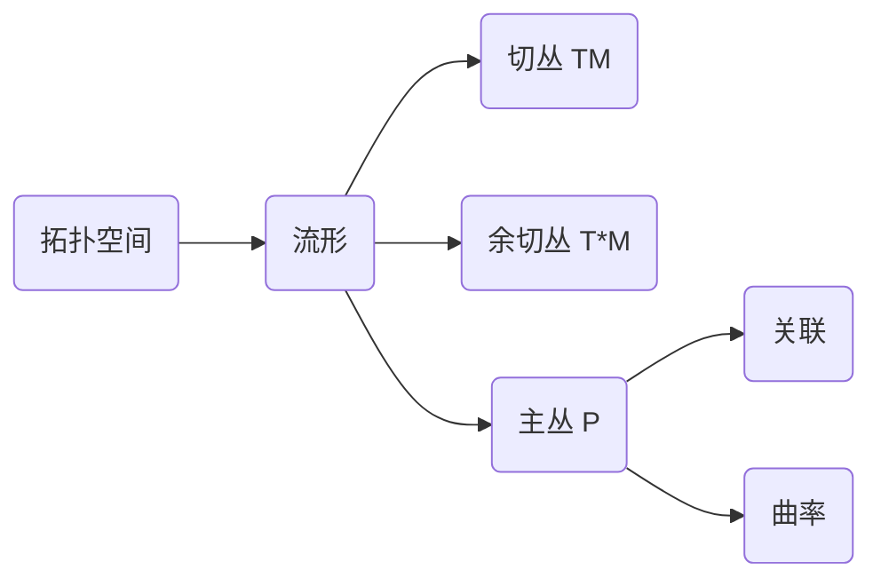

# 流形拓扑学：主丛与万有丛

## 1. 背景介绍
### 1.1 拓扑学与流形
拓扑学是数学的一个分支,研究空间中点集之间的性质,如连通性、紧致性等。而流形则是拓扑学的重要研究对象,它是一类局部与欧氏空间同胚的拓扑空间。流形的研究对于理解物理世界的时空结构、宇宙的几何形状等有着重要意义。

### 1.2 纤维丛理论
纤维丛是流形上的一种特殊结构,由底空间、纤维空间和投射映射组成。直观地说,纤维丛就像是把一个空间(纤维)沿着另一个空间(底空间)的每一点"粘贴"起来。纤维丛理论在现代物理学和几何学中有着广泛应用。

### 1.3 主丛与万有丛
主丛和万有丛是两类重要的纤维丛。主丛的每一个纤维都装备了一个群作用,且这些作用在不同纤维之间以一种"相容"的方式粘合在一起。万有丛则可以看作主丛在给定表示下的"关联丛",它刻画了流形上的联络、曲率等几何量。

## 2. 核心概念与联系
### 2.1 拓扑空间与连续映射
- 拓扑空间:由一个集合X和X上的一个拓扑τ组成的二元组(X,τ)。直观地说,拓扑给出了"邻域"、"极限"等概念。
- 连续映射:设X,Y是拓扑空间,f:X→Y,若f在X中每一点处都连续,则称f为X到Y的连续映射。

### 2.2 流形、切丛、余切丛
- 流形:一个拓扑空间M,若它的每一点都有一个同胚于欧氏空间的开邻域。
- 切丛TM:由流形M上所有切向量构成的集合。每一点p∈M的切空间TpM都看作TM在p处的纤维。
- 余切丛T*M:切丛TM的对偶丛,由流形M上所有余切向量构成的集合。

### 2.3 纤维丛、主丛、关联
- 纤维丛:由底空间B、纤维F、投射π:E→B组成的空间E,并满足局部平凡性条件。
- G主丛:纤维丛P(B,F)若满足:1)F=G为群;2)G在P上自由、传递作用;3)局部平凡性。
- 关联:主丛上的一种联络形式,刻画了纤维在平行移动过程中的变化率。

### 2.4 Mermaid图解


## 3. 核心算法原理具体操作步骤
### 3.1 主丛的构造算法
输入:流形M,结构群G
1. 取M的一个开覆盖{Uα},每个Uα都同胚于欧氏空间Rn。
2. 对每个Uα,作平凡主丛Pα=Uα×G。
3. 在Uα∩Uβ≠∅处,定义Pα到Pβ的转移函数gαβ:Uα∩Uβ→G。
4. 粘合所有的Pα,得到G主丛P。

### 3.2 切丛的构造算法
输入:流形M
1. 对每个p∈M,构造p点的切空间TpM。
2. 作不交并TM=∐p∈MTpM。
3. 赋予TM合适的拓扑结构,使其成为流形M上的向量丛。

### 3.3 主丛上联络的构造
输入:主丛P(M,G),Lie代数g
1. 在P上选取G-不变的g值1形式ω。
2. 对X,Y∈TP,定义∇XY=[X,Y]+ω(X)Y。
3. 由∇诱导水平子丛HP⊂TP,则HP⊕VP=TP为Whitney和。

## 4. 数学模型和公式详细讲解举例说明
### 4.1 主丛的定义与性质
设M为流形,G为Lie群,P(M,G)为丛空间,π:P→M为投射。若满足:
1) G在P上自由、传递作用;
2) M上存在开覆盖{Uα},使得π-1(Uα)≌Uα×G。
则称P(M,G)为M上的一个G主丛。

例如:设M=S1,G=SO(2),则M上的SO(2)主丛P可以看作是在S1的每一点处"粘贴"一个圆。

### 4.2 主丛上的联络
设P(M,G)为主丛,g为G的Lie代数,ω∈Ω1(P;g)为一个g值1形式。若满足:
1) ω(A*)=A,∀A∈g;
2) R*gω=Adg-1ω,∀g∈G。
其中A*为A诱导的P上的基本向量场,Rg为G在P上的右作用。则称ω为P上的一个联络形式。

联络ω在P上诱导水平子丛HP,满足TP=HP⊕VP,其中VP为垂直子丛。

例如:设P=M×G为平凡主丛,则ω=g-1dg为P上的典范联络,其中g:P→G为第二个分量的投射。

### 4.3 曲率与Maurer-Cartan方程
设ω为主丛P上的联络形式,则ω的曲率形式Ω∈Ω2(P;g)定义为
$$
\Omega=d\omega+\frac{1}{2}[\omega,\omega]
$$
其中$[\cdot,\cdot]$为g上的Lie括号。可以证明,Ω满足Maurer-Cartan方程:
$$
d\Omega+[\omega,\Omega]=0
$$

例如:对于平凡主丛P=M×G及其上的典范联络ω=g-1dg,有
$$
\Omega=dω+\frac{1}{2}[\omega,\omega]=0
$$

## 5. 项目实践：代码实例和详细解释说明
以下使用Python的Numpy和Matplotlib库,通过模拟平行移动来可视化主丛上的联络。

```python
import numpy as np
import matplotlib.pyplot as plt

def connection_form(t, theta):
    """
    计算在点(t,theta)处的联络形式ω
    """
    return np.array([0, 1])

def parallel_transport(t0, t1, theta0, omega):
    """
    计算从(t0,theta0)到(t1,theta0)的平行移动
    """
    dt = 0.001  # 时间步长
    T = np.arange(t0, t1, dt)
    Theta = [theta0]
    for t in T[:-1]:
        theta = Theta[-1]
        dtheta = omega(t, theta).dot(np.array([dt, 0]))
        Theta.append(theta + dtheta)
    return T, np.array(Theta)

# 主丛P的基空间[0,1]
M = np.arange(0, 1, 0.01)

# 计算平行移动
T1, Theta1 = parallel_transport(0, 1, 0, connection_form)  
T2, Theta2 = parallel_transport(0, 1, np.pi/2, connection_form)

# 可视化
plt.figure(figsize=(8,4))
plt.subplot(121)
plt.plot(T1, Theta1, 'r')
plt.xlabel('t')
plt.ylabel(r'$\theta$')
plt.title('Parallel Transport')

plt.subplot(122)
plt.plot(np.cos(Theta1), np.sin(Theta1), 'r')  
plt.plot(np.cos(Theta2), np.sin(Theta2), 'g')
plt.xlabel('x')
plt.ylabel('y')
plt.title('Fiber Bundles')
plt.tight_layout()
plt.show()
```

在这个例子中:
- 主丛P的底空间M为时间区间[0,1],典型纤维F为圆周S1。
- connection_form(t,theta)定义了联络形式ω,这里取为常值[0,1]。
- parallel_transport(t0,t1,theta0,omega)通过数值积分计算从初始点(t0,theta0)到终点(t1,theta0)的平行移动。
- 左图展示了两条平行移动的轨迹theta(t),右图展示了主丛P在不同时刻t的纤维。

可以看到,沿着底空间M上不同的道路,纤维F上的点会发生不同的平行移动。这体现了主丛P的联络结构。

## 6. 实际应用场景
主丛和联络理论在现代物理学和几何学中有着广泛的应用,例如:

### 6.1 规范场论
在粒子物理的规范场论中,相互作用通过规范势(即主丛上的联络)来引入。例如:
- 电磁场可以看作是U(1)规范理论,联络为电磁势A。
- 弱相互作用对应SU(2)规范理论,强相互作用对应SU(3)规范理论。

### 6.2 广义相对论
在广义相对论中,时空是一个4维黎曼流形(M,g)。物质场和规范场都对应M上的某个丛。
- 物质场ψ通常是M上某个表示丛E(M,V)的截面。
- 规范场A对应一个主丛P(M,G)上的联络。
- 广义相对论中的平行移动由Levi-Civita联络(即度规g诱导的联络)给出。

### 6.3 纤维丛与规范理论
在现代的规范理论中,物理量通常被描述为某个纤维丛上的截面。
- 物质场ψ∈Γ(E),其中E为表示丛。
- 规范场A∈Γ(T*M⊗Ad P),其中Ad P为主丛P的伴随丛。
- 这种纤维丛描述使得局域规范不变性成为一种自然的几何对称性。

## 7. 工具和资源推荐
对主丛和联络理论的深入学习,推荐以下资源:

### 7.1 教材
- 《Topology, Geometry and Gauge fields: Foundations》,Gregory L. Naber
- 《Gauge Fields, Knots and Gravity》,John Baez,Javier P. Muniain
- 《Fibre Bundles》,Dale Husemoller

### 7.2 论文
- 《Gauge Theory and Variational Principles》,David Bleecker
- 《Fiber Bundles and Quantum Theory》,Charles Nash,Siddhartha Sen
- 《Mathematical Gauge Theory: With Applications to the Standard Model of Particle Physics》,Mark J.D. Hamilton

### 7.3 软件工具
- Mathematica的DifferentialGeometry包
- Python的Sage、Numpy、Matplotlib库
- C++的Eigen、VTK库

## 8. 总结：未来发展趋势与挑战
主丛和联络理论作为现代几何学和物理学的核心工具,在未来仍有巨大的发展潜力,但同时也面临着诸多挑战:

### 8.1 非交换规范理论
目前的规范理论大多基于Lie群,其Lie代数都是交换的。但在某些物理模型(如非交换几何)中,需要考虑非交换的规范群。非交换规范理论的系统构建尚需进一步探索。

### 8.2 量子引力
在拓扑量子场论和圈量子引力等尝试将广义相对论量子化的理论中,人们发现纤维丛和联络理论可能扮演着关键角色。但如何在量子引力的框架下系统地刻画时空的拓扑和几何结构,目前仍没有定论。

### 8.3 计算复杂性
主丛、联络和曲率的计算往往涉及复杂的符号运算和数值计算。如何设计高效的算法来处理高维流形上的纤维丛结构,是计算物理和计算几何的一大挑战。

### 8.4 物理应用前景
主丛和联络理论在粒子物理、量子场论、弦论等领域都有着重要应用。这些理论在未来物理学的发展中无疑将扮演更加突出的角色。同时,将纤维丛几何思想应用到凝聚态物理、材料科学等新领域,也是一个有前景的方向。

## 9. 附录：常见问题与解答
### Q1:主丛和纤维丛有什么区别?
A1:主丛是一种特殊的纤维丛,其纤维都是某个群G,且G在丛空间上的作用满足一些特殊条件。一般的纤维丛不要求纤维是群,也没