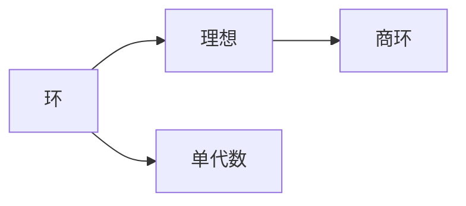

# 环与代数：单代数的结构定理

## 1. 背景介绍
### 1.1 环论与代数学的渊源
环论是现代代数学的重要分支,它研究加法和乘法运算的代数系统。环论的发展可以追溯到19世纪,当时数学家们开始系统地研究多项式环、矩阵环等代数结构。20世纪初,艾米·诺特、希尔伯特等数学家奠定了抽象环论的基础。如今,环论已经成为了代数学的核心内容之一,在数论、几何、拓扑等数学分支中有着广泛应用。

### 1.2 单代数的重要性
在环论中,一类特殊的环称为单代数,它是由单个生成元生成的环。单代数虽然结构相对简单,但在代数学中有着不可或缺的地位。很多重要的代数结构,如多项式环、矩阵代数等都可以看作是单代数。单代数的结构定理揭示了单代数的本质特征,对深入理解环论有重要意义。

### 1.3 单代数结构定理的发展历程
单代数结构定理经历了一个逐步发展完善的过程。1870年,德国数学家戈登首次给出了单代数结构定理的雏形。此后,诺特、阿廷等数学家对该定理进行了推广和深化。直到20世纪中期,单代数结构定理才最终完善,成为环论的经典结果之一。这一定理的发展历程体现了现代代数的逻辑严密性和抽象性特点。

## 2. 核心概念与联系
### 2.1 环的定义与性质
环是一个集合R,在R上定义了加法和乘法两种运算,满足以下条件:
1. R对加法构成交换群;
2. 乘法满足结合律;  
3. 乘法对加法满足分配律。

环的概念是抽象代数的基础,众多代数结构如群环、李代数等都是环论的进一步推广。

### 2.2 理想与商环
设R为环,R的子集I称为R的理想,如果:
1. I对加法运算封闭;
2. 对任意r∈R,a∈I,有ra∈I。

由理想I可以定义商环R/I,其元素为R中模I同余的等价类。商环是环论中的重要构造方法。

### 2.3 单代数的定义
设R为环,如果存在元素a∈R,使得R中任意元素r都可以表示为a的多项式,即:

$$r=f(a),\ f(x)∈R[x]$$

则称R为单代数,a称为R的生成元。

### 2.4 核心概念之间的联系


单代数是环的特例,它由单个生成元生成。环的理想与商环密切相关,由环和理想可以构造出商环。这些概念之间环环相扣,构成了环论的基本框架。

## 3. 核心算法原理具体操作步骤
判断一个环是否为单代数,可以按照以下步骤进行:

### 3.1 确定环的生成元
首先要找到环的一个生成元a,使得环中任意元素都可以表示为a的多项式。通常可以枚举环的元素,检验是否满足生成元的条件。

### 3.2 验证生成元的性质
对于环R中任取元素r,验证是否存在多项式f(x),使得r=f(a)。如果对任意r都能找到对应的多项式,则a是R的生成元,R为单代数。

### 3.3 计算单代数的阶
单代数R的阶定义为使得$a^n=0$成立的最小正整数n,其中a为R的生成元。单代数的阶反映了单代数的特征。

### 3.4 判断单代数的类型
根据单代数的阶和特征,可以判断单代数属于以下哪种类型:
1. 域,如果R的阶为素数;
2. 局部环,如果R有唯一的极大理想;
3. 主理想整环,如果R的理想均由单个元素生成;
4. 一般的单代数。

通过以上步骤,我们可以系统地判定一个环是否为单代数,并进一步刻画单代数的性质。

## 4. 数学模型和公式详细讲解举例说明
### 4.1 单代数的判定公式
设R为环,a∈R。如果对任意r∈R,都存在多项式f(x)使得:

$$r=f(a)=c_0+c_1a+c_2a^2+\cdots+c_na^n,\ c_i∈R$$

则R为单代数,a为R的生成元。这个公式给出了判定单代数的充要条件。

### 4.2 单代数的结构定理
单代数的结构定理描述了单代数的一般形式。设R为单代数,p为R的特征,n为R的阶,则R同构于商环:

$$R\cong \frac{F[x]}{(x^n)},$$

其中F为p元域,即$F=\mathbb{Z}/p\mathbb{Z}$。这个定理揭示了单代数的本质结构。

举例来说,对于单代数$\mathbb{Z}/4\mathbb{Z}$,其特征为4,阶为2。根据结构定理,有:

$$\mathbb{Z}/4\mathbb{Z} \cong \frac{(\mathbb{Z}/2\mathbb{Z})[x]}{(x^2)}$$

这说明$\mathbb{Z}/4\mathbb{Z}$同构于2元域上的一元多项式环模$x^2$生成的理想。

### 4.3 单代数的极小多项式
设R为单代数,a为R的生成元。多项式$f(x)∈R[x]$称为a的极小多项式,如果:
1. $f(a)=0$;
2. f(x)在R[x]中不可约;
3. f(x)是满足1,2的次数最低的多项式。

极小多项式刻画了单代数生成元的代数性质。例如,在$\mathbb{Z}/4\mathbb{Z}$中,生成元$\overline{1}$的极小多项式为$x^2$。

## 5. 项目实践：代码实例和详细解释说明
下面我们用Python代码来实现判断一个环是否为单代数的算法。

```python
def is_monogenic_algebra(R):
    """
    判断环R是否为单代数
    """
    for a in R:
        if is_generator(a, R):
            return True
    return False

def is_generator(a, R):
    """
    判断a是否为环R的生成元
    """
    for r in R:
        if not is_polynomial(r, a, R):
            return False
    return True

def is_polynomial(r, a, R):
    """
    判断r是否可以表示为a的多项式
    """
    n = order(a, R)
    for coeffs in itertools.product(R, repeat=n):
        if sum(c * a**i for i, c in enumerate(coeffs)) == r:
            return True
    return False

def order(a, R):
    """
    计算a在环R中的阶
    """
    n = 1
    while a**n != 0:
        n += 1
    return n
```

这段代码定义了几个函数:
- `is_monogenic_algebra`: 判断环R是否为单代数,通过枚举R中元素,检查是否存在生成元。
- `is_generator`: 判断a是否为环R的生成元,通过验证R中每个元素是否可以表示为a的多项式。
- `is_polynomial`: 判断r是否可以表示为a的多项式,通过枚举所有可能的系数组合进行验证。
- `order`: 计算a在环R中的阶,即满足$a^n=0$的最小正整数n。

利用这些函数,我们可以方便地判断一个环是否为单代数。例如,对于环$\mathbb{Z}/4\mathbb{Z}$:

```python
R = [0, 1, 2, 3]  # Z/4Z的元素
print(is_monogenic_algebra(R))  # 输出 True
```

输出结果为True,说明$\mathbb{Z}/4\mathbb{Z}$是一个单代数。这与前面的理论分析是一致的。

## 6. 实际应用场景
单代数在代数学研究中有广泛应用,下面列举几个主要的应用场景:

### 6.1 编码理论
在编码理论中,循环码是一类重要的线性码,其编码函数可以表示为单代数上的多项式运算。利用单代数的结构定理,可以刻画循环码的生成多项式和校验多项式,为编码和译码提供了代数工具。

### 6.2 密码学
单代数在密码学中也有重要应用。例如,有限域上的单代数可以用于构造伪随机数生成器、设计分组密码算法等。单代数的离散对数问题是一类重要的密码学难题,在公钥密码体制中有广泛应用。

### 6.3 序列分析
在序列分析中,线性反馈移位寄存器(LFSR)是一种常用的序列生成器。LFSR可以用单代数上的多项式来刻画,其输出序列对应于单代数中的元素。利用单代数的性质,可以分析LFSR生成序列的周期、线性复杂度等特征。

### 6.4 计算机代数
在计算机代数系统(如Mathematica、Maple)中,单代数是一种基本的代数结构。利用单代数的运算法则,可以在计算机上高效实现多项式的加法、乘法、除法等运算,为符号计算提供了重要的代数基础。

## 7. 工具和资源推荐
对于深入学习单代数理论和应用,以下资源可供参考:

### 7.1 书籍
- 《A First Course in Abstract Algebra》(John B. Fraleigh) : 经典的抽象代数教材,对单代数有深入讲解。
- 《Algebra: Chapter 0》(Paolo Aluffi) : 现代风格的代数学教材,从范畴论的角度讨论单代数。
- 《Coding Theory: A First Course》(San Ling, Chaoping Xing) : 编码理论的入门教材,介绍了单代数在编码中的应用。

### 7.2 开源代码库
- Sage: 开源的数学软件,内置了丰富的代数学工具,支持单代数运算。
- Magma: 专业的计算代数系统,在代数几何、密码学等领域有广泛应用。
- PARI/GP: 开源的数论软件,提供了多项式环、有限域等单代数结构的计算函数。

### 7.3 研究论文
- On the Structure of Finite Monogenic Algebras (N. Jacobson, 1945) : Jacobson的经典论文,系统阐述了有限单代数的结构理论。
- Monogenic Algebras and Their Representations (R. S. Pierce, 1967) : Pierce的综述性文章,全面介绍了单代数的表示理论。
- Monogenic Algebras in Coding Theory and Cryptography (J. Pieprzyk, 1991) : Pieprzyk的论文,讨论了单代数在编码和密码学中的应用。

这些资源可以帮助读者全面深入地学习单代数的理论基础和前沿应用。

## 8. 总结：未来发展趋势与挑战
单代数作为环论的重要分支,在代数学研究中有着悠久的历史和广泛的应用。单代数结构定理揭示了单代数的一般形式,为研究单代数的性质提供了理论基础。同时,单代数在编码理论、密码学、序列分析等领域也有重要应用。

未来,单代数的研究将向以下几个方向发展:

### 8.1 与其他代数结构的融合
单代数与群环、Hopf代数等代数结构有着密切联系。深入探讨单代数与这些代数结构之间的关系,有助于发现新的代数学理论和方法。例如,利用Hopf代数的余代数结构,可以构造出单代数的对偶空间,这为研究单代数的表示论提供了新的思路。

### 8.2 在新领域中的应用拓展
除了传统的编码理论、密码学等领域,单代数在一些新兴领域中也有广阔的应用前景。例如,在量子计算中,单代数可以用于构造量子纠错码、量子秘密共享协议等。在机器学习中,单代数可以用于设计卷积神经网络的代数结构。挖掘单代数在这些领域中的应用潜力,将是未来研究的重点之一。

### 8.3 计算方法的改进
随着单代数应用规模的不断扩大,对单代数计