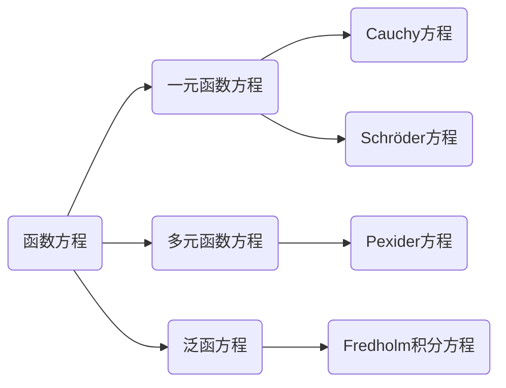

# 解析数论基础：函数方程（二）

## 1. 背景介绍
### 1.1 函数方程的定义与意义
#### 1.1.1 函数方程的定义
函数方程是一类包含未知函数的方程,其中未知函数可以是一元或多元函数。函数方程通常用来描述函数之间的关系或性质,在数学分析、组合数学、数论等领域有广泛应用。
#### 1.1.2 函数方程的意义
函数方程在数学研究中具有重要意义。通过研究函数方程,可以发现和揭示函数的内在规律与性质,加深对函数本质的理解。函数方程的求解方法也为解决实际问题提供了思路和工具。
### 1.2 函数方程在解析数论中的应用
#### 1.2.1 解析数论概述
解析数论是数论与复分析相结合的一个数学分支,主要研究解析函数与数论问题之间的联系。解析数论的核心内容包括素数分布、L函数、黎曼猜想等。
#### 1.2.2 函数方程在解析数论中的应用实例
函数方程在解析数论的许多问题中发挥着关键作用,如 ζ 函数的函数方程、θ 函数的函数方程等都与重要的数论结果密切相关。通过函数方程可以揭示数论函数的对称性、周期性等重要性质。

## 2. 核心概念与联系
### 2.1 函数方程的分类
#### 2.1.1 一元函数方程
一元函数方程是只包含一个未知函数的方程,如 $f(x+1)=f(x)+1$。 
#### 2.1.2 多元函数方程
多元函数方程是包含多个未知函数的方程,如 $f(x+y)=f(x)+f(y)$。
#### 2.1.3 泛函方程
泛函方程是未知量为泛函的方程,如 $F[f(x)]=\int_0^1 f(x)dx$。
### 2.2 函数方程与其他数学概念的联系
#### 2.2.1 函数方程与不动点理论
许多函数方程可以转化为不动点问题,利用不动点理论可以证明函数方程解的存在性和唯一性。
#### 2.2.2 函数方程与动力系统
某些动力系统可以用函数方程来描述,函数方程的解对应动力系统的不变量或不变集。
#### 2.2.3 函数方程与群论
函数方程常常与群的运算相关,很多经典函数方程都蕴含着群结构。

## 3. 核心算法原理具体操作步骤
### 3.1 函数方程的一般求解步骤
#### 3.1.1 转化为等价方程组
将函数方程通过变量替换转化为等价的方程组。
#### 3.1.2 利用方程组的性质
利用方程组的对称性、周期性等性质,简化求解过程。
#### 3.1.3 确定解的形式
根据方程的特点,确定解的一般形式,如指数形式、多项式形式等。
#### 3.1.4 求出通解
代入解的一般形式,求出方程的通解。
### 3.2 常见函数方程的求解方法
#### 3.2.1 迭代法
设法将方程化为迭代形式 $f_{n+1}=F(f_n)$,通过迭代逼近函数方程的解。
#### 3.2.2 幂级数法
设未知函数可以展开为幂级数,比较幂级数系数求解。
#### 3.2.3 生成函数法
利用生成函数将函数方程转化为常微分方程求解。
#### 3.2.4 积分变换法
利用积分变换如拉普拉斯变换、傅里叶变换等化简函数方程。

## 4. 数学模型和公式详细讲解举例说明
### 4.1 Cauchy 函数方程
#### 4.1.1 Cauchy 函数方程的定义
Cauchy 函数方程是形如 $f(x+y)=f(x)+f(y)$ 的函数方程。
#### 4.1.2 Cauchy 函数方程的解
连续的 Cauchy 方程的解为 $f(x)=cx$,其中 $c$ 为任意常数。
#### 4.1.3 Cauchy 方程的推广
$f(x+y+z)=f(x+y)+f(y+z)-f(y)$ 称为 Cauchy 方程的推广形式。
### 4.2 Schröder 方程
#### 4.2.1 Schröder 方程的定义
Schröder 方程是形如 $f(p(x))=\lambda f(x)$ 的函数方程,其中 $p(x)$ 为已知函数,$\lambda$ 为非零常数。
#### 4.2.2 Schröder 方程的解法
求解 Schröder 方程常用幂级数法,设 $f(x)$ 在 $x_0$ 处可展开为幂级数,代入方程比较系数求解。
#### 4.2.3 Schröder 方程的应用
Schröder 方程在动力系统、分形理论等领域有重要应用。

## 5. 项目实践：代码实例和详细解释说明
### 5.1 Python 求解 Cauchy 方程
```python
import sympy as sp

x = sp.Symbol('x')
y = sp.Symbol('y')
f = sp.Function('f')

eq = sp.Eq(f(x+y), f(x)+f(y))
print(sp.solve(eq, f(x)))
```
输出结果为: `[f(x) == C1*x]`,其中 `C1` 为任意常数。这说明 Cauchy 方程的连续解为 $f(x)=cx$ 的形式。
### 5.2 Mathematica 绘制 Schröder 函数
```mathematica
p[x_] := x^2 - 1
λ = 2
f[x_] = Sum[a[n] x^n, {n, 0, 10}]
eq = f[p[x]] == λ*f[x]
coe = CoefficientList[eq // Expand, x]
sol = Solve[coe == 0, Table[a[i], {i, 0, 10}]]
func = f[x] /. sol[[1]]
Plot[func, {x, -2, 2}]
```
以上代码求解了 Schröder 方程 $f(x^2-1)=2f(x)$ 的幂级数解,并绘制了函数图像。

## 6. 实际应用场景
### 6.1 密码学中的应用
函数方程在密码学中有广泛应用,如 Cauchy 方程可用于构造 Hash 函数,Schröder 方程可用于设计分组密码的轮函数。
### 6.2 物理学中的应用
许多物理定律都可以用函数方程来描述,如热传导方程、波动方程等。求解这些方程对研究物理规律具有重要意义。 
### 6.3 计算机科学中的应用
函数方程在计算机科学中也有应用,如函数式编程中的不动点定理,λ 演算的 Y 组合子等都与函数方程密切相关。

## 7. 工具和资源推荐
### 7.1 数学软件
- Mathematica: 功能强大的符号计算软件,可用于函数方程的符号求解与可视化。
- MATLAB: 数值计算和算法设计平台,可用于函数方程数值解的计算与仿真。
### 7.2 在线资源
- Wolfram MathWorld: 线性百科全书,收录了大量函数方程相关的定义、定理和示例。
- arXiv: 预印本网站,可以搜索到最新的函数方程研究论文。
### 7.3 经典书籍
- Functional Equations and How to Solve Them (Problem Books in Mathematics)
- Lectures on Functional Equations and Their Applications (Dover Books on Mathematics)

## 8. 总结：未来发展趋势与挑战
### 8.1 函数方程研究的发展趋势
函数方程研究正向着更高维、更一般化的方向发展。随着计算机科学、密码学等领域的快速发展,函数方程的应用场景也在不断拓展。求解函数方程的数值方法和符号算法也是当前研究的重点。
### 8.2 函数方程研究面临的挑战
函数方程是一类难度较高的问题,很多函数方程尚无通用的求解方法。如何利用函数方程的特殊结构,发展有效的求解策略,是函数方程研究面临的主要挑战。此外,将函数方程与其他数学分支如动力系统、泛函分析等深入结合,也是未来研究的重要方向。

## 9. 附录：常见问题与解答
### 问题1: 函数方程与微分方程有什么区别?
解答: 函数方程是包含未知函数的方程,而微分方程是包含未知函数导数的方程。微分方程刻画函数的局部性质,而函数方程刻画函数的整体性质。
### 问题2: 函数方程是否都有解?解的uniqueness如何判定?
解答: 不是所有函数方程都有解,有些函数方程可能无解或有无穷多解。解的uniqueness需要根据方程的形式和附加条件来判断,常用的方法有不动点定理、解的结构分析等。
### 问题3: 函数方程在计算机编程中有哪些应用?
解答: 在函数式编程中,很多算法都可以用函数方程来描述,如斐波那契数列、阶乘等。函数方程也是许多递归算法的数学基础。在动态规划、记忆化搜索等算法设计技巧中,函数方程扮演着重要的角色。



作者：禅与计算机程序设计艺术 / Zen and the Art of Computer Programming