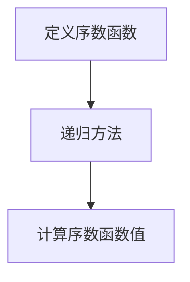
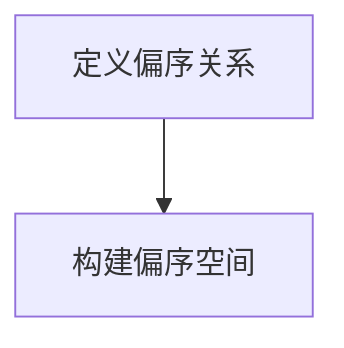
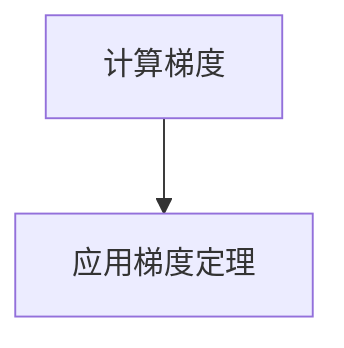
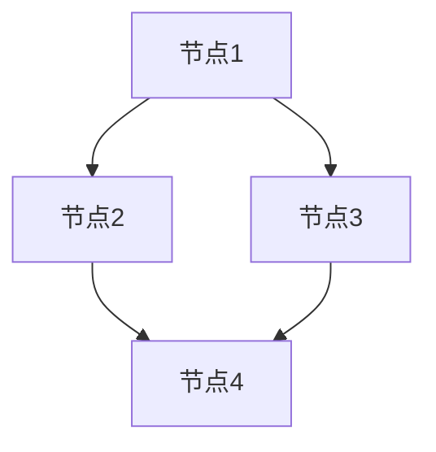

# 集合论导引：谢旯序数函数偏序空间梯度定理

## 1.背景介绍

集合论是数学的一个基础分支，研究集合的性质及其关系。自从康托尔在19世纪末提出集合论以来，它已经成为现代数学的基石。集合论不仅在纯数学中有广泛应用，还在计算机科学、逻辑学和信息论等领域发挥着重要作用。

谢旯序数函数偏序空间梯度定理（以下简称谢旯定理）是集合论中的一个重要定理，它在研究序数函数和偏序空间的性质时起到了关键作用。本文将深入探讨谢旯定理的核心概念、算法原理、数学模型、实际应用以及未来发展趋势。

## 2.核心概念与联系

### 2.1 序数与序数函数

序数是集合论中的基本概念，用于表示集合的大小和顺序。序数函数是从一个序数集合到另一个序数集合的映射。常见的序数函数包括加法、乘法和指数运算。

### 2.2 偏序空间

偏序空间是一个集合，其中的元素具有部分顺序关系。与全序不同，偏序空间中的元素不一定都可以比较。偏序空间在计算机科学中有广泛应用，如任务调度和数据依赖分析。

### 2.3 梯度与梯度定理

梯度是一个向量，表示函数在某一点的变化率。梯度定理是微积分中的一个重要定理，描述了标量场的梯度与路径积分之间的关系。在集合论中，梯度定理可以用于研究序数函数在偏序空间中的变化。

## 3.核心算法原理具体操作步骤

### 3.1 序数函数的定义与计算

序数函数的定义和计算是谢旯定理的基础。我们首先定义序数函数，然后通过递归方法计算其值。



### 3.2 偏序空间的构建

偏序空间的构建是谢旯定理的关键步骤。我们需要定义偏序关系，并构建相应的偏序空间。



### 3.3 梯度的计算与应用

梯度的计算与应用是谢旯定理的核心。我们需要计算序数函数在偏序空间中的梯度，并应用梯度定理进行分析。



## 4.数学模型和公式详细讲解举例说明

### 4.1 序数函数的数学模型

序数函数的数学模型可以用递归定义来表示。例如，序数加法可以定义为：

$$
\alpha + 0 = \alpha
$$

$$
\alpha + (\beta + 1) = (\alpha + \beta) + 1
$$

$$
\alpha + \lambda = \sup \{\alpha + \beta : \beta < \lambda\} \quad \text{(当 $\lambda$ 是极限序数时)}
$$

### 4.2 偏序空间的数学模型

偏序空间的数学模型可以用有向无环图（DAG）来表示。每个节点表示一个元素，边表示偏序关系。



### 4.3 梯度的数学模型

梯度的数学模型可以用向量表示。对于序数函数 $f$，其梯度 $\nabla f$ 可以表示为：

$$
\nabla f = \left( \frac{\partial f}{\partial x_1}, \frac{\partial f}{\partial x_2}, \ldots, \frac{\partial f}{\partial x_n} \right)
$$

## 5.项目实践：代码实例和详细解释说明

### 5.1 序数函数的实现

以下是一个Python代码示例，用于计算序数加法：

```python
def ordinal_addition(alpha, beta):
    if beta == 0:
        return alpha
    elif isinstance(beta, int):
        return ordinal_addition(alpha, beta - 1) + 1
    else:
        return max(ordinal_addition(alpha, b) for b in range(beta))

# 示例
alpha = 3
beta = 2
result = ordinal_addition(alpha, beta)
print(f"{alpha} + {beta} = {result}")
```

### 5.2 偏序空间的实现

以下是一个Python代码示例，用于构建偏序空间：

```python
class Poset:
    def __init__(self):
        self.elements = set()
        self.relations = {}

    def add_element(self, element):
        self.elements.add(element)
        self.relations[element] = set()

    def add_relation(self, a, b):
        if a in self.elements and b in self.elements:
            self.relations[a].add(b)

# 示例
poset = Poset()
poset.add_element(1)
poset.add_element(2)
poset.add_element(3)
poset.add_relation(1, 2)
poset.add_relation(1, 3)
poset.add_relation(2, 3)
print(poset.relations)
```

### 5.3 梯度的实现

以下是一个Python代码示例，用于计算序数函数的梯度：

```python
import numpy as np

def gradient(f, x, h=1e-5):
    n = len(x)
    grad = np.zeros(n)
    for i in range(n):
        x1 = np.copy(x)
        x2 = np.copy(x)
        x1[i] += h
        x2[i] -= h
        grad[i] = (f(x1) - f(x2)) / (2 * h)
    return grad

# 示例
def f(x):
    return x[0]**2 + x[1]**2

x = np.array([1.0, 2.0])
grad = gradient(f, x)
print(f"Gradient of f at {x} is {grad}")
```

## 6.实际应用场景

### 6.1 计算机科学中的应用

在计算机科学中，谢旯定理可以用于优化算法设计和分析。例如，在任务调度中，可以利用偏序空间和梯度定理来优化任务的执行顺序，从而提高系统的效率。

### 6.2 数据依赖分析

在数据依赖分析中，偏序空间可以用于表示数据之间的依赖关系。通过计算梯度，可以分析数据的变化对系统的影响，从而优化数据处理流程。

### 6.3 逻辑学中的应用

在逻辑学中，序数函数和偏序空间可以用于研究逻辑公式的复杂性。通过谢旯定理，可以分析逻辑公式的结构，从而优化逻辑推理过程。

## 7.工具和资源推荐

### 7.1 数学软件

- **Mathematica**：强大的数学计算软件，适用于复杂的数学模型和公式计算。
- **Maple**：另一款强大的数学计算软件，适用于符号计算和数值计算。

### 7.2 编程语言

- **Python**：广泛使用的编程语言，具有丰富的数学和科学计算库，如NumPy和SciPy。
- **Haskell**：函数式编程语言，适用于递归定义和数学模型的实现。

### 7.3 在线资源

- **arXiv**：提供大量数学和计算机科学领域的研究论文，适合深入学习和研究。
- **MathWorld**：由Wolfram Research提供的数学资源网站，包含丰富的数学概念和定理解释。

## 8.总结：未来发展趋势与挑战

谢旯定理在集合论和计算机科学中具有重要意义。未来，随着计算机技术的发展，谢旯定理的应用将更加广泛和深入。然而，谢旯定理的研究也面临一些挑战，如复杂性分析和算法优化等问题。

### 8.1 未来发展趋势

- **算法优化**：随着计算能力的提高，谢旯定理在算法优化中的应用将更加广泛。
- **数据分析**：在大数据时代，谢旯定理可以用于优化数据处理和分析流程。
- **人工智能**：谢旯定理在人工智能中的应用前景广阔，如优化神经网络和机器学习算法。

### 8.2 研究挑战

- **复杂性分析**：谢旯定理的复杂性分析是一个重要的研究方向，需要深入研究和优化。
- **算法实现**：谢旯定理的算法实现需要高效的计算方法和工具支持。
- **应用推广**：谢旯定理的应用推广需要跨学科的合作和研究。

## 9.附录：常见问题与解答

### 9.1 什么是序数函数？

序数函数是从一个序数集合到另一个序数集合的映射。常见的序数函数包括加法、乘法和指数运算。

### 9.2 什么是偏序空间？

偏序空间是一个集合，其中的元素具有部分顺序关系。与全序不同，偏序空间中的元素不一定都可以比较。

### 9.3 什么是梯度？

梯度是一个向量，表示函数在某一点的变化率。梯度定理描述了标量场的梯度与路径积分之间的关系。

### 9.4 谢旯定理的实际应用有哪些？

谢旯定理在计算机科学、数据依赖分析和逻辑学中有广泛应用。例如，在任务调度中，可以利用偏序空间和梯度定理来优化任务的执行顺序。

### 9.5 如何计算序数函数的梯度？

可以使用数值方法计算序数函数的梯度。例如，使用有限差分法计算梯度：

$$
\nabla f = \left( \frac{\partial f}{\partial x_1}, \frac{\partial f}{\partial x_2}, \ldots, \frac{\partial f}{\partial x_n} \right)
$$

作者：禅与计算机程序设计艺术 / Zen and the Art of Computer Programming