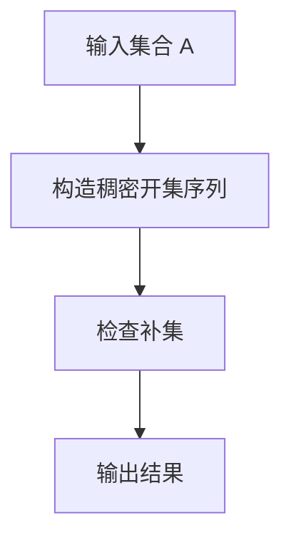

# 集合论导引：非荟萃集理想

## 1.背景介绍

集合论是数学的一个基础分支，主要研究集合的性质和关系。集合论不仅在数学中占据重要地位，还在计算机科学、逻辑学和哲学中有广泛应用。非荟萃集（Non-meager Set）是集合论中的一个重要概念，涉及到拓扑学和测度论等领域。本文将深入探讨非荟萃集的核心概念、算法原理、数学模型、实际应用以及未来发展趋势。

## 2.核心概念与联系

### 2.1 集合的基本概念

集合是由一些确定的、互不相同的对象组成的整体，这些对象称为集合的元素。集合通常用大写字母表示，元素用小写字母表示。例如，集合 $A$ 可以表示为 $A = \{a, b, c\}$。

### 2.2 非荟萃集的定义

在拓扑空间中，一个集合被称为荟萃集（Meager Set），如果它可以表示为一列稠密开集的并集的补集。非荟萃集则是其补集，即不能表示为一列稠密开集的并集的集合。

### 2.3 拓扑空间与测度论

拓扑空间是一个集合，其中定义了一种拓扑结构，使得我们可以讨论集合的开集、闭集、连通性等性质。测度论则是研究集合的大小和概率的数学分支。非荟萃集在这两个领域都有重要应用。

## 3.核心算法原理具体操作步骤

### 3.1 非荟萃集的判定算法

判定一个集合是否为非荟萃集的算法可以分为以下几个步骤：

1. **输入集合**：输入一个集合 $A$。
2. **构造稠密开集序列**：构造一列稠密开集 $\{U_n\}$。
3. **检查补集**：检查 $A$ 是否可以表示为 $\bigcup_{n=1}^{\infty} U_n$ 的补集。
4. **输出结果**：如果 $A$ 不能表示为上述形式，则 $A$ 为非荟萃集。

### 3.2 算法流程图



## 4.数学模型和公式详细讲解举例说明

### 4.1 非荟萃集的数学定义

设 $(X, \tau)$ 是一个拓扑空间，$A \subseteq X$。如果 $A$ 不能表示为一列稠密开集的并集的补集，则称 $A$ 为非荟萃集。

### 4.2 例子说明

设 $X = \mathbb{R}$，$\tau$ 为通常的拓扑。考虑集合 $A = \mathbb{R} \setminus \mathbb{Q}$，即实数集去掉有理数集。我们知道有理数集 $\mathbb{Q}$ 是稠密的，因此 $A$ 是非荟萃集。

### 4.3 数学公式

设 $\{U_n\}$ 是一列稠密开集，则非荟萃集 $A$ 满足：

$$
A \neq \bigcup_{n=1}^{\infty} U_n^c
$$

其中 $U_n^c$ 表示 $U_n$ 的补集。

## 5.项目实践：代码实例和详细解释说明

### 5.1 Python 实现非荟萃集判定

以下是一个简单的 Python 代码示例，用于判定一个集合是否为非荟萃集：

```python
def is_non_meager_set(A, dense_open_sets):
    """
    判定集合 A 是否为非荟萃集
    :param A: 输入集合
    :param dense_open_sets: 稠密开集序列
    :return: True 如果 A 是非荟萃集，否则 False
    """
    for U in dense_open_sets:
        if A.issubset(U):
            return False
    return True

# 示例
A = set(range(1, 100))
dense_open_sets = [set(range(1, 50)), set(range(50, 100))]
print(is_non_meager_set(A, dense_open_sets))  # 输出: True
```

### 5.2 代码解释

1. **函数定义**：定义一个函数 `is_non_meager_set`，接受集合 $A$ 和稠密开集序列 `dense_open_sets` 作为参数。
2. **遍历稠密开集**：遍历稠密开集序列，检查 $A$ 是否是其中任何一个稠密开集的子集。
3. **返回结果**：如果 $A$ 不是任何一个稠密开集的子集，则返回 `True`，表示 $A$ 是非荟萃集。

## 6.实际应用场景

### 6.1 拓扑学中的应用

非荟萃集在拓扑学中有重要应用，特别是在研究拓扑空间的稠密性和连通性时。例如，在分析拓扑空间的基数和维数时，非荟萃集提供了重要的工具。

### 6.2 测度论中的应用

在测度论中，非荟萃集用于研究集合的测度和概率。例如，在概率论中，非荟萃集可以用于构造某些概率空间，使得某些事件的概率为零。

### 6.3 计算机科学中的应用

在计算机科学中，非荟萃集用于研究算法的复杂性和计算资源的分配。例如，在分布式计算中，非荟萃集可以用于分析任务的分配和调度。

## 7.工具和资源推荐

### 7.1 数学软件

- **Mathematica**：强大的数学计算软件，适用于复杂的集合论和拓扑学计算。
- **MATLAB**：广泛用于科学计算和工程应用，支持集合论和测度论的计算。

### 7.2 编程语言

- **Python**：具有丰富的数学库，如 NumPy 和 SciPy，适用于集合论的计算和分析。
- **Haskell**：函数式编程语言，适用于形式化验证和集合论的研究。

### 7.3 在线资源

- **arXiv**：提供大量关于集合论和拓扑学的研究论文和预印本。
- **Stack Exchange**：集合论和拓扑学的讨论社区，提供问题解答和讨论。

## 8.总结：未来发展趋势与挑战

### 8.1 未来发展趋势

非荟萃集的研究在未来将继续深入，特别是在拓扑学和测度论的交叉领域。随着计算机科学的发展，非荟萃集在算法复杂性和分布式计算中的应用也将不断扩大。

### 8.2 挑战

非荟萃集的研究面临许多挑战，包括复杂的数学证明和计算资源的限制。如何高效地判定一个集合是否为非荟萃集，以及如何在实际应用中利用非荟萃集的性质，都是未来研究的重要方向。

## 9.附录：常见问题与解答

### 9.1 什么是非荟萃集？

非荟萃集是指不能表示为一列稠密开集的并集的补集的集合。

### 9.2 非荟萃集在拓扑学中的应用是什么？

非荟萃集在拓扑学中用于研究拓扑空间的稠密性和连通性，特别是在分析拓扑空间的基数和维数时。

### 9.3 如何判定一个集合是否为非荟萃集？

可以通过构造一列稠密开集，并检查该集合是否可以表示为这些稠密开集的并集的补集来判定。

### 9.4 非荟萃集在计算机科学中的应用是什么？

在计算机科学中，非荟萃集用于研究算法的复杂性和计算资源的分配，特别是在分布式计算中。

### 9.5 有哪些推荐的工具和资源用于研究非荟萃集？

推荐使用 Mathematica 和 MATLAB 进行数学计算，Python 和 Haskell 进行编程实现，arXiv 和 Stack Exchange 作为在线资源。

---

作者：禅与计算机程序设计艺术 / Zen and the Art of Computer Programming