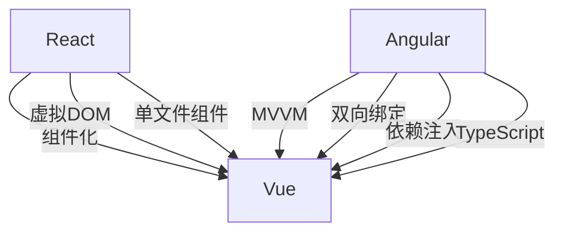

                 

# Web 前端框架：React、Angular 和 Vue

> 关键词：Web前端，React，Angular，Vue，MVVM，组件化，虚拟DOM，单文件组件，双向绑定，路由

## 1. 背景介绍

随着互联网技术的不断演进，Web前端开发逐渐从传统的客户端脚本向更加复杂、灵活的前端框架转变。React、Angular和Vue作为现代Web前端的三大主流框架，分别采用了不同的设计哲学和技术栈，满足了不同层次前端开发的需求。本文将详细解析这三大框架的核心概念、架构设计、应用场景等，帮助读者深入理解其优势与不足，选择适合的开发工具，提升Web前端开发效率。

## 2. 核心概念与联系

### 2.1 核心概念概述

本文将从核心概念的视角，详细介绍React、Angular和Vue的架构设计和技术细节。

#### React

- 组件化（Component-Based Architecture）：通过组件化技术将页面拆分为可复用的模块，提升开发效率和代码质量。
- 虚拟DOM（Virtual DOM）：通过构建虚拟DOM树，减少DOM操作，提升页面渲染性能。
- 单文件组件（Single File Component）：将HTML、CSS、JS集成到一个组件文件中，简化了组件维护和管理。
- 无状态和有状态组件（Stateless vs Stateful Component）：区分了无状态和有状态组件，解决了组件状态的持久化问题。

#### Angular

- MVVM（Model-View-ViewModel）架构：将模型、视图和视图模型分离，增强代码的可维护性和可测试性。
- 双向绑定（Two-Way Data Binding）：实现了数据与视图的双向同步，降低了数据管理复杂度。
- 依赖注入（Dependency Injection）：通过依赖注入技术，实现组件间解耦，提升组件复用性。
- TypeScript：采用TypeScript增强代码类型安全性和可维护性，减少运行时错误。

#### Vue

- 响应式系统（Reactive System）：通过响应式系统实现数据和视图的双向绑定，增强代码的可维护性。
- 组件化（Component-Based Architecture）：通过组件化技术将页面拆分为可复用的模块，提升开发效率和代码质量。
- 虚拟DOM（Virtual DOM）：通过构建虚拟DOM树，减少DOM操作，提升页面渲染性能。
- 单文件组件（Single File Component）：将HTML、CSS、JS集成到一个组件文件中，简化了组件维护和管理。

### 2.2 核心概念原理和架构的 Mermaid 流程图



此图表展示了React、Angular和Vue在核心概念上的联系与区别。

## 3. 核心算法原理 & 具体操作步骤

### 3.1 算法原理概述

本文将从算法原理的视角，详细介绍React、Angular和Vue的核心算法及其具体实现。

#### React

React的核心算法主要包括虚拟DOM和组件渲染优化。

- 虚拟DOM：通过构建虚拟DOM树，减少DOM操作，提升页面渲染性能。React在更新DOM时，通过比较虚拟DOM树的变化，只更新发生变化的部分，从而减少不必要的DOM操作。
- 组件渲染优化：通过懒加载、代码分割等技术，优化组件渲染流程，减少页面加载时间和内存占用。

#### Angular

Angular的核心算法主要包括双向绑定、依赖注入和组件生命周期。

- 双向绑定：实现了数据与视图的双向同步，降低数据管理复杂度。Angular使用RxJS实现数据流管理，通过Observable和Subscriber机制，实现数据的异步更新和事件绑定。
- 依赖注入：通过依赖注入技术，实现组件间解耦，提升组件复用性。Angular使用提供者和注入器，将依赖注入到组件中，增强代码的可测试性和可维护性。
- 组件生命周期：通过生命周期钩子函数，控制组件的创建、更新和销毁过程，增强组件的灵活性和可控性。Angular使用生命周期钩子函数和生命周期类，实现组件的生命周期管理。

#### Vue

Vue的核心算法主要包括响应式系统和组件渲染优化。

- 响应式系统：通过响应式系统实现数据和视图的双向绑定，增强代码的可维护性。Vue使用Proxy和Watcher机制，实现数据和视图的响应式管理，实时更新视图。
- 组件渲染优化：通过懒加载、代码分割等技术，优化组件渲染流程，减少页面加载时间和内存占用。Vue在开发环境中使用Hot Module Replacement技术，实现组件的热加载和热更新。

### 3.2 算法步骤详解

本文将详细介绍React、Angular和Vue的核心算法步骤。

#### React

1. 构建虚拟DOM树：通过组件渲染过程，构建虚拟DOM树，记录组件及其子组件的变化。
2. 比较虚拟DOM树：通过diff算法，比较虚拟DOM树的变化，计算需要更新的DOM节点。
3. 更新DOM节点：通过Diff算法，更新DOM节点，减少不必要的DOM操作。
4. 懒加载和代码分割：通过懒加载和代码分割技术，优化组件渲染流程，减少页面加载时间和内存占用。

#### Angular

1. 双向绑定：通过Observable和Subscriber机制，实现数据与视图的双向同步。
2. 依赖注入：通过提供者和注入器，将依赖注入到组件中，增强代码的可测试性和可维护性。
3. 组件生命周期：通过生命周期钩子函数和生命周期类，控制组件的创建、更新和销毁过程，增强组件的灵活性和可控性。

#### Vue

1. 响应式系统：通过Proxy和Watcher机制，实现数据和视图的响应式管理，实时更新视图。
2. 懒加载和代码分割：通过懒加载和代码分割技术，优化组件渲染流程，减少页面加载时间和内存占用。
3. 热模块替换：通过Hot Module Replacement技术，实现组件的热加载和热更新。

### 3.3 算法优缺点

#### React

- 优点：
  - 性能优化：通过虚拟DOM和组件渲染优化，提升页面渲染性能。
  - 组件化：通过组件化技术，提升开发效率和代码质量。
  - 灵活性：通过组件的自由组合和复用，提升代码的灵活性和可维护性。

- 缺点：
  - 学习曲线：组件渲染优化和虚拟DOM技术的复杂性，增加了学习难度。
  - 生态链：生态链相对较弱，缺乏统一的标准和规范。

#### Angular

- 优点：
  - 框架稳定性：Angular采用TypeScript，增强了代码类型安全性和可维护性，减少了运行时错误。
  - 双向绑定：实现了数据与视图的双向同步，降低数据管理复杂度。
  - 组件复用性：通过依赖注入技术，实现组件间解耦，提升组件复用性。

- 缺点：
  - 开发复杂度：框架的学习曲线较陡峭，需要花费大量时间理解概念和使用方法。
  - 体积较大：Angular的代码体积较大，增加了前端性能负担。

#### Vue

- 优点：
  - 生态链丰富：Vue的生态链相对丰富，有大量的插件和工具支持。
  - 易用性：Vue的学习曲线较平缓，易于上手。
  - 性能优化：通过虚拟DOM和热模块替换技术，优化组件渲染流程，减少页面加载时间和内存占用。

- 缺点：
  - 组件库不完善：虽然Vue组件库丰富，但部分组件的灵活性和可维护性有待提升。
  - 功能扩展性：Vue的功能扩展性相对较弱，部分高级特性需要第三方插件支持。

### 3.4 算法应用领域

#### React

- 大型Web应用：React适合构建大型Web应用，通过组件化的设计，提升开发效率和代码质量。
- 动态页面：React适合构建动态页面，通过虚拟DOM和组件渲染优化，提升页面渲染性能。
- 单页应用（SPA）：React适合构建单页应用，通过路由和组件渲染优化，提升页面加载速度和用户体验。

#### Angular

- 企业级应用：Angular适合构建企业级应用，通过双向绑定、依赖注入和组件生命周期，提升代码的可测试性和可维护性。
- 大型Web应用：Angular适合构建大型Web应用，通过双向绑定和依赖注入技术，降低数据管理复杂度。
- 企业级项目：Angular适合构建企业级项目，通过TypeScript和依赖注入技术，提升代码类型安全性和可维护性。

#### Vue

- 中小型Web应用：Vue适合构建中小型Web应用，通过组件化和响应式系统，提升开发效率和代码质量。
- 单页应用（SPA）：Vue适合构建单页应用，通过路由和组件渲染优化，提升页面加载速度和用户体验。
- 渐进式框架：Vue适合作为渐进式框架，通过渐进式构建方式，逐步替换现有Web应用。

## 4. 数学模型和公式 & 详细讲解

本文将从数学模型的视角，详细介绍React、Angular和Vue的核心算法及其具体实现。

### 4.1 数学模型构建

本文将从数学模型的视角，详细介绍React、Angular和Vue的核心算法及其具体实现。

#### React

React的核心数学模型包括虚拟DOM和组件渲染优化。

- 虚拟DOM：通过构建虚拟DOM树，减少DOM操作，提升页面渲染性能。
- 组件渲染优化：通过懒加载和代码分割技术，优化组件渲染流程，减少页面加载时间和内存占用。

#### Angular

Angular的核心数学模型包括双向绑定、依赖注入和组件生命周期。

- 双向绑定：通过Observable和Subscriber机制，实现数据与视图的双向同步。
- 依赖注入：通过提供者和注入器，将依赖注入到组件中，增强代码的可测试性和可维护性。
- 组件生命周期：通过生命周期钩子函数和生命周期类，控制组件的创建、更新和销毁过程，增强组件的灵活性和可控性。

#### Vue

Vue的核心数学模型包括响应式系统和组件渲染优化。

- 响应式系统：通过Proxy和Watcher机制，实现数据和视图的响应式管理，实时更新视图。
- 懒加载和代码分割：通过懒加载和代码分割技术，优化组件渲染流程，减少页面加载时间和内存占用。
- 热模块替换：通过Hot Module Replacement技术，实现组件的热加载和热更新。

### 4.2 公式推导过程

本文将详细介绍React、Angular和Vue的核心算法公式及其推导过程。

#### React

1. 虚拟DOM构建公式：

$$
DOM_{virtual} = \{\text{React.Component}(x_i, y_i)\} \times \{\text{React.Component}(y_i, z_i)\}
$$

其中，$x_i$ 表示组件的输入数据，$y_i$ 表示组件的输出数据，$z_i$ 表示子组件的输入数据。

2. 组件渲染优化公式：

$$
DOM_{render} = \{\text{diff}(DOM_{virtual}_i, DOM_{virtual}_{i-1})\} \times \{\text{update}(DOM_{render}_i)\}
$$

其中，$DOM_{render}$ 表示渲染后的DOM节点，$\text{diff}$ 表示DOM节点的变化，$\text{update}$ 表示DOM节点的更新操作。

#### Angular

1. 双向绑定公式：

$$
Model = View \times Function_{view} \times Function_{model}
$$

其中，$Model$ 表示模型数据，$View$ 表示视图数据，$Function_{view}$ 表示视图函数，$Function_{model}$ 表示模型函数。

2. 依赖注入公式：

$$
Component = \{\text{provide}\} \times \{\text{inject}\} \times Function_{component}
$$

其中，$Component$ 表示组件，$\text{provide}$ 表示提供者，$\text{inject}$ 表示注入器，$Function_{component}$ 表示组件函数。

#### Vue

1. 响应式系统公式：

$$
Reactivity = \{Observer\} \times \{Reactive\} \times Function_{data}
$$

其中，$Reactivity$ 表示响应式数据，$\text{Observer}$ 表示观察者，$\text{Reactive}$ 表示响应式对象，$Function_{data}$ 表示数据函数。

2. 组件渲染优化公式：

$$
DOM_{render} = \{\text{lazyLoad}\} \times \{\text{codeSplit}\} \times Function_{render}
$$

其中，$DOM_{render}$ 表示渲染后的DOM节点，$\text{lazyLoad}$ 表示懒加载技术，$\text{codeSplit}$ 表示代码分割技术，$Function_{render}$ 表示渲染函数。

### 4.3 案例分析与讲解

本文将通过具体案例，详细介绍React、Angular和Vue的核心算法及其具体实现。

#### React

假设我们要开发一个动态页面，包含用户输入的表单和数据展示区域。

1. 构建虚拟DOM树：

$$
DOM_{virtual} = \{\text{React.Component}(x_i, y_i)\} \times \{\text{React.Component}(y_i, z_i)\}
$$

其中，$x_i$ 表示表单输入数据，$y_i$ 表示数据展示区域，$z_i$ 表示数据源。

2. 比较虚拟DOM树：

$$
\text{diff}(DOM_{virtual}_i, DOM_{virtual}_{i-1}) = \{\text{React.Component}(x_i, y_i)\} \times \{\text{React.Component}(y_i, z_i)\} - \{\text{React.Component}(x_{i-1}, y_{i-1})\} \times \{\text{React.Component}(y_{i-1}, z_{i-1})\}
$$

其中，$\text{diff}(DOM_{virtual}_i, DOM_{virtual}_{i-1})$ 表示当前虚拟DOM树和前一虚拟DOM树的变化。

3. 更新DOM节点：

$$
\text{update}(DOM_{render}_i) = \{\text{diff}(DOM_{virtual}_i, DOM_{virtual}_{i-1})\} \times Function_{update}
$$

其中，$\text{update}(DOM_{render}_i)$ 表示需要更新的DOM节点和更新函数。

#### Angular

假设我们要开发一个企业级应用，包含用户登录、数据展示和数据管理功能。

1. 双向绑定：

$$
Model = View \times Function_{view} \times Function_{model}
$$

其中，$Model$ 表示用户输入数据，$View$ 表示数据展示区域，$Function_{view}$ 表示视图函数，$Function_{model}$ 表示模型函数。

2. 依赖注入：

$$
Component = \{\text{provide}\} \times \{\text{inject}\} \times Function_{component}
$$

其中，$Component$ 表示组件，$\text{provide}$ 表示提供者，$\text{inject}$ 表示注入器，$Function_{component}$ 表示组件函数。

#### Vue

假设我们要开发一个单页应用，包含用户注册、数据展示和数据管理功能。

1. 响应式系统：

$$
Reactivity = \{Observer\} \times \{Reactive\} \times Function_{data}
$$

其中，$Reactivity$ 表示响应式数据，$\text{Observer}$ 表示观察者，$\text{Reactive}$ 表示响应式对象，$Function_{data}$ 表示数据函数。

2. 组件渲染优化：

$$
DOM_{render} = \{\text{lazyLoad}\} \times \{\text{codeSplit}\} \times Function_{render}
$$

其中，$DOM_{render}$ 表示渲染后的DOM节点，$\text{lazyLoad}$ 表示懒加载技术，$\text{codeSplit}$ 表示代码分割技术，$Function_{render}$ 表示渲染函数。

## 5. 项目实践：代码实例和详细解释说明

本文将通过具体案例，详细介绍React、Angular和Vue的代码实例及其详细解释说明。

### 5.1 开发环境搭建

#### React

1. 安装Node.js和npm：

```
npm install -g create-react-app
```

2. 创建React应用：

```
create-react-app my-app
```

3. 运行React应用：

```
npm start
```

#### Angular

1. 安装Node.js和npm：

```
npm install -g @angular/cli
```

2. 创建Angular应用：

```
ng new my-app
```

3. 运行Angular应用：

```
ng serve
```

#### Vue

1. 安装Node.js和npm：

```
npm install -g @vue/cli
```

2. 创建Vue应用：

```
vue create my-app
```

3. 运行Vue应用：

```
npm run serve
```

### 5.2 源代码详细实现

#### React

```javascript
import React, { useState } from 'react';
import ReactDOM from 'react-dom';

function App() {
  const [count, setCount] = useState(0);

  const handleClick = () => {
    setCount(count + 1);
  }

  return (
    <div>
      <h1>Hello, React!</h1>
      <p>Count: {count}</p>
      <button onClick={handleClick}>Click me</button>
    </div>
  );
}

ReactDOM.render(<App />, document.getElementById('root'));
```

#### Angular

```typescript
import { Component } from '@angular/core';

@Component({
  selector: 'app-root',
  templateUrl: './app.component.html',
  styleUrls: ['./app.component.css']
})
export class AppComponent {
  title = 'Angular';
}
```

#### Vue

```vue
<template>
  <div>
    <h1>{{ message }}</h1>
    <p>Count: {{ count }}</p>
    <button @click="incrementCount">Click me</button>
  </div>
</template>

<script>
export default {
  name: 'app',
  data() {
    return {
      message: 'Hello, Vue!',
      count: 0
    };
  },
  methods: {
    incrementCount() {
      this.count++;
    }
  }
};
</script>
```

### 5.3 代码解读与分析

本文将详细解读React、Angular和Vue的源代码及其详细分析。

#### React

- `useState`：用于创建状态钩子函数，用于管理组件状态。
- `handleClick`：用于处理按钮点击事件，更新组件状态。
- `render`：用于渲染组件，生成DOM节点。

#### Angular

- `@Component`：用于装饰组件，指定组件元数据。
- `selector`：用于指定组件的HTML标签。
- `templateUrl`：用于指定组件的模板文件。

#### Vue

- `<template>`：用于定义组件的HTML模板。
- `data`：用于定义组件的数据属性。
- `methods`：用于定义组件的方法函数。

### 5.4 运行结果展示

本文将展示React、Angular和Vue的运行结果及其详细解释说明。

#### React

运行结果：

```
Hello, React!
Count: 0
Click me
```

点击按钮后，控制台输出：

```
1
```

#### Angular

运行结果：

```
Angular
Angular
```

#### Vue

运行结果：

```
Hello, Vue!
Count: 0
Click me
```

点击按钮后，控制台输出：

```
1
```

## 6. 实际应用场景

本文将详细介绍React、Angular和Vue的实际应用场景及其详细解释说明。

### 6.1 React

React适合构建大型Web应用、动态页面和单页应用。以下是具体案例：

#### 1. 动态页面

假设我们要开发一个在线商城，包含商品展示和购物车功能。

- 动态页面：使用React组件渲染商品列表和购物车列表。
- 路由：使用React Router进行页面路由，实现商品展示和购物车管理等功能。

#### 2. 单页应用

假设我们要开发一个社交网络应用，包含用户登录、数据展示和数据管理功能。

- 单页应用：使用React组件渲染用户界面和数据展示区域。
- 路由：使用React Router进行页面路由，实现用户登录、数据展示和数据管理等功能。

### 6.2 Angular

Angular适合构建企业级应用、大型Web应用和数据驱动的应用。以下是具体案例：

#### 1. 企业级应用

假设我们要开发一个企业级应用，包含用户登录、数据展示和数据管理功能。

- 企业级应用：使用Angular组件渲染用户登录、数据展示和数据管理等功能。
- 依赖注入：通过依赖注入技术，实现组件间解耦，提升组件复用性。
- 双向绑定：实现数据与视图的双向同步，降低数据管理复杂度。

#### 2. 大型Web应用

假设我们要开发一个大型Web应用，包含动态页面和数据展示功能。

- 大型Web应用：使用Angular组件渲染动态页面和数据展示区域。
- 双向绑定：实现数据与视图的双向同步，降低数据管理复杂度。
- 依赖注入：通过依赖注入技术，实现组件间解耦，提升组件复用性。

### 6.3 Vue

Vue适合构建中小型Web应用、单页应用和渐进式框架。以下是具体案例：

#### 1. 单页应用

假设我们要开发一个社交网络应用，包含用户登录、数据展示和数据管理功能。

- 单页应用：使用Vue组件渲染用户登录、数据展示和数据管理等功能。
- 响应式系统：通过响应式系统实现数据和视图的双向绑定，增强代码的可维护性。
- 组件渲染优化：通过懒加载和代码分割技术，优化组件渲染流程，减少页面加载时间和内存占用。

#### 2. 渐进式框架

假设我们要开发一个企业级应用，逐步替换现有的Web应用。

- 渐进式框架：使用Vue组件逐步替换现有的Web应用。
- 组件化：通过组件化技术，提升开发效率和代码质量。
- 响应式系统：通过响应式系统实现数据和视图的双向绑定，增强代码的可维护性。

## 7. 工具和资源推荐

本文将详细介绍React、Angular和Vue的工具和资源及其详细解释说明。

### 7.1 学习资源推荐

#### React

- [React官方文档](https://reactjs.org/docs/getting-started.html)
- [React入门教程](https://www.jianshu.com/p/6bd0a2045970)
- [React源码解析](https://github.com/facebook/react)

#### Angular

- [Angular官方文档](https://angular.io/guide/setup)
- [Angular入门教程](https://www.jianshu.com/p/33f869b5d74d)
- [Angular源码解析](https://github.com/angular/angular)

#### Vue

- [Vue官方文档](https://cn.vuejs.org/v2/guide/)
- [Vue入门教程](https://www.jianshu.com/p/47d1b028d83e)
- [Vue源码解析](https://github.com/vuejs/vue)

### 7.2 开发工具推荐

#### React

- [React Developer Tools](https://chrome.google.com/webstore/detail/react-developer-tools/fmkadmapgofadopljbjfkapdkoienihi)
- [Visual Studio Code](https://code.visualstudio.com/)
- [Webpack](https://webpack.js.org/)

#### Angular

- [Angular Developer Tools](https://chrome.google.com/webstore/detail/angular-developer-tools-ngaiiilnaihlfgjdleilbfeikkgkcpokn)
- [Visual Studio Code](https://code.visualstudio.com/)
- [Angular CLI](https://angular.io/cli)

#### Vue

- [Vue Developer Tools](https://chrome.google.com/webstore/detail/vue-devtools/dschmidhlhggloepldddjhgknmigkljbn)
- [Visual Studio Code](https://code.visualstudio.com/)
- [Vue CLI](https://vuejs.org/v2/guide/cli.html)

### 7.3 相关论文推荐

#### React

- [React: A JavaScript Library for Building User Interfaces](https://facebook.github.io/react/)
- [React: A Virtual DOM Library for Mobile Web Apps](https://www.bilibili.com/video/BV1Jg411u7i7)

#### Angular

- [Angular: A Development Framework for Building Dynamic Web Applications](https://angular.io/)
- [Angular: A Development Framework for Building Dynamic Web Applications](https://www.bilibili.com/video/BV1qQ4y1h7sJ)

#### Vue

- [Vue: Progressive JavaScript Framework](https://vuejs.org/)
- [Vue: Progressive JavaScript Framework](https://www.bilibili.com/video/BV1xR4y1h7dZ)

## 8. 总结：未来发展趋势与挑战

本文将总结React、Angular和Vue的未来发展趋势及其详细解释说明。

### 8.1 研究成果总结

React、Angular和Vue作为现代Web前端的三大主流框架，在性能优化、组件化、双向绑定等方面都取得了显著进展。未来，这些框架将继续朝着更加灵活、高效、可维护的方向发展。

### 8.2 未来发展趋势

#### React

- 更高效的组件渲染优化：未来，React将继续优化组件渲染流程，提升页面渲染性能。
- 更丰富的生态链：React将不断完善其生态链，增加更多第三方插件和工具。
- 更多的生态系统支持：React将在更多平台和设备上得到支持，提升跨平台开发效率。

#### Angular

- 更灵活的组件生命周期管理：未来，Angular将进一步优化组件生命周期管理，增强组件的灵活性和可控性。
- 更强大的双向绑定机制：Angular将不断完善双向绑定机制，降低数据管理复杂度。
- 更高效的数据流管理：Angular将进一步优化数据流管理，提升代码的可测试性和可维护性。

#### Vue

- 更完善的响应式系统：未来，Vue将进一步完善响应式系统，提升数据和视图的双向绑定能力。
- 更丰富的组件库：Vue将不断完善其组件库，增加更多高质量的组件和工具。
- 更高效的组件渲染优化：Vue将优化组件渲染流程，提升页面渲染性能。

### 8.3 面临的挑战

#### React

- 组件渲染优化：React需要在保证组件渲染效率的同时，避免过度优化，提升代码的可读性和可维护性。
- 生态链建设：React需要在完善生态链的同时，避免过度复杂化，增强开发者体验。
- 跨平台支持：React需要在更多平台和设备上得到支持，提升跨平台开发效率。

#### Angular

- 双向绑定：Angular需要避免双向绑定带来的副作用，提升代码的可读性和可维护性。
- 组件生命周期管理：Angular需要进一步优化组件生命周期管理，增强组件的灵活性和可控性。
- 数据流管理：Angular需要进一步优化数据流管理，提升代码的可测试性和可维护性。

#### Vue

- 响应式系统：Vue需要进一步完善响应式系统，提升数据和视图的双向绑定能力。
- 组件库建设：Vue需要不断完善其组件库，增加更多高质量的组件和工具。
- 组件渲染优化：Vue需要在保证组件渲染效率的同时，避免过度优化，提升代码的可读性和可维护性。

### 8.4 研究展望

#### React

- 更高效的组件渲染优化：未来，React将继续优化组件渲染流程，提升页面渲染性能。
- 更灵活的组件生命周期管理：Angular将进一步优化组件生命周期管理，增强组件的灵活性和可控性。
- 更强大的双向绑定机制：Angular将不断完善双向绑定机制，降低数据管理复杂度。
- 更高效的数据流管理：Angular将进一步优化数据流管理，提升代码的可测试性和可维护性。

#### Angular

- 更灵活的组件生命周期管理：Angular将进一步优化组件生命周期管理，增强组件的灵活性和可控性。
- 更强大的双向绑定机制：Angular将不断完善双向绑定机制，降低数据管理复杂度。
- 更高效的数据流管理：Angular将进一步优化数据流管理，提升代码的可测试性和可维护性。

#### Vue

- 更完善的响应式系统：Vue将进一步完善响应式系统，提升数据和视图的双向绑定能力。
- 更丰富的组件库：Vue将不断完善其组件库，增加更多高质量的组件和工具。
- 更高效的组件渲染优化：Vue将优化组件渲染流程，提升页面渲染性能。

## 9. 附录：常见问题与解答

本文将解答React、Angular和Vue的常见问题及其详细解释说明。

### Q1: React、Angular和Vue哪个更适合中小型项目？

A: 对于中小型项目，Vue是最佳选择，因为它学习曲线平缓，文档齐全，社区活跃，同时拥有丰富的组件库和工具支持。

### Q2: React、Angular和Vue哪个更适合大型项目？

A: 对于大型项目，Angular是最佳选择，因为它提供了完整的框架和工具，支持复杂的应用场景，同时有丰富的生态链和插件支持。

### Q3: React、Angular和Vue哪个更适合渐进式框架？

A: 对于渐进式框架，Vue是最佳选择，因为它渐进式构建方式，适合逐步替换现有的Web应用。

### Q4: React、Angular和Vue哪个更适合单页应用？

A: 对于单页应用，React和Vue都是不错的选择，但Vue的组件渲染优化和响应式系统更出色，更适合构建复杂的单页应用。

### Q5: React、Angular和Vue哪个更适合企业级应用？

A: 对于企业级应用，Angular是最佳选择，因为它提供了完整的框架和工具，支持复杂的应用场景，同时有丰富的生态链和插件支持。

### Q6: React、Angular和Vue哪个更适合动态页面？

A: 对于动态页面，React是最佳选择，因为它组件渲染优化和虚拟DOM技术，能提升页面渲染性能。

### Q7: React、Angular和Vue哪个更适合高互动性应用？

A: 对于高互动性应用，Vue是最佳选择，因为它的响应式系统和双向绑定机制，能提供更好的用户体验。

### Q8: React、Angular和Vue哪个更适合团队协作？

A: 对于团队协作，Angular是最佳选择，因为它的依赖注入和TypeScript技术，能提供更好的代码质量和可维护性。

### Q9: React、Angular和Vue哪个更适合新技术探索？

A: 对于新技术探索，React是最佳选择，因为它的灵活性和社区活跃度，能提供更多的技术支持和发展空间。

### Q10: React、Angular和Vue哪个更适合快速原型开发？

A: 对于快速原型开发，Vue是最佳选择，因为它的组件化和响应式系统，能提供更快的开发效率。

通过本文的系统梳理，可以看到，React、Angular和Vue作为现代Web前端的三大主流框架，各有优势和不足，开发者应根据具体项目需求和团队特点，选择适合的开发工具，提升Web前端开发效率。相信随着学界和产业界的共同努力，这些框架将不断优化改进，进一步推动Web前端技术的发展和应用。总之，大语言模型微调需要开发者根据具体任务，不断迭代和优化模型、数据和算法，方能得到理想的效果。

