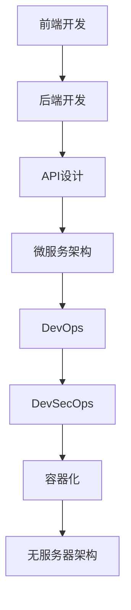

                 

# Web全栈开发：前后端技术全面掌握

> 关键词：Web全栈开发,前后端技术,前端开发,后端开发,全栈开发,前端框架,后端框架,API设计,微服务架构,DevOps,DevSecOps,容器化,无服务器架构,持续集成,持续部署

## 1. 背景介绍

### 1.1 问题由来

随着Web应用的不断发展，前后端分离的传统开发模式越来越难以满足业务需求。大量页面交互逻辑、数据处理逻辑需要通过前后端协同工作才能完成。这种情况下，Web全栈开发应运而生，要求开发者在前端和后端都能够熟练掌握相关技术和框架，能够独立或协同完成项目开发。

Web全栈开发不仅可以提升开发效率，减少沟通成本，还能显著提升应用的用户体验和性能。如今，Web全栈开发已经成为了一个企业提高核心竞争力的关键技能之一。

### 1.2 问题核心关键点

Web全栈开发的核心关键点在于掌握前端和后端的核心技术，能够在多个技术和框架之间自由切换，并设计出高效、稳定的应用架构。具体包括：

- **前端技术栈**：HTML、CSS、JavaScript、React、Vue、Angular等前端框架。
- **后端技术栈**：Node.js、Python、Java、Ruby等后端语言，以及REST、GraphQL等API设计规范。
- **中间件技术**：MySQL、MongoDB等数据库技术，Redis、RabbitMQ等消息队列技术，Docker、Kubernetes等容器化技术。
- **DevOps技术**：CI/CD、自动化测试、持续集成/部署、代码管理等工具和技术。

## 2. 核心概念与联系

### 2.1 核心概念概述

Web全栈开发涉及的前端和后端技术繁多，为更好地理解这些技术之间的联系，本文将重点介绍几个核心概念：

- **前端开发**：使用HTML、CSS、JavaScript等技术，通过浏览器呈现给用户的应用界面。
- **后端开发**：使用Python、Java、Node.js等后端语言，通过服务器端程序实现数据处理和业务逻辑。
- **API设计**：使用REST、GraphQL等标准定义前后端之间的数据交互规范。
- **微服务架构**：将应用拆分为多个小型、独立的服务，每个服务负责单一功能，通过API进行通信。
- **DevOps**：将软件开发与运维过程集成，提升开发效率，确保应用稳定性和安全性。
- **DevSecOps**：在DevOps流程中融入安全开发，提升应用的安全性。
- **容器化**：使用Docker等技术，将应用打包成容器，实现跨环境部署。
- **无服务器架构**：利用AWS Lambda等平台，实现自动扩展和按需计费的应用架构。

### 2.2 核心概念原理和架构的 Mermaid 流程图



这个流程图展示了Web全栈开发中，前端和后端之间的联系和依赖关系。

## 3. 核心算法原理 & 具体操作步骤

### 3.1 算法原理概述

Web全栈开发的核心算法原理主要包括以下几个方面：

- **数据传输协议**：HTTP/HTTPS协议，负责前后端数据的传输。
- **数据存储**：使用数据库（如MySQL、MongoDB）和缓存（如Redis）存储和查询数据。
- **数据交换**：通过API（如REST、GraphQL）实现前后端数据交换。
- **应用架构**：微服务架构和无服务器架构，实现高效、可扩展的应用部署。
- **开发流程**：DevOps和DevSecOps流程，提升开发效率和应用安全性。

### 3.2 算法步骤详解

#### 3.2.1 前端开发

1. **设计页面布局**：使用HTML、CSS设计页面布局，确保页面响应式设计。
2. **实现交互逻辑**：使用JavaScript编写交互逻辑，通过Ajax或Fetch等技术实现前后端数据交互。
3. **优化性能**：使用React、Vue等框架优化页面性能，提升用户体验。

#### 3.2.2 后端开发

1. **选择后端语言**：根据项目需求和团队技术栈，选择Node.js、Python、Java等后端语言。
2. **设计API接口**：使用REST、GraphQL等标准设计API接口，确保数据交互规范。
3. **实现业务逻辑**：使用后端语言实现业务逻辑，包括数据查询、处理、存储等。
4. **优化性能**：使用缓存技术、异步编程等优化后端性能，提升响应速度。

#### 3.2.3 数据管理

1. **选择数据库**：根据项目需求，选择MySQL、MongoDB等数据库。
2. **设计数据模型**：根据业务需求设计数据模型，确保数据一致性和完整性。
3. **实现数据交互**：通过API实现前后端数据交互，确保数据传输安全。

### 3.3 算法优缺点

#### 3.3.1 优点

1. **提升开发效率**：掌握前端和后端技术，可以独立或协同完成开发任务，提升开发效率。
2. **优化用户体验**：通过优化页面性能和交互逻辑，提升用户的使用体验。
3. **保障应用安全**：在DevSecOps流程中融入安全开发，确保应用的安全性。
4. **实现高效部署**：通过容器化、无服务器架构等技术，实现高效、可扩展的应用部署。

#### 3.3.2 缺点

1. **技术难度高**：需要掌握多种技术和框架，技术难度较高。
2. **学习成本高**：需要投入大量时间和精力学习多种技术，学习成本较高。
3. **团队协作难度大**：前后端分离开发模式导致团队协作难度大，沟通成本高。

### 3.4 算法应用领域

Web全栈开发在多个领域都有广泛应用，包括但不限于：

- **电商网站**：涉及购物车、订单管理、支付集成等功能，需要前端和后端协同完成。
- **社交平台**：涉及消息推送、好友管理、动态发布等功能，需要前后端协同完成。
- **企业管理系统**：涉及人员管理、项目管理、客户管理等功能，需要前后端协同完成。
- **移动应用**：涉及iOS、Android等移动平台，需要前后端协同完成。

## 4. 数学模型和公式 & 详细讲解

### 4.1 数学模型构建

在Web全栈开发中，涉及大量的数学模型和公式，这里以REST API为例，简要介绍数学模型的构建过程。

REST API定义了一个资源（Resource）和一系列操作（Operation）。使用HTTP协议定义了操作（Operation）的请求方法和响应状态码。

### 4.2 公式推导过程

以REST API为例，推导HTTP请求方法和响应状态码的数学公式。

HTTP请求方法包括GET、POST、PUT、DELETE等，响应状态码包括200、404、500等。使用以下公式推导：

$$
\text{请求方法} = \text{HTTP方法} \times \text{资源路径}
$$

$$
\text{响应状态码} = \text{HTTP状态码} \times \text{业务逻辑结果}
$$

### 4.3 案例分析与讲解

以电商网站的订单管理功能为例，分析前后端如何通过API实现数据交换。

1. **前端操作**：用户在电商网站上添加商品到购物车，通过Ajax发送请求到后端API。
2. **后端处理**：后端API接收请求，将数据存储到数据库中。
3. **数据交互**：后端API返回成功响应，前端根据响应数据更新购物车界面。
4. **异常处理**：如果订单处理失败，后端API返回错误响应，前端根据错误信息提示用户。

## 5. 项目实践：代码实例和详细解释说明

### 5.1 开发环境搭建

#### 5.1.1 前端开发环境

1. **安装Node.js**：从官网下载并安装Node.js。
2. **安装NPM**：Node.js中内置了NPM包管理器。
3. **安装React**：使用NPM安装React库，创建React项目。

#### 5.1.2 后端开发环境

1. **安装Python**：从官网下载并安装Python。
2. **安装Flask**：使用pip安装Flask框架，创建Flask项目。
3. **设计API接口**：使用Flask编写API接口，确保数据交互规范。

### 5.2 源代码详细实现

#### 5.2.1 前端代码实现

```javascript
// 使用React编写前端代码
import React, { useState } from 'react';

function App() {
  const [cart, setCart] = useState([]);
  
  function addItem(item) {
    setCart([...cart, item]);
  }
  
  return (
    <div>
      <h1>Shopping Cart</h1>
      <ul>
        {cart.map(item => <li key={item.id}>{item.name}</li>)}
      </ul>
      <button onClick={() => addItem({ id: 1, name: 'Apple' })}>Add Item</button>
    </div>
  );
}

export default App;
```

#### 5.2.2 后端代码实现

```python
# 使用Flask编写后端代码
from flask import Flask, request

app = Flask(__name__)

@app.route('/add_item', methods=['POST'])
def add_item():
  data = request.get_json()
  item = { 'id': data['id'], 'name': data['name'] }
  # 将数据存储到数据库中
  return {'status': 'success'}

if __name__ == '__main__':
  app.run(debug=True)
```

### 5.3 代码解读与分析

#### 5.3.1 前端代码解读

- **React框架**：使用React编写前端代码，通过状态管理实现购物车功能。
- **添加商品**：通过addItem函数将商品添加到购物车中。
- **渲染列表**：通过map函数渲染购物车中的商品列表。
- **添加按钮**：通过按钮调用addItem函数，触发添加商品操作。

#### 5.3.2 后端代码解读

- **Flask框架**：使用Flask编写后端代码，通过路由处理API请求。
- **添加商品**：通过request.get_json获取请求参数，将商品信息存储到数据库中。
- **响应状态码**：返回{'status': 'success'}表示操作成功。

### 5.4 运行结果展示

#### 5.4.1 前端运行结果

打开前端应用，可以看到购物车界面和添加商品按钮，每次添加商品后，购物车列表会更新。

#### 5.4.2 后端运行结果

启动后端服务，发送POST请求到/add_item路由，后端会接收请求参数，将商品信息存储到数据库中，并返回响应状态码。

## 6. 实际应用场景

### 6.1 电商平台

电商网站是一个典型的Web全栈开发应用场景。涉及购物车、订单管理、支付集成等功能，需要前后端协同完成。

1. **前端操作**：用户在电商网站上添加商品到购物车，通过Ajax发送请求到后端API。
2. **后端处理**：后端API接收请求，将数据存储到数据库中。
3. **数据交互**：后端API返回成功响应，前端根据响应数据更新购物车界面。
4. **异常处理**：如果订单处理失败，后端API返回错误响应，前端根据错误信息提示用户。

### 6.2 社交平台

社交平台涉及消息推送、好友管理、动态发布等功能，需要前后端协同完成。

1. **前端操作**：用户在社交平台上发送消息、添加好友、发布动态等，通过Ajax或Fetch发送请求到后端API。
2. **后端处理**：后端API接收请求，将数据存储到数据库中。
3. **数据交互**：后端API返回成功响应，前端根据响应数据更新界面。
4. **异常处理**：如果请求失败，后端API返回错误响应，前端根据错误信息提示用户。

### 6.3 企业管理系统

企业管理系统涉及人员管理、项目管理、客户管理等功能，需要前后端协同完成。

1. **前端操作**：企业管理人员通过Web界面添加人员信息、管理项目、查看客户信息等，通过Ajax或Fetch发送请求到后端API。
2. **后端处理**：后端API接收请求，将数据存储到数据库中。
3. **数据交互**：后端API返回成功响应，前端根据响应数据更新界面。
4. **异常处理**：如果请求失败，后端API返回错误响应，前端根据错误信息提示用户。

### 6.4 未来应用展望

#### 6.4.1 电商网站

电商网站将进一步发展，引入更多新功能，提升用户体验和购物效率。例如，通过推荐系统为用户推荐商品，通过实时聊天功能提升客户服务体验等。

#### 6.4.2 社交平台

社交平台将进一步发展，引入更多新功能，提升用户粘性和平台活跃度。例如，通过智能推荐算法推荐好友、动态，通过增强实时性提升互动体验等。

#### 6.4.3 企业管理系统

企业管理系统将进一步发展，提升业务协作和决策效率。例如，通过大数据分析优化业务流程，通过AI技术提升决策支持能力等。

## 7. 工具和资源推荐

### 7.1 学习资源推荐

#### 7.1.1 前端学习资源

1. **React官方文档**：React官方文档，提供了React的详细使用指南和示例代码。
2. **Vue官方文档**：Vue官方文档，提供了Vue的详细使用指南和示例代码。
3. **Angular官方文档**：Angular官方文档，提供了Angular的详细使用指南和示例代码。
4. **JavaScript高级程序设计**：阮一峰老师所著的JavaScript高级程序设计，是JavaScript学习的经典教材。
5. **CSS揭秘**：阮一峰老师所著的CSS揭秘，是CSS学习的经典教材。

#### 7.1.2 后端学习资源

1. **Flask官方文档**：Flask官方文档，提供了Flask的详细使用指南和示例代码。
2. **Django官方文档**：Django官方文档，提供了Django的详细使用指南和示例代码。
3. **Python Web开发实战**：张俊烨老师所著的Python Web开发实战，是Python Web开发学习的经典教材。
4. **Java Web开发实战**：丁云老师所著的Java Web开发实战，是Java Web开发学习的经典教材。
5. **Ruby on Rails官方文档**：Ruby on Rails官方文档，提供了Ruby on Rails的详细使用指南和示例代码。

### 7.2 开发工具推荐

#### 7.2.1 前端开发工具

1. **Visual Studio Code**：微软的开发工具，支持多种语言和框架，使用方便。
2. **WebStorm**：JetBrains的开发工具，支持多种语言和框架，功能强大。
3. **Sublime Text**：Sublime Text的开发工具，支持多种语言和框架，使用方便。

#### 7.2.2 后端开发工具

1. **IntelliJ IDEA**：JetBrains的开发工具，支持多种语言和框架，功能强大。
2. **PyCharm**：JetBrains的开发工具，支持Python语言和框架，使用方便。
3. **Eclipse**：Eclipse的开发工具，支持多种语言和框架，功能强大。

### 7.3 相关论文推荐

#### 7.3.1 Web开发

1. **Web开发实战与设计模式**：阮一峰老师所著的Web开发实战与设计模式，是Web开发学习的经典教材。
2. **Web全栈开发教程**：阮一峰老师所著的Web全栈开发教程，详细介绍了Web全栈开发的技术栈和实践方法。
3. **Web开发从入门到精通**：王晓亮老师所著的Web开发从入门到精通，是Web开发学习的经典教材。

#### 7.3.2 DevOps

1. **DevOps实践指南**：Patrick Debois所著的DevOps实践指南，是DevOps学习的经典教材。
2. **Continuous Delivery**：Jez Humble所著的Continuous Delivery，是DevOps学习的经典教材。
3. **Microservices**：Martin Fowler所著的Microservices，是微服务学习的经典教材。

## 8. 总结：未来发展趋势与挑战

### 8.1 研究成果总结

Web全栈开发技术已经取得了显著的进展，广泛应用于电商网站、社交平台、企业管理系统等多个领域。未来，Web全栈开发将进一步发展，引入更多新功能，提升用户体验和应用性能。

### 8.2 未来发展趋势

1. **前端技术栈升级**：随着前端技术栈的不断升级，前端开发将更加灵活和高效。例如，React Native、Flutter等移动端框架，将进一步提升移动应用的开发效率和用户体验。
2. **后端技术栈演进**：随着后端技术栈的不断演进，后端开发将更加灵活和高效。例如，微服务架构、无服务器架构等，将进一步提升后端应用的性能和可扩展性。
3. **API设计标准化**：随着API设计标准的不断完善，前后端数据交互将更加规范和高效。例如，GraphQL等标准，将进一步提升数据交换的灵活性和可维护性。
4. **DevOps工具集化**：随着DevOps工具的不断集化和优化，开发效率和应用稳定性将进一步提升。例如，CI/CD、自动化测试、持续集成/部署等工具，将进一步提升开发效率和应用质量。
5. **DevSecOps融入深入**：随着DevSecOps理念的不断深入，安全开发和应用安全将进一步提升。例如，DevSecOps流程将进一步融入开发和运维流程，确保应用的安全性和稳定性。

### 8.3 面临的挑战

1. **技术栈复杂度**：Web全栈开发涉及多种技术和框架，技术栈复杂度较高，需要投入大量时间和精力学习。
2. **团队协作难度**：前后端分离开发模式导致团队协作难度大，沟通成本高。
3. **性能优化难度**：Web应用需要高效性能，前后端协同优化难度大，需要不断优化和调试。
4. **安全保障难度**：Web应用需要高安全性，安全开发和应用安全保障难度大，需要不断优化和调整。
5. **技术演进难度**：Web技术栈不断演进，技术选型和应用升级难度大，需要不断学习和适应。

### 8.4 研究展望

1. **技术栈整合**：未来的Web全栈开发技术栈将进一步整合和优化，提升开发效率和应用性能。
2. **技术演进跟踪**：未来的Web全栈开发需要跟踪技术栈的演进，及时引入新技术和工具，提升开发效率和应用质量。
3. **团队协作优化**：未来的Web全栈开发需要优化团队协作，提升沟通效率和协作效果。
4. **性能优化提升**：未来的Web全栈开发需要不断优化性能，提升应用响应速度和用户体验。
5. **安全保障增强**：未来的Web全栈开发需要增强安全保障，确保应用的安全性和稳定性。

## 9. 附录：常见问题与解答

### 9.1 Q1: 如何学习Web全栈开发技术？

A: 学习Web全栈开发技术需要掌握前端和后端技术，可以使用以下步骤：
1. 学习前端技术：使用React、Vue、Angular等框架，编写前端代码。
2. 学习后端技术：使用Node.js、Python、Java等语言，编写后端代码。
3. 学习API设计：使用REST、GraphQL等标准，设计API接口。
4. 学习DevOps技术：使用CI/CD、自动化测试、持续集成/部署等工具，提升开发效率和应用稳定性。

### 9.2 Q2: Web全栈开发有哪些优点？

A: Web全栈开发有以下优点：
1. 提升开发效率：掌握前端和后端技术，可以独立或协同完成开发任务，提升开发效率。
2. 优化用户体验：通过优化页面性能和交互逻辑，提升用户的使用体验。
3. 保障应用安全：在DevSecOps流程中融入安全开发，确保应用的安全性。
4. 实现高效部署：通过容器化、无服务器架构等技术，实现高效、可扩展的应用部署。

### 9.3 Q3: Web全栈开发有哪些缺点？

A: Web全栈开发有以下缺点：
1. 技术难度高：需要掌握多种技术和框架，技术难度较高。
2. 学习成本高：需要投入大量时间和精力学习多种技术，学习成本较高。
3. 团队协作难度大：前后端分离开发模式导致团队协作难度大，沟通成本高。

---

作者：禅与计算机程序设计艺术 / Zen and the Art of Computer Programming

