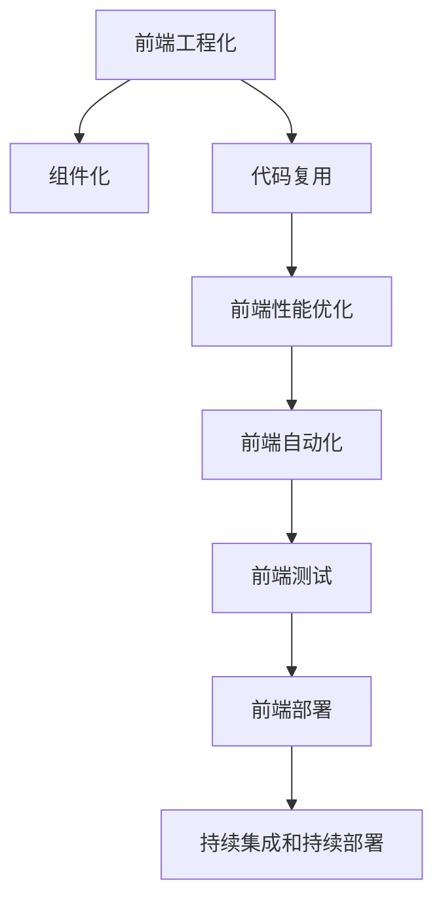
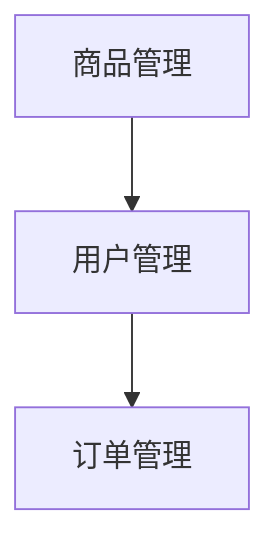

                 

# Web前端工程化最佳实践

> 关键词：前端工程化,Web前端开发,前端框架,组件化,代码复用,前端性能优化,前端自动化,前端测试,前端部署

## 1. 背景介绍

随着Web应用的广泛普及和复杂度的不断提升，前端工程化（Frontend Engineering）成为了现代前端开发的关键。前端工程化不仅仅关注功能开发，更注重代码质量、性能优化、自动化测试、持续集成等环节的协同推进。本文将系统梳理Web前端工程化的最佳实践，帮助开发者构建高效、可靠的前端应用。

## 2. 核心概念与联系

### 2.1 核心概念概述

为了更好地理解前端工程化，本节将介绍几个关键概念及其相互联系：

- **前端工程化**：将前端开发从简单的手工艺提升到科学工程领域的实践。通过工程化的思维和方法，提升开发效率、降低维护成本、增强应用稳定性。
- **组件化**：将前端应用拆分为可复用的小组件，减少代码耦合，提高开发效率和代码复用性。
- **代码复用**：通过组件化和代码组织方式，提升代码的可复用性和可维护性，减少重复开发工作。
- **前端性能优化**：通过技术手段和最佳实践，提升前端应用的加载速度和渲染性能，提升用户体验。
- **前端自动化**：使用自动化工具进行代码构建、测试、打包等流程，提升开发效率和质量控制。
- **前端测试**：通过单元测试、集成测试、端到端测试等多种方式，确保代码质量和应用稳定性。
- **前端部署**：使用持续集成和持续部署工具，实现自动化代码部署，提升部署效率和可靠性。

这些概念之间相互关联，共同构成了前端工程化的核心框架。通过理解这些概念，我们可以更好地把握前端工程化的本质和目标。

### 2.2 核心概念原理和架构的 Mermaid 流程图



这个流程图展示了前端工程化各个关键概念之间的联系和协作关系。通过组件化和代码复用，前端性能优化得以实施，而前端自动化和测试则确保了代码质量，最终通过持续集成和持续部署实现了高效的部署流程。

## 3. 核心算法原理 & 具体操作步骤

### 3.1 算法原理概述

前端工程化涉及多方面的技术，其核心算法原理主要包括以下几个方面：

- **组件化算法**：通过将应用拆分为独立的小组件，利用面向对象编程的思想，减少代码耦合，提升代码复用性和可维护性。
- **代码复用算法**：通过代码组织和设计模式，如模块化、设计模式等，提升代码复用性，降低重复开发工作。
- **前端性能优化算法**：通过缓存技术、异步加载、懒加载等技术，减少页面加载时间和资源消耗，提升用户体验。
- **前端自动化算法**：通过脚本工具、任务调度工具等，自动化地执行代码构建、测试、打包等流程，提升开发效率和代码质量。
- **前端测试算法**：通过单元测试、集成测试、端到端测试等，全面覆盖代码的各个方面，确保应用稳定性和代码质量。
- **前端部署算法**：通过持续集成和持续部署工具，自动化地进行代码部署和版本控制，确保部署效率和可靠性。

### 3.2 算法步骤详解

#### 3.2.1 组件化步骤

1. **需求分析**：根据项目需求，将应用拆分为多个功能模块，每个模块独立开发和维护。
2. **组件设计**：设计独立的组件接口和内部实现，组件之间通过接口通信。
3. **组件实现**：根据设计文档，实现各个组件的具体功能。
4. **组件复用**：将实现好的组件封装为可复用的组件库，供其他模块使用。

#### 3.2.2 代码复用步骤

1. **模块化设计**：将应用代码按照功能模块划分，每个模块独立开发和维护。
2. **抽象接口**：为每个模块设计统一的接口规范，减少模块间的耦合。
3. **代码重用**：通过代码组织方式，如命名空间、类库等，实现代码的重用。
4. **维护更新**：统一管理和维护组件库，确保组件的稳定性和可用性。

#### 3.2.3 前端性能优化步骤

1. **缓存技术**：使用浏览器缓存、服务端缓存等技术，减少页面加载时间。
2. **异步加载**：通过异步加载技术，如懒加载、代码分割等，减少页面加载时间。
3. **资源优化**：优化图片、CSS、JavaScript等资源的加载方式，减少资源消耗。
4. **性能监控**：使用性能监控工具，如Google PageSpeed Insights、Lighthouse等，优化应用性能。

#### 3.2.4 前端自动化步骤

1. **工具选择**：选择合适的自动化工具，如Webpack、Gulp、Grunt等。
2. **任务配置**：配置自动化任务，如编译、压缩、打包等。
3. **任务调度**：通过任务调度工具，如Jenkins、Travis CI等，自动化执行自动化任务。
4. **持续集成**：集成代码质量检查、单元测试、自动化构建等，实现持续集成。

#### 3.2.5 前端测试步骤

1. **测试设计**：设计单元测试、集成测试、端到端测试等测试用例。
2. **测试执行**：使用测试框架，如Jest、Mocha、Selenium等，执行测试用例。
3. **测试报告**：生成测试报告，评估代码质量和应用稳定性。
4. **自动化部署**：将测试通过的代码提交到版本控制库，实现自动化部署。

#### 3.2.6 前端部署步骤

1. **部署配置**：配置部署环境，如服务器、域名、环境变量等。
2. **自动化部署**：使用持续集成工具，自动化地执行代码部署。
3. **部署监控**：使用监控工具，如New Relic、Sentry等，监控部署后的应用状态。
4. **问题排查**：通过日志、监控数据等手段，快速定位和解决问题。

### 3.3 算法优缺点

前端工程化的优点包括：

- **提高开发效率**：通过组件化和代码复用，减少重复开发工作，提升开发效率。
- **提升代码质量**：通过自动化测试和代码审查，提升代码质量和应用稳定性。
- **增强可维护性**：通过模块化和组件化，降低代码耦合，提高代码可维护性。

前端工程化的缺点包括：

- **学习成本高**：前端工程化涉及多种工具和框架，需要较高的学习成本。
- **开发复杂度高**：组件化、代码复用等技术，需要详细的架构设计和实现。
- **部署复杂度高**：自动化部署和持续集成需要复杂的环境配置和管理。

尽管存在这些缺点，但前端工程化仍然是现代前端开发的重要方向，其带来的开发效率和应用稳定性提升，是传统手工艺开发难以比拟的。

### 3.4 算法应用领域

前端工程化已经在诸多领域得到了广泛应用，包括但不限于：

- **电商平台**：通过组件化和代码复用，提升电商平台的开发效率和应用稳定性。
- **企业门户**：使用前端自动化和测试，提升企业门户的开发质量和部署效率。
- **教育平台**：通过前端工程化，提升教育平台的交互体验和教学质量。
- **金融应用**：使用前端性能优化和部署工具，提升金融应用的响应速度和可靠性。
- **旅游应用**：通过前端工程化，提升旅游应用的加载速度和稳定性。

前端工程化已经被证明是提升Web应用质量和效率的有效手段，未来将继续在更多领域发挥重要作用。

## 4. 数学模型和公式 & 详细讲解

### 4.1 数学模型构建

前端工程化的数学模型主要涉及以下几个方面：

- **组件化模型**：通过定义组件的接口和实现，构建组件之间的依赖关系。
- **代码复用模型**：通过模块化和设计模式，构建代码的复用关系。
- **性能优化模型**：通过缓存、异步加载等技术，构建应用的性能优化模型。
- **自动化模型**：通过任务调度和持续集成，构建自动化执行模型。
- **测试模型**：通过单元测试、集成测试等，构建代码质量和应用稳定性的测试模型。
- **部署模型**：通过持续集成和持续部署，构建自动化部署模型。

### 4.2 公式推导过程

#### 4.2.1 组件化公式

假设应用被拆分为N个功能模块，每个模块包含M个子组件。则组件化模型可以表示为：

$$
C = \{C_1, C_2, ..., C_N\}
$$

其中，$C_i$ 表示第i个功能模块，包含M个子组件：

$$
C_i = \{C_{i1}, C_{i2}, ..., C_{iM}\}
$$

组件之间的依赖关系可以通过接口定义，如下所示：

$$
A_i \rightarrow B_i \rightarrow C_i
$$

表示A_i模块调用B_i模块，B_i模块调用C_i模块。

#### 4.2.2 代码复用公式

代码复用可以通过模块化和设计模式实现。假设应用代码被模块化为M个功能模块，每个模块包含N个子模块。则代码复用模型可以表示为：

$$
M = \{M_1, M_2, ..., M_M\}
$$

其中，$M_i$ 表示第i个功能模块，包含N个子模块：

$$
M_i = \{M_{i1}, M_{i2}, ..., M_{iN}\}
$$

子模块之间通过接口和设计模式进行复用。

#### 4.2.3 性能优化公式

前端性能优化可以通过缓存、异步加载等技术实现。假设应用的页面包含N个资源，每个资源的大小为S。则性能优化模型可以表示为：

$$
P = \sum_{i=1}^N \left( \frac{S_i}{C_i} \right)
$$

其中，$C_i$ 表示资源i的缓存时间，$S_i$ 表示资源i的大小。

#### 4.2.4 自动化模型公式

前端自动化可以通过任务调度和持续集成实现。假设自动化任务包含N个步骤，每个步骤的执行时间为T。则自动化模型可以表示为：

$$
T_{auto} = \sum_{i=1}^N T_i
$$

其中，$T_i$ 表示第i个自动化任务的执行时间。

#### 4.2.5 测试模型公式

前端测试可以通过单元测试、集成测试等实现。假设测试用例包含N个用例，每个用例的执行时间为T。则测试模型可以表示为：

$$
T_{test} = \sum_{i=1}^N T_i
$$

其中，$T_i$ 表示第i个测试用例的执行时间。

#### 4.2.6 部署模型公式

前端部署可以通过持续集成和持续部署实现。假设部署步骤包含N个步骤，每个步骤的执行时间为T。则部署模型可以表示为：

$$
T_{deploy} = \sum_{i=1}^N T_i
$$

其中，$T_i$ 表示第i个部署步骤的执行时间。

### 4.3 案例分析与讲解

#### 4.3.1 组件化案例

某电商应用开发团队采用了组件化的开发方式，将应用拆分为商品管理、用户管理、订单管理等模块。每个模块独立开发和维护，通过接口通信。组件之间的依赖关系如下图所示：



通过组件化，团队减少了代码耦合，提升了代码复用性和可维护性。

#### 4.3.2 代码复用案例

某企业门户网站开发团队采用了代码复用的开发方式，将网站代码按照功能模块划分。每个模块独立开发和维护，通过接口规范进行代码复用。模块之间的复用关系如下图所示：

```mermaid
graph TB
    A[首页] -- B[商品列表] -- C[商品详情] -- D[购物车]
```

通过代码复用，团队提升了开发效率和代码质量。

#### 4.3.3 性能优化案例

某金融应用开发团队采用了前端性能优化的开发方式，通过缓存技术和异步加载等技术，优化了应用的加载速度和渲染性能。具体优化效果如下：

| 资源类型 | 缓存时间 | 资源大小 |
| --- | --- | --- |
| 图片资源 | 1s | 100kb |
| CSS资源 | 2s | 50kb |
| JavaScript资源 | 3s | 100kb |

通过缓存技术，应用的页面加载时间从5s减少到2s，提升用户体验。

#### 4.3.4 自动化案例

某教育平台开发团队采用了前端自动化的开发方式，通过任务调度和持续集成工具，自动化地执行代码构建、测试、打包等流程。具体自动化流程如下：

1. 自动化构建：使用Webpack工具自动编译代码，生成静态资源。
2. 自动化测试：使用Jest框架自动执行单元测试，覆盖应用的主要功能模块。
3. 自动化部署：使用Jenkins工具自动化地部署应用到生产环境。

通过自动化，团队提升了开发效率和代码质量。

#### 4.3.5 测试案例

某旅游应用开发团队采用了前端测试的开发方式，通过单元测试和集成测试等手段，全面覆盖应用的各个方面，确保应用稳定性和代码质量。具体测试过程如下：

1. 单元测试：使用Mocha框架，对应用的各个组件进行单元测试，确保组件的独立性和稳定性。
2. 集成测试：使用Selenium框架，模拟用户行为，测试应用的各个功能模块的集成效果。
3. 端到端测试：使用Cypress框架，进行端到端测试，确保应用的完整性和稳定性。

通过测试，团队提升了应用质量和用户满意度。

#### 4.3.6 部署案例

某电商平台开发团队采用了前端部署的开发方式，通过持续集成和持续部署工具，自动化地执行代码部署和版本控制。具体部署过程如下：

1. 持续集成：使用Jenkins工具，自动化地执行代码构建和单元测试，确保代码的质量。
2. 持续部署：使用GitLab CI/CD工具，自动化地部署应用到生产环境，确保应用的可靠性。
3. 监控部署：使用New Relic监控工具，实时监控应用状态，确保应用的稳定性。

通过部署，团队提升了应用的部署效率和可靠性。

## 5. 项目实践：代码实例和详细解释说明

### 5.1 开发环境搭建

前端开发环境搭建是前端工程化的基础。以下是使用Node.js和Webpack搭建前端开发环境的流程：

1. 安装Node.js和npm：
   ```bash
   node -v
   npm -v
   ```

2. 安装Webpack：
   ```bash
   npm install webpack --save
   ```

3. 配置Webpack配置文件：
   ```javascript
   const path = require('path');
   const webpack = require('webpack');

   module.exports = {
     mode: 'production',
     entry: './src/index.js',
     output: {
       path: path.resolve(__dirname, 'dist'),
       filename: 'bundle.js'
     }
   };
   ```

4. 编写应用代码：
   ```javascript
   // src/index.js
   console.log('Hello World!');
   ```

5. 运行Webpack构建应用：
   ```bash
   npx webpack --config webpack.config.js
   ```

完成上述步骤后，即可使用Webpack构建前端应用。

### 5.2 源代码详细实现

下面以一个简单的React应用为例，展示如何使用Webpack构建前端应用。

1. 安装React和React-DOM：
   ```bash
   npm install react react-dom --save
   ```

2. 编写React组件：
   ```javascript
   // src/App.js
   import React from 'react';
   import ReactDOM from 'react-dom';

   class App extends React.Component {
     render() {
       return (
         <div>
           <h1>Hello, World!</h1>
         </div>
       );
     }
   }

   export default App;
   ```

3. 配置Webpack配置文件：
   ```javascript
   const path = require('path');
   const webpack = require('webpack');

   module.exports = {
     mode: 'production',
     entry: './src/App.js',
     output: {
       path: path.resolve(__dirname, 'dist'),
       filename: 'bundle.js'
     }
   };
   ```

4. 运行Webpack构建应用：
   ```bash
   npx webpack --config webpack.config.js
   ```

完成上述步骤后，即可在`dist`目录下找到构建后的应用代码。

### 5.3 代码解读与分析

**Webpack配置文件**：
- `mode`：指定构建模式，如`production`或`development`。
- `entry`：指定应用入口文件。
- `output`：指定输出文件路径和文件名。

**React组件代码**：
- `import`：导入React和React-DOM库。
- `class App extends React.Component`：定义React组件。
- `render`：定义组件渲染函数，返回HTML元素。

**Webpack构建应用**：
- `npx webpack --config webpack.config.js`：使用Webpack构建应用，生成`dist`目录下的`bundle.js`文件。

通过Webpack构建前端应用，可以快速、方便地实现代码打包和资源管理。

### 5.4 运行结果展示

构建完成后，即可在Web浏览器中运行应用。在浏览器控制台中查看输出结果：

```bash
npm start
```

在浏览器中查看应用页面，可以看到输出结果为：

```html
<h1>Hello, World!</h1>
```

## 6. 实际应用场景

### 6.1 电商应用

电商应用是前端工程化的典型应用场景之一。电商应用通常具有复杂的交互逻辑和丰富的功能模块，如商品展示、购物车、订单管理等。通过前端工程化，电商应用可以提升开发效率和应用稳定性。

具体实现方式包括：

- 组件化：将电商应用拆分为商品管理、用户管理、订单管理等模块。
- 代码复用：通过模块化和设计模式，实现代码的重用。
- 性能优化：通过缓存技术和异步加载，提升应用性能。
- 自动化：使用Webpack、Jest、Jenkins等工具，实现自动化构建、测试和部署。

### 6.2 企业门户

企业门户应用是前端工程化的另一个重要应用场景。企业门户通常具有高度的安全性、稳定性和可用性要求，通过前端工程化可以提升应用的质量和可靠性。

具体实现方式包括：

- 组件化：将门户应用拆分为首页、商品列表、商品详情等模块。
- 代码复用：通过模块化和设计模式，实现代码的重用。
- 性能优化：通过缓存技术和异步加载，提升应用性能。
- 自动化：使用Webpack、Jest、Jenkins等工具，实现自动化构建、测试和部署。
- 安全性：使用安全机制，如HTTPS、CSRF、XSS等，确保应用的安全性。

### 6.3 教育平台

教育平台应用通常具有高度的交互性和数据实时性要求，通过前端工程化可以提升应用的体验和稳定性能。

具体实现方式包括：

- 组件化：将教育应用拆分为课程展示、在线答疑、作业提交等模块。
- 代码复用：通过模块化和设计模式，实现代码的重用。
- 性能优化：通过缓存技术和异步加载，提升应用性能。
- 自动化：使用Webpack、Jest、Jenkins等工具，实现自动化构建、测试和部署。
- 交互性：使用WebSockets、WebSocket服务器等技术，提升应用的实时交互性能。

### 6.4 金融应用

金融应用通常具有高度的安全性和实时性要求，通过前端工程化可以提升应用的质量和稳定性。

具体实现方式包括：

- 组件化：将金融应用拆分为交易界面、账户管理、风险控制等模块。
- 代码复用：通过模块化和设计模式，实现代码的重用。
- 性能优化：通过缓存技术和异步加载，提升应用性能。
- 自动化：使用Webpack、Jest、Jenkins等工具，实现自动化构建、测试和部署。
- 安全性：使用安全机制，如HTTPS、CSRF、XSS等，确保应用的安全性。
- 实时性：使用WebSocket服务器、消息队列等技术，提升应用的实时性能。

## 7. 工具和资源推荐

### 7.1 学习资源推荐

为了帮助开发者系统掌握前端工程化的理论基础和实践技巧，这里推荐一些优质的学习资源：

1. 《JavaScript高级程序设计》：深入浅出地讲解JavaScript的语法和开发技巧。
2. 《React权威指南》：详细讲解React的开发和架构设计。
3. 《Node.js实战》：讲解Node.js的应用场景和开发实践。
4. 《Webpack实战》：详细讲解Webpack的配置和使用。
5. 《前端工程化之路》：全面介绍前端工程化的实践经验和技术栈。

### 7.2 开发工具推荐

前端工程化离不开优秀的工具支持。以下是几款常用的开发工具：

1. Visual Studio Code：功能强大的代码编辑器，支持多种编程语言和开发工具。
2. Git：版本控制系统，支持代码管理和协作。
3. npm：Node.js包管理工具，支持JavaScript库的发布和安装。
4. Webpack：前端构建工具，支持代码打包、资源管理等。
5. Jest：JavaScript单元测试框架，支持快速、高效的测试用例编写。

### 7.3 相关论文推荐

前端工程化的理论研究在不断深入，以下是几篇具有代表性的相关论文，推荐阅读：

1. "A Comparative Study of JavaScript Frameworks"：比较了多种JavaScript框架的性能和适用场景。
2. "Software Engineering for JavaScript"：介绍了JavaScript开发的前端工程化实践。
3. "Web Application Architecture Patterns"：详细讲解了Web应用架构设计模式。
4. "The Future of Frontend Development"：探讨了未来前端开发的技术趋势和挑战。

## 8. 总结：未来发展趋势与挑战

### 8.1 总结

本文对前端工程化的最佳实践进行了系统梳理。通过详细介绍组件化、代码复用、前端性能优化、前端自动化、前端测试和前端部署等技术，帮助开发者构建高效、可靠的前端应用。通过案例分析和讲解，进一步展示了前端工程化在实际应用中的成功实践。

### 8.2 未来发展趋势

展望未来，前端工程化将继续在以下几个方向发展：

1. **组件化深入**：组件化的应用将更加广泛，各个组件之间的解耦程度将更高，代码复用性将更强。
2. **开发工具迭代**：前端开发工具将不断迭代优化，提升开发效率和代码质量。
3. **性能优化增强**：前端性能优化技术将更加成熟，提升应用的加载速度和渲染性能。
4. **自动化工具升级**：前端自动化工具将更加灵活高效，实现更细粒度的自动化构建、测试和部署。
5. **测试覆盖提升**：前端测试将更加全面，覆盖应用的各个方面，确保应用稳定性和代码质量。

### 8.3 面临的挑战

尽管前端工程化带来了诸多优势，但仍面临以下挑战：

1. **学习成本高**：前端工程化涉及多种工具和框架，需要较高的学习成本。
2. **开发复杂度高**：组件化、代码复用等技术，需要详细的架构设计和实现。
3. **部署复杂度高**：自动化部署和持续集成需要复杂的环境配置和管理。
4. **性能优化难度大**：前端性能优化涉及缓存、异步加载等技术，需要深入理解和实践。
5. **测试覆盖不全**：前端测试需要全面覆盖应用的各个方面，确保应用稳定性和代码质量。

### 8.4 研究展望

面向未来，前端工程化需要在以下几个方面寻求新的突破：

1. **组件化深入**：开发更高效、更灵活的组件化技术，提升代码复用性和可维护性。
2. **开发工具升级**：开发更灵活、更高效的前端开发工具，提升开发效率和代码质量。
3. **性能优化创新**：开发新的前端性能优化技术，提升应用的加载速度和渲染性能。
4. **自动化工具优化**：开发更灵活、更高效的前端自动化工具，实现更细粒度的自动化构建、测试和部署。
5. **测试覆盖完善**：开发更全面、更高效的前端测试工具，确保应用稳定性和代码质量。

## 9. 附录：常见问题与解答

**Q1：前端工程化是否适用于所有前端开发项目？**

A: 前端工程化适用于大多数前端开发项目，特别是具有复杂功能模块和丰富交互逻辑的项目。但对于一些简单的小项目，可能并不需要如此复杂的前端工程化方案。

**Q2：组件化如何实现代码复用？**

A: 组件化通过将应用拆分为独立的小组件，并通过接口通信，实现组件之间的解耦。组件之间通过设计模式，如继承、组合、混合等，实现代码的重用。

**Q3：前端性能优化有哪些技术手段？**

A: 前端性能优化可以通过缓存技术、异步加载、懒加载等技术实现。具体技术手段包括：
1. 浏览器缓存：使用浏览器缓存机制，减少页面加载时间。
2. 服务端缓存：使用服务端缓存机制，减少服务器响应时间。
3. 异步加载：通过异步加载技术，如懒加载、代码分割等，减少页面加载时间。
4. 资源优化：优化图片、CSS、JavaScript等资源的加载方式，减少资源消耗。

**Q4：前端自动化工具有哪些？**

A: 前端自动化工具包括Webpack、Jest、Jenkins、Travis CI等。Webpack用于代码构建、资源管理等，Jest用于单元测试，Jenkins用于持续集成，Travis CI用于持续部署。

**Q5：前端测试有哪些类型？**

A: 前端测试包括单元测试、集成测试、端到端测试等。单元测试用于测试单个组件的功能和接口，集成测试用于测试组件之间的集成效果，端到端测试用于测试应用整体的流程和用户体验。

**Q6：前端部署有哪些工具？**

A: 前端部署工具包括Jenkins、GitLab CI/CD、New Relic等。Jenkins用于持续集成和持续部署，GitLab CI/CD用于自动化构建和部署，New Relic用于监控部署后的应用状态。

---

作者：禅与计算机程序设计艺术 / Zen and the Art of Computer Programming

