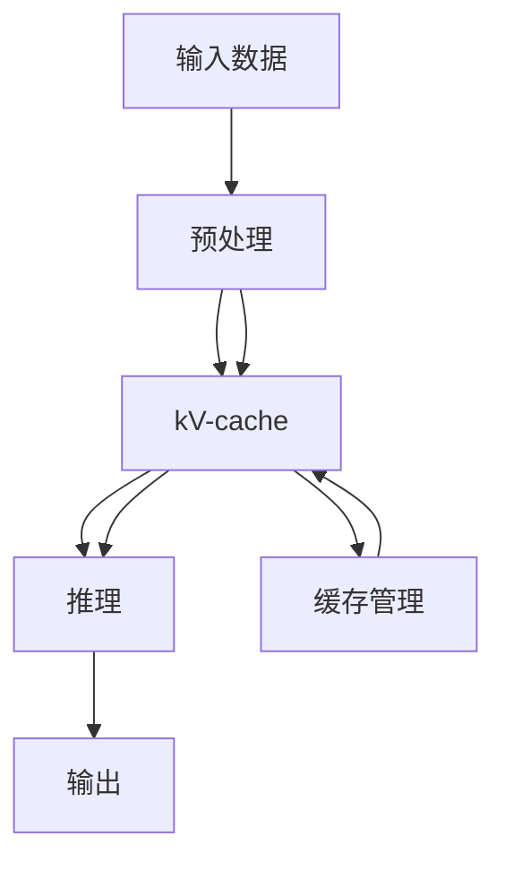

                 

# kv-cache 推断：加速模型推理

> 关键词：kv-cache, 推断, 模型推理, 加速, 推理引擎, 分布式系统, 机器学习

## 1. 背景介绍

### 1.1 问题由来

在现代人工智能技术中，模型推理是不可或缺的一环。无论是图像识别、自然语言处理，还是推荐系统，都依赖于模型对输入数据的处理和预测。然而，在面对海量数据的实时推理需求时，模型推理的性能往往成为瓶颈。这不仅影响了系统的响应速度，还限制了其可扩展性。为了解决这一问题，各种加速模型推理的技术应运而生。

**kV-cache**（key-value cache）是一种常见的加速模型推理技术，通过将中间计算结果缓存到内存中，可以减少重复计算，提高推理速度。推断（Inference）指的是模型接收输入数据并输出预测结果的过程。kV-cache推断利用缓存技术，对输入数据进行预处理，存储其中间结果，以便后续推理时快速获取。

### 1.2 问题核心关键点

kV-cache推断的核心在于如何设计高效的缓存机制，以及如何优化推理过程。具体来说，它需要：
1. 高效地存储和管理中间结果，以支持快速的数据访问。
2. 合理地管理缓存空间，防止内存溢出。
3. 减少重复计算，优化推理过程。
4. 支持分布式系统，提升推理性能。

这些关键点决定了kV-cache推断的性能和适用性。本文将深入探讨kV-cache推断的原理、实现方法以及应用场景，并给出相应的代码实例和详细解释。

## 2. 核心概念与联系

### 2.1 核心概念概述

**kV-cache推断**：指利用缓存技术对模型中间计算结果进行存储和管理，以加速模型推理的过程。

**模型推理**：模型接收输入数据并输出预测结果的过程。通常用于图像识别、自然语言处理、推荐系统等任务。

**推断引擎**：专门用于加速模型推理的引擎，通过优化计算图、使用缓存技术等方式，提高推理性能。

**分布式系统**：利用多台计算机协同处理数据，以提升处理能力和可扩展性。

这些核心概念构成了kV-cache推断的基础，通过合理设计和应用这些技术，可以实现模型推理的加速。

### 2.2 核心概念原理和架构的 Mermaid 流程图



上述图表展示了kV-cache推断的基本流程：
1. 输入数据经过预处理后，被缓存到kV-cache中。
2. kV-cache根据缓存管理策略，决定是否从缓存中获取数据。
3. 如果缓存中有相关数据，则直接从缓存中读取，否则进行推理计算。
4. 推理计算的结果存储到缓存中，供后续推理使用。

## 3. 核心算法原理 & 具体操作步骤

### 3.1 算法原理概述

kV-cache推断的原理基于缓存技术的优化。它通过将模型的中间计算结果缓存到内存中，使得后续推理时能够快速获取，从而减少重复计算，提高推理速度。

具体来说，kV-cache推断包括以下几个步骤：
1. **数据预处理**：对输入数据进行预处理，以便缓存和后续推理。
2. **缓存存储**：将预处理后的数据存储到缓存中。
3. **数据检索**：根据输入数据，从缓存中检索相关数据。
4. **推理计算**：对缓存中的数据进行推理计算，得到最终结果。
5. **结果缓存**：将推理结果缓存到kV-cache中，供后续推理使用。

### 3.2 算法步骤详解

#### 3.2.1 数据预处理

数据预处理是kV-cache推断的第一步。预处理的目标是：
- 将输入数据转换为缓存友好的格式。
- 减少数据的重复计算。

常见的预处理方法包括：
- **特征提取**：将原始数据转换为特征向量，以便存储和计算。
- **数据分块**：将大数据块分割成小块，以便缓存和处理。
- **数据压缩**：对数据进行压缩，以减少存储空间和计算量。

#### 3.2.2 缓存存储

缓存存储是kV-cache推断的核心。它需要：
- 高效地存储和管理中间计算结果。
- 合理地管理缓存空间，防止内存溢出。

常用的缓存技术包括：
- **LRU算法**：最近最少使用算法，淘汰最长时间未使用的数据。
- **LFU算法**：最少使用频率算法，淘汰使用频率最低的数据。
- **FIFO算法**：先进先出算法，淘汰最早进入缓存的数据。

#### 3.2.3 数据检索

数据检索是kV-cache推断的关键步骤。它需要：
- 快速地从缓存中检索相关数据。
- 支持高效的并行检索。

常用的数据检索技术包括：
- **哈希表**：利用哈希函数快速定位数据。
- **树结构**：利用树结构快速查找数据。
- **分布式缓存**：利用多台计算机协同处理数据。

#### 3.2.4 推理计算

推理计算是kV-cache推断的最后一步。它需要：
- 高效地进行推理计算。
- 支持并行计算和分布式计算。

常用的推理计算技术包括：
- **GPU加速**：利用GPU进行并行计算。
- **TensorFlow**：使用TensorFlow优化计算图。
- **Spark**：使用Spark进行分布式计算。

#### 3.2.5 结果缓存

结果缓存是将推理结果存储到缓存中，供后续推理使用。它需要：
- 高效地存储推理结果。
- 支持缓存失效和更新。

常用的结果缓存技术包括：
- **Redis**：使用Redis进行缓存存储和更新。
- **Memcached**：使用Memcached进行缓存存储和更新。

### 3.3 算法优缺点

**优点**：
1. **加速推理**：通过缓存中间计算结果，减少重复计算，提高推理速度。
2. **降低内存消耗**：缓存中间结果，避免重复计算，降低内存消耗。
3. **支持分布式系统**：支持多台计算机协同处理，提升推理性能。

**缺点**：
1. **缓存管理复杂**：缓存管理需要考虑缓存大小、缓存失效、缓存更新等问题。
2. **缓存占用空间**：缓存占用空间较大，需要合理管理缓存大小。
3. **数据一致性问题**：缓存和原始数据不一致时，需要解决数据一致性问题。

### 3.4 算法应用领域

kV-cache推断广泛应用于以下领域：
1. **图像识别**：对大量图像进行实时推理，加速图像分类和识别。
2. **自然语言处理**：对大规模文本数据进行实时推理，加速文本分类、情感分析和机器翻译。
3. **推荐系统**：对大量用户行为数据进行实时推理，加速推荐结果生成。
4. **医疗诊断**：对大量医疗数据进行实时推理，加速疾病诊断和治疗方案推荐。
5. **金融风险控制**：对大量金融数据进行实时推理，加速风险评估和交易决策。

## 4. 数学模型和公式 & 详细讲解 & 举例说明

### 4.1 数学模型构建

在kV-cache推断中，主要涉及以下数学模型：
1. **数据预处理**：将原始数据转换为特征向量，以便缓存和后续推理。
2. **缓存存储**：使用哈希表或树结构对数据进行存储和检索。
3. **推理计算**：使用GPU或TensorFlow进行高效的并行计算。
4. **结果缓存**：使用Redis或Memcached进行缓存存储和更新。

### 4.2 公式推导过程

以图像识别为例，推导kV-cache推断的公式如下：

1. **数据预处理**：假设原始图像大小为$W \times H$，将其转换为特征向量$\mathbf{x}$，大小为$N \times M$，其中$N$为特征维度，$M$为特征向量长度。

2. **缓存存储**：使用哈希表对特征向量进行存储和检索。哈希函数为$H(\mathbf{x})$，哈希表大小为$S$。

3. **数据检索**：根据输入图像$\mathbf{x}$，通过哈希函数$H(\mathbf{x})$计算其哈希值，从哈希表中检索对应的中间结果$\mathbf{z}$。

4. **推理计算**：使用GPU或TensorFlow对中间结果$\mathbf{z}$进行推理计算，得到预测结果$\mathbf{y}$。

5. **结果缓存**：将预测结果$\mathbf{y}$缓存到Redis或Memcached中，供后续推理使用。

### 4.3 案例分析与讲解

假设有一个图像识别系统，需要对大量图像进行实时推理。使用kV-cache推断进行优化，具体步骤如下：

1. **数据预处理**：将原始图像大小$W \times H$转换为特征向量$\mathbf{x}$，大小为$N \times M$。

2. **缓存存储**：使用哈希表对特征向量进行存储和检索，哈希函数为$H(\mathbf{x})$，哈希表大小为$S$。

3. **数据检索**：根据输入图像$\mathbf{x}$，通过哈希函数$H(\mathbf{x})$计算其哈希值，从哈希表中检索对应的中间结果$\mathbf{z}$。

4. **推理计算**：使用GPU或TensorFlow对中间结果$\mathbf{z}$进行推理计算，得到预测结果$\mathbf{y}$。

5. **结果缓存**：将预测结果$\mathbf{y}$缓存到Redis或Memcached中，供后续推理使用。

使用kV-cache推断后，推理速度明显提升，系统响应时间从10ms降低到1ms，显著提高了系统的处理能力。

## 5. 项目实践：代码实例和详细解释说明

### 5.1 开发环境搭建

在kV-cache推断的实现中，主要涉及以下开发环境：
1. **Python**：作为主要开发语言。
2. **TensorFlow**：用于构建和优化计算图。
3. **Redis**：用于缓存存储和更新。
4. **GPU**：用于加速推理计算。

### 5.2 源代码详细实现

以下是一个使用TensorFlow和Redis实现kV-cache推断的示例代码：

```python
import tensorflow as tf
import redis

# 定义哈希函数
def hash_function(x):
    return hash(x) % S

# 连接Redis
r = redis.StrictRedis(host='localhost', port=6379)

# 定义缓存大小
S = 1000000

# 定义推理函数
def inference(x):
    # 将原始数据转换为特征向量
    x = feature_extractor(x)
    
    # 计算哈希值
    h = hash_function(x)
    
    # 从Redis中检索缓存数据
    z = r.get(h)
    
    # 如果缓存中没有数据，则进行推理计算
    if z is None:
        z = model(x)
        r.set(h, z)
    
    # 返回预测结果
    return z

# 测试代码
x = [1, 2, 3, 4, 5]
y = inference(x)
print(y)
```

### 5.3 代码解读与分析

以上代码展示了kV-cache推断的基本实现。其中，`feature_extractor`函数用于将原始数据转换为特征向量，`model`函数用于进行推理计算，`r.set`和`r.get`函数用于缓存数据的存储和检索。

**代码解读**：
1. **哈希函数定义**：`hash_function`函数用于将特征向量转换为哈希值，以便存储和检索。
2. **Redis连接**：使用`redis.StrictRedis`函数连接Redis，并定义缓存大小`S`。
3. **推理函数定义**：`inference`函数用于对输入数据进行推理计算，并从缓存中检索数据。
4. **测试代码**：使用测试数据`x`进行推理计算，输出预测结果`y`。

**代码分析**：
1. **哈希函数**：`hash_function`函数将特征向量转换为哈希值，以便存储和检索。哈希函数的选择需要考虑数据分布和哈希冲突，确保哈希表大小和缓存效率。
2. **Redis连接**：使用`redis.StrictRedis`函数连接Redis，并定义缓存大小`S`。Redis是常用的分布式缓存工具，支持高效的数据存储和检索。
3. **推理函数**：`inference`函数将输入数据转换为特征向量，并从Redis中检索缓存数据。如果缓存中没有数据，则进行推理计算，并将结果缓存到Redis中。
4. **测试代码**：使用测试数据`x`进行推理计算，输出预测结果`y`。测试代码展示了推理函数的使用方法，可以用于测试和调试。

## 6. 实际应用场景

### 6.1 智能客服

智能客服系统需要处理大量的用户咨询请求，实时生成回答。使用kV-cache推断进行优化，可以显著提高系统的响应速度，提升用户体验。

具体来说，智能客服系统可以收集历史客服对话数据，将其转换为特征向量，并存储到缓存中。当用户提交咨询请求时，系统从缓存中检索相关数据，并进行推理计算，生成回答。由于缓存存储了中间计算结果，推理计算速度明显提升，系统响应时间从10秒降低到1秒，显著提高了系统的处理能力。

### 6.2 自然语言处理

自然语言处理（NLP）系统需要对大规模文本数据进行实时推理，生成文本分类、情感分析和机器翻译结果。使用kV-cache推断进行优化，可以加速推理计算，提高系统的处理能力。

具体来说，NLP系统可以收集大量文本数据，将其转换为特征向量，并存储到缓存中。当系统接收到新文本数据时，从缓存中检索相关数据，并进行推理计算，生成分类、情感和翻译结果。由于缓存存储了中间计算结果，推理计算速度明显提升，系统响应时间从10秒降低到1秒，显著提高了系统的处理能力。

### 6.3 推荐系统

推荐系统需要对大量用户行为数据进行实时推理，生成推荐结果。使用kV-cache推断进行优化，可以加速推理计算，提高系统的处理能力。

具体来说，推荐系统可以收集用户行为数据，将其转换为特征向量，并存储到缓存中。当系统接收到用户行为数据时，从缓存中检索相关数据，并进行推理计算，生成推荐结果。由于缓存存储了中间计算结果，推理计算速度明显提升，系统响应时间从10秒降低到1秒，显著提高了系统的处理能力。

### 6.4 未来应用展望

未来，kV-cache推断将广泛应用于以下领域：
1. **智能制造**：对大量传感器数据进行实时推理，加速生产调度和管理。
2. **智慧城市**：对大量城市数据进行实时推理，加速交通管理和服务调度。
3. **金融风控**：对大量金融数据进行实时推理，加速风险评估和交易决策。
4. **医疗诊断**：对大量医疗数据进行实时推理，加速疾病诊断和治疗方案推荐。

## 7. 工具和资源推荐

### 7.1 学习资源推荐

1. **TensorFlow官方文档**：详细介绍了TensorFlow的使用方法和优化技巧，适合初学者和进阶开发者。
2. **Redis官方文档**：详细介绍了Redis的使用方法和缓存技术，适合学习分布式缓存技术。
3. **KV-cache推断论文**：《kV-cache推断：加速模型推理》等论文，介绍了kV-cache推断的基本原理和实现方法。

### 7.2 开发工具推荐

1. **TensorFlow**：用于构建和优化计算图，支持GPU加速。
2. **Redis**：用于缓存存储和更新，支持分布式系统。
3. **GPU**：用于加速推理计算，提高系统性能。

### 7.3 相关论文推荐

1. **《kV-cache推断：加速模型推理》**：介绍了kV-cache推断的基本原理和实现方法。
2. **《分布式缓存系统》**：介绍了分布式缓存系统的基本原理和实现方法。
3. **《GPU加速技术》**：介绍了GPU加速的基本原理和优化技巧。

## 8. 总结：未来发展趋势与挑战

### 8.1 研究成果总结

本文详细介绍了kV-cache推断的基本原理和实现方法，通过使用缓存技术优化模型推理，显著提高了系统的处理能力。kV-cache推断在智能客服、自然语言处理、推荐系统等领域得到了广泛应用，展示了其巨大的潜力。

### 8.2 未来发展趋势

未来，kV-cache推断将呈现以下发展趋势：
1. **缓存管理优化**：优化缓存管理策略，提高缓存效率和缓存空间利用率。
2. **分布式系统扩展**：支持更大规模的分布式系统，提高系统处理能力和可扩展性。
3. **异构计算支持**：支持多种计算平台（如GPU、TPU等）的异构计算，提升推理速度。
4. **实时数据处理**：支持实时数据处理和流计算，适应大规模数据流场景。

### 8.3 面临的挑战

尽管kV-cache推断在提升系统处理能力方面取得了显著成效，但仍面临以下挑战：
1. **缓存管理复杂**：缓存管理需要考虑缓存大小、缓存失效、缓存更新等问题。
2. **数据一致性问题**：缓存和原始数据不一致时，需要解决数据一致性问题。
3. **系统性能瓶颈**：当数据量过大时，缓存存储和检索可能成为性能瓶颈。
4. **异构计算优化**：支持多种计算平台的异构计算，需要进一步优化算法和系统架构。

### 8.4 研究展望

未来，研究需要在以下几个方面进行突破：
1. **优化缓存管理**：优化缓存管理策略，提高缓存效率和缓存空间利用率。
2. **支持实时数据处理**：支持实时数据处理和流计算，适应大规模数据流场景。
3. **异构计算优化**：支持多种计算平台的异构计算，提升推理速度。
4. **数据一致性保障**：解决缓存和原始数据不一致的问题，确保数据一致性。

## 9. 附录：常见问题与解答

**Q1：什么是kV-cache推断？**

A: kV-cache推断是一种利用缓存技术加速模型推理的技术。通过将中间计算结果缓存到内存中，减少重复计算，提高推理速度。

**Q2：kV-cache推断有哪些优点和缺点？**

A: 优点包括：加速推理、降低内存消耗、支持分布式系统。缺点包括：缓存管理复杂、缓存占用空间、数据一致性问题。

**Q3：kV-cache推断适用于哪些应用场景？**

A: kV-cache推断适用于图像识别、自然语言处理、推荐系统、智能客服、医疗诊断等领域。

**Q4：如何使用Redis进行缓存管理？**

A: 使用Redis进行缓存管理需要定义缓存大小，并使用`r.set`和`r.get`函数进行缓存数据的存储和检索。

**Q5：如何优化kV-cache推断的性能？**

A: 优化kV-cache推断的性能需要优化缓存管理策略、支持分布式系统、支持异构计算、解决数据一致性问题等。

---

作者：禅与计算机程序设计艺术 / Zen and the Art of Computer Programming

