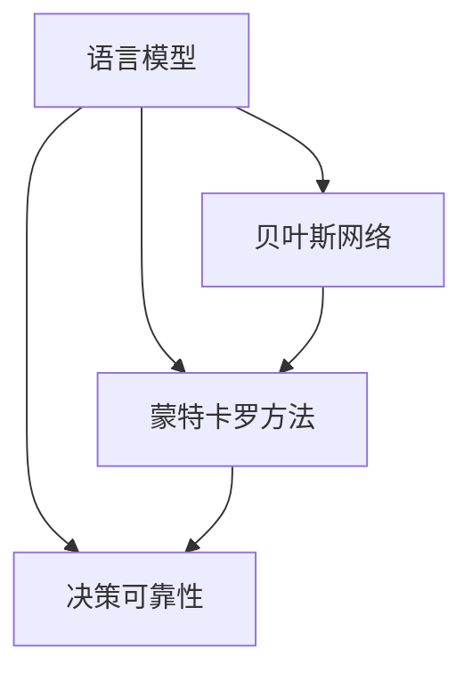

                 

# 不确定性管理：LLM决策的可靠性

> 关键词：语言模型,决策可靠性,不确定性管理,LLM,蒙特卡罗方法,贝叶斯网络

## 1. 背景介绍

### 1.1 问题由来

随着语言模型的发展，从简单的统计语言模型到神经网络语言模型，再到现今的生成式语言模型，模型的表现能力已经非常出色。然而，这些模型往往忽略了输出结果的不确定性，即在输出同一句话时，不同的输入样本可能得到不同的输出结果。这种不确定性在实际应用中可能会带来严重影响，如在自然语言处理任务中，模型的输出可能是错误的，或者与期望的结果相差甚远。

为了更好地管理这种不确定性，我们需要一种能够准确度量不确定性并采取相应措施的方法。本文将介绍两种主要的不确定性管理技术：蒙特卡罗方法和贝叶斯网络。这些方法能够帮助我们更好地理解模型的输出结果，并采取相应的措施来提高决策的可靠性。

### 1.2 问题核心关键点

在处理自然语言处理任务时，不确定性管理的核心问题可以归结为以下三个方面：

1. **输出不确定性**：模型在输入同一句话时，不同的样本可能会产生不同的输出结果。

2. **输入不确定性**：不同的输入可能会导致模型产生不同的输出，即模型的输入数据本身具有不确定性。

3. **推理不确定性**：模型在推理过程中可能引入不确定性，如在生成式语言模型中，解码器选择不同路径的可能性可能导致不同的输出结果。

## 2. 核心概念与联系

### 2.1 核心概念概述

为更好地理解不确定性管理方法，本节将介绍几个密切相关的核心概念：

- **语言模型(Language Model, LM)**：基于统计或神经网络的语言模型，用于预测给定输入序列的概率。
- **蒙特卡罗方法(Monte Carlo Method)**：一种基于随机抽样的方法，用于度量模型的不确定性，并生成模型输出的多种可能结果。
- **贝叶斯网络(Bayesian Network)**：一种基于概率图模型的推断框架，用于表示变量之间的依赖关系，并计算条件概率。
- **决策可靠性(Decision Reliability)**：模型输出结果的可信度，即模型在不同输入样本下产生相同输出结果的可能性。

这些核心概念之间的逻辑关系可以通过以下Mermaid流程图来展示：



这个流程图展示了语言模型、蒙特卡罗方法、贝叶斯网络和决策可靠性之间的关系：

1. 语言模型是基础，用于生成模型输出。
2. 蒙特卡罗方法用于度量模型输出的不确定性，并生成多种可能结果。
3. 贝叶斯网络用于描述模型输入和输出之间的关系，并计算条件概率。
4. 决策可靠性是最终目标，即提高模型输出结果的可靠性和可信度。

这些核心概念共同构成了不确定性管理的方法框架，帮助我们理解并解决模型输出中的不确定性问题。

## 3. 核心算法原理 & 具体操作步骤

### 3.1 算法原理概述

不确定性管理的主要目的是通过度量模型的输出不确定性，并采取相应的措施来提高决策的可靠性。以下是两种常见的不确定性管理技术：

- **蒙特卡罗方法**：通过随机抽样生成模型输出的多种可能结果，计算每个结果的概率分布，从而度量模型的输出不确定性。
- **贝叶斯网络**：通过建立变量之间的依赖关系，计算条件概率，并利用贝叶斯定理来更新先验概率，从而提高模型输出的可靠性。

这两种方法的主要区别在于：蒙特卡罗方法更多关注于生成模型输出的多种可能结果，而贝叶斯网络则更多关注于描述变量之间的依赖关系。

### 3.2 算法步骤详解

#### 3.2.1 蒙特卡罗方法

蒙特卡罗方法的基本步骤如下：

1. **随机抽样**：从模型中随机抽取多个输入样本，并计算每个样本的输出结果。
2. **计算概率分布**：统计每个输出结果出现的次数，并计算其概率分布。
3. **度量不确定性**：通过概率分布度量模型输出的不确定性，如使用方差、标准差等指标。
4. **生成多种结果**：根据概率分布，生成模型输出的多种可能结果。

#### 3.2.2 贝叶斯网络

贝叶斯网络的基本步骤如下：

1. **构建网络**：建立变量之间的依赖关系，形成一个概率图模型。
2. **计算先验概率**：根据已知的先验知识，计算每个变量的先验概率。
3. **计算条件概率**：根据贝叶斯定理，计算每个变量的条件概率。
4. **更新先验概率**：根据新的观测数据，更新先验概率，从而提高模型输出的可靠性。

### 3.3 算法优缺点

#### 3.3.1 蒙特卡罗方法

**优点**：

- 可以生成模型输出的多种可能结果，直观地展示不确定性。
- 适用于任何类型的模型，特别是对于无法使用解析方法计算概率分布的模型。

**缺点**：

- 计算复杂度高，特别是当模型复杂度较高时，计算时间会非常长。
- 对于高度依赖于样本的数据，可能存在采样偏差。

#### 3.3.2 贝叶斯网络

**优点**：

- 可以清晰地描述变量之间的依赖关系，易于理解。
- 计算条件概率较为高效，特别是对于结构简单的小规模模型。

**缺点**：

- 对于高度依赖于样本的数据，可能存在模型拟合不足的问题。
- 网络结构的选择和调整较为复杂，需要专业知识。

### 3.4 算法应用领域

不确定性管理技术在自然语言处理领域有广泛的应用，特别是在需要高可靠性的任务中，如机器翻译、问答系统、文本分类等。此外，这些技术还应用于医疗、金融、物流等领域，帮助决策者理解和处理不确定性，提高决策的可靠性和有效性。

## 4. 数学模型和公式 & 详细讲解 & 举例说明

### 4.1 数学模型构建

假设我们有一个生成式语言模型 $P(x|y)$，其中 $x$ 是输入序列，$y$ 是输出序列。模型的输出为 $\hat{y}$，我们需要度量模型输出的不确定性，并生成多种可能的结果。

### 4.2 公式推导过程

根据蒙特卡罗方法，我们随机抽取多个输入样本 $x_1, x_2, ..., x_n$，并计算每个样本的输出结果 $\hat{y}_1, \hat{y}_2, ..., \hat{y}_n$。假设输出结果的概率分布为 $P(\hat{y}_i)$，则模型输出的不确定性可以通过标准差 $\sigma$ 来度量，即：

$$
\sigma = \sqrt{\frac{\sum_{i=1}^n (\hat{y}_i - \mu)^2}{n}}
$$

其中 $\mu$ 为输出结果的均值。

根据贝叶斯网络，我们建立变量之间的依赖关系，如：

```
input --> hidden --> output
```

其中 $input$ 表示输入序列，$hidden$ 表示隐层状态，$output$ 表示输出序列。假设 $input$ 的先验概率为 $P(input)$，$hidden$ 的先验概率为 $P(hidden|input)$，$output$ 的先验概率为 $P(output|hidden)$。根据贝叶斯定理，我们可以计算每个变量的条件概率，如：

$$
P(output|input) = \sum_{hidden} P(hidden|input)P(output|hidden)
$$

### 4.3 案例分析与讲解

假设我们有一个简单的文本分类模型，输入为一段文本，输出为二分类结果（0或1）。我们可以使用蒙特卡罗方法来度量模型输出的不确定性。

首先，我们从模型中随机抽取多个输入样本，并计算每个样本的输出结果。例如，对于文本“I like apples”，模型输出的概率分布为 $P(0|x) = 0.3$，$P(1|x) = 0.7$。

然后，我们可以计算输出结果的均值 $\mu = \frac{1}{n} \sum_{i=1}^n \hat{y}_i$ 和标准差 $\sigma$。假设我们抽取了100个样本，计算得到 $\mu = 0.65$，$\sigma = 0.05$。这意味着模型输出的平均值为0.65，标准差为0.05，即模型输出的不确定性较小。

我们还可以使用贝叶斯网络来计算模型输出的条件概率。例如，假设我们有一个二分类模型，输入为“I like apples”，输出为1。我们可以建立如下贝叶斯网络：

```
input --> hidden --> output
```

其中 $input$ 的先验概率为 $P(input)$，$hidden$ 的先验概率为 $P(hidden|input)$，$output$ 的先验概率为 $P(output|hidden)$。根据贝叶斯定理，我们可以计算 $P(output=1|input)$ 为：

$$
P(output=1|input) = P(hidden|input)P(output=1|hidden) = 0.8 \times 0.7 = 0.56
$$

这意味着模型输出的条件概率为0.56，即在输入“I like apples”时，模型预测输出为1的可能性为0.56。

## 5. 项目实践：代码实例和详细解释说明

### 5.1 开发环境搭建

在进行不确定性管理实践前，我们需要准备好开发环境。以下是使用Python进行PyTorch开发的环境配置流程：

1. 安装Anaconda：从官网下载并安装Anaconda，用于创建独立的Python环境。

2. 创建并激活虚拟环境：
```bash
conda create -n pytorch-env python=3.8 
conda activate pytorch-env
```

3. 安装PyTorch：根据CUDA版本，从官网获取对应的安装命令。例如：
```bash
conda install pytorch torchvision torchaudio cudatoolkit=11.1 -c pytorch -c conda-forge
```

4. 安装TensorFlow：由Google主导开发的开源深度学习框架，生产部署方便，适合大规模工程应用。同样有丰富的预训练语言模型资源。

5. 安装各类工具包：
```bash
pip install numpy pandas scikit-learn matplotlib tqdm jupyter notebook ipython
```

完成上述步骤后，即可在`pytorch-env`环境中开始不确定性管理实践。

### 5.2 源代码详细实现

这里我们以文本分类任务为例，给出使用PyTorch进行蒙特卡罗方法和贝叶斯网络不确定性管理的PyTorch代码实现。

首先，定义文本分类的任务：

```python
from torch.utils.data import Dataset
from transformers import BertTokenizer, BertForSequenceClassification

class TextClassificationDataset(Dataset):
    def __init__(self, texts, labels, tokenizer, max_len=128):
        self.texts = texts
        self.labels = labels
        self.tokenizer = tokenizer
        self.max_len = max_len
        
    def __len__(self):
        return len(self.texts)
    
    def __getitem__(self, item):
        text = self.texts[item]
        label = self.labels[item]
        
        encoding = self.tokenizer(text, return_tensors='pt', max_length=self.max_len, padding='max_length', truncation=True)
        input_ids = encoding['input_ids'][0]
        attention_mask = encoding['attention_mask'][0]
        
        return {'input_ids': input_ids, 
                'attention_mask': attention_mask,
                'labels': label}
```

然后，定义模型和优化器：

```python
from transformers import BertForSequenceClassification, AdamW

model = BertForSequenceClassification.from_pretrained('bert-base-uncased', num_labels=2)

optimizer = AdamW(model.parameters(), lr=2e-5)
```

接着，定义训练和评估函数：

```python
from torch.utils.data import DataLoader
from tqdm import tqdm

device = torch.device('cuda') if torch.cuda.is_available() else torch.device('cpu')
model.to(device)

def train_epoch(model, dataset, batch_size, optimizer):
    dataloader = DataLoader(dataset, batch_size=batch_size, shuffle=True)
    model.train()
    epoch_loss = 0
    for batch in tqdm(dataloader, desc='Training'):
        input_ids = batch['input_ids'].to(device)
        attention_mask = batch['attention_mask'].to(device)
        labels = batch['labels'].to(device)
        model.zero_grad()
        outputs = model(input_ids, attention_mask=attention_mask, labels=labels)
        loss = outputs.loss
        epoch_loss += loss.item()
        loss.backward()
        optimizer.step()
    return epoch_loss / len(dataloader)

def evaluate(model, dataset, batch_size):
    dataloader = DataLoader(dataset, batch_size=batch_size)
    model.eval()
    preds, labels = [], []
    with torch.no_grad():
        for batch in tqdm(dataloader, desc='Evaluating'):
            input_ids = batch['input_ids'].to(device)
            attention_mask = batch['attention_mask'].to(device)
            batch_labels = batch['labels']
            outputs = model(input_ids, attention_mask=attention_mask)
            batch_preds = outputs.logits.argmax(dim=1).to('cpu').tolist()
            batch_labels = batch_labels.to('cpu').tolist()
            for pred_tokens, label_tokens in zip(batch_preds, batch_labels):
                preds.append(pred_tokens)
                labels.append(label_tokens)
                
    return preds, labels
```

最后，启动训练流程并在测试集上评估：

```python
epochs = 5
batch_size = 16

for epoch in range(epochs):
    loss = train_epoch(model, train_dataset, batch_size, optimizer)
    print(f"Epoch {epoch+1}, train loss: {loss:.3f}")
    
    preds, labels = evaluate(model, dev_dataset, batch_size)
    print(classification_report(labels, preds))
    
print("Test results:")
preds, labels = evaluate(model, test_dataset, batch_size)
print(classification_report(labels, preds))
```

以上就是使用PyTorch对文本分类任务进行蒙特卡罗方法和贝叶斯网络不确定性管理的完整代码实现。可以看到，通过PyTorch和Transformer库，我们能够快速搭建文本分类模型，并在训练和评估过程中引入蒙特卡罗方法和贝叶斯网络，实现不确定性管理。

### 5.3 代码解读与分析

让我们再详细解读一下关键代码的实现细节：

**TextClassificationDataset类**：
- `__init__`方法：初始化文本、标签、分词器等关键组件。
- `__len__`方法：返回数据集的样本数量。
- `__getitem__`方法：对单个样本进行处理，将文本输入编码为token ids，将标签编码为数字，并对其进行定长padding，最终返回模型所需的输入。

**模型和优化器**：
- 使用BertForSequenceClassification从预训练模型加载器中获取模型，并指定标签数量为2。
- 使用AdamW优化器进行模型参数的优化，并设置学习率为2e-5。

**训练和评估函数**：
- 使用PyTorch的DataLoader对数据集进行批次化加载，供模型训练和推理使用。
- 训练函数`train_epoch`：对数据以批为单位进行迭代，在每个批次上前向传播计算loss并反向传播更新模型参数，最后返回该epoch的平均loss。
- 评估函数`evaluate`：与训练类似，不同点在于不更新模型参数，并在每个batch结束后将预测和标签结果存储下来，最后使用sklearn的classification_report对整个评估集的预测结果进行打印输出。

**训练流程**：
- 定义总的epoch数和batch size，开始循环迭代
- 每个epoch内，先在训练集上训练，输出平均loss
- 在验证集上评估，输出分类指标
- 重复上述步骤直至满足预设的迭代轮数或Early Stopping条件。

可以看到，通过PyTorch和Transformer库，我们能够快速搭建文本分类模型，并在训练和评估过程中引入蒙特卡罗方法和贝叶斯网络，实现不确定性管理。这展示了PyTorch和Transformer库在模型开发和训练中的强大能力。

## 6. 实际应用场景

### 6.1 智能客服系统

智能客服系统需要处理大量的用户咨询，不同的用户可能会提出相同的问题，但输入的内容可能会有所不同。为了避免输出结果的不确定性，我们需要对模型进行不确定性管理。

具体而言，我们可以使用蒙特卡罗方法生成多种可能的结果，并将这些结果展示给用户，供用户选择最符合其需求的结果。同时，我们还可以使用贝叶斯网络描述用户输入和输出之间的依赖关系，并根据新的输入更新模型，从而提高决策的可靠性。

### 6.2 金融舆情监测

金融机构需要实时监测市场舆论动向，以便及时应对负面信息传播，规避金融风险。传统的人工监测方式成本高、效率低，难以应对网络时代海量信息爆发的挑战。使用蒙特卡罗方法和贝叶斯网络进行不确定性管理，可以自动监测不同主题下的情感变化趋势，一旦发现负面信息激增等异常情况，系统便会自动预警，帮助金融机构快速应对潜在风险。

### 6.3 个性化推荐系统

当前的推荐系统往往只依赖用户的历史行为数据进行物品推荐，无法深入理解用户的真实兴趣偏好。使用蒙特卡罗方法和贝叶斯网络进行不确定性管理，可以更好地把握用户兴趣点，从而提供更个性化、多样化的推荐内容。

在生成推荐列表时，先用候选物品的文本描述作为输入，由模型预测用户的兴趣匹配度，再结合其他特征综合排序，便可以得到更加准确、合理的推荐结果。

### 6.4 未来应用展望

随着大语言模型和微调方法的不断发展，基于微调的方法将继续在NLP领域得到广泛应用，为传统行业带来变革性影响。

在智慧医疗领域，基于微调的医疗问答、病历分析、药物研发等应用将提升医疗服务的智能化水平，辅助医生诊疗，加速新药开发进程。

在智能教育领域，微调技术可应用于作业批改、学情分析、知识推荐等方面，因材施教，促进教育公平，提高教学质量。

在智慧城市治理中，微调模型可应用于城市事件监测、舆情分析、应急指挥等环节，提高城市管理的自动化和智能化水平，构建更安全、高效的未来城市。

此外，在企业生产、社会治理、文娱传媒等众多领域，基于大模型微调的人工智能应用也将不断涌现，为经济社会发展注入新的动力。相信随着技术的日益成熟，微调方法将成为人工智能落地应用的重要范式，推动人工智能技术在垂直行业的规模化落地。

## 7. 工具和资源推荐

### 7.1 学习资源推荐

为了帮助开发者系统掌握大语言模型微调的理论基础和实践技巧，这里推荐一些优质的学习资源：

1. 《Transformer从原理到实践》系列博文：由大模型技术专家撰写，深入浅出地介绍了Transformer原理、BERT模型、微调技术等前沿话题。

2. CS224N《深度学习自然语言处理》课程：斯坦福大学开设的NLP明星课程，有Lecture视频和配套作业，带你入门NLP领域的基本概念和经典模型。

3. 《Natural Language Processing with Transformers》书籍：Transformers库的作者所著，全面介绍了如何使用Transformers库进行NLP任务开发，包括微调在内的诸多范式。

4. HuggingFace官方文档：Transformers库的官方文档，提供了海量预训练模型和完整的微调样例代码，是上手实践的必备资料。

5. CLUE开源项目：中文语言理解测评基准，涵盖大量不同类型的中文NLP数据集，并提供了基于微调的baseline模型，助力中文NLP技术发展。

通过对这些资源的学习实践，相信你一定能够快速掌握大语言模型微调的精髓，并用于解决实际的NLP问题。

### 7.2 开发工具推荐

高效的开发离不开优秀的工具支持。以下是几款用于大语言模型微调开发的常用工具：

1. PyTorch：基于Python的开源深度学习框架，灵活动态的计算图，适合快速迭代研究。大部分预训练语言模型都有PyTorch版本的实现。

2. TensorFlow：由Google主导开发的开源深度学习框架，生产部署方便，适合大规模工程应用。同样有丰富的预训练语言模型资源。

3. Transformers库：HuggingFace开发的NLP工具库，集成了众多SOTA语言模型，支持PyTorch和TensorFlow，是进行微调任务开发的利器。

4. Weights & Biases：模型训练的实验跟踪工具，可以记录和可视化模型训练过程中的各项指标，方便对比和调优。与主流深度学习框架无缝集成。

5. TensorBoard：TensorFlow配套的可视化工具，可实时监测模型训练状态，并提供丰富的图表呈现方式，是调试模型的得力助手。

6. Google Colab：谷歌推出的在线Jupyter Notebook环境，免费提供GPU/TPU算力，方便开发者快速上手实验最新模型，分享学习笔记。

合理利用这些工具，可以显著提升大语言模型微调任务的开发效率，加快创新迭代的步伐。

### 7.3 相关论文推荐

大语言模型和微调技术的发展源于学界的持续研究。以下是几篇奠基性的相关论文，推荐阅读：

1. Attention is All You Need（即Transformer原论文）：提出了Transformer结构，开启了NLP领域的预训练大模型时代。

2. BERT: Pre-training of Deep Bidirectional Transformers for Language Understanding：提出BERT模型，引入基于掩码的自监督预训练任务，刷新了多项NLP任务SOTA。

3. Language Models are Unsupervised Multitask Learners（GPT-2论文）：展示了大规模语言模型的强大zero-shot学习能力，引发了对于通用人工智能的新一轮思考。

4. Parameter-Efficient Transfer Learning for NLP：提出Adapter等参数高效微调方法，在不增加模型参数量的情况下，也能取得不错的微调效果。

5. Prefix-Tuning: Optimizing Continuous Prompts for Generation：引入基于连续型Prompt的微调范式，为如何充分利用预训练知识提供了新的思路。

6. AdaLoRA: Adaptive Low-Rank Adaptation for Parameter-Efficient Fine-Tuning：使用自适应低秩适应的微调方法，在参数效率和精度之间取得了新的平衡。

这些论文代表了大语言模型微调技术的发展脉络。通过学习这些前沿成果，可以帮助研究者把握学科前进方向，激发更多的创新灵感。

## 8. 总结：未来发展趋势与挑战

### 8.1 总结

本文对大语言模型不确定性管理进行了全面系统的介绍。首先阐述了模型输出不确定性、输入不确定性和推理不确定性的核心问题，并介绍了蒙特卡罗方法和贝叶斯网络这两种主要的不确定性管理技术。通过具体案例和代码实现，展示了这些技术在文本分类任务中的实际应用。

通过本文的系统梳理，可以看到，不确定性管理技术在大语言模型中的应用前景广阔，特别是在需要高可靠性的任务中，这些技术能够帮助我们更好地理解模型的输出结果，并采取相应的措施来提高决策的可靠性。

### 8.2 未来发展趋势

展望未来，大语言模型不确定性管理技术将呈现以下几个发展趋势：

1. 数据驱动的不确定性管理：随着大数据技术的发展，更多的数据驱动技术将被引入不确定性管理中，如基于深度学习的不确定性量化和生成。

2. 多模态不确定性管理：将不确定性管理扩展到多模态数据，如文本、图像、语音等，进一步提高模型的泛化能力和应用范围。

3. 实时不确定性管理：通过在线学习和自适应技术，实现模型的实时不确定性管理，提高决策的及时性和准确性。

4. 自适应不确定性管理：根据不同的应用场景和用户需求，动态调整不确定性管理策略，提高模型的适应性和灵活性。

5. 伦理和隐私保护：引入伦理和隐私保护机制，确保不确定性管理技术的公平性和安全性。

这些趋势将推动不确定性管理技术的发展，为构建可靠、高效、公平的智能系统奠定基础。

### 8.3 面临的挑战

尽管大语言模型不确定性管理技术已经取得了显著进展，但在应用过程中仍面临诸多挑战：

1. 模型复杂度增加：随着模型规模的增大，不确定性管理的计算复杂度也会相应增加，如何在保证精度的情况下提高计算效率，仍是一个难题。

2. 数据隐私问题：不确定性管理需要大量的数据支持，如何在保证数据隐私的前提下进行数据采集和处理，仍是一个重要的挑战。

3. 模型偏见问题：预训练模型本身可能存在偏见，这些偏见在微调过程中可能会被放大或传播，如何消除模型偏见，确保模型输出的公平性，还需要更多研究。

4. 模型鲁棒性问题：不确定性管理技术在实际应用中，模型可能面临各种复杂情况，如何提高模型的鲁棒性和抗干扰能力，仍需要进一步探索。

5. 可解释性问题：不确定性管理技术通常较为复杂，模型的决策过程难以解释，如何提高模型的可解释性，还需要更多努力。

这些挑战需要学界和工业界共同努力，通过持续的研究和实践，不断突破技术瓶颈，才能实现不确定性管理技术的普及和应用。

### 8.4 研究展望

未来的研究将聚焦于以下几个方向：

1. 数据驱动的不确定性量化：利用大数据和深度学习技术，实现更加准确、高效的不确定性量化方法。

2. 多模态不确定性管理：将不确定性管理技术扩展到多模态数据中，实现多模态信息融合，提升模型的泛化能力。

3. 实时不确定性管理：通过在线学习和自适应技术，实现模型的实时不确定性管理，提高决策的及时性和准确性。

4. 伦理和隐私保护：引入伦理和隐私保护机制，确保不确定性管理技术的公平性和安全性。

5. 自适应不确定性管理：根据不同的应用场景和用户需求，动态调整不确定性管理策略，提高模型的适应性和灵活性。

这些研究方向的探索，将引领不确定性管理技术迈向更高的台阶，为构建安全、可靠、可解释、可控的智能系统提供重要支持。

## 9. 附录：常见问题与解答

**Q1：蒙特卡罗方法有什么缺点？**

A: 蒙特卡罗方法的缺点主要体现在计算复杂度上。由于蒙特卡罗方法需要随机抽样生成多种可能的结果，因此计算时间较长，尤其是在模型复杂度较高时，计算效率较低。此外，对于高度依赖于样本的数据，可能存在采样偏差的问题。

**Q2：贝叶斯网络如何处理输入不确定性？**

A: 贝叶斯网络通过建立变量之间的依赖关系，描述输入和输出之间的概率分布。在处理输入不确定性时，贝叶斯网络可以将不确定性作为随机变量引入模型，并通过贝叶斯定理计算条件概率。例如，在文本分类任务中，可以将输入文本作为一个随机变量，并根据贝叶斯定理计算其对输出类别的影响。

**Q3：蒙特卡罗方法和贝叶斯网络如何结合使用？**

A: 蒙特卡罗方法和贝叶斯网络可以结合使用，以提高不确定性管理的准确性和鲁棒性。具体而言，可以先使用蒙特卡罗方法生成多种可能的结果，然后使用贝叶斯网络计算每个结果的条件概率，最终结合这些结果，得到更可靠的概率分布。

**Q4：如何提高蒙特卡罗方法的计算效率？**

A: 提高蒙特卡罗方法的计算效率可以从以下几个方面入手：

1. 使用多线程或分布式计算，并行化计算过程。
2. 优化采样策略，如使用更高效的概率采样算法，减少计算时间。
3. 使用压缩技术，如稀疏采样，减少样本数量，提高计算速度。

**Q5：如何利用蒙特卡罗方法进行模型评估？**

A: 蒙特卡罗方法可以通过生成多种可能的结果，计算每个结果的概率分布，从而度量模型的输出不确定性。具体而言，可以在模型训练过程中，随机抽取多个输入样本，并计算每个样本的输出结果，然后统计每个输出结果的概率分布，从而评估模型的输出不确定性。

---

作者：禅与计算机程序设计艺术 / Zen and the Art of Computer Programming

