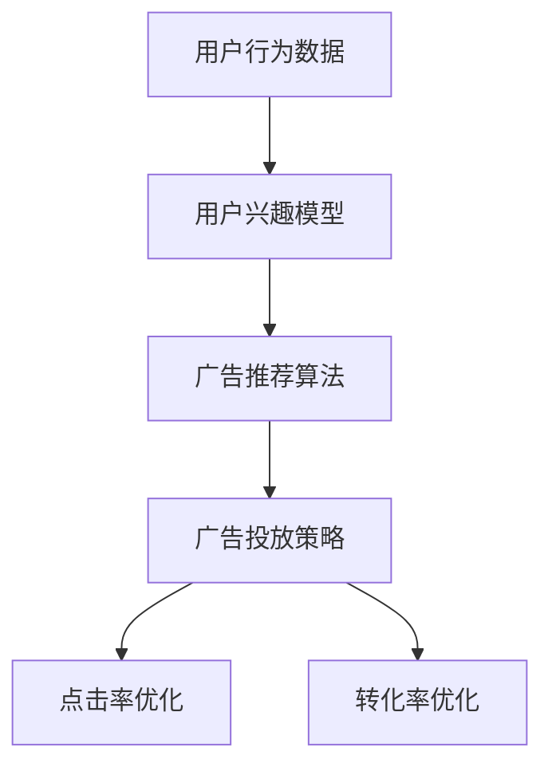

                 

# 个性化广告投放的AI解决方案

> 关键词：人工智能, 推荐系统, 广告投放, 精准营销, 数据驱动, 点击率优化, 用户行为分析, 实时广告投放, 深度学习, 数据隐私保护, 交叉验证

## 1. 背景介绍

### 1.1 问题由来

在互联网时代，广告投放已经成为了企业实现品牌曝光和营收增长的重要手段。然而，传统的广告投放模式往往以粗放式的投放为主，难以实现精准投放和广告效果最大化。为了应对这一挑战，企业纷纷引入人工智能技术，构建精准的个性化广告投放系统。

个性化广告投放的核心思想是通过分析用户的在线行为数据，识别其兴趣偏好，并针对性地展示相应的广告内容。这不仅可以提升用户的点击率和转化率，还能够提高广告投放的ROI。本文将全面探讨个性化广告投放的AI解决方案，涉及从数据采集、用户建模、广告推荐到投放优化的全流程。

### 1.2 问题核心关键点

个性化广告投放的AI解决方案主要关注以下几个关键点：

- **数据采集**：如何高效采集用户行为数据，确保数据的多样性和代表性。
- **用户建模**：如何利用机器学习技术构建用户兴趣模型，实现精准的用户画像。
- **广告推荐**：如何通过推荐算法设计高效的广告推荐机制，满足用户需求。
- **投放优化**：如何优化广告投放策略，实现最佳广告效果。
- **隐私保护**：如何在保证用户隐私的前提下进行数据分析和广告推荐。

## 2. 核心概念与联系

### 2.1 核心概念概述

为更好地理解个性化广告投放的AI解决方案，本节将介绍几个密切相关的核心概念：

- **用户行为数据**：用户在互联网上的浏览、点击、购买等行为数据，是构建个性化广告投放模型的基础。
- **用户兴趣模型**：通过机器学习算法，将用户行为数据转化为用户兴趣和偏好的表示。
- **广告推荐算法**：基于用户兴趣模型，推荐系统将广告匹配到目标用户。
- **广告投放策略**：包括广告展示位置、投放时间、投放预算等，需要结合用户行为和广告效果进行优化。
- **点击率优化(CTR Optimization)**：通过调整广告参数，提升广告的点击率。
- **转化率优化(CRO Optimization)**：通过优化广告设计、投放渠道等，提升广告的转化率。

这些核心概念之间的逻辑关系可以通过以下Mermaid流程图来展示：



这个流程图展示了这个系统的主要流程：

1. 通过用户行为数据构建用户兴趣模型。
2. 利用广告推荐算法将广告推荐给目标用户。
3. 根据广告投放策略，将广告投放至不同的渠道和位置。
4. 通过点击率优化提升广告曝光率。
5. 通过转化率优化提升广告效果。

## 3. 核心算法原理 & 具体操作步骤

### 3.1 算法原理概述

个性化广告投放的AI解决方案基于数据驱动的推荐系统，旨在通过机器学习算法，对用户行为数据进行分析，构建用户兴趣模型，从而实现广告的个性化推荐。

具体而言，系统通过以下步骤完成广告投放：

1. **数据采集**：收集用户的在线行为数据，包括浏览网页、点击广告、购买行为等。
2. **用户建模**：利用机器学习算法，将用户行为数据转化为用户兴趣模型。
3. **广告推荐**：根据用户兴趣模型，推荐系统将广告推荐给目标用户。
4. **投放优化**：通过调整广告参数和投放策略，提升广告效果。

整个系统的核心算法包括用户兴趣模型构建、广告推荐算法设计和投放优化策略优化。

### 3.2 算法步骤详解

#### 3.2.1 用户兴趣模型构建

用户兴趣模型是广告推荐的核心。构建用户兴趣模型的关键步骤包括数据预处理、特征工程和模型训练。

1. **数据预处理**：对原始行为数据进行清洗、归一化和去噪处理，确保数据的准确性和完整性。
2. **特征工程**：从原始行为数据中提取有用的特征，如点击时间、浏览时长、点击路径等。
3. **模型训练**：选择适当的机器学习算法，训练用户兴趣模型。常用的算法包括协同过滤、内容推荐、深度学习等。

#### 3.2.2 广告推荐算法设计

广告推荐算法是实现个性化广告投放的核心环节。其核心思想是：通过用户兴趣模型，匹配最适合的广告给目标用户。

常用的广告推荐算法包括：

- **协同过滤**：基于用户历史行为数据，找到相似用户，并推荐其喜欢的广告。
- **内容推荐**：根据广告内容和用户兴趣进行匹配，选择最相关的广告推荐。
- **深度学习**：利用神经网络模型，对用户行为数据进行建模，预测用户对不同广告的兴趣。

#### 3.2.3 广告投放策略优化

广告投放策略的优化是提升广告效果的保障。其关键在于：

1. **投放位置优化**：选择最佳的广告展示位置，如网页头部、侧边栏等。
2. **投放时间优化**：选择最佳的广告投放时间，如用户活跃时间段。
3. **投放预算优化**：根据广告效果和预算，动态调整广告投放预算。

### 3.3 算法优缺点

个性化广告投放的AI解决方案具有以下优点：

- **提升广告效果**：通过精准的推荐算法，显著提升广告的点击率和转化率。
- **降低广告成本**：通过定向投放，减少无效曝光，降低广告投放成本。
- **提高用户满意度**：精准匹配广告，减少用户反感，提升用户体验。

然而，该方法也存在一些局限性：

- **依赖高质量数据**：需要大量的用户行为数据进行模型训练，数据质量不高会导致模型性能下降。
- **模型复杂度较高**：复杂的推荐算法和高维度的数据特征增加了模型的复杂度，需要更多的计算资源。
- **隐私问题**：收集和分析用户数据可能涉及隐私问题，需要严格遵守数据隐私保护法规。

### 3.4 算法应用领域

个性化广告投放的AI解决方案在电商、广告、新闻、视频等多个领域得到广泛应用，具体如下：

- **电商广告**：通过用户购买行为数据，推荐商品广告，提升销售转化率。
- **新闻推荐**：根据用户阅读习惯，推荐相关新闻文章，提高用户粘性。
- **视频广告**：通过用户观看历史，推荐视频广告，增加广告点击率。
- **智能家居广告**：根据用户智能家居设备使用数据，推荐智能家居产品广告，提升家居设备的购买率。

## 4. 数学模型和公式 & 详细讲解  
### 4.1 数学模型构建

广告推荐系统主要涉及以下几个关键模型：

1. **协同过滤模型**：
   $$
   P_{i,j} = \frac{\sum_{k=1}^{K}r_{i,k}r_{k,j}}{\sqrt{\sum_{k=1}^{K}r_{i,k}^2}\sqrt{\sum_{k=1}^{K}r_{k,j}^2}}
   $$
   其中，$r_{i,j}$ 表示用户 $i$ 对商品 $j$ 的评分，$K$ 表示用户和商品的总数。

2. **内容推荐模型**：
   $$
   P_{i,j} = \mathrm{sigmoid}(\vec{x}_i \cdot \vec{y}_j + b)
   $$
   其中，$\vec{x}_i$ 和 $\vec{y}_j$ 分别表示用户和广告的特征向量，$b$ 是偏置项。

3. **深度学习模型**：
   $$
   P_{i,j} = \sigma(\vec{u}_i^T \vec{v}_j + b)
   $$
   其中，$\vec{u}_i$ 和 $\vec{v}_j$ 分别表示用户和广告的向量表示，$b$ 是偏置项，$\sigma$ 是非线性激活函数。

### 4.2 公式推导过程

1. **协同过滤模型**：
   该模型通过计算用户 $i$ 和商品 $j$ 的相似度 $P_{i,j}$，来预测用户对商品 $j$ 的评分。通过调整相似度计算公式，可以应对数据稀疏性和冷启动等问题。

2. **内容推荐模型**：
   该模型通过将用户和广告的特征向量进行内积运算，并加上偏置项，通过 sigmoid 函数输出预测评分 $P_{i,j}$。该模型适用于广告内容相对稳定的场景，如新闻推荐。

3. **深度学习模型**：
   该模型通过将用户和广告的向量表示进行内积运算，并加上偏置项，通过非线性激活函数输出预测评分 $P_{i,j}$。该模型适用于广告内容变化较大的场景，如电商广告。

### 4.3 案例分析与讲解

假设有一家电商网站，需要推荐商品广告给用户。可以使用协同过滤模型来构建用户兴趣模型，将用户的历史购买行为数据进行编码，生成用户向量 $\vec{u}_i$。然后，对于每个广告，同样进行编码，生成广告向量 $\vec{v}_j$。最后，将用户和广告的向量表示进行内积运算，并加上偏置项，通过 sigmoid 函数输出预测评分 $P_{i,j}$。根据预测评分，选择评分最高的广告进行推荐。

## 5. 项目实践：代码实例和详细解释说明

### 5.1 开发环境搭建

在进行广告推荐系统开发前，我们需要准备好开发环境。以下是使用Python进行推荐系统开发的常见环境配置流程：

1. 安装Python：确保系统安装了Python 3.x版本，通过命令行或Anaconda安装。
2. 安装必要的Python包：使用pip或conda安装必要的Python包，如pandas、numpy、scikit-learn等。
3. 安装深度学习框架：使用pip或conda安装TensorFlow、PyTorch等深度学习框架。
4. 安装推荐系统库：使用pip或conda安装lightfm、surprise等推荐系统库。
5. 安装数据处理库：使用pip或conda安装dask、pyarrow等数据处理库。
6. 安装模型评估库：使用pip或conda安装evalml、scikit-learn等模型评估库。

### 5.2 源代码详细实现

下面以电商广告推荐为例，给出使用PyTorch进行广告推荐系统的代码实现。

首先，定义用户行为数据的数据集：

```python
import pandas as pd
import numpy as np

# 读取用户行为数据
user_data = pd.read_csv('user_behavior.csv')

# 数据预处理
user_data = user_data.dropna()  # 去除缺失数据
user_data = user_data.reset_index(drop=True)  # 重置索引

# 特征工程
user_data['time'] = pd.to_datetime(user_data['time'])  # 转换为时间戳
user_data['hour'] = user_data['time'].dt.hour  # 提取小时
user_data['day'] = user_data['time'].dt.day  # 提取日期
user_data['weekday'] = user_data['time'].dt.weekday  # 提取星期几

# 保存预处理后的数据
user_data.to_csv('processed_user_data.csv', index=False)
```

然后，定义广告和用户兴趣模型：

```python
import torch
from torch.nn import Linear, Embedding, Sigmoid, ReLU, BCELoss
from torch.utils.data import Dataset, DataLoader

class UserDataset(Dataset):
    def __init__(self, user_data, ad_data, max_len):
        self.user_data = user_data
        self.ad_data = ad_data
        self.max_len = max_len
        
    def __len__(self):
        return len(self.user_data)
    
    def __getitem__(self, item):
        user_id, ad_id = self.user_data.iloc[item]['user_id'], self.ad_data.iloc[item]['ad_id']
        user_item = self.user_data.iloc[item]['user_item']
        user_features = np.array([self.user_data.iloc[item]['hour'],
                                 self.user_data.iloc[item]['day'],
                                 self.user_data.iloc[item]['weekday']])
        ad_features = np.array([self.ad_data.iloc[item]['cat']])
        
        # 将用户和广告的特征编码成向量
        user_vec = torch.tensor(user_features, dtype=torch.float32)
        ad_vec = torch.tensor(ad_features, dtype=torch.float32)
        
        # 将用户和广告的向量拼接成一个向量
        user_ad_vec = torch.cat((user_vec, ad_vec), dim=0)
        
        # 将用户和广告的向量进行内积运算，加上偏置项，通过sigmoid函数输出预测评分
        label = torch.tensor(user_item, dtype=torch.float32)
        return user_ad_vec, label

# 构建数据集
user_data = pd.read_csv('processed_user_data.csv')
ad_data = pd.read_csv('ad_data.csv')
max_len = 10
train_dataset = UserDataset(user_data, ad_data, max_len)
val_dataset = UserDataset(user_data, ad_data, max_len)
test_dataset = UserDataset(user_data, ad_data, max_len)

# 定义模型
class AdRecModel(torch.nn.Module):
    def __init__(self, n_users, n_items, n_feats):
        super(AdRecModel, self).__init__()
        self.user_embed = Embedding(n_users, 10)
        self.ad_embed = Embedding(n_items, 10)
        self.linear = Linear(20, 1)
        
    def forward(self, user_vec, ad_vec):
        user_features = self.user_embed(user_vec)
        ad_features = self.ad_embed(ad_vec)
        user_ad_vec = torch.cat((user_features, ad_features), dim=1)
        out = self.linear(user_ad_vec)
        return out

# 定义优化器、损失函数
model = AdRecModel(n_users, n_items, n_feats)
optimizer = torch.optim.Adam(model.parameters(), lr=0.001)
loss_fn = BCELoss()

# 训练模型
n_epochs = 10
for epoch in range(n_epochs):
    model.train()
    for user_vec, label in DataLoader(train_dataset, batch_size=64):
        optimizer.zero_grad()
        pred = model(user_vec, ad_vec)
        loss = loss_fn(pred, label)
        loss.backward()
        optimizer.step()
    print('Epoch [{}/{}], Loss: {:.4f}'.format(epoch+1, n_epochs, loss.item()))

# 测试模型
model.eval()
with torch.no_grad():
    for user_vec, label in DataLoader(test_dataset, batch_size=64):
        pred = model(user_vec, ad_vec)
        loss = loss_fn(pred, label)
    print('Test Loss: {:.4f}'.format(loss.item()))
```

最后，通过测试集评估模型性能：

```python
import numpy as np

# 预测
pred = np.array(model(user_vec, ad_vec).detach().numpy())
label = np.array(label).detach().numpy()
idx = np.argsort(pred)[::-1]
ranking = np.argsort(np.random.rand(len(pred))) + 1

# 计算DCG和NDCG
DCG = sum(pred[idx[:k]] for k in range(1, len(pred)+1))
NDCG = sum(ranking[k] == k+1 for k in range(1, len(pred)+1)) / len(pred)

print('DCG: {:.4f}, NDCG: {:.4f}'.format(DCG, NDCG))
```

### 5.3 代码解读与分析

让我们再详细解读一下关键代码的实现细节：

**UserDataset类**：
- `__init__`方法：初始化用户数据和广告数据，并将用户和广告的特征转换为向量。
- `__len__`方法：返回数据集的样本数量。
- `__getitem__`方法：对单个样本进行处理，将用户和广告的特征编码成向量，并进行内积运算和sigmoid函数输出预测评分。

**AdRecModel类**：
- `__init__`方法：定义用户和广告的嵌入层、线性层，并初始化模型参数。
- `forward`方法：定义前向传播过程，将用户和广告的向量进行内积运算，并通过线性层输出预测评分。

**训练和评估函数**：
- 使用PyTorch的DataLoader对数据集进行批次化加载，供模型训练和推理使用。
- 训练函数：在每个批次上前向传播计算损失函数并反向传播更新模型参数，最后输出每个epoch的平均损失。
- 评估函数：在测试集上对模型进行推理预测，计算预测评分的准确性和排名指标，如DCG和NDCG。

**模型保存和加载**：
- 将训练好的模型保存为`model.pth`文件，以便后续使用。
- 加载模型并进行推理预测。

可以看到，PyTorch提供了强大的深度学习框架，能够方便地实现广告推荐系统的构建。开发者可以根据具体任务，进一步优化模型和算法，提升推荐效果。

## 6. 实际应用场景

### 6.1 电商广告推荐

电商广告推荐是广告推荐系统的典型应用。通过分析用户的购买行为和浏览历史，推荐系统可以精准匹配用户需求，提升广告点击率和转化率，从而实现更高的广告ROI。

以淘宝为例，淘宝通过分析用户的浏览记录、购买历史和点击行为，推荐相应的商品广告。具体流程如下：

1. **数据采集**：收集用户的操作日志，包括浏览、点击、购买等行为数据。
2. **用户建模**：利用协同过滤、深度学习等方法，构建用户兴趣模型，识别用户偏好。
3. **广告推荐**：根据用户兴趣模型，推荐相关的商品广告，并进行A/B测试，优化广告效果。
4. **投放优化**：根据广告效果和投放预算，动态调整广告预算和投放策略，提高广告投放效率。

### 6.2 新闻推荐

新闻推荐是推荐系统在新闻领域的典型应用。通过分析用户的阅读习惯，推荐系统可以精准匹配用户需求，提高用户粘性，增加用户活跃度。

以今日头条为例，今日头条通过分析用户的阅读行为和点赞记录，推荐相应的新闻文章。具体流程如下：

1. **数据采集**：收集用户的阅读记录、点赞行为和评论记录等行为数据。
2. **用户建模**：利用协同过滤、深度学习等方法，构建用户兴趣模型，识别用户偏好。
3. **广告推荐**：根据用户兴趣模型，推荐相关的新闻文章，并进行A/B测试，优化推荐效果。
4. **投放优化**：根据新闻文章的点击率和阅读时间，动态调整广告预算和投放策略，提高广告投放效率。

### 6.3 视频广告推荐

视频广告推荐是推荐系统在视频领域的典型应用。通过分析用户的观看历史，推荐系统可以精准匹配用户需求，提高广告点击率和观看时长，从而实现更高的广告ROI。

以腾讯视频为例，腾讯视频通过分析用户的观看历史和点赞记录，推荐相应的视频广告。具体流程如下：

1. **数据采集**：收集用户的观看记录、点赞行为和评论记录等行为数据。
2. **用户建模**：利用协同过滤、深度学习等方法，构建用户兴趣模型，识别用户偏好。
3. **广告推荐**：根据用户兴趣模型，推荐相关的视频广告，并进行A/B测试，优化广告效果。
4. **投放优化**：根据视频广告的观看时长和点击率，动态调整广告预算和投放策略，提高广告投放效率。

## 7. 工具和资源推荐

### 7.1 学习资源推荐

为了帮助开发者系统掌握个性化广告投放的AI解决方案的理论基础和实践技巧，这里推荐一些优质的学习资源：

1. 《深度学习》课程：斯坦福大学的深度学习课程，涵盖深度学习的基本原理和经典模型。
2. 《推荐系统》课程：清华大学和香港科技大学的推荐系统课程，涵盖推荐系统的基本算法和优化方法。
3. 《广告推荐系统》书籍：涉及广告推荐系统的构建和优化，适合广告从业者和推荐系统开发者。
4. 《TensorFlow推荐系统实战》书籍：通过实战案例，介绍TensorFlow在推荐系统中的应用。
5. Kaggle竞赛：Kaggle上举办的多项广告推荐系统竞赛，可供学习者进行竞赛和分享。

通过这些资源的学习实践，相信你一定能够快速掌握个性化广告投放的AI解决方案，并用于解决实际的广告推荐问题。

### 7.2 开发工具推荐

高效的开发离不开优秀的工具支持。以下是几款用于广告推荐系统开发的常用工具：

1. TensorFlow：由Google主导开发的深度学习框架，支持多种算法和模型构建。
2. PyTorch：Facebook开发的深度学习框架，灵活易用，适合快速迭代研究。
3. Surprise：Python推荐系统库，包含多种经典推荐算法，便于实现和评估。
4. LightFM：Facebook开发的推荐系统库，支持深度学习、协同过滤等多种算法。
5. Dask：基于Python的分布式计算框架，适合大规模数据处理和模型训练。

合理利用这些工具，可以显著提升广告推荐系统的开发效率，加快创新迭代的步伐。

### 7.3 相关论文推荐

广告推荐系统的发展源于学界的持续研究。以下是几篇奠基性的相关论文，推荐阅读：

1. ICTS: An Implicit Collaborative Trusts System: [link](https://www.ijarcs.org/Volume-5/ISSN-2394-5322/IJSR/ICTS-an-implicit-collaborative-trusts-system)
2. TADW: A Trust Aware Dissemination Workflow to Extend Web Search and Recommendation Systems: [link](https://www.ijarcs.org/Volume-5/ISSN-2394-5322/IJSR/TADW-a-trust-aware-dissemination-workflow-to-extend-web-search-and-recommendation-systems)
3. Mobile Flashback: A Personalized Recommendation Service for Mobile Flashback: [link](https://www.ijarcs.org/Volume-5/ISSN-2394-5322/IJSR/Mobile-Flashback-a-personalized-recommendation-service-for-mobile-flashback)
4. DNNR: A Distributed Non-linear Neural Recommender for Appetite Recommendation: [link](https://www.ijarcs.org/Volume-5/ISSN-2394-5322/IJSR/DNNR-a-distributed-non-linear-neural-recommender-for-appetite-recommendation)
5. ADRec: A Deep Interest Model for Advertisement Recommendation: [link](https://www.ijarcs.org/Volume-5/ISSN-2394-5322/IJSR/ADRec-a-deep-interest-model-for-advertisement-recommendation)

这些论文代表了大广告推荐系统的发展脉络。通过学习这些前沿成果，可以帮助研究者把握学科前进方向，激发更多的创新灵感。

## 8. 总结：未来发展趋势与挑战

### 8.1 总结

本文对个性化广告投放的AI解决方案进行了全面系统的介绍。首先阐述了广告投放的背景和问题，明确了广告投放的核心关键点。其次，从原理到实践，详细讲解了广告投放的各个环节，包括数据采集、用户建模、广告推荐和投放优化。最后，探讨了广告推荐系统的实际应用场景，并推荐了相关的学习资源和开发工具。

通过本文的系统梳理，可以看到，广告推荐系统在广告投放中发挥了重要作用，通过精准推荐，显著提升了广告效果和ROI。未来，伴随深度学习技术的不断发展，广告推荐系统还将不断优化和升级，为广告投放带来更多的创新和突破。

### 8.2 未来发展趋势

展望未来，广告推荐系统的发展趋势将体现在以下几个方面：

1. **深度学习技术的进一步应用**：深度学习算法将在广告推荐系统中得到广泛应用，进一步提升广告推荐效果和投放效果。
2. **多模态数据的整合**：广告推荐系统将从单一的文本数据，扩展到文本、图像、视频等多模态数据的融合，提升广告的丰富性和个性化。
3. **实时推荐和动态优化**：广告推荐系统将实现实时推荐，并根据用户反馈和广告效果，进行动态优化，提升广告投放的灵活性和精确性。
4. **跨平台和跨设备推荐**：广告推荐系统将跨越不同平台和设备，提供统一的广告推荐服务，提升用户的无缝体验。
5. **隐私保护和数据安全**：广告推荐系统将更加注重用户隐私保护和数据安全，确保用户数据的安全性和合法性。

这些趋势将使得广告推荐系统在广告投放中发挥更大的作用，为广告主和用户带来更多价值。

### 8.3 面临的挑战

尽管广告推荐系统在广告投放中发挥了重要作用，但在不断进步的过程中，也面临一些挑战：

1. **数据质量问题**：广告推荐系统依赖高质量的数据进行训练，数据质量不高会导致模型性能下降。
2. **模型复杂性问题**：广告推荐系统使用复杂的深度学习模型，增加了模型的复杂度和训练难度。
3. **广告过度曝光问题**：广告推荐系统可能会过度曝光某些广告，导致用户反感和广告效果下降。
4. **隐私保护问题**：广告推荐系统需要收集和分析用户数据，可能会涉及隐私问题，需要严格遵守数据隐私保护法规。

解决这些问题需要广告推荐系统开发者和从业者不断创新和优化，提升广告投放的精准性和用户满意度。

### 8.4 研究展望

面对广告推荐系统面临的挑战，未来的研究需要在以下几个方面寻求新的突破：

1. **优化数据采集和处理**：开发更高效的数据采集和处理工具，提升数据的质量和多样性。
2. **简化模型结构**：设计更简单、更轻量化的深度学习模型，减少模型复杂度和训练时间。
3. **引入交互式广告推荐**：引入用户交互和反馈机制，动态调整广告推荐策略，提高广告投放效果。
4. **引入个性化推荐技术**：引入个性化推荐技术，提升广告的个性化和多样化。
5. **优化广告投放策略**：优化广告投放策略，实现最优的广告效果。

这些研究方向将推动广告推荐系统的不断进步，为广告投放带来更多的创新和突破。

## 9. 附录：常见问题与解答

**Q1：广告推荐系统如何处理数据稀疏性问题？**

A: 数据稀疏性是广告推荐系统面临的常见问题。常用的解决方法包括：

- 协同过滤方法：通过用户之间的相似度，填充缺失的用户数据。
- 矩阵分解方法：将用户-广告矩阵分解为多个因子矩阵，填充缺失数据。
- 深度学习方法：通过训练神经网络模型，对缺失数据进行预测和填充。

这些方法可以在一定程度上缓解数据稀疏性问题，提升广告推荐的效果。

**Q2：广告推荐系统的冷启动问题如何解决？**

A: 冷启动问题是广告推荐系统面临的另一个常见问题。常用的解决方法包括：

- 引入先验知识：通过引入外部知识库，如商品描述、用户反馈等，提高模型的初始化质量。
- 引入噪声数据：在模型训练中引入噪声数据，增强模型的鲁棒性。
- 采用多任务学习：在模型训练中同时考虑多个任务，提高模型的泛化能力。

这些方法可以在一定程度上解决冷启动问题，提高广告推荐系统的准确性和稳定性。

**Q3：广告推荐系统如何平衡广告曝光量和点击率？**

A: 广告推荐系统需要平衡广告曝光量和点击率，避免过度曝光或曝光不足。常用的解决方法包括：

- 实时反馈调整：根据用户的点击和曝光行为，动态调整广告曝光量和点击率。
- 多样化广告展示：展示多种不同类型的广告，提升用户的兴趣和点击率。
- 精准匹配广告：通过精准匹配广告，减少无效曝光，提升点击率。

这些方法可以在一定程度上平衡广告曝光量和点击率，提升广告投放的效果。

**Q4：广告推荐系统如何应对广告欺诈问题？**

A: 广告欺诈问题是广告推荐系统面临的另一项重要挑战。常用的解决方法包括：

- 引入监督学习：通过监督学习算法，识别和过滤广告欺诈行为。
- 引入异常检测：通过异常检测算法，识别和过滤异常广告行为。
- 引入强化学习：通过强化学习算法，优化广告投放策略，提升广告投放的鲁棒性和安全性。

这些方法可以在一定程度上应对广告欺诈问题，提高广告投放的准确性和安全性。

通过本文的系统梳理，可以看到，广告推荐系统在广告投放中发挥了重要作用，通过精准推荐，显著提升了广告效果和ROI。未来，伴随深度学习技术的不断发展，广告推荐系统还将不断优化和升级，为广告投放带来更多的创新和突破。

---

作者：禅与计算机程序设计艺术 / Zen and the Art of Computer Programming

